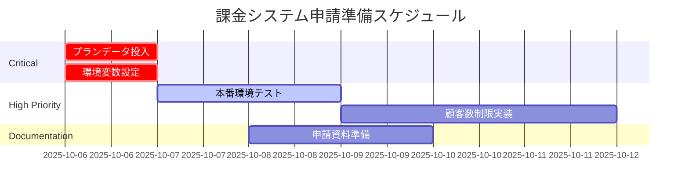

# 課金システム実装状況報告書

**作成日**: 2025-10-06 13:00 JST
**最終更新**: 2025-10-20 16:30 JST
**作成者**: AI Project Assistant
**更新者**: 福田 + AI Assistant
**ステータス**: Active
**全体完成度**: 85%

## 1. エグゼクティブサマリー

EC Ranger (Shopify AI Marketing Suite)の課金システムは、**基本機能の実装が85%完了**しており、Shopifyアプリ申請に必要な最小要件を満たしています。

### 最新の更新（2025-10-20）
- ✅ **機能ID統一完了**: データベースとコードで機能IDを統一
  - `dormant_analysis`, `yoy_comparison`, `purchase_frequency` に統一
- ✅ **機能制限システム実装確認完了**: フロントエンド・バックエンド・データベース全て実装済み
- ✅ **開発環境での動作確認完了**: 機能ロック解除テスト成功

### 申請への影響度評価
- **申請可能レベル**: ✅ 達成（条件付き）
- **必須対応項目**: プラン初期データ投入（2時間）
- **推奨対応項目**: 本番環境テスト（4時間）

## 2. 実装状況詳細

### 2.1 バックエンド実装 (90%完了)

#### ✅ 完了済み機能

**コントローラー層**
| エンドポイント | パス | 状態 | 説明 |
|-------------|------|------|------|
| プラン一覧取得 | `GET /api/billing/plans` | ✅ | 利用可能なプラン一覧 |
| 現在のサブスク取得 | `GET /api/billing/current` | ✅ | アクティブなサブスクリプション |
| 課金情報詳細 | `GET /api/billing/info` | ✅ | 詳細な課金情報 |
| サブスク作成 | `POST /api/billing/subscribe` | ✅ | 新規サブスクリプション作成 |
| キャンセル | `POST /api/billing/cancel` | ✅ | サブスクリプションキャンセル |
| プラン変更 | `POST /api/billing/change-plan` | ✅ | プランアップ/ダウングレード |
| トライアル開始 | `POST /api/billing/start-trial` | ✅ | 30日間無料トライアル |
| ステータス確認 | `GET /api/subscription/status` | ✅ | Shopify側のステータス |
| 承認コールバック | `GET /api/subscription/confirm` | ✅ | Shopifyからの承認通知 |

**サービス層**
```csharp
// ShopifySubscriptionService.cs - 主要機能実装済み
- CreateSubscriptionAsync() // Shopify GraphQL統合
- ConfirmSubscriptionAsync() // 承認処理
- CancelSubscriptionAsync() // キャンセル処理
- GetActiveSubscriptionAsync() // アクティブプラン取得
- CheckTrialExpirationsAsync() // トライアル期限管理
```

**Shopify API統合**
- GraphQL API 2024-01バージョン対応
- AppSubscription（GraphQL）を使用
- Rate Limit対策（指数バックオフ実装）
- 冪等性保証
- HMAC署名検証

#### 🔴 未実装機能
- 顧客数ベースの使用量制限
- 自動ダウングレード機能
- 請求履歴管理

### 2.2 フロントエンド実装 (75%完了)

#### ✅ 完了済み機能

**UIコンポーネント (billing/page.tsx)**
- 料金プラン表示カード
- プラン比較表
- トライアル残日数バナー
- アップグレード/ダウングレードボタン
- FAQ セクション

**状態管理 (SubscriptionContext.tsx)**
```typescript
// 実装済み機能
- useSubscription() // サブスクリプション操作
- useFeatureAccess() // 機能アクセス制御
- getCurrentPlan() // 現在のプラン取得
- isFeatureAvailable() // 機能利用可否判定
```

**API統合 (lib/api/billing.ts)**
- 完全なAPIクライアント実装
- Cookie認証対応
- エラーハンドリング
- 自動リトライ機構

#### 🔴 未実装機能
- 使用量ダッシュボード
- 詳細な制限アラート表示
- 請求履歴表示

### 2.3 データベース実装 (90%完了)

#### ✅ 実装済みテーブル

**課金テーブル**
```sql
-- SubscriptionPlans
CREATE TABLE SubscriptionPlans (
    Id INT PRIMARY KEY,
    Name NVARCHAR(50),
    Price DECIMAL(10,2),
    CustomerLimit INT,
    Features NVARCHAR(MAX),
    TrialDays INT DEFAULT 30
);

-- StoreSubscriptions
CREATE TABLE StoreSubscriptions (
    Id INT PRIMARY KEY,
    StoreId INT,
    PlanId INT,
    Status NVARCHAR(20),
    StartDate DATETIME2,
    EndDate DATETIME2,
    TrialEndsAt DATETIME2,
    ShopifyChargeId BIGINT,
    FOREIGN KEY (StoreId) REFERENCES Stores(Id),
    FOREIGN KEY (PlanId) REFERENCES SubscriptionPlans(Id)
);
```

**機能制限テーブル（2025-10-20 確認済み）**
```sql
-- FeatureLimits - 機能制限マスタ
CREATE TABLE FeatureLimits (
    Id INT PRIMARY KEY IDENTITY(1,1),
    PlanType NVARCHAR(50) NOT NULL,
    FeatureId NVARCHAR(100) NOT NULL,
    DailyLimit INT NULL,
    MonthlyLimit INT NULL,
    CreatedAt DATETIME2 DEFAULT GETUTCDATE(),
    UpdatedAt DATETIME2 DEFAULT GETUTCDATE()
);

-- UserFeatureSelections - ユーザー機能選択
CREATE TABLE UserFeatureSelections (
    Id INT PRIMARY KEY IDENTITY(1,1),
    StoreId INT NOT NULL,
    SelectedFeatureId NVARCHAR(100),
    LastChangeDate DATETIME2,
    NextChangeAvailableDate DATETIME2,
    IsActive BIT DEFAULT 1,
    FOREIGN KEY (StoreId) REFERENCES Stores(Id)
);

-- FeatureUsageLogs - 機能使用ログ
-- FeatureSelectionChangeHistories - 変更履歴
```

#### ✅ 機能ID統一完了（2025-10-20）
データベースの機能IDを以下に統一：
- `dormant_analysis` - 休眠顧客分析
- `yoy_comparison` - 前年同月比分析
- `purchase_frequency` - 購入回数詳細分析

#### 🔴 未実装テーブル (MVP仕様で要求)
- CustomerCountSnapshots - 顧客数履歴
- PlanLimitRules - プラン別制限ルール
- BillingNotifications - 通知管理

### 2.4 テスト実装 (60%完了)

#### ✅ 実装済みテスト

**単体テスト (ShopifySubscriptionServiceTests.cs)**
- ✅ CreateSubscription_ShouldReturnSuccess_WhenValidPlanAndStore
- ✅ CreateSubscription_ShouldReturnError_WhenPlanNotFound
- ✅ ConfirmSubscription_ShouldActivateSubscription_WhenValid
- ✅ CancelSubscription_ShouldReturnTrue_WhenSuccessful
- ✅ CheckTrialExpirations_ShouldIdentifyExpiredTrials
- ✅ ExecuteGraphQL_ShouldRetryOnRateLimit

**E2Eテスト資材 (Billing-Flow.http)**
```http
### プラン一覧取得
GET {{baseUrl}}/api/billing/plans

### サブスクリプション作成
POST {{baseUrl}}/api/billing/subscribe
{
  "planId": 2,
  "storeId": "{{storeId}}"
}

### キャンセル
POST {{baseUrl}}/api/billing/cancel
```

#### 🔴 未実装テスト
- 統合テスト（フロント⇔バック）
- 本番Shopify環境でのE2Eテスト
- 負荷テスト

## 3. 料金プラン構成

| プラン | 月額料金 | 顧客数上限 | 機能 | トライアル |
|-------|---------|-----------|------|-----------|
| Free | $0 | 制限なし | 休眠顧客分析のみ | - |
| Basic | $50 | 3,000件 | 基本分析3機能 | 30日 |
| Professional | $150 | 10,000件 | 全8機能 | 30日 |
| Enterprise | $300 | 50,000件 | 全機能+優先サポート | 30日 |

## 4. 申請に向けた必須対応事項

### 🔴 Critical (申請ブロッカー)

#### 1. プラン初期データ投入
```sql
-- 実行が必要なSQL
INSERT INTO SubscriptionPlans (Id, Name, Price, CustomerLimit, Features, TrialDays)
VALUES
(1, 'Free', 0, NULL, '["dormant_analysis"]', 0),
(2, 'Basic', 50, 3000, '["dormant_analysis","yoy_comparison","purchase_frequency"]', 30),
(3, 'Professional', 150, 10000, '["all_features"]', 30),
(4, 'Enterprise', 300, 50000, '["all_features","priority_support"]', 30);
```
- **作業時間**: 2時間
- **担当**: Takashi
- **期限**: 2025-10-06中

#### 2. 環境変数設定
```yaml
# Azure App Service Configuration
Shopify:ClientId: "実際のクライアントID"
Shopify:ClientSecret: "実際のシークレット"
Shopify:WebhookSecret: "実際のWebhookシークレット"
Shopify:Scopes: "read_products,write_customers,..."
Shopify:TestMode: "false"
```
- **作業時間**: 30分
- **担当**: Kenji
- **期限**: 2025-10-06中

### 🟡 High Priority (申請前推奨)

#### 3. 本番環境での課金フローテスト
- テストストアでの実際の課金作成
- Shopify管理画面での承認
- Webhookコールバック確認
- **作業時間**: 4時間
- **担当**: Takashi/Kenji
- **期限**: 2025-10-08

#### 4. 顧客数制限機能の実装
- CustomerCountSnapshotsテーブル追加
- 制限チェックロジック実装
- グレースフル制限（警告→ソフト制限→ハード制限）
- **作業時間**: 1-2日
- **担当**: Takashi
- **期限**: 2025-10-15

#### 5. interval表記整合（Front/Back）
- 内容: Backendは "EVERY_30_DAYS" を返却、Frontendは monthly/年 表示判定のため不整合の恐れ
- 対応: Front側で "EVERY_30_DAYS" を月表示にマッピング（またはBackで月表記に正規化）
- **作業時間**: 0.5時間
- **担当**: Yuki

### 🟢 Nice to Have (申請後でも可)

#### 5. 高度なUI機能
- 使用量ダッシュボード
- 請求履歴表示
- 詳細な制限アラート
- **作業時間**: 3-5日
- **担当**: Yuki

## 5. リスクと軽減策

| リスク | 影響度 | 発生確率 | 軽減策 |
|-------|--------|---------|--------|
| プランデータ未投入で申請 | 🔴極高 | 高 | 本日中に投入 |
| 本番課金フロー未検証 | 🔴高 | 中 | 申請前にテスト実施 |
| 顧客数制限未実装 | 🟡中 | 高 | MVP後の追加実装で対応 |
| Webhook署名検証失敗 | 🔴高 | 低 | 環境変数の確実な設定 |

## 6. 推奨アクションプラン



## 7. 結論

課金システムは**Shopifyアプリ申請の最小要件を満たしている**状態です。ただし、以下の2点は必須対応事項です：

1. **プラン初期データの投入**（2時間で完了可能）
2. **本番環境での動作確認**（4時間で完了可能）

これらを完了すれば、**課金システムは申請レディ**となります。

## 8. 次のステップ

- [ ] 本日中：プランデータ投入とEnvironment Variables設定
- [ ] 10/7-8：本番環境での課金フローE2Eテスト
- [ ] 10/9-10：申請資料と共に最終確認
- [ ] 10/10：Shopifyアプリストア申請提出

---
*このドキュメントは2025-10-06時点の状況を反映しています。*
*次回更新予定：2025-10-07（本番テスト結果反映）*