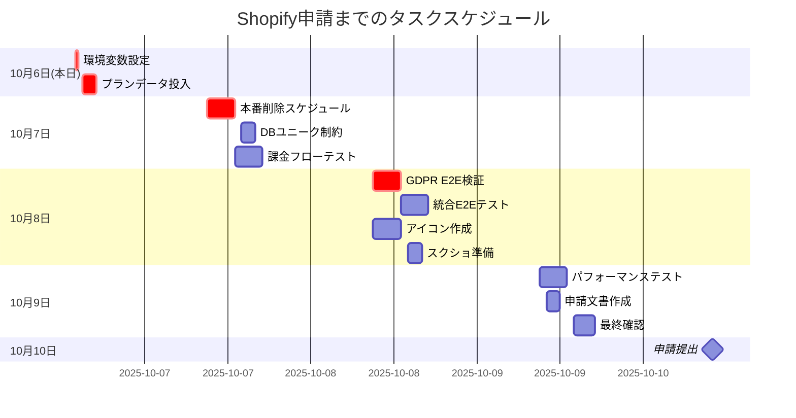

# 🚀 Shopifyアプリ申請 残タスク詳細整理表

**作成日時**: 2025-10-06 13:10 JST
**申請目標日**: 2025-10-10
**全体進捗**: 85%
**残作業見積**: 約3日

---

## 📊 残タスクサマリー

| カテゴリ | 必須タスク数 | 推奨タスク数 | 完了期限 | 責任者 |
|---------|------------|------------|----------|--------|
| **GDPR機能** | 3 | 2 | 10/8 | Takashi |
| **課金機能** | 2 | 2 | 10/7 | Takashi |
| **環境設定** | 1 | 0 | 10/6 | Kenji |
| **テスト検証** | 2 | 2 | 10/9 | 全員 |
| **申請素材** | 3 | 2 | 10/9 | デザイナー/Kenji |

---

## 🔴 GDPR機能 残タスク

### 必須タスク（申請ブロッカー）

#### GDPR-001: 本番削除スケジューリング実装
**担当者**: Takashi
**期限**: 2025-10-07 17:00
**見積時間**: 4時間
**現状**: TODOコメントのまま
**影響**: これがないと申請自動却下

**作業内容**:
```csharp
// 現在のTODO箇所: WebhookController.cs:576-586
// 以下の実装が必要:

// 1. Hangfireジョブ登録メソッドの追加
private void ScheduleDataDeletion(string shopDomain, int daysToDelete)
{
    var deleteDate = DateTime.UtcNow.AddDays(daysToDelete);
    BackgroundJob.Schedule<GdprProcessingJob>(
        job => job.DeleteShopDataAsync(shopDomain),
        deleteDate
    );

    _logger.LogInformation(
        "Scheduled shop data deletion for {Shop} on {Date}",
        shopDomain, deleteDate
    );
}

// 2. customers/redact用
private void ScheduleCustomerDataDeletion(string customerId, int daysToDelete)
{
    var deleteDate = DateTime.UtcNow.AddDays(daysToDelete);
    BackgroundJob.Schedule<GdprProcessingJob>(
        job => job.DeleteCustomerDataAsync(customerId),
        deleteDate
    );
}

// 3. shop/redact用
private void ScheduleShopDataDeletion(string shopDomain, int daysToDelete)
{
    var deleteDate = DateTime.UtcNow.AddDays(daysToDelete);
    BackgroundJob.Schedule<GdprProcessingJob>(
        job => job.DeleteAllShopDataAsync(shopDomain),
        deleteDate
    );
}
```

**確認項目**:
- [ ] GdprProcessingJobに削除メソッドが実装されているか確認
- [ ] Hangfireダッシュボードで登録ジョブが表示されるか確認
- [ ] 削除実行後の監査ログ記録を確認

#### GDPR-002: WebhookEvents.IdempotencyKey ユニーク制約追加
**担当者**: Takashi
**期限**: 2025-10-07 15:00
**見積時間**: 2時間
**現状**: アプリケーション側のみで重複チェック

**作業内容**:
```sql
-- マイグレーションファイル作成
-- 2025-10-07-AddIdempotencyKeyUniqueConstraint.sql

-- ユニークインデックス追加
CREATE UNIQUE INDEX IX_WebhookEvents_IdempotencyKey
ON WebhookEvents(IdempotencyKey)
WHERE IdempotencyKey IS NOT NULL;

-- 既存の重複データがある場合の対処
WITH DuplicateKeys AS (
    SELECT IdempotencyKey, MIN(Id) as KeepId
    FROM WebhookEvents
    WHERE IdempotencyKey IS NOT NULL
    GROUP BY IdempotencyKey
    HAVING COUNT(*) > 1
)
DELETE FROM WebhookEvents
WHERE IdempotencyKey IN (SELECT IdempotencyKey FROM DuplicateKeys)
  AND Id NOT IN (SELECT KeepId FROM DuplicateKeys);
```

**実行環境**:
- [ ] Development環境で実行・検証
- [ ] Staging環境に適用
- [ ] Production環境への適用計画作成

#### GDPR-003: E2E検証と証跡採取
**担当者**: Takashi & Kenji
**期限**: 2025-10-08 17:00
**見積時間**: 4時間
**現状**: 未実施

**検証項目チェックリスト**:
```markdown
## GDPR Webhook E2E検証

### 1. app/uninstalled
- [ ] 正常なHMAC署名で200応答
- [ ] 不正なHMAC署名で401応答
- [ ] 5秒以内の応答時間
- [ ] WebhookEventsテーブルへの記録
- [ ] サブスクリプションキャンセル処理
- [ ] 削除スケジュール登録

### 2. customers/redact
- [ ] 正常なHMAC署名で200応答
- [ ] 顧客IDの正しいパース
- [ ] 削除スケジュール登録（48時間後）
- [ ] 監査ログ記録

### 3. shop/redact
- [ ] 正常なHMAC署名で200応答
- [ ] ショップドメインの正しいパース
- [ ] 削除スケジュール登録（48時間後）
- [ ] 監査ログ記録

### 4. customers/data_request
- [ ] 正常なHMAC署名で200応答
- [ ] データエクスポート処理の開始
- [ ] 10日以内の完了確認

### 5. 冪等性テスト
- [ ] 同一Webhook IDの重複送信で重複記録なし
- [ ] IdempotencyKeyの一意性保証
```

**証跡保存方法**:
- Application Insightsのクエリ結果をCSV保存
- Hangfireダッシュボードのスクリーンショット
- .httpファイル実行結果の保存

### 推奨タスク（品質向上）

#### GDPR-004: 削除処理のタイムアウト対策
**担当者**: Takashi
**期限**: 2025-10-09
**見積時間**: 2時間

```csharp
// 大量データ削除時のタイムアウト対策
public async Task DeleteShopDataAsync(string shopDomain)
{
    using var transaction = await _context.Database.BeginTransactionAsync();
    try
    {
        // バッチ削除（1000件ずつ）
        const int batchSize = 1000;
        int deleted;
        do
        {
            deleted = await _context.Orders
                .Where(o => o.ShopDomain == shopDomain)
                .Take(batchSize)
                .ExecuteDeleteAsync();
        } while (deleted == batchSize);

        await transaction.CommitAsync();
    }
    catch (Exception ex)
    {
        await transaction.RollbackAsync();
        throw;
    }
}
```

#### GDPR-005: 削除完了通知の実装
**担当者**: Takashi
**期限**: 2025-10-10
**見積時間**: 2時間

---

## 💰 課金機能 残タスク

### 必須タスク（申請ブロッカー）

#### BILL-001: プラン初期データ投入
**担当者**: Takashi
**期限**: 2025-10-06 18:00（本日中）
**見積時間**: 2時間
**現状**: SubscriptionPlansテーブルが空
**影響**: 課金機能が一切動作しない

**実行SQL**:
```sql
-- ファイル: 2025-10-06-InsertSubscriptionPlans.sql
-- 実行環境: Development → Staging → Production

BEGIN TRANSACTION;

-- 既存データクリア（開発環境のみ）
-- DELETE FROM SubscriptionPlans WHERE Id IN (1,2,3,4);

-- プランマスターデータ投入
INSERT INTO SubscriptionPlans (Id, Name, DisplayName, Price, CustomerLimit, Features, TrialDays, IsActive, CreatedAt, UpdatedAt)
VALUES
(1, 'free', 'Free', 0.00, NULL,
 '{"features":["dormant_customers"],"limitations":{"api_calls":100,"data_retention_days":30}}',
 0, 1, GETUTCDATE(), GETUTCDATE()),

(2, 'basic', 'Basic', 50.00, 3000,
 '{"features":["dormant_customers","year_over_year","purchase_count"],"limitations":{"api_calls":1000,"data_retention_days":90}}',
 30, 1, GETUTCDATE(), GETUTCDATE()),

(3, 'professional', 'Professional', 150.00, 10000,
 '{"features":["all_analytics","advanced_reports","api_access"],"limitations":{"api_calls":5000,"data_retention_days":365}}',
 30, 1, GETUTCDATE(), GETUTCDATE()),

(4, 'enterprise', 'Enterprise', 300.00, 50000,
 '{"features":["all_analytics","advanced_reports","api_access","priority_support","custom_integrations"],"limitations":{"api_calls":"unlimited","data_retention_days":"unlimited"}}',
 30, 1, GETUTCDATE(), GETUTCDATE());

-- 確認クエリ
SELECT Id, Name, DisplayName, Price, CustomerLimit, TrialDays
FROM SubscriptionPlans
ORDER BY Id;

COMMIT TRANSACTION;
```

**実行手順**:
1. [ ] SQLファイルを作成
2. [ ] Development DBで実行・確認
3. [ ] Staging DBで実行・確認
4. [ ] Production DBで実行・確認
5. [ ] アプリケーションから`GET /api/billing/plans`で確認

#### BILL-002: 本番Shopify課金フローテスト
**担当者**: Takashi & Kenji
**期限**: 2025-10-07 17:00
**見積時間**: 4時間
**現状**: 未実施

**テストシナリオ**:
```markdown
## 課金フローE2Eテスト手順

### 準備
- [ ] テスト用Shopifyストア準備
- [ ] 本番環境のAPI接続確認
- [ ] Shopify Partner Dashboardアクセス確認

### テスト実行

#### 1. 新規サブスクリプション作成
POST /api/billing/subscribe
{
  "planId": 2,
  "storeId": "test-store.myshopify.com",
  "returnUrl": "https://ec-ranger.azurewebsites.net/billing/confirm"
}

期待結果:
- [ ] Shopify課金承認URLが返される
- [ ] URLにリダイレクト可能
- [ ] Shopify管理画面で承認画面表示

#### 2. 課金承認処理
- [ ] Shopifyで「承認」クリック
- [ ] returnUrlへのリダイレクト確認
- [ ] GET /api/subscription/confirm?charge_id=XXX の実行
- [ ] StoreSubscriptionsテーブルのStatus更新確認

#### 3. Webhookコールバック確認
- [ ] app_subscriptions/update Webhook受信
- [ ] HMAC署名検証成功
- [ ] サブスクリプション状態の更新

#### 4. キャンセル処理
POST /api/billing/cancel
{
  "storeId": "test-store.myshopify.com",
  "reason": "Testing cancellation"
}

期待結果:
- [ ] Shopify側でキャンセル処理
- [ ] app_subscriptions/cancelled Webhook受信
- [ ] StoreSubscriptionsのStatus更新
```

### 推奨タスク（品質向上）

#### BILL-003: 顧客数制限チェック実装
**担当者**: Takashi
**期限**: 2025-10-15（申請後でも可）
**見積時間**: 8時間

**実装内容**:
```csharp
// ISubscriptionLimitService.cs
public interface ISubscriptionLimitService
{
    Task<bool> IsWithinLimitAsync(string storeId);
    Task<int> GetCurrentUsageAsync(string storeId);
    Task<int> GetPlanLimitAsync(string storeId);
    Task<LimitCheckResult> CheckLimitAsync(string storeId);
}

public class LimitCheckResult
{
    public bool IsWithinLimit { get; set; }
    public int CurrentUsage { get; set; }
    public int PlanLimit { get; set; }
    public double UsagePercentage { get; set; }
    public string WarningLevel { get; set; } // None, Warning(80%), Critical(95%), Exceeded(100%+)
}
```

#### BILL-004: 使用量ダッシュボード実装
**担当者**: Yuki
**期限**: 2025-10-20（申請後）
**見積時間**: 16時間

---

## 🔧 環境設定 残タスク

### 必須タスク

#### ENV-001: Azure App Service環境変数設定
**担当者**: Kenji
**期限**: 2025-10-06 17:00（本日中）
**見積時間**: 30分
**現状**: 一部未設定または仮値

**設定項目**:
```yaml
# Production環境設定（Azure Portal → App Service → Configuration）

## Shopify関連（必須）
Shopify:ClientId: "実際のクライアントID"
Shopify:ClientSecret: "実際のクライアントシークレット"
Shopify:WebhookSecret: "実際のWebhookシークレット"
Shopify:Scopes: "read_products,write_products,read_customers,write_customers,read_orders"

## URL設定（必須）
SHOPIFY_FRONTEND_BASEURL: "https://ec-ranger.azurestaticapps.net"
ASPNETCORE_URLS: "https://ec-ranger-api.azurewebsites.net"

## データベース接続（必須）
ConnectionStrings:DefaultConnection: "Server=xxx.database.windows.net;Database=ec-ranger;..."

## 課金設定（必須）
BillingSettings:TestMode: "false"
BillingSettings:RequirePayment: "true"

## Hangfire設定（推奨）
Hangfire:DashboardUsername: "admin"
Hangfire:DashboardPassword: "セキュアなパスワード"
```

**確認方法**:
1. [ ] Azure Portalで設定値入力
2. [ ] App Service再起動
3. [ ] `/api/health`エンドポイントで接続確認
4. [ ] Shopify OAuth フロー確認

---

## 🧪 テスト検証 残タスク

### 必須タスク

#### TEST-001: 統合E2Eテスト実施
**担当者**: 全員
**期限**: 2025-10-08 17:00
**見積時間**: 8時間

**テストケース一覧**:
```markdown
## 必須E2Eテストケース

### 認証フロー
- [ ] Shopifyアプリインストール
- [ ] OAuth認証完了
- [ ] アクセストークン取得
- [ ] セッション管理

### 課金フロー
- [ ] 無料プランでの機能制限確認
- [ ] 有料プランへのアップグレード
- [ ] Shopify承認画面
- [ ] 課金Webhook処理

### GDPR準拠
- [ ] 4種のWebhook処理（各5秒以内）
- [ ] データ削除スケジューリング
- [ ] 監査ログ記録

### 機能テスト
- [ ] 休眠顧客分析（無料プラン）
- [ ] 前年同月比分析（有料プラン）
- [ ] データエクスポート
```

#### TEST-002: パフォーマンステスト
**担当者**: Takashi
**期限**: 2025-10-09 15:00
**見積時間**: 4時間

**測定項目**:
- API応答時間（95パーセンタイル < 3秒）
- 同時接続数（100ユーザー）
- Webhook処理時間（< 5秒）

---

## 📦 申請素材 残タスク

### 必須タスク

#### APP-001: アプリアイコン作成
**担当者**: デザイナー
**期限**: 2025-10-08 17:00
**見積時間**: 4時間

**仕様**:
- サイズ: 1024x1024px
- 形式: PNG（透過なし）
- カラー: ブランドカラー使用
- テキスト: "EC Ranger"ロゴ

#### APP-002: スクリーンショット準備
**担当者**: Yuki
**期限**: 2025-10-08 17:00
**見積時間**: 2時間

**必要な画像**（最低3枚）:
1. ダッシュボード画面
2. 休眠顧客分析画面
3. 料金プラン選択画面

**仕様**:
- サイズ: 1280x720px以上
- 形式: PNG or JPEG
- 内容: 実際の動作画面（モックデータ可）

#### APP-003: アプリ説明文作成
**担当者**: Kenji
**期限**: 2025-10-09 12:00
**見積時間**: 2時間

**含める内容**:
- アプリ概要（100文字）
- 詳細説明（500文字）
- 主要機能リスト
- 料金プラン説明
- サポート連絡先

---

## 📅 タイムライン



---

## ✅ 完了確認チェックリスト

### 申請前必須確認項目

#### 技術要件
- [ ] GDPR 4種Webhookすべて200応答（5秒以内）
- [ ] 本番削除スケジューリング実装完了
- [ ] Shopify課金フロー動作確認
- [ ] プランデータ投入完了
- [ ] 環境変数すべて本番値設定

#### テスト要件
- [ ] GDPR E2E検証証跡あり
- [ ] 課金フローE2E完了
- [ ] 統合テスト主要ケース合格
- [ ] パフォーマンス基準達成

#### 申請素材
- [ ] アプリアイコン（1024x1024）
- [ ] スクリーンショット3枚以上
- [ ] アプリ説明文（英語）
- [ ] 利用規約URL
- [ ] プライバシーポリシーURL

---

## 👥 担当者別タスク一覧

### Takashi（バックエンド）
1. 🔴 プランデータ投入（10/6 18:00）
2. 🔴 本番削除スケジューリング（10/7 17:00）
3. 🔴 DBユニーク制約（10/7 15:00）
4. 🔴 GDPR E2E検証（10/8 17:00）
5. 🟡 課金フローテスト（10/7 17:00）
6. 🟢 パフォーマンステスト（10/9 15:00）

### Kenji（PM/インフラ）
1. 🔴 環境変数設定（10/6 17:00）
2. 🔴 GDPR E2E検証支援（10/8 17:00）
3. 🟡 課金フローテスト支援（10/7 17:00）
4. 🔴 申請文書作成（10/9 12:00）
5. 🟢 最終確認・申請提出（10/10 10:00）

### Yuki（フロントエンド）
1. 🔴 スクリーンショット準備（10/8 17:00）
2. 🟡 統合E2Eテスト参加（10/8 17:00）
3. 🟢 使用量ダッシュボード（申請後）

### デザイナー
1. 🔴 アプリアイコン作成（10/8 17:00）
2. 🟢 追加素材作成（必要に応じて）

---

## 📞 エスカレーション

問題発生時の連絡先：
1. 技術的問題 → Takashi → Kenji
2. 申請関連 → Kenji → 福田
3. 緊急時 → 全員Slackで共有

---

*このドキュメントは2025-10-06 13:10 JSTに作成されました*
*次回更新: 各タスク完了時に随時更新*