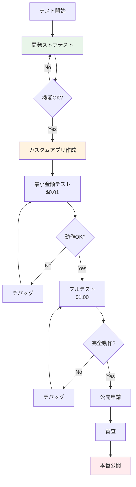

# Shopify課金機能テストガイド

## 作成日：2025年1月
## 対象：開発チーム・QAチーム

---

## 1. テスト環境の概要

### 利用可能なテスト方法

| 環境 | 課金発生 | 用途 | 推奨度 |
|------|---------|------|--------|
| **開発ストア + test:true** | なし | 機能テスト | ⭐⭐⭐ |
| **カスタムアプリ + 自社ストア** | あり（最小） | 本番テスト | ⭐⭐⭐ |
| **公開後 + 本番ストア** | あり | 最終確認 | ⭐⭐ |

---

## 2. Phase 1: 開発ストアでのテスト（課金なし）

### 2.1 環境準備

```bash
# Shopify Partners Dashboardで開発ストア作成
1. Partners Dashboard → ストア管理
2. "開発ストア作成"をクリック
3. ストア情報入力（テスト用の仮データでOK）
```

### 2.2 テストモード実装

```javascript
// 重要: 開発ストアでは必ず test: true を設定
const createTestCharge = async () => {
  const mutation = `
    mutation CreateTestSubscription($input: AppSubscriptionCreateInput!) {
      appSubscriptionCreate(appSubscription: $input) {
        appSubscription {
          id
          status
          test  // このフィールドで判定可能
        }
        confirmationUrl
        userErrors {
          field
          message
        }
      }
    }
  `;
  
  const variables = {
    input: {
      name: "Professional Plan",
      returnUrl: `${process.env.APP_URL}/subscription/confirm`,
      test: true,  // ← 必須: これにより実際の課金が発生しない
      lineItems: [{
        plan: {
          appRecurringPricingDetails: {
            price: { amount: 80.0, currencyCode: "USD" },
            interval: "EVERY_30_DAYS"
          }
        }
      }],
      trialDays: 7
    }
  };
  
  return await shopifyGraphQL(mutation, variables);
};
```

### 2.3 テスト項目チェックリスト

```markdown
## 開発ストアでのテスト項目

### 基本フロー
- [ ] アプリインストール
- [ ] 課金画面表示
- [ ] プラン選択（3プラン分）
- [ ] Shopify承認画面へのリダイレクト
- [ ] 承認後のコールバック処理
- [ ] データベース状態更新

### 無料トライアル
- [ ] トライアル開始
- [ ] トライアル期間中の機能確認
- [ ] トライアル期限切れ処理
- [ ] 期限切れ後の制限確認

### Webhook処理
- [ ] app_subscriptions/update 受信
- [ ] app_subscriptions/cancel 受信  
- [ ] 署名検証
- [ ] エラー時のリトライ

### エラーケース
- [ ] ネットワークエラー
- [ ] 無効なプラン選択
- [ ] 重複課金防止
```

---

## 3. Phase 2: カスタムアプリでの本番テスト（最小課金）

### 3.1 カスタムアプリ作成手順

```markdown
1. **Partners Dashboard にアクセス**
   - https://partners.shopify.com

2. **アプリ作成**
   - Apps → Create app
   - "Build custom app for a client" を選択

3. **設定入力**
   - App name: "ECRanger Billing Test"
   - Store URL: your-test-store.myshopify.com（自社ストア）
   - App URL: https://your-app.azurewebsites.net
   - Redirect URLs:
     - /auth/callback
     - /subscription/confirm

4. **Webhook設定**
   - app_subscriptions/update
   - app_subscriptions/cancel
   - app/uninstalled
```

### 3.2 テスト用価格設定

```csharp
public class TestPricingConfiguration
{
    // テスト段階に応じた価格設定
    public static BillingPlan GetTestPlan(TestPhase phase)
    {
        return phase switch
        {
            TestPhase.Initial => new BillingPlan
            {
                Name = "Minimal Test",
                Price = 0.01m,        // 1セント（最小）
                TrialDays = 0,        // 即課金
                Description = "初回動作確認用"
            },
            
            TestPhase.FullFlow => new BillingPlan  
            {
                Name = "Full Test",
                Price = 1.00m,        // 1ドル
                TrialDays = 1,        // 1日トライアル
                Description = "フルフローテスト用"
            },
            
            TestPhase.Production => new BillingPlan
            {
                Name = "Professional",
                Price = 80.00m,       // 本番価格
                TrialDays = 7,        // 7日トライアル
                Description = "本番用プラン"
            },
            
            _ => throw new NotSupportedException()
        };
    }
}
```

### 3.3 安全なテスト実行スクリプト

```csharp
public class SafeBillingTest
{
    private readonly ILogger<SafeBillingTest> _logger;
    private readonly ShopifyService _shopify;
    
    public async Task<TestResult> ExecuteSafeTest()
    {
        var result = new TestResult();
        
        try
        {
            // 1. 最小金額で課金作成
            _logger.LogInformation("Creating minimal charge: $0.01");
            var charge = await _shopify.CreateCharge(0.01m, trialDays: 0);
            result.ChargeId = charge.Id;
            
            // 2. 承認URLをログ出力
            _logger.LogInformation($"Confirmation URL: {charge.ConfirmationUrl}");
            result.ConfirmationUrl = charge.ConfirmationUrl;
            
            // 3. 管理者に承認を依頼
            await NotifyAdminForApproval(charge.ConfirmationUrl);
            
            // 4. Webhook受信待機（最大60秒）
            var webhookReceived = await WaitForWebhook(charge.Id, TimeSpan.FromSeconds(60));
            result.WebhookReceived = webhookReceived;
            
            // 5. 30秒後に自動キャンセル
            await Task.Delay(30000);
            _logger.LogInformation("Auto-cancelling test charge");
            
            var cancelled = await _shopify.CancelCharge(charge.Id);
            result.Cancelled = cancelled;
            
            // 6. 結果をレポート
            await GenerateTestReport(result);
            
            return result;
        }
        catch (Exception ex)
        {
            _logger.LogError(ex, "Test failed");
            result.Error = ex.Message;
            
            // 失敗時も必ずキャンセル試行
            if (!string.IsNullOrEmpty(result.ChargeId))
            {
                await _shopify.CancelCharge(result.ChargeId);
            }
            
            throw;
        }
    }
}
```

### 3.4 Webhook受信確認（ngrok使用）

```bash
# ローカル開発時のWebhook受信設定

# 1. ngrokインストール
brew install ngrok  # Mac
choco install ngrok  # Windows

# 2. ローカルサーバー起動
dotnet run --urls=https://localhost:5001

# 3. ngrokトンネル作成
ngrok http https://localhost:5001

# 4. Webhook URLを更新
# Shopify Partners Dashboard → App setup → Webhooks
# URL: https://xxxxx.ngrok.io/api/webhook/subscription
```

---

## 4. テスト実施フロー



---

## 5. トラブルシューティング

### よくある問題と対策

| 問題 | 原因 | 解決方法 |
|------|------|----------|
| 課金URLが生成されない | API権限不足 | Billing権限を確認 |
| Webhookが届かない | HTTPS必須 | ngrok使用 or HTTPS設定 |
| test:trueで実課金発生 | 通常ストアで実行 | 開発ストアを使用 |
| 承認後に戻らない | returnUrl設定ミス | URL設定を確認 |
| 署名検証エラー | Secret不一致 | 環境変数確認 |

### デバッグログの実装

```csharp
public class BillingDebugLogger
{
    public void LogChargeCreation(ChargeRequest request, ChargeResponse response)
    {
        var log = new
        {
            Timestamp = DateTime.UtcNow,
            RequestId = Guid.NewGuid(),
            Request = new
            {
                PlanName = request.PlanName,
                Amount = request.Amount,
                TestMode = request.TestMode,
                TrialDays = request.TrialDays
            },
            Response = new
            {
                ChargeId = response?.Id,
                Status = response?.Status,
                ConfirmationUrl = response?.ConfirmationUrl,
                Error = response?.Error
            },
            Environment = Environment.GetEnvironmentVariable("ASPNETCORE_ENVIRONMENT")
        };
        
        _logger.LogInformation("BILLING_TEST: {Log}", JsonSerializer.Serialize(log));
    }
}
```

---

## 6. 最終チェックリスト

### 申請前の確認事項

```markdown
## 技術要件
- [ ] 3つのプラン実装完了
- [ ] 無料トライアル機能動作
- [ ] Webhook処理実装
- [ ] エラーハンドリング完備
- [ ] テストモード切り替え機能

## テスト完了項目
- [ ] 開発ストアでの全機能テスト
- [ ] カスタムアプリでの本番テスト
- [ ] 最小金額での課金確認
- [ ] キャンセル処理確認
- [ ] プランアップグレード確認

## ドキュメント
- [ ] テスト結果レポート
- [ ] エラーログ分析
- [ ] パフォーマンス測定結果

## ビジネス確認
- [ ] 価格設定の最終確認
- [ ] 利用規約準備
- [ ] プライバシーポリシー準備
- [ ] サポート体制確立
```

---

## 7. 参考情報

### 公式ドキュメント
- [Shopify Billing API](https://shopify.dev/docs/apps/billing)
- [App審査ガイドライン](https://shopify.dev/docs/apps/store/review)
- [Webhook設定](https://shopify.dev/docs/apps/webhooks)

### 重要な環境変数

```env
# .env.development
SHOPIFY_API_KEY=your_dev_key
SHOPIFY_API_SECRET=your_dev_secret
SHOPIFY_WEBHOOK_SECRET=your_webhook_secret
ENABLE_TEST_MODE=true
TEST_STORE_DOMAIN=dev-store.myshopify.com

# .env.production
SHOPIFY_API_KEY=your_prod_key
SHOPIFY_API_SECRET=your_prod_secret
SHOPIFY_WEBHOOK_SECRET=your_webhook_secret
ENABLE_TEST_MODE=false
ALLOWED_TEST_STORES=your-company.myshopify.com,test-store.myshopify.com
```

---

**重要**: カスタムアプリを使用することで、**申請前に本番環境での完全なテスト**が可能です。
必ず自社ストアのみで実施し、最小金額でテストすることでリスクを最小化してください。