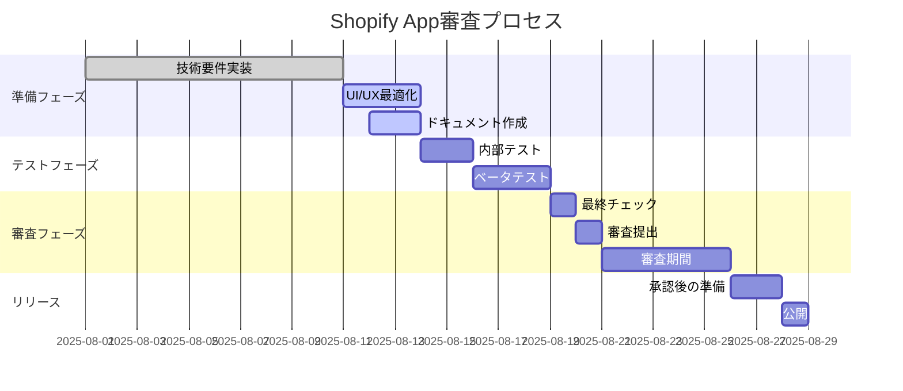

# Shopify App審査対策完全ガイド

## 作成日：2025年8月12日

---

## 📋 概要

このドキュメントは、Shopifyアプリ審査を一発で通過するための包括的なガイドです。過去の審査経験と最新のShopifyガイドラインに基づいて作成されています。

---

## 🎯 審査成功の3つの鍵

### 1. **技術的完成度**
- 安定したパフォーマンス
- 適切なエラーハンドリング
- セキュリティ要件の完全準拠

### 2. **ユーザー体験**
- 直感的なUI/UX
- 明確な価値提供
- スムーズなオンボーディング

### 3. **ドキュメント品質**
- 包括的な説明
- 明確な料金体系
- 適切なサポート体制

---

## ✅ 必須要件チェックリスト

### 🔐 セキュリティ要件

#### OAuth認証
```csharp
// 正しい実装例
public async Task<IActionResult> Install([FromQuery] string shop, [FromQuery] string hmac)
{
    // 1. HMACを検証
    if (!VerifyQueryStringHmac(Request.QueryString.Value, hmac))
    {
        return BadRequest("Invalid request signature");
    }
    
    // 2. ショップドメインを検証
    if (!IsValidShopDomain(shop))
    {
        return BadRequest("Invalid shop domain");
    }
    
    // 3. NonceとStateを生成
    var state = GenerateRandomString(32);
    HttpContext.Session.SetString("state", state);
    
    // 4. OAuth URLにリダイレクト
    var redirectUrl = BuildOAuthUrl(shop, state);
    return Redirect(redirectUrl);
}
```

#### Webhook署名検証
```csharp
private bool VerifyWebhookSignature(string rawBody, string hmacHeader)
{
    var secret = _configuration["Shopify:WebhookSecret"];
    
    using var hmac = new HMACSHA256(Encoding.UTF8.GetBytes(secret));
    var computedHash = Convert.ToBase64String(
        hmac.ComputeHash(Encoding.UTF8.GetBytes(rawBody))
    );
    
    // タイミング攻撃を防ぐために時間一定の比較を使用
    return CryptographicOperations.FixedTimeEquals(
        Encoding.UTF8.GetBytes(computedHash),
        Encoding.UTF8.GetBytes(hmacHeader)
    );
}
```

### 📊 GDPR必須Webhook

#### 実装が必要な3つのWebhook
1. **customers/data_request** - 顧客データ要求
2. **customers/redact** - 顧客データ削除
3. **shop/redact** - ストアデータ削除

#### 実装例
```csharp
[HttpPost("gdpr/customers-data-request")]
public async Task<IActionResult> HandleCustomerDataRequest(
    [FromHeader(Name = "X-Shopify-Hmac-Sha256")] string hmacHeader,
    [FromBody] GdprDataRequestWebhook webhook)
{
    // 署名検証
    if (!VerifyWebhookSignature(Request.Body, hmacHeader))
    {
        return Unauthorized();
    }
    
    // 48時間以内に顧客データを収集してメール送信
    await _gdprService.ProcessDataRequest(
        webhook.ShopDomain,
        webhook.Customer.Id,
        webhook.Customer.Email
    );
    
    return Ok();
}

[HttpPost("gdpr/customers-redact")]
public async Task<IActionResult> HandleCustomerRedact(
    [FromHeader(Name = "X-Shopify-Hmac-Sha256")] string hmacHeader,
    [FromBody] GdprRedactWebhook webhook)
{
    // 署名検証
    if (!VerifyWebhookSignature(Request.Body, hmacHeader))
    {
        return Unauthorized();
    }
    
    // 30日以内に顧客データを削除
    await _gdprService.DeleteCustomerData(
        webhook.ShopDomain,
        webhook.Customer.Id
    );
    
    return Ok();
}

[HttpPost("gdpr/shop-redact")]
public async Task<IActionResult> HandleShopRedact(
    [FromHeader(Name = "X-Shopify-Hmac-Sha256")] string hmacHeader,
    [FromBody] ShopRedactWebhook webhook)
{
    // 署名検証
    if (!VerifyWebhookSignature(Request.Body, hmacHeader))
    {
        return Unauthorized();
    }
    
    // 90日以内にストアデータを削除
    await _gdprService.DeleteStoreData(webhook.ShopDomain);
    
    return Ok();
}
```

---

## 🎨 UI/UX要件

### Polaris準拠
```tsx
// 正しいPolaris実装
import {
  Page,
  Card,
  Button,
  Banner,
  Layout,
  TextContainer
} from '@shopify/polaris';

export function BillingPage() {
  return (
    <Page
      title="料金プラン"
      primaryAction={{
        content: 'プランを選択',
        onAction: handlePlanSelection
      }}
    >
      <Layout>
        <Layout.Section>
          <Banner
            title="7日間無料トライアル実施中"
            status="info"
          >
            <p>すべての機能を無料でお試しいただけます</p>
          </Banner>
        </Layout.Section>
        
        <Layout.Section>
          <Card sectioned>
            <TextContainer>
              <h2>料金プラン詳細</h2>
              {/* プラン情報 */}
            </TextContainer>
          </Card>
        </Layout.Section>
      </Layout>
    </Page>
  );
}
```

### エラーハンドリング
```tsx
// ユーザーフレンドリーなエラー表示
const ErrorBoundary: React.FC = ({ children }) => {
  return (
    <ErrorBoundaryComponent
      fallback={({ error, resetErrorBoundary }) => (
        <Page>
          <Card sectioned>
            <Banner
              title="エラーが発生しました"
              status="critical"
              action={{
                content: '再試行',
                onAction: resetErrorBoundary
              }}
            >
              <p>申し訳ございません。問題が発生しました。</p>
              <p>問題が続く場合は、サポートまでご連絡ください。</p>
            </Banner>
          </Card>
        </Page>
      )}
    >
      {children}
    </ErrorBoundaryComponent>
  );
};
```

---

## 💰 課金実装の審査ポイント

### 透明性の確保

#### 料金表示
```tsx
// 明確な料金表示
<Card title="Professional Plan" sectioned>
  <Stack vertical>
    <Text variant="headingLg" as="h3">
      $80.00 USD / 月
    </Text>
    <Text variant="bodyMd" color="subdued">
      7日間の無料トライアル付き
    </Text>
    <List type="bullet">
      <List.Item>全機能利用可能</List.Item>
      <List.Item>無制限のデータ分析</List.Item>
      <List.Item>優先サポート</List.Item>
    </List>
    <Button primary fullWidth onClick={startTrial}>
      無料トライアルを開始
    </Button>
    <Text variant="bodySm" color="subdued">
      * クレジットカード不要
      * いつでもキャンセル可能
    </Text>
  </Stack>
</Card>
```

#### キャンセルフロー
```tsx
// わかりやすいキャンセル方法
<Card title="サブスクリプション管理" sectioned>
  <Stack vertical spacing="loose">
    <Text>現在のプラン: Professional ($80/月)</Text>
    <Text>次回請求日: 2025年9月12日</Text>
    
    <Button destructive onClick={showCancelModal}>
      サブスクリプションをキャンセル
    </Button>
    
    <Modal
      open={cancelModalOpen}
      onClose={closeCancelModal}
      title="キャンセルの確認"
    >
      <Modal.Section>
        <TextContainer>
          <p>本当にキャンセルしますか？</p>
          <p>現在の請求期間終了まで機能は利用可能です。</p>
        </TextContainer>
      </Modal.Section>
      <Modal.Footer>
        <Button onClick={closeCancelModal}>戻る</Button>
        <Button destructive onClick={confirmCancel}>
          キャンセルを確定
        </Button>
      </Modal.Footer>
    </Modal>
  </Stack>
</Card>
```

---

## 📝 必要なドキュメント

### 1. プライバシーポリシー
```markdown
## 必須項目
- データ収集の目的と範囲
- データの保管期間
- 第三者との共有に関する方針
- ユーザーの権利（アクセス、修正、削除）
- GDPR/CCPA準拠の明記
- 連絡先情報
```

### 2. 利用規約
```markdown
## 必須項目
- サービスの範囲
- 料金と支払い条件
- キャンセルポリシー
- 免責事項
- 準拠法と管轄裁判所
- 変更通知の方法
```

### 3. サポート情報
```markdown
## 必須項目
- メールアドレス
- 対応時間（タイムゾーン付き）
- 対応言語
- FAQ/ヘルプドキュメントURL
- 平均応答時間
```

---

## ⚠️ よくある却下理由と対策

### 1. **パフォーマンス問題**

#### 問題
- API応答が3秒を超える
- ページロード時間が長い

#### 対策
```typescript
// キャッシュの実装
const cache = new Map<string, CacheEntry>();

export async function fetchWithCache(key: string, fetcher: () => Promise<any>) {
  const cached = cache.get(key);
  
  if (cached && cached.expiry > Date.now()) {
    return cached.data;
  }
  
  const data = await fetcher();
  cache.set(key, {
    data,
    expiry: Date.now() + 5 * 60 * 1000 // 5分間キャッシュ
  });
  
  return data;
}

// ページネーションの実装
export async function fetchProducts(page: number = 1, limit: number = 50) {
  return await shopify.product.list({
    limit,
    page_info: page > 1 ? pageInfo : undefined
  });
}
```

### 2. **不適切なエラーメッセージ**

#### 問題
- 技術的なエラーをそのまま表示
- ユーザーが次に何をすべきか不明

#### 対策
```tsx
// エラーメッセージのマッピング
const ERROR_MESSAGES = {
  'NETWORK_ERROR': {
    title: 'ネットワークエラー',
    message: 'インターネット接続を確認してください',
    action: '再試行'
  },
  'UNAUTHORIZED': {
    title: '認証エラー',
    message: 'ログインし直してください',
    action: '再ログイン'
  },
  'RATE_LIMIT': {
    title: 'リクエスト制限',
    message: 'しばらく待ってから再度お試しください',
    action: null
  }
};

function getErrorMessage(error: Error): ErrorInfo {
  const errorType = identifyErrorType(error);
  return ERROR_MESSAGES[errorType] || {
    title: 'エラーが発生しました',
    message: 'サポートにお問い合わせください',
    action: 'サポートへ'
  };
}
```

### 3. **不明瞭な価値提案**

#### 問題
- アプリが何をするのか不明確
- 競合との差別化が不明

#### 対策
```tsx
// 明確な価値提案の表示
<Page>
  <Layout>
    <Layout.Section>
      <Card sectioned>
        <Stack vertical spacing="loose">
          <Text variant="headingXl" as="h1">
            AIマーケティング分析で売上を最大化
          </Text>
          
          <Text variant="bodyLg">
            当アプリは、AIを活用してお客様のストアデータを分析し、
            具体的な改善提案を提供します。
          </Text>
          
          <List type="bullet">
            <List.Item>
              <Text variant="bodyMd" fontWeight="semibold">
                売上予測精度95%
              </Text>
              過去データから将来の売上を高精度で予測
            </List.Item>
            
            <List.Item>
              <Text variant="bodyMd" fontWeight="semibold">
                顧客セグメント自動生成
              </Text>
              購買パターンに基づく顧客グループの自動作成
            </List.Item>
            
            <List.Item>
              <Text variant="bodyMd" fontWeight="semibold">
                リアルタイムレポート
              </Text>
              ダッシュボードで常に最新の分析結果を確認
            </List.Item>
          </List>
        </Stack>
      </Card>
    </Layout.Section>
  </Layout>
</Page>
```

---

## 🚀 審査提出前の最終チェックリスト

### 技術面
- [ ] すべてのAPIエンドポイントが3秒以内に応答
- [ ] HMAC検証が全箇所で実装済み
- [ ] GDPR Webhookが実装・テスト済み
- [ ] エラーハンドリングが適切
- [ ] メモリリークがない
- [ ] SQLインジェクション対策済み

### UI/UX面
- [ ] Polaris最新版を使用
- [ ] レスポンシブデザイン対応
- [ ] ローディング状態の表示
- [ ] エラー状態の適切な表示
- [ ] アクセシビリティ対応（WCAG 2.1 AA準拠）

### ドキュメント面
- [ ] プライバシーポリシー（日英）
- [ ] 利用規約（日英）
- [ ] アプリ説明文が明確
- [ ] スクリーンショット5枚以上
- [ ] デモ動画（オプション）

### ビジネス面
- [ ] 料金体系が明確
- [ ] 無料トライアル期間の明示
- [ ] キャンセル方法の説明
- [ ] サポート連絡先の記載
- [ ] FAQ/ヘルプドキュメント

---

## 📊 審査タイムライン



---

## 🔍 審査通過のための追加Tips

### 1. **テストアカウントの準備**
```markdown
## 審査用テストアカウント情報
- ストアURL: test-store.myshopify.com
- 管理者メール: reviewer@example.com
- パスワード: [セキュアに共有]
- テストカード番号: 4242 4242 4242 4242
```

### 2. **デモデータの準備**
- 実際の使用例を示すサンプルデータ
- 各機能が動作することを確認できるデータセット
- エッジケースも含めた多様なデータ

### 3. **レビュワー向けガイド**
```markdown
## アプリテスト手順
1. インストール方法
2. 初期設定の手順
3. 主要機能の使い方
4. 課金フローのテスト方法
5. アンインストール方法
```

### 4. **よくある質問への準備**
- セキュリティに関する質問
- データ保持ポリシー
- 他のアプリとの連携
- スケーラビリティ

---

## 📈 審査後のフォローアップ

### 承認された場合
1. アプリストアでの公開設定
2. マーケティング素材の準備
3. ローンチ告知の準備
4. サポート体制の確立

### 却下された場合
1. フィードバックの詳細確認
2. 指摘事項の修正
3. 修正内容の文書化
4. 再審査の申請

---

## 🆘 サポートリソース

### Shopify公式リソース
- [App Review Guidelines](https://shopify.dev/docs/apps/store/review)
- [Partner Dashboard](https://partners.shopify.com)
- [Shopify Community Forum](https://community.shopify.com)

### 内部リソース
- 審査対策チェックリスト: `checklist.md`
- 過去の審査フィードバック: `feedback-history.md`
- テンプレート集: `templates/`

---

**最終更新**: 2025年8月12日
**次回更新予定**: 審査結果受領後