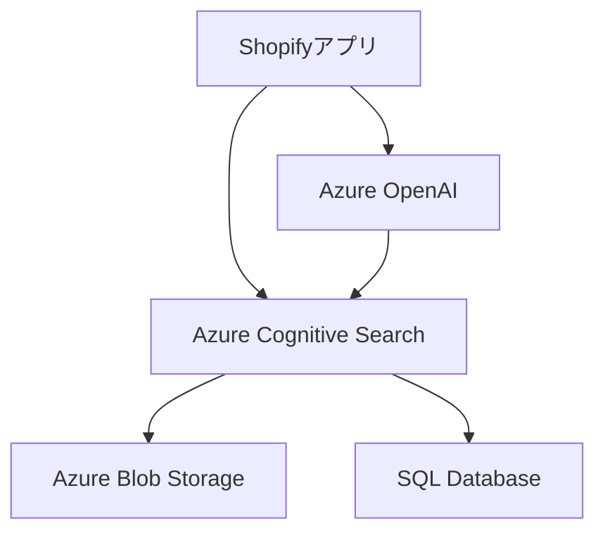

# ShopifyアプリにおけるAI活用調査報告書

## 1. 概要

本報告書は、ShopifyアプリにおけるAzure OpenAIの活用方法と、その実装における技術的な課題および解決策についてまとめたものです。

## 2. システム構成

### 2.1 使用技術
- Azure OpenAI Service
- Azure Cognitive Search (AI Search)
- Azure Blob Storage
- SQL Database

### 2.2 アーキテクチャ概要


## 3. AI実装の現状と課題

### 3.1 現在の実装状況
- Azure OpenAIを使用した商品分析機能の実装
- データベースからの集計データ活用
- プロンプトエンジニアリングによる回答精度の向上

### 3.2 技術的課題
1. **トークン制限の問題**
   - **1分間あたりのトークン数制限（TPM）への抵触**
   - 大規模データセット処理時の制限
   
2. **リクエスト制限**
   - **1分間あたりのリクエスト数制限（RPM）**
   - 頻繁なデータ共有による制限超過

3. **データ連携の課題**
   - Blob StorageのCSVデータ参照におけるインデックス作成（対応中）
   - 直接データベース参照時のコスト考慮


参考）


## 4. 解決策と最適化戦略

### 4.1 データ最適化
1. **事前処理の実施**
   - 必要な列のみを選択
   - データの要約・集計を事前実行
   - 分析に必要な最小限のデータセット作成

2. **キャッシュ戦略**
   - 頻繁に使用するデータの結果をキャッシュ
   - 同一クエリの重複実行を回避

3. **バッチ処理の実装**
   - データを小規模バッチに分割
   - レート制限内での分散処理

### 4.2 Azure Cognitive Searchの活用
- データの事前インデックス化
- 必要情報の検索ベース取得
- トークン消費の最適化

## 5. 実装例と効果

### 5.1 初回購入として選ばれやすい商品の実装例　

#### 質問例：
1. どのような商品が初回購入として選ばれやすいですか？
2. 初回購入商品の価格帯の特徴は？
3. 季節性や時期による傾向はありますか？
4. 初回購入を促進するための提案は？

#### データ形式：

​	※事前にSQLで以下のデータを作成

```csv
商品名,初回購入者数,総販売数量,平均販売価格,最初の販売日,最新の販売
```


#### AI回答例：

1. **初回購入として選ばれやすい商品の特徴**
   - トップ5の初回購入商品分析
   - 基本的な包装資材が中心
   - 中規模ロット（50-100個単位）が人気
   - シンプルなデザインの選好性

2. **価格帯の特徴**
   - 1,000円～3,000円：30%
   - 3,000円～5,000円：40%
   - 5,000円～10,000円：20%
   - 10,000円以上：10%

3. **時期による傾向**
   - 月中旬の需要集中
   - 季節イベントとの連動性

4. **促進施策の提案**
   - スターターパックの展開
   - サンプルセット提供
   - 季節性を考慮した商品提案

参考）回答例1


参考）回答例2 アプリ側で使用できるアウトプット


## 6. 今後の展開

### 6.1 短期的な改善計画
- インデックス作成の完了
- キャッシュ戦略の実装
- バッチ処理の最適化

### 6.2 中長期的な展望
- コスト効率の改善
- 回答精度の向上
- ユースケースの拡大

## 7. まとめ

ShopifyアプリにおけるAI活用の可能性と課題が明確になりました。特に、トークン数制限とリクエストレート制限と**事前データ処理の最適化**と**Azure Cognitive Searchの活用**が、システムの効率化に重要な役割を果たすことが判明しました。
