# 作業計画書 - 2025年8月13日（水）

## エグゼクティブサマリー

本日はプロジェクト最終日として、品質保証と本番環境準備を実施します。
昨日の驚異的な進捗（95%完了）を受けて、本日中にプロジェクトを100%完成させます。

---

## プロジェクト状況

### 現在の進捗（8月12日夜時点）
```
全体進捗: ███████████████████░ 95%

✅ 完了済み (95%)
- OAuth認証: 100%
- データ同期基盤: 100%
- フロントエンドUI: 100%
- バックエンドAPI: 100%
- 基本機能実装: 100%

⏳ 明日（8/13）実施 (5%)
- 統合テスト
- 本番環境準備（福田様担当）
- E2Eテスト
- ドキュメント整備
```

---

## 本日の目標

### ミッション
「動くものから、完璧なものへ」- 品質を確保しながらプロジェクトを完成させる

### 成功指標
1. すべての統合テストが成功
2. 本番環境へのデプロイが可能
3. 基本的なE2Eテストが動作
4. 必要最小限のドキュメント完成

---

## チーム別タスク詳細

### Takashi（バックエンドエンジニア）

#### 午前（9:00-12:00）
| 時間 | タスク | 成果物 |
|------|--------|---------|
| 9:00-11:00 | 統合テスト実施 | テストレポート、15本以上のテスト |
| 11:00-12:00 | パフォーマンステスト | 性能測定結果、ボトルネック分析 |

#### 午後（13:00-17:00）
| 時間 | タスク | 成果物 |
|------|--------|---------|
| 13:00-15:00 | 本番環境設定支援 | 環境設定ドキュメント、デプロイスクリプト |
| 15:00-17:00 | API仕様書作成 | 完全なAPI仕様書、エラーコード一覧 |

#### 重点事項
- 実際のShopify APIとの接続確認
- Rate Limit処理の検証
- コスト最適化案の作成（福田様向け）

### Yuki（フロントエンドエンジニア）

#### 午前（9:00-12:00）
| 時間 | タスク | 成果物 |
|------|--------|---------|
| 9:00-10:30 | Cypressテスト修正 | TypeScript設定、基本テスト3本 |
| 10:30-12:00 | UI最終調整 | エラー表示改善、アクセシビリティ対応 |

#### 午後（13:00-17:00）
| 時間 | タスク | 成果物 |
|------|--------|---------|
| 13:00-15:00 | E2Eテスト実装 | 10本以上のE2Eテスト |
| 15:00-17:00 | 運用マニュアル作成 | 操作ガイド、トラブルシューティング、FAQ |

#### 重点事項
- Cypress TypeScriptエラーの解消
- 基本的なE2Eテストの動作確認
- ユーザー向けドキュメントの作成

### Kenji（プロジェクトマネージャー）

#### 全日タスク
1. **進捗管理とサポート**
   - 11:00、14:00、16:00の進捗確認
   - ブロッカーの即座解決
   - チーム間の調整

2. **ステークホルダー対応**
   - 福田様へのコスト最適化案提示
   - 進捗報告書の作成
   - リリース計画の策定

3. **品質保証**
   - テスト結果のレビュー
   - ドキュメントの確認
   - 最終チェックリスト作成

---

## タイムライン

```mermaid
gantt
    title 2025年8月13日 作業スケジュール
    dateFormat HH:mm
    axisFormat %H:%M
    
    section Takashi
    統合テスト         :09:00, 2h
    パフォーマンステスト :11:00, 1h
    昼休憩            :12:00, 1h
    本番環境設定       :13:00, 2h
    API仕様書作成      :15:00, 2h
    
    section Yuki
    Cypressテスト修正   :09:00, 1h30m
    UI最終調整        :10:30, 1h30m
    昼休憩            :12:00, 1h
    E2Eテスト実装      :13:00, 2h
    運用マニュアル作成   :15:00, 2h
    
    section チェックポイント
    第1回進捗確認      :milestone, 11:00, 0
    第2回進捗確認      :milestone, 14:00, 0
    第3回進捗確認      :milestone, 16:00, 0
    最終確認          :milestone, 17:00, 0
```



---

## リスク管理

### 想定リスクと対策

| リスク | 影響度 | 発生確率 | 対策 |
|--------|--------|----------|------|
| Shopify API Rate Limit | 高 | 中 | モックAPI併用、リトライ実装 |
| 本番環境設定ミス | 高 | 低 | ステージング環境で事前確認 |
| Cypressテスト複雑性 | 中 | 高 | 基本テストに集中、手動テスト併用 |
| 時間不足 | 中 | 低 | 優先順位明確化、必須項目に集中 |

---

## 福田様へのコスト最適化提案

### 段階的アプローチ

#### Phase 1: 最小構成（月額約$60）
- App Service: B1 Basic ($55/月)
- SQL Database: Basic 5DTU ($5/月)
- Storage: 最小限

#### Phase 2: 負荷監視（1-2週間）
- Application Insights導入
- パフォーマンスメトリクス収集
- ボトルネック特定

#### Phase 3: 最適化（必要に応じて）
- 特定されたボトルネックのみスケールアップ
- 自動スケーリング設定
- コスト効率の最大化

### 推奨事項
1. まずは最小構成でスタート
2. 実際の負荷を監視してから判断
3. 必要な部分のみ段階的にスケール

---

## 成果物チェックリスト

### 必須成果物（Must Have）
- [ ] 統合テスト完了レポート
- [ ] 本番環境設定ドキュメント
- [ ] 基本E2Eテスト（3本以上）
- [ ] API仕様書（ドラフト版）

### 重要成果物（Should Have）
- [ ] パフォーマンステスト結果
- [ ] 完全なE2Eテスト（10本）
- [ ] 運用マニュアル
- [ ] コスト最適化詳細案

### あれば良い成果物（Nice to Have）
- [ ] GDPR Webhooks実装
- [ ] 追加テストケース
- [ ] 詳細なトラブルシューティングガイド

---

## コミュニケーション計画

### 定期報告
- 11:00 - 第1回進捗確認（午前の成果確認）
- 14:00 - 第2回進捗確認（統合テスト結果共有）
- 16:00 - 第3回進捗確認（ドキュメント確認）
- 17:00 - 最終確認（完了報告）

### 報告チャネル
- 個人進捗: `report_[名前].md`
- 技術的質問: `to_kenji.md`
- 緊急事項: `temp.md`
- 全体共有: `to_all.md`

---

## 明日（8/14）への引き継ぎ

### 予定作業
1. リリース前最終チェック
2. ステークホルダーへのデモ準備
3. 本番デプロイ実施
4. リリースノート作成

### 準備事項
- デプロイ手順書の確認
- ロールバック計画の準備
- 関係者への通知準備

---

## メッセージ

チームの皆さん、

昨日の素晴らしい成果により、本日でプロジェクトを完成させることができます。
これまでの努力が実を結ぶ最終日です。

特に重要なのは：
1. **品質** - すべてが正しく動作すること
2. **本番対応** - 実環境で稼働できること
3. **持続可能性** - 保守・運用が可能なこと

最後まで気を抜かず、しかし無理をせず、確実に完成させましょう。

皆さんの素晴らしい仕事に感謝します！

---

**作成者**: Kenji（プロジェクトマネージャー）  
**作成日時**: 2025年8月13日 9:00  
**次回更新**: 2025年8月13日 11:00（第1回進捗確認）