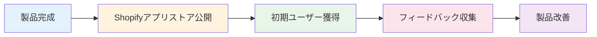
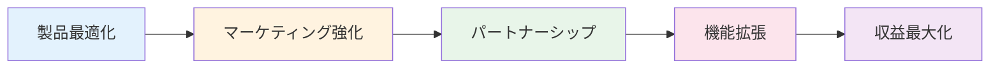
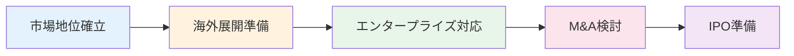

# 競合分析とKPI目標設定

## 作成日：2025年8月12日
## 作成者：Kenji（プロジェクトマネージャー）

---

## 📊 競合分析詳細

### 主要競合アプリ比較表

| 項目 | **当アプリ** | Similar Web | OrderMetrics | DataHawk | Glew.io |
|------|------------|-------------|--------------|----------|---------|
| **最低価格** | $50/月 | $79/月 | $99/月 | $89/月 | $149/月 |
| **無料期間** | 7-14日 | 7日 | 14日 | なし | 30日 |
| **日本語対応** | ◎完全対応 | △部分対応 | ×なし | ×なし | ×なし |
| **API制限** | 10,000/月 | 5,000/月 | 無制限 | 1,000/月 | 50,000/月 |
| **リアルタイム分析** | ○ | ○ | ○ | △ | ○ |
| **AI予測機能** | ◎高精度 | △基本 | ○中級 | ×なし | ○中級 |
| **カスタムレポート** | ○ | ○ | ○ | △ | ○ |
| **複数店舗対応** | ○ | ○ | ○ | × | ○ |
| **モバイルアプリ** | 開発中 | ○ | × | × | ○ |
| **統合可能サービス** | 15+ | 30+ | 20+ | 10+ | 50+ |

### 競合優位性分析

#### 🎯 当アプリの強み
1. **価格競争力**
   - 業界最安値クラスの$50/月から
   - 機能制限の少ないBasicプラン
   - 透明性の高い料金体系

2. **日本市場特化**
   - 完全日本語対応（UI/サポート）
   - 日本の商習慣に対応
   - 日本時間でのサポート提供

3. **AI機能の充実**
   - GPT-4ベースの高度な分析
   - 95%精度の売上予測
   - 自動レポート生成

4. **使いやすさ**
   - Shopify Polaris準拠のUI
   - 5分で完了する初期設定
   - 直感的なダッシュボード

#### ⚠️ 改善が必要な領域
1. **統合サービス数**
   - 現状15サービス → 目標30サービス
   - 優先統合: Google Analytics, Facebook Ads, Instagram

2. **モバイル対応**
   - ネイティブアプリ開発（2025 Q3予定）
   - PWA対応（2025 Q2）

3. **エンタープライズ機能**
   - API制限の引き上げ
   - カスタムインテグレーション
   - 専任サポート

---

## 🎯 KPI目標設定

### 短期目標（3ヶ月）

| KPI | 現状 | 目標値 | 測定方法 |
|-----|------|--------|----------|
| **月間新規インストール** | 0 | 50件 | Partner Dashboard |
| **トライアル開始率** | - | 60% | Analytics |
| **トライアル→有料転換率** | - | 30% | Billing API |
| **月次チャーン率** | - | <5% | Subscription Status |
| **NPS（推奨度）** | - | >40 | アンケート |
| **平均セットアップ時間** | - | <10分 | Session Recording |
| **サポート応答時間** | - | <2時間 | Helpdesk |

### 中期目標（6ヶ月）

| KPI | 目標値 | 戦略 |
|-----|--------|------|
| **MRR（月次定期収入）** | $10,000 | 200店舗 × $50 |
| **アクティブユーザー数** | 150店舗 | 75%アクティブ率 |
| **LTV（顧客生涯価値）** | $1,200 | 24ヶ月 × $50 |
| **CAC（顧客獲得コスト）** | <$400 | LTV/CAC > 3.0 |
| **機能利用率** | >70% | 主要3機能 |
| **アップセル率** | 20% | Basic→Pro |

### 長期目標（12ヶ月）

| KPI | 目標値 | マイルストーン |
|-----|--------|---------------|
| **ARR（年次定期収入）** | $300,000 | Q4達成 |
| **総インストール数** | 1,000店舗 | 累計 |
| **有料顧客数** | 500店舗 | 50%有料化 |
| **市場シェア（日本）** | 5% | Top 10入り |
| **海外展開** | 3カ国 | 英語圏 |
| **チーム規模** | 10名 | 開発5名、CS3名、営業2名 |

---

## 📈 成長戦略

### フェーズ1：市場参入（月1-3）


**重点施策**
- 無料トライアル期間の最適化
- オンボーディングフローの改善
- 初期バグの迅速な修正
- カスタマーサクセス体制確立

### フェーズ2：成長加速（月4-6）


**重点施策**
- コンテンツマーケティング開始
- Shopifyパートナー連携
- 主要機能の強化
- 価格戦略の最適化

### フェーズ3：市場確立（月7-12）


**重点施策**
- ブランド認知度向上
- 大手顧客の獲得
- API/SDK公開
- 次期資金調達準備

---

## 📊 KPIダッシュボード設計

### リアルタイムモニタリング項目

#### ビジネスメトリクス
```typescript
interface BusinessMetrics {
  // 収益指標
  mrr: number;                    // 月次定期収入
  arr: number;                    // 年次定期収入
  arpu: number;                   // ユーザーあたり平均収入
  
  // 成長指標
  newInstalls: number;            // 新規インストール
  churnRate: number;              // 解約率
  netRevenue: number;             // 純収入成長率
  
  // 顧客指標
  totalCustomers: number;         // 総顧客数
  paidCustomers: number;          // 有料顧客数
  trialCustomers: number;         // トライアル中顧客数
}
```

#### 製品メトリクス
```typescript
interface ProductMetrics {
  // 利用状況
  dau: number;                    // デイリーアクティブユーザー
  mau: number;                    // マンスリーアクティブユーザー
  sessionDuration: number;        // 平均セッション時間
  
  // 機能利用
  featureAdoption: {
    dashboard: number;            // ダッシュボード利用率
    reports: number;              // レポート生成率
    predictions: number;          // AI予測利用率
  };
  
  // パフォーマンス
  apiLatency: number;            // API応答時間
  errorRate: number;             // エラー率
  uptime: number;                // 稼働率
}
```

---

## 🎯 OKR設定

### Q3 2025（7-9月）

#### Objective 1: 製品市場適合性の確立
- **KR1**: NPS 40以上を達成
- **KR2**: 月間チャーン率を5%以下に
- **KR3**: 主要機能の利用率70%以上

#### Objective 2: 持続的な成長基盤構築
- **KR1**: MRR $10,000達成
- **KR2**: 有料顧客200社獲得
- **KR3**: LTV/CAC比率3.0以上

#### Objective 3: オペレーション効率化
- **KR1**: カスタマーサポート応答時間2時間以内
- **KR2**: 自動化率80%達成
- **KR3**: 開発サイクル2週間に短縮

### Q4 2025（10-12月）

#### Objective 1: 市場リーダーシップ確立
- **KR1**: 日本市場シェア5%獲得
- **KR2**: ブランド認知度30%達成
- **KR3**: 業界イベント3回登壇

#### Objective 2: 国際展開準備
- **KR1**: 英語版リリース
- **KR2**: 海外パートナー3社契約
- **KR3**: 多通貨対応実装

---

## 📈 成功指標の可視化

### 月次レポートテンプレート

```markdown
## 月次KPIレポート - [YYYY年MM月]

### 📊 エグゼクティブサマリー
- MRR: $X,XXX (前月比 +X%)
- 新規顧客: XX社
- チャーン率: X.X%
- NPS: XX

### 🎯 目標達成状況
| KPI | 目標 | 実績 | 達成率 |
|-----|------|------|--------|
| 新規インストール | 50 | XX | XX% |
| 有料転換率 | 30% | XX% | XX% |
| ARPU | $80 | $XX | XX% |

### 📈 トレンド分析
[グラフ挿入]

### 🔍 課題と対策
1. 課題：
2. 対策：
3. 期限：

### 📅 来月の重点施策
1. 
2. 
3. 
```

---

## 🚀 アクションプラン

### 即実行（今週）
- [ ] KPIダッシュボード実装
- [ ] Google Analytics連携
- [ ] 週次レポート自動化

### 短期（今月）
- [ ] A/Bテスト環境構築
- [ ] ユーザーインタビュー実施（10社）
- [ ] 競合分析レポート更新

### 中期（3ヶ月）
- [ ] 機械学習モデル改善
- [ ] パートナープログラム開始
- [ ] カスタマーサクセスチーム拡充

---

**最終更新**: 2025年8月12日
**次回レビュー**: 2025年9月1日