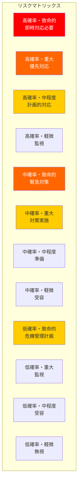

# リスク管理マトリックス

## 作成日：2025年8月12日
## 作成者：Kenji（プロジェクトマネージャー）

---

## 📊 リスク評価基準

### 発生確率の定義
- **高 (70-100%)**: ほぼ確実に発生する
- **中 (30-70%)**: 発生する可能性がある
- **低 (0-30%)**: 発生する可能性は低い

### 影響度の定義
- **致命的**: プロジェクト中止の可能性
- **重大**: 大幅な遅延やコスト増
- **中程度**: 管理可能な遅延やコスト
- **軽微**: 最小限の影響

---

## 🎯 リスクマトリックス



---

## 🔴 技術的リスク

### 1. Shopify API制限超過
| 項目 | 内容 |
|------|------|
| **発生確率** | 中 (40%) |
| **影響度** | 重大 |
| **リスクレベル** | 高 |
| **影響** | - サービス一時停止<br/>- データ同期の遅延<br/>- ユーザー体験の低下 |
| **予防策** | - API呼び出しの最適化<br/>- キャッシュ戦略の実装<br/>- レート制限の監視 |
| **対応策** | - バックオフ戦略実装<br/>- キュー処理システム<br/>- 代替API利用 |
| **責任者** | Takashi |
| **期限** | 2025年8月15日 |

### 2. Webhook処理の失敗
| 項目 | 内容 |
|------|------|
| **発生確率** | 中 (30%) |
| **影響度** | 重大 |
| **リスクレベル** | 中 |
| **影響** | - 課金情報の不整合<br/>- データ欠損<br/>- 請求エラー |
| **予防策** | - 冪等性の保証<br/>- リトライメカニズム<br/>- ログ記録の強化 |
| **対応策** | - 手動リカバリ手順<br/>- ポーリング併用<br/>- アラート設定 |
| **責任者** | Takashi |
| **期限** | 実装時 |

### 3. データベース障害
| 項目 | 内容 |
|------|------|
| **発生確率** | 低 (10%) |
| **影響度** | 致命的 |
| **リスクレベル** | 中 |
| **影響** | - 全サービス停止<br/>- データ損失<br/>- 復旧時間の長期化 |
| **予防策** | - 自動バックアップ<br/>- レプリケーション<br/>- 監視強化 |
| **対応策** | - DR計画実行<br/>- バックアップ復元<br/>- 代替DB切替 |
| **責任者** | Kenji |
| **期限** | 継続的 |

### 4. セキュリティ侵害
| 項目 | 内容 |
|------|------|
| **発生確率** | 低 (5%) |
| **影響度** | 致命的 |
| **リスクレベル** | 中 |
| **影響** | - 顧客データ漏洩<br/>- 信頼性損失<br/>- 法的責任 |
| **予防策** | - セキュリティ監査<br/>- ペネトレーションテスト<br/>- 暗号化実装 |
| **対応策** | - インシデント対応<br/>- 影響調査<br/>- 顧客通知 |
| **責任者** | 全員 |
| **期限** | 継続的 |

---

## 🟡 ビジネスリスク

### 5. Shopify審査却下
| 項目 | 内容 |
|------|------|
| **発生確率** | 低 (20%) |
| **影響度** | 重大 |
| **リスクレベル** | 中 |
| **影響** | - リリース遅延<br/>- 追加開発コスト<br/>- 機会損失 |
| **予防策** | - 事前レビュー実施<br/>- ガイドライン遵守<br/>- テスト徹底 |
| **対応策** | - フィードバック対応<br/>- 迅速な修正<br/>- 再申請 |
| **責任者** | Kenji |
| **期限** | 申請前 |

### 6. 競合の価格戦略
| 項目 | 内容 |
|------|------|
| **発生確率** | 中 (50%) |
| **影響度** | 中程度 |
| **リスクレベル** | 中 |
| **影響** | - 顧客獲得困難<br/>- 収益減少<br/>- マーケットシェア低下 |
| **予防策** | - 差別化強化<br/>- 付加価値向上<br/>- 顧客ロイヤリティ |
| **対応策** | - 価格見直し<br/>- プロモーション<br/>- 新機能追加 |
| **責任者** | 福田様 |
| **期限** | 継続的 |

### 7. チャーン率上昇
| 項目 | 内容 |
|------|------|
| **発生確率** | 中 (40%) |
| **影響度** | 重大 |
| **リスクレベル** | 高 |
| **影響** | - MRR減少<br/>- CAC回収困難<br/>- 成長停滞 |
| **予防策** | - オンボーディング改善<br/>- カスタマーサクセス<br/>- 機能改善 |
| **対応策** | - 離脱要因分析<br/>- Win-back施策<br/>- 製品改善 |
| **責任者** | Yuki |
| **期限** | 月次レビュー |

### 8. 資金調達の遅延
| 項目 | 内容 |
|------|------|
| **発生確率** | 低 (15%) |
| **影響度** | 重大 |
| **リスクレベル** | 中 |
| **影響** | - 開発停滞<br/>- 人材確保困難<br/>- 成長機会損失 |
| **予防策** | - 早期準備<br/>- 複数オプション<br/>- キャッシュ管理 |
| **対応策** | - ブリッジ資金<br/>- コスト削減<br/>- 収益最大化 |
| **責任者** | 福田様 |
| **期限** | Q3 2025 |

---

## 🟢 運用リスク

### 9. キーパーソンの離脱
| 項目 | 内容 |
|------|------|
| **発生確率** | 低 (10%) |
| **影響度** | 重大 |
| **リスクレベル** | 中 |
| **影響** | - 知識損失<br/>- 開発遅延<br/>- チーム士気低下 |
| **予防策** | - ドキュメント化<br/>- 知識共有<br/>- バックアップ体制 |
| **対応策** | - 引き継ぎ計画<br/>- 緊急採用<br/>- 外部支援 |
| **責任者** | Kenji |
| **期限** | 継続的 |

### 10. スケーラビリティ問題
| 項目 | 内容 |
|------|------|
| **発生確率** | 中 (35%) |
| **影響度** | 中程度 |
| **リスクレベル** | 中 |
| **影響** | - パフォーマンス低下<br/>- コスト増大<br/>- ユーザー離脱 |
| **予防策** | - 負荷テスト<br/>- アーキテクチャ見直し<br/>- 自動スケーリング |
| **対応策** | - 緊急スケールアップ<br/>- 最適化実施<br/>- CDN活用 |
| **責任者** | Takashi |
| **期限** | Phase 2 |

### 11. サポート体制不足
| 項目 | 内容 |
|------|------|
| **発生確率** | 高 (60%) |
| **影響度** | 中程度 |
| **リスクレベル** | 高 |
| **影響** | - 顧客満足度低下<br/>- 悪評拡散<br/>- チャーン増加 |
| **予防策** | - FAQ充実<br/>- チャットボット<br/>- セルフサービス |
| **対応策** | - 人員増強<br/>- アウトソース<br/>- 優先度管理 |
| **責任者** | Yuki |
| **期限** | リリース前 |

---

## 📈 リスク対応戦略

### 1. 回避（Avoid）
- リスクを完全に排除
- 例：危険な機能の削除

### 2. 軽減（Mitigate）
- 発生確率や影響を減らす
- 例：テスト強化、冗長性確保

### 3. 転嫁（Transfer）
- リスクを第三者に移転
- 例：保険加入、外注

### 4. 受容（Accept）
- リスクを認識し受け入れる
- 例：軽微なバグの一時的受容

---

## 📊 リスク監視ダッシュボード

```typescript
interface RiskMonitoring {
  // リスク指標
  riskScore: number;           // 総合リスクスコア（0-100）
  criticalRisks: number;       // 致命的リスク数
  highRisks: number;          // 高リスク数
  
  // 対策状況
  mitigationProgress: {
    planned: number;           // 計画済み対策
    inProgress: number;        // 実施中対策
    completed: number;         // 完了対策
  };
  
  // アラート
  alerts: {
    type: string;             // リスクタイプ
    level: string;            // 深刻度
    message: string;          // 詳細
    timestamp: Date;          // 発生時刻
  }[];
}
```

---

## 🚨 エスカレーション手順

### レベル1：チーム内対応
- 影響：軽微〜中程度
- 対応：担当者→チームリーダー
- 時間：2時間以内

### レベル2：プロジェクト管理者対応
- 影響：重大
- 対応：チームリーダー→PM（Kenji）
- 時間：1時間以内

### レベル3：経営層対応
- 影響：致命的
- 対応：PM→福田様
- 時間：即時

---

## 📅 リスクレビュースケジュール

### 週次レビュー
- 高リスク項目の状況確認
- 新規リスクの識別
- 対策の進捗確認

### 月次レビュー
- リスクマトリックス更新
- 対策効果の評価
- リスクスコア再計算

### 四半期レビュー
- 全体的なリスク戦略見直し
- 予算配分の調整
- 外部環境変化の反映

---

## 📋 リスク対応アクションプラン

### 即時実行（今週）
- [ ] API制限監視システム実装
- [ ] Webhook冪等性保証コード実装
- [ ] セキュリティ監査スケジュール

### 短期（2週間）
- [ ] 負荷テスト実施
- [ ] DR計画文書化
- [ ] サポートFAQ作成

### 中期（1ヶ月）
- [ ] ペネトレーションテスト
- [ ] バックアップ体制確立
- [ ] チャットボット導入

---

## 📊 リスク報告テンプレート

```markdown
## リスク状況報告 - [YYYY年MM月DD日]

### 概要
- 総リスクスコア: XX/100
- 新規識別リスク: X件
- 解決済みリスク: X件

### 重要リスクTOP3
1. [リスク名]
   - 状況：
   - 対策：
   - 期限：

2. [リスク名]
   - 状況：
   - 対策：
   - 期限：

3. [リスク名]
   - 状況：
   - 対策：
   - 期限：

### 対策実施状況
- 計画: X件
- 実施中: X件
- 完了: X件

### 次週の重点項目
1. 
2. 
3. 
```

---

**最終更新**: 2025年8月12日
**次回レビュー**: 2025年8月19日（週次）