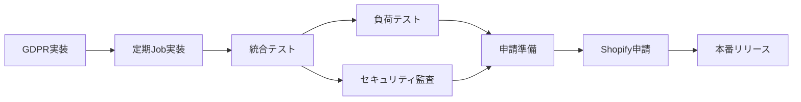

# PM-003 Progress Tracker - EC Ranger (Shopify AI Marketing Suite)

**Version**: v0.1
**スナップショット日時**: 2025-10-06 12:48:30
**作成者**: AI Project Assistant
**ステータス**: Active

## 1. エグゼクティブサマリー

### 1.1 プロジェクト全体進捗
- **全体進捗率**: 85%
- **開発フェーズ**: 本番リリース準備段階
- **目標リリース日**: 2025年9月末（Shopifyアプリストア申請）
- **クリティカルパス**: GDPR Webhook実装

### 1.2 進捗ダッシュボード

| 領域 | 進捗 | ステータス |
|------|------|-----------|
| 認証・セキュリティ | ████████████████████ 100% | ✅ 完了 |
| フロントエンド開発 | ████████████████░░░░ 80% | 🟡 進行中 |
| バックエンド開発 | ██████████████░░░░░░ 70% | 🟡 進行中 |
| 課金システム | ██████████████████░░ 90% | 🟡 進行中 |
| GDPR対応 | ░░░░░░░░░░░░░░░░░░░░ 0% | 🔴 未着手 |
| テスト | ████░░░░░░░░░░░░░░░░ 20% | 🔴 遅延 |
| ドキュメント | ████████████░░░░░░░░ 60% | 🟡 進行中 |

## 2. マイルストーン管理

| マイルストーン | 期日 | 達成率 | リスク | ステータス |
|--------------|------|--------|--------|-----------|
| **Phase 1: 基盤構築** | 2025-07-31 | 100% | - | ✅ 完了 |
| **Phase 2: 主要機能実装** | 2025-08-31 | 100% | - | ✅ 完了 |
| **Phase 3: 課金・GDPR実装** | 2025-09-15 | 45% | 🔴高 | 🟡 進行中 |
| **Phase 4: 申請準備** | 2025-09-25 | 30% | 🟡中 | ⏳ 待機中 |
| **Phase 5: 本番リリース** | 2025-09-30 | 0% | 🟡中 | ⏳ 待機中 |

## 3. タスク進捗詳細

### 3.1 現在進行中のタスク（@todo.mdより）

| タスクID | タスク名 | 優先度 | 担当 | 開始日 | 期限 | 進捗 | ステータス | 根拠 |
|---------|---------|--------|------|--------|------|------|-----------|------|
| TODO-001 | 環境変数SHOPIFY_FRONTEND_BASEURL設定 | 🔴高 | Kenji/福田 | 2025-10-06 | 2025-10-06 | 0% | ⏳ 待機中 | @todo.md:8-11 |
| TODO-002 | リダイレクト確認テスト | 🔴高 | Kenji/福田 | - | 2025-10-06 | 0% | ⏳ 待機中 | @todo.md:13-16 |
| TODO-003 | DBマイグレーション適用状況更新 | 🟡中 | Kenji | - | 2025-10-06 | 0% | ⏳ 待機中 | @todo.md:18-21 |
| TODO-004 | HangFireダッシュボード確認 | 🟡中 | Kenji | - | 2025-10-06 | 0% | ⏳ 待機中 | @todo.md:23-26 |
| TODO-005 | 申請素材・文言ステータス確認 | 🔴高 | Kenji | - | 2025-10-06 | 0% | ⏳ 待機中 | @todo.md:28-31 |
| TODO-006 | フロントエンド型エラー確認 | 🟡中 | Yuki | - | 2025-10-06 | 0% | ⏳ 待機中 | @todo.md:33-36 |

### 3.2 完了済みタスク（最近のワークログより）

| タスクID | タスク名 | 完了日 | 成果物 | 担当 | 根拠 |
|---------|---------|--------|--------|------|------|
| COMP-001 | OAuth認証実装 | 2025-08-12 | ShopifyAuthController.cs | Takashi | 2025-08-12-oauth-authentication-breakthrough.md |
| COMP-002 | 休眠顧客分析実装 | 2025-07-24 | DormantCustomers.tsx, Service | Yuki/Takashi | 2025-07-24-comprehensive-dormant-customer-implementation.md |
| COMP-003 | 前年同月比分析実装 | 2025-06-10 | YearOverYearComparison.tsx | Yuki/Takashi | 2025-06-10-180000-year-over-year-functionality-restoration.md |
| COMP-004 | 購入回数分析実装 | 2025-08-24 | PurchaseCountAnalysis.tsx | Yuki/Takashi | 2025-08-24-development-report.md |
| COMP-005 | UI統一化（8画面） | 2025-06-10 | 全分析画面 | Yuki | 2025-06-10-170000-8screen-ui-unification-complete.md |
| COMP-006 | 課金システム基盤 | 2025-08-24 | BillingController.cs | Takashi | 2025-08-24-billing-implementation-plan.md |
| COMP-007 | 無料プラン機能制限 | 2025-08-24 | FeatureAccess hooks | Yuki | 2025-08-24-free-plan-implementation.md |
| COMP-008 | EC Rangerリネーム | 2025-08-04 | 全体リネーム完了 | Kenji | 2025-08-04-ec-ranger-rename-complete.md |

### 3.3 計画中タスク（優先順位順）

| タスクID | タスク名 | 優先度 | 見積時間 | 依存関係 | ステータス | 担当予定 | 根拠 |
|---------|---------|--------|----------|----------|-----------|---------|------|
| PLAN-001 | GDPR Webhook実装 | 🔴高 | 16時間 | - | 🔴 未着手 | Takashi | FR-007, @todo.md |
| PLAN-002 | GDPR定期処理Job実装 | 🔴高 | 8時間 | PLAN-001 | 🔴 未着手 | Takashi | 2025-08-24-development-report.md |
| PLAN-003 | 申請用アイコン作成 | 🔴高 | 4時間 | - | ⏳ 待機中 | デザイナー | project-schedule.md |
| PLAN-004 | 申請用説明文作成 | 🔴高 | 4時間 | - | ⏳ 待機中 | Kenji | project-schedule.md |
| PLAN-005 | 統合テスト実施 | 🟡中 | 24時間 | PLAN-001,002 | ⏳ 待機中 | 全員 | NFR-002 |
| PLAN-006 | 負荷テスト実施 | 🟡中 | 8時間 | PLAN-005 | ⏳ 待機中 | Takashi | NFR-001 |
| PLAN-007 | セキュリティ監査 | 🟡中 | 16時間 | PLAN-005 | ⏳ 待機中 | ERIS | NFR-005 |
| PLAN-008 | ユーザーマニュアル作成 | 🟢低 | 8時間 | - | ⏳ 待機中 | Yuki | project-schedule.md |

## 4. チームメンバー別タスク状況

### 4.1 Kenji（プロジェクトマネージャー）
| 状態 | タスク数 | タスク内容 |
|------|----------|-----------|
| 完了 | 5 | プロジェクト計画、チーム調整、リネーム作業等 |
| 進行中 | 3 | 環境設定、申請準備、ドキュメント管理 |
| 計画中 | 2 | 申請文書作成、最終レビュー |

### 4.2 Yuki（フロントエンド）
| 状態 | タスク数 | タスク内容 |
|------|----------|-----------|
| 完了 | 12 | UI実装、統一化、分析画面開発 |
| 進行中 | 1 | 型エラー確認 |
| 計画中 | 3 | モック画面の実装化、テスト |

### 4.3 Takashi（バックエンド）
| 状態 | タスク数 | タスク内容 |
|------|----------|-----------|
| 完了 | 8 | API実装、認証、課金システム |
| 進行中 | 0 | - |
| 計画中 | 4 | GDPR実装、負荷テスト、性能最適化 |

## 5. ブロッカーと依存関係

### 5.1 現在のブロッカー

| ID | ブロッカー内容 | 影響タスク | 解決予定日 | 責任者 | ステータス |
|----|--------------|------------|-----------|--------|-----------|
| BLK-001 | GDPR未実装 | Shopify申請 | 2025-09-15 | Takashi | 🔴 Critical |
| BLK-002 | 環境変数未設定 | OAuth動作確認 | 2025-10-06 | Kenji | 🟡 対応中 |

### 5.2 依存関係マップ

## 6. 週次進捗レポート（2025年9月第3週）

### 6.1 今週の成果
- ✅ Excel進捗管理システム構築開始
- ✅ フロントエンド実装完了宣言（Yuki）
- ✅ API URL統一完了
- ✅ Cookie認証実装完了

### 6.2 来週の計画
- 🎯 GDPR Webhook実装開始
- 🎯 HangFire定期Job実装
- 🎯 申請素材準備
- 🎯 統合テスト計画策定

### 6.3 進捗率推移

| 週 | 全体進捗 | フロント | バック | テスト |
|----|----------|----------|--------|--------|
| 9月第1週 | 75% | 70% | 60% | 10% |
| 9月第2週 | 80% | 75% | 65% | 15% |
| 9月第3週 | 85% | 80% | 70% | 20% |
| 9月第4週（予測） | 92% | 85% | 85% | 50% |

## 7. リソース利用状況

### 7.1 工数実績と予測

| メンバー | 今週実績 | 来週予定 | 稼働率 |
|---------|----------|----------|--------|
| Kenji | 30時間 | 40時間 | 75% |
| Yuki | 35時間 | 20時間 | 87.5% |
| Takashi | 25時間 | 45時間 | 62.5% |
| ERIS | 10時間 | 20時間 | 25% |

### 7.2 予算消化状況
- **開発工数**: 85%消化（850時間/1000時間）
- **インフラコスト**: 月額$150（予算内）
- **外部サービス**: 月額$50（予算内）

## 8. 次のアクションアイテム

### 8.1 今日中（2025-10-06）
1. ✋ 環境変数SHOPIFY_FRONTEND_BASEURL設定（Kenji）
2. ✋ リダイレクトテスト実施（Kenji/福田）
3. ✋ HangFireダッシュボード確認（Kenji）

### 8.2 今週中（2025-10-06〜10-12）
1. 🎯 GDPR Webhook実装着手（Takashi）
2. 🎯 申請素材準備開始（デザイナー）
3. 🎯 統合テスト計画書作成（ERIS）

### 8.3 月末まで（2025-10-31）
1. 📅 Shopifyアプリ申請完了
2. 📅 本番環境最終確認
3. 📅 ユーザードキュメント完成

## 9. 関連ドキュメント

- [要件定義書](PM-001-Requirements.md)
- [機能一覧](PM-002-Feature-List.md)
- [課題・リスク一覧](PM-004-Issues-Risks.md)
- [プロジェクトスケジュール](project-schedule.md)
- [@todo.md](../../@todo.md)
- [ワークログ](../worklog/2025/)

## 10. 更新履歴

| 日付 | バージョン | 更新者 | 変更内容 |
|------|-----------|--------|---------|
| 2025-10-06 | v0.1 | AI Project Assistant | 初版作成 |

---
*このドキュメントは日次で更新され、プロジェクトの最新状況を反映します。*
*次回更新予定: 2025-10-07 09:00*