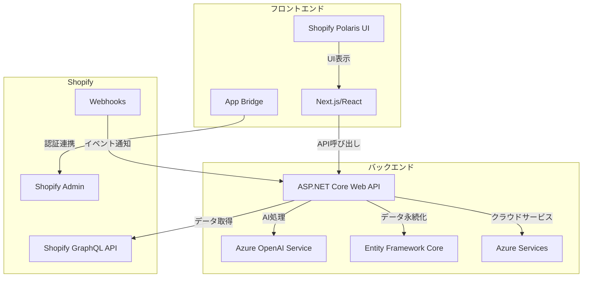

# Shopifyアプリ開発 技術スタック概要

## 使用する技術スタック　スキルセット

### フロントエンド

- HTML/CSS
  - Tailwind CSS　※プロトタイプで使用しているが未定

- JavaScript　※直接JavaScriptを書くわけではない
- **React**: コンポーネント設計、Hooks、状態管理
  - **Next.js**: ルーティング、SSR/SSG、APIルート

- **TypeScript**: 基本的な型定義と使用方法
- **Shopify Polaris**: UIコンポーネントの使用方法
- Node.js, npm 

### バックエンド

- **C#**:
- **ASP.NET Core**: WebAPI、依存性注入、ミドルウェア
- **データベース**: SQL、Entity Framework Core
- **REST API: スキーマ設計**
- **GraphQL**: スキーマ設計、クエリ実装
- **AI/ML**: Azure OpenAI Serviceの使用経験
- **Shopify GraphQL API**: ストアデータの取得と操作
- **Shopify Admin API**: 管理機能へのアクセス

### 共通

- 開発環境セットアップ VS Code + 推奨拡張機能
  - ※バックエンドは実際はVisual Studioは使います

- **Git**: 基本的なバージョン管理操作
- **Git/GitHub**: バージョン管理とコラボレーション
- **GraphQL**: クエリの書き方、Apollo Clientの使用
- CI/CDに関しては未決　
  - 例）**Vercel**: フロントエンドの自動デプロイ
  - GitHub Actions またはAzure DevOps

