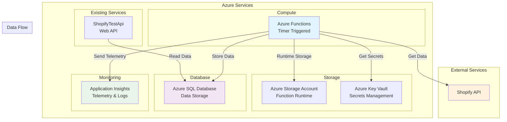
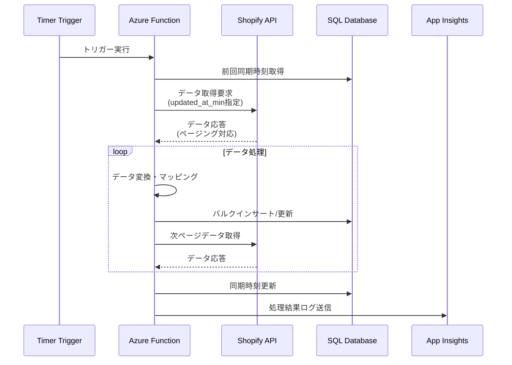
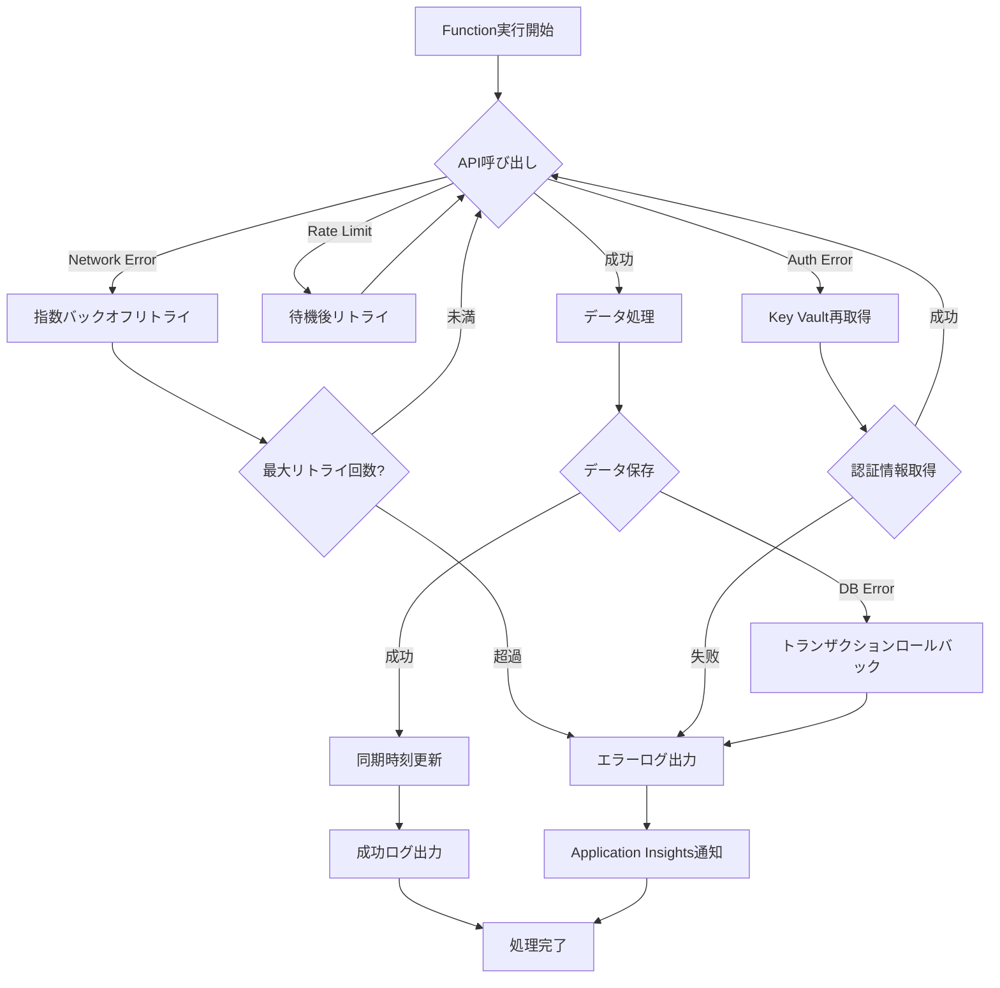
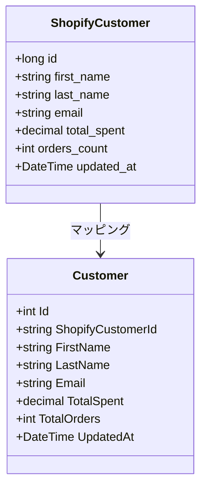
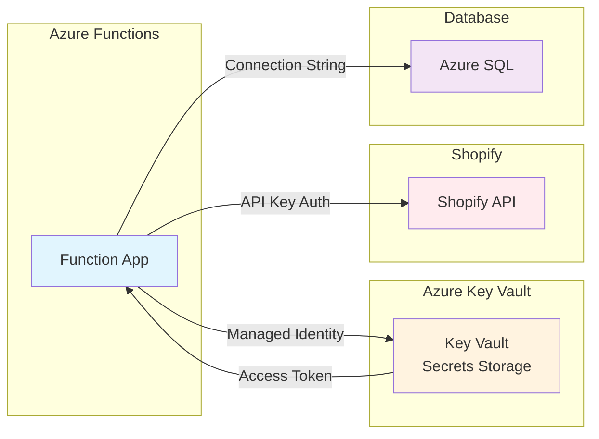
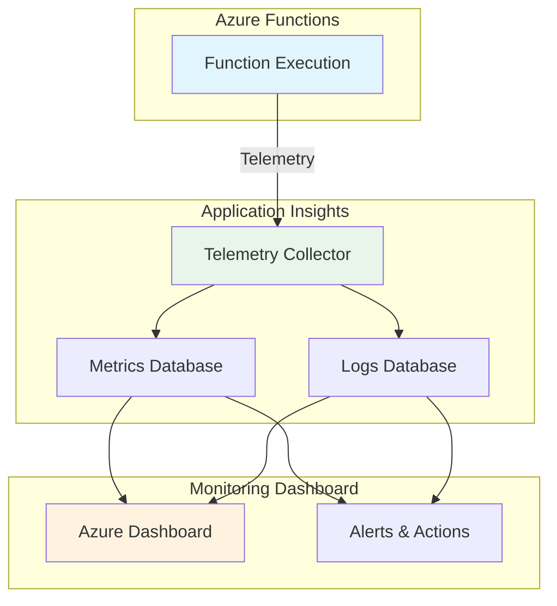
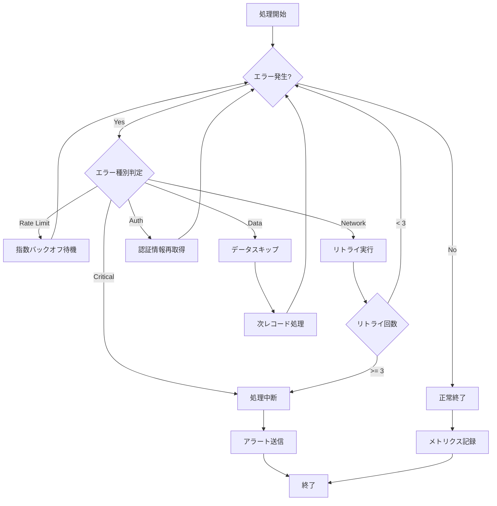
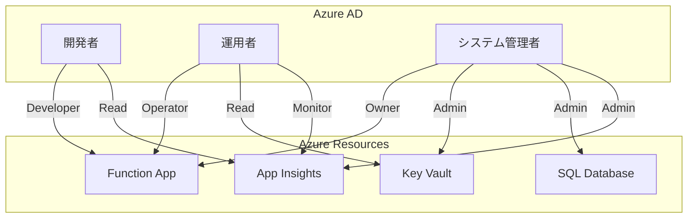
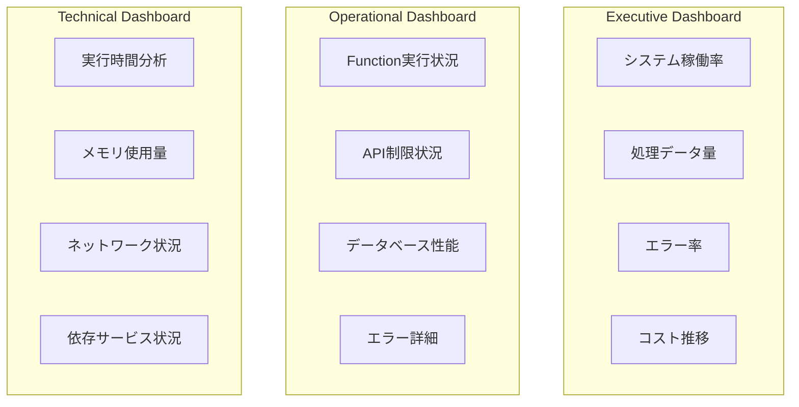

# Shopify バッチ処理システム アーキテクチャ説明資料

## 1. システム概要

### 1.1 目的と背景
ShopifyのAIマーケティングスイートにおいて、Shopify APIから定期的にデータを取得し、分析用データベースに同期するバッチ処理システムのアーキテクチャ設計。

### 1.2 主要な要件
- **データ同期**: 顧客、商品、注文データの定期同期
- **スケーラビリティ**: 大量データの効率的処理
- **信頼性**: 障害時の自動復旧とデータ整合性保証
- **監視性**: 処理状況とエラーの可視化
- **コスト効率**: 必要時のみリソース消費

## 2. アーキテクチャ全体図



## 3. アーキテクチャの詳細

### 3.1 Azure Functions 設計

#### 3.1.1 実行モデル
- **実行環境**: .NET 8 Isolated Process
- **トリガー方式**: Timer Trigger（Cron式）
- **スケーリング**: Consumption Plan（オンデマンド）
- **実行タイムアウト**: 10分

#### 3.1.2 Function 構成
```
ShopifyBatchProcessor
├── CustomerSyncFunction (2時間毎実行)
├── ProductSyncFunction (4時間毎実行)
├── OrderSyncFunction (1時間毎実行)
└── ManualSyncFunction (HTTP Trigger)
```

#### 3.1.3 Cron スケジュール
| Function | Cron式 | 実行頻度 | 備考 |
|----------|---------|----------|------|
| Customer | `0 0 */2 * * *` | 2時間毎 | 00:00, 02:00, 04:00... |
| Product | `0 30 */4 * * *` | 4時間毎 | 00:30, 04:30, 08:30... |
| Order | `0 15 */1 * * *` | 1時間毎 | 毎時15分 |

### 3.2 データフロー設計

#### 3.2.1 同期処理フロー


#### 3.2.2 エラーハンドリングフロー


### 3.3 データ設計

#### 3.3.1 同期対象エンティティ
| エンティティ | Shopify API | データベーステーブル | 更新頻度 |
|-------------|-------------|---------------------|----------|
| 顧客 | `/admin/api/2023-10/customers.json` | Customers | 2時間 |
| 商品 | `/admin/api/2023-10/products.json` | Products, ProductVariants | 4時間 |
| 注文 | `/admin/api/2023-10/orders.json` | Orders, OrderItems | 1時間 |

#### 3.3.2 データマッピング例（顧客）


### 3.4 セキュリティ設計

#### 3.4.1 認証・認可


#### 3.4.2 秘匿情報管理
| 設定項目 | 格納場所 | アクセス方法 |
|----------|----------|-------------|
| Shopify API Token | Key Vault | Managed Identity |
| DB接続文字列 | Key Vault | Managed Identity |
| Application Insights | App Settings | 環境変数 |

### 3.5 監視・ログ設計

#### 3.5.1 監視アーキテクチャ


#### 3.5.2 カスタムメトリクス
| メトリクス名 | 種類 | 説明 |
|-------------|------|------|
| `Sync.Customers.ProcessedCount` | Counter | 処理した顧客数 |
| `Sync.Customers.Duration` | Timer | 同期処理時間 |
| `Sync.Customers.ErrorCount` | Counter | エラー発生数 |
| `ShopifyApi.RateLimitRemaining` | Gauge | API制限残数 |
| `ShopifyApi.CallDuration` | Timer | API呼び出し時間 |

#### 3.5.3 ログ設計
```json
{
  "timestamp": "2024-07-24T12:00:00Z",
  "level": "Information",
  "logger": "CustomerSyncService",
  "message": "顧客同期完了",
  "properties": {
    "StoreId": 1,
    "ProcessedCount": 150,
    "Duration": "00:02:30",
    "StartTime": "2024-07-24T11:57:30Z",
    "EndTime": "2024-07-24T12:00:00Z"
  }
}
```

## 4. 非機能要件の実現

### 4.1 スケーラビリティ

#### 4.1.1 水平スケーリング
- **Consumption Plan**: 需要に応じて自動スケール（最大200インスタンス）
- **並列処理**: 複数ストア、複数エンティティの並行実行
- **バッチ処理**: 大量データの分割処理（250件/バッチ）

#### 4.1.2 パフォーマンス最適化
```csharp
// 並列処理の実装例
public async Task ProcessMultipleStoresAsync(int[] storeIds)
{
    var semaphore = new SemaphoreSlim(maxConcurrency: 3);
    var tasks = storeIds.Select(async storeId =>
    {
        await semaphore.WaitAsync();
        try
        {
            return await ProcessStoreAsync(storeId);
        }
        finally
        {
            semaphore.Release();
        }
    });
    
    var results = await Task.WhenAll(tasks);
}
```

### 4.2 可用性・信頼性

#### 4.2.1 可用性設計
- **SLA**: Azure Functions 99.95% (Consumption Plan)
- **リージョン**: Japan East (主) / Japan West (災害復旧時)
- **冗長化**: Function App複数デプロイメントスロット使用

#### 4.2.2 エラー処理・復旧


### 4.3 セキュリティ

#### 4.3.1 セキュリティ要件
| 要件 | 実装方法 | Azure サービス |
|------|----------|---------------|
| 認証 | Managed Identity | Azure AD |
| 秘匿情報管理 | Key Vault | Azure Key Vault |
| ネットワーク制限 | IP制限 | Function App |
| データ暗号化 | TLS 1.2+ | Transport Layer |
| 監査ログ | 全操作ログ | Application Insights |

#### 4.3.2 RBAC設計


## 5. 運用設計

### 5.1 デプロイメント戦略

#### 5.1.1 CI/CD パイプライン

```mermaid
graph LR
    subgraph "Development"
        D1[Local Dev]
        D2[Unit Tests]
        D3[Integration Tests]
    end
    
    subgraph "CI/CD"
        C1[GitHub Actions]
        C2[Build & Test]
        C3[Package]
    end
    
    subgraph "Staging"
        S1[Staging Slot]
        S2[E2E Tests]
        S3[Performance Tests]
    end
    
    subgraph "Production"
        P1[Production Slot]
        P2[Health Check]
        P3[Monitoring]
    end
    
    D1 --> D2 --> D3 --> C1
    C1 --> C2 --> C3 --> S1
    S1 --> S2 --> S3 --> P1
    P1 --> P2 --> P3
```


#### 5.1.2 ブルー・グリーンデプロイメント
```bash
# ステージングスロットにデプロイ
func azure functionapp publish $APP_NAME --slot staging

# テスト実行後、本番にスワップ
az functionapp deployment slot swap \
  --name $APP_NAME \
  --resource-group $RG \
  --slot staging
```

### 5.2 監視・アラート

#### 5.2.1 監視ダッシュボード設計


#### 5.2.2 アラート設定
| アラート名 | 条件 | 重要度 | 通知先 |
|-----------|------|--------|--------|
| Function実行失敗 | エラー率 > 5% | Critical | 開発チーム |
| API制限到達 | 残制限数 < 10 | Warning | 運用チーム |
| 実行時間超過 | 平均実行時間 > 5分 | Warning | 開発チーム |
| データ同期遅延 | 最終同期 > 3時間前 | Warning | 運用チーム |

### 5.3 災害復旧

#### 5.3.1 災害復旧戦略
| コンポーネント | RPO | RTO | 復旧方法 |
|---------------|-----|-----|----------|
| Function App | 1時間 | 30分 | ARM Template再デプロイ |
| データベース | 5分 | 1時間 | Point-in-time restore |
| Key Vault | 24時間 | 15分 | 別リージョンにバックアップ |
| 設定情報 | 1時間 | 15分 | Infrastructure as Code |

#### 5.3.2 復旧手順
```bash
# 1. 災害復旧用リソースグループ作成
az group create --name "$RG-dr" --location "Japan West"

# 2. ARM Template使用してインフラ復旧
az deployment group create \
  --resource-group "$RG-dr" \
  --template-file infrastructure/main.bicep \
  --parameters @parameters-dr.json

# 3. データベース復旧
az sql db restore \
  --dest-database "$DB_NAME-dr" \
  --dest-server "$SQL_SERVER-dr" \
  --resource-group "$RG-dr" \
  --source-database "$DB_NAME" \
  --time "2024-07-24T12:00:00Z"

# 4. Function App再デプロイ
func azure functionapp publish "$APP_NAME-dr"
```

## 6. コスト設計

### 6.1 コスト構造
| サービス | 課金モデル | 予想月額コスト (JPY) |
|----------|------------|---------------------|
| Azure Functions | 実行回数 + 実行時間 | ¥5,000 |
| Azure SQL Database | DTU課金 | ¥15,000 |
| Application Insights | データ量 | ¥3,000 |
| Key Vault | トランザクション | ¥500 |
| Storage Account | ストレージ容量 | ¥1,000 |
| **合計** | - | **¥24,500** |

### 6.2 コスト最適化施策
1. **Function実行最適化**: 不要な実行を削減
2. **データベースDTU調整**: 負荷に応じたスケーリング
3. **Application Insights**: サンプリング率調整
4. **ストレージ**: 不要ファイルの定期削除
5. **予約課金**: 長期利用時の割引活用

## 7. 将来の拡張性

### 7.1 スケールアウト対応
- **マルチテナント**: 複数Shopifyストアの並列処理
- **リージョン展開**: 地理的分散によるレイテンシ改善
- **Premium Plan**: より高いSLAが必要な場合の移行

### 7.2 機能拡張
- **リアルタイム同期**: Webhookによるイベント駆動処理
- **データ品質チェック**: 異常データの検出・修正
- **AI/ML統合**: 予測的なデータ同期スケジューリング

### 7.3 技術的進化対応
- **.NET 9+**: 新バージョン対応
- **Container Apps**: より細かいスケーリング制御
- **Durable Functions**: 長時間実行プロセスの実装

このアーキテクチャ設計により、スケーラブルで信頼性が高く、運用しやすいShopifyバッチ処理システムを実現できます。