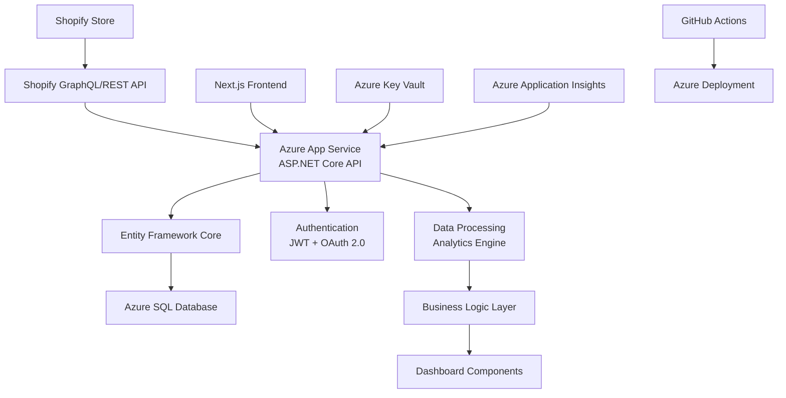
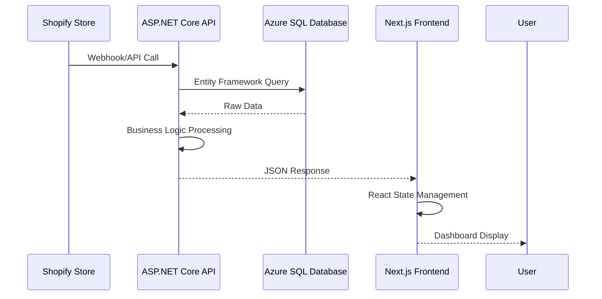

# Shopify ECマーケティング分析アプリ - プロジェクト設計ドキュメント

## 📋 目次

1. [プロジェクト概要](#プロジェクト概要)
2. [プロジェクト構造](#プロジェクト構造)
3. [技術スタック](#技術スタック)
4. [機能別ファイル配置](#機能別ファイル配置)
5. [アーキテクチャ詳細](#アーキテクチャ詳細)
6. [技術的負債と改善点](#技術的負債と改善点)
7. [今後のリファクタリング計画](#今後のリファクタリング計画)

---

## 🎯 プロジェクト概要

### 目的
Shopifyストア運営者向けの**AIを活用した購買データ分析とDM作成・郵送自動化**を実現するアプリケーション

### 主要機能
- **売上分析ダッシュボード**: 売上推移、商品別売上、前年比較などを可視化
- **顧客分析ダッシュボード**: 顧客セグメント、購入頻度、リピート率などを分析
- **AI分析インサイト**: トレンド予測、異常検知、推奨施策を自動生成
- **DM作成・郵送機能**: ターゲット顧客の抽出とDM作成・郵送の自動化（開発中）

---

## 🏗️ プロジェクト構造

```plaintext
shopify-ai-marketing-suite/
├── 📁 src/                         # メインソースコード
│   ├── 📁 app/                     # Next.js App Router
│   │   ├── 📁 api/                 # APIエンドポイント
│   │   │   └── 📁 shopify/         # Shopify API統合
│   │   │       ├── 📁 products/    # 商品API
│   │   │       ├── 📁 orders/      # 注文API
│   │   │       └── 📁 customers/   # 顧客API
│   │   ├── layout.tsx              # ルートレイアウト
│   │   ├── page.tsx                # ホームページ
│   │   └── globals.css             # グローバルスタイル
│   ├── 📁 components/              # Reactコンポーネント
│   │   ├── 📁 dashboards/          # ダッシュボード機能
│   │   │   ├── 📁 customers/       # 顧客分析サブコンポーネント
│   │   │   ├── 📁 sales/           # 売上分析サブコンポーネント
│   │   │   ├── 📁 dormant/         # 休眠顧客分析サブコンポーネント
│   │   │   └── ...                 # その他分析
│   │   ├── 📁 ui/                  # shadcn/uiベースUI部品
│   │   ├── 📁 layout/              # レイアウト関連
│   │   ├── 📁 common/              # 共通部品
│   │   └── ErrorBoundary.tsx       # エラーバウンダリ
│   ├── 📁 lib/                     # ユーティリティ・API・データ層
│   │   ├── shopify.ts              # ShopifyAPIクラス・型定義
│   │   ├── data-service.ts         # DataServiceクラス
│   │   ├── formatters.ts           # フォーマッタ
│   │   ├── utils.ts                # 汎用関数
│   │   ├── sample-products.ts      # サンプル商品データ
│   │   └── data-access/            # 型・API拡張
│   ├── 📁 contexts/                # グローバル状態管理
│   │   └── AppContext.tsx
│   ├── 📁 hooks/                   # カスタムフック
│   │   └── useCustomerTable.ts
│   ├── 📁 data/                    # データ・モック
│   │   └── mock/
│   │       └── customerData.ts     # 顧客・休眠・分析用モックデータ
├── ...
```

---

## 🛠️ 技術スタック（2025年6月16日更新）

### フロントエンド
- **Next.js**: 14 (App Router)
- **React**: 18
- **TypeScript**: 5
- **Tailwind CSS**: 3.4.17
- **Shopify Polaris**: UIコンポーネントライブラリ（Shopify公式）
- **shadcn/ui**: 補完UIコンポーネント（`src/components/ui/`に集約）
- **Radix UI**: ヘッドレスUIコンポーネント
- **Lucide React**: アイコンライブラリ
- **Recharts**: チャートライブラリ

### バックエンド・サーバーサイド
- **ASP.NET Core**: 8.0
- **Entity Framework Core**: 8.0
- **Azure SQL Database**: Standard S2
- **JWT Authentication**: 認証・認可
- **AutoMapper**: オブジェクトマッピング

### データ処理・分析
- **React Hook Form**: フォーム管理
- **Zod**: スキーマバリデーション
- **date-fns**: 日付処理
- **LINQ**: サーバーサイドデータクエリ

### Shopify統合
- **Shopify GraphQL API**: データ取得・操作
- **Shopify REST Admin API**: 管理機能
- **OAuth 2.0**: 認証フロー
- **Webhook**: リアルタイム連携
- **ShopifyAPIクラス**: `src/lib/shopify.ts`で実装
- **DataServiceクラス**: `src/lib/data-service.ts`でAPIラッパー・集計

### 状態管理
- **Zustand**: 軽量状態管理ライブラリ
- **React Query**: サーバー状態管理
- **React Context API**: 補完的グローバル状態

### インフラ・クラウド
- **Microsoft Azure**: クラウドプラットフォーム
- **Azure App Service**: Webアプリケーションホスティング
- **Azure SQL Database**: マネージドデータベース
- **Azure Key Vault**: 機密情報管理
- **Azure Application Insights**: 監視・ログ分析
- **GitHub Actions**: CI/CDパイプライン

---

## 📂 機能別ファイル配置

### 売上分析機能
| 機能 | ファイルパス | 責任 |
|------|-------------|------|
| **メインダッシュボード** | `src/components/dashboards/SalesDashboard.tsx` | KPI表示、期間選択、タブ管理 |
| **年次商品分析** | `src/components/dashboards/YearOverYearProductAnalysis.tsx` | 前年同月比商品分析 |
| **購入頻度分析** | `src/components/dashboards/ProductPurchaseFrequencyAnalysis.tsx` | 商品別購入頻度 |
| **詳細分析** | `src/components/dashboards/PurchaseFrequencyDetailAnalysis.tsx` | 購入回数詳細分析 |
| **統合分析ページ** | `src/components/dashboards/IntegratedPurchaseAnalysisPage.tsx` | 統合購入分析 |
| **サブコンポーネント** | `src/components/dashboards/sales/` | 分割されたUI・ロジック |

### 顧客分析機能
| 機能 | ファイルパス | 責任 |
|------|-------------|------|
| **顧客ダッシュボード** | `src/components/dashboards/CustomerDashboard.tsx` | 顧客セグメント、RFM分析 |
| **セグメント分析** | `src/components/dashboards/CustomerSegmentAnalysis.tsx` | 顧客セグメント詳細分析 |
| **サブコンポーネント** | `src/components/dashboards/customers/` | 分割されたUI・ロジック |

### AI分析機能
| 機能 | ファイルパス | 責任 |
|------|-------------|------|
| **AIインサイト** | `src/components/dashboards/AIInsightsDashboard.tsx` | AI分析結果表示 |

### 休眠顧客分析機能
| 機能 | ファイルパス | 責任 |
|------|-------------|------|
| **休眠顧客リスト** | `src/components/dashboards/dormant/DormantCustomerList.tsx` | 休眠顧客一覧・管理 |
| **復帰インサイト** | `src/components/dashboards/dormant/ReactivationInsights.tsx` | 復帰施策・インサイト |

### データ層
| 機能 | ファイルパス | 責任 |
|------|-------------|------|
| **Shopify API** | `src/lib/shopify.ts` | Shopify APIクライアント・型定義 |
| **データサービス** | `src/lib/data-service.ts` | データ取得・集計・分析APIラッパー |
| **ユーティリティ** | `src/lib/utils.ts` | 共通ユーティリティ |
| **サンプル商品データ** | `src/lib/sample-products.ts` | 商品モックデータ |

### モックデータ
| 機能 | ファイルパス | 内容 |
|------|-------------|------|
| **顧客・休眠・分析用** | `src/data/mock/customerData.ts` | 顧客・休眠・分析用サンプルデータ（型定義含む） |

### APIエンドポイント
| エンドポイント | ファイルパス | 責任 |
|---------------|-------------|------|
| **商品API** | `src/app/api/shopify/products/route.ts` | 商品データ取得 |
| **注文API** | `src/app/api/shopify/orders/route.ts` | 注文データ取得 |
| **顧客API** | `src/app/api/shopify/customers/route.ts` | 顧客データ取得 |

### レイアウト・UI
| 機能 | ファイルパス | 責任 |
|------|-------------|------|
| **メインレイアウト** | `src/components/layout/MainLayout.tsx` | アプリ全体レイアウト |
| **アナリティクスレイアウト** | `src/components/layout/AnalyticsPageLayout.tsx` | 分析ページ用レイアウト |
| **UIコンポーネント** | `src/components/ui/` | shadcn/ui基盤コンポーネント |
| **共通部品** | `src/components/common/` | 汎用部品（KPICard等） |

---

## 🏛️ アーキテクチャ詳細（2025年6月16日更新）

### システム構成図


### データフロー（フルスタック構成）


### 状態管理パターン（Zustand）
```typescript
// Zustand Store による軽量状態管理
interface AppStore {
  // UI状態
  activeTab: "sales" | "customers" | "ai"
  selectedPeriod: DateRange
  isLoading: boolean
  
  // データ状態
  analyticsData: AnalyticsData | null
  error: string | null
  
  // アクション
  setActiveTab: (tab: string) => void
  fetchAnalyticsData: () => Promise<void>
  refreshData: () => void
}

// React Query によるサーバー状態管理
const useAnalyticsData = () => {
  return useQuery({
    queryKey: ['analytics', selectedPeriod],
    queryFn: () => api.getAnalyticsData(selectedPeriod),
    staleTime: 5 * 60 * 1000, // 5分間キャッシュ
  })
}
```

### API統合パターン（フルスタック）
```typescript
// ASP.NET Core API Controller
[ApiController]
[Route("api/[controller]")]
public class AnalyticsController : ControllerBase
{
    private readonly IAnalyticsService _analyticsService;
    
    [HttpGet("sales-trends")]
    public async Task<IActionResult> GetSalesTrends(
        [FromQuery] DateTime startDate, 
        [FromQuery] DateTime endDate)
    {
        var trends = await _analyticsService.GetSalesTrendsAsync(startDate, endDate);
        return Ok(trends);
    }
}

// Next.js API Client
export class ApiClient {
  private baseUrl = process.env.NEXT_PUBLIC_API_URL;
  
  async getSalesTrends(startDate: Date, endDate: Date): Promise<SalesTrend[]> {
    const response = await fetch(
      `${this.baseUrl}/api/analytics/sales-trends?startDate=${startDate.toISOString()}&endDate=${endDate.toISOString()}`,
      { headers: { Authorization: `Bearer ${await getToken()}` } }
    );
    return response.json();
  }
}

// Entity Framework Data Access
public class AnalyticsService : IAnalyticsService
{
    private readonly ApplicationDbContext _context;
    
    public async Task<List<SalesTrend>> GetSalesTrendsAsync(DateTime startDate, DateTime endDate)
    {
        return await _context.Orders
            .Where(o => o.CreatedAt >= startDate && o.CreatedAt <= endDate)
            .GroupBy(o => new { o.ProductId, o.CreatedAt.Date })
            .Select(g => new SalesTrend { ... })
            .ToListAsync();
    }
}
```

### セキュリティアーキテクチャ
```typescript
// JWT認証 + Shopify OAuth統合
interface SecurityLayer {
  // 認証
  shopifyOAuth: ShopifyOAuthProvider
  jwtTokens: JWTManager
  
  // 認可
  roleBasedAccess: RoleManager
  apiKeyValidation: ApiKeyValidator
  
  // セキュリティ
  rateLimiting: RateLimiter
  dataEncryption: AzureKeyVault
  auditLogging: ApplicationInsights
}
```

### モックデータ設計
- `src/data/mock/customerData.ts` にて、顧客・休眠・分析用の型定義とサンプルデータを一元管理。
- 実データと同等の型安全性を担保。
- 開発/本番でDataProvider等で切替可能。

---

## ⚠️ 技術的負債と改善点

### 🔴 重複ファイル問題（高優先度）
- UI部品は `src/components/ui/` に集約。重複/分散は解消済み。
- インポートパスは `@/components/ui/` で統一。

### 🟡 大規模コンポーネント問題（中優先度）
- `dashboards/` 配下でサブディレクトリ分割・サブコンポーネント化を推進。
- 1000行超の大規模ファイルは段階的に分割中。

### 🟡 ハードコードデータ問題（中優先度）
- モックデータは `src/data/mock/` に集約。
- DataService等で開発/本番切替を実装。

### 🟢 パフォーマンス最適化（低優先度）
- 動的インポート・React.memo等を積極活用。

---

## 🔄 今後のリファクタリング計画

- サブディレクトリ分割・型定義の厳密化・API/データ層の整理を継続
- 画面設計書の追加・各画面単位での設計情報の明文化

---

## 🎯 開発者向けガイドライン

- 既存コンポーネント・UI部品の再利用を徹底
- サブディレクトリ分割・型安全性・モックデータ管理を厳守
- コードレビュー時は重複・ハードコード・粒度・パフォーマンスを重点確認

---

*最終更新: 2025年6月16日（Azure+ASP.NET Core フルスタック構成・初期リリース機能絞り込み対応）*
*作成者: AI Assistant*
*バージョン: 2.0.0* 