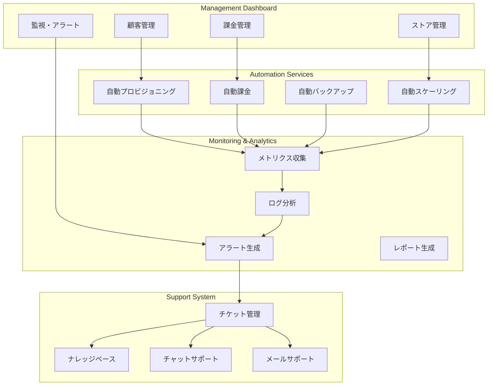

# マルチテナント運用管理設計書

## 概要

本ドキュメントは、マルチテナントShopifyアプリの運用管理設計詳細を定義します。

**作成日**: 2025年1月25日  
**バージョン**: 1.0  
**担当**: 福田 + AI Assistant  
**ステータス**: 設計中

## 運用管理アーキテクチャ

### 運用管理システム構成



## 顧客管理ダッシュボード

### 1. 顧客管理機能

```typescript
// 顧客管理ダッシュボード
interface CustomerManagementDashboard {
  // 顧客一覧
  customers: CustomerSummary[];
  
  // 顧客詳細
  customerDetail: {
    id: string;
    companyName: string;
    contactEmail: string;
    contactPhone: string;
    billingAddress: string;
    status: 'active' | 'inactive' | 'suspended' | 'deleted';
    createdAt: Date;
    updatedAt: Date;
    
    // 統計情報
    stats: {
      totalStores: number;
      activeStores: number;
      totalRevenue: number;
      monthlyUsage: number;
      lastLoginDate: Date;
    };
    
    // ストア一覧
    stores: StoreSummary[];
    
    // サブスクリプション情報
    subscription: SubscriptionInfo;
    
    // 請求履歴
    billingHistory: BillingRecord[];
    
    // 使用量メトリクス
    usageMetrics: UsageMetrics;
  };
  
  // 顧客操作
  operations: {
    createCustomer: (customerData: CreateCustomerRequest) => Promise<Customer>;
    updateCustomer: (customerId: string, updates: UpdateCustomerRequest) => Promise<Customer>;
    suspendCustomer: (customerId: string, reason: string) => Promise<void>;
    reactivateCustomer: (customerId: string) => Promise<void>;
    deleteCustomer: (customerId: string) => Promise<void>;
  };
}

interface CustomerSummary {
  id: string;
  companyName: string;
  contactEmail: string;
  status: string;
  totalStores: number;
  activeStores: number;
  monthlyRevenue: number;
  lastActivity: Date;
  createdAt: Date;
}

interface StoreSummary {
  id: string;
  shopDomain: string;
  shopName: string;
  status: 'active' | 'inactive' | 'uninstalled';
  installedAt: Date;
  lastSyncDate: Date;
  dataUsage: number;
  webhookEvents: number;
}

interface SubscriptionInfo {
  planType: 'Starter' | 'Professional' | 'Enterprise';
  monthlyFee: number;
  startDate: Date;
  endDate?: Date;
  status: 'active' | 'cancelled' | 'suspended' | 'expired';
  stripeSubscriptionId?: string;
  autoRenew: boolean;
}

interface BillingRecord {
  id: string;
  amount: number;
  currency: string;
  billingDate: Date;
  status: 'pending' | 'paid' | 'failed' | 'refunded';
  stripeInvoiceId?: string;
  description: string;
}

interface UsageMetrics {
  apiCalls: {
    current: number;
    limit: number;
    usage: number; // percentage
  };
  dataStorage: {
    current: number; // GB
    limit: number;
    usage: number;
  };
  webhookEvents: {
    current: number;
    limit: number;
    usage: number;
  };
}
```

### 2. 顧客管理API

```csharp
[ApiController]
[Route("api/admin/customers")]
[Authorize(Roles = "Admin")]
public class CustomerManagementController : ControllerBase
{
    private readonly ICustomerManagementService _customerService;
    private readonly ILogger<CustomerManagementController> _logger;
    
    [HttpGet]
    public async Task<ActionResult<PagedResult<CustomerSummary>>> GetCustomers(
        [FromQuery] CustomerSearchRequest request)
    {
        try
        {
            var customers = await _customerService.GetCustomersAsync(request);
            return Ok(customers);
        }
        catch (Exception ex)
        {
            _logger.LogError(ex, "Failed to get customers");
            return StatusCode(500, "Internal server error");
        }
    }
    
    [HttpGet("{customerId}")]
    public async Task<ActionResult<CustomerDetail>> GetCustomerDetail(string customerId)
    {
        try
        {
            var customer = await _customerService.GetCustomerDetailAsync(customerId);
            if (customer == null)
            {
                return NotFound($"Customer {customerId} not found");
            }
            
            return Ok(customer);
        }
        catch (Exception ex)
        {
            _logger.LogError(ex, "Failed to get customer detail for {CustomerId}", customerId);
            return StatusCode(500, "Internal server error");
        }
    }
    
    [HttpPost]
    public async Task<ActionResult<Customer>> CreateCustomer([FromBody] CreateCustomerRequest request)
    {
        try
        {
            var customer = await _customerService.CreateCustomerAsync(request);
            return CreatedAtAction(nameof(GetCustomerDetail), new { customerId = customer.CustomerId }, customer);
        }
        catch (ValidationException ex)
        {
            return BadRequest(ex.Message);
        }
        catch (Exception ex)
        {
            _logger.LogError(ex, "Failed to create customer");
            return StatusCode(500, "Internal server error");
        }
    }
    
    [HttpPut("{customerId}")]
    public async Task<ActionResult<Customer>> UpdateCustomer(
        string customerId, [FromBody] UpdateCustomerRequest request)
    {
        try
        {
            var customer = await _customerService.UpdateCustomerAsync(customerId, request);
            return Ok(customer);
        }
        catch (CustomerNotFoundException)
        {
            return NotFound($"Customer {customerId} not found");
        }
        catch (ValidationException ex)
        {
            return BadRequest(ex.Message);
        }
        catch (Exception ex)
        {
            _logger.LogError(ex, "Failed to update customer {CustomerId}", customerId);
            return StatusCode(500, "Internal server error");
        }
    }
    
    [HttpPost("{customerId}/suspend")]
    public async Task<ActionResult> SuspendCustomer(
        string customerId, [FromBody] SuspendCustomerRequest request)
    {
        try
        {
            await _customerService.SuspendCustomerAsync(customerId, request.Reason);
            return Ok();
        }
        catch (CustomerNotFoundException)
        {
            return NotFound($"Customer {customerId} not found");
        }
        catch (Exception ex)
        {
            _logger.LogError(ex, "Failed to suspend customer {CustomerId}", customerId);
            return StatusCode(500, "Internal server error");
        }
    }
    
    [HttpPost("{customerId}/reactivate")]
    public async Task<ActionResult> ReactivateCustomer(string customerId)
    {
        try
        {
            await _customerService.ReactivateCustomerAsync(customerId);
            return Ok();
        }
        catch (CustomerNotFoundException)
        {
            return NotFound($"Customer {customerId} not found");
        }
        catch (Exception ex)
        {
            _logger.LogError(ex, "Failed to reactivate customer {CustomerId}", customerId);
            return StatusCode(500, "Internal server error");
        }
    }
}
```

## ストア管理システム

### 1. ストア監視機能

```csharp
public class StoreMonitoringService
{
    private readonly ILogger<StoreMonitoringService> _logger;
    private readonly IStoreRepository _storeRepository;
    private readonly IShopifyClientFactory _shopifyClientFactory;
    private readonly IAlertService _alertService;
    
    public async Task MonitorStoreHealthAsync()
    {
        var activeStores = await _storeRepository.GetActiveStoresAsync();
        
        foreach (var store in activeStores)
        {
            try
            {
                var isHealthy = await CheckStoreHealthAsync(store);
                if (!isHealthy)
                {
                    await HandleUnhealthyStoreAsync(store);
                }
            }
            catch (Exception ex)
            {
                _logger.LogError(ex, "Failed to monitor store {ShopDomain}", store.ShopDomain);
            }
        }
    }
    
    private async Task<bool> CheckStoreHealthAsync(Store store)
    {
        try
        {
            var client = _shopifyClientFactory.CreateClient(store.ShopDomain, store.AccessToken);
            
            // 簡単なAPI呼び出しで接続確認
            var shop = await client.GetShopAsync();
            
            // 最終同期時刻を更新
            store.LastSyncDate = DateTime.UtcNow;
            await _storeRepository.UpdateAsync(store);
            
            return true;
        }
        catch (Exception ex)
        {
            _logger.LogWarning(ex, "Store health check failed for {ShopDomain}", store.ShopDomain);
            return false;
        }
    }
    
    private async Task HandleUnhealthyStoreAsync(Store store)
    {
        // アラート送信
        await _alertService.SendStoreHealthAlertAsync(new StoreHealthAlert
        {
            CustomerId = store.CustomerId,
            ShopDomain = store.ShopDomain,
            AlertType = "StoreConnectionLost",
            Message = $"Store {store.ShopDomain} is not responding",
            Severity = "Medium",
            Timestamp = DateTime.UtcNow
        });
        
        // ストアステータスを更新
        store.Status = "inactive";
        store.UpdatedAt = DateTime.UtcNow;
        await _storeRepository.UpdateAsync(store);
    }
    
    public async Task<StoreAnalytics> GetStoreAnalyticsAsync(string storeId)
    {
        var store = await _storeRepository.GetByIdAsync(storeId);
        if (store == null)
        {
            throw new StoreNotFoundException(storeId);
        }
        
        // 分析データを収集
        var analytics = new StoreAnalytics
        {
            StoreId = storeId,
            ShopDomain = store.ShopDomain,
            LastSyncDate = store.LastSyncDate,
            DataUsage = await CalculateDataUsageAsync(storeId),
            WebhookEvents = await GetWebhookEventCountAsync(storeId),
            ApiCalls = await GetApiCallCountAsync(storeId),
            PerformanceMetrics = await GetPerformanceMetricsAsync(storeId)
        };
        
        return analytics;
    }
    
    private async Task<long> CalculateDataUsageAsync(string storeId)
    {
        // 分析データのサイズを計算
        var analyticsData = await _analyticsRepository.GetByStoreAsync(storeId);
        return analyticsData.Sum(x => x.Data.Length);
    }
    
    private async Task<int> GetWebhookEventCountAsync(string storeId)
    {
        var last24Hours = DateTime.UtcNow.AddHours(-24);
        return await _webhookRepository.GetEventCountAsync(storeId, last24Hours);
    }
    
    private async Task<int> GetApiCallCountAsync(string storeId)
    {
        var last24Hours = DateTime.UtcNow.AddHours(-24);
        return await _apiUsageRepository.GetCallCountAsync(storeId, last24Hours);
    }
    
    private async Task<PerformanceMetrics> GetPerformanceMetricsAsync(string storeId)
    {
        var last7Days = DateTime.UtcNow.AddDays(-7);
        var metrics = await _performanceRepository.GetMetricsAsync(storeId, last7Days);
        
        return new PerformanceMetrics
        {
            AverageResponseTime = metrics.Average(x => x.ResponseTime),
            ErrorRate = metrics.Count(x => x.HasError) / (double)metrics.Count,
            Throughput = metrics.Count / 7.0 // 1日あたり
        };
    }
}
```

### 2. ストア管理API

```csharp
[ApiController]
[Route("api/admin/stores")]
[Authorize(Roles = "Admin")]
public class StoreManagementController : ControllerBase
{
    private readonly IStoreManagementService _storeService;
    private readonly ILogger<StoreManagementController> _logger;
    
    [HttpGet]
    public async Task<ActionResult<PagedResult<StoreSummary>>> GetStores(
        [FromQuery] StoreSearchRequest request)
    {
        try
        {
            var stores = await _storeService.GetStoresAsync(request);
            return Ok(stores);
        }
        catch (Exception ex)
        {
            _logger.LogError(ex, "Failed to get stores");
            return StatusCode(500, "Internal server error");
        }
    }
    
    [HttpGet("{storeId}")]
    public async Task<ActionResult<StoreDetail>> GetStoreDetail(string storeId)
    {
        try
        {
            var store = await _storeService.GetStoreDetailAsync(storeId);
            if (store == null)
            {
                return NotFound($"Store {storeId} not found");
            }
            
            return Ok(store);
        }
        catch (Exception ex)
        {
            _logger.LogError(ex, "Failed to get store detail for {StoreId}", storeId);
            return StatusCode(500, "Internal server error");
        }
    }
    
    [HttpGet("{storeId}/analytics")]
    public async Task<ActionResult<StoreAnalytics>> GetStoreAnalytics(string storeId)
    {
        try
        {
            var analytics = await _storeService.GetStoreAnalyticsAsync(storeId);
            return Ok(analytics);
        }
        catch (StoreNotFoundException)
        {
            return NotFound($"Store {storeId} not found");
        }
        catch (Exception ex)
        {
            _logger.LogError(ex, "Failed to get store analytics for {StoreId}", storeId);
            return StatusCode(500, "Internal server error");
        }
    }
    
    [HttpPost("{storeId}/sync")]
    public async Task<ActionResult> SyncStore(string storeId)
    {
        try
        {
            await _storeService.SyncStoreAsync(storeId);
            return Ok();
        }
        catch (StoreNotFoundException)
        {
            return NotFound($"Store {storeId} not found");
        }
        catch (Exception ex)
        {
            _logger.LogError(ex, "Failed to sync store {StoreId}", storeId);
            return StatusCode(500, "Internal server error");
        }
    }
    
    [HttpPost("{storeId}/uninstall")]
    public async Task<ActionResult> UninstallStore(string storeId)
    {
        try
        {
            await _storeService.UninstallStoreAsync(storeId);
            return Ok();
        }
        catch (StoreNotFoundException)
        {
            return NotFound($"Store {storeId} not found");
        }
        catch (Exception ex)
        {
            _logger.LogError(ex, "Failed to uninstall store {StoreId}", storeId);
            return StatusCode(500, "Internal server error");
        }
    }
}
```

## 課金管理システム

### 1. 自動課金機能

```csharp
public class BillingManagementService
{
    private readonly ILogger<BillingManagementService> _logger;
    private readonly ISubscriptionRepository _subscriptionRepository;
    private readonly IBillingRepository _billingRepository;
    private readonly IUsageService _usageService;
    private readonly IStripeService _stripeService;
    private readonly IAlertService _alertService;
    
    public async Task ProcessMonthlyBillingAsync()
    {
        var activeSubscriptions = await _subscriptionRepository.GetActiveSubscriptionsAsync();
        
        foreach (var subscription in activeSubscriptions)
        {
            try
            {
                await ProcessCustomerBillingAsync(subscription);
            }
            catch (Exception ex)
            {
                _logger.LogError(ex, "Failed to process billing for customer {CustomerId}", 
                    subscription.CustomerId);
                
                await _alertService.SendBillingAlertAsync(new BillingAlert
                {
                    CustomerId = subscription.CustomerId,
                    AlertType = "BillingProcessingFailed",
                    Message = $"Failed to process billing: {ex.Message}",
                    Severity = "High",
                    Timestamp = DateTime.UtcNow
                });
            }
        }
    }
    
    private async Task ProcessCustomerBillingAsync(Subscription subscription)
    {
        // 使用量を取得
        var usage = await _usageService.GetMonthlyUsageAsync(subscription.CustomerId);
        
        // 課金計算
        var billingCalculation = await CalculateBillingAsync(subscription, usage);
        
        // Stripeで課金処理
        var invoice = await _stripeService.CreateInvoiceAsync(new CreateInvoiceRequest
        {
            CustomerId = subscription.CustomerId,
            SubscriptionId = subscription.StripeSubscriptionId,
            Amount = billingCalculation.TotalAmount,
            Currency = "USD",
            Description = billingCalculation.Description,
            Metadata = new Dictionary<string, string>
            {
                ["customer_id"] = subscription.CustomerId,
                ["billing_period"] = DateTime.UtcNow.ToString("yyyy-MM"),
                ["api_calls"] = usage.ApiCalls.ToString(),
                ["data_usage_gb"] = usage.DataUsageGB.ToString(),
                ["webhook_events"] = usage.WebhookEvents.ToString()
            }
        });
        
        // 課金履歴を保存
        var billingRecord = new BillingHistory
        {
            CustomerId = subscription.CustomerId,
            SubscriptionId = subscription.Id,
            Amount = billingCalculation.TotalAmount,
            Currency = "USD",
            BillingDate = DateTime.UtcNow,
            Status = "pending",
            StripeInvoiceId = invoice.Id,
            Description = billingCalculation.Description
        };
        
        await _billingRepository.CreateAsync(billingRecord);
        
        _logger.LogInformation("Billing processed for customer {CustomerId}, amount: {Amount}", 
            subscription.CustomerId, billingCalculation.TotalAmount);
    }
    
    private async Task<BillingCalculation> CalculateBillingAsync(Subscription subscription, UsageMetrics usage)
    {
        var plan = PlanConfigurations.Plans[subscription.PlanType];
        var baseCharge = plan.MonthlyFee;
        
        // 使用量超過料金
        var overageCharges = new List<OverageCharge>();
        
        // API呼び出し超過
        if (usage.ApiCalls > plan.MaxApiCallsPerMonth)
        {
            var overage = usage.ApiCalls - plan.MaxApiCallsPerMonth;
            var charge = overage * 0.001m; // $0.001 per API call
            overageCharges.Add(new OverageCharge
            {
                Type = "ApiCalls",
                Overage = overage,
                Rate = 0.001m,
                Amount = charge
            });
        }
        
        // ストア数超過
        if (plan.MaxStores > 0 && usage.StoreCount > plan.MaxStores)
        {
            var overage = usage.StoreCount - plan.MaxStores;
            var charge = overage * 10m; // $10 per additional store
            overageCharges.Add(new OverageCharge
            {
                Type = "Stores",
                Overage = overage,
                Rate = 10m,
                Amount = charge
            });
        }
        
        var totalOverage = overageCharges.Sum(x => x.Amount);
        var totalAmount = baseCharge + totalOverage;
        
        return new BillingCalculation
        {
            BaseCharge = baseCharge,
            OverageCharges = overageCharges,
            TotalAmount = totalAmount,
            Description = GenerateBillingDescription(plan, usage, overageCharges)
        };
    }
    
    private string GenerateBillingDescription(PlanConfiguration plan, UsageMetrics usage, List<OverageCharge> overages)
    {
        var description = $"{plan.Type} Plan - {DateTime.UtcNow:MMMM yyyy}";
        
        if (overages.Any())
        {
            description += "\nOverage Charges:";
            foreach (var overage in overages)
            {
                description += $"\n- {overage.Type}: {overage.Overage} units @ ${overage.Rate:F3} = ${overage.Amount:F2}";
            }
        }
        
        return description;
    }
    
    public async Task HandlePaymentFailureAsync(string customerId, string invoiceId, string reason)
    {
        // 課金失敗の処理
        var billingRecord = await _billingRepository.GetByStripeInvoiceIdAsync(invoiceId);
        if (billingRecord != null)
        {
            billingRecord.Status = "failed";
            billingRecord.UpdatedAt = DateTime.UtcNow;
            await _billingRepository.UpdateAsync(billingRecord);
        }
        
        // 顧客に通知
        await _alertService.SendBillingAlertAsync(new BillingAlert
        {
            CustomerId = customerId,
            AlertType = "PaymentFailed",
            Message = $"Payment failed: {reason}",
            Severity = "High",
            Timestamp = DateTime.UtcNow
        });
        
        // サブスクリプションを一時停止
        var subscription = await _subscriptionRepository.GetByCustomerAsync(customerId);
        if (subscription != null)
        {
            subscription.Status = "suspended";
            subscription.UpdatedAt = DateTime.UtcNow;
            await _subscriptionRepository.UpdateAsync(subscription);
        }
    }
}
```

### 2. 課金管理API

```csharp
[ApiController]
[Route("api/admin/billing")]
[Authorize(Roles = "Admin")]
public class BillingManagementController : ControllerBase
{
    private readonly IBillingManagementService _billingService;
    private readonly ILogger<BillingManagementController> _logger;
    
    [HttpGet("customers/{customerId}/billing")]
    public async Task<ActionResult<CustomerBillingInfo>> GetCustomerBilling(string customerId)
    {
        try
        {
            var billing = await _billingService.GetCustomerBillingAsync(customerId);
            return Ok(billing);
        }
        catch (CustomerNotFoundException)
        {
            return NotFound($"Customer {customerId} not found");
        }
        catch (Exception ex)
        {
            _logger.LogError(ex, "Failed to get billing for customer {CustomerId}", customerId);
            return StatusCode(500, "Internal server error");
        }
    }
    
    [HttpGet("customers/{customerId}/usage")]
    public async Task<ActionResult<UsageMetrics>> GetCustomerUsage(string customerId)
    {
        try
        {
            var usage = await _billingService.GetCustomerUsageAsync(customerId);
            return Ok(usage);
        }
        catch (CustomerNotFoundException)
        {
            return NotFound($"Customer {customerId} not found");
        }
        catch (Exception ex)
        {
            _logger.LogError(ex, "Failed to get usage for customer {CustomerId}", customerId);
            return StatusCode(500, "Internal server error");
        }
    }
    
    [HttpPost("customers/{customerId}/adjust")]
    public async Task<ActionResult> AdjustBilling(
        string customerId, [FromBody] BillingAdjustmentRequest request)
    {
        try
        {
            await _billingService.AdjustBillingAsync(customerId, request);
            return Ok();
        }
        catch (CustomerNotFoundException)
        {
            return NotFound($"Customer {customerId} not found");
        }
        catch (ValidationException ex)
        {
            return BadRequest(ex.Message);
        }
        catch (Exception ex)
        {
            _logger.LogError(ex, "Failed to adjust billing for customer {CustomerId}", customerId);
            return StatusCode(500, "Internal server error");
        }
    }
    
    [HttpPost("customers/{customerId}/refund")]
    public async Task<ActionResult> ProcessRefund(
        string customerId, [FromBody] RefundRequest request)
    {
        try
        {
            await _billingService.ProcessRefundAsync(customerId, request);
            return Ok();
        }
        catch (CustomerNotFoundException)
        {
            return NotFound($"Customer {customerId} not found");
        }
        catch (ValidationException ex)
        {
            return BadRequest(ex.Message);
        }
        catch (Exception ex)
        {
            _logger.LogError(ex, "Failed to process refund for customer {CustomerId}", customerId);
            return StatusCode(500, "Internal server error");
        }
    }
}
```

## 監視・アラートシステム

### 1. システム監視

```csharp
public class SystemMonitoringService
{
    private readonly ILogger<SystemMonitoringService> _logger;
    private readonly IMetricsCollector _metricsCollector;
    private readonly IAlertService _alertService;
    private readonly IHealthCheckService _healthCheckService;
    
    public async Task MonitorSystemHealthAsync()
    {
        // データベース監視
        await MonitorDatabaseHealthAsync();
        
        // API監視
        await MonitorApiHealthAsync();
        
        // 外部サービス監視
        await MonitorExternalServicesAsync();
        
        // リソース使用量監視
        await MonitorResourceUsageAsync();
    }
    
    private async Task MonitorDatabaseHealthAsync()
    {
        var dbHealth = await _healthCheckService.CheckDatabaseHealthAsync();
        
        if (!dbHealth.IsHealthy)
        {
            await _alertService.SendSystemAlertAsync(new SystemAlert
            {
                AlertType = "DatabaseUnhealthy",
                Message = $"Database health check failed: {dbHealth.ErrorMessage}",
                Severity = "Critical",
                Timestamp = DateTime.UtcNow
            });
        }
        
        // データベースパフォーマンスメトリクス
        var dbMetrics = await _metricsCollector.GetDatabaseMetricsAsync();
        await _metricsCollector.RecordMetricsAsync("database", dbMetrics);
    }
    
    private async Task MonitorApiHealthAsync()
    {
        var apiHealth = await _healthCheckService.CheckApiHealthAsync();
        
        if (!apiHealth.IsHealthy)
        {
            await _alertService.SendSystemAlertAsync(new SystemAlert
            {
                AlertType = "ApiUnhealthy",
                Message = $"API health check failed: {apiHealth.ErrorMessage}",
                Severity = "High",
                Timestamp = DateTime.UtcNow
            });
        }
        
        // APIパフォーマンスメトリクス
        var apiMetrics = await _metricsCollector.GetApiMetricsAsync();
        await _metricsCollector.RecordMetricsAsync("api", apiMetrics);
    }
    
    private async Task MonitorExternalServicesAsync()
    {
        // Shopify API監視
        var shopifyHealth = await _healthCheckService.CheckShopifyApiHealthAsync();
        if (!shopifyHealth.IsHealthy)
        {
            await _alertService.SendSystemAlertAsync(new SystemAlert
            {
                AlertType = "ShopifyApiUnhealthy",
                Message = "Shopify API is not responding",
                Severity = "High",
                Timestamp = DateTime.UtcNow
            });
        }
        
        // Azure Service Bus監視
        var serviceBusHealth = await _healthCheckService.CheckServiceBusHealthAsync();
        if (!serviceBusHealth.IsHealthy)
        {
            await _alertService.SendSystemAlertAsync(new SystemAlert
            {
                AlertType = "ServiceBusUnhealthy",
                Message = "Azure Service Bus is not responding",
                Severity = "High",
                Timestamp = DateTime.UtcNow
            });
        }
    }
    
    private async Task MonitorResourceUsageAsync()
    {
        var resourceMetrics = await _metricsCollector.GetResourceMetricsAsync();
        
        // CPU使用率監視
        if (resourceMetrics.CpuUsage > 80)
        {
            await _alertService.SendSystemAlertAsync(new SystemAlert
            {
                AlertType = "HighCpuUsage",
                Message = $"High CPU usage detected: {resourceMetrics.CpuUsage}%",
                Severity = "Medium",
                Timestamp = DateTime.UtcNow
            });
        }
        
        // メモリ使用率監視
        if (resourceMetrics.MemoryUsage > 85)
        {
            await _alertService.SendSystemAlertAsync(new SystemAlert
            {
                AlertType = "HighMemoryUsage",
                Message = $"High memory usage detected: {resourceMetrics.MemoryUsage}%",
                Severity = "Medium",
                Timestamp = DateTime.UtcNow
            });
        }
        
        // ディスク使用率監視
        if (resourceMetrics.DiskUsage > 90)
        {
            await _alertService.SendSystemAlertAsync(new SystemAlert
            {
                AlertType = "HighDiskUsage",
                Message = $"High disk usage detected: {resourceMetrics.DiskUsage}%",
                Severity = "High",
                Timestamp = DateTime.UtcNow
            });
        }
        
        await _metricsCollector.RecordMetricsAsync("resources", resourceMetrics);
    }
}
```

### 2. アラート管理

```csharp
public class AlertManagementService
{
    private readonly ILogger<AlertManagementService> _logger;
    private readonly IAlertRepository _alertRepository;
    private readonly IEmailService _emailService;
    private readonly ISlackService _slackService;
    private readonly ISmsService _smsService;
    
    public async Task SendAlertAsync(Alert alert)
    {
        try
        {
            // アラートをデータベースに保存
            await _alertRepository.CreateAsync(alert);
            
            // 重要度に応じて通知
            switch (alert.Severity.ToLower())
            {
                case "critical":
                    await SendCriticalAlertAsync(alert);
                    break;
                case "high":
                    await SendHighPriorityAlertAsync(alert);
                    break;
                case "medium":
                    await SendMediumPriorityAlertAsync(alert);
                    break;
                case "low":
                    await SendLowPriorityAlertAsync(alert);
                    break;
            }
            
            _logger.LogInformation("Alert sent: {AlertType} - {Message}", alert.AlertType, alert.Message);
        }
        catch (Exception ex)
        {
            _logger.LogError(ex, "Failed to send alert: {AlertType}", alert.AlertType);
        }
    }
    
    private async Task SendCriticalAlertAsync(Alert alert)
    {
        // 即座に複数のチャネルで通知
        var tasks = new List<Task>();
        
        tasks.Add(_emailService.SendCriticalAlertAsync(alert));
        tasks.Add(_slackService.SendCriticalAlertAsync(alert));
        tasks.Add(_smsService.SendCriticalAlertAsync(alert));
        
        await Task.WhenAll(tasks);
    }
    
    private async Task SendHighPriorityAlertAsync(Alert alert)
    {
        // メールとSlackで通知
        var tasks = new List<Task>();
        
        tasks.Add(_emailService.SendHighPriorityAlertAsync(alert));
        tasks.Add(_slackService.SendHighPriorityAlertAsync(alert));
        
        await Task.WhenAll(tasks);
    }
    
    private async Task SendMediumPriorityAlertAsync(Alert alert)
    {
        // Slackで通知
        await _slackService.SendMediumPriorityAlertAsync(alert);
    }
    
    private async Task SendLowPriorityAlertAsync(Alert alert)
    {
        // ログのみ
        _logger.LogInformation("Low priority alert: {AlertType} - {Message}", 
            alert.AlertType, alert.Message);
    }
    
    public async Task<List<Alert>> GetAlertsAsync(AlertFilterRequest filter)
    {
        return await _alertRepository.GetAlertsAsync(filter);
    }
    
    public async Task<Alert> GetAlertAsync(string alertId)
    {
        return await _alertRepository.GetByIdAsync(alertId);
    }
    
    public async Task MarkAlertAsResolvedAsync(string alertId, string resolvedBy, string resolutionNotes)
    {
        var alert = await _alertRepository.GetByIdAsync(alertId);
        if (alert != null)
        {
            alert.Status = "resolved";
            alert.ResolvedBy = resolvedBy;
            alert.ResolvedAt = DateTime.UtcNow;
            alert.ResolutionNotes = resolutionNotes;
            
            await _alertRepository.UpdateAsync(alert);
        }
    }
}
```

## 自動化機能

### 1. 自動プロビジョニング

```csharp
public class AutoProvisioningService
{
    private readonly ILogger<AutoProvisioningService> _logger;
    private readonly ICustomerRepository _customerRepository;
    private readonly IShopifyPartnerService _shopifyPartnerService;
    private readonly IEncryptionService _encryptionService;
    
    public async Task ProvisionCustomerAsync(CreateCustomerRequest request)
    {
        try
        {
            // 1. 顧客レコード作成
            var customer = new Customer
            {
                CustomerId = GenerateCustomerId(),
                CompanyName = request.CompanyName,
                ContactEmail = request.ContactEmail,
                ContactPhone = request.ContactPhone,
                BillingAddress = request.BillingAddress,
                Status = "active",
                CreatedAt = DateTime.UtcNow
            };
            
            await _customerRepository.CreateAsync(customer);
            
            // 2. Shopify Custom App作成
            var customApp = await _shopifyPartnerService.CreateCustomAppAsync(new CreateCustomAppRequest
            {
                Name = $"Analytics App - {customer.CompanyName}",
                Scopes = "read_orders,read_products,read_customers",
                RedirectUrls = new[] { $"{GetBaseUrl()}/api/shopify/callback/{customer.CustomerId}" }
            });
            
            // 3. API認証情報を暗号化して保存
            var apiKey = await _encryptionService.EncryptAsync(customApp.ApiKey);
            var apiSecret = await _encryptionService.EncryptAsync(customApp.ApiSecret);
            
            var apiCredentials = new ApiKey
            {
                CustomerId = customer.CustomerId,
                ApiKey = apiKey,
                ApiSecret = apiSecret,
                Scopes = "read_orders,read_products,read_customers",
                Status = "active",
                CreatedAt = DateTime.UtcNow
            };
            
            await _apiKeyRepository.CreateAsync(apiCredentials);
            
            // 4. デフォルトサブスクリプション作成
            var subscription = new Subscription
            {
                CustomerId = customer.CustomerId,
                PlanType = PlanType.Starter,
                MonthlyFee = 29.00m,
                StartDate = DateTime.UtcNow,
                Status = "active"
            };
            
            await _subscriptionRepository.CreateAsync(subscription);
            
            _logger.LogInformation("Customer provisioned successfully: {CustomerId}", customer.CustomerId);
        }
        catch (Exception ex)
        {
            _logger.LogError(ex, "Failed to provision customer: {CompanyName}", request.CompanyName);
            throw;
        }
    }
    
    private string GenerateCustomerId()
    {
        return $"CUST{DateTime.UtcNow:yyyyMMdd}{Random.Shared.Next(1000, 9999)}";
    }
}
```

### 2. 自動スケーリング

```csharp
public class AutoScalingService
{
    private readonly ILogger<AutoScalingService> _logger;
    private readonly IMetricsCollector _metricsCollector;
    private readonly IAzureManagementService _azureService;
    
    public async Task MonitorAndScaleAsync()
    {
        var metrics = await _metricsCollector.GetSystemMetricsAsync();
        
        // CPU使用率に基づくスケーリング
        if (metrics.CpuUsage > 80)
        {
            await ScaleUpAsync("High CPU usage detected");
        }
        else if (metrics.CpuUsage < 30)
        {
            await ScaleDownAsync("Low CPU usage detected");
        }
        
        // メモリ使用率に基づくスケーリング
        if (metrics.MemoryUsage > 85)
        {
            await ScaleUpAsync("High memory usage detected");
        }
        
        // リクエスト数に基づくスケーリング
        if (metrics.RequestsPerSecond > 100)
        {
            await ScaleUpAsync("High request rate detected");
        }
    }
    
    private async Task ScaleUpAsync(string reason)
    {
        try
        {
            await _azureService.ScaleAppServiceAsync(new ScaleRequest
            {
                Action = "scaleup",
                Reason = reason,
                TargetInstances = GetCurrentInstances() + 1
            });
            
            _logger.LogInformation("Scaling up due to: {Reason}", reason);
        }
        catch (Exception ex)
        {
            _logger.LogError(ex, "Failed to scale up: {Reason}", reason);
        }
    }
    
    private async Task ScaleDownAsync(string reason)
    {
        try
        {
            var currentInstances = GetCurrentInstances();
            if (currentInstances > 1)
            {
                await _azureService.ScaleAppServiceAsync(new ScaleRequest
                {
                    Action = "scaledown",
                    Reason = reason,
                    TargetInstances = currentInstances - 1
                });
                
                _logger.LogInformation("Scaling down due to: {Reason}", reason);
            }
        }
        catch (Exception ex)
        {
            _logger.LogError(ex, "Failed to scale down: {Reason}", reason);
        }
    }
    
    private int GetCurrentInstances()
    {
        // 現在のインスタンス数を取得
        return 1; // 実装詳細
    }
}
```

## サポートシステム

### 1. チケット管理

```csharp
public class SupportTicketService
{
    private readonly ILogger<SupportTicketService> _logger;
    private readonly ITicketRepository _ticketRepository;
    private readonly IEmailService _emailService;
    private readonly IKnowledgeBaseService _knowledgeBaseService;
    
    public async Task<SupportTicket> CreateTicketAsync(CreateTicketRequest request)
    {
        var ticket = new SupportTicket
        {
            TicketId = GenerateTicketId(),
            CustomerId = request.CustomerId,
            Subject = request.Subject,
            Description = request.Description,
            Priority = request.Priority,
            Category = request.Category,
            Status = "open",
            CreatedAt = DateTime.UtcNow,
            CreatedBy = request.CreatedBy
        };
        
        await _ticketRepository.CreateAsync(ticket);
        
        // 自動応答メール送信
        await _emailService.SendTicketConfirmationAsync(ticket);
        
        // 関連するナレッジベース記事を提案
        var suggestions = await _knowledgeBaseService.GetSuggestionsAsync(request.Description);
        if (suggestions.Any())
        {
            await _emailService.SendKnowledgeBaseSuggestionsAsync(ticket, suggestions);
        }
        
        _logger.LogInformation("Support ticket created: {TicketId} for customer {CustomerId}", 
            ticket.TicketId, ticket.CustomerId);
        
        return ticket;
    }
    
    public async Task<SupportTicket> UpdateTicketAsync(string ticketId, UpdateTicketRequest request)
    {
        var ticket = await _ticketRepository.GetByIdAsync(ticketId);
        if (ticket == null)
        {
            throw new TicketNotFoundException(ticketId);
        }
        
        ticket.Subject = request.Subject ?? ticket.Subject;
        ticket.Description = request.Description ?? ticket.Description;
        ticket.Priority = request.Priority ?? ticket.Priority;
        ticket.Status = request.Status ?? ticket.Status;
        ticket.UpdatedAt = DateTime.UtcNow;
        ticket.UpdatedBy = request.UpdatedBy;
        
        await _ticketRepository.UpdateAsync(ticket);
        
        // ステータス変更通知
        if (request.Status != null && request.Status != ticket.Status)
        {
            await _emailService.SendTicketStatusUpdateAsync(ticket);
        }
        
        return ticket;
    }
    
    public async Task AddCommentAsync(string ticketId, AddCommentRequest request)
    {
        var comment = new TicketComment
        {
            TicketId = ticketId,
            Comment = request.Comment,
            CreatedBy = request.CreatedBy,
            CreatedAt = DateTime.UtcNow,
            IsInternal = request.IsInternal
        };
        
        await _ticketRepository.AddCommentAsync(comment);
        
        // 顧客への通知（内部コメントでない場合）
        if (!request.IsInternal)
        {
            await _emailService.SendTicketCommentNotificationAsync(comment);
        }
    }
    
    private string GenerateTicketId()
    {
        return $"TKT{DateTime.UtcNow:yyyyMMdd}{Random.Shared.Next(1000, 9999)}";
    }
}
```

### 2. ナレッジベース

```csharp
public class KnowledgeBaseService
{
    private readonly ILogger<KnowledgeBaseService> _logger;
    private readonly IKnowledgeBaseRepository _knowledgeBaseRepository;
    private readonly ISearchService _searchService;
    
    public async Task<List<KnowledgeBaseArticle>> SearchArticlesAsync(string query)
    {
        var articles = await _searchService.SearchAsync(query);
        return articles.OrderByDescending(x => x.RelevanceScore).ToList();
    }
    
    public async Task<List<KnowledgeBaseArticle>> GetSuggestionsAsync(string description)
    {
        // 説明文からキーワードを抽出
        var keywords = ExtractKeywords(description);
        
        // 関連記事を検索
        var suggestions = new List<KnowledgeBaseArticle>();
        foreach (var keyword in keywords)
        {
            var articles = await _searchService.SearchAsync(keyword);
            suggestions.AddRange(articles.Take(3));
        }
        
        return suggestions.Distinct().OrderByDescending(x => x.RelevanceScore).Take(5).ToList();
    }
    
    public async Task<KnowledgeBaseArticle> CreateArticleAsync(CreateArticleRequest request)
    {
        var article = new KnowledgeBaseArticle
        {
            ArticleId = GenerateArticleId(),
            Title = request.Title,
            Content = request.Content,
            Category = request.Category,
            Tags = request.Tags,
            Author = request.Author,
            Status = "published",
            CreatedAt = DateTime.UtcNow
        };
        
        await _knowledgeBaseRepository.CreateAsync(article);
        
        // 検索インデックスを更新
        await _searchService.IndexArticleAsync(article);
        
        return article;
    }
    
    private List<string> ExtractKeywords(string text)
    {
        // 簡単なキーワード抽出（実際の実装ではNLPライブラリを使用）
        var words = text.ToLower().Split(' ', StringSplitOptions.RemoveEmptyEntries);
        var stopWords = new HashSet<string> { "the", "a", "an", "and", "or", "but", "in", "on", "at", "to", "for", "of", "with", "by" };
        
        return words.Where(word => word.Length > 3 && !stopWords.Contains(word))
                   .Distinct()
                   .Take(10)
                   .ToList();
    }
    
    private string GenerateArticleId()
    {
        return $"KB{DateTime.UtcNow:yyyyMMdd}{Random.Shared.Next(1000, 9999)}";
    }
}
```

## 結論

この運用管理設計により、以下の価値を提供できます：

### 運用価値
- **効率性**: 自動化された運用プロセス
- **可視性**: 包括的な監視・ダッシュボード
- **スケーラビリティ**: 自動スケーリング機能

### 顧客価値
- **サポート**: 迅速なサポート対応
- **透明性**: 使用量・課金の透明性
- **信頼性**: 高可用性と安定性

### ビジネス価値
- **収益性**: 効率的な課金管理
- **成長**: スケーラブルな運用基盤
- **競争優位性**: 優れた顧客体験

### 次のステップ
1. **実装**: 運用管理機能の実装
2. **統合**: 既存システムとの統合
3. **トレーニング**: 運用チームのトレーニング 