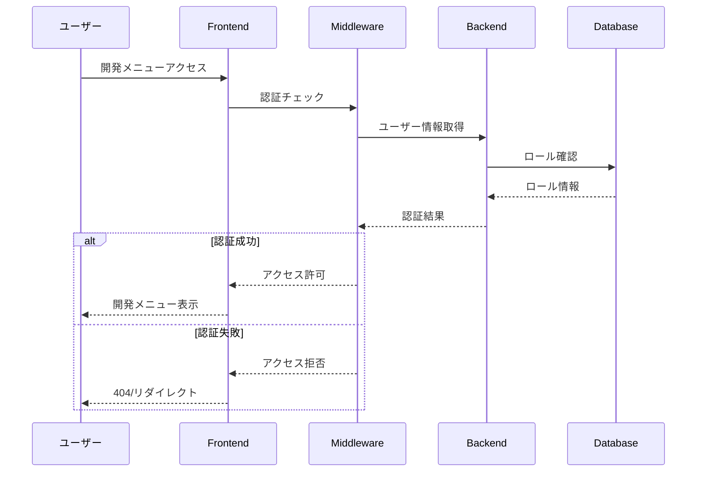

# 開発用メニュー認証機能 - 設計書

作成日: 2025-09-04  
対象: 開発用メニューアクセス制御

## 1. 概要

開発用メニューおよびテスト画面へのアクセスを管理者/開発者に限定する認証機能を実装します。

## 2. 要件

### 機能要件
- 開発用メニューは管理者または開発者ロールを持つユーザーのみアクセス可能
- 不正アクセス時は404エラーまたはリダイレクト
- 本番環境では開発用メニューを完全に非表示化
- ロールベースアクセス制御（RBAC）の実装

### 非機能要件
- セキュリティ: JWTトークンによる認証
- パフォーマンス: 認証チェックは100ms以内
- 保守性: ロール追加が容易な設計

## 3. アーキテクチャ

### 3.1 全体構成

```
[Frontend]
    ↓
[認証ミドルウェア]
    ↓
[Backend API]
    ↓
[Database]
```

### 3.2 認証フロー



## 4. バックエンド設計

### 4.1 データモデル

#### StoreUser テーブル（拡張）
```sql
ALTER TABLE StoreUsers
ADD UserRole VARCHAR(50) DEFAULT 'user',
ADD IsDeveloper BIT DEFAULT 0,
ADD CreatedAt DATETIME2 DEFAULT GETUTCDATE(),
ADD UpdatedAt DATETIME2 DEFAULT GETUTCDATE();

-- ロール定義
-- 'admin': 管理者（全機能アクセス可能）
-- 'developer': 開発者（開発メニューアクセス可能）
-- 'user': 一般ユーザー（開発メニューアクセス不可）
```

#### DevAccessLog テーブル（新規）
```sql
CREATE TABLE DevAccessLogs (
    Id INT PRIMARY KEY IDENTITY(1,1),
    StoreId INT NOT NULL,
    UserId VARCHAR(255) NOT NULL,
    AccessPath VARCHAR(500) NOT NULL,
    AccessTime DATETIME2 DEFAULT GETUTCDATE(),
    IPAddress VARCHAR(50),
    UserAgent VARCHAR(500),
    AccessGranted BIT NOT NULL,
    FOREIGN KEY (StoreId) REFERENCES Stores(Id)
);

CREATE INDEX IX_DevAccessLogs_StoreId_AccessTime 
ON DevAccessLogs(StoreId, AccessTime);
```

### 4.2 API エンドポイント

#### 1. ユーザーロール取得
```csharp
GET /api/auth/user-role
Response: {
    "userId": "user123",
    "role": "developer",
    "isDeveloper": true,
    "permissions": ["dev_menu", "api_test", "debug_mode"]
}
```

#### 2. 開発者権限チェック
```csharp
GET /api/auth/check-dev-access
Response: {
    "hasAccess": true,
    "reason": null
}
```

#### 3. ロール更新（管理者のみ）
```csharp
PUT /api/admin/user-role
Request: {
    "userId": "user123",
    "newRole": "developer"
}
Response: {
    "success": true,
    "message": "Role updated successfully"
}
```

### 4.3 認証ミドルウェア

```csharp
// DevAccessMiddleware.cs
public class DevAccessMiddleware
{
    private readonly RequestDelegate _next;
    private readonly ILogger<DevAccessMiddleware> _logger;

    public async Task InvokeAsync(HttpContext context)
    {
        var path = context.Request.Path.Value;
        
        // 開発用パスのパターン
        if (IsDevPath(path))
        {
            var user = await GetUserFromToken(context);
            
            if (!HasDevAccess(user))
            {
                _logger.LogWarning($"Unauthorized dev access attempt: {user?.Id}");
                
                // 監査ログ記録
                await LogAccessAttempt(context, user, false);
                
                // 404を返す（開発メニューの存在を隠蔽）
                context.Response.StatusCode = 404;
                return;
            }
            
            // アクセス許可ログ
            await LogAccessAttempt(context, user, true);
        }
        
        await _next(context);
    }
    
    private bool IsDevPath(string path)
    {
        var devPaths = new[] {
            "/api-test",
            "/dev/",
            "/debug/",
            "/dev-bookmarks",
            "/dormant-api-test",
            "/year-over-year-api-test"
        };
        
        return devPaths.Any(p => path.StartsWith(p, StringComparison.OrdinalIgnoreCase));
    }
    
    private bool HasDevAccess(User user)
    {
        if (user == null) return false;
        
        // 本番環境では環境変数でも制御
        if (Environment.GetEnvironmentVariable("ASPNETCORE_ENVIRONMENT") == "Production")
        {
            var allowedDevUsers = Environment.GetEnvironmentVariable("ALLOWED_DEV_USERS")?.Split(',');
            if (allowedDevUsers != null && !allowedDevUsers.Contains(user.Id))
            {
                return false;
            }
        }
        
        return user.Role == "admin" || user.Role == "developer" || user.IsDeveloper;
    }
}
```

## 5. フロントエンド設計

### 5.1 認証フック

```typescript
// hooks/useDevAccess.ts
export function useDevAccess() {
    const [hasAccess, setHasAccess] = useState(false);
    const [isLoading, setIsLoading] = useState(true);
    const [userRole, setUserRole] = useState<UserRole | null>(null);
    
    useEffect(() => {
        checkDevAccess();
    }, []);
    
    const checkDevAccess = async () => {
        try {
            const response = await fetch('/api/auth/check-dev-access', {
                headers: {
                    'Authorization': `Bearer ${getToken()}`
                }
            });
            
            if (response.ok) {
                const data = await response.json();
                setHasAccess(data.hasAccess);
                
                // ロール情報も取得
                const roleResponse = await fetch('/api/auth/user-role');
                const roleData = await roleResponse.json();
                setUserRole(roleData);
            }
        } catch (error) {
            console.error('Dev access check failed:', error);
            setHasAccess(false);
        } finally {
            setIsLoading(false);
        }
    };
    
    return { hasAccess, isLoading, userRole };
}
```

### 5.2 保護されたルート

```typescript
// components/DevProtectedRoute.tsx
export function DevProtectedRoute({ children }: { children: ReactNode }) {
    const { hasAccess, isLoading } = useDevAccess();
    const router = useRouter();
    
    useEffect(() => {
        if (!isLoading && !hasAccess) {
            // 404ページへリダイレクト
            router.replace('/404');
        }
    }, [hasAccess, isLoading]);
    
    if (isLoading) {
        return <LoadingSpinner />;
    }
    
    if (!hasAccess) {
        return null;
    }
    
    return <>{children}</>;
}
```

### 5.3 開発メニューの条件付き表示

```typescript
// app/dev-bookmarks/page.tsx の更新
export default function DevBookmarksPage() {
    const { hasAccess, userRole } = useDevAccess();
    
    // アクセス権限がない場合は404
    if (!hasAccess) {
        notFound();
    }
    
    return (
        <DevProtectedRoute>
            <div className="container mx-auto p-6">
                {/* 開発者バッジ表示 */}
                <div className="flex items-center gap-2 mb-4">
                    <Badge variant="destructive">開発モード</Badge>
                    <Badge variant="outline">{userRole?.role}</Badge>
                </div>
                
                {/* 既存の開発メニュー */}
                <h1>開発用ブックマーク</h1>
                {/* ... */}
            </div>
        </DevProtectedRoute>
    );
}
```

### 5.4 メインページでの条件付き表示

```typescript
// app/page.tsx の更新
export default function HomePage() {
    const { hasAccess: hasDevAccess } = useDevAccess();
    const { NEXT_PUBLIC_ENV } = process.env;
    
    // 開発カテゴリのアイテムをフィルター
    const filteredItems = bookmarkItems.filter(item => {
        if (item.category === 'dev') {
            // 本番環境または権限なしの場合は非表示
            return NEXT_PUBLIC_ENV !== 'production' && hasDevAccess;
        }
        return true;
    });
    
    return (
        <div>
            {/* 開発者向け警告バナー */}
            {hasDevAccess && NEXT_PUBLIC_ENV !== 'production' && (
                <Alert className="mb-4">
                    <AlertCircle className="h-4 w-4" />
                    <AlertDescription>
                        開発モードが有効です。本番環境では非表示になります。
                    </AlertDescription>
                </Alert>
            )}
            
            {/* フィルター済みメニュー表示 */}
            {filteredItems.map(item => (
                // ...
            ))}
        </div>
    );
}
```

## 6. セキュリティ考慮事項

### 6.1 防御策
1. **存在の秘匿**: 権限なしのアクセスには404を返す（403ではない）
2. **Rate Limiting**: 開発API へのアクセスを制限
3. **監査ログ**: 全アクセス試行を記録
4. **環境別制御**: 本番環境では追加の制限
5. **IP制限**: 必要に応じて特定IPからのみアクセス許可

### 6.2 環境変数設定

```env
# .env.production
ALLOWED_DEV_USERS=user1,user2
DEV_ACCESS_ENABLED=false
DEV_ACCESS_IP_WHITELIST=192.168.1.1,10.0.0.1

# .env.development
DEV_ACCESS_ENABLED=true
```

## 7. 実装手順

### Phase 1: バックエンド（1日）
1. データベーススキーマ更新
2. 認証ミドルウェア実装
3. APIエンドポイント作成
4. テスト作成

### Phase 2: フロントエンド（1日）
1. useDevAccessフック実装
2. DevProtectedRouteコンポーネント作成
3. 既存ページの更新
4. UIテスト

### Phase 3: 統合テスト（0.5日）
1. E2Eテスト
2. セキュリティテスト
3. パフォーマンステスト

## 8. テスト計画

### 8.1 単体テスト
- 認証ミドルウェアのロジック
- ロールチェック関数
- フロントエンドフック

### 8.2 統合テスト
- 認証フロー全体
- 権限別アクセステスト
- 環境別動作確認

### 8.3 セキュリティテスト
- 権限昇格試行
- SQLインジェクション
- トークン偽造

## 9. 監視とアラート

### 9.1 メトリクス
- 開発メニューアクセス数
- 認証失敗率
- レスポンスタイム

### 9.2 アラート条件
- 短時間での複数認証失敗
- 異常なアクセスパターン
- パフォーマンス劣化