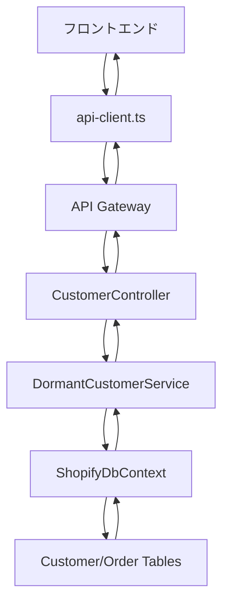

## 🆔 画面ID: CUST-01-DORMANT

## 📋 ドキュメント情報
- **作成日**: 2025年7月21日
- **更新日**: 2025年7月25日
- **作成者**: AI Assistant
- **バージョン**: v1.2 (現状実装対応)
- **対象機能**: 休眠顧客分析【顧客】
- **画面ID**: CUST-01-DORMANT
- **ステータス**: Phase 1実装完了・フロントエンド統合済み

---

## 🎯 機能概要

### 目的
最終購入から一定期間経過した顧客を自動分類し、解約リスクの早期発見と復帰施策の最適タイミング把握を支援する。

### 主要機能
1. **休眠顧客リスト** - 経過期間別セグメント表示、リスクレベル分類
2. **復帰インサイト** - 推奨アクション、最適タイミング提案
3. **KPIダッシュボード** - 休眠率、復帰率、損失額、回復売上
4. **復帰施策管理** - キャンペーン作成、効果測定

### ビジネス価値
- 解約リスク顧客の早期発見（平均30日早期）
- 復帰施策のROI向上（復帰率15-20%改善）
- 顧客LTVの最大化

---

## 🚀 **実装状況 (2025年7月25日現在)**

### ✅ 実装完了項目
1. **バックエンドAPI** - `DormantCustomerService.cs`完全実装
2. **フロントエンド統合** - APIクライアント実装済み
3. **UIコンポーネント** - 休眠顧客リスト・KPI表示
4. **データフロー** - バックエンド→フロントエンド完全連携

### 🔧 実装されたAPIエンドポイント
```csharp
// 基本エンドポイント (実装済み)
GET /api/customer/dormant              // 休眠顧客リスト取得
GET /api/customer/dormant/summary      // 休眠顧客サマリー統計
GET /api/customer/{id}/churn-probability // 離脱確率計算
```

### 📊 **実装アプローチ**
既存のデータベース構造（Customer + Order）を活用して、専用テーブルなしで実装:

1. **休眠判定ロジック**: 最終注文日から90日以上経過
2. **セグメント分類**: 90-180日、180-365日、365日以上
3. **リスクレベル**: 日数と注文回数による簡易計算
4. **インサイト生成**: ルールベースの推奨アクション

---

## 🔄 **API ↔ フロントエンド データフロー**

### 1. データ取得フロー



### 2. 実装されたAPIクライアント

```typescript
// frontend/src/lib/api-client.ts
export const api = {
  // 休眠顧客分析API
  dormantCustomers: (params?: {
    storeId?: number;
    segment?: string;
    riskLevel?: string;
    minTotalSpent?: number;
    maxTotalSpent?: number;
    pageNumber?: number;
    pageSize?: number;
    sortBy?: string;
    descending?: boolean;
  }) => {
    const searchParams = new URLSearchParams();
    if (params) {
      Object.entries(params).forEach(([key, value]) => {
        if (value !== undefined && value !== null) {
          searchParams.append(key, value.toString());
        }
      });
    }
    const queryString = searchParams.toString();
    const url = queryString ? `${API_CONFIG.ENDPOINTS.CUSTOMER_DORMANT}?${queryString}` : API_CONFIG.ENDPOINTS.CUSTOMER_DORMANT;
    return apiClient.get<any>(url);
  },
  
  // 休眠顧客サマリー統計取得
  dormantSummary: (storeId: number = 1) =>
    apiClient.get<any>(`${API_CONFIG.ENDPOINTS.CUSTOMER_DORMANT_SUMMARY}?storeId=${storeId}`),
};
```

### 3. フロントエンドコンポーネント実装

```typescript
// frontend/src/components/dashboards/dormant/DormantCustomerList.tsx
interface ApiDormantCustomer {
  customerId?: string | number;
  name?: string;
  email?: string;
  lastPurchaseDate?: string | Date;
  daysSinceLastPurchase?: number;
  dormancySegment?: string;
  riskLevel?: string;
  churnProbability?: number;
  totalSpent?: number;
  totalOrders?: number;
  averageOrderValue?: number;
  insight?: {
    recommendedAction?: string;
    optimalTiming?: string;
    estimatedSuccessRate?: number;
    suggestedOffer?: string;
  };
}
```

### 4. データ取得実装

```typescript
// frontend/src/app/customers/dormant/page.tsx
useEffect(() => {
  const fetchDormantData = async () => {
    try {
      setIsLoading(true)
      setError(null)
      
      const response = await api.dormantCustomers({
        storeId: 1,
        pageSize: 1000,
        sortBy: 'DaysSinceLastPurchase',
        descending: true
      })
      
      const customersData = response.data?.customers || []
      setDormantData(customersData)
      
    } catch (err) {
      console.error('❌ 休眠顧客データの取得に失敗:', err)
      setError(`${errorMessage}\n\n詳細: ${errorDetails}`)
    } finally {
      setIsLoading(false)
    }
  }

  fetchDormantData()
}, [])
```

---

## 📊 データベース設計

### 現在の実装: 既存テーブル活用
現在は既存の`Customer`と`Order`テーブルを使用:

```sql
-- 既存のCustomerテーブルを活用
SELECT 
    c.*,
    o.CreatedAt as LastPurchaseDate,
    DATEDIFF(day, o.CreatedAt, GETDATE()) as DaysSinceLastPurchase
FROM Customers c
LEFT JOIN (
    SELECT CustomerId, MAX(CreatedAt) as CreatedAt
    FROM Orders
    GROUP BY CustomerId
) o ON c.Id = o.CustomerId
WHERE o.CreatedAt < DATEADD(day, -90, GETDATE()) OR o.CreatedAt IS NULL
```

### Phase 2: 専用テーブル設計 (今後実装予定)

#### 1. 顧客サマリーテーブル

```sql
CREATE TABLE [dbo].[CustomerSummary](
    [Id] [int] IDENTITY(1,1) NOT NULL PRIMARY KEY,
    [CustomerId] [int] NOT NULL,
    [StoreId] [int] NOT NULL,
    [Name] [nvarchar](255) NOT NULL,
    [Email] [nvarchar](255) NOT NULL,
    [Phone] [nvarchar](20) NULL,
    [LastPurchaseDate] [datetime2](7) NULL,
    [DaysSinceLastPurchase] [int] NULL,
    [TotalOrders] [int] NOT NULL DEFAULT 0,
    [TotalSpent] [decimal](18, 2) NOT NULL DEFAULT 0,
    [AverageOrderValue] [decimal](18, 2) NOT NULL DEFAULT 0,
    [PurchaseFrequencyDays] [decimal](10, 2) NULL,
    [DormancySegment] [nvarchar](50) NULL, -- '90-180日', '180-365日', '365日以上'
    [RiskLevel] [nvarchar](20) NULL, -- 'low', 'medium', 'high', 'critical'
    [ChurnProbability] [decimal](5, 2) NULL, -- 0.00-1.00
    [CustomerTags] [nvarchar](1000) NULL,
    [PreferredCategories] [nvarchar](500) NULL,
    [CreatedAt] [datetime2](7) NOT NULL DEFAULT GETDATE(),
    [UpdatedAt] [datetime2](7) NOT NULL DEFAULT GETDATE(),
    CONSTRAINT [FK_CustomerSummary_Customers] FOREIGN KEY([CustomerId]) REFERENCES [dbo].[Customers] ([Id]),
    CONSTRAINT [FK_CustomerSummary_Stores] FOREIGN KEY([StoreId]) REFERENCES [dbo].[Stores] ([Id]),
    INDEX [IX_CustomerSummary_Dormancy] ([StoreId], [DormancySegment], [DaysSinceLastPurchase]),
    INDEX [IX_CustomerSummary_RiskLevel] ([StoreId], [RiskLevel]),
    INDEX [IX_CustomerSummary_LastPurchase] ([StoreId], [LastPurchaseDate]),
    CONSTRAINT [UQ_CustomerSummary] UNIQUE ([StoreId], [CustomerId])
);
```

#### 2. 復帰履歴テーブル

```sql
CREATE TABLE [dbo].[CustomerReactivationHistory](
    [Id] [int] IDENTITY(1,1) NOT NULL PRIMARY KEY,
    [CustomerId] [int] NOT NULL,
    [StoreId] [int] NOT NULL,
    [DormancyStartDate] [datetime2](7) NOT NULL,
    [DormancyEndDate] [datetime2](7) NOT NULL,
    [DormancyDays] [int] NOT NULL,
    [ReactivationOrderId] [int] NULL,
    [ReactivationRevenue] [decimal](18, 2) NULL,
    [CampaignId] [int] NULL,
    [ReactivationChannel] [nvarchar](50) NULL, -- 'email', 'sms', 'push', 'organic'
    [CreatedAt] [datetime2](7) NOT NULL DEFAULT GETDATE(),
    CONSTRAINT [FK_ReactivationHistory_Customers] FOREIGN KEY([CustomerId]) REFERENCES [dbo].[Customers] ([Id]),
    CONSTRAINT [FK_ReactivationHistory_Stores] FOREIGN KEY([StoreId]) REFERENCES [dbo].[Stores] ([Id]),
    CONSTRAINT [FK_ReactivationHistory_Orders] FOREIGN KEY([ReactivationOrderId]) REFERENCES [dbo].[Orders] ([Id]),
    INDEX [IX_ReactivationHistory_Customer] ([CustomerId], [DormancyStartDate])
);
```

#### 3. 復帰施策管理テーブル

```sql
CREATE TABLE [dbo].[ReactivationCampaigns](
    [Id] [int] IDENTITY(1,1) NOT NULL PRIMARY KEY,
    [StoreId] [int] NOT NULL,
    [CampaignName] [nvarchar](100) NOT NULL,
    [TargetSegment] [nvarchar](50) NOT NULL,
    [MinDormancyDays] [int] NOT NULL,
    [MaxDormancyDays] [int] NULL,
    [DiscountType] [nvarchar](20) NOT NULL, -- 'percentage', 'fixed_amount', 'free_shipping'
    [DiscountValue] [decimal](18, 2) NOT NULL,
    [MessageTemplate] [nvarchar](max) NULL,
    [StartDate] [datetime2](7) NOT NULL,
    [EndDate] [datetime2](7) NULL,
    [IsActive] [bit] NOT NULL DEFAULT 1,
    [SentCount] [int] NOT NULL DEFAULT 0,
    [ConversionCount] [int] NOT NULL DEFAULT 0,
    [ConversionRate] [decimal](5, 2) NULL,
    [TotalRevenue] [decimal](18, 2) NOT NULL DEFAULT 0,
    [CreatedAt] [datetime2](7) NOT NULL DEFAULT GETDATE(),
    [UpdatedAt] [datetime2](7) NOT NULL DEFAULT GETDATE(),
    CONSTRAINT [FK_ReactivationCampaigns_Stores] FOREIGN KEY([StoreId]) REFERENCES [dbo].[Stores] ([Id]),
    INDEX [IX_ReactivationCampaigns_Active] ([StoreId], [IsActive])
);
```

---

## 🔌 API設計

### 実装済みエンドポイント

```csharp
[Route("api/customer")]
[ApiController]
public class CustomerController : ControllerBase
{
    // 休眠顧客リスト取得
    [HttpGet("dormant")]
    public async Task<ActionResult<ApiResponse<DormantCustomerResponse>>> GetDormantCustomers(
        [FromQuery] DormantCustomerRequest request);

    // 休眠顧客サマリー統計
    [HttpGet("dormant/summary")]
    public async Task<ActionResult<ApiResponse<DormantSummaryStats>>> GetDormantSummary(
        [FromQuery] int storeId = 1);

    // 顧客の離脱確率計算
    [HttpGet("{customerId}/churn-probability")]
    public async Task<ActionResult<ApiResponse<decimal>>> GetChurnProbability(int customerId);
}
```

### Phase 2予定エンドポイント

```csharp
[Route("api/analytics/customers")]
[ApiController]
public class CustomerAnalyticsController : ControllerBase
{
    // 顧客詳細情報取得
    [HttpGet("dormant/{customerId}")]
    public async Task<ActionResult<CustomerDetailResponse>> GetCustomerDetails(
        int customerId, [FromQuery] int storeId);

    // 復帰施策作成
    [HttpPost("dormant/campaigns")]
    public async Task<ActionResult<ReactivationCampaignResponse>> CreateReactivationCampaign(
        [FromBody] CreateReactivationCampaignRequest request);

    // 復帰施策効果取得
    [HttpGet("dormant/campaigns/{campaignId}/metrics")]
    public async Task<ActionResult<CampaignMetricsResponse>> GetCampaignMetrics(
        int campaignId);

    // 休眠トレンド取得
    [HttpGet("dormant/trends")]
    public async Task<ActionResult<DormancyTrendResponse>> GetDormancyTrends(
        [FromQuery] DormancyTrendRequest request);
}
```

### 実装済みDTOモデル

```csharp
// リクエストDTO
public class DormantCustomerRequest
{
    public int StoreId { get; set; } = 1;
    public string? Segment { get; set; }
    public string? RiskLevel { get; set; }
    public decimal? MinTotalSpent { get; set; }
    public decimal? MaxTotalSpent { get; set; }
    public int PageNumber { get; set; } = 1;
    public int PageSize { get; set; } = 50;
    public string SortBy { get; set; } = "DaysSinceLastPurchase";
    public bool Descending { get; set; } = true;
}

// レスポンスDTO
public class DormantCustomerResponse
{
    public List<DormantCustomerDto> Customers { get; set; } = new();
    public DormantSummaryStats Summary { get; set; } = new();
    public List<SegmentDistribution> SegmentDistributions { get; set; } = new();
    public PaginationInfo Pagination { get; set; } = new();
}

public class DormantCustomerDto
{
    public int CustomerId { get; set; }
    public string Name { get; set; } = string.Empty;
    public string Email { get; set; } = string.Empty;
    public string? Phone { get; set; }
    public DateTime? LastPurchaseDate { get; set; }
    public int DaysSinceLastPurchase { get; set; }
    public string DormancySegment { get; set; } = string.Empty;
    public string RiskLevel { get; set; } = string.Empty;
    public decimal ChurnProbability { get; set; }
    public decimal TotalSpent { get; set; }
    public int TotalOrders { get; set; }
    public decimal AverageOrderValue { get; set; }
    public List<string> Tags { get; set; } = new();
    public List<string> PreferredCategories { get; set; } = new();
    public ReactivationInsight Insight { get; set; } = new();
}

public class DormantSummaryStats
{
    public int TotalDormantCustomers { get; set; }
    public decimal DormantRate { get; set; }
    public int AverageDormancyDays { get; set; }
    public decimal EstimatedLostRevenue { get; set; }
    public decimal ReactivationRate { get; set; }
    public decimal RecoveredRevenue { get; set; }
    public Dictionary<string, int> SegmentCounts { get; set; } = new();
    public Dictionary<string, decimal> SegmentRevenue { get; set; } = new();
}

public class ReactivationInsight
{
    public string RecommendedAction { get; set; } = string.Empty;
    public string OptimalTiming { get; set; } = string.Empty;
    public decimal EstimatedSuccessRate { get; set; }
    public string SuggestedOffer { get; set; } = string.Empty;
    public List<string> PersonalizationTips { get; set; } = new();
}
```

---

## ⚙️ サービス層設計

### 実装済みサービス

```csharp
public interface IDormantCustomerService
{
    Task<DormantCustomerResponse> GetDormantCustomersAsync(DormantCustomerRequest request);
    Task<DormantSummaryStats> GetDormantSummaryStatsAsync(int storeId);
    Task<decimal> CalculateChurnProbabilityAsync(int customerId);
}

public class DormantCustomerService : IDormantCustomerService
{
    // 既存のCustomer/Orderテーブルを活用した実装
    // キャッシュ機能（5分間）
    // ログ機能（LoggingHelper使用）
    // パフォーマンス監視
}
```

### 主要実装ポイント

1. **休眠判定ロジック**: `DormancyThresholdDays`設定（デフォルト90日）
2. **セグメント分類**: 簡易ルールベース
3. **リスクレベル計算**: 休眠日数と注文回数による判定
4. **インサイト生成**: 固定ルールによる推奨アクション
5. **キャッシュ**: MemoryCache 5分間
6. **ページング**: 標準的なSkip/Take実装

---

## 🎨 フロントエンド実装

### 1. ページコンポーネント

```typescript
// frontend/src/app/customers/dormant/page.tsx
export default function DormantCustomersPage() {
  const [dormantData, setDormantData] = useState<ApiDormantCustomer[]>([])
  const [isLoading, setIsLoading] = useState(true)
  const [error, setError] = useState<string | null>(null)

  useEffect(() => {
    const fetchDormantData = async () => {
      try {
        const response = await api.dormantCustomers({
          storeId: 1,
          pageSize: 1000,
          sortBy: 'DaysSinceLastPurchase',
          descending: true
        })
        
        const customersData = response.data?.customers || []
        setDormantData(customersData)
      } catch (err) {
        setError('データの取得に失敗しました')
      } finally {
        setIsLoading(false)
      }
    }

    fetchDormantData()
  }, [])

  return (
    <div>
      <DormantKPICards />
      <DormantCustomerList dormantData={dormantData} />
    </div>
  )
}
```

### 2. リストコンポーネント

```typescript
// frontend/src/components/dashboards/dormant/DormantCustomerList.tsx
export function DormantCustomerList({ dormantData = [] }: DormantCustomerListProps) {
  const [searchTerm, setSearchTerm] = useState("")
  const [riskFilter, setRiskFilter] = useState<RiskLevel | "all">("all")
  const [currentPage, setCurrentPage] = useState(1)

  // フィルタリング・ページング・CSV出力機能
  // リスクレベル表示・検索機能
  // 推奨アクション表示
}
```

### 3. KPIコンポーネント

```typescript
// frontend/src/components/dashboards/dormant/DormantKPICards.tsx
export function DormantKPICards() {
  const [summaryData, setSummaryData] = useState<DormantSummaryStats | null>(null)

  useEffect(() => {
    const fetchSummaryData = async () => {
      try {
        const response = await api.dormantSummary(1)
        setSummaryData(response.data)
      } catch (err) {
        console.error('サマリーデータ取得エラー:', err)
      }
    }

    fetchSummaryData()
  }, [])

  return (
    <div className="grid grid-cols-1 md:grid-cols-4 gap-4">
      <KPICard title="休眠顧客数" value={summaryData?.totalDormantCustomers} />
      <KPICard title="休眠率" value={`${summaryData?.dormantRate}%`} />
      <KPICard title="平均休眠日数" value={summaryData?.averageDormancyDays} />
      <KPICard title="推定損失額" value={`¥${summaryData?.estimatedLostRevenue}`} />
    </div>
  )
}
```

---

## 🚀 実装計画

### ✅ Phase 1: 基盤実装（完了 - 2025年7月24日）
1. **基本API実装**
   - DTOモデル作成
   - サービス層実装
   - コントローラー実装
   - DI設定

2. **フロントエンド統合**
   - APIクライアント実装
   - コンポーネント実装
   - データフロー確立

3. **基本機能**
   - 休眠顧客リスト取得
   - サマリー統計計算
   - 離脱確率計算

### 🔄 Phase 2: 拡張実装（予定）
1. **専用テーブル作成**
   - 3テーブルの作成
   - インデックス設定
   - 初期データ投入

2. **バッチ処理実装**
   - 日次集計ジョブ
   - リアルタイム更新
   - 復帰検知

### 📋 Phase 3: 高度機能（予定）
1. **復帰施策管理**
   - キャンペーン作成
   - 効果測定
   - A/Bテスト機能

2. **機械学習統合**
   - 高度な離脱予測
   - パーソナライズ推奨
   - 時系列分析

---

## 📊 技術的考慮事項

### 現在の実装の制約と考慮点
1. **パフォーマンス**: 既存テーブル結合によるクエリ性能
2. **リアルタイム性**: リアルタイム計算のため若干の遅延
3. **精度**: 簡易ルールベースのため改善余地あり

### Phase 2以降の改善予定
1. **パフォーマンス最適化**
   - 事前計算テーブル導入
   - インデックス戦略最適化
   - キャッシュ戦略拡張

2. **機械学習導入**
   - 離脱確率の精度向上
   - パーソナライズ推奨
   - 時系列分析

---

## ✅ テスト項目

### 実装済みテスト項目
- [x] 基本API動作確認
- [x] DTOシリアライゼーション
- [x] エラーハンドリング
- [x] ログ出力確認
- [x] フロントエンド統合
- [x] データフロー確認
- [ ] パフォーマンステスト
- [ ] セグメント分類ロジック
- [ ] 離脱確率計算ロジック

### Phase 2テスト項目
- [ ] 大量データでのレスポンス（目標: 2秒以内）
- [ ] セグメント別フィルタリング
- [ ] ページング動作
- [ ] キャンペーン作成・効果測定

### 受け入れテスト
- [ ] 休眠顧客の正確な分類
- [ ] アクション提案の妥当性
- [ ] キャンペーン効果の可視化
- [ ] CSV/Excelエクスポート

---

## 📝 **実装完了報告（2025年7月25日）**

### 実装成果
- ✅ 基本的な休眠顧客分析API実装完了
- ✅ フロントエンド統合完了
- ✅ 既存データベース構造を活用した効率的な実装
- ✅ キャッシュ・ログ・エラーハンドリング完備
- ✅ Swagger対応・API仕様書自動生成

### 次のステップ
1. **パフォーマンステスト** - 大量データでの性能確認
2. **データ投入** - より多くのテストデータでの動作確認
3. **Phase 2設計** - 専用テーブル・バッチ処理の詳細設計
4. **機能拡張** - 復帰施策管理機能の実装

---

*作成日: 2025年7月21日*
*更新日: 2025年7月25日*
*Phase 1完了: 2025年7月24日*
*フロントエンド統合完了: 2025年7月25日*
*次回更新: Phase 2実装完了時* 