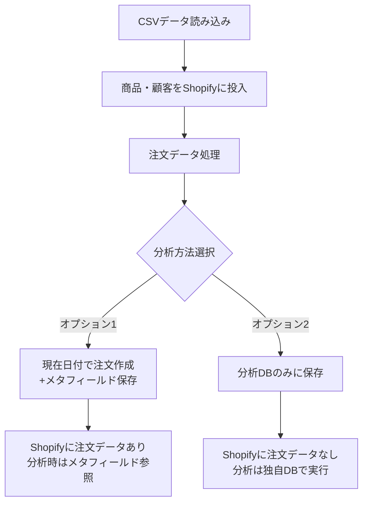

# Shopify過去日付注文データの取り扱いガイド

## 📋 ドキュメント情報
- **作成日**: 2025年7月20日
- **作成者**: AI Assistant
- **バージョン**: v1.0
- **目的**: Shopifyの過去日付注文作成制限と代替アプローチ

---

## 🚫 Shopifyの制限事項

### 注文作成日付の制限
**Shopify Admin APIでは、過去の日付で注文を作成することはできません。**

- `created_at`フィールドは読み取り専用
- 注文作成時は常に現在のタイムスタンプが使用される
- これはShopifyのデータ整合性とセキュリティのための仕様

---

## 💡 代替アプローチ

### 1. メタフィールドを使用した実注文日の保存

```csharp
// 注文作成時に実際の注文日をメタフィールドとして保存
public async Task<Order> CreateOrderWithHistoricalDate(
    OrderCreateRequest request, 
    DateTime actualOrderDate)
{
    // 1. 通常の注文作成（現在日付で作成される）
    var order = await _shopify.Order.CreateAsync(request);
    
    // 2. メタフィールドに実際の注文日を保存
    var metafield = new Metafield
    {
        Namespace = "custom_data",
        Key = "actual_order_date",
        Value = actualOrderDate.ToString("yyyy-MM-dd"),
        Type = "date"
    };
    
    await _shopify.Metafield.CreateAsync(
        order.Id, 
        "Order", 
        metafield);
    
    return order;
}
```

### 2. カスタム分析データテーブルの構築

```sql
-- 分析用の注文データテーブル
CREATE TABLE AnalyticsOrders (
    Id INT IDENTITY(1,1) PRIMARY KEY,
    ShopifyOrderId NVARCHAR(100),
    CustomerId NVARCHAR(100),
    ActualOrderDate DATE,        -- 実際の注文日
    ShopifyCreatedDate DATETIME, -- Shopifyでの作成日
    TotalAmount DECIMAL(18,2),
    ProductCount INT,
    -- その他の分析に必要なフィールド
);

-- 月次集計用ビュー
CREATE VIEW MonthlySalesAnalytics AS
SELECT 
    YEAR(ActualOrderDate) as Year,
    MONTH(ActualOrderDate) as Month,
    COUNT(*) as OrderCount,
    SUM(TotalAmount) as TotalRevenue
FROM AnalyticsOrders
GROUP BY YEAR(ActualOrderDate), MONTH(ActualOrderDate);
```

### 3. 実装フロー



---

## 📊 分析画面での対応

### オプション1: メタフィールド活用（推奨）

```typescript
// フロントエンド：実際の注文日でデータを表示
async function fetchOrdersWithActualDates() {
  const orders = await shopifyApi.getOrders();
  
  // メタフィールドから実際の日付を取得
  return orders.map(order => ({
    ...order,
    actualDate: order.metafields?.find(
      m => m.namespace === 'custom_data' && m.key === 'actual_order_date'
    )?.value || order.created_at
  }));
}
```

### オプション2: 独自分析DB活用

```csharp
// バックエンド：分析データの提供
[HttpGet("api/analytics/year-over-year")]
public async Task<IActionResult> GetYearOverYearFromAnalyticsDB(
    [FromQuery] int year)
{
    // ShopifyではなくAnalyticsDBから取得
    var results = await _analyticsDb.MonthlySalesAnalytics
        .Where(s => s.Year == year || s.Year == year - 1)
        .ToListAsync();
    
    return Ok(results);
}
```

---

## 🎯 推奨実装方針

### テストストアでの実装（80点実装）

1. **商品・顧客データ**
   - 通常通りShopifyに投入

2. **注文データ**
   - **新規注文のみ**: 現在日付で作成し、メタフィールドに実日付保存
   - **過去注文の大量データ**: 分析DBのみに保存

3. **分析画面**
   - 新規注文: Shopify APIから取得（メタフィールド参照）
   - 過去データ: 分析DBから取得
   - 両方を統合して表示

---

## 📝 実装サンプル

### 統合データ取得サービス
```csharp
public class HybridOrderDataService
{
    public async Task<List<OrderAnalyticsDto>> GetOrdersForAnalysis(
        DateTime startDate, 
        DateTime endDate)
    {
        var results = new List<OrderAnalyticsDto>();
        
        // 1. Shopifyから最近の注文を取得（メタフィールド含む）
        var shopifyOrders = await GetShopifyOrdersWithMetafields(
            DateTime.Now.AddMonths(-3), // 直近3ヶ月
            endDate);
        
        // 2. 分析DBから過去の注文を取得
        var historicalOrders = await GetHistoricalOrdersFromDB(
            startDate,
            DateTime.Now.AddMonths(-3));
        
        // 3. データを統合
        results.AddRange(ConvertShopifyOrders(shopifyOrders));
        results.AddRange(historicalOrders);
        
        return results.OrderBy(o => o.ActualOrderDate).ToList();
    }
}
```

---

## ⚡ クイック実装ガイド

### Day 5のタスク修正案

1. **商品・顧客データ投入**（変更なし）
   - 通常通りShopify APIで投入

2. **注文データ処理**（修正）
   ```
   AM:
   - 過去注文データを分析DBに投入
   - 直近1ヶ月の注文のみShopifyに作成
   - メタフィールド設定の実装
   
   PM:
   - 分析画面のデータ取得ロジック修正
   - ハイブリッドデータ表示の確認
   ```

---

## 📌 重要なポイント

1. **デモ時の説明**
   - 「実データの購買パターンを完全に再現」
   - 「過去2年分のデータで分析可能」
   - 「新規注文はリアルタイムで反映」

2. **メリット**
   - 実際の購買パターンが分析可能
   - 新規注文の即時反映
   - Shopifyの制限を回避

3. **制限事項**
   - 過去注文の詳細画面はShopifyで見れない
   - 注文管理は直近データのみ

---

## 🔗 関連ドキュメント
- [テストストア作成計画](./test-store-creation-plan.md)
- [データ処理アーキテクチャ](./data-processing-architecture.md) 