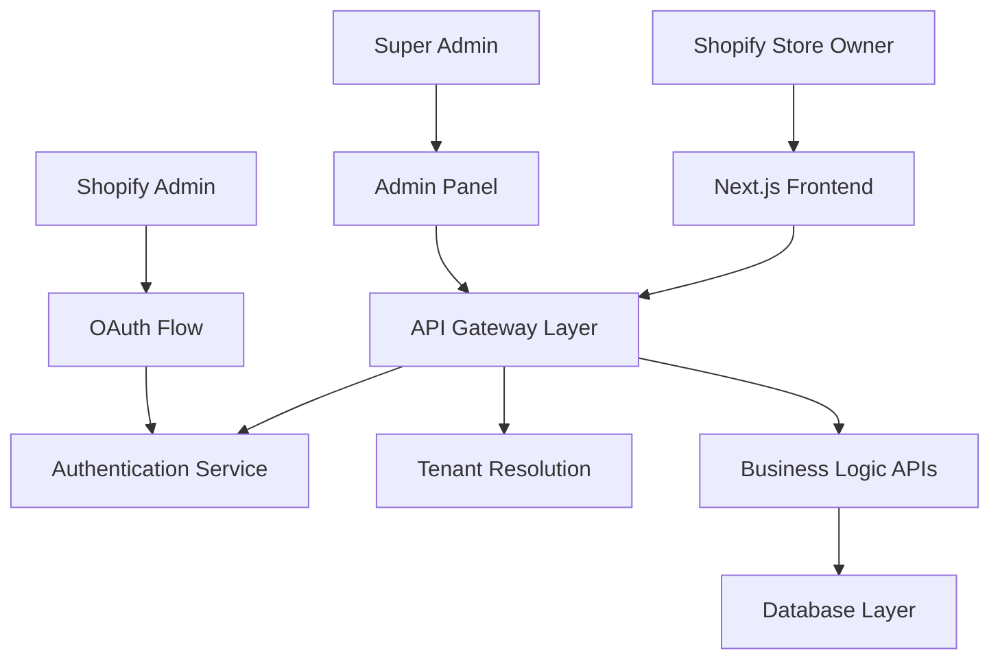
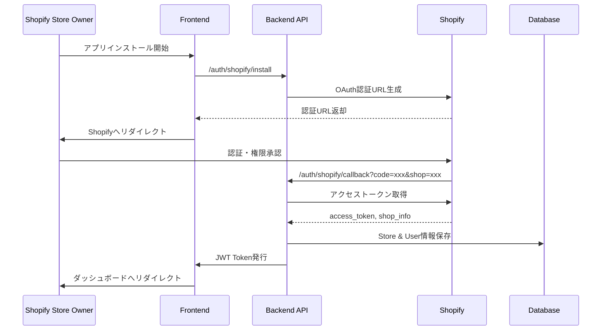
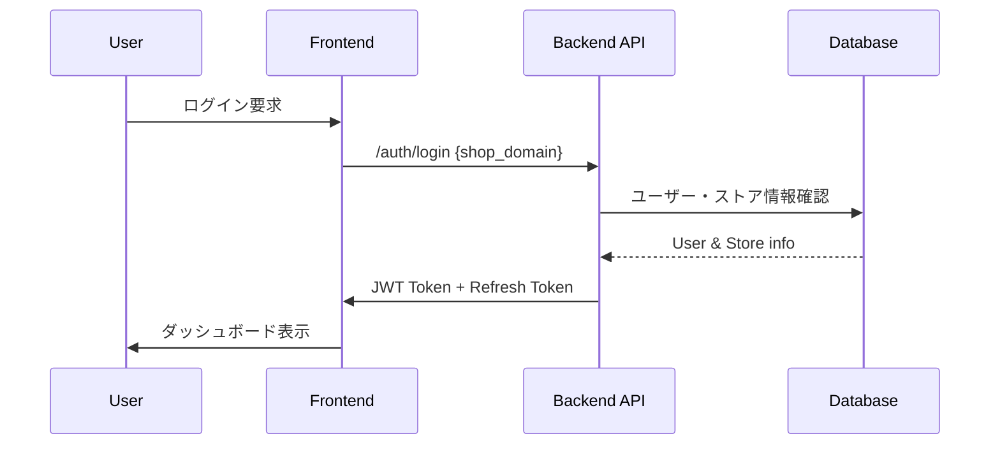

# Shopify OAuth認証・マルチテナント化 詳細設計書

## 1. 概要

### 1.1 目的
Shopify AI Marketing Suiteを複数のShopifyストアで利用できるマルチテナントSaaSとして構築し、Shopify公開アプリとしての申請を可能にする認証システムを実装する。

### 1.2 現状分析
- ✅ データベースレベルでのマルチテナント対応済み（Store entity, StoreId外部キー）
- ❌ ユーザー認証機能未実装
- ❌ Shopify OAuth認証未実装
- ❌ テナント分離ロジック未実装
- ❌ 管理者画面未実装

### 1.3 技術要件
- **認証**: Shopify OAuth 2.0 + 内部ユーザー管理
- **フレームワーク**: Next.js App Router + .NET 8 Web API
- **データベース**: Azure SQL Database (既存のマルチテナント構造を拡張)
- **セッション管理**: JWT + Refresh Token

## 2. アーキテクチャ設計

### 2.1 システム全体構成



### 2.2 認証フロー設計

#### 2.2.1 Shopify OAuth認証フロー



#### 2.2.2 既存ユーザーログインフロー



## 3. データベース設計

### 3.1 新規テーブル設計

#### 3.1.1 Users テーブル
```sql
CREATE TABLE Users (
    Id int IDENTITY(1,1) PRIMARY KEY,
    Email nvarchar(255) NOT NULL UNIQUE,
    Name nvarchar(255) NOT NULL,
    Role nvarchar(50) NOT NULL DEFAULT 'StoreOwner', -- StoreOwner, StoreStaff, SuperAdmin
    IsActive bit NOT NULL DEFAULT 1,
    CreatedAt datetime2 NOT NULL DEFAULT GETUTCDATE(),
    UpdatedAt datetime2 NOT NULL DEFAULT GETUTCDATE(),
    LastLoginAt datetime2 NULL,
    
    INDEX IX_Users_Email (Email),
    INDEX IX_Users_Role (Role)
);
```

#### 3.1.2 UserStores テーブル (多対多リレーション)
```sql
CREATE TABLE UserStores (
    Id int IDENTITY(1,1) PRIMARY KEY,
    UserId int NOT NULL,
    StoreId int NOT NULL,
    Role nvarchar(50) NOT NULL DEFAULT 'Owner', -- Owner, Staff, ReadOnly
    IsActive bit NOT NULL DEFAULT 1,
    CreatedAt datetime2 NOT NULL DEFAULT GETUTCDATE(),
    
    FOREIGN KEY (UserId) REFERENCES Users(Id) ON DELETE CASCADE,
    FOREIGN KEY (StoreId) REFERENCES Stores(Id) ON DELETE CASCADE,
    
    UNIQUE INDEX IX_UserStores_User_Store (UserId, StoreId),
    INDEX IX_UserStores_Store (StoreId),
    INDEX IX_UserStores_User (UserId)
);
```

#### 3.1.3 ShopifyTokens テーブル
```sql
CREATE TABLE ShopifyTokens (
    Id int IDENTITY(1,1) PRIMARY KEY,
    StoreId int NOT NULL,
    AccessToken nvarchar(255) NOT NULL,
    Scope nvarchar(500) NOT NULL,
    ExpiresAt datetime2 NULL,
    CreatedAt datetime2 NOT NULL DEFAULT GETUTCDATE(),
    UpdatedAt datetime2 NOT NULL DEFAULT GETUTCDATE(),
    
    FOREIGN KEY (StoreId) REFERENCES Stores(Id) ON DELETE CASCADE,
    
    UNIQUE INDEX IX_ShopifyTokens_Store (StoreId)
);
```

#### 3.1.4 既存Storesテーブル拡張
```sql
ALTER TABLE Stores ADD 
    ShopifyDomain nvarchar(255) NULL,
    ShopifyShopId nvarchar(100) NULL,
    ShopifyPlan nvarchar(100) NULL,
    IsActive bit NOT NULL DEFAULT 1,
    InstalledAt datetime2 NULL,
    UninstalledAt datetime2 NULL,
    LastSyncAt datetime2 NULL;

CREATE INDEX IX_Stores_ShopifyDomain ON Stores(ShopifyDomain);
CREATE INDEX IX_Stores_ShopifyShopId ON Stores(ShopifyShopId);
```

### 3.2 データベース移行戦略

#### 3.2.1 Entity Framework Migration
```csharp
// Migration: 20250724_AddMultiTenantAuth
public partial class AddMultiTenantAuth : Migration
{
    protected override void Up(MigrationBuilder migrationBuilder)
    {
        // Users table creation
        migrationBuilder.CreateTable(
            name: "Users",
            columns: table => new
            {
                Id = table.Column<int>(type: "int", nullable: false)
                    .Annotation("SqlServer:Identity", "1, 1"),
                Email = table.Column<string>(type: "nvarchar(255)", maxLength: 255, nullable: false),
                Name = table.Column<string>(type: "nvarchar(255)", maxLength: 255, nullable: false),
                Role = table.Column<string>(type: "nvarchar(50)", maxLength: 50, nullable: false, defaultValue: "StoreOwner"),
                IsActive = table.Column<bool>(type: "bit", nullable: false, defaultValue: true),
                CreatedAt = table.Column<DateTime>(type: "datetime2", nullable: false, defaultValueSql: "GETUTCDATE()"),
                UpdatedAt = table.Column<DateTime>(type: "datetime2", nullable: false, defaultValueSql: "GETUTCDATE()"),
                LastLoginAt = table.Column<DateTime>(type: "datetime2", nullable: true)
            },
            constraints: table =>
            {
                table.PrimaryKey("PK_Users", x => x.Id);
            });
        
        // UserStores table creation
        // ShopifyTokens table creation
        // Stores table alterations
    }
}
```

## 4. バックエンド API設計

### 4.1 アーキテクチャ決定: 既存ShopifyTestAPIへの統合

#### 4.1.1 アーキテクチャ分析結果

**現状分析:**
- ShopifyTestApi: 約2,140行のビジネスロジック
- 既にマルチテナント対応のデータベース構造
- 包括的なログ・監視基盤（Serilog + Application Insights）
- 堅牢なエラーハンドリングとヘルスチェック機能

**統合アプローチの選択理由:**

| 観点 | 統合アプローチ | 分離アプローチ |
|------|----------------|----------------|
| **開発速度** | ✅ 高速（既存基盤活用） | ❌ 低速（新規プロジェクト構築） |
| **保守性** | 🟡 良好（単一コードベース） | ✅ 優秀（関心事の分離） |
| **デプロイ複雑性** | ✅ 低（単一サービス） | ❌ 高（複数サービス管理） |
| **インフラコスト** | ✅ 低（Azure App Service 1台） | ❌ 高（複数サービス） |
| **チーム生産性** | ✅ 高（既存コードベースの知識活用） | 🟡 中（コンテキスト切り替え） |

**決定: 既存ShopifyTestApiプロジェクトに認証機能を統合**

#### 4.1.2 統合実装アプローチ

**フォルダ構造拡張:**
```
ShopifyTestApi/
├── Controllers/
│   ├── Auth/                    ← 新規追加
│   │   ├── AuthController.cs
│   │   ├── UserController.cs
│   │   └── AdminController.cs
│   ├── CustomerController.cs     ← 既存
│   ├── DatabaseController.cs     ← 既存
│   └── HealthController.cs       ← 既存
├── Services/
│   ├── Auth/                    ← 新規追加
│   │   ├── IAuthService.cs
│   │   ├── AuthService.cs
│   │   ├── ITokenService.cs
│   │   ├── TokenService.cs
│   │   └── IUserService.cs
│   │   └── UserService.cs
│   ├── DatabaseService.cs        ← 既存
│   ├── DormantCustomerService.cs ← 既存
│   └── MockDataService.cs        ← 既存
├── Models/
│   ├── Auth/                    ← 新規追加
│   │   ├── ApplicationUser.cs
│   │   ├── AuthModels.cs
│   │   └── UserModels.cs
│   ├── CustomerModels.cs         ← 既存
│   └── DatabaseModels.cs         ← 既存（拡張）
└── Data/
    └── ShopifyDbContext.cs       ← 既存（拡張：Identity統合）
```

### 4.2 認証関連コントローラー

#### 4.2.1 AuthController
```csharp
[ApiController]
[Route("api/auth")]
public class AuthController : ControllerBase
{
    private readonly IAuthService _authService;
    private readonly ITokenService _tokenService;
    private readonly ILogger<AuthController> _logger;

    // Shopify OAuth 認証開始
    [HttpGet("shopify/install")]
    public IActionResult InitiateShopifyAuth([FromQuery] string shop)
    
    // Shopify OAuth コールバック
    [HttpGet("shopify/callback")]
    public async Task<IActionResult> ShopifyCallback([FromQuery] string code, [FromQuery] string shop)
    
    // 既存ユーザーログイン
    [HttpPost("login")]
    public async Task<IActionResult> Login([FromBody] LoginRequest request)
    
    // トークンリフレッシュ
    [HttpPost("refresh")]
    public async Task<IActionResult> RefreshToken([FromBody] RefreshTokenRequest request)
    
    // ログアウト
    [HttpPost("logout")]
    [Authorize]
    public async Task<IActionResult> Logout()
    
    // 現在のユーザー情報取得
    [HttpGet("me")]
    [Authorize]
    public async Task<IActionResult> GetCurrentUser()
}
```

#### 4.2.2 UserController
```csharp
[ApiController]
[Route("api/users")]
[Authorize]
public class UserController : ControllerBase
{
    // ユーザープロファイル取得
    [HttpGet("profile")]
    public async Task<IActionResult> GetProfile()
    
    // ユーザープロファイル更新
    [HttpPut("profile")]
    public async Task<IActionResult> UpdateProfile([FromBody] UpdateProfileRequest request)
    
    // アクセス可能ストア一覧
    [HttpGet("stores")]
    public async Task<IActionResult> GetUserStores()
    
    // ストア切り替え
    [HttpPost("switch-store/{storeId}")]
    public async Task<IActionResult> SwitchStore(int storeId)
}
```

#### 4.2.3 AdminController (管理者専用)
```csharp
[ApiController]
[Route("api/admin")]
[Authorize(Roles = "SuperAdmin")]
public class AdminController : ControllerBase
{
    // ストア一覧取得
    [HttpGet("stores")]
    public async Task<IActionResult> GetStores([FromQuery] StoreFilterRequest request)
    
    // ストア詳細取得
    [HttpGet("stores/{id}")]
    public async Task<IActionResult> GetStore(int id)
    
    // ストアにユーザー追加
    [HttpPost("stores/{storeId}/users")]
    public async Task<IActionResult> AddUserToStore(int storeId, [FromBody] AddUserRequest request)
    
    // ストアからユーザー削除
    [HttpDelete("stores/{storeId}/users/{userId}")]
    public async Task<IActionResult> RemoveUserFromStore(int storeId, int userId)
    
    // ストアデータ同期
    [HttpPost("stores/{storeId}/sync")]
    public async Task<IActionResult> SyncStoreData(int storeId)
    
    // システム統計情報
    [HttpGet("dashboard")]
    public async Task<IActionResult> GetDashboardStats()
}
```

### 4.3 既存APIコントローラーの拡張

#### 4.3.1 既存コントローラーの認証対応
既存のCustomerController、DatabaseControllerに認証機能を追加:

```csharp
[ApiController]
[Route("api/[controller]")]
[Authorize] // 追加
public class CustomerController : ControllerBase
{
    // 既存メソッドに認証とテナント分離を追加
    [HttpGet]
    public async Task<IActionResult> GetCustomers()
    {
        var currentTenant = GetCurrentTenant(); // 追加
        // 既存ロジック（テナント考慮済み）
    }
    
    private TenantContext GetCurrentTenant()
    {
        return HttpContext.Items["CurrentTenant"] as TenantContext;
    }
}
```

### 4.4 Program.cs統合設定

#### 4.4.1 認証機能の統合
```csharp
// Program.cs - 既存設定に追加
var builder = WebApplication.CreateBuilder(args);

// 既存サービス設定...
builder.Services.AddDbContext<ShopifyDbContext>(options =>
    options.UseSqlServer(connectionString));

// 認証機能追加
builder.Services.AddIdentity<ApplicationUser, IdentityRole>()
    .AddEntityFrameworkStores<ShopifyDbContext>();

builder.Services.AddAuthentication(JwtBearerDefaults.AuthenticationScheme)
    .AddJwtBearer(options =>
    {
        options.TokenValidationParameters = new TokenValidationParameters
        {
            ValidateIssuer = true,
            ValidateAudience = true,
            ValidateLifetime = true,
            ValidateIssuerSigningKey = true,
            ValidIssuer = builder.Configuration["Jwt:Issuer"],
            ValidAudience = builder.Configuration["Jwt:Audience"],
            IssuerSigningKey = new SymmetricSecurityKey(
                Encoding.UTF8.GetBytes(builder.Configuration["Jwt:Key"]))
        };
    });

// 認証サービス追加
builder.Services.AddScoped<IAuthService, AuthService>();
builder.Services.AddScoped<ITokenService, TokenService>();
builder.Services.AddScoped<IUserService, UserService>();
builder.Services.AddScoped<ITenantService, TenantService>();

var app = builder.Build();

// 既存ミドルウェア...
app.UseAuthentication(); // 追加
app.UseAuthorization();  // 追加

// カスタムミドルウェア追加
app.UseMiddleware<TenantResolutionMiddleware>();

app.Run();
```

### 4.5 認証ミドルウェア

#### 4.5.1 TenantResolutionMiddleware
```csharp
public class TenantResolutionMiddleware
{
    private readonly RequestDelegate _next;
    private readonly ITenantService _tenantService;
    private readonly ILogger<TenantResolutionMiddleware> _logger;

    public TenantResolutionMiddleware(
        RequestDelegate next, 
        ITenantService tenantService,
        ILogger<TenantResolutionMiddleware> logger)
    {
        _next = next;
        _tenantService = tenantService;
        _logger = logger;
    }

    public async Task InvokeAsync(HttpContext context)
    {
        if (context.User.Identity.IsAuthenticated)
        {
            try
            {
                var userId = int.Parse(context.User.FindFirst("UserId")?.Value ?? "0");
                var requestedStoreId = ExtractStoreIdFromRequest(context.Request);
                
                var tenant = await _tenantService.ResolveTenantAsync(userId, requestedStoreId);
                if (tenant != null)
                {
                    context.Items["CurrentTenant"] = tenant;
                    _logger.LogInformation("テナント解決完了: UserId={UserId}, StoreId={StoreId}", 
                        userId, tenant.StoreId);
                }
                else
                {
                    _logger.LogWarning("テナント解決失敗: UserId={UserId}, RequestedStoreId={RequestedStoreId}", 
                        userId, requestedStoreId);
                }
            }
            catch (Exception ex)
            {
                _logger.LogError(ex, "テナント解決中にエラーが発生");
            }
        }
        
        await _next(context);
    }
    
    private int? ExtractStoreIdFromRequest(HttpRequest request)
    {
        // リクエストヘッダー、クエリパラメータ、またはJWTクレームからStoreIdを取得
        if (request.Headers.ContainsKey("X-Store-Id"))
        {
            if (int.TryParse(request.Headers["X-Store-Id"], out int storeId))
                return storeId;
        }
        
        if (request.Query.ContainsKey("storeId"))
        {
            if (int.TryParse(request.Query["storeId"], out int storeId))
                return storeId;
        }
        
        return null;
    }
}
```

### 4.3 テナント分離サービス

#### 4.3.1 ITenantService
```csharp
public interface ITenantService
{
    Task<TenantContext> ResolveTenantAsync(int userId, int? requestedStoreId = null);
    Task<List<Store>> GetUserStoresAsync(int userId);
    Task<bool> HasAccessToStoreAsync(int userId, int storeId);
}

public class TenantContext
{
    public int UserId { get; set; }
    public int StoreId { get; set; }
    public string StoreName { get; set; }
    public string ShopifyDomain { get; set; }
    public string UserRole { get; set; }
    public List<string> Permissions { get; set; }
}
```

## 5. フロントエンド設計

### 5.1 認証状態管理

#### 5.1.1 AuthContext
```typescript
// src/contexts/AuthContext.tsx
interface AuthContextType {
  user: User | null;
  currentStore: Store | null;
  availableStores: Store[];
  login: (credentials: LoginCredentials) => Promise<void>;
  logout: () => Promise<void>;
  switchStore: (storeId: number) => Promise<void>;
  loading: boolean;
}

export const AuthProvider: React.FC<{ children: React.ReactNode }> = ({ children }) => {
  // 認証状態管理ロジック
};
```

#### 5.1.2 ルート保護
```typescript
// src/middleware.ts
import { NextResponse } from 'next/server';
import type { NextRequest } from 'next/server';

export function middleware(request: NextRequest) {
  const token = request.cookies.get('auth-token')?.value;
  
  // 認証が必要なルート
  if (request.nextUrl.pathname.startsWith('/dashboard')) {
    if (!token) {
      return NextResponse.redirect(new URL('/auth/login', request.url));
    }
  }
  
  // 管理者専用ルート
  if (request.nextUrl.pathname.startsWith('/admin')) {
    // JWT解析してrole確認
    const userRole = parseJwtRole(token);
    if (userRole !== 'SuperAdmin') {
      return NextResponse.redirect(new URL('/dashboard', request.url));
    }
  }
  
  return NextResponse.next();
}
```

### 5.2 認証画面設計

#### 5.2.1 ログイン画面
```typescript
// src/app/auth/login/page.tsx
export default function LoginPage() {
  const [shopDomain, setShopDomain] = useState('');
  
  const handleShopifyInstall = () => {
    window.location.href = `/api/auth/shopify/install?shop=${shopDomain}`;
  };
  
  const handleExistingLogin = () => {
    // 既存ユーザーログインフォーム表示
  };
  
  return (
    <div className="auth-container">
      <Card>
        <h1>Shopify AI Marketing Suite</h1>
        
        {/* 新規インストール */}
        <section>
          <h2>新規インストール</h2>
          <Input 
            placeholder="your-shop.myshopify.com"
            value={shopDomain}
            onChange={(e) => setShopDomain(e.target.value)}
          />
          <Button onClick={handleShopifyInstall}>
            Shopifyで認証
          </Button>
        </section>
        
        {/* 既存ユーザーログイン */}
        <section>
          <h2>既存アカウントでログイン</h2>
          <Button variant="outline" onClick={handleExistingLogin}>
            メールアドレスでログイン
          </Button>
        </section>
      </Card>
    </div>
  );
}
```

#### 5.2.2 ストア切り替えコンポーネント
```typescript
// src/components/StoreSelector.tsx
export const StoreSelector: React.FC = () => {
  const { currentStore, availableStores, switchStore } = useAuth();
  
  return (
    <DropdownMenu>
      <DropdownMenuTrigger asChild>
        <Button variant="outline">
          <Building className="mr-2 h-4 w-4" />
          {currentStore?.name}
          <ChevronDown className="ml-2 h-4 w-4" />
        </Button>
      </DropdownMenuTrigger>
      <DropdownMenuContent>
        {availableStores.map((store) => (
          <DropdownMenuItem
            key={store.id}
            onClick={() => switchStore(store.id)}
          >
            {store.name}
            {store.id === currentStore?.id && <Check className="ml-2 h-4 w-4" />}
          </DropdownMenuItem>
        ))}
      </DropdownMenuContent>
    </DropdownMenu>
  );
};
```

## 6. 管理者画面設計

### 6.1 管理者画面構成

#### 6.1.1 画面一覧
- **ダッシュボード**: システム全体の統計情報
- **ストア管理**: 連携ストア一覧・詳細・設定
- **ユーザー管理**: ユーザー一覧・権限管理
- **システム設定**: アプリケーション設定
- **ログ・監査**: システムログとユーザー操作履歴

#### 6.1.2 ストア管理画面詳細設計

##### 6.1.2.1 ストア一覧画面
```typescript
// src/app/admin/stores/page.tsx
export default function StoresPage() {
  const [stores, setStores] = useState<Store[]>([]);
  const [filters, setFilters] = useState({
    status: 'all', // active, inactive, all
    plan: 'all',
    searchTerm: ''
  });
  
  return (
    <AdminLayout>
      <div className="space-y-6">
        <div className="flex justify-between items-center">
          <h1 className="text-3xl font-bold">ストア管理</h1>
          <Button onClick={() => exportStoreData()}>
            <Download className="mr-2 h-4 w-4" />
            エクスポート
          </Button>
        </div>
        
        {/* フィルター */}
        <Card>
          <div className="flex gap-4 p-4">
            <Select value={filters.status} onValueChange={(value) => setFilters({...filters, status: value})}>
              <SelectTrigger className="w-[180px]">
                <SelectValue placeholder="ステータス" />
              </SelectTrigger>
              <SelectContent>
                <SelectItem value="all">すべて</SelectItem>
                <SelectItem value="active">アクティブ</SelectItem>
                <SelectItem value="inactive">非アクティブ</SelectItem>
              </SelectContent>
            </Select>
            
            <Input 
              placeholder="ストア名・ドメインで検索"
              value={filters.searchTerm}
              onChange={(e) => setFilters({...filters, searchTerm: e.target.value})}
              className="max-w-sm"
            />
          </div>
        </Card>
        
        {/* ストア一覧テーブル */}
        <Card>
          <Table>
            <TableHeader>
              <TableRow>
                <TableHead>ストア名</TableHead>
                <TableHead>ドメイン</TableHead>
                <TableHead>プラン</TableHead>
                <TableHead>ユーザー数</TableHead>
                <TableHead>インストール日</TableHead>
                <TableHead>最終同期</TableHead>
                <TableHead>ステータス</TableHead>
                <TableHead>操作</TableHead>
              </TableRow>
            </TableHeader>
            <TableBody>
              {stores.map((store) => (
                <TableRow key={store.id}>
                  <TableCell className="font-medium">{store.name}</TableCell>
                  <TableCell>{store.shopifyDomain}</TableCell>
                  <TableCell>
                    <Badge variant={store.shopifyPlan === 'plus' ? 'default' : 'secondary'}>
                      {store.shopifyPlan}
                    </Badge>
                  </TableCell>
                  <TableCell>{store.userCount}</TableCell>
                  <TableCell>{formatDate(store.installedAt)}</TableCell>
                  <TableCell>{formatDate(store.lastSyncAt)}</TableCell>
                  <TableCell>
                    <Badge variant={store.isActive ? 'success' : 'destructive'}>
                      {store.isActive ? 'アクティブ' : '非アクティブ'}
                    </Badge>
                  </TableCell>
                  <TableCell>
                    <DropdownMenu>
                      <DropdownMenuTrigger asChild>
                        <Button variant="ghost" className="h-8 w-8 p-0">
                          <MoreHorizontal className="h-4 w-4" />
                        </Button>
                      </DropdownMenuTrigger>
                      <DropdownMenuContent align="end">
                        <DropdownMenuItem onClick={() => router.push(`/admin/stores/${store.id}`)}>
                          詳細表示
                        </DropdownMenuItem>
                        <DropdownMenuItem onClick={() => syncStoreData(store.id)}>
                          データ同期
                        </DropdownMenuItem>
                        <DropdownMenuSeparator />
                        <DropdownMenuItem className="text-red-600">
                          アプリ削除
                        </DropdownMenuItem>
                      </DropdownMenuContent>
                    </DropdownMenu>
                  </TableCell>
                </TableRow>
              ))}
            </TableBody>
          </Table>
        </Card>
      </div>
    </AdminLayout>
  );
}
```

##### 6.1.2.2 ストア詳細画面
```typescript
// src/app/admin/stores/[id]/page.tsx
export default function StoreDetailPage({ params }: { params: { id: string } }) {
  const [store, setStore] = useState<StoreDetail | null>(null);
  const [users, setUsers] = useState<UserStore[]>([]);
  
  return (
    <AdminLayout>
      <div className="space-y-6">
        <div className="flex items-center gap-4">
          <Button variant="ghost" onClick={() => router.back()}>
            <ArrowLeft className="h-4 w-4" />
          </Button>
          <h1 className="text-3xl font-bold">{store?.name}</h1>
          <Badge variant={store?.isActive ? 'success' : 'destructive'}>
            {store?.isActive ? 'アクティブ' : '非アクティブ'}
          </Badge>
        </div>
        
        <div className="grid grid-cols-1 md:grid-cols-3 gap-6">
          {/* ストア基本情報 */}
          <Card className="md:col-span-2">
            <CardHeader>
              <CardTitle>基本情報</CardTitle>
            </CardHeader>
            <CardContent className="space-y-4">
              <div className="grid grid-cols-2 gap-4">
                <div>
                  <Label>ストア名</Label>
                  <p className="text-sm text-muted-foreground">{store?.name}</p>
                </div>
                <div>
                  <Label>Shopifyドメイン</Label>
                  <p className="text-sm text-muted-foreground">{store?.shopifyDomain}</p>
                </div>
                <div>
                  <Label>プラン</Label>
                  <p className="text-sm text-muted-foreground">{store?.shopifyPlan}</p>
                </div>
                <div>
                  <Label>インストール日</Label>
                  <p className="text-sm text-muted-foreground">{formatDate(store?.installedAt)}</p>
                </div>
              </div>
            </CardContent>
          </Card>
          
          {/* 統計情報 */}
          <Card>
            <CardHeader>
              <CardTitle>統計情報</CardTitle>
            </CardHeader>
            <CardContent className="space-y-4">
              <div className="space-y-2">
                <div className="flex justify-between">
                  <span className="text-sm">顧客数</span>
                  <span className="font-semibold">{store?.customerCount?.toLocaleString()}</span>
                </div>
                <div className="flex justify-between">
                  <span className="text-sm">商品数</span>
                  <span className="font-semibold">{store?.productCount?.toLocaleString()}</span>
                </div>
                <div className="flex justify-between">
                  <span className="text-sm">注文数</span>
                  <span className="font-semibold">{store?.orderCount?.toLocaleString()}</span>
                </div>
              </div>
            </CardContent>
          </Card>
        </div>
        
        {/* ユーザー管理 */}
        <Card>
          <CardHeader className="flex flex-row items-center justify-between">
            <CardTitle>アクセスユーザー</CardTitle>
            <Button onClick={() => setShowAddUser(true)}>
              <Plus className="mr-2 h-4 w-4" />
              ユーザー追加
            </Button>
          </CardHeader>
          <CardContent>
            <Table>
              <TableHeader>
                <TableRow>
                  <TableHead>名前</TableHead>
                  <TableHead>メールアドレス</TableHead>
                  <TableHead>ロール</TableHead>
                  <TableHead>最終ログイン</TableHead>
                  <TableHead>操作</TableHead>
                </TableRow>
              </TableHeader>
              <TableBody>
                {users.map((userStore) => (
                  <TableRow key={userStore.userId}>
                    <TableCell>{userStore.user.name}</TableCell>
                    <TableCell>{userStore.user.email}</TableCell>
                    <TableCell>
                      <Badge variant="outline">{userStore.role}</Badge>
                    </TableCell>
                    <TableCell>{formatDate(userStore.user.lastLoginAt)}</TableCell>
                    <TableCell>
                      <Button
                        variant="ghost"
                        size="sm"
                        onClick={() => removeUserFromStore(userStore.userId)}
                      >
                        削除
                      </Button>
                    </TableCell>
                  </TableRow>
                ))}
              </TableBody>
            </Table>
          </CardContent>
        </Card>
      </div>
    </AdminLayout>
  );
}
```

## 7. セキュリティ設計

### 7.1 API Key・Token管理

#### 7.1.1 Shopify Access Token暗号化
```csharp
public class ShopifyTokenService : IShopifyTokenService
{
    private readonly IDataProtector _protector;
    
    public async Task<string> StoreTokenAsync(int storeId, string accessToken)
    {
        var encryptedToken = _protector.Protect(accessToken);
        
        var tokenEntity = new ShopifyToken
        {
            StoreId = storeId,
            AccessToken = encryptedToken,
            CreatedAt = DateTime.UtcNow
        };
        
        await _context.ShopifyTokens.AddAsync(tokenEntity);
        await _context.SaveChangesAsync();
        
        return encryptedToken;
    }
    
    public async Task<string> GetTokenAsync(int storeId)
    {
        var tokenEntity = await _context.ShopifyTokens
            .FirstOrDefaultAsync(t => t.StoreId == storeId);
            
        return tokenEntity != null ? _protector.Unprotect(tokenEntity.AccessToken) : null;
    }
}
```

#### 7.1.2 JWT Token設定
```csharp
// Program.cs
builder.Services.AddAuthentication(JwtBearerDefaults.AuthenticationScheme)
    .AddJwtBearer(options =>
    {
        options.TokenValidationParameters = new TokenValidationParameters
        {
            ValidateIssuer = true,
            ValidateAudience = true,
            ValidateLifetime = true,
            ValidateIssuerSigningKey = true,
            ValidIssuer = builder.Configuration["Jwt:Issuer"],
            ValidAudience = builder.Configuration["Jwt:Audience"],
            IssuerSigningKey = new SymmetricSecurityKey(Encoding.UTF8.GetBytes(builder.Configuration["Jwt:Key"])),
            ClockSkew = TimeSpan.Zero
        };
    });
```

### 7.2 テナント分離セキュリティ

#### 7.2.1 Row-Level Security実装
```csharp
public class TenantAwareDbContext : DbContext
{
    private readonly IHttpContextAccessor _httpContextAccessor;
    
    protected override void OnModelCreating(ModelBuilder modelBuilder)
    {
        // テナント分離用のグローバルフィルター
        modelBuilder.Entity<Customer>().HasQueryFilter(c => 
            c.StoreId == GetCurrentStoreId());
        modelBuilder.Entity<Product>().HasQueryFilter(p => 
            p.StoreId == GetCurrentStoreId());
        modelBuilder.Entity<Order>().HasQueryFilter(o => 
            o.StoreId == GetCurrentStoreId());
    }
    
    private int GetCurrentStoreId()
    {
        var context = _httpContextAccessor.HttpContext;
        var tenant = context?.Items["CurrentTenant"] as TenantContext;
        return tenant?.StoreId ?? 0;
    }
}
```

## 8. 実装スケジュール

### Phase 1: バックエンド基盤実装 (2週間)
**既存ShopifyTestApiプロジェクトへの統合:**
- [ ] データベーススキーマ追加・Entity Framework Migration
- [ ] ASP.NET Core Identity統合
- [ ] JWT認証基盤実装 (Program.cs拡張)
- [ ] Shopify OAuth認証実装 (AuthController)
- [ ] テナント分離ミドルウェア実装
- [ ] 既存コントローラーへの認証追加

**実装ファイル:**
```
ShopifyTestApi/
├── Controllers/Auth/ (新規)
├── Services/Auth/ (新規)  
├── Models/Auth/ (新規)
├── Middleware/ (新規)
├── Program.cs (拡張)
└── Data/ShopifyDbContext.cs (拡張)
```

### Phase 2: 認証UI実装 (1週間)  
**フロントエンド認証機能:**
- [ ] Next.js認証コンテキスト実装
- [ ] ログイン・Shopifyインストール画面
- [ ] 認証状態管理 (Zustand拡張)
- [ ] ルート保護ミドルウェア (middleware.ts)
- [ ] ストア切り替えコンポーネント

### Phase 3: 管理者画面実装 (2週間)
**管理者機能統合:**
- [ ] AdminController実装 (ShopifyTestApi内)
- [ ] 管理者画面レイアウト (/admin/* pages)
- [ ] ストア管理機能 (一覧・詳細・ユーザー管理)
- [ ] システム統計ダッシュボード
- [ ] 監査ログ機能

### Phase 4: セキュリティ強化・テスト (1週間)
**本番準備:**
- [ ] ShopifyToken暗号化実装
- [ ] セキュリティテスト (認証・認可)
- [ ] パフォーマンステスト (単一サービス負荷)
- [ ] Azure App Service設定最適化
- [ ] Shopify App Review準備

### 統合アプローチの利点
1. **開発効率**: 既存基盤（ログ、DB、監視）を活用
2. **デプロイ簡素化**: 単一Azure App Serviceで完結
3. **コスト最適化**: 追加インフラ不要
4. **保守性**: 単一コードベースでの管理

## 9. Shopify App Store申請準備

### 9.1 必要な要件
- ✅ OAuth 2.0認証実装
- ✅ HTTPS通信
- ✅ Webhookサポート (アンインストール通知)
- ✅ データ削除機能 (GDPR対応)
- ✅ プライバシーポリシー
- ✅ 利用規約

### 9.2 申請に必要なドキュメント
- アプリ説明・スクリーンショット
- プライバシーポリシー URL
- サポート連絡先
- アプリURL・コールバックURL設定

これらの実装により、Shopify AI Marketing Suiteを本格的なマルチテナントSaaSとして構築し、Shopify App Storeでの公開が可能になります。