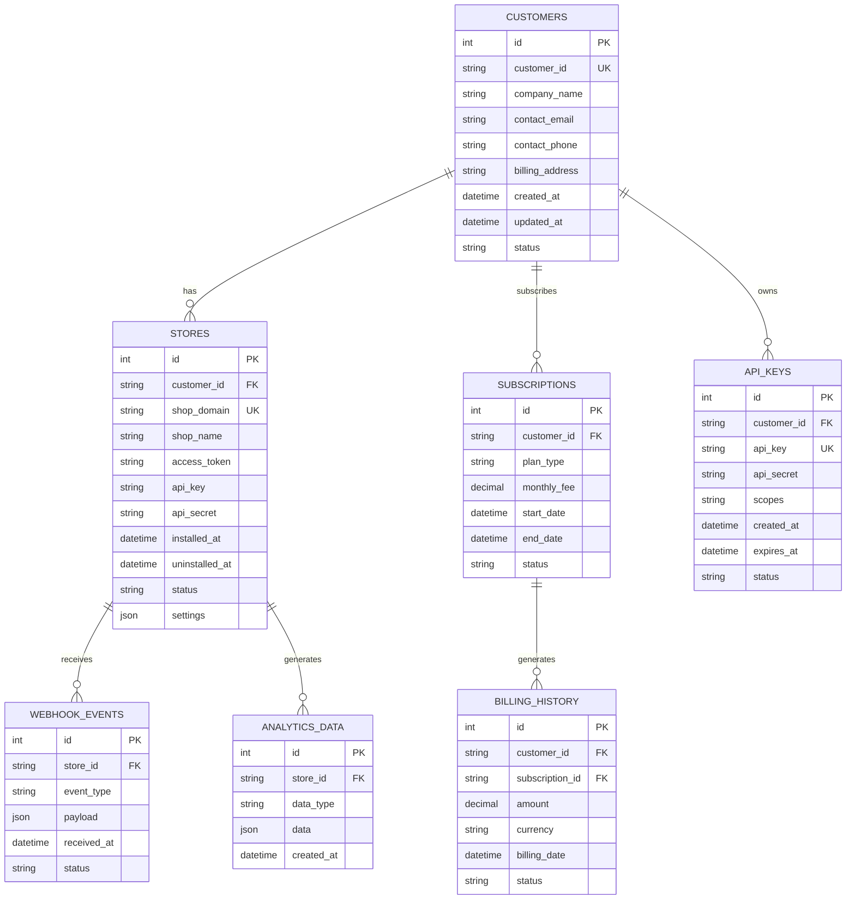

# マルチテナントデータベース設計書

## 概要

本ドキュメントは、マルチテナントShopifyアプリのデータベース設計詳細を定義します。

**作成日**: 2025年1月25日  
**バージョン**: 1.0  
**担当**: 福田 + AI Assistant  
**ステータス**: 設計中

## エンティティ関係図



## テーブル定義

### Customers テーブル

```sql
CREATE TABLE Customers (
    Id INT IDENTITY(1,1) PRIMARY KEY,
    CustomerId NVARCHAR(100) UNIQUE NOT NULL,
    CompanyName NVARCHAR(255) NOT NULL,
    ContactEmail NVARCHAR(255) NOT NULL,
    ContactPhone NVARCHAR(50),
    BillingAddress NVARCHAR(MAX),
    CreatedAt DATETIME2 DEFAULT GETUTCDATE(),
    UpdatedAt DATETIME2 DEFAULT GETUTCDATE(),
    Status NVARCHAR(50) DEFAULT 'active',
    CONSTRAINT CK_Customers_Status CHECK (Status IN ('active', 'inactive', 'suspended', 'deleted'))
);

-- インデックス
CREATE INDEX IX_Customers_CustomerId ON Customers(CustomerId);
CREATE INDEX IX_Customers_Status ON Customers(Status);
CREATE INDEX IX_Customers_CreatedAt ON Customers(CreatedAt);
```

### Stores テーブル

```sql
CREATE TABLE Stores (
    Id INT IDENTITY(1,1) PRIMARY KEY,
    CustomerId NVARCHAR(100) NOT NULL,
    ShopDomain NVARCHAR(255) UNIQUE NOT NULL,
    ShopName NVARCHAR(255),
    AccessToken NVARCHAR(MAX), -- 暗号化して保存
    ApiKey NVARCHAR(255),      -- 暗号化して保存
    ApiSecret NVARCHAR(255),   -- 暗号化して保存
    Scopes NVARCHAR(500),
    InstalledAt DATETIME2,
    UninstalledAt DATETIME2,
    Status NVARCHAR(50) DEFAULT 'active',
    Settings NVARCHAR(MAX),    -- JSON形式の設定
    CreatedAt DATETIME2 DEFAULT GETUTCDATE(),
    UpdatedAt DATETIME2 DEFAULT GETUTCDATE(),
    CONSTRAINT FK_Stores_Customers FOREIGN KEY (CustomerId) REFERENCES Customers(CustomerId),
    CONSTRAINT CK_Stores_Status CHECK (Status IN ('active', 'inactive', 'uninstalled', 'suspended'))
);

-- インデックス
CREATE INDEX IX_Stores_CustomerId ON Stores(CustomerId);
CREATE INDEX IX_Stores_ShopDomain ON Stores(ShopDomain);
CREATE INDEX IX_Stores_Status ON Stores(Status);
CREATE INDEX IX_Stores_InstalledAt ON Stores(InstalledAt);
```

### API_Keys テーブル

```sql
CREATE TABLE API_Keys (
    Id INT IDENTITY(1,1) PRIMARY KEY,
    CustomerId NVARCHAR(100) NOT NULL,
    ApiKey NVARCHAR(255) UNIQUE NOT NULL,
    ApiSecret NVARCHAR(255) NOT NULL, -- 暗号化して保存
    Scopes NVARCHAR(500),
    CreatedAt DATETIME2 DEFAULT GETUTCDATE(),
    ExpiresAt DATETIME2,
    Status NVARCHAR(50) DEFAULT 'active',
    CONSTRAINT FK_API_Keys_Customers FOREIGN KEY (CustomerId) REFERENCES Customers(CustomerId),
    CONSTRAINT CK_API_Keys_Status CHECK (Status IN ('active', 'inactive', 'expired', 'revoked'))
);

-- インデックス
CREATE INDEX IX_API_Keys_CustomerId ON API_Keys(CustomerId);
CREATE INDEX IX_API_Keys_ApiKey ON API_Keys(ApiKey);
CREATE INDEX IX_API_Keys_Status ON API_Keys(Status);
CREATE INDEX IX_API_Keys_ExpiresAt ON API_Keys(ExpiresAt);
```

### Subscriptions テーブル

```sql
CREATE TABLE Subscriptions (
    Id INT IDENTITY(1,1) PRIMARY KEY,
    CustomerId NVARCHAR(100) NOT NULL,
    PlanType NVARCHAR(50) NOT NULL,
    MonthlyFee DECIMAL(10,2) NOT NULL,
    StartDate DATETIME2 NOT NULL,
    EndDate DATETIME2,
    Status NVARCHAR(50) DEFAULT 'active',
    StripeSubscriptionId NVARCHAR(255),
    CreatedAt DATETIME2 DEFAULT GETUTCDATE(),
    UpdatedAt DATETIME2 DEFAULT GETUTCDATE(),
    CONSTRAINT FK_Subscriptions_Customers FOREIGN KEY (CustomerId) REFERENCES Customers(CustomerId),
    CONSTRAINT CK_Subscriptions_Status CHECK (Status IN ('active', 'cancelled', 'suspended', 'expired'))
);

-- インデックス
CREATE INDEX IX_Subscriptions_CustomerId ON Subscriptions(CustomerId);
CREATE INDEX IX_Subscriptions_Status ON Subscriptions(Status);
CREATE INDEX IX_Subscriptions_StartDate ON Subscriptions(StartDate);
```

### Billing_History テーブル

```sql
CREATE TABLE Billing_History (
    Id INT IDENTITY(1,1) PRIMARY KEY,
    CustomerId NVARCHAR(100) NOT NULL,
    SubscriptionId INT,
    Amount DECIMAL(10,2) NOT NULL,
    Currency NVARCHAR(3) DEFAULT 'USD',
    BillingDate DATETIME2 NOT NULL,
    Status NVARCHAR(50) DEFAULT 'pending',
    StripeInvoiceId NVARCHAR(255),
    CreatedAt DATETIME2 DEFAULT GETUTCDATE(),
    CONSTRAINT FK_Billing_History_Customers FOREIGN KEY (CustomerId) REFERENCES Customers(CustomerId),
    CONSTRAINT FK_Billing_History_Subscriptions FOREIGN KEY (SubscriptionId) REFERENCES Subscriptions(Id),
    CONSTRAINT CK_Billing_History_Status CHECK (Status IN ('pending', 'paid', 'failed', 'refunded'))
);

-- インデックス
CREATE INDEX IX_Billing_History_CustomerId ON Billing_History(CustomerId);
CREATE INDEX IX_Billing_History_BillingDate ON Billing_History(BillingDate);
CREATE INDEX IX_Billing_History_Status ON Billing_History(Status);
```

### Webhook_Events テーブル

```sql
CREATE TABLE Webhook_Events (
    Id INT IDENTITY(1,1) PRIMARY KEY,
    StoreId INT NOT NULL,
    EventType NVARCHAR(100) NOT NULL,
    Payload NVARCHAR(MAX), -- JSON形式
    ReceivedAt DATETIME2 DEFAULT GETUTCDATE(),
    ProcessedAt DATETIME2,
    Status NVARCHAR(50) DEFAULT 'pending',
    ErrorMessage NVARCHAR(MAX),
    RetryCount INT DEFAULT 0,
    CONSTRAINT FK_Webhook_Events_Stores FOREIGN KEY (StoreId) REFERENCES Stores(Id),
    CONSTRAINT CK_Webhook_Events_Status CHECK (Status IN ('pending', 'processed', 'failed', 'retry'))
);

-- インデックス
CREATE INDEX IX_Webhook_Events_StoreId ON Webhook_Events(StoreId);
CREATE INDEX IX_Webhook_Events_EventType ON Webhook_Events(EventType);
CREATE INDEX IX_Webhook_Events_ReceivedAt ON Webhook_Events(ReceivedAt);
CREATE INDEX IX_Webhook_Events_Status ON Webhook_Events(Status);
```

### Analytics_Data テーブル

```sql
CREATE TABLE Analytics_Data (
    Id INT IDENTITY(1,1) PRIMARY KEY,
    StoreId INT NOT NULL,
    DataType NVARCHAR(100) NOT NULL,
    Data NVARCHAR(MAX), -- JSON形式
    CreatedAt DATETIME2 DEFAULT GETUTCDATE(),
    CONSTRAINT FK_Analytics_Data_Stores FOREIGN KEY (StoreId) REFERENCES Stores(Id)
);

-- インデックス
CREATE INDEX IX_Analytics_Data_StoreId ON Analytics_Data(StoreId);
CREATE INDEX IX_Analytics_Data_DataType ON Analytics_Data(DataType);
CREATE INDEX IX_Analytics_Data_CreatedAt ON Analytics_Data(CreatedAt);
```

## データ分離戦略

### 1. 顧客別データ分離

```csharp
public class TenantContext
{
    public string CustomerId { get; set; }
    public string ShopDomain { get; set; }
    public Dictionary<string, object> Settings { get; set; }
}

public class TenantMiddleware
{
    public async Task InvokeAsync(HttpContext context, RequestDelegate next)
    {
        // 顧客IDをリクエストから抽出
        var customerId = ExtractCustomerId(context.Request);
        var shopDomain = ExtractShopDomain(context.Request);
        
        // テナントコンテキストを設定
        var tenantContext = new TenantContext
        {
            CustomerId = customerId,
            ShopDomain = shopDomain,
            Settings = await GetTenantSettingsAsync(customerId)
        };
        
        context.Items["TenantContext"] = tenantContext;
        
        await next(context);
    }
}
```

### 2. データベースレベルでの分離

```csharp
public class TenantDbContext : DbContext
{
    private readonly TenantContext _tenantContext;
    
    protected override void OnModelCreating(ModelBuilder modelBuilder)
    {
        // 顧客別フィルタリング
        modelBuilder.Entity<Store>()
            .HasQueryFilter(e => e.CustomerId == _tenantContext.CustomerId);
            
        modelBuilder.Entity<AnalyticsData>()
            .HasQueryFilter(e => e.Store.CustomerId == _tenantContext.CustomerId);
    }
}
```

## パフォーマンス最適化

### 1. パーティショニング戦略

```sql
-- 顧客別パーティショニング
CREATE PARTITION FUNCTION CustomerPartitionFunction (NVARCHAR(100))
AS RANGE LEFT FOR VALUES ('CUST001', 'CUST002', 'CUST003', 'CUST004', 'CUST005');

CREATE PARTITION SCHEME CustomerPartitionScheme
AS PARTITION CustomerPartitionFunction
ALL TO ([PRIMARY]);

-- パーティショニングされたテーブル
CREATE TABLE Stores_Partitioned (
    Id INT IDENTITY(1,1),
    CustomerId NVARCHAR(100) NOT NULL,
    ShopDomain NVARCHAR(255) UNIQUE NOT NULL,
    -- その他のカラム
    CONSTRAINT PK_Stores_Partitioned PRIMARY KEY (Id, CustomerId)
) ON CustomerPartitionScheme(CustomerId);
```

### 2. インデックス戦略

```sql
-- 複合インデックス
CREATE INDEX IX_Stores_CustomerId_Status ON Stores(CustomerId, Status);
CREATE INDEX IX_Webhook_Events_StoreId_EventType ON Webhook_Events(StoreId, EventType);

-- カバリングインデックス
CREATE INDEX IX_Stores_CustomerId_Covering ON Stores(CustomerId, ShopDomain, Status, InstalledAt)
INCLUDE (ShopName, AccessToken);
```

### 3. アーカイブ戦略

```sql
-- 古いデータのアーカイブ
CREATE TABLE Webhook_Events_Archive (
    Id INT,
    StoreId INT,
    EventType NVARCHAR(100),
    Payload NVARCHAR(MAX),
    ReceivedAt DATETIME2,
    ProcessedAt DATETIME2,
    Status NVARCHAR(50),
    ArchivedAt DATETIME2 DEFAULT GETUTCDATE()
);

-- アーカイブプロシージャ
CREATE PROCEDURE ArchiveOldWebhookEvents
    @DaysToKeep INT = 90
AS
BEGIN
    INSERT INTO Webhook_Events_Archive
    SELECT *, GETUTCDATE()
    FROM Webhook_Events
    WHERE ReceivedAt < DATEADD(DAY, -@DaysToKeep, GETUTCDATE())
    AND Status IN ('processed', 'failed');
    
    DELETE FROM Webhook_Events
    WHERE ReceivedAt < DATEADD(DAY, -@DaysToKeep, GETUTCDATE())
    AND Status IN ('processed', 'failed');
END
```

## バックアップ・復旧戦略

### 1. バックアップ戦略

```sql
-- 完全バックアップ（日次）
BACKUP DATABASE [ShopifyMultiTenantApp]
TO DISK = 'C:\Backups\ShopifyMultiTenantApp_Full_20250125.bak'
WITH COMPRESSION, CHECKSUM;

-- 差分バックアップ（時間次）
BACKUP DATABASE [ShopifyMultiTenantApp]
TO DISK = 'C:\Backups\ShopifyMultiTenantApp_Diff_20250125_1200.bak'
WITH DIFFERENTIAL, COMPRESSION, CHECKSUM;

-- トランザクションログバックアップ（15分次）
BACKUP LOG [ShopifyMultiTenantApp]
TO DISK = 'C:\Backups\ShopifyMultiTenantApp_Log_20250125_1200.trn'
WITH COMPRESSION, CHECKSUM;
```

### 2. 顧客別データ復旧

```csharp
public class CustomerBackupService
{
    public async Task<CustomerBackup> CreateCustomerBackupAsync(string customerId)
    {
        var customer = await _customerRepository.GetByIdAsync(customerId);
        var stores = await _storeRepository.GetByCustomerAsync(customerId);
        var subscriptions = await _subscriptionRepository.GetByCustomerAsync(customerId);
        
        var backup = new CustomerBackup
        {
            CustomerId = customerId,
            CustomerData = customer,
            StoresData = stores,
            SubscriptionsData = subscriptions,
            CreatedAt = DateTime.UtcNow
        };
        
        // Azure Blob Storageに保存
        await _blobService.UploadAsync($"backups/{customerId}/{DateTime.UtcNow:yyyyMMdd-HHmmss}.json", 
            JsonSerializer.Serialize(backup));
            
        return backup;
    }
    
    public async Task RestoreCustomerDataAsync(string customerId, DateTime backupDate)
    {
        var backupBlob = await _blobService.GetAsync($"backups/{customerId}/{backupDate:yyyyMMdd-HHmmss}.json");
        var backup = JsonSerializer.Deserialize<CustomerBackup>(backupBlob);
        
        // データ復旧処理
        await _customerRepository.RestoreAsync(backup.CustomerData);
        await _storeRepository.RestoreAsync(backup.StoresData);
        await _subscriptionRepository.RestoreAsync(backup.SubscriptionsData);
    }
}
```

## 監視・メトリクス

### 1. パフォーマンス監視

```sql
-- スロークエリ監視
SELECT 
    qs.execution_count,
    qs.total_elapsed_time / qs.execution_count as avg_elapsed_time,
    qs.total_logical_reads / qs.execution_count as avg_logical_reads,
    qs.total_physical_reads / qs.execution_count as avg_physical_reads,
    SUBSTRING(qt.text, (qs.statement_start_offset/2)+1,
        ((CASE qs.statement_end_offset
            WHEN -1 THEN DATALENGTH(qt.text)
            ELSE qs.statement_end_offset
        END - qs.statement_start_offset)/2) + 1) as statement_text
FROM sys.dm_exec_query_stats qs
CROSS APPLY sys.dm_exec_sql_text(qs.sql_handle) qt
WHERE qs.total_elapsed_time / qs.execution_count > 1000 -- 1秒以上
ORDER BY avg_elapsed_time DESC;
```

### 2. 容量監視

```sql
-- テーブルサイズ監視
SELECT 
    t.NAME AS TableName,
    s.Name AS SchemaName,
    p.rows AS RowCounts,
    SUM(a.total_pages) * 8 AS TotalSpaceKB,
    SUM(a.used_pages) * 8 AS UsedSpaceKB,
    (SUM(a.total_pages) - SUM(a.used_pages)) * 8 AS UnusedSpaceKB
FROM sys.tables t
INNER JOIN sys.indexes i ON t.OBJECT_ID = i.object_id
INNER JOIN sys.partitions p ON i.object_id = p.OBJECT_ID AND i.index_id = p.index_id
INNER JOIN sys.allocation_units a ON p.partition_id = a.container_id
INNER JOIN sys.schemas s ON t.schema_id = s.schema_id
WHERE t.NAME NOT LIKE 'dt%' 
    AND t.is_ms_shipped = 0
    AND i.OBJECT_ID > 255 
GROUP BY t.NAME, s.Name, p.Rows
ORDER BY TotalSpaceKB DESC;
```

## セキュリティ考慮事項

### 1. データ暗号化

```csharp
public class EncryptionService
{
    private readonly string _keyVaultUrl;
    private readonly string _encryptionKeyName;
    
    public async Task<string> EncryptAsync(string plainText)
    {
        var key = await GetEncryptionKeyAsync();
        
        using (var aes = Aes.Create())
        {
            aes.Key = Convert.FromBase64String(key);
            aes.GenerateIV();
            
            using (var encryptor = aes.CreateEncryptor())
            using (var ms = new MemoryStream())
            {
                using (var cs = new CryptoStream(ms, encryptor, CryptoStreamMode.Write))
                using (var sw = new StreamWriter(cs))
                {
                    await sw.WriteAsync(plainText);
                }
                
                var encrypted = ms.ToArray();
                var result = new byte[aes.IV.Length + encrypted.Length];
                Array.Copy(aes.IV, 0, result, 0, aes.IV.Length);
                Array.Copy(encrypted, 0, result, aes.IV.Length, encrypted.Length);
                
                return Convert.ToBase64String(result);
            }
        }
    }
}
```

### 2. アクセス制御

```sql
-- 顧客別ビュー作成
CREATE VIEW vw_CustomerStores
WITH SCHEMABINDING
AS
SELECT 
    s.Id,
    s.CustomerId,
    s.ShopDomain,
    s.ShopName,
    s.Status,
    s.InstalledAt
FROM dbo.Stores s
WHERE s.CustomerId = CAST(SESSION_CONTEXT(N'CustomerId') AS NVARCHAR(100));

-- 行レベルセキュリティ
CREATE FUNCTION fn_CustomerFilter(@CustomerId NVARCHAR(100))
RETURNS TABLE
WITH SCHEMABINDING
AS
RETURN SELECT 1 AS fn_securitypredicate_result
WHERE @CustomerId = CAST(SESSION_CONTEXT(N'CustomerId') AS NVARCHAR(100));

CREATE SECURITY POLICY CustomerFilterPolicy
ADD FILTER PREDICATE dbo.fn_CustomerFilter(CustomerId)
ON dbo.Stores;
```

## マイグレーション戦略

### 1. 段階的マイグレーション

```csharp
public class DatabaseMigrationService
{
    public async Task MigrateToMultiTenantAsync()
    {
        // Step 1: 新しいテーブル作成
        await CreateMultiTenantTablesAsync();
        
        // Step 2: 既存データ移行
        await MigrateExistingDataAsync();
        
        // Step 3: インデックス作成
        await CreateIndexesAsync();
        
        // Step 4: 制約追加
        await AddConstraintsAsync();
        
        // Step 5: 古いテーブル削除
        await DropOldTablesAsync();
    }
    
    private async Task MigrateExistingDataAsync()
    {
        // 既存の単一テナントデータをマルチテナント形式に移行
        var existingStores = await _oldDbContext.Stores.ToListAsync();
        
        foreach (var store in existingStores)
        {
            // デフォルト顧客を作成
            var customer = new Customer
            {
                CustomerId = $"LEGACY_{store.Id}",
                CompanyName = store.ShopName ?? "Legacy Customer",
                ContactEmail = "legacy@example.com",
                Status = "active"
            };
            
            await _newDbContext.Customers.AddAsync(customer);
            
            // ストア情報を移行
            var newStore = new Store
            {
                CustomerId = customer.CustomerId,
                ShopDomain = store.ShopDomain,
                ShopName = store.ShopName,
                AccessToken = store.AccessToken,
                Status = store.Status,
                InstalledAt = store.CreatedAt
            };
            
            await _newDbContext.Stores.AddAsync(newStore);
        }
        
        await _newDbContext.SaveChangesAsync();
    }
}
```

## 結論

このデータベース設計により、以下の価値を提供できます：

### 技術的価値
- **スケーラビリティ**: パーティショニングとインデックス最適化
- **セキュリティ**: 顧客別データ分離と暗号化
- **パフォーマンス**: 効率的なクエリとキャッシュ戦略

### 運用価値
- **監視**: 包括的なパフォーマンス監視
- **バックアップ**: 顧客別データ保護
- **復旧**: 迅速な障害復旧

### 次のステップ
1. **実装**: データベーススキーマの実装
2. **テスト**: パフォーマンステストと負荷テスト
3. **移行**: 既存データの移行計画策定 