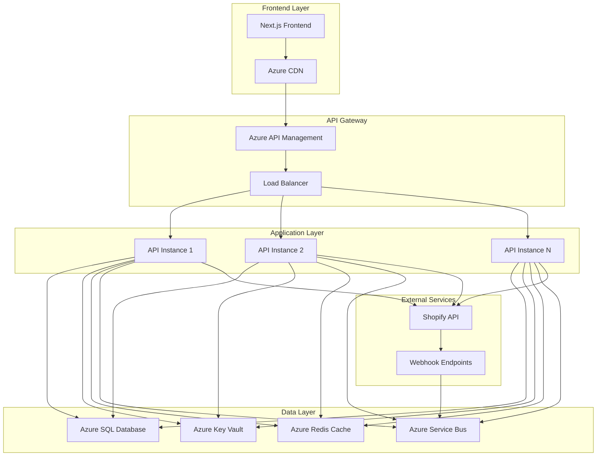

# マルチテナントShopifyアプリ 概要設計書

## 概要

本ドキュメントは、不特定多数のShopifyストア向けの本格運用を目的とした、マルチテナントアーキテクチャの概要設計を定義します。

**作成日**: 2025年1月25日  
**バージョン**: 1.0  
**担当**: 福田 + AI Assistant  
**ステータス**: 設計中

## 現在の実装 vs 本格運用

| 項目 | 現在の実装 | 本格運用 |
|------|------------|----------|
| APIキー管理 | 単一APIキー | 顧客別Custom App |
| データ分離 | なし | 顧客別テナント分離 |
| 認証フロー | 固定リダイレクト | 顧客別動的生成 |
| 設定管理 | appsettings.json | データベース + Azure Key Vault |
| スケーラビリティ | 単一インスタンス | マルチインスタンス + キャッシュ |

## システム構成図

## 主要コンポーネント

### 1. マルチテナント認証システム
- 顧客別Custom App管理
- 動的OAuth URL生成
- セキュアなトークン管理

### 2. データ分離システム
- 顧客別データベース分離
- 暗号化された機密情報管理
- テナントコンテキスト管理

### 3. スケーラブル処理基盤
- 水平スケーリング対応
- 非同期処理（Azure Service Bus）
- 分散キャッシュ（Redis）

### 4. 運用管理システム
- 顧客管理ダッシュボード
- 監視・アラート機能
- 自動化機能

## 移行戦略

### Phase 1: 基盤整備 (2-3週間)
- データベース設計・実装
- セキュリティ基盤構築
- インフラ整備

### Phase 2: 機能移行 (3-4週間)
- OAuth認証フロー移行
- Webhook処理移行
- データ処理移行

### Phase 3: 運用開始 (2-3週間)
- 管理機能実装
- 課金システム統合
- テスト・デプロイ

## 次のステップ

1. **詳細設計ドキュメント作成**
   - データベース設計詳細
   - セキュリティ設計詳細
   - API設計詳細

2. **プロトタイプ開発**
   - 主要機能の実証
   - パフォーマンステスト

3. **移行計画策定**
   - 具体的なスケジュール
   - リソース配分

## 関連ドキュメント

- [データベース設計詳細](./database-design.md)
- [セキュリティ設計詳細](./security-design.md)
- [API設計詳細](./api-design.md)
- [運用管理設計詳細](./operations-design.md) 