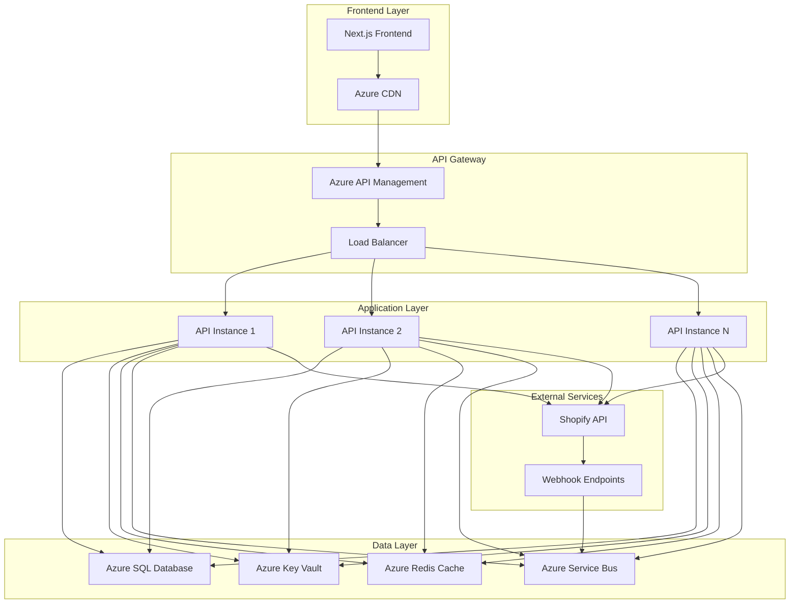
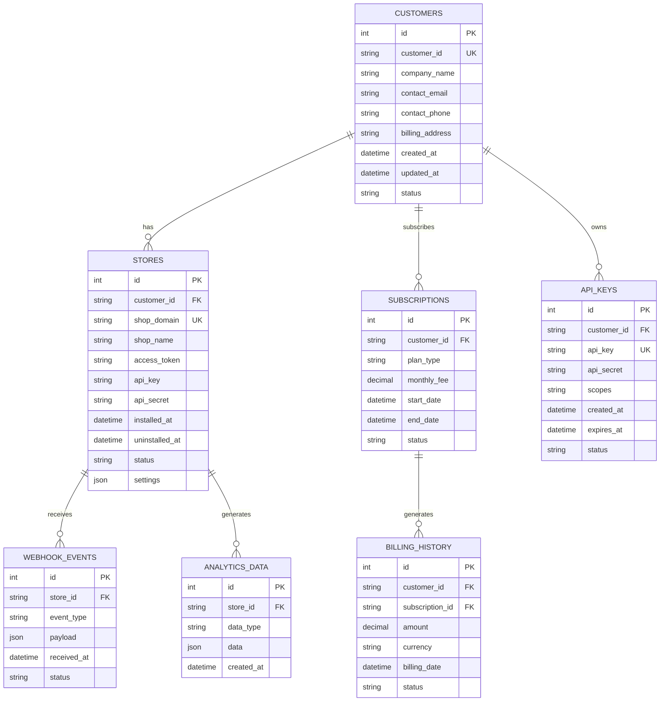
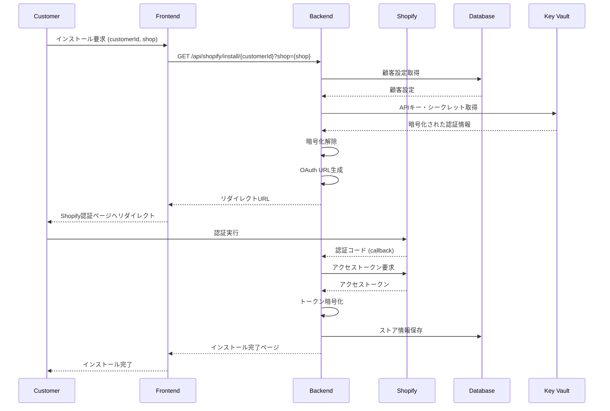

# マルチテナントShopifyアプリ 本格運用設計書

## 概要

本ドキュメントは、不特定多数のShopifyストア向けの本格運用を目的とした、マルチテナントアーキテクチャの詳細設計を定義します。

**作成日**: 2025年1月25日  
**バージョン**: 1.0  
**担当**: 福田 + AI Assistant  
**ステータス**: 設計中

## 目次

1. [アーキテクチャ概要](#アーキテクチャ概要)
2. [データベース設計](#データベース設計)
3. [セキュリティ設計](#セキュリティ設計)
4. [認証・認可フロー](#認証認可フロー)
5. [スケーラビリティ設計](#スケーラビリティ設計)
6. [運用管理設計](#運用管理設計)
7. [料金体系設計](#料金体系設計)
8. [移行戦略](#移行戦略)
9. [リスク分析](#リスク分析)

## アーキテクチャ概要

### 現在の実装 vs 本格運用

| 項目 | 現在の実装 | 本格運用 |
|------|------------|----------|
| APIキー管理 | 単一APIキー | 顧客別Custom App |
| データ分離 | なし | 顧客別テナント分離 |
| 認証フロー | 固定リダイレクト | 顧客別動的生成 |
| 設定管理 | appsettings.json | データベース + Azure Key Vault |
| スケーラビリティ | 単一インスタンス | マルチインスタンス + キャッシュ |

### システム構成図



## データベース設計

### エンティティ関係図



### テーブル定義

#### Customers テーブル
```sql
CREATE TABLE Customers (
    Id INT IDENTITY(1,1) PRIMARY KEY,
    CustomerId NVARCHAR(100) UNIQUE NOT NULL,
    CompanyName NVARCHAR(255) NOT NULL,
    ContactEmail NVARCHAR(255) NOT NULL,
    ContactPhone NVARCHAR(50),
    BillingAddress NVARCHAR(MAX),
    CreatedAt DATETIME2 DEFAULT GETUTCDATE(),
    UpdatedAt DATETIME2 DEFAULT GETUTCDATE(),
    Status NVARCHAR(50) DEFAULT 'active',
    CONSTRAINT CK_Customers_Status CHECK (Status IN ('active', 'inactive', 'suspended', 'deleted'))
);

-- インデックス
CREATE INDEX IX_Customers_CustomerId ON Customers(CustomerId);
CREATE INDEX IX_Customers_Status ON Customers(Status);
CREATE INDEX IX_Customers_CreatedAt ON Customers(CreatedAt);
```

#### Stores テーブル
```sql
CREATE TABLE Stores (
    Id INT IDENTITY(1,1) PRIMARY KEY,
    CustomerId NVARCHAR(100) NOT NULL,
    ShopDomain NVARCHAR(255) UNIQUE NOT NULL,
    ShopName NVARCHAR(255),
    AccessToken NVARCHAR(MAX), -- 暗号化して保存
    ApiKey NVARCHAR(255),      -- 暗号化して保存
    ApiSecret NVARCHAR(255),   -- 暗号化して保存
    Scopes NVARCHAR(500),
    InstalledAt DATETIME2,
    UninstalledAt DATETIME2,
    Status NVARCHAR(50) DEFAULT 'active',
    Settings NVARCHAR(MAX),    -- JSON形式の設定
    CreatedAt DATETIME2 DEFAULT GETUTCDATE(),
    UpdatedAt DATETIME2 DEFAULT GETUTCDATE(),
    CONSTRAINT FK_Stores_Customers FOREIGN KEY (CustomerId) REFERENCES Customers(CustomerId),
    CONSTRAINT CK_Stores_Status CHECK (Status IN ('active', 'inactive', 'uninstalled', 'suspended'))
);

-- インデックス
CREATE INDEX IX_Stores_CustomerId ON Stores(CustomerId);
CREATE INDEX IX_Stores_ShopDomain ON Stores(ShopDomain);
CREATE INDEX IX_Stores_Status ON Stores(Status);
CREATE INDEX IX_Stores_InstalledAt ON Stores(InstalledAt);
```

#### API_Keys テーブル
```sql
CREATE TABLE API_Keys (
    Id INT IDENTITY(1,1) PRIMARY KEY,
    CustomerId NVARCHAR(100) NOT NULL,
    ApiKey NVARCHAR(255) UNIQUE NOT NULL,
    ApiSecret NVARCHAR(255) NOT NULL, -- 暗号化して保存
    Scopes NVARCHAR(500),
    CreatedAt DATETIME2 DEFAULT GETUTCDATE(),
    ExpiresAt DATETIME2,
    Status NVARCHAR(50) DEFAULT 'active',
    CONSTRAINT FK_API_Keys_Customers FOREIGN KEY (CustomerId) REFERENCES Customers(CustomerId),
    CONSTRAINT CK_API_Keys_Status CHECK (Status IN ('active', 'inactive', 'expired', 'revoked'))
);

-- インデックス
CREATE INDEX IX_API_Keys_CustomerId ON API_Keys(CustomerId);
CREATE INDEX IX_API_Keys_ApiKey ON API_Keys(ApiKey);
CREATE INDEX IX_API_Keys_Status ON API_Keys(Status);
CREATE INDEX IX_API_Keys_ExpiresAt ON API_Keys(ExpiresAt);
```

## セキュリティ設計

### 暗号化戦略

#### 1. 機密データの暗号化
```csharp
public class EncryptionService
{
    private readonly string _keyVaultUrl;
    private readonly string _encryptionKeyName;
    
    public async Task<string> EncryptAsync(string plainText)
    {
        // Azure Key Vaultから暗号化キーを取得
        var key = await GetEncryptionKeyAsync();
        
        using (var aes = Aes.Create())
        {
            aes.Key = Convert.FromBase64String(key);
            aes.GenerateIV();
            
            using (var encryptor = aes.CreateEncryptor())
            using (var ms = new MemoryStream())
            {
                using (var cs = new CryptoStream(ms, encryptor, CryptoStreamMode.Write))
                using (var sw = new StreamWriter(cs))
                {
                    await sw.WriteAsync(plainText);
                }
                
                var encrypted = ms.ToArray();
                var result = new byte[aes.IV.Length + encrypted.Length];
                Array.Copy(aes.IV, 0, result, 0, aes.IV.Length);
                Array.Copy(encrypted, 0, result, aes.IV.Length, encrypted.Length);
                
                return Convert.ToBase64String(result);
            }
        }
    }
    
    public async Task<string> DecryptAsync(string encryptedText)
    {
        var key = await GetEncryptionKeyAsync();
        var encrypted = Convert.FromBase64String(encryptedText);
        
        using (var aes = Aes.Create())
        {
            aes.Key = Convert.FromBase64String(key);
            aes.IV = new byte[16];
            Array.Copy(encrypted, 0, aes.IV, 0, 16);
            
            using (var decryptor = aes.CreateDecryptor())
            using (var ms = new MemoryStream(encrypted, 16, encrypted.Length - 16))
            using (var cs = new CryptoStream(ms, decryptor, CryptoStreamMode.Read))
            using (var sr = new StreamReader(cs))
            {
                return await sr.ReadToEndAsync();
            }
        }
    }
}
```

#### 2. Azure Key Vault統合
```json
{
  "AzureKeyVault": {
    "VaultUrl": "https://shopify-app-kv.vault.azure.net/",
    "SecretNames": {
      "EncryptionKey": "ShopifyApp-EncryptionKey",
      "DatabaseConnection": "ShopifyApp-DatabaseConnection",
      "ShopifyApiKey": "ShopifyApp-ApiKey",
      "ShopifyApiSecret": "ShopifyApp-ApiSecret"
    }
  }
}
```

### データ分離戦略

#### 1. 顧客別データ分離
```csharp
public class TenantContext
{
    public string CustomerId { get; set; }
    public string ShopDomain { get; set; }
    public Dictionary<string, object> Settings { get; set; }
}

public class TenantMiddleware
{
    public async Task InvokeAsync(HttpContext context, RequestDelegate next)
    {
        // 顧客IDをリクエストから抽出
        var customerId = ExtractCustomerId(context.Request);
        var shopDomain = ExtractShopDomain(context.Request);
        
        // テナントコンテキストを設定
        var tenantContext = new TenantContext
        {
            CustomerId = customerId,
            ShopDomain = shopDomain,
            Settings = await GetTenantSettingsAsync(customerId)
        };
        
        context.Items["TenantContext"] = tenantContext;
        
        await next(context);
    }
}
```

#### 2. データベースレベルでの分離
```csharp
public class TenantDbContext : DbContext
{
    private readonly TenantContext _tenantContext;
    
    protected override void OnModelCreating(ModelBuilder modelBuilder)
    {
        // 顧客別フィルタリング
        modelBuilder.Entity<Store>()
            .HasQueryFilter(e => e.CustomerId == _tenantContext.CustomerId);
            
        modelBuilder.Entity<AnalyticsData>()
            .HasQueryFilter(e => e.Store.CustomerId == _tenantContext.CustomerId);
    }
}
```

## 認証・認可フロー

### マルチテナントOAuth認証フロー



### 動的OAuth URL生成
```csharp
public class MultiTenantOAuthService
{
    public async Task<string> GenerateInstallationUrlAsync(string customerId, string shopDomain)
    {
        // 顧客設定を取得
        var customerConfig = await GetCustomerConfigAsync(customerId);
        if (customerConfig == null)
        {
            throw new CustomerNotFoundException(customerId);
        }
        
        // APIキー・シークレットを復号化
        var apiKey = await _encryptionService.DecryptAsync(customerConfig.ApiKey);
        var apiSecret = await _encryptionService.DecryptAsync(customerConfig.ApiSecret);
        
        // 顧客別リダイレクトURI
        var redirectUri = $"{GetBaseUrl()}/api/shopify/callback/{customerId}";
        
        // セキュアなstateパラメータ生成
        var state = await GenerateSecureStateAsync(customerId, shopDomain);
        
        // OAuth URL構築
        var scopes = customerConfig.Scopes ?? "read_orders,read_products,read_customers";
        var authUrl = $"https://{shopDomain}/admin/oauth/authorize" +
            $"?client_id={Uri.EscapeDataString(apiKey)}" +
            $"&scope={Uri.EscapeDataString(scopes)}" +
            $"&redirect_uri={Uri.EscapeDataString(redirectUri)}" +
            $"&state={Uri.EscapeDataString(state)}";
        
        return authUrl;
    }
    
    public async Task<StoreInstallationResult> ProcessCallbackAsync(
        string customerId, string code, string shop, string state)
    {
        // state検証
        if (!await ValidateStateAsync(state))
        {
            throw new InvalidStateException();
        }
        
        // 顧客設定取得
        var customerConfig = await GetCustomerConfigAsync(customerId);
        var apiKey = await _encryptionService.DecryptAsync(customerConfig.ApiKey);
        var apiSecret = await _encryptionService.DecryptAsync(customerConfig.ApiSecret);
        
        // アクセストークン取得
        var accessToken = await ExchangeCodeForAccessTokenAsync(code, shop, apiKey, apiSecret);
        
        // ストア情報保存
        var store = new Store
        {
            CustomerId = customerId,
            ShopDomain = shop,
            AccessToken = await _encryptionService.EncryptAsync(accessToken),
            ApiKey = customerConfig.ApiKey,
            ApiSecret = customerConfig.ApiSecret,
            InstalledAt = DateTime.UtcNow,
            Status = "active"
        };
        
        await _storeRepository.CreateAsync(store);
        
        return new StoreInstallationResult
        {
            ShopDomain = shop,
            Success = true,
            RedirectUrl = customerConfig.SuccessUrl
        };
    }
}
```

## スケーラビリティ設計

### 水平スケーリング戦略

#### 1. アプリケーション層
```yaml
# Azure App Service プラン設定
apiVersion: '2021-02-01'
type: Microsoft.Web/serverfarms
name: shopify-app-plan
sku:
  name: P1v2  # Premium v2
  tier: Premium
  size: P1v2
  capacity: 3  # 3インスタンス
properties:
  targetWorkerCount: 3
  targetWorkerSizeId: 1
  perSiteScaling: false
  elasticScaleEnabled: true
  maximumElasticWorkerCount: 10
```

#### 2. データベース層
```sql
-- エラスティックプール設定
CREATE ELASTIC POOL [shopify-app-pool]
(
    MAXSIZE = 100GB,
    EDITION = 'Standard',
    DATABASES_PER_POOL = 50
);

-- パーティショニング戦略
CREATE PARTITION FUNCTION CustomerPartitionFunction (NVARCHAR(100))
AS RANGE LEFT FOR VALUES ('CUST001', 'CUST002', 'CUST003', ...);

CREATE PARTITION SCHEME CustomerPartitionScheme
AS PARTITION CustomerPartitionFunction
ALL TO ([PRIMARY]);
```

#### 3. キャッシュ戦略
```csharp
public class DistributedCacheService
{
    private readonly IDistributedCache _cache;
    private readonly ILogger<DistributedCacheService> _logger;
    
    public async Task<T> GetOrSetAsync<T>(string key, Func<Task<T>> factory, TimeSpan? expiry = null)
    {
        var cached = await _cache.GetStringAsync(key);
        if (!string.IsNullOrEmpty(cached))
        {
            return JsonSerializer.Deserialize<T>(cached);
        }
        
        var value = await factory();
        var serialized = JsonSerializer.Serialize(value);
        
        var options = new DistributedCacheEntryOptions
        {
            AbsoluteExpirationRelativeToNow = expiry ?? TimeSpan.FromMinutes(30)
        };
        
        await _cache.SetStringAsync(key, serialized, options);
        return value;
    }
    
    public async Task<T> GetCustomerConfigAsync<T>(string customerId)
    {
        var key = $"customer:config:{customerId}";
        return await GetOrSetAsync(key, async () =>
        {
            // データベースから顧客設定を取得
            return await _customerRepository.GetConfigAsync(customerId);
        }, TimeSpan.FromHours(1));
    }
}
```

### 非同期処理基盤

#### 1. Azure Service Bus統合
```csharp
public class AsyncProcessingService
{
    private readonly ServiceBusClient _client;
    private readonly ServiceBusProcessor _processor;
    
    public async Task EnqueueWebhookEventAsync(WebhookEvent webhookEvent)
    {
        var sender = _client.CreateSender("webhook-events");
        var message = new ServiceBusMessage(JsonSerializer.Serialize(webhookEvent))
        {
            SessionId = webhookEvent.CustomerId, // 顧客別セッション
            PartitionKey = webhookEvent.CustomerId
        };
        
        await sender.SendMessageAsync(message);
    }
    
    public async Task ProcessWebhookEventAsync(ProcessMessageEventArgs args)
    {
        var webhookEvent = JsonSerializer.Deserialize<WebhookEvent>(args.Message.Body);
        
        try
        {
            // 顧客別コンテキストで処理
            using var scope = _serviceProvider.CreateScope();
            var tenantContext = new TenantContext { CustomerId = webhookEvent.CustomerId };
            scope.ServiceProvider.GetRequiredService<ITenantContext>().SetContext(tenantContext);
            
            await _webhookProcessor.ProcessAsync(webhookEvent);
            await args.CompleteMessageAsync(args.Message);
        }
        catch (Exception ex)
        {
            _logger.LogError(ex, "Webhook processing failed");
            await args.DeadLetterMessageAsync(args.Message);
        }
    }
}
```

## 運用管理設計

### 顧客管理ダッシュボード

#### 1. 管理画面機能
```typescript
// 顧客管理ダッシュボード
interface CustomerDashboard {
  // 顧客一覧
  customers: Customer[];
  
  // 顧客詳細
  customerDetail: {
    id: string;
    companyName: string;
    contactEmail: string;
    stores: Store[];
    subscription: Subscription;
    billingHistory: BillingRecord[];
    usageMetrics: UsageMetrics;
  };
  
  // ストア管理
  storeManagement: {
    installationStatus: 'active' | 'inactive' | 'uninstalled';
    lastSyncDate: Date;
    dataUsage: number;
    webhookEvents: WebhookEvent[];
  };
  
  // 課金管理
  billingManagement: {
    currentPlan: string;
    monthlyFee: number;
    usageBasedCharges: UsageCharge[];
    nextBillingDate: Date;
  };
}
```

#### 2. 監視・アラートシステム
```csharp
public class MonitoringService
{
    public async Task MonitorCustomerHealthAsync()
    {
        var customers = await _customerRepository.GetAllActiveAsync();
        
        foreach (var customer in customers)
        {
            // ストア接続状況チェック
            var stores = await _storeRepository.GetByCustomerAsync(customer.Id);
            foreach (var store in stores)
            {
                var isHealthy = await CheckStoreHealthAsync(store);
                if (!isHealthy)
                {
                    await SendAlertAsync(customer, store, "Store connection lost");
                }
            }
            
            // 使用量チェック
            var usage = await _usageService.GetCurrentUsageAsync(customer.Id);
            if (usage.IsOverLimit)
            {
                await SendAlertAsync(customer, null, "Usage limit exceeded");
            }
        }
    }
    
    private async Task<bool> CheckStoreHealthAsync(Store store)
    {
        try
        {
            var accessToken = await _encryptionService.DecryptAsync(store.AccessToken);
            var client = new ShopifyClient(store.ShopDomain, accessToken);
            
            // 簡単なAPI呼び出しで接続確認
            await client.GetShopAsync();
            return true;
        }
        catch
        {
            return false;
        }
    }
}
```

### 自動化機能

#### 1. Custom App自動作成
```csharp
public class CustomAppCreationService
{
    public async Task<CustomAppResult> CreateCustomAppAsync(string customerId)
    {
        // Shopify Partner APIを使用してCustom App作成
        var partnerClient = new ShopifyPartnerClient(_partnerApiKey);
        
        var app = await partnerClient.CreateCustomAppAsync(new CustomAppRequest
        {
            Name = $"Analytics App - {customerId}",
            Scopes = "read_orders,read_products,read_customers",
            RedirectUrls = new[] { $"{GetBaseUrl()}/api/shopify/callback/{customerId}" }
        });
        
        // 顧客設定を更新
        await _customerRepository.UpdateApiCredentialsAsync(customerId, app.ApiKey, app.ApiSecret);
        
        return new CustomAppResult
        {
            ApiKey = app.ApiKey,
            ApiSecret = app.ApiSecret,
            InstallationUrl = app.InstallationUrl
        };
    }
}
```

#### 2. データバックアップ・復旧
```csharp
public class BackupService
{
    public async Task CreateCustomerBackupAsync(string customerId)
    {
        var customer = await _customerRepository.GetByIdAsync(customerId);
        var stores = await _storeRepository.GetByCustomerAsync(customerId);
        
        var backup = new CustomerBackup
        {
            CustomerId = customerId,
            CustomerData = customer,
            StoresData = stores,
            CreatedAt = DateTime.UtcNow
        };
        
        // Azure Blob Storageに保存
        await _blobService.UploadAsync($"backups/{customerId}/{DateTime.UtcNow:yyyyMMdd-HHmmss}.json", 
            JsonSerializer.Serialize(backup));
    }
    
    public async Task RestoreCustomerDataAsync(string customerId, DateTime backupDate)
    {
        var backupBlob = await _blobService.GetAsync($"backups/{customerId}/{backupDate:yyyyMMdd-HHmmss}.json");
        var backup = JsonSerializer.Deserialize<CustomerBackup>(backupBlob);
        
        // データ復旧処理
        await _customerRepository.RestoreAsync(backup.CustomerData);
        await _storeRepository.RestoreAsync(backup.StoresData);
    }
}
```

## 料金体系設計

### プラン設計

#### 1. 基本プラン
```csharp
public enum PlanType
{
    Starter = 1,      // $29/月
    Professional = 2, // $79/月
    Enterprise = 3    // $199/月
}

public class PlanConfiguration
{
    public PlanType Type { get; set; }
    public decimal MonthlyFee { get; set; }
    public int MaxStores { get; set; }
    public int MaxApiCallsPerMonth { get; set; }
    public int DataRetentionDays { get; set; }
    public bool AdvancedAnalytics { get; set; }
    public bool PrioritySupport { get; set; }
}

public static class PlanConfigurations
{
    public static readonly Dictionary<PlanType, PlanConfiguration> Plans = new()
    {
        [PlanType.Starter] = new()
        {
            Type = PlanType.Starter,
            MonthlyFee = 29.00m,
            MaxStores = 1,
            MaxApiCallsPerMonth = 10000,
            DataRetentionDays = 30,
            AdvancedAnalytics = false,
            PrioritySupport = false
        },
        [PlanType.Professional] = new()
        {
            Type = PlanType.Professional,
            MonthlyFee = 79.00m,
            MaxStores = 5,
            MaxApiCallsPerMonth = 50000,
            DataRetentionDays = 90,
            AdvancedAnalytics = true,
            PrioritySupport = false
        },
        [PlanType.Enterprise] = new()
        {
            Type = PlanType.Enterprise,
            MonthlyFee = 199.00m,
            MaxStores = -1, // 無制限
            MaxApiCallsPerMonth = 200000,
            DataRetentionDays = 365,
            AdvancedAnalytics = true,
            PrioritySupport = true
        }
    };
}
```

#### 2. 使用量ベース課金
```csharp
public class UsageBasedBillingService
{
    public async Task<BillingCalculation> CalculateMonthlyBillAsync(string customerId, DateTime billingDate)
    {
        var customer = await _customerRepository.GetByIdAsync(customerId);
        var plan = PlanConfigurations.Plans[customer.Subscription.PlanType];
        
        // 基本料金
        var baseCharge = plan.MonthlyFee;
        
        // 使用量ベース料金
        var usage = await _usageService.GetMonthlyUsageAsync(customerId, billingDate);
        var overageCharges = CalculateOverageCharges(usage, plan);
        
        // ストア数超過料金
        var storeCount = await _storeRepository.GetActiveCountAsync(customerId);
        var storeOverage = CalculateStoreOverage(storeCount, plan.MaxStores);
        
        return new BillingCalculation
        {
            CustomerId = customerId,
            BillingDate = billingDate,
            BaseCharge = baseCharge,
            ApiCallOverage = overageCharges.ApiCallOverage,
            StoreOverage = storeOverage,
            TotalAmount = baseCharge + overageCharges.ApiCallOverage + storeOverage
        };
    }
    
    private OverageCharges CalculateOverageCharges(UsageMetrics usage, PlanConfiguration plan)
    {
        var apiCallOverage = 0m;
        if (usage.ApiCalls > plan.MaxApiCallsPerMonth)
        {
            var overage = usage.ApiCalls - plan.MaxApiCallsPerMonth;
            apiCallOverage = overage * 0.001m; // $0.001 per API call
        }
        
        return new OverageCharges { ApiCallOverage = apiCallOverage };
    }
}
```

### 請求システム統合

#### 1. Stripe統合
```csharp
public class StripeBillingService
{
    private readonly StripeClient _stripeClient;
    
    public async Task<Stripe.Subscription> CreateSubscriptionAsync(string customerId, PlanType planType)
    {
        var customer = await _customerRepository.GetByIdAsync(customerId);
        var plan = PlanConfigurations.Plans[planType];
        
        // Stripe顧客作成
        var stripeCustomer = await _stripeClient.Customers.CreateAsync(new CustomerCreateOptions
        {
            Email = customer.ContactEmail,
            Metadata = new Dictionary<string, string>
            {
                ["customer_id"] = customerId
            }
        });
        
        // サブスクリプション作成
        var subscription = await _stripeClient.Subscriptions.CreateAsync(new SubscriptionCreateOptions
        {
            Customer = stripeCustomer.Id,
            Items = new List<SubscriptionItemOptions>
            {
                new() { Price = GetStripePriceId(planType) }
            },
            Metadata = new Dictionary<string, string>
            {
                ["customer_id"] = customerId,
                ["plan_type"] = planType.ToString()
            }
        });
        
        return subscription;
    }
    
    public async Task ProcessWebhookAsync(Stripe.Event stripeEvent)
    {
        switch (stripeEvent.Type)
        {
            case Events.InvoicePaymentSucceeded:
                await HandlePaymentSucceededAsync(stripeEvent.Data.Object as Invoice);
                break;
            case Events.InvoicePaymentFailed:
                await HandlePaymentFailedAsync(stripeEvent.Data.Object as Invoice);
                break;
            case Events.CustomerSubscriptionDeleted:
                await HandleSubscriptionCancelledAsync(stripeEvent.Data.Object as Subscription);
                break;
        }
    }
}
```

## 移行戦略

### Phase 1: 基盤整備 (2-3週間)

#### Week 1: データベース設計・実装
- [ ] マルチテナントデータベーススキーマ設計
- [ ] マイグレーションスクリプト作成
- [ ] データ暗号化基盤実装
- [ ] Azure Key Vault統合

#### Week 2: セキュリティ基盤
- [ ] 顧客別データ分離実装
- [ ] 暗号化サービス実装
- [ ] 認証・認可フロー設計
- [ ] セキュリティテスト実装

#### Week 3: インフラ整備
- [ ] Azure Service Bus設定
- [ ] Redis Cache設定
- [ ] 監視・ログ基盤構築
- [ ] バックアップ・復旧基盤

### Phase 2: 機能移行 (3-4週間)

#### Week 4-5: OAuth認証フロー移行
- [ ] マルチテナントOAuth実装
- [ ] 動的URL生成機能
- [ ] 顧客別設定管理
- [ ] インストールフローテスト

#### Week 6: Webhook処理移行
- [ ] 顧客別Webhook処理
- [ ] 非同期処理基盤
- [ ] エラーハンドリング強化
- [ ] 監視・アラート実装

#### Week 7: データ処理移行
- [ ] 顧客別データ分離
- [ ] キャッシュ戦略実装
- [ ] パフォーマンス最適化
- [ ] データ整合性チェック

### Phase 3: 運用開始 (2-3週間)

#### Week 8: 管理機能実装
- [ ] 顧客管理ダッシュボード
- [ ] ストア管理機能
- [ ] 使用量監視機能
- [ ] 請求管理機能

#### Week 9: 課金システム統合
- [ ] Stripe統合実装
- [ ] プラン管理機能
- [ ] 使用量ベース課金
- [ ] 請求書生成機能

#### Week 10: テスト・デプロイ
- [ ] 統合テスト
- [ ] 負荷テスト
- [ ] セキュリティテスト
- [ ] 本番環境デプロイ

### 移行チェックリスト

#### データ移行
- [ ] 既存顧客データの移行
- [ ] ストア情報の移行
- [ ] 設定情報の移行
- [ ] データ整合性検証

#### 機能移行
- [ ] OAuth認証フロー
- [ ] Webhook処理
- [ ] データ分析機能
- [ ] レポート生成機能

#### 運用移行
- [ ] 監視・アラート
- [ ] ログ管理
- [ ] バックアップ・復旧
- [ ] サポート体制

## リスク分析

### 技術リスク

#### 1. セキュリティリスク
| リスク | 影響度 | 発生確率 | 対策 |
|--------|--------|----------|------|
| 顧客データ漏洩 | 高 | 中 | 暗号化、アクセス制御、監査ログ |
| APIキー漏洩 | 高 | 低 | Key Vault、定期的なローテーション |
| 不正アクセス | 中 | 中 | 多要素認証、IP制限、セッション管理 |

#### 2. パフォーマンスリスク
| リスク | 影響度 | 発生確率 | 対策 |
|--------|--------|----------|------|
| データベース負荷 | 中 | 高 | パーティショニング、インデックス最適化 |
| API制限超過 | 中 | 中 | レート制限、キューイング、リトライ |
| メモリ不足 | 中 | 低 | 水平スケーリング、キャッシュ最適化 |

### ビジネスリスク

#### 1. 運用リスク
| リスク | 影響度 | 発生確率 | 対策 |
|--------|--------|----------|------|
| 顧客サポート負荷 | 中 | 高 | 自動化、FAQ、チュートリアル |
| 課金エラー | 高 | 中 | 二重チェック、監査、手動確認 |
| データ損失 | 高 | 低 | バックアップ、復旧テスト |

#### 2. 競合リスク
| リスク | 影響度 | 発生確率 | 対策 |
|--------|--------|----------|------|
| 機能競合 | 中 | 高 | 差別化、顧客フィードバック |
| 価格競争 | 中 | 中 | 価値提案、プレミアム機能 |
| 顧客流出 | 高 | 中 | 顧客成功、定期的な価値確認 |

### リスク軽減策

#### 1. 段階的移行
- 少数顧客でのパイロット運用
- 段階的な機能リリース
- ロールバック計画の準備

#### 2. 監視・アラート
- リアルタイム監視
- 自動アラート
- エスカレーション手順

#### 3. ドキュメント・トレーニング
- 運用マニュアル
- トラブルシューティングガイド
- チームトレーニング

## 結論

本格運用に向けたマルチテナントアーキテクチャの設計により、以下の価値を提供できます：

### 技術的価値
- **スケーラビリティ**: 水平スケーリングによる高可用性
- **セキュリティ**: 顧客別データ分離と暗号化
- **保守性**: モジュラー設計と自動化

### ビジネス価値
- **収益性**: 使用量ベース課金による収益最適化
- **顧客満足度**: カスタマイズ可能な機能とサポート
- **競争優位性**: 差別化された機能と価値提案

### 次のステップ
1. **詳細設計レビュー**: チーム内での設計検証
2. **プロトタイプ開発**: 主要機能の実証
3. **移行計画策定**: 具体的なスケジュールとリソース配分
4. **リスク対策**: 特定されたリスクへの対策実装

この設計に基づいて、8月8日のShopifyアプリ申請後の本格運用準備を進めることができます。 