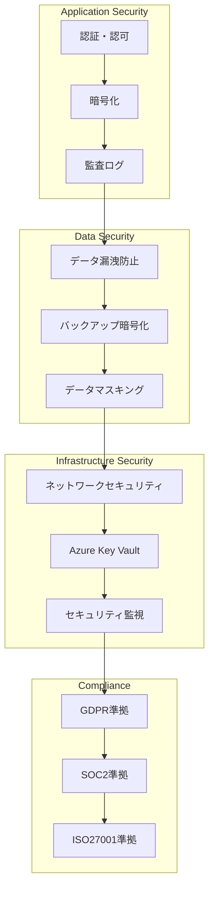

# マルチテナントセキュリティ設計書

## 概要

本ドキュメントは、マルチテナントShopifyアプリのセキュリティ設計詳細を定義します。

**作成日**: 2025年1月25日  
**バージョン**: 1.0  
**担当**: 福田 + AI Assistant  
**ステータス**: 設計中

## セキュリティアーキテクチャ

### セキュリティレイヤー



## 認証・認可システム

### 1. マルチテナントOAuth認証

```csharp
public class MultiTenantOAuthService
{
    private readonly IEncryptionService _encryptionService;
    private readonly ICustomerRepository _customerRepository;
    private readonly ILogger<MultiTenantOAuthService> _logger;
    
    public async Task<string> GenerateInstallationUrlAsync(string customerId, string shopDomain)
    {
        // 顧客設定を取得
        var customerConfig = await GetCustomerConfigAsync(customerId);
        if (customerConfig == null)
        {
            throw new CustomerNotFoundException(customerId);
        }
        
        // APIキー・シークレットを復号化
        var apiKey = await _encryptionService.DecryptAsync(customerConfig.ApiKey);
        var apiSecret = await _encryptionService.DecryptAsync(customerConfig.ApiSecret);
        
        // 顧客別リダイレクトURI
        var redirectUri = $"{GetBaseUrl()}/api/shopify/callback/{customerId}";
        
        // セキュアなstateパラメータ生成
        var state = await GenerateSecureStateAsync(customerId, shopDomain);
        
        // OAuth URL構築
        var scopes = customerConfig.Scopes ?? "read_orders,read_products,read_customers";
        var authUrl = $"https://{shopDomain}/admin/oauth/authorize" +
            $"?client_id={Uri.EscapeDataString(apiKey)}" +
            $"&scope={Uri.EscapeDataString(scopes)}" +
            $"&redirect_uri={Uri.EscapeDataString(redirectUri)}" +
            $"&state={Uri.EscapeDataString(state)}";
        
        _logger.LogInformation("Generated OAuth URL for customer {CustomerId}, shop {ShopDomain}", 
            customerId, shopDomain);
        
        return authUrl;
    }
    
    private async Task<string> GenerateSecureStateAsync(string customerId, string shopDomain)
    {
        // 暗号学的に安全なランダム値生成
        var randomBytes = new byte[32];
        using (var rng = new RNGCryptoServiceProvider())
        {
            rng.GetBytes(randomBytes);
        }
        
        var state = Convert.ToBase64String(randomBytes);
        
        // stateを一時的に保存（セッションまたはキャッシュ）
        await _cacheService.SetAsync($"oauth_state:{state}", new OAuthState
        {
            CustomerId = customerId,
            ShopDomain = shopDomain,
            CreatedAt = DateTime.UtcNow,
            ExpiresAt = DateTime.UtcNow.AddMinutes(10)
        }, TimeSpan.FromMinutes(10));
        
        return state;
    }
    
    public async Task<StoreInstallationResult> ProcessCallbackAsync(
        string customerId, string code, string shop, string state)
    {
        // state検証
        if (!await ValidateStateAsync(state))
        {
            _logger.LogWarning("Invalid OAuth state for customer {CustomerId}", customerId);
            throw new InvalidStateException();
        }
        
        // 顧客設定取得
        var customerConfig = await GetCustomerConfigAsync(customerId);
        var apiKey = await _encryptionService.DecryptAsync(customerConfig.ApiKey);
        var apiSecret = await _encryptionService.DecryptAsync(customerConfig.ApiSecret);
        
        // アクセストークン取得
        var accessToken = await ExchangeCodeForAccessTokenAsync(code, shop, apiKey, apiSecret);
        
        // ストア情報保存（暗号化）
        var store = new Store
        {
            CustomerId = customerId,
            ShopDomain = shop,
            AccessToken = await _encryptionService.EncryptAsync(accessToken),
            ApiKey = customerConfig.ApiKey,
            ApiSecret = customerConfig.ApiSecret,
            InstalledAt = DateTime.UtcNow,
            Status = "active"
        };
        
        await _storeRepository.CreateAsync(store);
        
        _logger.LogInformation("Successfully installed app for customer {CustomerId}, shop {ShopDomain}", 
            customerId, shop);
        
        return new StoreInstallationResult
        {
            ShopDomain = shop,
            Success = true,
            RedirectUrl = customerConfig.SuccessUrl
        };
    }
}
```

### 2. JWT認証システム

```csharp
public class JwtAuthenticationService
{
    private readonly IConfiguration _configuration;
    private readonly IEncryptionService _encryptionService;
    
    public async Task<string> GenerateAccessTokenAsync(string customerId, string shopDomain)
    {
        var claims = new List<Claim>
        {
            new Claim(ClaimTypes.NameIdentifier, customerId),
            new Claim("shop_domain", shopDomain),
            new Claim("customer_id", customerId),
            new Claim(JwtRegisteredClaimNames.Jti, Guid.NewGuid().ToString()),
            new Claim(JwtRegisteredClaimNames.Iat, DateTimeOffset.UtcNow.ToUnixTimeSeconds().ToString(), ClaimValueTypes.Integer64)
        };
        
        var key = await _encryptionService.GetEncryptionKeyAsync();
        var credentials = new SigningCredentials(key, SecurityAlgorithms.HmacSha256);
        
        var token = new JwtSecurityToken(
            issuer: _configuration["Jwt:Issuer"],
            audience: _configuration["Jwt:Audience"],
            claims: claims,
            expires: DateTime.UtcNow.AddHours(1),
            signingCredentials: credentials
        );
        
        return new JwtSecurityTokenHandler().WriteToken(token);
    }
    
    public async Task<string> GenerateRefreshTokenAsync(string customerId)
    {
        var refreshToken = Convert.ToBase64String(RandomNumberGenerator.GetBytes(64));
        
        // リフレッシュトークンを暗号化して保存
        var encryptedToken = await _encryptionService.EncryptAsync(refreshToken);
        
        await _refreshTokenRepository.SaveAsync(new RefreshToken
        {
            CustomerId = customerId,
            Token = encryptedToken,
            ExpiresAt = DateTime.UtcNow.AddDays(30),
            CreatedAt = DateTime.UtcNow
        });
        
        return refreshToken;
    }
}
```

## データ暗号化

### 1. Azure Key Vault統合

```csharp
public class AzureKeyVaultService
{
    private readonly SecretClient _secretClient;
    private readonly KeyClient _keyClient;
    private readonly ILogger<AzureKeyVaultService> _logger;
    
    public async Task<string> GetSecretAsync(string secretName)
    {
        try
        {
            var secret = await _secretClient.GetSecretAsync(secretName);
            return secret.Value.Value;
        }
        catch (RequestFailedException ex)
        {
            _logger.LogError(ex, "Failed to retrieve secret {SecretName}", secretName);
            throw new SecretNotFoundException(secretName, ex);
        }
    }
    
    public async Task<JsonWebKey> GetEncryptionKeyAsync(string keyName)
    {
        try
        {
            var key = await _keyClient.GetKeyAsync(keyName);
            return key.Value.Key;
        }
        catch (RequestFailedException ex)
        {
            _logger.LogError(ex, "Failed to retrieve encryption key {KeyName}", keyName);
            throw new EncryptionKeyNotFoundException(keyName, ex);
        }
    }
    
    public async Task<string> EncryptAsync(string plainText, string keyName)
    {
        var key = await GetEncryptionKeyAsync(keyName);
        
        using (var aes = Aes.Create())
        {
            aes.Key = Convert.FromBase64String(key.K);
            aes.GenerateIV();
            
            using (var encryptor = aes.CreateEncryptor())
            using (var ms = new MemoryStream())
            {
                using (var cs = new CryptoStream(ms, encryptor, CryptoStreamMode.Write))
                using (var sw = new StreamWriter(cs))
                {
                    await sw.WriteAsync(plainText);
                }
                
                var encrypted = ms.ToArray();
                var result = new byte[aes.IV.Length + encrypted.Length];
                Array.Copy(aes.IV, 0, result, 0, aes.IV.Length);
                Array.Copy(encrypted, 0, result, aes.IV.Length, encrypted.Length);
                
                return Convert.ToBase64String(result);
            }
        }
    }
    
    public async Task<string> DecryptAsync(string encryptedText, string keyName)
    {
        var key = await GetEncryptionKeyAsync(keyName);
        var encrypted = Convert.FromBase64String(encryptedText);
        
        using (var aes = Aes.Create())
        {
            aes.Key = Convert.FromBase64String(key.K);
            aes.IV = new byte[16];
            Array.Copy(encrypted, 0, aes.IV, 0, 16);
            
            using (var decryptor = aes.CreateDecryptor())
            using (var ms = new MemoryStream(encrypted, 16, encrypted.Length - 16))
            using (var cs = new CryptoStream(ms, decryptor, CryptoStreamMode.Read))
            using (var sr = new StreamReader(cs))
            {
                return await sr.ReadToEndAsync();
            }
        }
    }
}
```

### 2. 機密データ暗号化

```csharp
public class SensitiveDataEncryptionService
{
    private readonly IAzureKeyVaultService _keyVaultService;
    private readonly ILogger<SensitiveDataEncryptionService> _logger;
    
    public async Task<string> EncryptAccessTokenAsync(string accessToken)
    {
        return await _keyVaultService.EncryptAsync(accessToken, "ShopifyAccessTokenKey");
    }
    
    public async Task<string> DecryptAccessTokenAsync(string encryptedToken)
    {
        return await _keyVaultService.DecryptAsync(encryptedToken, "ShopifyAccessTokenKey");
    }
    
    public async Task<string> EncryptApiSecretAsync(string apiSecret)
    {
        return await _keyVaultService.EncryptAsync(apiSecret, "ShopifyApiSecretKey");
    }
    
    public async Task<string> DecryptApiSecretAsync(string encryptedSecret)
    {
        return await _keyVaultService.DecryptAsync(encryptedSecret, "ShopifyApiSecretKey");
    }
    
    public async Task<string> EncryptCustomerDataAsync(string customerData)
    {
        return await _keyVaultService.EncryptAsync(customerData, "CustomerDataKey");
    }
    
    public async Task<string> DecryptCustomerDataAsync(string encryptedData)
    {
        return await _keyVaultService.DecryptAsync(encryptedData, "CustomerDataKey");
    }
}
```

## データ分離・アクセス制御

### 1. テナントコンテキスト管理

```csharp
public class TenantContext
{
    public string CustomerId { get; set; }
    public string ShopDomain { get; set; }
    public Dictionary<string, object> Settings { get; set; }
    public DateTime CreatedAt { get; set; }
    public string SessionId { get; set; }
}

public class TenantMiddleware
{
    private readonly ILogger<TenantMiddleware> _logger;
    
    public async Task InvokeAsync(HttpContext context, RequestDelegate next)
    {
        try
        {
            // 顧客IDをリクエストから抽出
            var customerId = ExtractCustomerId(context.Request);
            var shopDomain = ExtractShopDomain(context.Request);
            
            if (string.IsNullOrEmpty(customerId))
            {
                context.Response.StatusCode = 401;
                await context.Response.WriteAsync("Customer ID is required");
                return;
            }
            
            // 顧客の存在確認
            var customerExists = await ValidateCustomerAsync(customerId);
            if (!customerExists)
            {
                context.Response.StatusCode = 403;
                await context.Response.WriteAsync("Customer not found or access denied");
                return;
            }
            
            // テナントコンテキストを設定
            var tenantContext = new TenantContext
            {
                CustomerId = customerId,
                ShopDomain = shopDomain,
                Settings = await GetTenantSettingsAsync(customerId),
                CreatedAt = DateTime.UtcNow,
                SessionId = context.TraceIdentifier
            };
            
            context.Items["TenantContext"] = tenantContext;
            
            // セッションコンテキストに顧客IDを設定
            context.Session.SetString("CustomerId", customerId);
            
            _logger.LogDebug("Tenant context set for customer {CustomerId}", customerId);
            
            await next(context);
        }
        catch (Exception ex)
        {
            _logger.LogError(ex, "Error in tenant middleware");
            context.Response.StatusCode = 500;
            await context.Response.WriteAsync("Internal server error");
        }
    }
    
    private string ExtractCustomerId(HttpRequest request)
    {
        // 複数の方法で顧客IDを抽出
        var customerId = request.Headers["X-Customer-ID"].FirstOrDefault() ??
                        request.Query["customerId"].FirstOrDefault() ??
                        request.RouteValues["customerId"]?.ToString();
        
        return customerId;
    }
}
```

### 2. データベースレベルでの分離

```csharp
public class TenantDbContext : DbContext
{
    private readonly TenantContext _tenantContext;
    private readonly ILogger<TenantDbContext> _logger;
    
    public TenantDbContext(DbContextOptions<TenantDbContext> options, 
                          TenantContext tenantContext,
                          ILogger<TenantDbContext> logger) 
        : base(options)
    {
        _tenantContext = tenantContext;
        _logger = logger;
    }
    
    protected override void OnModelCreating(ModelBuilder modelBuilder)
    {
        // 顧客別フィルタリング
        modelBuilder.Entity<Store>()
            .HasQueryFilter(e => e.CustomerId == _tenantContext.CustomerId);
            
        modelBuilder.Entity<AnalyticsData>()
            .HasQueryFilter(e => e.Store.CustomerId == _tenantContext.CustomerId);
            
        modelBuilder.Entity<WebhookEvent>()
            .HasQueryFilter(e => e.Store.CustomerId == _tenantContext.CustomerId);
            
        modelBuilder.Entity<Subscription>()
            .HasQueryFilter(e => e.CustomerId == _tenantContext.CustomerId);
    }
    
    public override int SaveChanges()
    {
        // 顧客IDの自動設定
        foreach (var entry in ChangeTracker.Entries())
        {
            if (entry.Entity is IHasCustomerId entity && entry.State == EntityState.Added)
            {
                entity.CustomerId = _tenantContext.CustomerId;
                _logger.LogDebug("Set CustomerId {CustomerId} for entity {EntityType}", 
                    _tenantContext.CustomerId, entry.Entity.GetType().Name);
            }
        }
        
        return base.SaveChanges();
    }
}

public interface IHasCustomerId
{
    string CustomerId { get; set; }
}
```

## 監査・ログ

### 1. セキュリティ監査ログ

```csharp
public class SecurityAuditService
{
    private readonly ILogger<SecurityAuditService> _logger;
    private readonly IAuditRepository _auditRepository;
    
    public async Task LogAuthenticationEventAsync(AuthenticationEvent authEvent)
    {
        var auditLog = new SecurityAuditLog
        {
            CustomerId = authEvent.CustomerId,
            EventType = "Authentication",
            EventDetails = JsonSerializer.Serialize(authEvent),
            IpAddress = authEvent.IpAddress,
            UserAgent = authEvent.UserAgent,
            Timestamp = DateTime.UtcNow,
            Success = authEvent.Success
        };
        
        await _auditRepository.CreateAsync(auditLog);
        
        _logger.LogInformation("Authentication event logged for customer {CustomerId}, success: {Success}", 
            authEvent.CustomerId, authEvent.Success);
    }
    
    public async Task LogDataAccessEventAsync(DataAccessEvent accessEvent)
    {
        var auditLog = new SecurityAuditLog
        {
            CustomerId = accessEvent.CustomerId,
            EventType = "DataAccess",
            EventDetails = JsonSerializer.Serialize(accessEvent),
            IpAddress = accessEvent.IpAddress,
            UserAgent = accessEvent.UserAgent,
            Timestamp = DateTime.UtcNow,
            Success = accessEvent.Success
        };
        
        await _auditRepository.CreateAsync(auditLog);
        
        _logger.LogInformation("Data access event logged for customer {CustomerId}, resource: {Resource}", 
            accessEvent.CustomerId, accessEvent.Resource);
    }
    
    public async Task LogSecurityIncidentAsync(SecurityIncident incident)
    {
        var auditLog = new SecurityAuditLog
        {
            CustomerId = incident.CustomerId,
            EventType = "SecurityIncident",
            EventDetails = JsonSerializer.Serialize(incident),
            IpAddress = incident.IpAddress,
            UserAgent = incident.UserAgent,
            Timestamp = DateTime.UtcNow,
            Success = false,
            Severity = incident.Severity
        };
        
        await _auditRepository.CreateAsync(auditLog);
        
        _logger.LogWarning("Security incident logged for customer {CustomerId}, severity: {Severity}", 
            incident.CustomerId, incident.Severity);
    }
}
```

### 2. 監査ログテーブル

```sql
CREATE TABLE Security_Audit_Logs (
    Id INT IDENTITY(1,1) PRIMARY KEY,
    CustomerId NVARCHAR(100) NOT NULL,
    EventType NVARCHAR(100) NOT NULL,
    EventDetails NVARCHAR(MAX),
    IpAddress NVARCHAR(45),
    UserAgent NVARCHAR(500),
    Timestamp DATETIME2 DEFAULT GETUTCDATE(),
    Success BIT DEFAULT 1,
    Severity NVARCHAR(20) DEFAULT 'Info',
    SessionId NVARCHAR(100),
    CONSTRAINT FK_Security_Audit_Logs_Customers FOREIGN KEY (CustomerId) REFERENCES Customers(CustomerId)
);

-- インデックス
CREATE INDEX IX_Security_Audit_Logs_CustomerId ON Security_Audit_Logs(CustomerId);
CREATE INDEX IX_Security_Audit_Logs_EventType ON Security_Audit_Logs(EventType);
CREATE INDEX IX_Security_Audit_Logs_Timestamp ON Security_Audit_Logs(Timestamp);
CREATE INDEX IX_Security_Audit_Logs_Success ON Security_Audit_Logs(Success);
CREATE INDEX IX_Security_Audit_Logs_Severity ON Security_Audit_Logs(Severity);
```

## セキュリティ監視・アラート

### 1. 異常検知システム

```csharp
public class SecurityMonitoringService
{
    private readonly ILogger<SecurityMonitoringService> _logger;
    private readonly IAlertService _alertService;
    private readonly IAuditRepository _auditRepository;
    
    public async Task MonitorAuthenticationAttemptsAsync()
    {
        var recentAttempts = await _auditRepository.GetRecentAuthenticationAttemptsAsync(TimeSpan.FromMinutes(5));
        
        foreach (var customerGroup in recentAttempts.GroupBy(x => x.CustomerId))
        {
            var failedAttempts = customerGroup.Count(x => !x.Success);
            var totalAttempts = customerGroup.Count();
            
            // 失敗率が50%を超える場合
            if (totalAttempts >= 5 && (double)failedAttempts / totalAttempts > 0.5)
            {
                await _alertService.SendSecurityAlertAsync(new SecurityAlert
                {
                    CustomerId = customerGroup.Key,
                    AlertType = "HighFailureRate",
                    Message = $"High authentication failure rate detected: {failedAttempts}/{totalAttempts}",
                    Severity = "High",
                    Timestamp = DateTime.UtcNow
                });
            }
            
            // 短時間での大量試行
            if (totalAttempts > 20)
            {
                await _alertService.SendSecurityAlertAsync(new SecurityAlert
                {
                    CustomerId = customerGroup.Key,
                    AlertType = "BruteForceAttempt",
                    Message = $"Possible brute force attempt detected: {totalAttempts} attempts in 5 minutes",
                    Severity = "Critical",
                    Timestamp = DateTime.UtcNow
                });
            }
        }
    }
    
    public async Task MonitorDataAccessPatternsAsync()
    {
        var recentAccess = await _auditRepository.GetRecentDataAccessAsync(TimeSpan.FromMinutes(10));
        
        foreach (var customerGroup in recentAccess.GroupBy(x => x.CustomerId))
        {
            var unusualAccess = customerGroup.Where(x => IsUnusualAccess(x)).ToList();
            
            if (unusualAccess.Any())
            {
                await _alertService.SendSecurityAlertAsync(new SecurityAlert
                {
                    CustomerId = customerGroup.Key,
                    AlertType = "UnusualDataAccess",
                    Message = $"Unusual data access patterns detected: {unusualAccess.Count} events",
                    Severity = "Medium",
                    Timestamp = DateTime.UtcNow
                });
            }
        }
    }
    
    private bool IsUnusualAccess(DataAccessEvent accessEvent)
    {
        // 異常なアクセスパターンの判定ロジック
        // - 通常と異なる時間帯のアクセス
        // - 大量のデータアクセス
        // - 通常と異なるIPアドレスからのアクセス
        return false; // 実装詳細
    }
}
```

### 2. セキュリティアラート

```csharp
public class SecurityAlert
{
    public string CustomerId { get; set; }
    public string AlertType { get; set; }
    public string Message { get; set; }
    public string Severity { get; set; } // Low, Medium, High, Critical
    public DateTime Timestamp { get; set; }
    public Dictionary<string, object> AdditionalData { get; set; }
}

public class AlertService
{
    private readonly ILogger<AlertService> _logger;
    private readonly IEmailService _emailService;
    private readonly ISlackService _slackService;
    
    public async Task SendSecurityAlertAsync(SecurityAlert alert)
    {
        // アラートをログに記録
        _logger.LogWarning("Security alert: {AlertType} for customer {CustomerId}, severity: {Severity}", 
            alert.AlertType, alert.CustomerId, alert.Severity);
        
        // 重要度に応じて通知
        switch (alert.Severity.ToLower())
        {
            case "critical":
                await SendCriticalAlertAsync(alert);
                break;
            case "high":
                await SendHighPriorityAlertAsync(alert);
                break;
            case "medium":
                await SendMediumPriorityAlertAsync(alert);
                break;
            case "low":
                await SendLowPriorityAlertAsync(alert);
                break;
        }
    }
    
    private async Task SendCriticalAlertAsync(SecurityAlert alert)
    {
        // 即座にメールとSlackで通知
        await _emailService.SendCriticalAlertAsync(alert);
        await _slackService.SendCriticalAlertAsync(alert);
    }
}
```

## GDPR準拠

### 1. データ削除機能

```csharp
public class GdprComplianceService
{
    private readonly ILogger<GdprComplianceService> _logger;
    private readonly IStoreRepository _storeRepository;
    private readonly IAnalyticsRepository _analyticsRepository;
    private readonly IWebhookRepository _webhookRepository;
    
    public async Task ProcessDataDeletionRequestAsync(string customerId, string shopDomain)
    {
        _logger.LogInformation("Processing GDPR data deletion request for customer {CustomerId}, shop {ShopDomain}", 
            customerId, shopDomain);
        
        try
        {
            // 1. 顧客データの削除
            await DeleteCustomerDataAsync(customerId);
            
            // 2. ストアデータの削除
            await DeleteStoreDataAsync(customerId, shopDomain);
            
            // 3. 分析データの削除
            await DeleteAnalyticsDataAsync(customerId, shopDomain);
            
            // 4. Webhookイベントの削除
            await DeleteWebhookEventsAsync(customerId, shopDomain);
            
            // 5. 監査ログの保持（法的要件）
            await ArchiveAuditLogsAsync(customerId);
            
            _logger.LogInformation("GDPR data deletion completed for customer {CustomerId}", customerId);
        }
        catch (Exception ex)
        {
            _logger.LogError(ex, "Failed to process GDPR data deletion for customer {CustomerId}", customerId);
            throw;
        }
    }
    
    private async Task DeleteCustomerDataAsync(string customerId)
    {
        // 顧客情報の削除（個人情報のみ）
        var customer = await _customerRepository.GetByIdAsync(customerId);
        if (customer != null)
        {
            customer.ContactEmail = "deleted@example.com";
            customer.ContactPhone = null;
            customer.BillingAddress = null;
            customer.Status = "deleted";
            customer.UpdatedAt = DateTime.UtcNow;
            
            await _customerRepository.UpdateAsync(customer);
        }
    }
    
    private async Task DeleteStoreDataAsync(string customerId, string shopDomain)
    {
        // ストアデータの削除
        var store = await _storeRepository.GetByDomainAsync(shopDomain);
        if (store != null)
        {
            store.AccessToken = null; // 暗号化されたトークンを削除
            store.ApiKey = null;
            store.ApiSecret = null;
            store.Status = "uninstalled";
            store.UninstalledAt = DateTime.UtcNow;
            store.UpdatedAt = DateTime.UtcNow;
            
            await _storeRepository.UpdateAsync(store);
        }
    }
}
```

### 2. データエクスポート機能

```csharp
public class DataExportService
{
    public async Task<byte[]> ExportCustomerDataAsync(string customerId)
    {
        var exportData = new CustomerDataExport
        {
            CustomerId = customerId,
            ExportDate = DateTime.UtcNow,
            CustomerData = await GetCustomerDataAsync(customerId),
            StoreData = await GetStoreDataAsync(customerId),
            AnalyticsData = await GetAnalyticsDataAsync(customerId),
            WebhookEvents = await GetWebhookEventsAsync(customerId)
        };
        
        var jsonData = JsonSerializer.Serialize(exportData, new JsonSerializerOptions
        {
            WriteIndented = true
        });
        
        return Encoding.UTF8.GetBytes(jsonData);
    }
    
    private async Task<object> GetCustomerDataAsync(string customerId)
    {
        var customer = await _customerRepository.GetByIdAsync(customerId);
        return new
        {
            customer.CompanyName,
            customer.ContactEmail,
            customer.ContactPhone,
            customer.BillingAddress,
            customer.CreatedAt,
            customer.UpdatedAt
        };
    }
}
```

## セキュリティテスト

### 1. ペネトレーションテスト

```csharp
public class SecurityTestService
{
    public async Task RunSecurityTestsAsync()
    {
        // 1. 認証テスト
        await TestAuthenticationAsync();
        
        // 2. 認可テスト
        await TestAuthorizationAsync();
        
        // 3. データ分離テスト
        await TestDataIsolationAsync();
        
        // 4. 暗号化テスト
        await TestEncryptionAsync();
        
        // 5. 入力検証テスト
        await TestInputValidationAsync();
    }
    
    private async Task TestDataIsolationAsync()
    {
        // 顧客Aのデータに顧客Bがアクセスできないことを確認
        var customerA = "CUST001";
        var customerB = "CUST002";
        
        using var scopeA = CreateTenantScope(customerA);
        using var scopeB = CreateTenantScope(customerB);
        
        var storeServiceA = scopeA.ServiceProvider.GetRequiredService<IStoreService>();
        var storeServiceB = scopeB.ServiceProvider.GetRequiredService<IStoreService>();
        
        // 顧客Aのストアを取得
        var storesA = await storeServiceA.GetStoresAsync();
        
        // 顧客Bのサービスで顧客Aのデータにアクセスできないことを確認
        try
        {
            var unauthorizedAccess = await storeServiceB.GetStoreByDomainAsync(storesA.First().ShopDomain);
            throw new SecurityTestFailedException("Data isolation test failed");
        }
        catch (UnauthorizedAccessException)
        {
            // 期待される例外
        }
    }
}
```

## セキュリティ設定

### 1. Azure Key Vault設定

```json
{
  "AzureKeyVault": {
    "VaultUrl": "https://shopify-app-kv.vault.azure.net/",
    "SecretNames": {
      "EncryptionKey": "ShopifyApp-EncryptionKey",
      "DatabaseConnection": "ShopifyApp-DatabaseConnection",
      "ShopifyApiKey": "ShopifyApp-ApiKey",
      "ShopifyApiSecret": "ShopifyApp-ApiSecret",
      "JwtSecret": "ShopifyApp-JwtSecret"
    },
    "KeyNames": {
      "AccessTokenEncryption": "ShopifyAccessTokenKey",
      "ApiSecretEncryption": "ShopifyApiSecretKey",
      "CustomerDataEncryption": "CustomerDataKey"
    }
  }
}
```

### 2. セキュリティヘッダー設定

```csharp
public class SecurityHeadersMiddleware
{
    public async Task InvokeAsync(HttpContext context, RequestDelegate next)
    {
        // セキュリティヘッダーの設定
        context.Response.Headers.Add("X-Content-Type-Options", "nosniff");
        context.Response.Headers.Add("X-Frame-Options", "DENY");
        context.Response.Headers.Add("X-XSS-Protection", "1; mode=block");
        context.Response.Headers.Add("Referrer-Policy", "strict-origin-when-cross-origin");
        context.Response.Headers.Add("Content-Security-Policy", 
            "default-src 'self'; script-src 'self' 'unsafe-inline'; style-src 'self' 'unsafe-inline';");
        
        await next(context);
    }
}
```

## 結論

このセキュリティ設計により、以下の価値を提供できます：

### セキュリティ価値
- **データ保護**: 暗号化とアクセス制御による機密情報保護
- **監査**: 包括的なセキュリティ監査ログ
- **コンプライアンス**: GDPR準拠のデータ管理

### 運用価値
- **監視**: リアルタイムセキュリティ監視
- **アラート**: 自動化されたセキュリティアラート
- **復旧**: 迅速なセキュリティインシデント対応

### 次のステップ
1. **実装**: セキュリティ機能の実装
2. **テスト**: セキュリティテストの実行
3. **監査**: 第三者セキュリティ監査の実施 