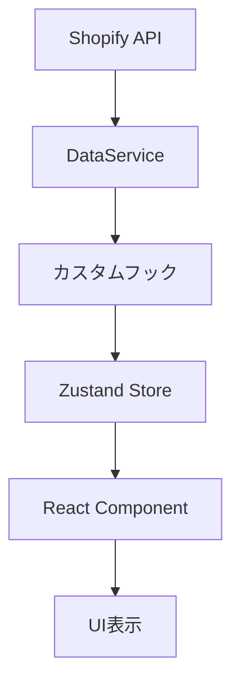

# 📱 画面設計仕様書

## 📋 目次

1. [画面設計概要](#画面設計概要)
2. [共通設計方針](#共通設計方針)
3. [機能別詳細仕様](#機能別詳細仕様)
4. [技術仕様](#技術仕様)

---

## 🎯 画面設計概要（2025年6月16日更新）

### 🚀 **初期リリース対象画面（4機能）** - 2025年8月末リリース

| No | カテゴリ | 画面名 | 実装状況 | リリース優先度 | 主要機能 |
|---|---|---|---|---|---|
| 1 | 商品分析 | **前年同月比【商品】** | ✅ 完了 | 🔴 **Tier 1** | 商品別売上の前年比較・トレンド分析 |
| 6 | 購買分析 | **F階層傾向【購買】** | ✅ 完了 | 🔴 **Tier 1** | 購入頻度による顧客階層分析 |
| 8 | 顧客分析 | **休眠顧客【顧客】** | ✅ 完了 | 🔴 **Tier 1** | 休眠顧客分類・復帰施策管理 |
| 3 | 商品分析 | **組み合わせ商品【商品】** | ✅ 完了 | 🔴 **Tier 2** | マーケットバスケット分析 |

### 📋 **Phase 2以降リリース予定画面（4機能）**

| No | カテゴリ | 画面名 | 実装状況 | リリース予定 | 主要機能 |
|---|---|---|---|---|---|
| 2 | 商品分析 | 購入頻度【商品】 | ✅ 完了 | Phase 2 (2025年Q4) | 商品別リピート購入パターン分析 |
| 4 | 購買分析 | 月別売上統計【購買】 | ✅ 完了 | Phase 2 (2025年Q4) | 商品×月別売上推移分析 |
| 5 | 購買分析 | 購入回数【購買】 | ✅ 完了 | Phase 3 (2026年Q1) | 顧客の購入回数別セグメント分析 |
| 7 | 顧客分析 | 顧客購買【顧客】 | ✅ 完了 | Phase 3 (2026年Q1) | 顧客別詳細購買プロファイル |

### 画面構成

```
📱 アプリケーション
├── 🏠 ダッシュボード（未実装）
├── 📊 売上分析
│   ├── 前年同月比【商品】
│   ├── 購入頻度【商品】
│   ├── 組み合わせ商品【商品】
│   └── 月別売上統計【購買】
├── 👥 顧客分析
│   ├── 購入回数【購買】
│   ├── F階層傾向【購買】
│   ├── 顧客購買【顧客】
│   └── 休眠顧客【顧客】
└── 🤖 AIインサイト（未実装）
```

---

## 🎨 共通設計方針

### UI/UX設計原則
- **一貫性**: 全画面で統一されたデザイン言語
- **レスポンシブ**: スマートフォン・タブレット・デスクトップ対応
- **アクセシビリティ**: WCAG準拠、キーボードナビゲーション対応
- **型安全性**: TypeScript厳密モードでの型チェック

### 共通コンポーネント
- **UI部品**: `src/components/ui/` に集約（shadcn/ui ベース）
- **レイアウト**: `AnalyticsPageLayout` で統一
- **データ表示**: `KPICard`, `DataTable`, `Chart` コンポーネント
- **状態管理**: Zustand + カスタムフック

### 技術スタック
- **フレームワーク**: Next.js 15.2.4 + React 19
- **スタイリング**: Tailwind CSS + shadcn/ui
- **チャート**: Recharts
- **アイコン**: Lucide React
- **状態管理**: Zustand

---

## 📊 機能別詳細仕様

### 1. 前年同月比【商品】

#### 📍 目的・価値
- **目的**: 商品別の売上トレンドを前年と比較し、成長・低下商品を特定
- **顧客価値**: 売上低下商品の早期発見、成長商品の特定、在庫計画の最適化

#### 🖥️ 画面構成
- **ファイル**: `src/app/sales/year-over-year/page.tsx`
- **コンポーネント**: `YearOverYearDashboard.tsx`

#### 🔧 主要機能
- 商品別売上グラフ（前年/今年、棒グラフ・折れ線グラフ）
- 商品リスト・フィルタ（カテゴリ、売上順、検索）
- 詳細モーダル（商品ごとの売上推移・前年比較）
- KPIカード（前年比率、成長率上位/下位商品数）
- アラート表示（売上低下商品）

#### ✨ 改善提案
- **アラート機能**: 前年比-20%以下で自動通知
- **トレンド予測**: 来月・今期の売上予測グラフ
- **要因分析**: 売上変動の要因可視化

---

### 2. 購入頻度【商品】

#### 📍 目的・価値
- **目的**: 商品別のリピート購入パターンを分析し、リピート率の高い商品や定番化候補を特定
- **顧客価値**: リピート率の高い商品特定、サンプル品同梱候補発見、LTV向上施策立案

#### 🖥️ 画面構成
- **ファイル**: `src/app/purchase/frequency-detail/page.tsx`
- **コンポーネント**: `PurchaseFrequencyDashboard.tsx`

#### 🔧 主要機能
- 商品別購入回数分布グラフ（ヒストグラム・棒グラフ）
- リピート率ランキングテーブル
- フィルタ（期間、カテゴリ、回数帯）
- KPIカード（リピート率上位商品数、平均リピート率等）
- 詳細モーダル（商品ごとのリピート推移・コホート分析）

#### ✨ 改善提案
- **コホート分析**: 初回購入時期別のリピート推移
- **離脱予測**: リピート停止リスクの高い商品特定
- **LTV予測**: 商品別の顧客生涯価値算出

---

### 3. 組み合わせ商品【商品】

#### 📍 目的・価値
- **目的**: 一緒に購入される商品の組み合わせを分析し、クロスセルやセット販売の機会を発見
- **顧客価値**: セット販売による客単価向上、レコメンデーション精度向上

#### 🖥️ 画面構成
- **ファイル**: `src/app/sales/market-basket/page.tsx`
- **コンポーネント**: `MarketBasketDashboard.tsx`

#### 🔧 主要機能
- 組み合わせ商品ランキング（テーブル・グラフ）
- 組み合わせネットワーク図（ノードリンクチャート等）
- フィルタ（期間、カテゴリ、最小支持度、除外商品）
- KPIカード（組み合わせ数、リフト値上位組み合わせ等）

#### ✨ 改善提案
- **リフト値表示**: 組み合わせの相関強度可視化
- **売上シミュレーション**: セット販売時の売上予測
- **AIレコメンド連携**: 機械学習による組み合わせ最適化

---

### 4. 月別売上統計【購買】

#### 📍 目的・価値
- **目的**: 商品別×月別の売上推移を数量・金額で把握し、季節トレンドや在庫・仕入計画の最適化
- **顧客価値**: 商品別の季節トレンド把握、仕入れ・在庫計画の最適化

#### 🖥️ 画面構成
- **ファイル**: `src/app/sales/monthly-stats/page.tsx`
- **コンポーネント**: `MonthlyStatsDashboard.tsx`

#### 🔧 主要機能
- 月別売上推移グラフ（商品別・金額/数量切替、棒グラフ・折れ線グラフ）
- 商品リスト・フィルタ（カテゴリ、売上順、検索）
- KPIカード（季節指数、売上上位商品数等）
- 詳細モーダル（商品ごとの月別推移・前年比較）

#### ✨ 改善提案
- **季節指数算出**: 月別の季節変動係数の自動計算
- **在庫回転率表示**: 売上と在庫の連動分析
- **ABC分析統合**: 重要商品の自動ハイライト

---

### 5. 購入回数【購買】

#### 📍 目的・価値
- **目的**: 顧客の購入回数別セグメント分析と前年比較により、リピーター転換率やLTV向上施策の効果把握
- **顧客価値**: 新規→リピーターへの転換率把握、ロイヤルカスタマーの特定と育成

#### 🖥️ 画面構成
- **ファイル**: `src/app/sales/purchase-frequency/page.tsx`
- **コンポーネント**: `PurchaseFrequencyDashboard.tsx`

#### 🔧 主要機能
- 購入回数分布グラフ（ヒストグラム・棒グラフ）
- セグメント別KPIカード（新規/リピーター/ロイヤル等）
- 購入回数別リスト・テーブル
- フィルタ（期間、会員/非会員、B2B/B2C等）

#### ✨ 改善提案
- **転換率分析**: 各段階での離脱率と改善ポイント
- **CLV予測**: 購入回数別の将来価値予測
- **セグメント別施策提案**: AIによる最適施策レコメンド

---

### 6. F階層傾向【購買】

#### 📍 目的・価値
- **目的**: 購入頻度による顧客階層の時系列変化を分析し、ロイヤリティ推移やリテンション施策の効果を可視化
- **顧客価値**: 顧客ロイヤリティの時系列変化把握、リテンション施策の効果測定

#### 🖥️ 画面構成
- **ファイル**: `src/app/purchase/f-tier-trend/page.tsx`
- **コンポーネント**: `FTierTrendDashboard.tsx`

#### 🔧 主要機能
- F階層分布グラフ（時系列・ヒートマップ・棒グラフ）
- 階層移動チャート（サンキー図・遷移マトリクス）
- KPIカード（階層別人数・売上・移動率等）
- フィルタ（期間、階層定義、顧客属性等）

#### ✨ 改善提案
- **階層移動分析**: F階層間の顧客流動の可視化
- **離脱アラート**: F階層ダウングレードの自動検知
- **施策効果測定**: F階層改善と施策の相関分析

---

### 7. 顧客購買【顧客】

#### 📍 目的・価値
- **目的**: 顧客別の詳細な購買プロファイルを分析し、VIP顧客の特定やパーソナライズ施策に活用
- **顧客価値**: VIP顧客への個別アプローチ、顧客別の嗜好把握によるパーソナライズ

#### 🖥️ 画面構成
- **ファイル**: `src/app/customers/profile/[id]/page.tsx`
- **コンポーネント**: `CustomerProfileDashboard.tsx`

#### 🔧 主要機能
- 顧客リスト・検索・フィルタ（ランク、属性、購入傾向等）
- 顧客詳細モーダル（購買履歴、最終購買商品、推奨アクション）
- KPIカード（LTV、購入回数、最終購入日等）
- 顧客メモ・タグ機能

#### ✨ 改善提案
- **顧客スコアリング**: 購買力・ロイヤリティの総合評価
- **ネクストベストアクション**: AIによる最適施策提案
- **顧客カルテ機能**: 接触履歴・メモの一元管理

---

### 8. 休眠顧客【顧客】

#### 📍 目的・価値
- **目的**: 最終購入からの経過期間別に顧客を分類・管理し、解約リスクの早期発見や復帰施策の最適タイミング把握
- **顧客価値**: 解約リスク顧客の早期発見と対策、復帰施策の最適タイミング把握

#### 🖥️ 画面構成
- **ファイル**: `src/app/customers/dormant/page.tsx`
- **コンポーネント**: `DormantCustomersDashboard.tsx`

#### 🔧 主要機能
- 休眠顧客リスト・フィルタ（経過期間、属性、購買傾向等）
- 休眠理由分布グラフ
- KPIカード（休眠率、平均休眠期間、復帰率、損失額、回復売上等）
- 復帰インサイト・推奨アクション表示

#### ✨ 改善提案
- **休眠リスクスコア**: 多変量解析による離脱予測
- **復帰率分析**: 施策別の顧客復帰効果測定
- **自動アクション**: 休眠期間に応じた自動施策実行

---

## 🛠️ 技術仕様

### ファイル構成
```
src/
├── app/                    # Next.js App Router
│   ├── sales/             # 売上分析画面
│   ├── customers/         # 顧客分析画面
│   └── purchase/          # 購買分析画面
├── components/
│   ├── dashboards/        # 機能別ダッシュボード
│   │   ├── sales/        # 売上分析サブコンポーネント
│   │   ├── customers/    # 顧客分析サブコンポーネント
│   │   └── dormant/      # 休眠顧客サブコンポーネント
│   ├── ui/               # 共通UIコンポーネント
│   ├── layout/           # レイアウトコンポーネント
│   └── common/           # 共通コンポーネント
└── lib/                  # ユーティリティ・データサービス
```

### 共通UI部品
| コンポーネント | 用途 | 実装状況 |
|---|---|---|
| `KPICard` | 指標表示カード | ✅ 実装済み |
| `AnalyticsPageLayout` | 分析画面共通レイアウト | ✅ 実装済み |
| `DataTable` | データテーブル | ✅ 実装済み |
| `FilterBar` | フィルター操作バー | 🔄 部分実装 |
| `LoadingState` | ローディング状態 | ✅ 実装済み |
| `EmptyState` | 空状態表示 | ✅ 実装済み |

### データフロー


### 状態管理パターン
```typescript
// Zustand ストア例
interface AnalyticsStore {
  // 状態
  selectedPeriod: DateRange;
  selectedFilters: FilterOptions;
  isLoading: boolean;
  
  // アクション
  setPeriod: (period: DateRange) => void;
  setFilters: (filters: FilterOptions) => void;
  refreshData: () => Promise<void>;
}
```

---

## 📈 今後の拡張計画

### 未実装画面
1. **統合ダッシュボード**: 全機能の重要指標を1画面で表示
2. **AIインサイト画面**: 自動分析・推奨施策の表示
3. **レポート機能**: 分析結果のPDF/Excel出力
4. **設定画面**: フィルター設定・アラート設定の管理

### 機能強化計画
1. **リアルタイム更新**: WebSocketを使った自動データ更新
2. **カスタムダッシュボード**: ユーザーが自由に画面をカスタマイズ
3. **モバイルアプリ**: React Nativeによるモバイル対応
4. **多言語対応**: i18nによる国際化

---

*最終更新: 2025年6月16日（統合版）*
*作成者: AI Assistant*
*次回レビュー: 月次* 