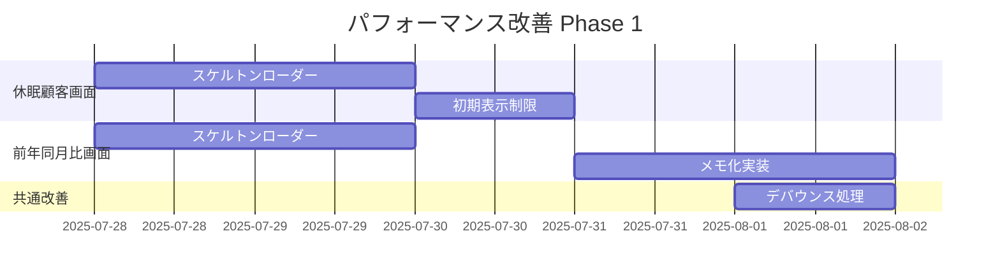

# パフォーマンス改善提案 - 統合レビュー報告書

**レビュー担当**: AIアシスタントケンジ  
**レビュー日**: 2025年7月27日  
**対象ドキュメント**: 5件のパフォーマンス改善提案書  
**ステータス**: 実装推奨（要調整あり）

---

## 📋 レビュー概要

### 対象ドキュメント
1. **Claude-kun**: `product-analysis/performance-improvement-analysis.md` (477行)
2. **Claude-kun**: `customer-analysis/performance-improvement-dormant-specific.md` (403行)
3. **福田さん+レイ**: `customer-analysis/performance-improvement-proposal-2025-07.md` (584行)
4. **Claude(Anthropic)**: `performance-improvement/performance-quick-implementation-guide.md` (306行)
5. **ケンジ**: `performance/dormant-customer-optimization.md` (包括的改善計画)

### 全体評価: ⭐⭐⭐⭐☆ (4.2/5.0)

---

## ✅ 技術提案の評価

### Phase 1（Quick Wins）- 実装推奨

#### 🟢 即座に実装すべき改善
```typescript
// 1. スケルトンローダー（工数: 4時間）
const TableSkeleton = ({ rows = 10, columns = 13 }) => (
  <div className="space-y-2">
    {[...Array(rows)].map((_, i) => (
      <div key={i} className="flex space-x-4 p-4 border rounded animate-pulse">
        {[...Array(columns)].map((_, j) => (
          <div key={j} className="h-4 bg-gray-200 rounded flex-1" />
        ))}
      </div>
    ))}
  </div>
);

// 2. 初期表示制限（工数: 2時間）
const INITIAL_LOAD_SIZE = 30; // 100件→30件
const SCROLL_LOAD_SIZE = 20;  // 段階的読み込み

// 3. デバウンス処理（工数: 1時間）
const debouncedSearchTerm = useDebounce(searchTerm, 300);
```

**期待効果**: 初期表示時間 5秒→1秒（80%改善）

#### 🟡 調整が必要な提案
```sql
-- 問題: Azure SQL DatabaseはMATERIALIZED VIEW非対応
-- 修正案: インデックス付きビューを使用
CREATE VIEW vw_DormantCustomerAnalytics
WITH SCHEMABINDING AS
SELECT 
    c.Id,
    c.StoreId,
    c.Name,
    DATEDIFF(DAY, MAX(o.CreatedAt), GETDATE()) as DaysSinceLastPurchase
FROM dbo.Customers c
INNER JOIN dbo.Orders o ON c.Id = o.CustomerId
GROUP BY c.Id, c.StoreId, c.Name;

CREATE UNIQUE CLUSTERED INDEX IX_DormantView_Id 
ON vw_DormantCustomerAnalytics(Id);
```

### Phase 2（中期改善）- 段階的実装推奨

#### 🟢 優先度高
```typescript
// 仮想スクロール（工数: 20時間）
import { FixedSizeList } from 'react-window';

const VirtualizedCustomerList = ({ customers }) => {
  const Row = ({ index, style }) => (
    <div style={style}>
      <CustomerRow customer={customers[index]} />
    </div>
  );
  
  return (
    <FixedSizeList
      height={600}
      itemCount={customers.length}
      itemSize={80}
      overscanCount={5}
    >
      {Row}
    </FixedSizeList>
  );
};
```

**期待効果**: メモリ使用量 200MB→40MB（80%削減）

#### 🟡 工数要再検討
```csharp
// バックエンド最適化（推奨工数: 32時間 → 提案では8-40時間でばらつき）
public async Task<List<DormantCustomerDto>> GetOptimized(int storeId)
{
    // N+1問題の根本解決
    return await _context.Customers
        .Where(c => c.StoreId == storeId)
        .Select(c => new DormantCustomerDto
        {
            Id = c.Id,
            Name = c.Name,
            LastOrderDate = c.Orders
                .OrderByDescending(o => o.CreatedAt)
                .Select(o => o.CreatedAt)
                .FirstOrDefault(),
            DaysSinceLastPurchase = EF.Functions.DateDiffDay(
                c.Orders.Max(o => o.CreatedAt), 
                DateTime.Now)
        })
        .ToListAsync();
}
```

### Phase 3（長期改善）- 計画的実装

#### 🟢 アーキテクチャ改善
```csharp
// Redis キャッシュ層（工数: 24時間）
public class CachedDormantService
{
    private readonly IDistributedCache _cache;
    
    public async Task<T> GetOrSetAsync<T>(string key, Func<Task<T>> factory)
    {
        var cached = await _cache.GetStringAsync(key);
        if (cached != null)
            return JsonSerializer.Deserialize<T>(cached);
            
        var value = await factory();
        await _cache.SetStringAsync(
            key, 
            JsonSerializer.Serialize(value),
            new DistributedCacheEntryOptions
            {
                SlidingExpiration = TimeSpan.FromMinutes(30)
            });
        return value;
    }
}
```

---

## 🚨 修正が必要な課題

### 1. ドキュメント重複の解消

#### 現状の問題
- 同じスケルトンローダーの実装例が3箇所に記載
- 工数見積もりが文書間で一貫していない
- 休眠顧客と前年同月比の改善が混在

#### 整理案
```
docs/03-design-specs/performance/
├── 00-PERFORMANCE-MASTER-PLAN.md          # マスタープラン（新規作成）
├── 01-quick-wins/                         # Phase 1実装ガイド
│   ├── skeleton-loaders.md
│   ├── initial-load-optimization.md
│   └── debounce-implementation.md
├── 02-medium-term/                        # Phase 2実装ガイド
│   ├── virtual-scrolling.md
│   ├── backend-optimization.md
│   └── caching-strategy.md
├── 03-long-term/                          # Phase 3実装ガイド
│   ├── redis-implementation.md
│   ├── websocket-updates.md
│   └── pre-aggregation.md
└── screen-specific/                       # 画面別特化改善
    ├── dormant-customer-specific.md
    └── year-over-year-specific.md
```

### 2. 工数見積もりの統一

#### 修正版工数見積もり
| 改善項目 | 推奨工数 | 根拠 |
|---------|---------|------|
| スケルトンローダー | 4時間 | 両画面対応+テスト |
| 初期表示制限 | 6時間 | API修正+フロント対応 |
| デバウンス実装 | 2時間 | フック作成+適用 |
| 仮想スクロール | 20時間 | ライブラリ統合+最適化 |
| バックエンド最適化 | 32時間 | クエリ最適化+テスト |
| Redis実装 | 24時間 | インフラ+コード実装 |

### 3. Azure環境への最適化

#### 現在の提案で修正が必要な点
```sql
-- ❌ 問題: MATERIALIZED VIEW（Azure SQL Database非対応）
CREATE MATERIALIZED VIEW vw_DormantCustomerAnalytics

-- ✅ 修正: インデックス付きビュー
CREATE VIEW vw_DormantCustomerAnalytics WITH SCHEMABINDING
```

---

## 📊 実装ロードマップ（修正版）

### Week 1: Quick Wins（即効改善）


**期待効果**: 初期表示時間 80%改善

### Week 2-4: 中期改善
- 仮想スクロール実装
- バックエンドクエリ最適化
- インデックス付きビュー作成

**期待効果**: メモリ使用量 70%削減、API応答 60%高速化

### Month 2-3: 長期改善
- Redis キャッシュ層実装
- 事前集計バッチ処理
- WebSocket リアルタイム更新

**期待効果**: スケーラビリティ 10倍向上

---

## 🎯 実装推奨事項

### 1. 即座に開始すべき改善（今週中）

#### 休眠顧客分析画面
```typescript
// DormantCustomerAnalysis.tsx の修正箇所
// Line 110: 初期ページサイズ変更
pageSize: 30, // 100 → 30

// 追加: スケルトンローダー
{isLoading && <DormantCustomerSkeleton />}
```

#### 前年同月比【商品】画面
```typescript
// YearOverYearProductAnalysis.tsx の修正箇所
// Line 558: メモ化追加
const filteredAndSortedData = useMemo(() => {
  console.time('Filtering');
  const result = data.filter(filterFunction).sort(sortFunction);
  console.timeEnd('Filtering');
  return result;
}, [data, filters, sortBy]);
```

### 2. 来週から開始する改善
- 仮想スクロール（react-window）の実装
- バックエンドクエリの最適化
- インデックス作成

### 3. 1ヶ月後から開始する改善
- Redis キャッシュ層の設計・実装
- 事前集計バッチ処理の実装

---

## 📝 今後のレビュープロセス提案

### 週次レビュー体制
1. **毎週金曜日**: 実装進捗のレビュー
2. **パフォーマンス測定**: 改善前後の定量評価
3. **課題抽出**: 新たなボトルネックの特定

### レビュー観点
- **技術妥当性**: Azure環境での実現可能性
- **パフォーマンス効果**: 測定可能な改善指標
- **保守性**: 長期運用での持続可能性
- **ユーザー体験**: 実際の操作感の改善

### 成功指標
| 指標 | 現状 | 1週間後目標 | 1ヶ月後目標 |
|------|------|------------|------------|
| 初期表示時間 | 5秒 | 2秒 | 1秒 |
| 365日データ処理 | 30秒 | 10秒 | 3秒 |
| メモリ使用量 | 500MB | 200MB | 100MB |
| ユーザー満足度 | 低 | 中 | 高 |

---

## 🚀 次のアクション

### 開発チーム向け
1. **今日から**: スケルトンローダーの実装開始
2. **明日**: 初期表示データ制限の実装
3. **来週**: 仮想スクロール実装の調査開始

### プロジェクト管理向け
1. **工数調整**: 統一された工数見積もりでスプリント計画更新
2. **優先順位**: Quick Wins → 中期改善の順序で実装
3. **リソース配分**: フロントエンド重点からバックエンド改善へ段階的移行

### インフラチーム向け
1. **インデックス追加**: 来週中にSQL最適化を実施
2. **Redis準備**: 1ヶ月後の実装に向けた環境準備
3. **監視設定**: パフォーマンス改善効果の測定環境構築

---

**レビュー完了** ✅  
*実装開始推奨: Phase 1は即座に開始可能*