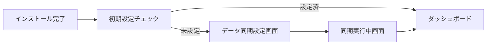

# EC Ranger 初期設定画面 設計書

作成日: 2025年8月5日  
作成者: Kenji（AI開発チーム）

## 概要
インストール直後にユーザーが最初に見る初期設定画面の実装仕様です。8月5日は最小限の実装（MVP）で進めます。

## 画面フロー



## 8月5日実装範囲（MVP）

### 1. データ同期設定画面

#### URL
`/setup/initial`

#### レイアウト
```
+--------------------------------------------------+
|                  EC Ranger                       |
+--------------------------------------------------+
|                                                  |
|    初期設定 - データ同期                          |
|                                                  |
|    分析を開始するために、過去のデータを           |
|    取得する必要があります。                       |
|                                                  |
|    データ取得期間を選択してください：             |
|                                                  |
|    ○ 過去3ヶ月（推奨）                          |
|    ○ 過去6ヶ月                                 |
|    ○ 過去1年                                   |
|    ○ 全期間                                    |
|                                                  |
|    [同期を開始] [スキップ]                      |
|                                                  |
+--------------------------------------------------+
```

#### 機能仕様
- デフォルト選択: 過去3ヶ月
- スキップボタン: 後で設定可能（ただし警告表示）
- 同期開始ボタン: 選択した期間でデータ同期を開始

### 2. 同期実行中画面

#### URL
`/setup/syncing`

#### レイアウト
```
+--------------------------------------------------+
|                  EC Ranger                       |
+--------------------------------------------------+
|                                                  |
|    データ同期中...                               |
|                                                  |
|    [====================          ] 60%         |
|                                                  |
|    取得中: 注文データ (300/500件)                |
|                                                  |
|    予想残り時間: 約2分                           |
|                                                  |
|    [バックグラウンドで続行]                      |
|                                                  |
+--------------------------------------------------+
```

#### 機能仕様
- リアルタイム進捗更新（WebSocketまたはポーリング）
- バックグラウンド続行でダッシュボードへ遷移可能
- エラー時は再試行ボタン表示

## データベース設計

### 新規テーブル: SyncStatus

```sql
CREATE TABLE SyncStatus (
    Id INT PRIMARY KEY IDENTITY,
    StoreId NVARCHAR(255) NOT NULL,
    SyncType NVARCHAR(50) NOT NULL, -- 'initial', 'manual', 'scheduled'
    Status NVARCHAR(50) NOT NULL, -- 'pending', 'running', 'completed', 'failed'
    StartDate DATETIME NOT NULL,
    EndDate DATETIME,
    TotalRecords INT,
    ProcessedRecords INT,
    ErrorMessage NVARCHAR(MAX),
    CreatedAt DATETIME DEFAULT GETDATE(),
    UpdatedAt DATETIME DEFAULT GETDATE()
);
```

### Storesテーブル追加カラム

```sql
ALTER TABLE Stores ADD InitialSetupCompleted BIT DEFAULT 0;
ALTER TABLE Stores ADD LastSyncDate DATETIME;
```

## API仕様

### 1. POST /api/sync/initial
初期データ同期を開始

**Request:**
```json
{
  "syncPeriod": "3months" // "3months", "6months", "1year", "all"
}
```

**Response:**
```json
{
  "syncId": "123",
  "status": "started"
}
```

### 2. GET /api/sync/status/{syncId}
同期状態を取得

**Response:**
```json
{
  "syncId": "123",
  "status": "running",
  "progress": {
    "total": 500,
    "processed": 300,
    "percentage": 60
  },
  "currentTask": "注文データ取得中",
  "estimatedTimeRemaining": 120 // 秒
}
```

### 3. GET /api/setup/status
初期設定の完了状態を確認

**Response:**
```json
{
  "initialSetupCompleted": false,
  "lastSyncDate": null
}
```

---

# Yukiさんへの作業指示

## 優先度: 高
## 推定時間: 3時間

### 実装タスク

#### 1. 初期設定チェックロジック（30分）
- アプリ起動時に `/api/setup/status` を呼び出し
- 未設定の場合は `/setup/initial` へリダイレクト

#### 2. データ同期設定画面（1時間）
- `/setup/initial` ページの実装
- ラジオボタンでの期間選択
- 同期開始ボタンのクリックで API 呼び出し

#### 3. 同期実行中画面（1時間）
- `/setup/syncing` ページの実装
- 5秒ごとに `/api/sync/status/{syncId}` をポーリング
- プログレスバーの更新
- 完了時は自動でダッシュボードへ遷移

#### 4. エラーハンドリング（30分）
- API エラー時のメッセージ表示
- 再試行ボタンの実装

### 実装ファイル
- `frontend/src/pages/setup/initial.tsx`（新規）
- `frontend/src/pages/setup/syncing.tsx`（新規）
- `frontend/src/components/Layout.tsx`（修正：初期設定チェック追加）
- `frontend/src/services/syncService.ts`（新規）

### 注意事項
- EC Rangerブランドを明確に表示
- モバイル対応は不要（デスクトップのみ）
- シンプルで分かりやすいUIを心がける

---

# Takashiさんへの作業指示

## 優先度: 高
## 推定時間: 2.5時間

### 実装タスク

#### 1. データベース更新（30分）
- SyncStatusテーブルの作成
- Storesテーブルへのカラム追加
- マイグレーションスクリプト作成

#### 2. API実装（1.5時間）

**SyncController.cs（新規作成）**
```csharp
[ApiController]
[Route("api/sync")]
public class SyncController : ControllerBase
{
    [HttpPost("initial")]
    public async Task<IActionResult> StartInitialSync([FromBody] InitialSyncRequest request)
    
    [HttpGet("status/{syncId}")]
    public async Task<IActionResult> GetSyncStatus(string syncId)
}
```

**SetupController.cs（新規作成）**
```csharp
[ApiController]
[Route("api/setup")]
public class SetupController : ControllerBase
{
    [HttpGet("status")]
    public async Task<IActionResult> GetSetupStatus()
}
```

#### 3. バックグラウンドサービス実装（30分）
- 既存の`ShopifyDataSyncService`を拡張
- 期間指定でのデータ取得機能追加
- 進捗更新ロジック追加

### 実装ポイント
- Shopify API のレート制限を考慮（2リクエスト/秒）
- バッチ処理で効率化（250件ずつ取得）
- エラー時は自動リトライ（最大3回）

### テストケース
1. 各期間でのデータ取得が正しく動作すること
2. 進捗が正しく更新されること
3. エラー時に適切にハンドリングされること

---

## タイムライン

### 9:00-10:00
- Takashi: データベース更新とAPI基本実装
- Yuki: 初期設定チェックロジック実装

### 10:00-11:00
- Takashi: バックグラウンドサービス実装
- Yuki: データ同期設定画面実装

### 11:00-12:00
- Takashi: API完成とテスト
- Yuki: 同期実行中画面実装

### 13:00-14:00
- 結合テスト
- バグ修正

## 成功基準
1. インストール後に初期設定画面が表示される
2. データ同期が選択した期間で実行される
3. 進捗がリアルタイムで表示される
4. 同期完了後にダッシュボードへ遷移する