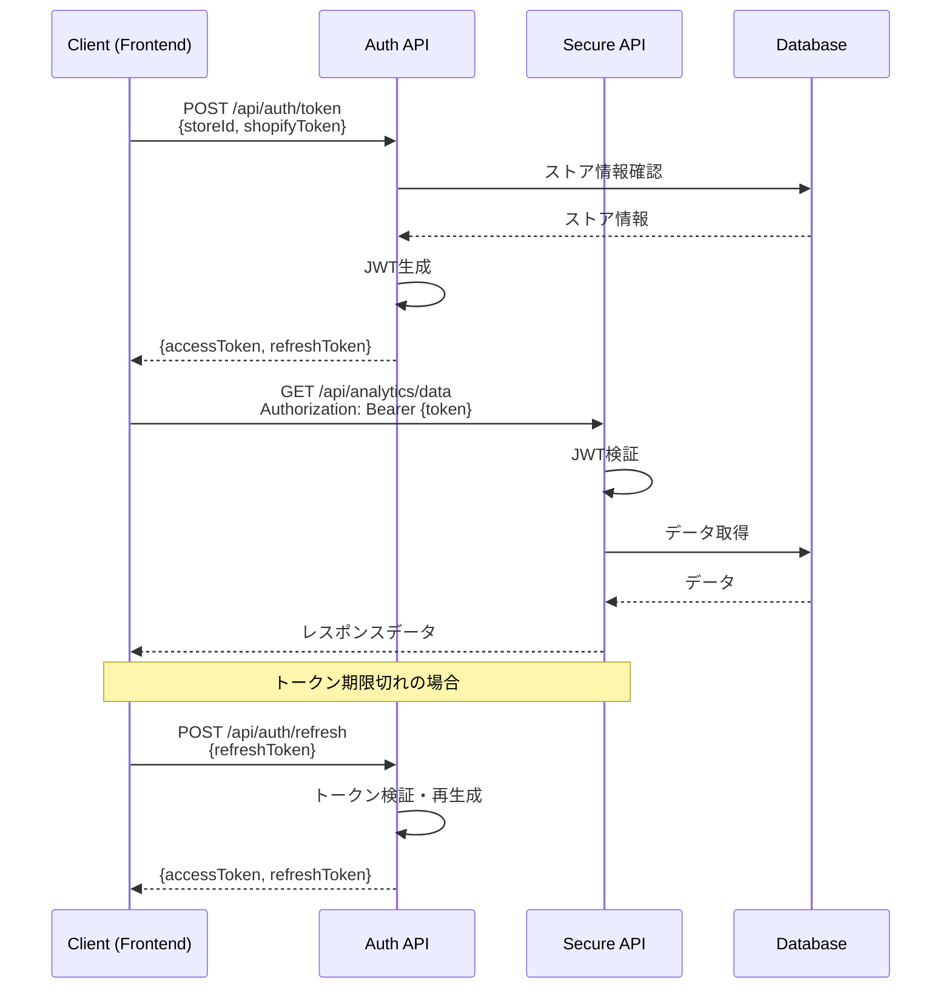

# JWT認証実装ガイド

**作成日**: 2025年7月28日  
**作成者**: ケンジ  
**対象**: 開発チーム

## 1. 概要

Shopify AI Marketing Suiteでは、JWT（JSON Web Token）を使用してAPIの認証を行います。
すべてのAPIエンドポイント（認証とヘルスチェックを除く）は認証が必要です。

## 2. 認証フロー



## 3. 実装詳細

### 3.1 トークン生成（Backend）

```csharp
// ITokenService
public interface ITokenService
{
    string GenerateAccessToken(int storeId, string shopDomain);
    string GenerateRefreshToken(int storeId);
    TokenValidationResult ValidateToken(string token);
}

// TokenService実装
public class TokenService : ITokenService
{
    private readonly IConfiguration _configuration;
    
    public string GenerateAccessToken(int storeId, string shopDomain)
    {
        var tokenHandler = new JwtSecurityTokenHandler();
        var key = Encoding.ASCII.GetBytes(_configuration["Jwt:Key"]);
        var tokenDescriptor = new SecurityTokenDescriptor
        {
            Subject = new ClaimsIdentity(new[]
            {
                new Claim("storeId", storeId.ToString()),
                new Claim("shopDomain", shopDomain),
                new Claim(ClaimTypes.Name, shopDomain)
            }),
            Expires = DateTime.UtcNow.AddMinutes(
                Convert.ToDouble(_configuration["Jwt:ExpiryMinutes"])),
            Issuer = _configuration["Jwt:Issuer"],
            Audience = _configuration["Jwt:Audience"],
            SigningCredentials = new SigningCredentials(
                new SymmetricSecurityKey(key), 
                SecurityAlgorithms.HmacSha256Signature)
        };
        
        var token = tokenHandler.CreateToken(tokenDescriptor);
        return tokenHandler.WriteToken(token);
    }
}
```

### 3.2 認証ミドルウェア設定

```csharp
// Program.cs
builder.Services.AddAuthentication(JwtBearerDefaults.AuthenticationScheme)
    .AddJwtBearer(options =>
    {
        options.TokenValidationParameters = new TokenValidationParameters
        {
            ValidateIssuer = true,
            ValidateAudience = true,
            ValidateLifetime = true,
            ValidateIssuerSigningKey = true,
            ValidIssuer = configuration["Jwt:Issuer"],
            ValidAudience = configuration["Jwt:Audience"],
            IssuerSigningKey = new SymmetricSecurityKey(
                Encoding.UTF8.GetBytes(configuration["Jwt:Key"])),
            ClockSkew = TimeSpan.Zero
        };
    });

// Rate Limiting
builder.Services.AddRateLimiter(options =>
{
    options.GlobalLimiter = PartitionedRateLimiter.Create<HttpContext, string>(
        httpContext => RateLimitPartition.GetFixedWindowLimiter(
            partitionKey: httpContext.User?.Identity?.Name ?? "anonymous",
            factory: partition => new FixedWindowRateLimiterOptions
            {
                AutoReplenishment = true,
                PermitLimit = 100,
                Window = TimeSpan.FromMinutes(1)
            }));
});
```

### 3.3 APIコントローラーの保護

```csharp
[ApiController]
[Route("api/[controller]")]
[Authorize] // 認証必須
public class AnalyticsController : ControllerBase
{
    [HttpGet("year-over-year")]
    public async Task<IActionResult> GetYearOverYear()
    {
        // ClaimからstoreIdを取得
        var storeId = int.Parse(User.FindFirst("storeId")?.Value ?? "0");
        
        // storeIdに基づいてデータを取得
        var data = await _service.GetDataForStore(storeId);
        
        return Ok(data);
    }
}
```

## 4. フロントエンド実装

### 4.1 APIクライアント

```typescript
// lib/api-client.ts
export class ApiClient {
  private accessToken: string | null = null;
  private refreshToken: string | null = null;
  
  constructor() {
    // LocalStorageからトークンを復元
    this.accessToken = localStorage.getItem('accessToken');
    this.refreshToken = localStorage.getItem('refreshToken');
  }
  
  async authenticate(storeId: number, shopifyToken: string) {
    const response = await fetch('/api/auth/token', {
      method: 'POST',
      headers: { 'Content-Type': 'application/json' },
      body: JSON.stringify({ storeId, shopifyToken })
    });
    
    if (!response.ok) {
      throw new Error('Authentication failed');
    }
    
    const tokens = await response.json();
    this.setTokens(tokens);
    return tokens;
  }
  
  private setTokens({ accessToken, refreshToken }: TokenResponse) {
    this.accessToken = accessToken;
    this.refreshToken = refreshToken;
    localStorage.setItem('accessToken', accessToken);
    localStorage.setItem('refreshToken', refreshToken);
  }
  
  async request(endpoint: string, options: RequestInit = {}) {
    const headers = {
      ...options.headers,
      'Authorization': `Bearer ${this.accessToken}`,
      'Content-Type': 'application/json'
    };
    
    let response = await fetch(endpoint, { ...options, headers });
    
    // トークン期限切れの場合、自動更新
    if (response.status === 401 && this.refreshToken) {
      await this.refreshAccessToken();
      
      // リトライ
      response = await fetch(endpoint, {
        ...options,
        headers: {
          ...headers,
          'Authorization': `Bearer ${this.accessToken}`
        }
      });
    }
    
    return response;
  }
  
  private async refreshAccessToken() {
    const response = await fetch('/api/auth/refresh', {
      method: 'POST',
      headers: { 'Content-Type': 'application/json' },
      body: JSON.stringify({ refreshToken: this.refreshToken })
    });
    
    if (!response.ok) {
      // リフレッシュ失敗時は再ログインが必要
      this.clearTokens();
      throw new Error('Session expired. Please login again.');
    }
    
    const tokens = await response.json();
    this.setTokens(tokens);
  }
  
  clearTokens() {
    this.accessToken = null;
    this.refreshToken = null;
    localStorage.removeItem('accessToken');
    localStorage.removeItem('refreshToken');
  }
}
```

### 4.2 使用例

```typescript
// components/YearOverYearAnalysis.tsx
import { apiClient } from '@/lib/api-client';

export function YearOverYearAnalysis() {
  const [data, setData] = useState(null);
  const [error, setError] = useState(null);
  
  useEffect(() => {
    async function fetchData() {
      try {
        const response = await apiClient.request('/api/analytics/year-over-year');
        
        if (!response.ok) {
          throw new Error('Failed to fetch data');
        }
        
        const data = await response.json();
        setData(data);
      } catch (err) {
        setError(err.message);
      }
    }
    
    fetchData();
  }, []);
  
  // ...
}
```

## 5. セキュリティ設定

### 5.1 環境変数（appsettings.json）

```json
{
  "Jwt": {
    "Key": "your-256-bit-secret-key-minimum-32-characters-long",
    "Issuer": "shopify-ai-marketing-suite",
    "Audience": "shopify-stores",
    "ExpiryMinutes": 60,
    "RefreshExpiryDays": 30
  }
}
```

### 5.2 本番環境での考慮事項

1. **JWT秘密鍵の管理**
   ```csharp
   // Azure Key Vaultから取得
   builder.Configuration.AddAzureKeyVault(
       new Uri($"https://{keyVaultName}.vault.azure.net/"),
       new DefaultAzureCredential());
   ```

2. **HTTPS強制**
   ```csharp
   app.UseHttpsRedirection();
   app.UseHsts();
   ```

3. **セキュリティヘッダー**
   ```csharp
   app.Use(async (context, next) =>
   {
       context.Response.Headers.Add("X-Content-Type-Options", "nosniff");
       context.Response.Headers.Add("X-Frame-Options", "DENY");
       context.Response.Headers.Add("X-XSS-Protection", "1; mode=block");
       await next();
   });
   ```

## 6. エラーハンドリング

### 6.1 認証エラーレスポンス

```json
// 401 Unauthorized
{
  "error": "Invalid or expired token",
  "code": "TOKEN_EXPIRED"
}

// 403 Forbidden
{
  "error": "Access denied to this resource",
  "code": "ACCESS_DENIED"
}

// 429 Too Many Requests
{
  "error": "Rate limit exceeded",
  "code": "RATE_LIMIT_EXCEEDED",
  "retryAfter": 60
}
```

### 6.2 クライアント側のエラー処理

```typescript
// エラーハンドラー
export async function handleApiError(error: any) {
  if (error.code === 'TOKEN_EXPIRED') {
    // トークン更新を試みる
    await apiClient.refreshAccessToken();
  } else if (error.code === 'ACCESS_DENIED') {
    // アクセス権限エラー
    toast.error('このリソースへのアクセス権限がありません');
  } else if (error.code === 'RATE_LIMIT_EXCEEDED') {
    // レート制限エラー
    toast.error(`リクエスト制限に達しました。${error.retryAfter}秒後に再試行してください`);
  }
}
```

## 7. テスト

### 7.1 認証フローのテスト

```bash
# 1. トークン取得
curl -X POST http://localhost:5000/api/auth/token \
  -H "Content-Type: application/json" \
  -d '{"storeId": 1, "shopifyToken": "test-token"}'

# 2. APIアクセス
curl -X GET http://localhost:5000/api/analytics/year-over-year \
  -H "Authorization: Bearer {access_token}"

# 3. トークン更新
curl -X POST http://localhost:5000/api/auth/refresh \
  -H "Content-Type: application/json" \
  -d '{"refreshToken": "{refresh_token}"}'
```

### 7.2 セキュリティテスト項目

- [ ] 認証なしでAPIアクセス → 401エラー
- [ ] 無効なトークンでアクセス → 401エラー
- [ ] 期限切れトークンでアクセス → 401エラー
- [ ] 他店のデータアクセス → 403エラー
- [ ] Rate limit超過 → 429エラー
- [ ] トークン自動更新の動作確認

## 8. トラブルシューティング

### よくある問題

1. **"Invalid token" エラー**
   - JWT秘密鍵が一致しているか確認
   - トークンの有効期限を確認
   - Issuer/Audienceの設定を確認

2. **CORS エラー**
   - Program.csでCORS設定を確認
   - フロントエンドのURLが許可リストに含まれているか確認

3. **Rate limit エラー**
   - API呼び出し頻度を確認
   - 必要に応じてRate limit設定を調整

---

**更新履歴**
- 2025-07-28: 初版作成（ケンジ）