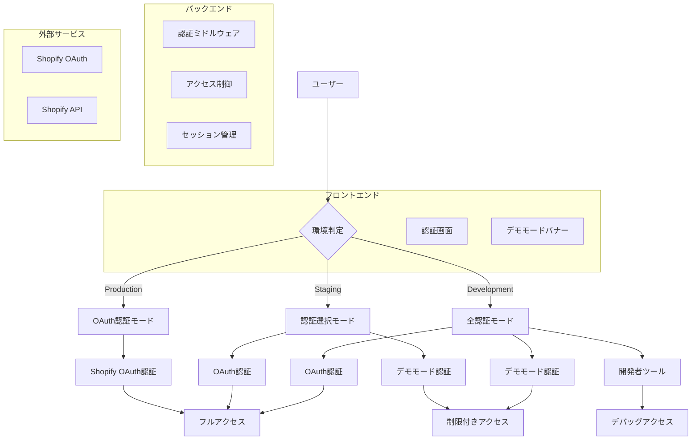
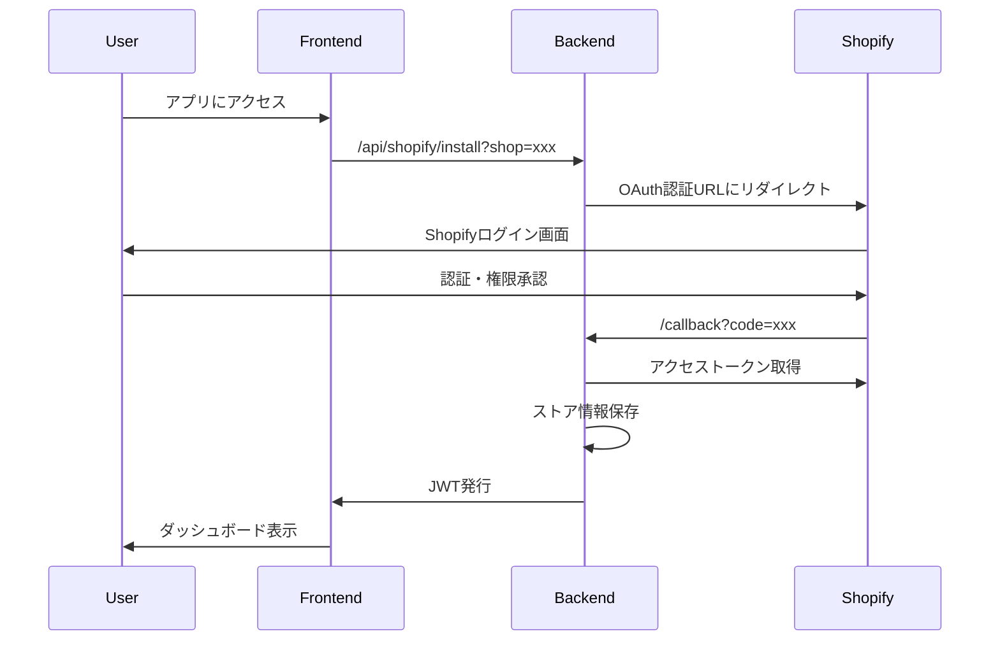
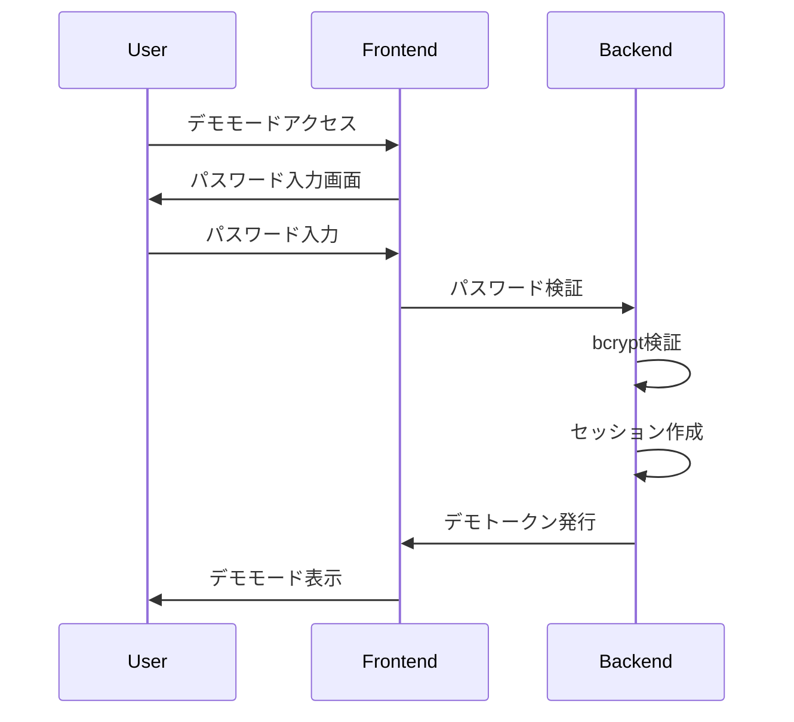

# Shopify アプリ認証モード制御機能 設計書

## 概要

環境別に認証方式を安全に切り替える「認証モード制御機能」の技術設計書です。本番環境ではShopify OAuth認証を強制し、検証・デモ環境では開発者パスワードによる限定的アクセスを許可します。

---

## 🏗️ システムアーキテクチャ

### 全体構成図



### データフロー

1. **環境判定**: `NEXT_PUBLIC_ENVIRONMENT` による環境識別
2. **認証モード選択**: 環境に応じた認証方式の選択
3. **認証処理**: 選択された認証方式での認証実行
4. **アクセス制御**: 認証結果に基づくアクセス権限の付与
5. **セッション管理**: 認証状態の維持・管理

---

## 🔧 技術仕様

### 使用技術

#### フロントエンド
- **Next.js**: 14.2.3 (App Router)
- **React**: 18.x
- **TypeScript**: 5.x
- **Tailwind CSS**: ^3.4.x

#### バックエンド
- **.NET**: 8.0
- **ASP.NET Core Web API**
- **Entity Framework Core**: 8.0.x

#### 認証・セキュリティ
- **Shopify OAuth 2.0**
- **JWT (JSON Web Tokens)**
- **Session Tokens**
- **HMAC Verification**

### 環境変数設計

#### フロントエンド環境変数

```typescript
// 環境識別
NEXT_PUBLIC_ENVIRONMENT: 'production' | 'staging' | 'development'

// 認証モード制御
NEXT_PUBLIC_AUTH_MODE: 'oauth_required' | 'demo_allowed' | 'all_allowed'

// デモモード設定
NEXT_PUBLIC_DEV_PASSWORD: string
NEXT_PUBLIC_DEMO_SESSION_TIMEOUT: number (分)

// セキュリティ設定
NEXT_PUBLIC_ENABLE_DEV_TOOLS: boolean
NEXT_PUBLIC_DEBUG_MODE: boolean
```

#### バックエンド環境変数

```csharp
// 認証設定
Authentication__Mode: "OAuthRequired" | "DemoAllowed" | "AllAllowed"
Authentication__JwtSecret: string
Authentication__JwtExpiryHours: number

// デモモード設定
Demo__PasswordHash: string (bcrypt)
Demo__SessionTimeoutHours: number
Demo__MaxSessionsPerUser: number

// セキュリティ設定
Security__RequireHttps: boolean
Security__EnableCors: boolean
Security__AllowedOrigins: string[]
```

---

## 🎨 コンポーネント設計

### フロントエンドコンポーネント

#### 1. 認証画面コンポーネント

```typescript
// AuthenticationRequired.tsx
interface AuthenticationRequiredProps {
  environment: 'production' | 'staging' | 'development'
  authMode: 'oauth_required' | 'demo_allowed' | 'all_allowed'
  hasShopParam: boolean
  onShopifyAuth: () => void
  onDemoAuth: () => void
}

const AuthenticationRequired: React.FC<AuthenticationRequiredProps> = ({
  environment,
  authMode,
  hasShopParam,
  onShopifyAuth,
  onDemoAuth
}) => {
  // 環境に応じた表示制御
  const title = environment === 'production' 
    ? 'Shopify認証が必要です' 
    : '認証が必要です'
  
  const showDemoLink = authMode !== 'oauth_required'
  
  return (
    <div className="auth-container">
      <h1>{title}</h1>
      {environment === 'production' && !hasShopParam ? (
        <ProductionGuidance />
      ) : (
        <AuthOptions 
          showOAuth={true}
          showDemo={showDemoLink}
          onShopifyAuth={onShopifyAuth}
          onDemoAuth={onDemoAuth}
        />
      )}
    </div>
  )
}
```

#### 2. デモモードバナーコンポーネント

```typescript
// DeveloperModeBanner.tsx
interface DeveloperModeBannerProps {
  sessionExpiresAt: Date
  onLogout: () => void
}

const DeveloperModeBanner: React.FC<DeveloperModeBannerProps> = ({
  sessionExpiresAt,
  onLogout
}) => {
  const [timeRemaining, setTimeRemaining] = useState<number>(0)
  
  useEffect(() => {
    const interval = setInterval(() => {
      const remaining = Math.max(0, sessionExpiresAt.getTime() - Date.now())
      setTimeRemaining(Math.floor(remaining / 60000)) // 分単位
    }, 1000)
    
    return () => clearInterval(interval)
  }, [sessionExpiresAt])
  
  return (
    <div className="demo-banner">
      <span>⚠️ 開発者ツール有効（データ閲覧専用モード）</span>
      <span>セッション残り: {timeRemaining}分</span>
      <button onClick={onLogout}>ログアウト</button>
    </div>
  )
}
```

#### 3. 認証ガードコンポーネント

```typescript
// AuthGuard.tsx
interface AuthGuardProps {
  children: React.ReactNode
  requireAuth: boolean
  allowedModes: AuthMode[]
}

const AuthGuard: React.FC<AuthGuardProps> = ({
  children,
  requireAuth,
  allowedModes
}) => {
  const [authState, setAuthState] = useState<AuthState>('checking')
  const [isDeveloperMode, setIsDeveloperMode] = useState<boolean>(false)
  
  useEffect(() => {
    const checkAuth = async () => {
      const environment = process.env.NEXT_PUBLIC_ENVIRONMENT
      const authMode = process.env.NEXT_PUBLIC_AUTH_MODE
      
      // デモモードチェック
      const demoAuth = localStorage.getItem('dev_mode_auth')
      if (demoAuth && authMode !== 'oauth_required') {
        setIsDeveloperMode(true)
        setAuthState('authenticated')
        return
      }
      
      // OAuth認証チェック
      const oauthToken = await checkOAuthToken()
      if (oauthToken) {
        setAuthState('authenticated')
        return
      }
      
      setAuthState('unauthenticated')
    }
    
    checkAuth()
  }, [])
  
  if (authState === 'checking') {
    return <LoadingSpinner />
  }
  
  if (authState === 'unauthenticated' && requireAuth) {
    return <AuthenticationRequired />
  }
  
  return (
    <>
      {isDeveloperMode && <DeveloperModeBanner />}
      {children}
    </>
  )
}
```

### バックエンドコンポーネント

#### 1. 認証ミドルウェア

```csharp
// AuthModeMiddleware.cs
public class AuthModeMiddleware
{
    private readonly RequestDelegate _next;
    private readonly IConfiguration _config;
    private readonly ILogger<AuthModeMiddleware> _logger;

    public async Task InvokeAsync(HttpContext context)
    {
        var authMode = _config["Authentication:Mode"];
        var environment = _config["Environment"];
        
        // 本番環境安全弁
        if (environment == "Production" && authMode != "OAuthRequired")
        {
            _logger.LogError("Invalid authentication mode for production environment");
            context.Response.StatusCode = 500;
            return;
        }
        
        var oauthToken = context.Request.Cookies["shopify_oauth_token"];
        var demoToken = context.Request.Cookies["demo_auth_token"];
        
        var isOAuthValid = !string.IsNullOrEmpty(oauthToken) && 
                          await ValidateOAuthTokenAsync(oauthToken);
        var isDemoValid = !string.IsNullOrEmpty(demoToken) && 
                         await ValidateDemoTokenAsync(demoToken);
        
        // 認証モード別の処理
        switch (authMode)
        {
            case "OAuthRequired":
                if (!isOAuthValid)
                {
                    context.Response.StatusCode = 401;
                    return;
                }
                break;
                
            case "DemoAllowed":
                if (!isOAuthValid && !isDemoValid)
                {
                    context.Response.StatusCode = 401;
                    return;
                }
                break;
                
            case "AllAllowed":
                // すべての認証方式を許可
                break;
        }
        
        // デモモード時の制限設定
        if (isDemoValid && !isOAuthValid)
        {
            context.Items["AuthMode"] = "Demo";
            context.Items["ShopifyApiRestricted"] = true;
        }
        
        await _next(context);
    }
}
```

#### 2. アクセス制御属性

```csharp
// RequireOAuthAttribute.cs
[AttributeUsage(AttributeTargets.Method | AttributeTargets.Class)]
public class RequireOAuthAttribute : ActionFilterAttribute
{
    public override void OnActionExecuting(ActionExecutingContext context)
    {
        var authMode = context.HttpContext.Items["AuthMode"]?.ToString();
        
        if (authMode == "Demo")
        {
            context.Result = new JsonResult(new
            {
                error = "Forbidden in demo mode",
                message = "Shopify API access is restricted in demo mode"
            })
            {
                StatusCode = 403
            };
        }
    }
}

// 使用例
[RequireOAuth]
[HttpGet("api/shopify/orders")]
public async Task<IActionResult> GetOrders()
{
    // Shopify API呼び出し
}
```

#### 3. デモ認証サービス

```csharp
// DemoAuthService.cs
public class DemoAuthService
{
    private readonly IConfiguration _config;
    private readonly IMemoryCache _cache;
    private readonly ILogger<DemoAuthService> _logger;

    public async Task<DemoAuthResult> AuthenticateAsync(string password)
    {
        var hashedPassword = _config["Demo:PasswordHash"];
        var isValid = BCrypt.Verify(password, hashedPassword);
        
        if (!isValid)
        {
            _logger.LogWarning("Invalid demo password attempt");
            return new DemoAuthResult { Success = false };
        }
        
        var sessionId = Guid.NewGuid().ToString();
        var expiresAt = DateTime.UtcNow.AddHours(
            _config.GetValue<int>("Demo:SessionTimeoutHours")
        );
        
        var session = new DemoSession
        {
            SessionId = sessionId,
            ExpiresAt = expiresAt,
            CreatedAt = DateTime.UtcNow
        };
        
        _cache.Set($"demo_session_{sessionId}", session, expiresAt);
        
        var token = GenerateDemoToken(session);
        
        return new DemoAuthResult
        {
            Success = true,
            Token = token,
            ExpiresAt = expiresAt
        };
    }
    
    private string GenerateDemoToken(DemoSession session)
    {
        var tokenHandler = new JwtSecurityTokenHandler();
        var key = Encoding.ASCII.GetBytes(_config["Authentication:JwtSecret"]);
        
        var tokenDescriptor = new SecurityTokenDescriptor
        {
            Subject = new ClaimsIdentity(new[]
            {
                new Claim("session_id", session.SessionId),
                new Claim("auth_mode", "demo"),
                new Claim("expires_at", session.ExpiresAt.ToString("O"))
            }),
            Expires = session.ExpiresAt,
            SigningCredentials = new SigningCredentials(
                new SymmetricSecurityKey(key), 
                SecurityAlgorithms.HmacSha256Signature
            )
        };
        
        var token = tokenHandler.CreateToken(tokenDescriptor);
        return tokenHandler.WriteToken(token);
    }
}
```

---

## 🔐 セキュリティ設計

### 認証フロー

#### 1. OAuth認証フロー



#### 2. デモモード認証フロー



### セキュリティ対策

#### 1. パスワードセキュリティ
- **bcrypt**: パスワードのハッシュ化
- **ソルト**: ランダムソルトの使用
- **コスト**: 適切なコスト設定（10以上）

#### 2. セッションセキュリティ
- **JWT**: 署名付きトークンの使用
- **有効期限**: 適切な有効期限設定
- **リフレッシュ**: トークンの自動更新

#### 3. アクセス制御
- **CORS**: 適切なCORS設定
- **HTTPS**: 本番環境でのHTTPS強制
- **レート制限**: API呼び出しの制限

---

## 📊 データベース設計

### セッション管理テーブル

```sql
-- デモセッション管理
CREATE TABLE DemoSessions (
    Id UNIQUEIDENTIFIER PRIMARY KEY DEFAULT NEWID(),
    SessionId NVARCHAR(255) NOT NULL UNIQUE,
    CreatedAt DATETIME2 NOT NULL DEFAULT GETUTCDATE(),
    ExpiresAt DATETIME2 NOT NULL,
    LastAccessedAt DATETIME2 NOT NULL DEFAULT GETUTCDATE(),
    IsActive BIT NOT NULL DEFAULT 1,
    CreatedBy NVARCHAR(255) NULL,
    INDEX IX_DemoSessions_SessionId (SessionId),
    INDEX IX_DemoSessions_ExpiresAt (ExpiresAt)
);

-- 認証ログ
CREATE TABLE AuthenticationLogs (
    Id UNIQUEIDENTIFIER PRIMARY KEY DEFAULT NEWID(),
    UserId NVARCHAR(255) NULL,
    AuthMode NVARCHAR(50) NOT NULL, -- 'oauth', 'demo', 'dev'
    Success BIT NOT NULL,
    FailureReason NVARCHAR(255) NULL,
    IpAddress NVARCHAR(45) NULL,
    UserAgent NVARCHAR(500) NULL,
    CreatedAt DATETIME2 NOT NULL DEFAULT GETUTCDATE(),
    INDEX IX_AuthenticationLogs_CreatedAt (CreatedAt),
    INDEX IX_AuthenticationLogs_AuthMode (AuthMode)
);
```

### 環境設定テーブル

```sql
-- 環境設定
CREATE TABLE EnvironmentSettings (
    Id UNIQUEIDENTIFIER PRIMARY KEY DEFAULT NEWID(),
    Environment NVARCHAR(50) NOT NULL, -- 'production', 'staging', 'development'
    AuthMode NVARCHAR(50) NOT NULL, -- 'oauth_required', 'demo_allowed', 'all_allowed'
    EnableDevTools BIT NOT NULL DEFAULT 0,
    DebugMode BIT NOT NULL DEFAULT 0,
    CreatedAt DATETIME2 NOT NULL DEFAULT GETUTCDATE(),
    UpdatedAt DATETIME2 NOT NULL DEFAULT GETUTCDATE(),
    UNIQUE(Environment)
);
```

---

## 🧪 テスト設計

### 単体テスト

#### フロントエンドテスト

```typescript
// AuthenticationRequired.test.tsx
describe('AuthenticationRequired', () => {
  it('should show Shopify title in production', () => {
    render(
      <AuthenticationRequired 
        environment="production"
        authMode="oauth_required"
        hasShopParam={false}
        onShopifyAuth={jest.fn()}
        onDemoAuth={jest.fn()}
      />
    )
    
    expect(screen.getByText('Shopify認証が必要です')).toBeInTheDocument()
  })
  
  it('should show demo link in staging', () => {
    render(
      <AuthenticationRequired 
        environment="staging"
        authMode="demo_allowed"
        hasShopParam={true}
        onShopifyAuth={jest.fn()}
        onDemoAuth={jest.fn()}
      />
    )
    
    expect(screen.getByText('デモサイトを開く')).toBeInTheDocument()
  })
})
```

#### バックエンドテスト

```csharp
// AuthModeMiddlewareTests.cs
[Test]
public async Task InvokeAsync_ProductionWithDemoMode_ShouldReturn500()
{
    // Arrange
    var config = new ConfigurationBuilder()
        .AddInMemoryCollection(new Dictionary<string, string>
        {
            ["Environment"] = "Production",
            ["Authentication:Mode"] = "DemoAllowed"
        })
        .Build();
    
    var middleware = new AuthModeMiddleware(_next, config, _logger);
    var context = new DefaultHttpContext();
    
    // Act
    await middleware.InvokeAsync(context);
    
    // Assert
    Assert.AreEqual(500, context.Response.StatusCode);
}
```

### 統合テスト

```csharp
// AuthenticationIntegrationTests.cs
[Test]
public async Task DemoMode_ShouldRestrictShopifyApiAccess()
{
    // Arrange
    var client = _factory.CreateClient();
    var demoToken = await GetDemoTokenAsync();
    client.DefaultRequestHeaders.Authorization = 
        new AuthenticationHeaderValue("Bearer", demoToken);
    
    // Act
    var response = await client.GetAsync("/api/shopify/orders");
    
    // Assert
    Assert.AreEqual(HttpStatusCode.Forbidden, response.StatusCode);
    var content = await response.Content.ReadAsStringAsync();
    Assert.Contains("Forbidden in demo mode", content);
}
```

---

## 📈 パフォーマンス設計

### キャッシュ戦略

#### 1. セッションキャッシュ
- **IMemoryCache**: デモセッションのメモリキャッシュ
- **有効期限**: セッションタイムアウトと同期
- **サイズ制限**: 最大1000セッション

#### 2. 設定キャッシュ
- **Configuration**: 環境設定のキャッシュ
- **更新頻度**: アプリケーション起動時
- **フォールバック**: デフォルト値の使用

### 最適化戦略

#### 1. 認証チェック最適化
- **JWT検証**: 署名検証の最適化
- **セッション検索**: インデックス活用
- **並列処理**: 複数認証方式の並列チェック

#### 2. レスポンス最適化
- **圧縮**: gzip圧縮の有効化
- **CDN**: 静的リソースのCDN配信
- **プリロード**: 重要なリソースのプリロード

---

## 🔄 デプロイメント設計

### 環境別設定

#### 本番環境
```yaml
# production.yml
environment:
  NEXT_PUBLIC_ENVIRONMENT: "production"
  NEXT_PUBLIC_AUTH_MODE: "oauth_required"
  NEXT_PUBLIC_ENABLE_DEV_TOOLS: "false"
  NEXT_PUBLIC_DEBUG_MODE: "false"

authentication:
  mode: "OAuthRequired"
  requireHttps: true
  enableCors: false
```

#### ステージング環境
```yaml
# staging.yml
environment:
  NEXT_PUBLIC_ENVIRONMENT: "staging"
  NEXT_PUBLIC_AUTH_MODE: "demo_allowed"
  NEXT_PUBLIC_ENABLE_DEV_TOOLS: "true"
  NEXT_PUBLIC_DEBUG_MODE: "false"

authentication:
  mode: "DemoAllowed"
  requireHttps: true
  enableCors: true
```

#### 開発環境
```yaml
# development.yml
environment:
  NEXT_PUBLIC_ENVIRONMENT: "development"
  NEXT_PUBLIC_AUTH_MODE: "all_allowed"
  NEXT_PUBLIC_ENABLE_DEV_TOOLS: "true"
  NEXT_PUBLIC_DEBUG_MODE: "true"

authentication:
  mode: "AllAllowed"
  requireHttps: false
  enableCors: true
```

### デプロイメント手順

1. **環境変数設定**: 各環境の設定ファイル適用
2. **データベースマイグレーション**: 新しいテーブルの作成
3. **アプリケーションデプロイ**: フロントエンド・バックエンドのデプロイ
4. **設定確認**: 環境変数の確認
5. **動作テスト**: 各認証モードのテスト

---

## 📚 関連ドキュメント

### 技術ドキュメント
- [要件定義書](../01-requirements/Shopify-認証モード制御-要件定義.md)
- [実装計画書](../03-implementation/Shopify-認証モード制御-実装計画.md)
- [テスト計画書](../04-review/Shopify-認証モード制御-テスト計画.md)

### 既存ドキュメント
- [認証モード一覧](../../05-development/09-認証・セキュリティ/認証モード一覧.md)
- [認証画面表示仕様](../../05-development/09-認証・セキュリティ/認証画面表示仕様.md)
- [環境変数チェックリスト](../../05-development/09-認証・セキュリティ/環境変数チェックリスト.md)

### 外部ドキュメント
- [Shopify OAuth認証ガイド](https://shopify.dev/docs/apps/auth/oauth)
- [Session Tokens](https://shopify.dev/docs/apps/auth/session-tokens)
- [App Bridge 認証](https://shopify.dev/docs/apps/tools/app-bridge)

---

## 📝 更新履歴

| 日付 | 内容 | 担当者 |
|------|------|--------|
| 2025-10-25 | 初版作成 | Kenji |

---

**最終更新**: 2025年10月25日  
**次回レビュー**: 2025年11月1日（週次）
