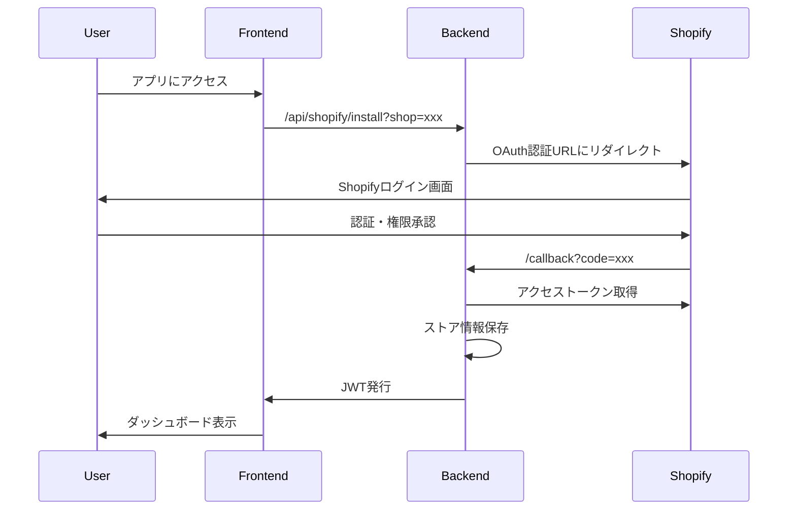
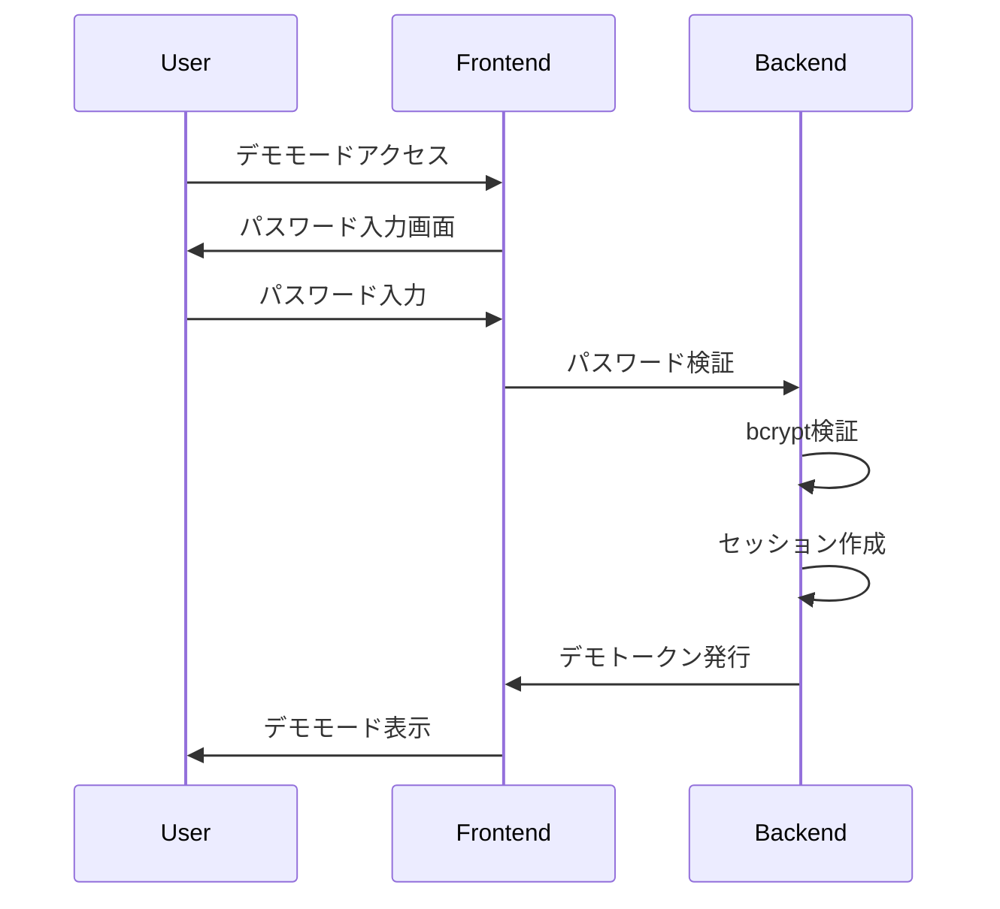

# Shopify アプリ認証モード制御機能 設計書

## 概要

環境別に認証方式を安全に切り替える「3段階認証レベル制御機能」の技術設計書です。本番環境ではShopify OAuth認証を強制し、ステージング環境ではデモモード（読み取り専用）を許可し、開発環境では開発者モード（全機能+開発ツール）を追加で許可します。

**最終更新日**: 2025年10月27日  
**バージョン**: 2.0（3段階認証レベル統合版）

---

## 🏗️ システムアーキテクチャ

### 全体構成図

```mermaid
graph TB
    A[ユーザー] --> B{環境判定}
    B -->|Production| C[Level 3: OAuth認証のみ]
    B -->|Staging| D[Level 3 + Level 2]
    B -->|Development| E[Level 3 + Level 2 + Level 1]
    
    C --> F[Shopify OAuth認証]
    D --> G[OAuth認証 / デモモード]
    E --> H[OAuth / デモ / 開発者モード]
    
    F --> L[フルアクセス<br/>read_only: false]
    G --> L
    G --> M[読み取り専用<br/>read_only: true]
    H --> L
    H --> M
    H --> N[開発ツール<br/>can_access_dev_tools: true]
    
    subgraph "Level 3: OAuth認証"
        F
        L
    end
    
    subgraph "Level 2: デモモード"
        M
        O[デモパスワード認証<br/>bcrypt, サーバー側]
    end
    
    subgraph "Level 1: 開発者モード"
        N
        P[開発者パスワード認証<br/>bcrypt, サーバー側]
        Q[/dev-bookmarks]
    end
    
    subgraph "バックエンド"
        R[AuthModeMiddleware]
        S[DemoReadOnlyFilter<br/>read_onlyクレーム判定]
        T[セッション管理]
    end
```

### データフロー

1. **環境判定**: `NEXT_PUBLIC_ENVIRONMENT` による環境識別
2. **認証モード選択**: 環境に応じた認証方式の選択
3. **認証処理**: 選択された認証方式での認証実行
4. **アクセス制御**: 認証結果に基づくアクセス権限の付与
5. **セッション管理**: 認証状態の維持・管理

---

## 🔧 技術仕様

### 使用技術

#### フロントエンド
- **Next.js**: 14.2.3 (App Router)
- **React**: 18.x
- **TypeScript**: 5.x
- **Tailwind CSS**: ^3.4.x

#### バックエンド
- **.NET**: 8.0
- **ASP.NET Core Web API**
- **Entity Framework Core**: 8.0.x

#### 認証・セキュリティ
- **Shopify OAuth 2.0**
- **JWT (JSON Web Tokens)**
- **Session Tokens**
- **HMAC Verification**

### 環境変数設計

#### フロントエンド環境変数

**重要**: フロントエンド環境変数（`NEXT_PUBLIC_*`）はUI表示のヒントとしてのみ使用し、セキュリティ判定には使用しない。すべての認証・認可判定はサーバー側で実施する。

```typescript
// 環境識別（UI表示用のみ）
NEXT_PUBLIC_ENVIRONMENT: 'production' | 'staging' | 'development'

// 認証モード制御（UI表示用のみ、セキュリティ判定には使用しない）
NEXT_PUBLIC_AUTH_MODE: 'oauth_required' | 'demo_allowed' | 'all_allowed'

// セキュリティ設定
NEXT_PUBLIC_ENABLE_DEV_TOOLS: boolean
NEXT_PUBLIC_DEBUG_MODE: boolean

// 削除された変数（セキュリティリスクのため）:
// - NEXT_PUBLIC_DEV_PASSWORD: クライアントにパスワードを露出しない
// - NEXT_PUBLIC_DEMO_SESSION_TIMEOUT: サーバー側で管理
```

#### バックエンド環境変数

**重要**: すべての認証・認可判定はサーバー側の環境変数のみを使用する。クライアント側の環境変数は信頼しない。

```csharp
// 環境設定
ASPNETCORE_ENVIRONMENT: "Production" | "Staging" | "Development"
Environment__AllowedHostnames: string[] // 環境ごとの許可されたホスト名リスト

// 認証設定
Authentication__Mode: "OAuthRequired" | "DemoAllowed" | "AllAllowed"
Authentication__JwtSecret: string
Authentication__JwtExpiryHours: number
Authentication__ShopifyApiKey: string
Authentication__ShopifyApiSecret: string

// デモモード設定（Level 2）
Demo__Enabled: boolean
Demo__PasswordHash: string (bcrypt) // 平文パスワードは保存しない
Demo__SessionTimeoutHours: number
Demo__MaxSessionsPerUser: number
Demo__RateLimitPerIp: number // ブルートフォース対策
Demo__LockoutThreshold: number // ロックアウト閾値
Demo__LockoutDurationMinutes: number // ロックアウト期間

// 開発者モード設定（Level 1、開発環境のみ）
Developer__Enabled: boolean // 開発環境のみtrue
Developer__PasswordHash: string (bcrypt) // デモとは別のパスワード
Developer__SessionTimeoutHours: number
Developer__RateLimitPerIp: number

// セッションストレージ設定
Session__StorageType: "Redis" | "Database" // IMemoryCacheは使用しない
Session__RedisConnectionString: string (if Redis)
Session__CleanupIntervalMinutes: number

// セキュリティ設定
Security__RequireHttps: boolean
Security__EnableCors: boolean
Security__AllowedOrigins: string[]
Security__RateLimitPerMinute: number
```

---

## 🎨 コンポーネント設計

### フロントエンドコンポーネント

#### 1. 認証画面コンポーネント

```typescript
// AuthenticationRequired.tsx
interface AuthenticationRequiredProps {
  environment: 'production' | 'staging' | 'development'
  authMode: 'oauth_required' | 'demo_allowed' | 'all_allowed'
  hasShopParam: boolean
  onShopifyAuth: () => void
  onDemoAuth: () => void
  onDeveloperAuth?: () => void // 開発環境のみ
}

const AuthenticationRequired: React.FC<AuthenticationRequiredProps> = ({
  environment,
  authMode,
  hasShopParam,
  onShopifyAuth,
  onDemoAuth,
  onDeveloperAuth
}) => {
  // 環境に応じた表示制御
  const title = environment === 'production' 
    ? 'Shopify認証が必要です' 
    : '認証が必要です'
  
  const showDemoLink = authMode !== 'oauth_required'
  const showDeveloperLink = environment === 'development' && authMode === 'all_allowed'
  
  return (
    <div className="auth-container">
      <h1>{title}</h1>
      {environment === 'production' && !hasShopParam ? (
        <ProductionGuidance />
      ) : (
        <AuthOptions 
          showOAuth={true}
          showDemo={showDemoLink}
          showDeveloper={showDeveloperLink}
          onShopifyAuth={onShopifyAuth}
          onDemoAuth={onDemoAuth}
          onDeveloperAuth={onDeveloperAuth}
        />
      )}
    </div>
  )
}
```

#### 2. デモモードバナーコンポーネント

```typescript
// DeveloperModeBanner.tsx
interface DeveloperModeBannerProps {
  sessionExpiresAt: Date
  onLogout: () => void
}

const DeveloperModeBanner: React.FC<DeveloperModeBannerProps> = ({
  sessionExpiresAt,
  onLogout
}) => {
  const [timeRemaining, setTimeRemaining] = useState<number>(0)
  
  useEffect(() => {
    const interval = setInterval(() => {
      const remaining = Math.max(0, sessionExpiresAt.getTime() - Date.now())
      setTimeRemaining(Math.floor(remaining / 60000)) // 分単位
    }, 1000)
    
    return () => clearInterval(interval)
  }, [sessionExpiresAt])
  
  return (
    <div className="demo-banner">
      <span>⚠️ 開発者ツール有効（データ閲覧専用モード）</span>
      <span>セッション残り: {timeRemaining}分</span>
      <button onClick={onLogout}>ログアウト</button>
    </div>
  )
}
```

#### 3. 認証ガードコンポーネント

```typescript
// AuthGuard.tsx
interface AuthGuardProps {
  children: React.ReactNode
  requireAuth: boolean
  allowedModes: AuthMode[]
}

const AuthGuard: React.FC<AuthGuardProps> = ({
  children,
  requireAuth,
  allowedModes
}) => {
  const [authState, setAuthState] = useState<AuthState>('checking')
  const [isDeveloperMode, setIsDeveloperMode] = useState<boolean>(false)
  
  useEffect(() => {
    const checkAuth = async () => {
      const environment = process.env.NEXT_PUBLIC_ENVIRONMENT
      const authMode = process.env.NEXT_PUBLIC_AUTH_MODE
      
      // デモモードチェック
      const demoAuth = localStorage.getItem('dev_mode_auth')
      if (demoAuth && authMode !== 'oauth_required') {
        setIsDeveloperMode(true)
        setAuthState('authenticated')
        return
      }
      
      // OAuth認証チェック
      const oauthToken = await checkOAuthToken()
      if (oauthToken) {
        setAuthState('authenticated')
        return
      }
      
      setAuthState('unauthenticated')
    }
    
    checkAuth()
  }, [])
  
  if (authState === 'checking') {
    return <LoadingSpinner />
  }
  
  if (authState === 'unauthenticated' && requireAuth) {
    return <AuthenticationRequired />
  }
  
  return (
    <>
      {isDeveloperMode && <DeveloperModeBanner />}
      {children}
    </>
  )
}
```

### バックエンドコンポーネント

#### 1. 認証ミドルウェア

**重要**: Shopify埋め込みアプリでは、Cookieではなく、App BridgeセッショントークンをAuthorizationヘッダーで受け取る。

```csharp
// AuthModeMiddleware.cs
public class AuthModeMiddleware
{
    private readonly RequestDelegate _next;
    private readonly IConfiguration _config;
    private readonly ILogger<AuthModeMiddleware> _logger;
    private readonly IHostEnvironment _env;

    public async Task InvokeAsync(HttpContext context)
    {
        var authMode = _config["Authentication:Mode"];
        var environment = _env.EnvironmentName;
        
        // 起動時環境チェック（本番環境安全弁）
        if (environment == "Production" && authMode != "OAuthRequired")
        {
            _logger.LogCritical("SECURITY: Invalid authentication mode for production environment");
            context.Response.StatusCode = 500;
            await context.Response.WriteAsJsonAsync(new 
            { 
                error = "Configuration Error",
                message = "Production environment must use OAuthRequired mode"
            });
            return;
        }
        
        // ホスト名検証
        var allowedHostnames = _config.GetSection("Environment:AllowedHostnames").Get<string[]>();
        if (allowedHostnames?.Length > 0)
        {
            var hostname = context.Request.Host.Host;
            if (!allowedHostnames.Contains(hostname))
            {
                _logger.LogWarning("Request from unauthorized hostname: {Hostname}", hostname);
            }
        }
        
        // Authorizationヘッダーからトークンを取得（Cookieではなく）
        var authHeader = context.Request.Headers["Authorization"].FirstOrDefault();
        string token = null;
        
        if (!string.IsNullOrEmpty(authHeader) && authHeader.StartsWith("Bearer "))
        {
            token = authHeader.Substring("Bearer ".Length).Trim();
        }
        
        bool isOAuthValid = false;
        bool isDemoValid = false;
        
        if (!string.IsNullOrEmpty(token))
        {
            // Shopify App Bridgeセッショントークンの検証
            isOAuthValid = await ValidateShopifySessionTokenAsync(token);
            
            // デモトークンの検証
            if (!isOAuthValid)
            {
                isDemoValid = await ValidateDemoTokenAsync(token);
            }
        }
        
        // 認証モード別の処理（サーバー側設定のみを信頼）
        switch (authMode)
        {
            case "OAuthRequired":
                if (!isOAuthValid)
                {
                    context.Response.StatusCode = 401;
                    await context.Response.WriteAsJsonAsync(new 
                    { 
                        error = "Unauthorized",
                        message = "OAuth authentication required"
                    });
                    return;
                }
                break;
                
            case "DemoAllowed":
                if (!isOAuthValid && !isDemoValid)
                {
                    context.Response.StatusCode = 401;
                    await context.Response.WriteAsJsonAsync(new 
                    { 
                        error = "Unauthorized",
                        message = "OAuth or demo authentication required"
                    });
                    return;
                }
                break;
                
            case "AllAllowed":
                // すべての認証方式を許可（開発環境のみ）
                break;
        }
        
        // 認証レベル別のクレーム設定
        if (isOAuthValid)
        {
            // Level 3: OAuth認証
            context.Items["AuthMode"] = "OAuth";
            var claims = new List<Claim>
            {
                new Claim("auth_mode", "oauth"),
                new Claim("read_only", "false")
            };
            context.User = new ClaimsPrincipal(new ClaimsIdentity(claims, "OAuth"));
        }
        else if (isDemoValid)
        {
            // Level 2: デモモード
            context.Items["AuthMode"] = "Demo";
            var claims = new List<Claim>
            {
                new Claim("auth_mode", "demo"),
                new Claim("read_only", "true")
            };
            context.User = new ClaimsPrincipal(new ClaimsIdentity(claims, "Demo"));
        }
        else if (isDeveloperValid && environment == "Development")
        {
            // Level 1: 開発者モード（開発環境のみ）
            context.Items["AuthMode"] = "Developer";
            var claims = new List<Claim>
            {
                new Claim("auth_mode", "developer"),
                new Claim("read_only", "false"),
                new Claim("can_access_dev_tools", "true")
            };
            context.User = new ClaimsPrincipal(new ClaimsIdentity(claims, "Developer"));
        }
        
        await _next(context);
    }
    
    private async Task<bool> ValidateShopifySessionTokenAsync(string token)
    {
        // Shopify App Bridgeセッショントークンの検証
        // JWT署名検証、有効期限チェック、ショップドメイン検証
        // 実装詳細は省略
        return await Task.FromResult(true); // 実装時に適切な検証ロジックを追加
    }
}
```

#### 2. グローバル読み取り専用ポリシー（推奨）

**重要**: 属性ベースのアクセス制御は付け忘れのリスクがあるため、グローバルポリシーを使用してデフォルトですべての変更操作をブロックする。

```csharp
// DemoReadOnlyFilter.cs
// 重要: auth_modeではなくread_onlyクレームで判定
public class DemoReadOnlyFilter : IActionFilter
{
    private readonly ILogger<DemoReadOnlyFilter> _logger;

    public void OnActionExecuting(ActionExecutingContext context)
    {
        // read_onlyクレームで判定（auth_modeは見ない）
        var readOnlyClaim = context.HttpContext.User.FindFirst("read_only");
        var isReadOnly = readOnlyClaim?.Value == "true";
        
        if (isReadOnly)
        {
            var httpMethod = context.HttpContext.Request.Method;
            
            // read_only: trueの場合、変更操作（POST/PUT/PATCH/DELETE）をブロック
            if (httpMethod == "POST" || httpMethod == "PUT" || 
                httpMethod == "PATCH" || httpMethod == "DELETE")
            {
                // [AllowDemoWrite]属性がある場合のみ許可
                var allowDemoWrite = context.ActionDescriptor.EndpointMetadata
                    .OfType<AllowDemoWriteAttribute>()
                    .Any();
                
                if (!allowDemoWrite)
                {
                    var authMode = context.HttpContext.User.FindFirst("auth_mode")?.Value ?? "unknown";
                    _logger.LogWarning("Read-only mode write attempt blocked: {AuthMode} {Method} {Path}", 
                        authMode, httpMethod, context.HttpContext.Request.Path);
                    
                    context.Result = new JsonResult(new
                    {
                        error = "Forbidden",
                        message = "Write operations are not allowed in read-only mode"
                    })
                    {
                        StatusCode = 403
                    };
                }
            }
        }
    }

    public void OnActionExecuted(ActionExecutedContext context) { }
}

// AllowDemoWriteAttribute.cs（明示的に許可する場合のみ使用）
[AttributeUsage(AttributeTargets.Method | AttributeTargets.Class)]
public class AllowDemoWriteAttribute : Attribute
{
    // 理想的にはこの属性を使用するエンドポイントはゼロ
}

// Startup.cs での登録
services.AddControllers(options =>
{
    options.Filters.Add<DemoReadOnlyFilter>();
});
```

#### 3. アクセス制御属性（レガシー、非推奨）

```csharp
// RequireOAuthAttribute.cs（グローバルポリシーを使用する場合は不要）
[AttributeUsage(AttributeTargets.Method | AttributeTargets.Class)]
public class RequireOAuthAttribute : ActionFilterAttribute
{
    public override void OnActionExecuting(ActionExecutingContext context)
    {
        var authMode = context.HttpContext.Items["AuthMode"]?.ToString();
        
        if (authMode == "Demo")
        {
            context.Result = new JsonResult(new
            {
                error = "Forbidden in demo mode",
                message = "Shopify API access is restricted in demo mode"
            })
            {
                StatusCode = 403
            };
        }
    }
}
```

#### 4. デモ認証サービス（分散セッションストレージ + レート制限）

**重要**: `IMemoryCache` は使用せず、Redisまたはデータベースによる分散セッションストレージを使用する。

```csharp
// DemoAuthService.cs
public class DemoAuthService
{
    private readonly IConfiguration _config;
    private readonly IDistributedCache _distributedCache; // IMemoryCacheではなくIDistributedCache
    private readonly ILogger<DemoAuthService> _logger;
    private readonly IRateLimiter _rateLimiter;
    private readonly ApplicationDbContext _dbContext;

    public async Task<DemoAuthResult> AuthenticateAsync(string password, string ipAddress)
    {
        // レート制限チェック（ブルートフォース対策）
        var rateLimitKey = $"demo_auth_rate_{ipAddress}";
        var attempts = await _rateLimiter.GetAttemptsAsync(rateLimitKey);
        var maxAttempts = _config.GetValue<int>("Demo:RateLimitPerIp");
        
        if (attempts >= maxAttempts)
        {
            _logger.LogWarning("Rate limit exceeded for IP: {IpAddress}", ipAddress);
            return new DemoAuthResult 
            { 
                Success = false,
                Error = "Too many attempts. Please try again later."
            };
        }
        
        // ロックアウトチェック
        var lockoutKey = $"demo_auth_lockout_{ipAddress}";
        var isLockedOut = await _distributedCache.GetStringAsync(lockoutKey);
        
        if (!string.IsNullOrEmpty(isLockedOut))
        {
            _logger.LogWarning("Locked out IP attempting login: {IpAddress}", ipAddress);
            return new DemoAuthResult 
            { 
                Success = false,
                Error = "Account temporarily locked. Please try again later."
            };
        }
        
        // パスワード検証
        var hashedPassword = _config["Demo:PasswordHash"];
        var isValid = BCrypt.Verify(password, hashedPassword);
        
        if (!isValid)
        {
            // 失敗試行を記録（平文パスワードは記録しない）
            await _rateLimiter.IncrementAsync(rateLimitKey);
            
            var failedAttempts = await _rateLimiter.GetAttemptsAsync(rateLimitKey);
            var lockoutThreshold = _config.GetValue<int>("Demo:LockoutThreshold");
            
            // ロックアウト閾値に達した場合
            if (failedAttempts >= lockoutThreshold)
            {
                var lockoutDuration = TimeSpan.FromMinutes(
                    _config.GetValue<int>("Demo:LockoutDurationMinutes")
                );
                await _distributedCache.SetStringAsync(lockoutKey, "locked", 
                    new DistributedCacheEntryOptions { AbsoluteExpirationRelativeToNow = lockoutDuration });
                
                _logger.LogWarning("IP locked out due to failed attempts: {IpAddress}", ipAddress);
            }
            
            _logger.LogWarning("Invalid demo password attempt from IP: {IpAddress}", ipAddress);
            
            // 認証ログに記録
            await LogAuthenticationAttemptAsync(ipAddress, "demo", false, "Invalid password");
            
            return new DemoAuthResult { Success = false, Error = "Invalid password" };
        }
        
        // セッション作成
        var sessionId = Guid.NewGuid().ToString();
        var expiresAt = DateTime.UtcNow.AddHours(
            _config.GetValue<int>("Demo:SessionTimeoutHours")
        );
        
        var session = new DemoSession
        {
            Id = Guid.NewGuid(),
            SessionId = sessionId,
            ExpiresAt = expiresAt,
            CreatedAt = DateTime.UtcNow,
            LastAccessedAt = DateTime.UtcNow,
            IsActive = true,
            CreatedBy = ipAddress
        };
        
        // データベースに保存（分散セッションストレージ）
        _dbContext.DemoSessions.Add(session);
        await _dbContext.SaveChangesAsync();
        
        // Redisにもキャッシュ（高速アクセス用）
        var cacheOptions = new DistributedCacheEntryOptions
        {
            AbsoluteExpiration = expiresAt
        };
        await _distributedCache.SetStringAsync(
            $"demo_session_{sessionId}", 
            JsonSerializer.Serialize(session),
            cacheOptions
        );
        
        // トークン生成
        var token = GenerateDemoToken(session);
        
        // 成功ログ記録
        await LogAuthenticationAttemptAsync(ipAddress, "demo", true, null);
        
        // レート制限カウンターをリセット
        await _rateLimiter.ResetAsync(rateLimitKey);
        
        return new DemoAuthResult
        {
            Success = true,
            Token = token,
            ExpiresAt = expiresAt
        };
    }
    
    private string GenerateDemoToken(DemoSession session)
    {
        var tokenHandler = new JwtSecurityTokenHandler();
        var key = Encoding.ASCII.GetBytes(_config["Authentication:JwtSecret"]);
        
        var tokenDescriptor = new SecurityTokenDescriptor
        {
            Subject = new ClaimsIdentity(new[]
            {
                new Claim("session_id", session.SessionId),
                new Claim("auth_mode", "demo"),
                new Claim("read_only", "true"), // デモモードは読み取り専用
                new Claim("expires_at", session.ExpiresAt.ToString("O"))
            }),
            Expires = session.ExpiresAt,
            SigningCredentials = new SigningCredentials(
                new SymmetricSecurityKey(key), 
                SecurityAlgorithms.HmacSha256Signature
            )
        };
        
        var token = tokenHandler.CreateToken(tokenDescriptor);
        return tokenHandler.WriteToken(token);
    }
    
    private async Task LogAuthenticationAttemptAsync(string ipAddress, string authMode, bool success, string failureReason)
    {
        var log = new AuthenticationLog
        {
            Id = Guid.NewGuid(),
            AuthMode = authMode,
            Success = success,
            FailureReason = failureReason,
            IpAddress = ipAddress,
            CreatedAt = DateTime.UtcNow
        };
        
        _dbContext.AuthenticationLogs.Add(log);
        await _dbContext.SaveChangesAsync();
    }
}
```

---

## 🔐 セキュリティ設計

### 認証フロー

#### 1. OAuth認証フロー



#### 2. デモモード認証フロー



### セキュリティ対策

#### 1. パスワードセキュリティ
- **bcrypt**: パスワードのハッシュ化
- **ソルト**: ランダムソルトの使用
- **コスト**: 適切なコスト設定（10以上）

#### 2. セッションセキュリティ
- **JWT**: 署名付きトークンの使用
- **有効期限**: 適切な有効期限設定
- **リフレッシュ**: トークンの自動更新

#### 3. アクセス制御
- **CORS**: 適切なCORS設定
- **HTTPS**: 本番環境でのHTTPS強制
- **レート制限**: API呼び出しの制限

---

## 📊 データベース設計

### セッション管理テーブル

```sql
-- デモセッション管理
CREATE TABLE DemoSessions (
    Id UNIQUEIDENTIFIER PRIMARY KEY DEFAULT NEWID(),
    SessionId NVARCHAR(255) NOT NULL UNIQUE,
    CreatedAt DATETIME2 NOT NULL DEFAULT GETUTCDATE(),
    ExpiresAt DATETIME2 NOT NULL,
    LastAccessedAt DATETIME2 NOT NULL DEFAULT GETUTCDATE(),
    IsActive BIT NOT NULL DEFAULT 1,
    CreatedBy NVARCHAR(255) NULL,
    INDEX IX_DemoSessions_SessionId (SessionId),
    INDEX IX_DemoSessions_ExpiresAt (ExpiresAt)
);

-- 認証ログ
CREATE TABLE AuthenticationLogs (
    Id UNIQUEIDENTIFIER PRIMARY KEY DEFAULT NEWID(),
    UserId NVARCHAR(255) NULL,
    AuthMode NVARCHAR(50) NOT NULL, -- 'oauth', 'demo', 'dev'
    Success BIT NOT NULL,
    FailureReason NVARCHAR(255) NULL,
    IpAddress NVARCHAR(45) NULL,
    UserAgent NVARCHAR(500) NULL,
    CreatedAt DATETIME2 NOT NULL DEFAULT GETUTCDATE(),
    INDEX IX_AuthenticationLogs_CreatedAt (CreatedAt),
    INDEX IX_AuthenticationLogs_AuthMode (AuthMode)
);
```

### 環境設定テーブル

```sql
-- 環境設定
CREATE TABLE EnvironmentSettings (
    Id UNIQUEIDENTIFIER PRIMARY KEY DEFAULT NEWID(),
    Environment NVARCHAR(50) NOT NULL, -- 'production', 'staging', 'development'
    AuthMode NVARCHAR(50) NOT NULL, -- 'oauth_required', 'demo_allowed', 'all_allowed'
    EnableDevTools BIT NOT NULL DEFAULT 0,
    DebugMode BIT NOT NULL DEFAULT 0,
    CreatedAt DATETIME2 NOT NULL DEFAULT GETUTCDATE(),
    UpdatedAt DATETIME2 NOT NULL DEFAULT GETUTCDATE(),
    UNIQUE(Environment)
);
```

---

## 🧪 テスト設計

### 単体テスト

#### フロントエンドテスト

```typescript
// AuthenticationRequired.test.tsx
describe('AuthenticationRequired', () => {
  it('should show Shopify title in production', () => {
    render(
      <AuthenticationRequired 
        environment="production"
        authMode="oauth_required"
        hasShopParam={false}
        onShopifyAuth={jest.fn()}
        onDemoAuth={jest.fn()}
      />
    )
    
    expect(screen.getByText('Shopify認証が必要です')).toBeInTheDocument()
  })
  
  it('should show demo link in staging', () => {
    render(
      <AuthenticationRequired 
        environment="staging"
        authMode="demo_allowed"
        hasShopParam={true}
        onShopifyAuth={jest.fn()}
        onDemoAuth={jest.fn()}
      />
    )
    
    expect(screen.getByText('デモサイトを開く')).toBeInTheDocument()
  })
})
```

#### バックエンドテスト

```csharp
// AuthModeMiddlewareTests.cs
[Test]
public async Task InvokeAsync_ProductionWithDemoMode_ShouldReturn500()
{
    // Arrange
    var config = new ConfigurationBuilder()
        .AddInMemoryCollection(new Dictionary<string, string>
        {
            ["Environment"] = "Production",
            ["Authentication:Mode"] = "DemoAllowed"
        })
        .Build();
    
    var middleware = new AuthModeMiddleware(_next, config, _logger);
    var context = new DefaultHttpContext();
    
    // Act
    await middleware.InvokeAsync(context);
    
    // Assert
    Assert.AreEqual(500, context.Response.StatusCode);
}
```

### 統合テスト

```csharp
// AuthenticationIntegrationTests.cs
[Test]
public async Task DemoMode_ShouldRestrictShopifyApiAccess()
{
    // Arrange
    var client = _factory.CreateClient();
    var demoToken = await GetDemoTokenAsync();
    client.DefaultRequestHeaders.Authorization = 
        new AuthenticationHeaderValue("Bearer", demoToken);
    
    // Act
    var response = await client.GetAsync("/api/shopify/orders");
    
    // Assert
    Assert.AreEqual(HttpStatusCode.Forbidden, response.StatusCode);
    var content = await response.Content.ReadAsStringAsync();
    Assert.Contains("Forbidden in demo mode", content);
}
```

---

## 📈 パフォーマンス設計

### キャッシュ戦略

#### 1. セッションキャッシュ（分散キャッシュ）
- **Redis + Database**: デモセッションの分散ストレージ
  - **Redis**: 高速アクセス用のキャッシュ層
  - **Database**: 永続化とスケールアウト対応
- **有効期限**: セッションタイムアウトと同期（TTL設定）
- **クリーンアップ**: 定期的な期限切れセッションの削除ジョブ
- **スケーラビリティ**: 複数サーバーインスタンス間でセッション共有
- **注意**: `IMemoryCache` は使用しない（サーバー再起動やスケールアウトで失われる）

#### 2. 設定キャッシュ
- **Configuration**: 環境設定のキャッシュ
- **更新頻度**: アプリケーション起動時
- **フォールバック**: デフォルト値の使用
- **検証**: 起動時の環境設定検証（本番環境チェック）

### 最適化戦略

#### 1. 認証チェック最適化
- **JWT検証**: 署名検証の最適化
- **セッション検索**: インデックス活用
- **並列処理**: 複数認証方式の並列チェック

#### 2. レスポンス最適化
- **圧縮**: gzip圧縮の有効化
- **CDN**: 静的リソースのCDN配信
- **プリロード**: 重要なリソースのプリロード

---

## 🔄 デプロイメント設計

### 環境別設定

#### 本番環境
```yaml
# production.yml
environment:
  NEXT_PUBLIC_ENVIRONMENT: "production"
  NEXT_PUBLIC_AUTH_MODE: "oauth_required"
  NEXT_PUBLIC_ENABLE_DEV_TOOLS: "false"
  NEXT_PUBLIC_DEBUG_MODE: "false"

authentication:
  mode: "OAuthRequired"
  requireHttps: true
  enableCors: false
```

#### ステージング環境
```yaml
# staging.yml
environment:
  NEXT_PUBLIC_ENVIRONMENT: "staging"
  NEXT_PUBLIC_AUTH_MODE: "demo_allowed"
  NEXT_PUBLIC_ENABLE_DEV_TOOLS: "true"
  NEXT_PUBLIC_DEBUG_MODE: "false"

authentication:
  mode: "DemoAllowed"
  requireHttps: true
  enableCors: true
```

#### 開発環境
```yaml
# development.yml
environment:
  NEXT_PUBLIC_ENVIRONMENT: "development"
  NEXT_PUBLIC_AUTH_MODE: "all_allowed"
  NEXT_PUBLIC_ENABLE_DEV_TOOLS: "true"
  NEXT_PUBLIC_DEBUG_MODE: "true"

authentication:
  mode: "AllAllowed"
  requireHttps: false
  enableCors: true
```

### デプロイメント手順

1. **環境変数設定**: 各環境の設定ファイル適用
2. **データベースマイグレーション**: 新しいテーブルの作成
3. **アプリケーションデプロイ**: フロントエンド・バックエンドのデプロイ
4. **設定確認**: 環境変数の確認
5. **動作テスト**: 各認証モードのテスト

---

## 📚 関連ドキュメント

### 技術ドキュメント
- [要件定義書](../01-requirements/Shopify-認証モード制御-要件定義.md)
- [実装計画書](../03-implementation/Shopify-認証モード制御-実装計画.md)
- [テスト計画書](../04-review/Shopify-認証モード制御-テスト計画.md)

### 既存ドキュメント
- [認証モード一覧](../../05-development/09-認証・セキュリティ/認証モード一覧.md)
- [認証画面表示仕様](../../05-development/09-認証・セキュリティ/認証画面表示仕様.md)
- [環境変数チェックリスト](../../05-development/09-認証・セキュリティ/環境変数チェックリスト.md)

### 外部ドキュメント
- [Shopify OAuth認証ガイド](https://shopify.dev/docs/apps/auth/oauth)
- [Session Tokens](https://shopify.dev/docs/apps/auth/session-tokens)
- [App Bridge 認証](https://shopify.dev/docs/apps/tools/app-bridge)

---

## 📝 更新履歴

| 日付 | 内容 | 担当者 |
|------|------|--------|
| 2025-10-25 | 初版作成 | Kenji |

---

**最終更新**: 2025年10月25日  
**次回レビュー**: 2025年11月1日（週次）
