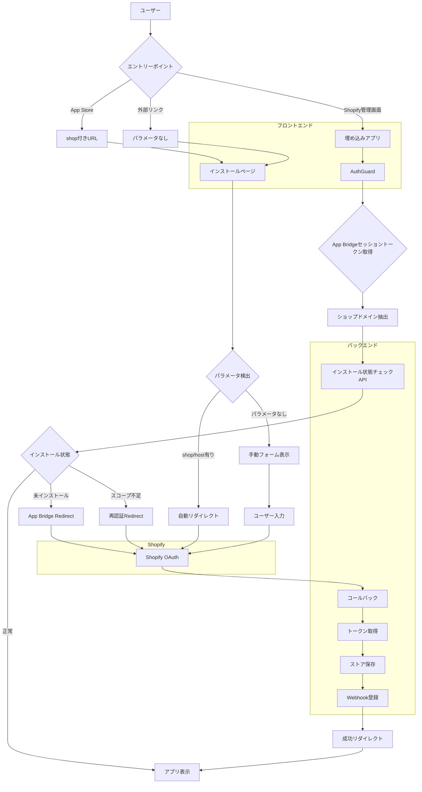

# Shopify アプリインストールフロー改善機能 設計書

## 概要

Shopifyアプリの標準的なインストールフローに準拠し、ユーザーが手動でショップドメインを入力する必要をなくし、埋め込みアプリとして自動的にインストール状態を検出・管理する機能の技術設計書です。

---

## 🏗️ システムアーキテクチャ

### 全体構成図



### データフロー

#### フロー1: 埋め込みアプリでの初回インストール
1. ユーザーがShopify管理画面でアプリをクリック
2. アプリが埋め込みiframeで読み込まれる（`host`パラメータ付き）
3. AuthGuardがApp Bridgeセッショントークンを取得
4. セッショントークンからショップドメインを抽出（`dest`クレーム）
5. `/api/shopify/status?shop=<domain>` APIを呼び出し
6. APIが `{installed: false, installUrl: "..."}` を返す
7. AuthGuardがApp Bridge Redirectでトップレベルリダイレクト
8. Shopify OAuthページが開く
9. ユーザーが権限を承認
10. `/api/shopify/callback` にリダイレクト（`code`, `shop`, `state`, `host`付き）
11. バックエンドがトークンを取得・保存
12. `/auth/success?shop=<domain>&host=<host>` にリダイレクト
13. アプリが埋め込みモードで表示

#### フロー2: 既にインストール済みの再アクセス
1. ユーザーがShopify管理画面でアプリをクリック
2. AuthGuardがセッショントークンを取得
3. `/api/shopify/status` APIを呼び出し
4. APIが `{installed: true, scopesValid: true}` を返す
5. AuthGuardが認証済みと判定
6. アプリが即座に表示（OAuthフローなし）

#### フロー3: スコープ更新後の再認証
1. ユーザーがアプリにアクセス
2. AuthGuardがセッショントークンを取得
3. `/api/shopify/status` APIを呼び出し
4. APIが `{installed: true, scopesValid: false, missingScopes: [...], reauthUrl: "..."}` を返す
5. AuthGuardがApp Bridge Redirectで再認証URLにリダイレクト
6. Shopify OAuthページが開く（新しいスコープ付き）
7. ユーザーが追加権限を承認
8. コールバックが実行され、新しいトークンを取得
9. アプリが正常に表示

---

## 🔧 技術仕様

### 使用技術

#### フロントエンド
- **Next.js**: 14.2.3 (App Router)
- **React**: 18.x
- **TypeScript**: 5.x
- **@shopify/app-bridge**: 4.x
- **@shopify/app-bridge-react**: 4.x
- **Shopify Polaris**: ^12.x

#### バックエンド
- **.NET**: 8.0
- **ASP.NET Core Web API**
- **Entity Framework Core**: 8.0.x
- **SQL Server**: 2019以降

#### 認証・セキュリティ
- **Shopify OAuth 2.0**
- **App Bridge Session Tokens**
- **JWT (JSON Web Tokens)**
- **HMAC Verification**

### API設計

#### 1. インストール状態チェックAPI

**エンドポイント**: `GET /api/shopify/status`

**リクエストパラメータ**:
```typescript
{
  shop: string // 例: "my-store.myshopify.com"
}
```

**レスポンス**:
```typescript
interface InstallationStatusResponse {
  installed: boolean
  scopesValid?: boolean // installedがtrueの場合のみ
  missingScopes?: string[] // scopesValidがfalseの場合
  installUrl?: string // installedがfalseの場合
  reauthUrl?: string // scopesValidがfalseの場合
  message: string
}
```

**実装例**:
```csharp
[HttpGet("status")]
[AllowAnonymous]
public async Task<IActionResult> GetInstallationStatus([FromQuery] string shop)
{
    try
    {
        // ショップドメインの検証
        if (string.IsNullOrWhiteSpace(shop) || !IsValidShopDomain(shop))
        {
            _logger.LogWarning("無効なショップドメイン: {Shop}", shop);
            return BadRequest(new { error = "Invalid shop domain" });
        }

        // レート制限チェック
        var rateLimitKey = $"status_check_{shop}";
        if (!await _rateLimiter.CheckRateLimitAsync(rateLimitKey, 10, TimeSpan.FromMinutes(1)))
        {
            _logger.LogWarning("レート制限超過: {Shop}", shop);
            return StatusCode(429, new { error = "Rate limit exceeded" });
        }

        // データベースからストア情報を取得
        var store = await _context.Stores
            .FirstOrDefaultAsync(s => s.Domain == shop);

        if (store == null)
        {
            // 未インストール
            var installUrl = GenerateInstallUrl(shop);
            return Ok(new
            {
                installed = false,
                installUrl = installUrl,
                message = "App not installed for this shop"
            });
        }

        // インストール済み - スコープチェック
        var requiredScopes = GetRequiredScopes();
        var currentScopes = ParseScopes(store.Scopes);
        var missingScopes = requiredScopes.Except(currentScopes).ToList();

        if (missingScopes.Any())
        {
            // スコープ不足 - 再認証が必要
            var reauthUrl = GenerateInstallUrl(shop, requiredScopes);
            return Ok(new
            {
                installed = true,
                scopesValid = false,
                missingScopes = missingScopes,
                reauthUrl = reauthUrl,
                message = "App requires additional permissions"
            });
        }

        // すべて正常
        return Ok(new
        {
            installed = true,
            scopesValid = true,
            message = "App is properly installed"
        });
    }
    catch (Exception ex)
    {
        _logger.LogError(ex, "インストール状態チェックエラー: {Shop}", shop);
        return StatusCode(500, new { error = "Internal server error" });
    }
}

private HashSet<string> GetRequiredScopes()
{
    var scopesString = _configuration["Shopify:Scopes"] ?? "read_orders,read_products,read_customers";
    return scopesString.Split(',')
        .Select(s => s.Trim())
        .ToHashSet();
}

private HashSet<string> ParseScopes(string? scopesString)
{
    if (string.IsNullOrWhiteSpace(scopesString))
        return new HashSet<string>();
    
    return scopesString.Split(',')
        .Select(s => s.Trim())
        .ToHashSet();
}

private string GenerateInstallUrl(string shop, HashSet<string>? scopes = null)
{
    var baseUrl = _configuration["Frontend:BaseUrl"];
    var scopesParam = scopes != null 
        ? string.Join(",", scopes) 
        : _configuration["Shopify:Scopes"];
    
    return $"{baseUrl}/api/shopify/install?shop={Uri.EscapeDataString(shop)}&scopes={Uri.EscapeDataString(scopesParam)}";
}
```

#### 2. インストールエンドポイントの改修

**エンドポイント**: `GET /api/shopify/install`

**リクエストパラメータ**:
```typescript
{
  shop: string // 必須
  host?: string // オプション（埋め込みアプリの場合）
  scopes?: string // オプション（カスタムスコープ）
}
```

**実装例**:
```csharp
[HttpGet("install")]
[AllowAnonymous]
public IActionResult Install(
    [FromQuery] string shop,
    [FromQuery] string? host = null,
    [FromQuery] string? scopes = null)
{
    try
    {
        // ショップドメインの検証
        if (string.IsNullOrWhiteSpace(shop) || !IsValidShopDomain(shop))
        {
            _logger.LogWarning("無効なショップドメイン: {Shop}", shop);
            return BadRequest(new { error = "Invalid shop domain" });
        }

        // hostパラメータの検証（存在する場合）
        if (!string.IsNullOrWhiteSpace(host) && !IsValidHostParameter(host))
        {
            _logger.LogWarning("無効なhostパラメータ: {Host}", host);
            return BadRequest(new { error = "Invalid host parameter" });
        }

        // CSRF対策用のstateを生成
        var state = GenerateRandomString(32);
        var cacheKey = $"{StateCacheKeyPrefix}{state}";
        
        // stateとhostをキャッシュに保存（10分間有効）
        var stateData = new OAuthStateData
        {
            Shop = shop,
            Host = host,
            CreatedAt = DateTime.UtcNow
        };
        _cache.Set(cacheKey, stateData, TimeSpan.FromMinutes(StateExpirationMinutes));
        
        _logger.LogInformation("OAuth認証開始. Shop: {Shop}, State: {State}, Host: {Host}", 
            shop, state, host != null ? "present" : "null");

        // Shopify OAuth URLを構築
        var apiKey = GetShopifySetting("ApiKey");
        var scopesParam = scopes ?? GetShopifySetting("Scopes", "read_orders,read_products,read_customers");
        var redirectUri = GetRedirectUri();

        var authUrl = $"https://{shop}/admin/oauth/authorize" +
            $"?client_id={apiKey}" +
            $"&scope={scopesParam}" +
            $"&redirect_uri={Uri.EscapeDataString(redirectUri)}" +
            $"&state={state}";

        // hostパラメータがある場合、Shopifyに渡す（コールバックで返される）
        if (!string.IsNullOrWhiteSpace(host))
        {
            authUrl += $"&host={Uri.EscapeDataString(host)}";
        }

        // Shopifyの認証ページにリダイレクト
        return Redirect(authUrl);
    }
    catch (Exception ex)
    {
        return HandleOAuthError(ex, shop, "Install");
    }
}

private bool IsValidHostParameter(string host)
{
    try
    {
        // base64デコードを試みる
        var decoded = Convert.FromBase64String(host);
        var decodedString = Encoding.UTF8.GetString(decoded);
        
        // デコード後の文字列にショップドメインが含まれているか確認
        return decodedString.Contains(".myshopify.com");
    }
    catch
    {
        return false;
    }
}

public class OAuthStateData
{
    public string Shop { get; set; } = string.Empty;
    public string? Host { get; set; }
    public DateTime CreatedAt { get; set; }
}
```

#### 3. コールバックエンドポイントの改修

**エンドポイント**: `GET /api/shopify/callback`

**実装例**:
```csharp
[HttpGet("callback")]
[AllowAnonymous]
public async Task<IActionResult> Callback(
    [FromQuery] string code,
    [FromQuery] string shop,
    [FromQuery] string state,
    [FromQuery] string? host = null,
    [FromQuery] string? hmac = null,
    [FromQuery] string? timestamp = null)
{
    try
    {
        _logger.LogInformation("OAuthコールバック受信. Shop: {Shop}, State: {State}, Host: {Host}", 
            shop, state, host != null ? "present" : "null");

        // パラメータ検証
        if (string.IsNullOrWhiteSpace(code) || 
            string.IsNullOrWhiteSpace(shop) || 
            string.IsNullOrWhiteSpace(state))
        {
            _logger.LogWarning("必須パラメータが不足しています");
            return BadRequest(new { error = "Missing required parameters" });
        }

        // State検証（CSRF対策）
        var cacheKey = $"{StateCacheKeyPrefix}{state}";
        if (!_cache.TryGetValue<OAuthStateData>(cacheKey, out var stateData) || 
            stateData.Shop != shop)
        {
            _logger.LogWarning("無効なstate. Shop: {Shop}, State: {State}", shop, state);
            return Unauthorized(new { error = "Invalid state parameter" });
        }

        // キャッシュからstateを削除（使い捨て）
        _cache.Remove(cacheKey);

        // hostパラメータの優先順位: クエリパラメータ > キャッシュ
        var finalHost = host ?? stateData.Host;

        // HMAC検証
        if (!string.IsNullOrWhiteSpace(hmac) && !string.IsNullOrWhiteSpace(timestamp))
        {
            var isDevelopment = _configuration["ASPNETCORE_ENVIRONMENT"] == "Development";
            var queryParams = HttpContext.Request.Query
                .Select(q => new KeyValuePair<string, StringValues>(q.Key, q.Value))
                .ToList();
            
            var isValidHmac = _oauthService.VerifyHmac(queryParams);
            
            if (!isValidHmac && !isDevelopment)
            {
                _logger.LogWarning("HMAC検証失敗. Shop: {Shop}", shop);
                return Unauthorized(new { error = "HMAC validation failed" });
            }
        }

        // アクセストークンを取得
        var accessToken = await ExchangeCodeForAccessTokenWithRetry(code, shop);
        if (string.IsNullOrWhiteSpace(accessToken))
        {
            _logger.LogError("アクセストークン取得失敗. Shop: {Shop}", shop);
            return StatusCode(500, new { error = "Failed to obtain access token" });
        }

        // ストア情報を保存・更新（スコープも保存）
        await SaveOrUpdateStore(shop, accessToken);

        // Webhook登録
        await RegisterWebhooks(shop, accessToken);

        _logger.LogInformation("OAuth認証完了. Shop: {Shop}", shop);

        // 成功ページにリダイレクト（hostパラメータを保持）
        var frontendUrl = _configuration["Frontend:BaseUrl"];
        var successUrl = $"{frontendUrl}/auth/success?shop={Uri.EscapeDataString(shop)}";
        
        if (!string.IsNullOrWhiteSpace(finalHost))
        {
            successUrl += $"&host={Uri.EscapeDataString(finalHost)}";
        }

        return Redirect(successUrl);
    }
    catch (Exception ex)
    {
        _logger.LogError(ex, "OAuthコールバック処理中にエラーが発生. Shop: {Shop}", shop);
        return StatusCode(500, new { error = "OAuth callback processing failed" });
    }
}

private async Task SaveOrUpdateStore(string shop, string accessToken)
{
    // Shopify APIからストア情報を取得
    var shopInfo = await _shopifyService.GetShopInfoAsync(shop, accessToken);
    
    // アクセストークンからスコープを取得
    var scopes = await _shopifyService.GetTokenScopesAsync(shop, accessToken);
    
    var store = await _context.Stores.FirstOrDefaultAsync(s => s.Domain == shop);
    
    if (store == null)
    {
        // 新規インストール
        store = new Store
        {
            Domain = shop,
            AccessToken = accessToken,
            Scopes = string.Join(",", scopes),
            ShopName = shopInfo.Name,
            Email = shopInfo.Email,
            InstalledAt = DateTime.UtcNow,
            UpdatedAt = DateTime.UtcNow
        };
        _context.Stores.Add(store);
    }
    else
    {
        // 既存ストアの更新
        store.AccessToken = accessToken;
        store.Scopes = string.Join(",", scopes);
        store.UpdatedAt = DateTime.UtcNow;
    }
    
    await _context.SaveChangesAsync();
    _logger.LogInformation("ストア情報保存完了. Shop: {Shop}, Scopes: {Scopes}", shop, store.Scopes);
}
```

---

## 🎨 フロントエンドコンポーネント設計

### 1. App Bridgeプロバイダー

**ファイル**: `frontend/src/components/providers/AppBridgeProvider.tsx`

```typescript
'use client';

import { createContext, useContext, useEffect, useState, ReactNode } from 'react';
import createApp from '@shopify/app-bridge';
import { getSessionToken } from '@shopify/app-bridge/utilities';
import { Redirect } from '@shopify/app-bridge/actions';

interface AppBridgeContextType {
  app: any | null;
  isEmbedded: boolean;
  getToken: () => Promise<string>;
  redirectToUrl: (url: string) => void;
}

const AppBridgeContext = createContext<AppBridgeContextType | null>(null);

export function AppBridgeProvider({ children }: { children: ReactNode }) {
  const [app, setApp] = useState<any | null>(null);
  const [isEmbedded, setIsEmbedded] = useState(false);

  useEffect(() => {
    // URLパラメータからhostを取得
    const params = new URLSearchParams(window.location.search);
    const host = params.get('host');

    if (host) {
      // 埋め込みアプリとして初期化
      const apiKey = process.env.NEXT_PUBLIC_SHOPIFY_API_KEY;
      
      if (!apiKey) {
        console.error('NEXT_PUBLIC_SHOPIFY_API_KEY is not defined');
        return;
      }

      try {
        const appInstance = createApp({
          apiKey: apiKey,
          host: host,
        });

        setApp(appInstance);
        setIsEmbedded(true);
        
        console.log('✅ App Bridge初期化成功', { host });
      } catch (error) {
        console.error('❌ App Bridge初期化エラー:', error);
      }
    } else {
      console.log('ℹ️ 非埋め込みモード（hostパラメータなし）');
      setIsEmbedded(false);
    }
  }, []);

  const getToken = async (): Promise<string> => {
    if (!app) {
      throw new Error('App Bridge is not initialized');
    }

    try {
      const token = await getSessionToken(app);
      return token;
    } catch (error) {
      console.error('❌ セッショントークン取得エラー:', error);
      throw error;
    }
  };

  const redirectToUrl = (url: string) => {
    if (app && isEmbedded) {
      // 埋め込みアプリの場合、App Bridgeでトップレベルリダイレクト
      const redirect = Redirect.create(app);
      redirect.dispatch(Redirect.Action.REMOTE, url);
    } else {
      // 非埋め込みの場合、通常のリダイレクト
      window.location.href = url;
    }
  };

  return (
    <AppBridgeContext.Provider value={{ app, isEmbedded, getToken, redirectToUrl }}>
      {children}
    </AppBridgeContext.Provider>
  );
}

export function useAppBridge() {
  const context = useContext(AppBridgeContext);
  if (!context) {
    throw new Error('useAppBridge must be used within AppBridgeProvider');
  }
  return context;
}
```

### 2. 改修されたAuthGuard

**ファイル**: `frontend/src/components/auth/AuthGuard.tsx`

```typescript
'use client';

import { useEffect, useState } from 'react';
import { useSearchParams } from 'next/navigation';
import { useAppBridge } from '@/components/providers/AppBridgeProvider';
import { getCurrentEnvironmentConfig } from '@/lib/config/environments';
import AuthenticationRequired from '@/components/errors/AuthenticationRequired';

interface InstallationStatus {
  installed: boolean;
  scopesValid?: boolean;
  missingScopes?: string[];
  installUrl?: string;
  reauthUrl?: string;
  message: string;
}

export function AuthGuard({ children }: { children: React.ReactNode }) {
  const searchParams = useSearchParams();
  const { isEmbedded, getToken, redirectToUrl } = useAppBridge();
  const [isChecking, setIsChecking] = useState(true);
  const [isAuthenticated, setIsAuthenticated] = useState(false);
  const [isDemoMode, setIsDemoMode] = useState(false);

  useEffect(() => {
    const checkInstallation = async () => {
      try {
        // 埋め込みアプリの場合
        if (isEmbedded) {
          console.log('🔍 埋め込みアプリ: インストール状態をチェック中...');
          
          // App Bridgeセッショントークンを取得
          const sessionToken = await getToken();
          
          // セッショントークンからショップドメインを抽出
          const payload = JSON.parse(atob(sessionToken.split('.')[1]));
          const shop = payload.dest?.replace('https://', '');

          if (!shop) {
            console.error('❌ セッショントークンからショップドメインを抽出できません');
            setIsAuthenticated(false);
            setIsChecking(false);
            return;
          }

          console.log('🏪 ショップドメイン:', shop);

          // インストール状態をチェック
          const config = getCurrentEnvironmentConfig();
          const statusResponse = await fetch(
            `${config.apiBaseUrl}/api/shopify/status?shop=${encodeURIComponent(shop)}`,
            {
              headers: {
                'Authorization': `Bearer ${sessionToken}`
              }
            }
          );

          if (!statusResponse.ok) {
            console.error('❌ インストール状態チェックAPI エラー:', statusResponse.status);
            setIsAuthenticated(false);
            setIsChecking(false);
            return;
          }

          const status: InstallationStatus = await statusResponse.json();
          console.log('📊 インストール状態:', status);

          // 未インストールまたはスコープ不足の場合
          if (!status.installed || !status.scopesValid) {
            console.log('🔄 インストールまたは再認証が必要');
            
            const redirectUrl = status.installUrl || status.reauthUrl;
            if (redirectUrl) {
              console.log('↪️ リダイレクト先:', redirectUrl);
              redirectToUrl(redirectUrl);
            } else {
              console.error('❌ リダイレクトURLが取得できません');
              setIsAuthenticated(false);
            }
            
            setIsChecking(false);
            return;
          }

          // インストール済みで正常
          console.log('✅ インストール済み・スコープ正常');
          setIsAuthenticated(true);
        } else {
          // 非埋め込みモード（デモモードなど）
          console.log('ℹ️ 非埋め込みモード: デモモードをチェック中...');
          
          const demoToken = localStorage.getItem('demo_token');
          if (demoToken) {
            console.log('✅ デモモード認証済み');
            setIsDemoMode(true);
            setIsAuthenticated(true);
          } else {
            console.log('❌ 認証されていません');
            setIsAuthenticated(false);
          }
        }
      } catch (error) {
        console.error('❌ インストールチェックエラー:', error);
        setIsAuthenticated(false);
      } finally {
        setIsChecking(false);
      }
    };

    checkInstallation();
  }, [isEmbedded, getToken, redirectToUrl]);

  if (isChecking) {
    return (
      <div className="flex items-center justify-center min-h-screen">
        <div className="text-center">
          <div className="animate-spin rounded-full h-12 w-12 border-b-2 border-gray-900 mx-auto mb-4"></div>
          <p>認証状態を確認中...</p>
        </div>
      </div>
    );
  }

  if (!isAuthenticated) {
    return <AuthenticationRequired />;
  }

  return (
    <>
      {isDemoMode && <DemoModeBanner />}
      {children}
    </>
  );
}
```

### 3. 改修されたインストールページ

**ファイル**: `frontend/src/app/install/page.tsx`

```typescript
'use client';

import { useEffect, useState } from 'react';
import { useSearchParams } from 'next/navigation';
import { useAppBridge } from '@/components/providers/AppBridgeProvider';
import { getCurrentEnvironmentConfig } from '@/lib/config/environments';
import {
  Page,
  Card,
  FormLayout,
  TextField,
  Button,
  Banner,
  Text,
  List,
  BlockStack,
  Box,
} from '@shopify/polaris';

export default function InstallPage() {
  const searchParams = useSearchParams();
  const { isEmbedded, redirectToUrl } = useAppBridge();
  const [showManualForm, setShowManualForm] = useState(false);
  const [isRedirecting, setIsRedirecting] = useState(false);
  const [shopDomain, setShopDomain] = useState('');
  const [error, setError] = useState('');

  useEffect(() => {
    const autoRedirect = async () => {
      // URLパラメータからshopまたはhostを取得
      const shop = searchParams.get('shop');
      const host = searchParams.get('host');

      // shopまたはhostがある場合は自動的にインストールフローを開始
      if (shop || host) {
        console.log('🚀 自動インストール開始:', { shop, host });
        setIsRedirecting(true);

        const shopDomain = shop || extractShopFromHost(host);
        if (shopDomain) {
          const config = getCurrentEnvironmentConfig();
          let installUrl = `${config.apiBaseUrl}/api/shopify/install?shop=${encodeURIComponent(shopDomain)}`;
          
          // hostパラメータがある場合、それも含める
          if (host) {
            installUrl += `&host=${encodeURIComponent(host)}`;
          }

          console.log('📍 リダイレクト先:', installUrl);

          // 埋め込みアプリの場合、App Bridgeでトップレベルリダイレクト
          if (isEmbedded && host) {
            redirectToUrl(installUrl);
          } else {
            // 通常のリダイレクト
            window.location.href = installUrl;
          }
          return;
        }
      }

      // shopもhostもない場合のみ手動フォームを表示
      console.log('ℹ️ 手動インストールフォームを表示');
      setShowManualForm(true);
    };

    autoRedirect();
  }, [searchParams, isEmbedded, redirectToUrl]);

  const handleInstall = async () => {
    setError('');

    if (!shopDomain.trim()) {
      setError('ストアドメインを入力してください');
      return;
    }

    if (!validateShopDomain(shopDomain)) {
      setError('有効なストアドメインを入力してください（例: my-store）');
      return;
    }

    setIsRedirecting(true);

    const fullDomain = shopDomain.includes('.myshopify.com') 
      ? shopDomain 
      : `${shopDomain}.myshopify.com`;

    const config = getCurrentEnvironmentConfig();
    const installUrl = `${config.apiBaseUrl}/api/shopify/install?shop=${encodeURIComponent(fullDomain)}`;
    
    window.location.href = installUrl;
  };

  const validateShopDomain = (domain: string): boolean => {
    const pattern = /^[a-zA-Z0-9][a-zA-Z0-9-]*[a-zA-Z0-9]$/;
    return pattern.test(domain);
  };

  if (isRedirecting) {
    return (
      <div className="flex items-center justify-center min-h-screen">
        <div className="text-center">
          <div className="animate-spin rounded-full h-12 w-12 border-b-2 border-gray-900 mx-auto mb-4"></div>
          <p>Shopifyストアに接続中...</p>
        </div>
      </div>
    );
  }

  if (!showManualForm) {
    return (
      <div className="flex items-center justify-center min-h-screen">
        <div className="animate-pulse">読み込み中...</div>
      </div>
    );
  }

  // 手動フォームUI
  return (
    <div style={{ backgroundColor: '#F6F6F7', minHeight: '100vh' }}>
      <Box padding="800">
        <div style={{ maxWidth: '600px', margin: '0 auto' }}>
          <Page narrowWidth>
            <BlockStack gap="800">
              {/* ヘッダー */}
              <div style={{ textAlign: 'center' }}>
                <Box padding="400">
                  <div style={{ 
                    width: '56px', 
                    height: '56px', 
                    backgroundColor: '#008060',
                    borderRadius: '8px',
                    display: 'flex',
                    alignItems: 'center',
                    justifyContent: 'center',
                    margin: '0 auto'
                  }}>
                    <svg width="32" height="32" viewBox="0 0 24 24" fill="white">
                      <path d="M21 4H7a2 2 0 0 0-2 2v2.5h0v6h0V20l6-1.5 6 1.5v-5.5h0v-6h0V6a2 2 0 0 0-2-2m-1 11.5c0 .5-.5 1-1 1s-1-.5-1-1V15h-2v.5c0 .5-.5 1-1 1s-1-.5-1-1V15h-2v.5c0 .5-.5 1-1 1s-1-.5-1-1V15H8v.5c0 .5-.5 1-1 1s-1-.5-1-1V9c0-.5.5-1 1-1s1 .5 1 1v.5h2V9c0-.5.5-1 1-1s1 .5 1 1v.5h2V9c0-.5.5-1 1-1s1 .5 1 1v.5h2V9c0-.5.5-1 1-1s1 .5 1 1v6.5M4 6H3v14h1c.6 0 1-.4 1-1V7c0-.6-.4-1-1-1z"/>
                    </svg>
                  </div>
                </Box>
                <Text as="h1" variant="heading2xl">
                  EC Ranger
                </Text>
                <Box paddingBlockStart="200">
                  <Text as="p" variant="bodyLg" tone="subdued">
                    Shopifyストアの売上を最大化する分析ツール
                  </Text>
                </Box>
              </div>

              {/* 説明バナー */}
              <Banner tone="info">
                <p>
                  このページは通常、自動的にリダイレクトされます。
                  手動でインストールする場合は、以下にショップドメインを入力してください。
                </p>
              </Banner>

              {/* インストールフォーム */}
              <Card>
                <BlockStack gap="400">
                  <FormLayout>
                    <TextField
                      label="ストアドメイン"
                      type="text"
                      value={shopDomain}
                      onChange={setShopDomain}
                      placeholder="your-store"
                      suffix=".myshopify.com"
                      autoComplete="off"
                      error={error}
                      helpText="例: your-store-name（.myshopify.comは自動で追加されます）"
                    />
                  </FormLayout>

                  <Button
                    variant="primary"
                    size="large"
                    fullWidth
                    onClick={handleInstall}
                    disabled={!shopDomain.trim()}
                  >
                    アプリをインストール
                  </Button>
                </BlockStack>
              </Card>

              {/* 機能説明 */}
              <Card>
                <BlockStack gap="400">
                  <Text as="h2" variant="headingMd">
                    このアプリでできること
                  </Text>
                  <List type="bullet">
                    <List.Item>売上データのAI分析</List.Item>
                    <List.Item>顧客行動の詳細な分析</List.Item>
                    <List.Item>商品パフォーマンスの可視化</List.Item>
                    <List.Item>マーケティング施策の最適化提案</List.Item>
                  </List>
                </BlockStack>
              </Card>
            </BlockStack>
          </Page>
        </div>
      </Box>
    </div>
  );
}

function extractShopFromHost(host: string | null): string | null {
  if (!host) return null;
  try {
    const decoded = atob(host);
    const match = decoded.match(/([^/]+\.myshopify\.com)/);
    return match ? match[1] : null;
  } catch {
    return null;
  }
}
```

---

## 🔒 セキュリティ設計

### 1. レート制限

**実装**: `backend/ShopifyAnalyticsApi/Services/RateLimiter.cs`

```csharp
public class RateLimiter
{
    private readonly IDistributedCache _cache;
    private readonly ILogger<RateLimiter> _logger;

    public RateLimiter(IDistributedCache cache, ILogger<RateLimiter> logger)
    {
        _cache = cache;
        _logger = logger;
    }

    public async Task<bool> CheckRateLimitAsync(
        string key, 
        int maxRequests, 
        TimeSpan window)
    {
        var cacheKey = $"ratelimit_{key}";
        var currentCount = await GetCurrentCountAsync(cacheKey);

        if (currentCount >= maxRequests)
        {
            _logger.LogWarning("レート制限超過: {Key}, Count: {Count}", key, currentCount);
            return false;
        }

        await IncrementCountAsync(cacheKey, window);
        return true;
    }

    private async Task<int> GetCurrentCountAsync(string key)
    {
        var value = await _cache.GetStringAsync(key);
        return value != null ? int.Parse(value) : 0;
    }

    private async Task IncrementCountAsync(string key, TimeSpan expiry)
    {
        var currentCount = await GetCurrentCountAsync(key);
        var newCount = currentCount + 1;
        
        await _cache.SetStringAsync(
            key, 
            newCount.ToString(), 
            new DistributedCacheEntryOptions
            {
                AbsoluteExpirationRelativeToNow = expiry
            });
    }
}
```

### 2. ショップドメイン検証

```csharp
private bool IsValidShopDomain(string shop)
{
    if (string.IsNullOrWhiteSpace(shop))
        return false;

    // .myshopify.comで終わることを確認
    if (!shop.EndsWith(".myshopify.com"))
        return false;

    // 危険な文字が含まれていないかチェック
    var invalidChars = new[] { '<', '>', '"', '\'', '&', '\n', '\r', '/', '\\' };
    if (shop.IndexOfAny(invalidChars) >= 0)
        return false;

    // 長さチェック
    if (shop.Length > 100)
        return false;

    // 正規表現チェック
    var pattern = @"^[a-zA-Z0-9][a-zA-Z0-9-]*\.myshopify\.com$";
    return Regex.IsMatch(shop, pattern);
}
```

---

## 📊 データベース設計

### Storesテーブルの拡張

```sql
ALTER TABLE Stores
ADD Scopes NVARCHAR(500) NULL;

-- インデックス追加
CREATE INDEX IX_Stores_Domain ON Stores(Domain);
CREATE INDEX IX_Stores_InstalledAt ON Stores(InstalledAt);
```

**Entity Framework Core**:
```csharp
public class Store
{
    public Guid Id { get; set; }
    public string Domain { get; set; } = string.Empty;
    public string AccessToken { get; set; } = string.Empty;
    public string? Scopes { get; set; } // 新規追加
    public string? ShopName { get; set; }
    public string? Email { get; set; }
    public DateTime InstalledAt { get; set; }
    public DateTime UpdatedAt { get; set; }
}
```

---

## 🧪 テスト戦略

### 1. 単体テスト
- インストール状態チェックAPIのロジック
- スコープ検証ロジック
- ショップドメイン検証
- hostパラメータ検証

### 2. 統合テスト
- OAuthフロー全体（インストール → コールバック → 成功）
- hostパラメータの伝播
- レート制限の動作

### 3. E2Eテスト
- 埋め込みアプリでの初回インストール
- 既にインストール済みの再アクセス
- スコープ更新後の再認証
- 外部リンクからの手動インストール

---

## 📝 設定ファイル

### appsettings.json

```json
{
  "Shopify": {
    "ApiKey": "your-api-key",
    "ApiSecret": "your-api-secret",
    "Scopes": "read_orders,read_products,read_customers",
    "CallbackUrl": "https://your-frontend.com/api/shopify/callback"
  },
  "Frontend": {
    "BaseUrl": "https://your-frontend.com"
  },
  "RateLimit": {
    "StatusCheckPerMinute": 10,
    "InstallPerMinute": 5
  }
}
```

### .env (Frontend)

```bash
NEXT_PUBLIC_SHOPIFY_API_KEY=your-api-key
NEXT_PUBLIC_API_BASE_URL=https://your-backend.com
```

---

## 📚 参考資料

- [Shopify App Bridge Documentation](https://shopify.dev/docs/api/app-bridge)
- [OAuth Authentication](https://shopify.dev/docs/apps/auth/oauth)
- [Session Tokens](https://shopify.dev/docs/apps/auth/oauth/session-tokens)
- [App Installation Best Practices](https://shopify.dev/docs/apps/launch/deployment/app-installation)

---

## 📋 変更履歴

| 日付 | バージョン | 変更内容 | 作成者 |
|------|-----------|---------|--------|
| 2025-10-25 | 1.0 | 初版作成 | Devin |
