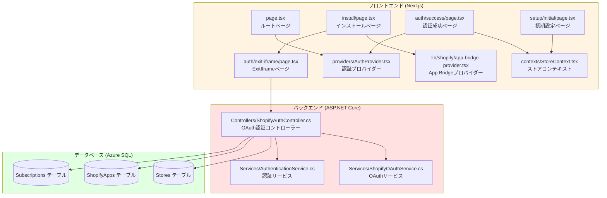
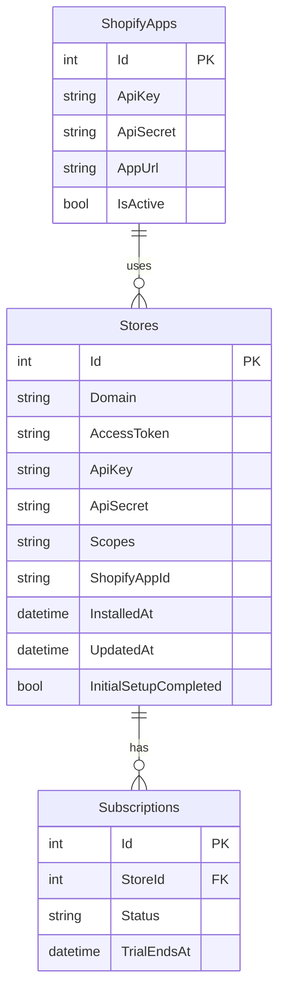

# Shopifyアプリ インストール機能 ソースコード洗い出し

## 作成日
2025-12-29

## 目的
OAuth認証フロー全体を通して、各ステップで使用されるソースコードを洗い出し、調査・リファクタの対象を明確にする。

---

## 📁 ソースコード構成図



---

## 📁 フロントエンド ソースコード

### Step 1: ルートページ (`/`)

**ファイル**: `frontend/src/app/page.tsx`

**主要な処理**:
- `useAuth()`: 認証状態の取得
- `useEffect()`: 認証状態に基づくリダイレクト処理
- `processRedirect()`: リダイレクト処理の実装

**関連ファイル**:
- `frontend/src/components/providers/AuthProvider.tsx` - 認証プロバイダー
- `frontend/src/lib/config/environments.ts` - 環境設定

**確認すべき関数・メソッド**:
- `getCurrentEnvironmentConfig()`: 環境設定の取得
- `getAuthModeConfig()`: 認証モード設定の取得
- `buildRedirectUrl()`: リダイレクトURLの構築

---

### Step 2: インストールページ (`/install`)

**ファイル**: `frontend/src/app/install/page.tsx`

**主要な処理**:
- `useEffect()`: URLパラメータの取得と自動入力
- `handleInstall()`: インストール処理の開始
- `normalizeShopDomain()`: ショップドメインの正規化
- `toSubdomainInput()`: サブドメイン入力への変換

**関連ファイル**:
- `frontend/src/app/auth/exit-iframe/page.tsx` - ExitIframeページ
- `frontend/src/lib/shopify/app-bridge-provider.tsx` - App Bridgeプロバイダー
- `frontend/src/lib/config/environments.ts` - 環境設定

**確認すべき関数・メソッド**:
- `useIsEmbedded()`: 埋め込みアプリ判定
- `useAppBridge()`: App Bridgeインスタンスの取得
- `Redirect.toApp()`: App Bridgeリダイレクト

---

### Step 3: ExitIframeページ (`/auth/exit-iframe`)

**ファイル**: `frontend/src/app/auth/exit-iframe/page.tsx`

**主要な処理**:
- `useEffect()`: iframe脱出処理
- `window.top.location.href`: 外部URLへのリダイレクト
- `Redirect.toApp()`: 相対パスへのリダイレクト

**関連ファイル**:
- `frontend/src/lib/shopify/app-bridge-provider.tsx` - App Bridgeプロバイダー

**確認すべき関数・メソッド**:
- `useAppBridge()`: App Bridgeインスタンスの取得

---

### Step 4: OAuth認証成功ページ (`/auth/success`)

**ファイル**: `frontend/src/app/auth/success/page.tsx`

**主要な処理**:
- `useEffect()`: 認証成功後の処理
- `handleAuthCallback()`: 認証コールバック処理
- `refreshStores()`: ストア一覧の更新
- `setCurrentStore()`: 現在のストアの設定
- `markAuthenticated()`: 認証状態の設定

**関連ファイル**:
- `frontend/src/contexts/StoreContext.tsx` - ストアコンテキスト
- `frontend/src/components/providers/AuthProvider.tsx` - 認証プロバイダー

**確認すべき関数・メソッド**:
- `refreshStores()`: ストア一覧の更新
- `setCurrentStore()`: 現在のストアの設定
- `markAuthenticated()`: 認証状態の設定

---

## 🔧 バックエンド ソースコード

### Step 4: OAuth URL生成 (`/api/shopify/install`)

**ファイル**: `backend/ShopifyAnalyticsApi/Controllers/ShopifyAuthController.cs`

**主要なメソッド**:
- `Install()`: インストール開始エンドポイント
- `BuildOAuthUrlAsync()`: OAuth URL生成
- `GetRedirectUri()`: リダイレクトURI生成
- `GetShopifyCredentialsAsync()`: API Key/Secretの取得
- `GenerateRandomString()`: ランダム文字列生成（state用）

**関連ファイル**:
- `backend/ShopifyAnalyticsApi/Services/ShopifyOAuthService.cs` - OAuthサービス
- `backend/ShopifyAnalyticsApi/Data/ShopifyDbContext.cs` - データベースコンテキスト

**確認すべきメソッド**:
- `GetShopifySetting()`: 設定値の取得
- `GetApiSecretByApiKeyAsync()`: API Secretの取得
- `GetShopifyCredentialsAsync()`: API Key/Secretの取得

---

### Step 6: OAuthコールバック処理 (`/api/shopify/callback`)

**ファイル**: `backend/ShopifyAnalyticsApi/Controllers/ShopifyAuthController.cs`

**主要なメソッド**:
- `Callback()`: OAuthコールバック処理エンドポイント
- `ExchangeCodeForAccessTokenWithRetry()`: アクセストークンの取得
- `ProcessOAuthSuccessAsync()`: OAuth認証成功後の共通処理
- `SaveOrUpdateStore()`: ストア情報の保存・更新
- `RegisterWebhooks()`: Webhook登録
- `EnsureTrialSubscriptionAsync()`: トライアルサブスクリプションの付与
- `BuildRedirectUrlAsync()`: OAuth認証成功後のリダイレクトURL生成
- `SetOAuthSessionCookie()`: セッションCookieの設定

**関連ファイル**:
- `backend/ShopifyAnalyticsApi/Services/ShopifyOAuthService.cs` - OAuthサービス
- `backend/ShopifyAnalyticsApi/Services/AuthenticationService.cs` - 認証サービス
- `backend/ShopifyAnalyticsApi/Data/ShopifyDbContext.cs` - データベースコンテキスト

**確認すべきメソッド**:
- `VerifyHmac()`: HMAC検証
- `ExchangeCodeForAccessTokenWithRetry()`: アクセストークンの取得（リトライ機能付き）
- `SaveOrUpdateStore()`: ストア情報の保存・更新
- `RegisterWebhooks()`: Webhook登録
- `EnsureTrialSubscriptionAsync()`: トライアルサブスクリプションの付与
- `GetShopifyAppUrlAsync()`: アプリURLの取得
- `DecodeHost()`: hostパラメータのデコード

---

## 📊 データベース テーブル

### テーブル関係図



### Stores テーブル

**用途**: ストア情報の保存

**主要なカラム**:
- `Id`: ストアID（主キー）
- `Domain`: ショップドメイン
- `AccessToken`: アクセストークン
- `ApiKey`: API Key
- `ApiSecret`: API Secret
- `Scopes`: 承認されたスコープ
- `ShopifyAppId`: Shopify App ID
- `InstalledAt`: インストール日時
- `UpdatedAt`: 更新日時
- `InitialSetupCompleted`: 初期設定完了フラグ

**関連メソッド**:
- `SaveOrUpdateStore()`: ストア情報の保存・更新

---

### ShopifyApps テーブル

**用途**: Shopifyアプリ設定の保存

**主要なカラム**:
- `Id`: アプリID（主キー）
- `ApiKey`: API Key
- `ApiSecret`: API Secret
- `AppUrl`: アプリURL（フロントエンドURL）
- `IsActive`: 有効フラグ

**関連メソッド**:
- `GetShopifyCredentialsAsync()`: API Key/Secretの取得
- `GetShopifyAppUrlAsync()`: アプリURLの取得

---

### Subscriptions テーブル

**用途**: サブスクリプション情報の保存

**主要なカラム**:
- `Id`: サブスクリプションID（主キー）
- `StoreId`: ストアID（外部キー）
- `Status`: サブスクリプションステータス
- `TrialEndsAt`: トライアル終了日時

**関連メソッド**:
- `EnsureTrialSubscriptionAsync()`: トライアルサブスクリプションの付与

---

## 🔍 調査・リファクタ対象

### 優先度マップ

```mermaid
graph TB
    Root[調査・リファクタ対象]
    
    High[優先度: 高]
    Medium[優先度: 中]
    Low[優先度: 低]
    
    Root --> High
    Root --> Medium
    Root --> Low
    
    High --> ErrorHandling[OAuth認証フローのエラーハンドリング]
    High --> RedirectUri[リダイレクトURIの生成ロジック]
    High --> StateParam[stateパラメータの管理]
    High --> StoreSave[ストア情報の保存・更新]
    
    ErrorHandling --> ErrorHandling1[各ステップでのエラー処理]
    ErrorHandling --> ErrorHandling2[エラーメッセージの適切性]
    ErrorHandling --> ErrorHandling3[エラーログの出力]
    
    RedirectUri --> RedirectUri1[GetRedirectUri]
    RedirectUri --> RedirectUri2[BuildRedirectUrlAsync]
    RedirectUri --> RedirectUri3[Shopify Partners Dashboardとの整合性]
    
    StateParam --> StateParam1[stateの生成・保存・検証]
    StateParam --> StateParam2[CSRF対策の有効性]
    StateParam --> StateParam3[キャッシュの有効期限]
    
    StoreSave --> StoreSave1[SaveOrUpdateStore]
    StoreSave --> StoreSave2[重複チェック]
    StoreSave --> StoreSave3[トランザクション処理]
    
    Medium --> Webhook[Webhook登録]
    Medium --> Trial[トライアルサブスクリプションの付与]
    Medium --> ExitIframe[iframe脱出処理]
    
    Webhook --> Webhook1[RegisterWebhooks]
    Webhook --> Webhook2[エラーハンドリング]
    Webhook --> Webhook3[リトライ処理]
    
    Trial --> Trial1[EnsureTrialSubscriptionAsync]
    Trial --> Trial2[重複チェック]
    Trial --> Trial3[エラーハンドリング]
    
    ExitIframe --> ExitIframe1[ExitIframePage]
    ExitIframe --> ExitIframe2[外部URLと相対パスの処理分岐]
    ExitIframe --> ExitIframe3[エラーハンドリング]
    
    Low --> AuthState[認証状態の管理]
    Low --> StoreRefresh[ストア一覧の更新]
    
    AuthState --> AuthState1[AuthProvider]
    AuthState --> AuthState2[localStorage/sessionStorageの使い分け]
    AuthState --> AuthState3[認証状態の同期]
    
    StoreRefresh --> StoreRefresh1[refreshStores]
    StoreRefresh --> StoreRefresh2[タイムアウト処理]
    StoreRefresh --> StoreRefresh3[エラーハンドリング]
    
    style Root fill:#e1f5ff
    style High fill:#ffcccc
    style Medium fill:#fff4e1
    style Low fill:#e1ffe1
```



### 優先度: 高

1. **OAuth認証フローの各ステップでのエラーハンドリング**
   - 各ステップでのエラー処理が適切か確認
   - エラーメッセージが適切か確認
   - エラーログが適切に出力されているか確認

2. **リダイレクトURIの生成ロジック**
   - `GetRedirectUri()`: バックエンドURLの取得方法
   - `BuildRedirectUrlAsync()`: フロントエンドURLの生成方法
   - Shopify Partners Dashboardの設定との整合性

3. **stateパラメータの管理**
   - `state`の生成・保存・検証ロジック
   - CSRF対策としての有効性
   - キャッシュの有効期限（10分）

4. **ストア情報の保存・更新**
   - `SaveOrUpdateStore()`: ストア情報の保存・更新ロジック
   - 重複チェック
   - トランザクション処理

### 優先度: 中

5. **Webhook登録**
   - `RegisterWebhooks()`: Webhook登録ロジック
   - エラーハンドリング
   - リトライ処理

6. **トライアルサブスクリプションの付与**
   - `EnsureTrialSubscriptionAsync()`: トライアルサブスクリプションの付与ロジック
   - 重複チェック
   - エラーハンドリング

7. **iframe脱出処理**
   - `ExitIframePage`: iframe脱出処理の実装
   - 外部URLと相対パスの処理分岐
   - エラーハンドリング

### 優先度: 低

8. **認証状態の管理**
   - `AuthProvider`: 認証状態の管理ロジック
   - `localStorage`と`sessionStorage`の使い分け
   - 認証状態の同期

9. **ストア一覧の更新**
   - `refreshStores()`: ストア一覧の更新ロジック
   - タイムアウト処理（5秒）
   - エラーハンドリング

---

## 📝 調査チェックリスト

### Step 1: ルートページ

- [ ] `AuthProvider`の初期化が正常に完了しているか
- [ ] `isInitializing`、`isApiClientReady`の値が正しいか
- [ ] URLパラメータが正しく取得できているか
- [ ] リダイレクト先が正しいか
- [ ] タイムアウト処理が正常に動作しているか

### Step 2: インストールページ

- [ ] URLパラメータが正しく取得できているか
- [ ] `sessionStorage`に`shopify_host`が正しく保存されているか
- [ ] ショップドメインの自動入力が正常に動作しているか
- [ ] 「接続を開始」ボタンのクリックイベントが正常に動作しているか
- [ ] 埋め込みアプリの場合、`/auth/exit-iframe`へのリダイレクトが正常に動作しているか

### Step 3: ExitIframeページ

- [ ] `redirectUri`パラメータが正しく取得できているか
- [ ] 外部URLの場合、`window.top.location.href`が正常に動作しているか
- [ ] 相対パスの場合、App Bridgeの`Redirect.toApp()`が正常に動作しているか
- [ ] iframeから正常に脱出できているか

### Step 4: OAuth URL生成

- [ ] ショップドメインが正しく検証されているか
- [ ] API Key/Secretが正しく取得できているか
- [ ] `state`パラメータが正しく生成・保存されているか
- [ ] OAuth URLが正しく生成されているか
- [ ] リダイレクトURIが正しく設定されているか
- [ ] スコープが正しく設定されているか

### Step 5: Shopify OAuth認証画面

- [ ] OAuth認証画面が正常に表示されているか
- [ ] 必要なスコープが表示されているか
- [ ] ユーザーが「インストール」ボタンをクリックした後、正しいコールバックURLにリダイレクトされているか

### Step 6: OAuthコールバック処理

- [ ] パラメータが正しく取得できているか
- [ ] `state`の検証が正常に動作しているか
- [ ] HMAC検証が正常に動作しているか
- [ ] アクセストークンの取得が正常に動作しているか
- [ ] `Stores`テーブルにレコードが正しく作成・更新されているか
- [ ] Webhook登録が正常に動作しているか
- [ ] トライアルサブスクリプションの付与が正常に動作しているか
- [ ] リダイレクトURLが正しく生成されているか

### Step 7: OAuth認証成功ページ

- [ ] URLパラメータが正しく取得できているか
- [ ] `sessionStorage`から`shopify_host`、`shopify_shop`が正しく復元できているか
- [ ] `refreshStores()`が正常に動作しているか
- [ ] `storeId`が正しく取得できているか
- [ ] `markAuthenticated()`が正常に動作しているか
- [ ] `localStorage`に認証情報が正しく保存されているか
- [ ] `/setup/initial`へのリダイレクトが正常に動作しているか

---

## 🔍 デバッグ用ログ追加ガイド

### フロントエンド共通パターン

#### ページマウント時
```typescript
// ページマウント時
console.log(`🚀 [${ページ名}] マウント`, { 
  url: window.location.href,
  searchParams: Object.fromEntries(new URLSearchParams(window.location.search))
});
```

#### 処理開始時
```typescript
// 処理開始時
console.log(`🔄 [${ページ名}] ${処理名}開始`, { パラメータ });
```

#### 成功時
```typescript
// 成功時
console.log(`✅ [${ページ名}] ${処理名}成功`, { 結果 });
```

#### エラー時
```typescript
// エラー時
console.error(`❌ [${ページ名}] ${処理名}失敗`, { error });
```

#### リダイレクト時
```typescript
// リダイレクト時
console.log(`➡️ [${ページ名}] リダイレクト`, { destination });
```

### バックエンド共通パターン

#### メソッド開始時
```csharp
// メソッド開始時
_logger.LogInformation("{Method} called. Params: {@Params}", nameof(メソッド名), new { パラメータ });
```

#### 成功時
```csharp
// 成功時
_logger.LogInformation("{Method} completed successfully. Result: {@Result}", nameof(メソッド名), new { 結果 });
```

#### エラー時
```csharp
// エラー時
_logger.LogError(ex, "{Method} failed. Params: {@Params}", nameof(メソッド名), new { パラメータ });
```

### ログ出力のベストプラクティス

1. **一貫性のあるログ形式**
   - プレフィックス（例: `[ページ名]`）を使用
   - 絵文字を使用してログの種類を視覚的に区別

2. **適切なログレベル**
   - `console.log`: 通常の情報
   - `console.warn`: 警告
   - `console.error`: エラー

3. **構造化されたデータ**
   - オブジェクト形式でログを出力
   - パラメータと結果を明確に区別

4. **パフォーマンスへの配慮**
   - 本番環境では不要なログを削除
   - 環境変数でログレベルを制御

---

## 📅 リファクタ計画（案）

### Phase 1: 緊急修正（現在の問題解決）

1. **トークン暗号化エラーの修正**
   - `EncryptToken()` メソッドのエラーハンドリング改善
   - 環境変数 `ENCRYPTION_KEY` の検証ロジック追加
   - Base64エンコード/デコードのエラー処理改善

2. **hostパラメータデコードエラーの修正**
   - `DecodeHost()` メソッドのエラーハンドリング改善
   - Shopifyから渡されるhostパラメータの形式確認
   - フォールバック処理の実装

3. **`/auth/success` ページの安定化**
   - `useEffect` の無限ループ対策の最終確認
   - `sessionStorage` の使用パターンの統一
   - エラー時のリトライ機能の追加

### Phase 2: コード品質改善

1. **エラーハンドリングの統一**
   - フロントエンド・バックエンド共通のエラーハンドリングパターン
   - エラーメッセージの標準化
   - エラーログの出力形式の統一

2. **ログ出力の標準化**
   - ログ出力の共通パターン定義
   - ログレベルの適切な使用
   - 本番環境でのログ出力制御

3. **重複コードの削除**
   - 共通処理のユーティリティ関数化
   - 重複するロジックの統合
   - コードの再利用性向上

### Phase 3: アーキテクチャ改善

1. **認証フローの簡素化**
   - OAuth認証フローのステップ数削減
   - 不要なリダイレクトの削除
   - フローの可視化とドキュメント化

2. **状態管理の整理**
   - `localStorage` / `sessionStorage` / Context の使い分け明確化
   - 状態管理の一元化
   - 状態の同期ロジックの改善

3. **テストコードの追加**
   - 単体テストの追加
   - 統合テストの追加
   - E2Eテストの追加

---

## 📚 関連ドキュメント

- [インストール機能設計書](./インストール機能設計書.md)
- [インストール機能-調査対象シーケンス](./インストール機能-調査対象シーケンス.md)
- [スコープ設定方法ガイド](./スコープ設定方法ガイド.md)

---

## 📝 更新履歴

- 2025-12-29: 初版作成
- 2025-12-29: Mermaid図を追加
  - ソースコード構成図をMermaid graph形式に追加
  - データベーステーブル関係図をMermaid erDiagram形式に追加
  - 調査・リファクタ対象の優先度マップをMermaid mindmap形式に追加