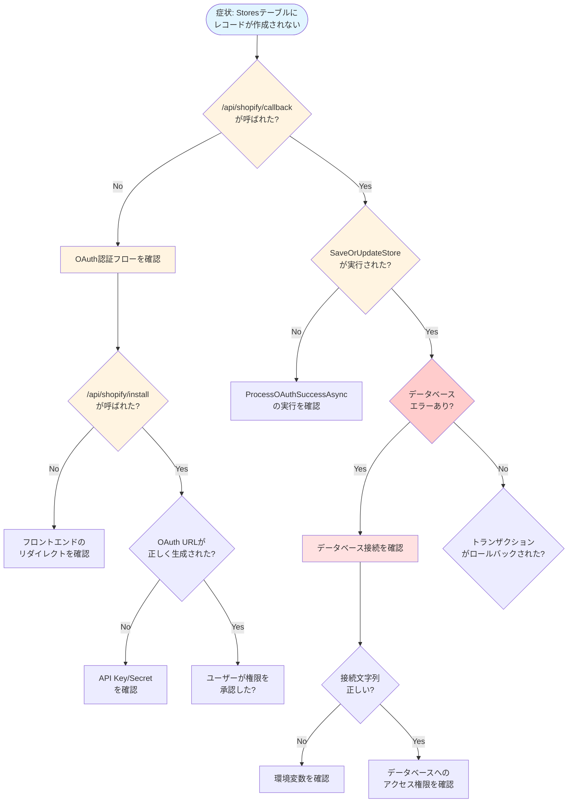
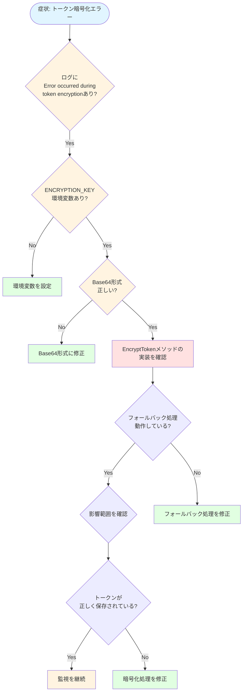
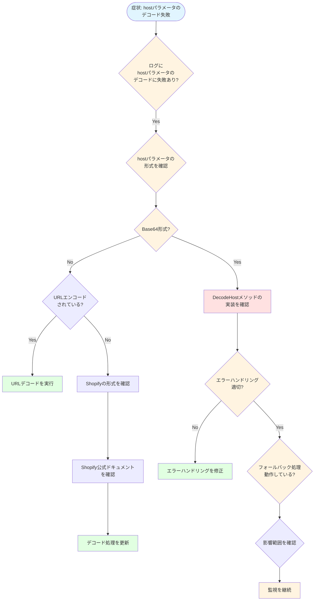

# インストール機能 トラブルシューティングガイド

## ドキュメント情報

| 項目 | 値 |
|------|-----|
| バージョン | 1.0 |
| 最終更新日 | 2025-12-29 |
| 更新者 | 福田＋AI Assistant |
| レビュー状態 | レビュー済み ✅ |

## 作成日
2025-12-29

## 目的
インストール機能で発生する問題を症状別に分類し、効率的にトラブルシューティングできるようにする。

---

## 症状別フローチャート

### 「認証状態を確認中...」から進まない場合

```mermaid
flowchart TD
    Start([症状: 認証状態を確認中から進まない]) --> CheckConsole{コンソールにエラーあり?}
    CheckConsole -->|Yes| Check401{401エラー?}
    Check401 -->|Yes| CheckAuth[認証状態を確認<br/>localStorage/sessionStorage]
    Check401 -->|No| CheckOther[他のエラーを確認]
    CheckConsole -->|No| CheckNetwork{Networkタブでリクエスト確認}
    CheckNetwork -->|リクエストなし| CheckAuthProvider[AuthProviderの初期化を確認<br/>isInitializing<br/>isApiClientReady]
    CheckNetwork -->|リクエストあり| CheckResponse[レスポンスを確認]
    
    CheckAuth --> CheckLocalStorage{localStorageに<br/>oauth_authenticatedあり?}
    CheckLocalStorage -->|No| RedirectInstall[/installにリダイレクト]
    CheckLocalStorage -->|Yes| CheckStoreId{currentStoreIdあり?}
    CheckStoreId -->|No| CheckAPI[APIからストア情報を取得]
    CheckStoreId -->|Yes| CheckStoreAPI[/api/store APIを確認]
    
    CheckAuthProvider --> CheckInit{isInitializingが<br/>trueのまま?}
    CheckInit -->|Yes| CheckApiClient{isApiClientReadyが<br/>falseのまま?}
    CheckApiClient -->|Yes| CheckTimeout[タイムアウト処理を確認<br/>10秒]
    CheckApiClient -->|No| CheckApiCall[API呼び出しを確認]
    
    style Start fill:#e1f5ff
    style CheckConsole fill:#fff4e1
    style Check401 fill:#fff4e1
    style CheckNetwork fill:#fff4e1
    style CheckAuthProvider fill:#fff4e1
    style CheckAuth fill:#fff4e1
    style RedirectInstall fill:#e1ffe1
    style CheckStoreAPI fill:#ffe1e1
    style CheckTimeout fill:#ffcccc
```

**確認ポイント**:
1. ブラウザのコンソールログを確認
2. Networkタブでリクエストの有無を確認
3. `AuthProvider` の初期化状態を確認
4. `localStorage` / `sessionStorage` の内容を確認
5. タイムアウト処理（10秒）が正常に動作しているか確認

---

### OAuth認証後にエラーになる場合

```mermaid
flowchart TD
    Start([症状: OAuth後にエラー]) --> CheckUrl{URLにstoreIdあり?}
    CheckUrl -->|No| CheckBackend[バックエンドログで<br/>BuildRedirectUrlAsync確認]
    CheckUrl -->|Yes| CheckLocalStorage{localStorageに<br/>storeId保存された?}
    CheckLocalStorage -->|No| CheckAuthSuccess[/auth/successページの<br/>処理を確認]
    CheckLocalStorage -->|Yes| CheckApiCall[APIコール時の<br/>認証ヘッダーを確認]
    
    CheckBackend --> CheckLogs{ログに<br/>Built embedded app URL<br/>あり?}
    CheckLogs -->|No| CheckCallback[Callback処理を確認]
    CheckLogs -->|Yes| CheckRedirectUrl{リダイレクトURLに<br/>storeId含まれている?}
    CheckRedirectUrl -->|No| CheckBuildRedirect[BuildRedirectUrlAsync<br/>の実装を確認]
    CheckRedirectUrl -->|Yes| CheckFrontend[フロントエンドの<br/>URLパラメータ取得を確認]
    
    CheckAuthSuccess --> CheckProcessed{処理済みフラグ<br/>auth_success_processed<br/>あり?}
    CheckProcessed -->|Yes| CheckInfiniteLoop[無限ループの可能性]
    CheckProcessed -->|No| CheckRefreshStores[refreshStoresの<br/>実行を確認]
    
    CheckApiCall --> CheckToken{認証トークン<br/>あり?}
    CheckToken -->|No| CheckAuthProvider[AuthProviderの<br/>認証状態を確認]
    CheckToken -->|Yes| CheckTokenFormat{トークン形式<br/>正しい?}
    CheckTokenFormat -->|No| CheckEncryption[トークン暗号化<br/>エラーを確認]
    
    style Start fill:#e1f5ff
    style CheckUrl fill:#fff4e1
    style CheckBackend fill:#ffe1e1
    style CheckLocalStorage fill:#fff4e1
    style CheckAuthSuccess fill:#fff4e1
    style CheckApiCall fill:#fff4e1
    style CheckInfiniteLoop fill:#ffcccc
    style CheckEncryption fill:#ffcccc
```

**確認ポイント**:
1. URLパラメータに `storeId` が含まれているか
2. バックエンドログで `BuildRedirectUrlAsync` の実行を確認
3. `/auth/success` ページの処理を確認
4. `localStorage` に `storeId` が保存されているか
5. APIコール時の認証ヘッダーを確認

---

### `Stores`テーブルにレコードが作成されない場合



**確認ポイント**:
1. `/api/shopify/callback` が呼ばれているか（バックエンドログを確認）
2. `SaveOrUpdateStore()` が実行されているか
3. データベースエラーログを確認
4. データベース接続文字列を確認
5. トランザクションがロールバックされていないか

---

### トークン暗号化エラーが発生する場合



**確認ポイント**:
1. 環境変数 `ENCRYPTION_KEY` が設定されているか
2. `ENCRYPTION_KEY` がBase64形式で正しくエンコードされているか
3. `EncryptToken()` メソッドのエラーハンドリングを確認
4. フォールバック処理が正常に動作しているか
5. トークンが正しく保存されているか

---

### hostパラメータのデコード失敗が発生する場合



**確認ポイント**:
1. Shopifyから渡されるhostパラメータの実際の形式を確認
2. `DecodeHost()` メソッドの実装を確認
3. エラーハンドリングが適切か確認
4. フォールバック処理が正常に動作しているか
5. Shopify公式ドキュメントでhostパラメータの形式を確認

---

## よくある問題と解決策

### 問題1: 無限ループが発生する

**症状**: `/auth/success` ページで `useEffect` が繰り返し実行される

**原因**:
- 依存配列の設定が不適切
- 処理フラグの管理が不適切

**解決策**:
1. `useEffect` の依存配列を `[]` に設定（マウント時のみ実行）
2. `useRef` と `sessionStorage` を使用して処理済みフラグを管理
3. エラー時は処理フラグをリセット（再試行可能にする）

### 問題2: `storeId` が `null` になる

**症状**: フロントエンドで `storeId` が取得できない

**原因**:
- バックエンドのリダイレクトURLに `storeId` が含まれていない
- APIからの取得が失敗している

**解決策**:
1. バックエンドの `BuildRedirectUrlAsync()` で `storeId` を含める
2. APIから `storeId` を取得するフォールバック処理を実装
3. エラーハンドリングを追加

### 問題3: 401エラーが発生する

**症状**: API呼び出しで401エラーが発生する

**原因**:
- 認証が必要なAPIを認証前に呼び出している
- 認証トークンが正しく設定されていない

**解決策**:
1. 認証が必要なAPIを認証後に呼び出す
2. 認証トークンの設定を確認
3. 認証ヘッダーの設定を確認

---

## ログ確認のポイント

### フロントエンド（ブラウザのコンソール）

**重要なログ**:
- `🚀 [ページ名] マウント` - ページのマウント
- `🔄 [ページ名] 処理開始` - 処理の開始
- `✅ [ページ名] 処理成功` - 処理の成功
- `❌ [ページ名] 処理失敗` - 処理の失敗
- `➡️ [ページ名] リダイレクト` - リダイレクト

### バックエンド（Application Insights / ログファイル）

**重要なログ**:
- `OAuth callback received` - OAuthコールバック受信
- `State validation successful` - state検証成功
- `Access token obtained successfully` - アクセストークン取得成功
- `Built embedded app URL` - リダイレクトURL生成
- `Error occurred during token encryption` - トークン暗号化エラー
- `hostパラメータのデコードに失敗` - hostパラメータデコード失敗

---

## 関連ドキュメント

- [インストール機能設計書](./インストール機能設計書.md)
- [インストール機能-調査対象シーケンス](./インストール機能-調査対象シーケンス.md)
- [インストール機能-ソースコード洗い出し](./インストール機能-ソースコード洗い出し.md)
- [スコープ設定方法ガイド](./スコープ設定方法ガイド.md)

---

## 📝 更新履歴

- 2025-12-29: 初版作成
  - 症状別フローチャートを追加
  - よくある問題と解決策を追加
  - ログ確認のポイントを追加
- 2025-12-29: ドキュメント改善
  - ドキュメント情報テーブルを追加
  - 関連ドキュメントセクションを強化
