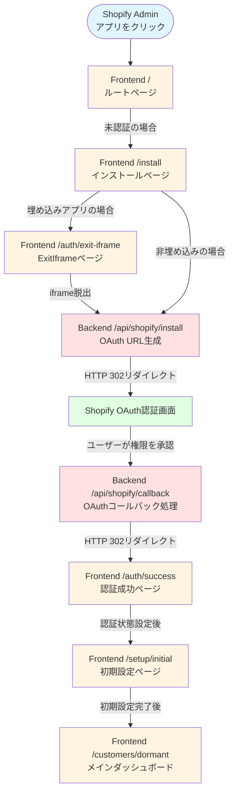
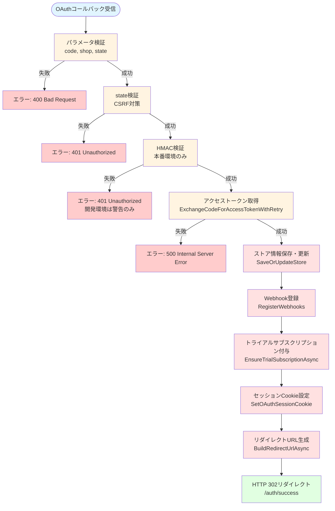
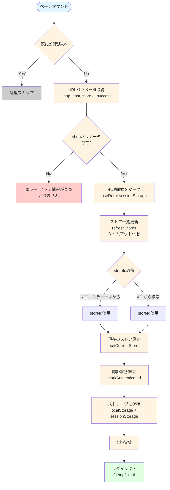

# Shopifyアプリ インストール機能 調査対象シーケンス

## 作成日
2025-12-29

## 目的
ECRangerアプリのShopifyストアへのインストール機能が正常に動作していない問題を調査するため、OAuth認証フロー全体を通して各ステップでの動作を確認し、問題箇所を特定する。

---

## 🔄 完全なOAuth認証フロー

### フロー図



---

## 📋 調査対象シーケンス（各ステップの詳細）

### Step 1: Shopify Admin → Frontend `/` (ルートページ)

**ファイル**: `frontend/src/app/page.tsx`

**処理フロー**:

```mermaid
flowchart TD
    Start([ページマウント]) --> CheckProcessed{既に処理済み?}
    CheckProcessed -->|Yes| Skip[処理スキップ]
    CheckProcessed -->|No| WaitInit{初期化完了?<br/>isInitializing<br/>isApiClientReady}
    WaitInit -->|No| Wait[待機]
    Wait --> WaitInit
    WaitInit -->|Yes| CheckAuth{認証状態}
    CheckAuth -->|未認証| CheckShop{Shopify Admin<br/>からアクセス?<br/>shop/hostパラメータ}
    CheckShop -->|Yes| WaitOAuth[リダイレクトしない<br/>Shopify側のOAuthフローを待つ]
    CheckShop -->|No| CheckDev{開発環境<br/>デモモード許可?}
    CheckDev -->|Yes| RedirectSelect[/auth/select<br/>にリダイレクト]
    CheckDev -->|No| RedirectInstall[/install<br/>にリダイレクト]
    CheckAuth -->|認証済み| CheckStore[/api/store<br/>でストア確認]
    CheckStore -->|ストア存在| RedirectDashboard[/customers/dormant<br/>にリダイレクト]
    CheckStore -->|ストア不存在| ClearAuth[認証情報クリア]
    ClearAuth --> CheckDev
    Start --> Timeout[タイムアウト: 10秒]
    Timeout --> RedirectInstall
    
    style Start fill:#e1f5ff
    style CheckProcessed fill:#fff4e1
    style WaitInit fill:#fff4e1
    style CheckAuth fill:#fff4e1
    style CheckShop fill:#fff4e1
    style CheckDev fill:#fff4e1
    style CheckStore fill:#fff4e1
    style RedirectSelect fill:#e1ffe1
    style RedirectInstall fill:#e1ffe1
    style RedirectDashboard fill:#e1ffe1
    style WaitOAuth fill:#fff4e1
    style ClearAuth fill:#ffe1e1
    style Skip fill:#cccccc
    style Wait fill:#cccccc
    style Timeout fill:#ffcccc
```

**処理内容**:
- `AuthProvider`の初期化を待機（`isInitializing`、`isApiClientReady`を確認）
- 認証状態をチェック
- 未認証の場合:
  - Shopify Adminからアクセスされている場合（`shop`または`host`パラメータがある場合）:
    - リダイレクトしない（Shopify側のOAuthフローを待つ）
  - それ以外:
    - 開発環境でデモモードが許可されている場合 → `/auth/select`にリダイレクト
    - それ以外 → `/install`にリダイレクト
- 認証済みの場合:
  - `/api/store`を呼び出してストアの存在を確認
  - ストアが存在する場合 → `/customers/dormant`にリダイレクト
  - ストアが存在しない場合 → 認証情報をクリアして未認証として扱う

**確認ポイント**:
- [ ] `AuthProvider`の初期化が正常に完了しているか
- [ ] `isInitializing`、`isApiClientReady`の値が正しいか
- [ ] URLパラメータ（`shop`、`host`、`embedded`、`hmac`、`timestamp`）が正しく取得できているか
- [ ] リダイレクト先が正しいか
- [ ] タイムアウト処理（10秒）が正常に動作しているか

**ログ確認**:
- `🔄 [ルートページ] useEffect実行`
- `🚀 [ルートページ] リダイレクト処理を開始します`
- `🔍 [ルートページ] 認証状態をチェック`

---

### Step 2: Frontend `/install` (インストールページ)

**ファイル**: `frontend/src/app/install/page.tsx`

**処理フロー**:

```mermaid
flowchart TD
    Start([ページマウント]) --> GetParams[URLパラメータ取得<br/>shop, host]
    GetParams --> SaveHost[hostをsessionStorageに保存<br/>shopify_host]
    GetParams --> CheckShop{shopパラメータ<br/>存在?}
    CheckShop -->|Yes| AutoInput[ショップドメイン自動入力<br/>ロック状態]
    CheckShop -->|No| WaitInput[ユーザー入力待ち]
    AutoInput --> CheckAuth{認証済み?}
    CheckAuth -->|Yes| CheckStore[登録済みストア確認]
    CheckStore -->|存在| RedirectDashboard[/customers/dormant<br/>にリダイレクト]
    CheckStore -->|不存在| WaitButton[「接続を開始」ボタン待ち]
    CheckAuth -->|No| WaitButton
    WaitInput --> WaitButton
    WaitButton --> UserClick[ユーザーが「接続を開始」<br/>ボタンをクリック]
    UserClick --> CheckEmbedded{埋め込みアプリ?}
    CheckEmbedded -->|Yes| RedirectExitIframe[/auth/exit-iframe<br/>にリダイレクト<br/>redirectUri=バックエンド/api/shopify/install]
    CheckEmbedded -->|No| RedirectBackend[直接バックエンド<br/>/api/shopify/install<br/>にリダイレクト]
    
    style Start fill:#e1f5ff
    style GetParams fill:#fff4e1
    style SaveHost fill:#fff4e1
    style CheckShop fill:#fff4e1
    style AutoInput fill:#fff4e1
    style CheckAuth fill:#fff4e1
    style CheckStore fill:#fff4e1
    style WaitButton fill:#fff4e1
    style UserClick fill:#fff4e1
    style CheckEmbedded fill:#fff4e1
    style RedirectExitIframe fill:#e1ffe1
    style RedirectBackend fill:#e1ffe1
    style RedirectDashboard fill:#e1ffe1
    style WaitInput fill:#cccccc
```

**処理内容**:
1. URLパラメータから`shop`、`host`を取得
2. `host`パラメータを`sessionStorage`に保存（OAuth認証フローで引き継ぐため）
3. `shop`パラメータがある場合:
   - ショップドメインを自動入力（ロック状態）
   - 認証済みの場合、登録済みストアをチェック
   - 登録済みストアが見つかった場合 → `/customers/dormant`にリダイレクト
4. ユーザーが「接続を開始」ボタンをクリック
5. 埋め込みアプリの場合:
   - `/auth/exit-iframe`ページにリダイレクト（`redirectUri`パラメータにバックエンドの`/api/shopify/install`を指定）
6. 非埋め込みの場合:
   - 直接バックエンドの`/api/shopify/install`にリダイレクト

**確認ポイント**:
- [ ] URLパラメータ（`shop`、`host`）が正しく取得できているか
- [ ] `sessionStorage`に`shopify_host`が正しく保存されているか
- [ ] ショップドメインの自動入力が正常に動作しているか
- [ ] 「接続を開始」ボタンのクリックイベントが正常に動作しているか
- [ ] 埋め込みアプリの場合、`/auth/exit-iframe`へのリダイレクトが正常に動作しているか
- [ ] 非埋め込みアプリの場合、バックエンドの`/api/shopify/install`へのリダイレクトが正常に動作しているか

**ログ確認**:
- `💾 hostパラメータを保存`
- `🖼️ 埋め込みアプリモード: ExitIframeページにリダイレクト`
- `🔄 ExitIframeページURL`

---

### Step 3: Frontend `/auth/exit-iframe` (ExitIframeページ)

**ファイル**: `frontend/src/app/auth/exit-iframe/page.tsx`

**処理フロー**:

```mermaid
flowchart TD
    Start([ページマウント]) --> GetRedirectUri[redirectUriパラメータ取得]
    GetRedirectUri --> CheckUri{redirectUri<br/>存在?}
    CheckUri -->|No| Error1[エラー: リダイレクト先が指定されていません]
    CheckUri -->|Yes| CheckUrlType{URLタイプ}
    CheckUrlType -->|外部URL<br/>http:// or https://| UseTopLocation[window.top.location.href<br/>でトップフレームにリダイレクト]
    CheckUrlType -->|相対パス| CheckAppBridge{App Bridge<br/>利用可能?}
    CheckAppBridge -->|No| Error2[エラー: App Bridgeが利用できません]
    CheckAppBridge -->|Yes| UseAppBridge[Redirect.toApp()<br/>でリダイレクト]
    UseTopLocation --> Success[リダイレクト成功]
    UseAppBridge --> Success
    
    style Start fill:#e1f5ff
    style GetRedirectUri fill:#fff4e1
    style CheckUri fill:#fff4e1
    style CheckUrlType fill:#fff4e1
    style CheckAppBridge fill:#fff4e1
    style UseTopLocation fill:#e1ffe1
    style UseAppBridge fill:#e1ffe1
    style Success fill:#e1ffe1
    style Error1 fill:#ffcccc
    style Error2 fill:#ffcccc
```

**処理内容**:
1. URLパラメータから`redirectUri`を取得
2. `redirectUri`が外部URL（`http://`または`https://`で始まる）の場合:
   - `window.top.location.href`を使用してトップフレーム全体をリダイレクト
   - App Bridgeが利用できない場合でも動作する
3. `redirectUri`が相対パスの場合:
   - App Bridgeの`Redirect.toApp()`を使用してリダイレクト
   - App Bridgeが利用できない場合はエラーを表示

**確認ポイント**:
- [ ] `redirectUri`パラメータが正しく取得できているか
- [ ] 外部URLの場合、`window.top.location.href`が正常に動作しているか
- [ ] 相対パスの場合、App Bridgeの`Redirect.toApp()`が正常に動作しているか
- [ ] iframeから正常に脱出できているか

**ログ確認**:
- `🖼️ [ExitIframe] iframe脱出処理を開始`
- `📍 [ExitIframe] リダイレクト先`
- `🌐 [ExitIframe] 外部URLを検出: トップフレームにリダイレクト`
- `✅ [ExitIframe] トップフレームへのリダイレクトを実行しました`

---

### Step 4: Backend `/api/shopify/install` (OAuth URL生成)

**ファイル**: `backend/ShopifyAnalyticsApi/Controllers/ShopifyAuthController.cs`
**メソッド**: `Install()`

**処理フロー**:

```mermaid
flowchart TD
    Start([/api/shopify/install<br/>リクエスト受信]) --> ValidateShop[ショップドメイン検証]
    ValidateShop -->|失敗| Error1[エラー: 400 Bad Request]
    ValidateShop -->|成功| GetCredentials[API Key/Secret取得<br/>マルチアプリ対応]
    GetCredentials -->|失敗| Error2[エラー: API Key/Secret not found]
    GetCredentials -->|成功| GenerateState[state生成<br/>CSRF対策用<br/>32文字ランダム文字列]
    GenerateState --> SaveState[stateをキャッシュに保存<br/>10分間有効]
    SaveState --> GetScopes[スコープ取得<br/>read_all_orders,read_orders,<br/>read_products,read_customers]
    GetScopes --> BuildOAuthUrl[OAuth URL生成<br/>BuildOAuthUrlAsync]
    BuildOAuthUrl --> GetRedirectUri[リダイレクトURI取得<br/>GetRedirectUri<br/>バックエンドURL]
    GetRedirectUri --> BuildAuthUrl[認証URL構築<br/>https://{shop}/admin/oauth/authorize]
    BuildAuthUrl --> Redirect[HTTP 302リダイレクト<br/>Shopify OAuth認証画面]
    
    style Start fill:#e1f5ff
    style ValidateShop fill:#ffe1e1
    style GetCredentials fill:#ffe1e1
    style GenerateState fill:#ffe1e1
    style SaveState fill:#ffe1e1
    style GetScopes fill:#ffe1e1
    style BuildOAuthUrl fill:#ffe1e1
    style GetRedirectUri fill:#ffe1e1
    style BuildAuthUrl fill:#ffe1e1
    style Redirect fill:#e1ffe1
    style Error1 fill:#ffcccc
    style Error2 fill:#ffcccc
```

**処理内容**:
1. ショップドメインの検証
2. API Key/Secretの取得（マルチアプリ対応）
3. CSRF対策用の`state`を生成してキャッシュに保存
4. OAuth URLを生成（`BuildOAuthUrlAsync()`）
5. Shopify OAuth認証画面にHTTP 302リダイレクト

**確認ポイント**:
- [ ] ショップドメインが正しく検証されているか
- [ ] API Key/Secretが正しく取得できているか
- [ ] `state`パラメータが正しく生成・保存されているか
- [ ] OAuth URLが正しく生成されているか
- [ ] リダイレクトURI（`GetRedirectUri()`）が正しく設定されているか
- [ ] スコープ（`read_all_orders,read_orders,read_products,read_customers`）が正しく設定されているか
- [ ] HTTP 302リダイレクトが正常に動作しているか

**ログ確認**:
- `OAuth scopes: {Scopes}`
- `Redirect URI generated: BackendUrl={BackendUrl}, RedirectUri={RedirectUri}`
- `OAuth URL generated: {OAuthUrl}`

**関連メソッド**:
- `GetRedirectUri()`: リダイレクトURI生成（バックエンドURLを使用）
- `BuildOAuthUrlAsync()`: OAuth URL生成の共通メソッド
- `GetShopifyCredentialsAsync()`: API Key/Secretの取得

---

### Step 5: Shopify OAuth認証画面

**外部サービス**: Shopify OAuth認証画面

**処理内容**:
- ユーザーが権限を承認
- Shopifyがバックエンドの`/api/shopify/callback`にリダイレクト（`code`、`shop`、`state`、`host`パラメータ付き）

**確認ポイント**:
- [ ] OAuth認証画面が正常に表示されているか
- [ ] 必要なスコープ（`read_all_orders,read_orders,read_products,read_customers`）が表示されているか
- [ ] ユーザーが「インストール」ボタンをクリックした後、正しいコールバックURLにリダイレクトされているか

**注意事項**:
- Shopify Partners Dashboardの「Redirect URLs」設定を確認
- バックエンドの`/api/shopify/callback`が正しく登録されているか確認

---

### Step 6: Backend `/api/shopify/callback` (OAuthコールバック処理)

**ファイル**: `backend/ShopifyAnalyticsApi/Controllers/ShopifyAuthController.cs`
**メソッド**: `Callback()`

**処理フロー**:



**処理内容**:
1. パラメータ検証（`code`、`shop`、`state`）
2. `state`の検証（CSRF対策）
3. HMAC検証（本番環境のみ）
4. アクセストークンの取得（`ExchangeCodeForAccessTokenWithRetry()`）
5. ストア情報の保存・更新（`SaveOrUpdateStore()`）
6. Webhook登録（`RegisterWebhooks()`）
7. トライアルサブスクリプションの付与（`EnsureTrialSubscriptionAsync()`）
8. `BuildRedirectUrlAsync()`を使用してフロントエンドの`/auth/success`にリダイレクト

**確認ポイント**:
- [ ] パラメータ（`code`、`shop`、`state`）が正しく取得できているか
- [ ] `state`の検証が正常に動作しているか
- [ ] HMAC検証が正常に動作しているか（本番環境）
- [ ] アクセストークンの取得が正常に動作しているか
- [ ] `Stores`テーブルにレコードが正しく作成・更新されているか
- [ ] Webhook登録が正常に動作しているか
- [ ] トライアルサブスクリプションの付与が正常に動作しているか
- [ ] `BuildRedirectUrlAsync()`が正しいリダイレクトURLを生成しているか
- [ ] HTTP 302リダイレクトが正常に動作しているか

**ログ確認**:
- `OAuth callback received`
- `State validation successful`
- `Access token obtained successfully`
- `OAuth authentication success processing completed`
- `Built embedded app URL (direct to /auth/success)`

**関連メソッド**:
- `ExchangeCodeForAccessTokenWithRetry()`: アクセストークンの取得
- `SaveOrUpdateStore()`: ストア情報の保存・更新
- `RegisterWebhooks()`: Webhook登録
- `EnsureTrialSubscriptionAsync()`: トライアルサブスクリプションの付与
- `BuildRedirectUrlAsync()`: OAuth認証成功後のリダイレクトURLを生成

---

### Step 7: Frontend `/auth/success` (認証成功ページ)

**ファイル**: `frontend/src/app/auth/success/page.tsx`

**処理フロー**:



**処理内容**:
1. URLパラメータから`shop`、`host`、`storeId`、`success`を取得
2. `shop`パラメータがない場合はエラー（必須パラメータ）
3. `storeId`や`success`がない場合は処理を続行し、APIから取得を試みる
4. `StoreContext`の`refreshStores()`を呼び出してストア一覧を更新（タイムアウト: 5秒）
5. `storeId`を設定:
   - クエリパラメータから取得（優先）
   - クエリパラメータにない場合、shopドメインからAPIで検索
6. `AuthProvider`の`markAuthenticated()`を呼び出して認証状態を設定
7. `localStorage`に`oauth_authenticated`、`currentStoreId`、`shopDomain`を保存
8. `sessionStorage`に`shopify_host`、`shopify_shop`を保存
9. 1秒後に`/setup/initial`にリダイレクト（埋め込みアプリの場合はShopify管理画面経由）

**確認ポイント**:
- [ ] URLパラメータ（`shop`、`host`、`storeId`、`success`）が正しく取得できているか
- [ ] `sessionStorage`から`shopify_host`、`shopify_shop`が正しく復元できているか
- [ ] `refreshStores()`が正常に動作しているか
- [ ] `storeId`が正しく取得できているか
- [ ] `markAuthenticated()`が正常に動作しているか
- [ ] `localStorage`に認証情報が正しく保存されているか
- [ ] `sessionStorage`に`shopify_host`、`shopify_shop`が正しく保存されているか
- [ ] `/setup/initial`へのリダイレクトが正常に動作しているか
- [ ] `useEffect`が1回のみ実行されているか（無限ループの確認）

**ログ確認**:
- `🚀 [AuthSuccess] 処理開始`
- `🔄 [AuthSuccess] handleAuthCallback開始`
- `🔐 認証コールバック受信`
- `✅ ストア一覧の更新に成功`
- `📋 クエリパラメータからStoreIdを取得`
- `🔍 [AuthSuccess] setCurrentStoreを呼び出します`
- `🔍 [AuthSuccess] markAuthenticatedを呼び出します`
- `✅ 認証状態を設定しました`

---

### Step 8: Frontend `/setup/initial` (初期設定ページ)

**ファイル**: `frontend/src/app/setup/initial/page.tsx`

**処理内容**:
- 初期設定（データ同期設定）を表示
- 初期設定が完了したら`/customers/dormant`にリダイレクト

**確認ポイント**:
- [ ] 初期設定ページが正常に表示されているか
- [ ] 初期設定が正常に完了しているか
- [ ] `/customers/dormant`へのリダイレクトが正常に動作しているか

---

## 🔍 調査手順

### 1. ブラウザの開発者ツールで確認

**Networkタブ**:
- 各ステップでのHTTPリクエスト/レスポンスを確認
- ステータスコード（200, 302, 401, 404など）を確認
- リクエスト/レスポンスのヘッダーとボディを確認

**Consoleタブ**:
- 各ステップでのログを確認
- エラーメッセージを確認
- 警告メッセージを確認

**Applicationタブ**:
- `localStorage`の内容を確認
- `sessionStorage`の内容を確認
- Cookieの内容を確認

### 2. バックエンドのログを確認

**Application Insights**または**ログファイル**:
- 各ステップでのログを確認
- エラーログを確認
- 警告ログを確認

### 3. データベースを確認

**Azure SQL Database**:
- `Stores`テーブルにレコードが作成されているか確認
- `ShopifyApps`テーブルの設定を確認
- `Subscriptions`テーブルにトライアルサブスクリプションが作成されているか確認

---

## 📝 調査結果の記録

各ステップでの調査結果を以下の形式で記録してください：

### Step X: [ステップ名]

**確認日時**: YYYY-MM-DD HH:MM:SS

**確認結果**:
- ✅ 正常に動作している
- ❌ 問題が発生している
- ⚠️ 警告が発生している

**詳細**:
- [確認内容の詳細]

**ログ**:
- [関連するログの抜粋]

**問題点**:
- [問題点の詳細]

**対応策**:
- [対応策の提案]

---

## 🔗 関連ファイル一覧

### フロントエンド

#### ページコンポーネント
- `frontend/src/app/page.tsx` - ルートページ（リダイレクト専用）
- `frontend/src/app/install/page.tsx` - インストールページ
- `frontend/src/app/auth/exit-iframe/page.tsx` - ExitIframeページ（iframe脱出処理）
- `frontend/src/app/auth/success/page.tsx` - OAuth認証成功ページ
- `frontend/src/app/setup/initial/page.tsx` - 初期設定ページ

#### プロバイダー・コンテキスト
- `frontend/src/components/providers/AuthProvider.tsx` - 認証プロバイダー
- `frontend/src/contexts/StoreContext.tsx` - ストアコンテキスト
- `frontend/src/lib/shopify/app-bridge-provider.tsx` - App Bridgeプロバイダー

### バックエンド

#### コントローラー
- `backend/ShopifyAnalyticsApi/Controllers/ShopifyAuthController.cs` - OAuth認証コントローラー
  - `Install()` - インストール開始
  - `Callback()` - OAuthコールバック処理
  - `GetRedirectUri()` - リダイレクトURI生成
  - `BuildRedirectUrlAsync()` - OAuth認証成功後のリダイレクトURL生成
  - `BuildOAuthUrlAsync()` - OAuth URL生成
  - `SaveOrUpdateStore()` - ストア情報の保存・更新
  - `RegisterWebhooks()` - Webhook登録
  - `EnsureTrialSubscriptionAsync()` - トライアルサブスクリプションの付与

#### サービス
- `backend/ShopifyAnalyticsApi/Services/ShopifyOAuthService.cs` - OAuthサービス
- `backend/ShopifyAnalyticsApi/Services/AuthenticationService.cs` - 認証サービス

---

## 🔧 環境設定確認項目

### バックエンド環境変数
- [ ] `SHOPIFY_BACKEND_BASEURL` - バックエンドのベースURL
- [ ] `SHOPIFY_API_KEY` - API Key
- [ ] `SHOPIFY_API_SECRET` - API Secret
- [ ] `ENCRYPTION_KEY` - トークン暗号化キー（Base64形式か確認）
- [ ] `ConnectionStrings:DefaultConnection` - データベース接続文字列

### フロントエンド環境変数
- [ ] `NEXT_PUBLIC_API_URL` - バックエンドAPIのURL
- [ ] `NEXT_PUBLIC_SHOPIFY_API_KEY` - Shopify API Key
- [ ] `NEXT_PUBLIC_APP_URL` - フロントエンドのURL

### Shopify Partners Dashboard設定
- [ ] App URL - フロントエンドのURL
- [ ] Allowed redirection URL(s) - バックエンドの `/api/shopify/callback`
- [ ] App Proxy設定（必要な場合）
- [ ] Required scopes - `read_all_orders,read_orders,read_products,read_customers`

### データベース設定
- [ ] `Stores`テーブルの存在確認
- [ ] `ShopifyApps`テーブルの存在確認
- [ ] `Subscriptions`テーブルの存在確認
- [ ] 接続文字列の有効性確認

---

## 📚 参考資料

- [インストール機能設計書](./インストール機能設計書.md)
- [スコープ設定方法ガイド](./スコープ設定方法ガイド.md)
- [Shopify公式ドキュメント: App installation](https://shopify.dev/docs/apps/build/authentication-authorization/app-installation)
- [Shopify公式ドキュメント: Authorization Code Grant](https://shopify.dev/docs/apps/build/authentication-authorization/access-tokens/authorization-code-grant)

---

## 📝 更新履歴

- 2025-12-29: 初版作成
- 2025-12-29: Mermaid図を追加
  - 完全なOAuth認証フロー図をMermaid flowchart形式に変換
  - 各ステップの処理フロー図を追加（Step 1, 2, 3, 4, 6, 7）