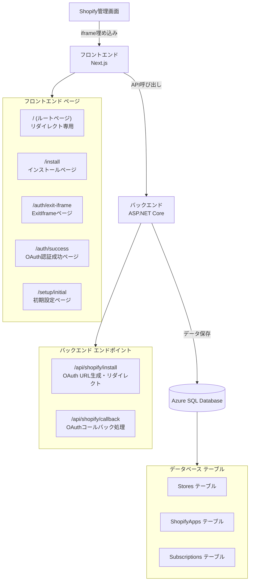
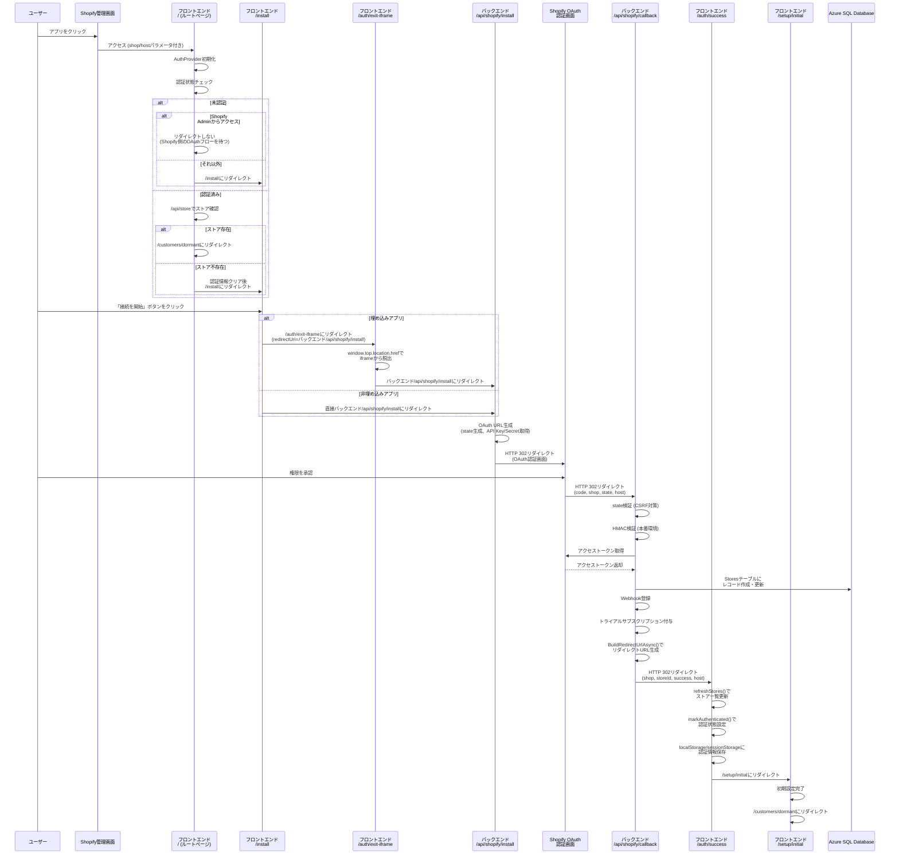
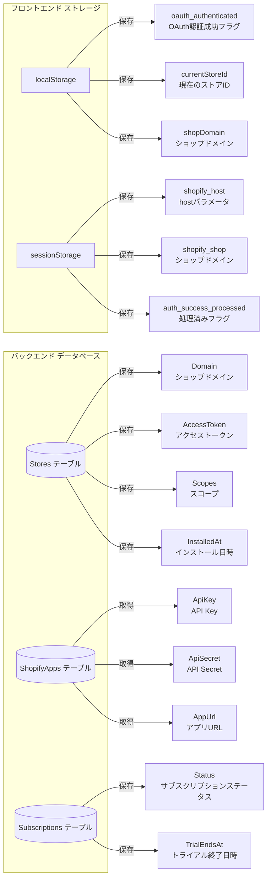

# 現状のインストール機能設計書

## ドキュメント情報

| 項目 | 値 |
|------|-----|
| バージョン | 1.3 |
| 最終更新日 | 2025-12-29 |
| 更新者 | 福田＋AI Assistant |
| レビュー状態 | レビュー済み ✅ |

## 作成日
2025-12-26

## 概要
Shopifyアプリのインストールフローに関する現状の実装設計をまとめたドキュメントです。実際のソースコードに基づいて、現在の実装状況、フロー、問題点を整理しています。

---

## 📋 目次

1. [システムアーキテクチャ](#システムアーキテクチャ)
2. [フロントエンド実装](#フロントエンド実装)
3. [バックエンド実装](#バックエンド実装)
4. [OAuth認証フロー](#oauth認証フロー)
5. [データフロー](#データフロー)
6. [現状の問題点](#現状の問題点)
7. [関連ファイル一覧](#関連ファイル一覧)

---

## 🏗️ システムアーキテクチャ

### 全体構成



### 技術スタック

#### フロントエンド
- **Next.js**: 14.2.3 (App Router)
- **React**: 18.x
- **TypeScript**: 5.x
- **@shopify/app-bridge**: v3/v4系
- **@shopify/polaris**: ^13.9.x

#### バックエンド
- **.NET**: 8.0
- **ASP.NET Core Web API**
- **Entity Framework Core**: 8.0.x
- **Azure SQL Database**

---

## 🎨 フロントエンド実装

### 1. ルートページ (`/`)

**ファイル**: `frontend/src/app/page.tsx`

**役割**: 認証状態に基づいて適切なページにリダイレクトする専用ページ

**処理フロー**:
1. `AuthProvider`の初期化を待機（`isInitializing`、`isApiClientReady`を確認）
2. 認証状態をチェック
3. 認証済みの場合:
   - デモモードの場合は `/customers/dormant` にリダイレクト（ストア確認をスキップ）
   - 通常モードの場合:
     - `/api/store`を呼び出してストアの存在を確認
     - ストアが存在する場合 → `/customers/dormant`にリダイレクト
     - ストアが存在しない場合 → 認証情報をクリアして未認証として扱う
4. 未認証の場合:
   - Shopify Adminからアクセスされている場合（`shop`または`host`パラメータがある場合）:
     - リダイレクトしない（Shopify側のOAuthフローを待つ）
   - それ以外の場合:
     - 開発環境でデモモードが許可されている場合 → `/auth/select`にリダイレクト
     - それ以外 → `/install`にリダイレクト
5. タイムアウト処理: 10秒経過しても認証状態が確定しない場合は`/install`にリダイレクト

**重要な状態管理**:
- `isInitializing`: 認証状態の初期化中フラグ
- `isApiClientReady`: APIクライアントの準備完了フラグ
- `hasProcessedRef`: 重複処理を防ぐためのref

### 2. インストールページ (`/install`)

**ファイル**: `frontend/src/app/install/page.tsx`

**役割**: Shopify OAuth認証フローの開始ページ

**処理フロー**:
1. URLパラメータから`shop`、`host`を取得
2. `host`パラメータを`sessionStorage`に保存（OAuth認証フローで引き継ぐため）
3. `shop`パラメータがある場合:
   - ショップドメインを自動入力（ロック状態）
   - 認証済みの場合、登録済みストアをチェック
   - 登録済みストアが見つかった場合 → `/customers/dormant`にリダイレクト
4. ユーザーが「接続を開始」ボタンをクリック
5. 埋め込みアプリの場合:
   - `/auth/exit-iframe`ページにリダイレクト（`redirectUri`パラメータにバックエンドの`/api/shopify/install`を指定）
   - ExitIframeページで`window.top.location.href`を使用してiframeから脱出
   - その後、バックエンドの`/api/shopify/install`にリダイレクト
6. 非埋め込みの場合:
   - 直接バックエンドの`/api/shopify/install`にリダイレクト

**重要な実装**:
- `isInstallingRef`: インストール処理中フラグ（重複実行を防ぐ）
- `hasCheckedStoreRef`: ストアチェック済みフラグ（重複実行を防ぐ）
- App Bridgeの`Redirect.toApp()`を使用したiframe脱出処理

### 3. ExitIframeページ (`/auth/exit-iframe`)

**ファイル**: `frontend/src/app/auth/exit-iframe/page.tsx`

**役割**: 埋め込みアプリのiframeから脱出するためのページ

**処理フロー**:
1. URLパラメータから`redirectUri`を取得
2. `redirectUri`が外部URL（`http://`または`https://`で始まる）の場合:
   - `window.top.location.href`を使用してトップフレーム全体をリダイレクト
   - App Bridgeが利用できない場合でも動作する
3. `redirectUri`が相対パスの場合:
   - App Bridgeの`Redirect.toApp()`を使用してリダイレクト
   - App Bridgeが利用できない場合はエラーを表示

**重要な実装**:
- 外部URLの場合は`window.top.location.href`を使用（`window.location.href`ではiframe内でしか動作しない）
- 相対パスの場合はApp Bridgeの`Redirect.toApp()`を使用

### 4. OAuth認証成功ページ (`/auth/success`)

**ファイル**: `frontend/src/app/auth/success/page.tsx`

**役割**: OAuth認証成功後の処理とリダイレクト

**処理フロー**:
1. URLパラメータから`shop`、`host`、`storeId`、`success`を取得
2. `shop`パラメータがない場合はエラー（必須パラメータ）
3. `storeId`や`success`がない場合は処理を続行し、APIから取得を試みる
4. `StoreContext`の`refreshStores()`を呼び出してストア一覧を更新（タイムアウト: 5秒）
5. `storeId`を設定:
   - クエリパラメータから取得（優先）
   - クエリパラメータにない場合、shopドメインからAPIで検索
6. `AuthProvider`の`markAuthenticated()`を呼び出して認証状態を設定
7. `localStorage`に`oauth_authenticated`、`currentStoreId`、`shopDomain`を保存
8. `sessionStorage`に`shopify_host`、`shopify_shop`を保存
9. 1秒後に`/setup/initial`にリダイレクト（埋め込みアプリの場合はShopify管理画面経由）

**重要な実装**:
- `hasProcessedRef`: 重複処理を防ぐためのref（useRefで保持）
- `sessionStorage`: コンポーネント再マウント対策として`auth_success_processed`フラグを保存
- タイムアウト処理: ストア一覧更新が5秒以内に完了しない場合は続行
- エラー時は処理フラグをリセット（再試行可能にする）

### 5. OAuthコールバックプロキシ (`/api/shopify/callback`)

**ファイル**: `frontend/src/app/api/shopify/callback/route.ts`（現在は`.backup`ファイルとして存在）

**役割**: ShopifyからのOAuthコールバックを受信し、バックエンドに転送

**注意**: 現在の実装では、OAuthコールバックは直接バックエンドの`/api/shopify/callback`に送信され、バックエンドが直接`/auth/success`にリダイレクトするため、このプロキシは使用されていない可能性があります。

**処理フロー**（過去の実装）:
1. Shopifyからのコールバックパラメータを受信（`code`、`shop`、`state`、`host`など）
2. バックエンドの`/api/shopify/callback`にPOSTリクエストを送信
3. バックエンドからのレスポンスに基づいてリダイレクト
4. 成功時: `/auth/success`にリダイレクト（`shop`、`host`、`storeId`を付与）

### 6. 認証プロバイダー (`AuthProvider`)

**ファイル**: `frontend/src/components/providers/AuthProvider.tsx`

**役割**: アプリ全体の認証状態を管理

**重要な状態**:
- `isAuthenticated`: 認証済みフラグ
- `isInitializing`: 初期化中フラグ
- `isApiClientReady`: APIクライアント準備完了フラグ
- `currentStoreId`: 現在のストアID
- `authMode`: 認証モード（`shopify`、`demo`、`null`）

**認証モード判定**:
1. 埋め込みアプリの場合: App Bridgeセッショントークンを使用
2. スタンドアロンアプリの場合:
   - `oauth_authenticated`フラグがある場合 → Cookieベース認証
   - `demoToken`がある場合 → デモモード
   - どちらもない場合 → 未認証

### 7. サブスクリプションコンテキスト (`SubscriptionContext`)

**ファイル**: `frontend/src/contexts/SubscriptionContext.tsx`

**役割**: サブスクリプション情報の管理

**重要な実装**:
- インストールページ（`/install`）とルートページ（`/`）ではAPIを呼び出さない
- 理由: 認証が必要なAPIを呼び出すと401エラーが発生するため

---

## 🔧 バックエンド実装

### 1. OAuth認証コントローラー (`ShopifyAuthController`)

**ファイル**: `backend/ShopifyAnalyticsApi/Controllers/ShopifyAuthController.cs`

#### 主要メソッド

##### `Install()` - インストール開始

**エンドポイント**: `GET /api/shopify/install`

**処理フロー**:
1. ショップドメインの検証
2. API Key/Secretの取得（マルチアプリ対応）
3. CSRF対策用の`state`を生成してキャッシュに保存
4. OAuth URLを生成
5. Shopify OAuth認証画面にHTTP 302リダイレクト

**重要な実装**:
- `BuildOAuthUrlAsync()`: OAuth URL生成の共通メソッド
- `GetRedirectUri()`: リダイレクトURI生成（バックエンドURLを使用）

##### `Callback()` - OAuthコールバック処理

**エンドポイント**: `GET /api/shopify/callback`

**処理フロー**:
1. パラメータ検証（`code`、`shop`、`state`）
2. `state`の検証（CSRF対策）
3. HMAC検証（本番環境のみ）
4. アクセストークンの取得（`ExchangeCodeForAccessTokenWithRetry()`）
5. ストア情報の保存・更新（`SaveOrUpdateStore()`）
6. Webhook登録（`RegisterWebhooks()`）
7. `BuildRedirectUrlAsync()`を使用してフロントエンドの`/auth/success`にリダイレクト

**重要な実装**:
- `GetRedirectUri()`: リダイレクトURIは常にバックエンドURLを使用
- `SaveOrUpdateStore()`: `Stores`テーブルにレコードを作成・更新
- `BuildRedirectUrlAsync()`: OAuth認証成功後のリダイレクトURLを生成
  - 埋め込みアプリの場合: `/auth/success?shop=xxx&storeId=xxx&success=true&host=xxx`
  - 非埋め込みアプリの場合: `/auth/success?shop=xxx&storeId=xxx&success=true`
  - ExitIframeページを経由せず、直接`/auth/success`にリダイレクト

#### リダイレクトURIの生成ロジック

**現在の実装** (`GetRedirectUri()`):
```csharp
private string GetRedirectUri()
{
    // バックエンドのコールバックURLを使用
    var backendUrl = Environment.GetEnvironmentVariable("SHOPIFY_BACKEND_BASEURL") ?? 
                     _configuration["Backend:BaseUrl"];
    
    if (string.IsNullOrWhiteSpace(backendUrl))
    {
        backendUrl = GetBaseUrl(); // 現在のリクエストから取得
    }
    
    var redirectUri = $"{backendUrl.TrimEnd('/')}/api/shopify/callback";
    return redirectUri;
}
```

**重要なポイント**:
- リダイレクトURIは常にバックエンドURLを使用
- フロントエンドの`/api/shopify/callback`はプロキシとして機能
- Shopify Partners DashboardにはバックエンドURLを登録する必要がある

---

## 🔄 OAuth認証フロー

### 完全なフロー図



---

## 📊 データフロー

### 認証状態の管理



#### フロントエンド側
- `localStorage`:
  - `oauth_authenticated`: OAuth認証成功フラグ
  - `currentStoreId`: 現在のストアID
  - `shopDomain`: ショップドメイン
- `sessionStorage`:
  - `shopify_host`: hostパラメータ（OAuth認証フローで引き継ぐため）
  - `shopify_shop`: ショップドメイン
  - `auth_success_processed`: 処理済みフラグ

#### バックエンド側
- `Stores`テーブル:
  - `Domain`: ショップドメイン
  - `AccessToken`: アクセストークン
  - `Scopes`: スコープ（カンマ区切り）
  - `InstalledAt`: インストール日時
  - `UpdatedAt`: 更新日時
- `ShopifyApps`テーブル:
  - `ApiKey`: API Key
  - `ApiSecret`: API Secret
  - `AppUrl`: アプリURL（フロントエンドURL）
- `Subscriptions`テーブル:
  - `Status`: サブスクリプションステータス
  - `TrialEndsAt`: トライアル終了日時

---

## ⚠️ 現状の問題点

### 問題1: 「認証状態を確認中...」画面から進まない

**症状**:
- ルートページ（`/`）で「認証状態を確認中...」と表示されたまま進まない
- `Stores`テーブルにレコードが作成されない

**考えられる原因**:
1. OAuth認証フローが完了していない
   - バックエンドの`/api/shopify/install`にリクエストが到達していない
   - バックエンドの`/api/shopify/callback`にリクエストが到達していない
2. 認証状態の初期化が完了しない
   - `AuthProvider`の`isInitializing`が`true`のまま
   - `AuthProvider`の`isApiClientReady`が`false`のまま
3. API呼び出しが失敗している
   - `/api/store`が401エラーを返す
   - `/api/subscription/status`が401エラーを返す（`SubscriptionContext`がルートページで呼び出している）

**確認すべきポイント**:
- ブラウザのコンソールログ
- バックエンドのログ（`/api/shopify/install`、`/api/shopify/callback`へのリクエスト）
- ネットワークタブ（リクエストのステータスコード）

### 問題2: `Stores`テーブルにレコードが作成されない

**症状**:
- OAuth認証フローを完了しても、`Stores`テーブルにレコードが作成されない

**考えられる原因**:
1. バックエンドの`/api/shopify/callback`が呼び出されていない
2. `SaveOrUpdateStore()`が実行されていない
3. データベースへの保存が失敗している（エラーログを確認）

**確認すべきポイント**:
- バックエンドのログ（`SaveOrUpdateStore`の実行ログ）
- データベースの接続設定
- エラーログ

### 問題3: 401エラーが発生する

**症状**:
- `/api/store`、`/api/subscription/status`、`/api/feature-selection/current`が401エラーを返す

**考えられる原因**:
1. 認証が必要なAPIを認証前に呼び出している
   - `SubscriptionContext`がルートページ（`/`）でAPIを呼び出している
   - `AuthProvider`の初期化が完了する前にAPIを呼び出している

**対応済み**:
- `SubscriptionContext`を修正して、ルートページ（`/`）とインストールページ（`/install`）ではAPIを呼び出さないようにした

### 問題4: トークン暗号化エラー（2025-12-29確認）

**症状**:
- バックエンドログに `Error occurred during token encryption` が出力される
- `System.FormatException: The input is not a valid Base-64 string` エラー

**該当箇所**:
- `ShopifyAuthController.cs` の `EncryptToken()` メソッド（line 1510付近）

**考えられる原因**:
- 暗号化キーの設定が不正
- Base64エンコード/デコードの問題
- 環境変数 `ENCRYPTION_KEY` が正しく設定されていない、またはBase64形式ではない

**確認すべきポイント**:
- 環境変数 `ENCRYPTION_KEY` の設定値
- 暗号化キーがBase64形式で正しくエンコードされているか
- `EncryptToken()` メソッドのエラーハンドリング（フォールバック処理）

**対応状況**:
- 現在はBase64エンコードにフォールバックする処理が実装されているが、根本原因の調査が必要

---

### 問題5: hostパラメータのデコード失敗（2025-12-29確認）

**症状**:
- バックエンドログに `hostパラメータのデコードに失敗` が出力される
- `DecodeHost()` メソッドでBase64デコードエラーが発生

**該当箇所**:
- `ShopifyAuthController.cs` の `DecodeHost()` メソッド（line 1353付近）

**考えられる原因**:
- hostパラメータがBase64エンコードされていない形式で渡されている
- Shopifyから渡されるhostパラメータの形式が想定と異なる
- URLエンコード/デコードの問題

**確認すべきポイント**:
- Shopifyから渡されるhostパラメータの実際の形式
- `DecodeHost()` メソッドのエラーハンドリング
- フォールバック処理の有無

**対応状況**:
- 現在は警告ログを出力して処理を続行しているが、根本原因の調査が必要

---

## 📁 関連ファイル一覧

### フロントエンド

#### ページコンポーネント
- `frontend/src/app/page.tsx` - ルートページ（リダイレクト専用）
- `frontend/src/app/install/page.tsx` - インストールページ
- `frontend/src/app/auth/exit-iframe/page.tsx` - ExitIframeページ（iframe脱出処理）
- `frontend/src/app/auth/success/page.tsx` - OAuth認証成功ページ
- `frontend/src/app/setup/initial/page.tsx` - 初期設定ページ

#### API Routes
- `frontend/src/app/api/shopify/callback/route.ts.backup` - OAuthコールバックプロキシ（現在は使用されていない可能性）

#### プロバイダー・コンテキスト
- `frontend/src/components/providers/AuthProvider.tsx` - 認証プロバイダー
- `frontend/src/contexts/SubscriptionContext.tsx` - サブスクリプションコンテキスト
- `frontend/src/lib/shopify/app-bridge-provider.tsx` - App Bridgeプロバイダー

### バックエンド

#### コントローラー
- `backend/ShopifyAnalyticsApi/Controllers/ShopifyAuthController.cs` - OAuth認証コントローラー

#### サービス
- `backend/ShopifyAnalyticsApi/Services/ShopifyOAuthService.cs` - OAuthサービス
- `backend/ShopifyAnalyticsApi/Services/AuthenticationService.cs` - 認証サービス

---

## 📚 関連ドキュメント

- [インストール機能-調査対象シーケンス](./インストール機能-調査対象シーケンス.md)
- [インストール機能-ソースコード洗い出し](./インストール機能-ソースコード洗い出し.md)
- [インストール機能-トラブルシューティング](./インストール機能-トラブルシューティング.md)
- [スコープ設定方法ガイド](./スコープ設定方法ガイド.md)

---

## 🔍 次のステップ

1. **問題の根本原因調査**
   - バックエンドログの確認
   - フロントエンドコンソールログの確認
   - ネットワークタブの確認

2. **OAuth認証フローの検証**
   - `/api/shopify/install`へのリクエストが到達しているか
   - `/api/shopify/callback`へのリクエストが到達しているか
   - `SaveOrUpdateStore()`が実行されているか

3. **認証状態の初期化の検証**
   - `AuthProvider`の初期化が正常に完了しているか
   - `isInitializing`、`isApiClientReady`の値が正しいか

4. **Shopify Partners Dashboard設定の確認**
   - Redirect URLsが正しく設定されているか
   - Required scopesが正しく設定されているか

---

## 📝 更新履歴

- 2025-12-26: 初版作成（現状の実装に基づく設計書）
- 2025-12-29: 最新のソースコードに合わせて修正
  - ルートページのタイムアウトを10秒に修正
  - 未認証時の処理（Shopify Adminからのアクセス時の待機処理）を追加
  - ExitIframeページの説明を追加
  - OAuth認証成功ページの処理フローを詳細化
  - バックエンドの`BuildRedirectUrlAsync()`メソッドの説明を追加
  - OAuth認証フロー図を更新（ExitIframeページの追加、直接`/auth/success`へのリダイレクト）
- 2025-12-29: Mermaid図を追加
  - システムアーキテクチャ図をMermaid形式に変換
  - OAuth認証フロー図をMermaid sequenceDiagram形式に変換
  - データフロー図をMermaid graph形式に追加
- 2025-12-29: ドキュメント改善
  - ドキュメント情報テーブルを追加
  - 関連ドキュメントセクションを追加
  - 問題4・問題5を追加（トークン暗号化エラー、hostパラメータデコード失敗）