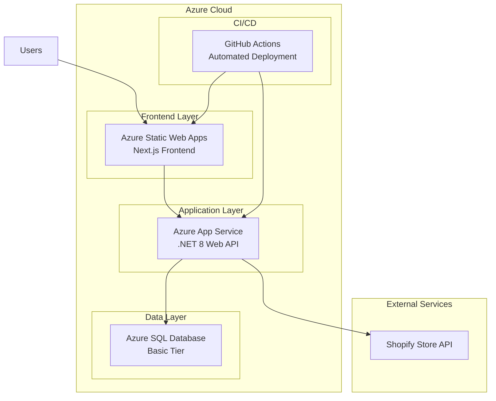
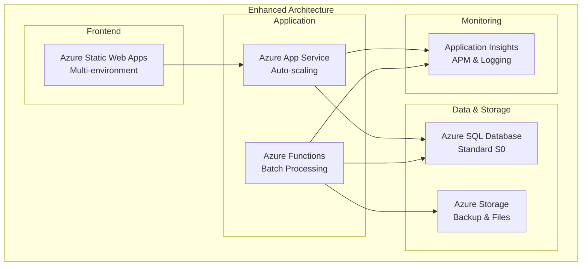
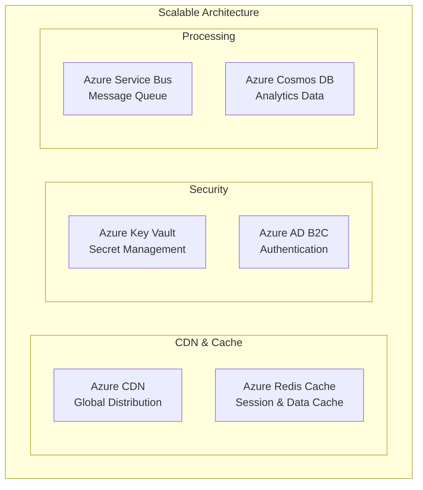

# Azureインフラストラクチャ概要

> **📅 最終更新**: 2025年7月26日  
> **🎯 対象**: 開発チーム・運用担当者  
> **💻 目的**: インフラ全体像の理解とアーキテクチャ設計指針

---

## 🏗️ 現在のインフラ構成

### アーキテクチャ図



### 現在の構成詳細

| サービス | 役割 | プラン | 月額コスト | ステータス |
|----------|------|--------|-----------|-----------|
| **Azure Static Web Apps** | フロントエンド | Free | ¥0 | ✅ 稼働中 |
| **Azure App Service** | バックエンドAPI | Basic B1 | ~¥2,000 | ✅ 稼働中 |
| **Azure SQL Database** | データベース | Basic | ~¥700 | ✅ 稼働中 |
| **合計** | - | - | **~¥2,700/月** | - |

---

## 🚀 推奨アーキテクチャ（段階的改善）

### Phase 1: 基本機能強化（1-3ヶ月）



**改善点:**
- 🔄 **Azure Functions**: バッチ処理の効率化
- 📊 **Application Insights**: 包括的な監視・ログ
- 💾 **Azure Storage**: バックアップとファイル管理
- 📈 **SQL Database Standard**: パフォーマンス向上

**追加コスト**: +¥1,500-2,500/月

### Phase 2: スケール対応（3-6ヶ月）



**追加機能:**
- 🌐 **Azure CDN**: グローバル配信・高速化
- ⚡ **Redis Cache**: パフォーマンス最適化
- 🔐 **Key Vault**: セキュリティ強化
- 📨 **Service Bus**: 非同期処理

**追加コスト**: +¥3,000-5,000/月

---

## 📊 環境別構成

### Development Environment
```yaml
Azure Static Web Apps: Free Tier
Azure App Service: Free F1
Azure SQL Database: Basic
Application Insights: Free Tier (5GB/月)

月額コスト: ~¥700
```

### Staging Environment
```yaml
Azure Static Web Apps: Standard Tier
Azure App Service: Basic B1
Azure SQL Database: Standard S0
Application Insights: Basic Tier

月額コスト: ~¥3,500
```

### Production Environment
```yaml
Azure Static Web Apps: Standard Tier
Azure App Service: Standard S1 (Auto-scaling)
Azure SQL Database: Standard S1
Application Insights: Basic Tier
Azure Storage: Standard LRS

月額コスト: ~¥8,000-12,000
```

---

## 🔧 技術スタック

### Frontend
- **Framework**: Next.js 14 (App Router)
- **UI Library**: Shadcn/ui + Tailwind CSS
- **State Management**: Zustand
- **Deployment**: Azure Static Web Apps

### Backend
- **Framework**: ASP.NET Core 8
- **ORM**: Entity Framework Core
- **Authentication**: JWT (将来的にAzure AD B2C)
- **Deployment**: Azure App Service

### Database
- **Primary**: Azure SQL Database
- **Cache**: Azure Redis Cache (Phase 2)
- **Analytics**: Azure Cosmos DB (Phase 2)

### DevOps
- **CI/CD**: GitHub Actions
- **Monitoring**: Application Insights
- **Secrets**: Azure Key Vault (Phase 2)

---

## 🔒 セキュリティ考慮事項

### 現在実装済み
- ✅ HTTPS通信
- ✅ CORS設定
- ✅ SQL Injection対策（EF Core）
- ✅ 環境変数によるシークレット管理

### 今後の強化項目
- 🔄 Azure Key Vault統合
- 🔄 Azure AD B2C認証
- 🔄 Network Security Groups
- 🔄 Private Endpoints（Production）

---

## 📈 パフォーマンス指標

### 現在の性能
- **API応答時間**: 200-500ms
- **フロントエンド初期表示**: 2-3秒
- **同時接続数**: 10-50ユーザー対応

### 目標性能（Phase 2）
- **API応答時間**: 100-200ms（Redis Cache効果）
- **フロントエンド初期表示**: 1-2秒（CDN効果）
- **同時接続数**: 100-500ユーザー対応

---

## 💰 コスト最適化戦略

### 短期施策（1-3ヶ月）
1. **適切なサイズ選択**: 使用量に基づくプラン見直し
2. **自動スケーリング**: 需要に応じたリソース調整
3. **予約インスタンス**: 長期割引の活用

### 中期施策（3-12ヶ月）
1. **Azure Functions移行**: バッチ処理のコスト効率化
2. **Storage最適化**: ライフサイクル管理の導入
3. **監視強化**: リソース使用量の可視化

---

## 🔗 関連ドキュメント

- [Azure SQL Database設計](../02-azure-sql/README.md)
- [コスト管理計画](../03-cost-management/README.md)
- [容量計画・負荷分析](../04-capacity-planning/README.md)
- [デプロイメントガイド](../../05-operations/01-deployment/DEPLOYMENT-MASTER-GUIDE.md)

---

**最終更新**: 2025年7月26日  
**更新者**: AIアシスタントケンジ