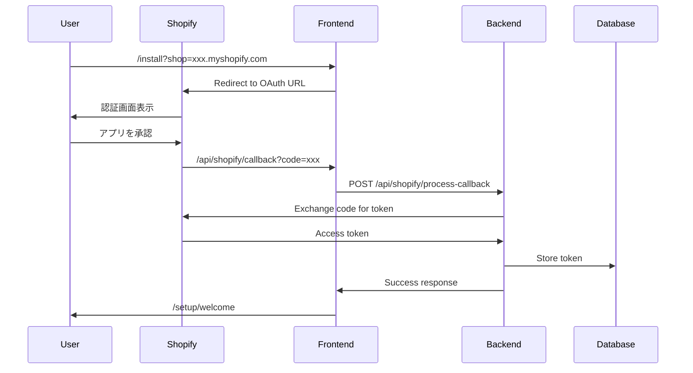

# 📦 Shopifyアプリインストール完全ガイド

## 最終更新: 2025-08-11

このドキュメントは、EC Ranger (Shopify AIマーケティングスイート) のインストール、OAuth認証、セットアップに関する統合ガイドです。

---

## 📋 目次

1. [概要](#概要)
2. [前提条件](#前提条件)
3. [環境設定](#環境設定)
4. [Ngrokセットアップ](#ngrokセットアップ)
5. [OAuth認証フロー](#oauth認証フロー)
6. [インストール手順](#インストール手順)
7. [トラブルシューティング](#トラブルシューティング)
8. [開発者向け情報](#開発者向け情報)

---

## 概要

EC Rangerは、Shopifyストアにインストールして使用するマーケティング分析アプリケーションです。このガイドでは、開発環境でのセットアップからShopifyストアへのインストールまでを説明します。

### アーキテクチャ

```
[Shopify Store] <--OAuth--> [Frontend (Next.js)] <--API--> [Backend (ASP.NET Core)]
                                    |
                              [Ngrok Tunnel]
```

---

## 前提条件

### 必要なツール

1. **Node.js** (v18以上)
2. **.NET SDK** (8.0以上)
3. **Ngrok** アカウントと認証トークン
4. **Shopify Partner** アカウント
5. **開発ストア** (テスト用Shopifyストア)

### Shopify Partnerダッシュボード設定

1. [Shopify Partner Dashboard](https://partners.shopify.com) にログイン
2. アプリ設定で以下を確認：
   - **Client ID**: `852886f4184167574f8b9721d1c6c054`
   - **Client Secret**: `[秘密情報 - バックエンドのみ]`
   - **App URL**: `https://[your-ngrok-subdomain].ngrok-free.app`
   - **Allowed redirection URLs**:
     ```
     https://[your-ngrok-subdomain].ngrok-free.app/api/shopify/callback
     https://[your-ngrok-subdomain].ngrok-free.app/shopify/callback
     http://localhost:3000/api/shopify/callback
     ```

---

## 環境設定

### 1. バックエンド設定 (`backend/ShopifyAnalyticsApi/`)

#### appsettings.Development.json

```json
{
  "Shopify": {
    "ApiKey": "852886f4184167574f8b9721d1c6c054",
    "ApiSecret": "[YOUR_API_SECRET]",
    "Scopes": "read_products,read_customers,read_orders,read_reports",
    "EncryptionKey": "[32文字のランダム文字列]"
  },
  "Frontend": {
    "BaseUrl": "https://[your-ngrok-subdomain].ngrok-free.app"
  },
  "ConnectionStrings": {
    "DefaultConnection": "Server=localhost;Database=ShopifyAnalytics;Trusted_Connection=true;"
  }
}
```

#### 環境変数（Azure App Service用）

```bash
# Shopify設定
Shopify__ApiKey=852886f4184167574f8b9721d1c6c054
Shopify__ApiSecret=[YOUR_API_SECRET]
Shopify__EncryptionKey=[32文字のランダム文字列]

# フロントエンド設定
Frontend__BaseUrl=https://[your-production-url]
SHOPIFY_FRONTEND_BASEURL=https://[your-production-url]
```

### 2. フロントエンド設定 (`frontend/`)

#### .env.local

```env
# 基本設定
NEXT_PUBLIC_ENVIRONMENT=development
NEXT_PUBLIC_APP_NAME=EC Ranger

# URL設定（Ngrok使用時）
NEXT_PUBLIC_FRONTEND_URL=https://[your-ngrok-subdomain].ngrok-free.app
NEXT_PUBLIC_BACKEND_URL=https://localhost:7088
NEXT_PUBLIC_SHOPIFY_APP_URL=https://[your-ngrok-subdomain].ngrok-free.app

# Shopify設定
NEXT_PUBLIC_SHOPIFY_API_KEY=852886f4184167574f8b9721d1c6c054

# HTTPS設定
NEXT_PUBLIC_USE_HTTPS=true
```

---

## Ngrokセットアップ

### 1. Ngrokのインストールと設定

```bash
# Ngrokインストール（Windows）
choco install ngrok

# 認証トークンの設定
ngrok config add-authtoken [YOUR_AUTH_TOKEN]
```

### 2. Ngrok設定ファイル（`~/.ngrok2/ngrok.yml`）

```yaml
version: "2"
authtoken: [YOUR_AUTH_TOKEN]
tunnels:
  shopify-frontend:
    proto: http
    addr: 3000
    hostname: [your-subdomain].ngrok-free.app
    host_header: "localhost:3000"
```

### 3. Ngrokトンネルの起動

```bash
# フロントエンド用トンネル
ngrok http 3000 --hostname=[your-subdomain].ngrok-free.app

# 例：
ngrok http 3000 --hostname=5836302d5e4e.ngrok-free.app
```

---

## OAuth認証フロー

### ハイブリッド認証方式

EC Rangerは、フロントエンドとバックエンドが協調して動作するハイブリッド方式を採用しています。



### 重要なエンドポイント

#### フロントエンドエンドポイント
- **インストール開始**: `/install?shop=[shop-domain]`
- **OAuth コールバック**: `/api/shopify/callback`
- **セットアップ完了**: `/setup/welcome`

#### バックエンドAPIエンドポイント
- **インストール開始API**: `GET /api/shopify/install?shop=[shop-domain]`
- **OAuthコールバック処理**: `POST /api/shopify/process-callback`
- **設定確認（テスト用）**: `GET /api/shopify/test-config`

---

## インストール手順

### 開発環境でのインストール

#### 1. バックエンドの起動

```bash
cd backend/ShopifyAnalyticsApi

# HTTPS証明書の設定
dotnet dev-certs https --trust

# 起動
dotnet run --urls "https://localhost:7088"
```

#### 2. フロントエンドの起動

```bash
cd frontend

# 依存関係のインストール
npm install

# 開発サーバーの起動
npm run dev
```

#### 3. Ngrokトンネルの確認

```bash
# トンネルが正常に動作していることを確認
curl https://[your-subdomain].ngrok-free.app
```

#### 4. Shopifyストアへのインストール

1. ブラウザで以下のURLにアクセス：
   ```
   https://[your-subdomain].ngrok-free.app/install?shop=[your-store].myshopify.com
   ```

2. Shopifyの認証画面で「インストール」をクリック

3. セットアップウィザードを完了

### 本番環境でのインストール

1. Shopify App Storeからインストール（公開後）
2. または、カスタムアプリとしてインストール

---

## トラブルシューティング

### よくある問題と解決方法

#### 1. リダイレクトURLエラー

**症状**: `The redirect_uri is not whitelisted`

**解決方法**:
- Shopify Partner DashboardでAllowed redirection URLsを確認
- Ngrok URLが正しく設定されているか確認
- URLの末尾にスラッシュがないことを確認

#### 2. localhost:8080へのリダイレクト

**症状**: インストール後に `localhost:8080` にリダイレクトされる

**解決方法**:
```javascript
// frontend/src/app/api/shopify/callback/route.ts で確認
const getCorrectHost = () => {
  const forwardedHost = request.headers.get('x-forwarded-host');
  const hostHeader = request.headers.get('host');
  return forwardedHost || hostHeader || new URL(request.url).host;
};
```

#### 3. HTTPS証明書エラー

**症状**: `NET::ERR_CERT_AUTHORITY_INVALID`

**解決方法**:
1. ブラウザで `https://localhost:7088` にアクセス
2. 「詳細設定」→「localhost:7088 にアクセスする（安全ではありません）」
3. フロントエンドページをリロード

#### 4. バックエンド接続エラー

**症状**: `Failed to fetch` エラー

**解決方法**:
- バックエンドが起動していることを確認
- `.env.local`の`NEXT_PUBLIC_BACKEND_URL`を確認
- `/dev/backend-health-check`で接続テスト

### デバッグツール

#### 開発者向けテストページ

- **OAuth設定確認**: `/dev/oauth-config-test`
- **バックエンド接続**: `/dev/backend-health-check`
- **JWT認証テスト**: `/dev/jwt-test`
- **Shopifyバックエンドテスト**: `/dev/shopify-backend-test`

#### ログの確認

```bash
# フロントエンドログ
# ブラウザの開発者ツールConsoleタブ

# バックエンドログ
# Visual Studio出力ウィンドウまたはターミナル

# Ngrokログ
ngrok http 3000 --log=stdout --log-level=debug
```

---

## 開発者向け情報

### 重要なファイル

#### フロントエンド
- `/frontend/src/app/install/page.tsx` - インストールページ
- `/frontend/src/app/api/shopify/callback/route.ts` - OAuthコールバック
- `/frontend/src/providers/AppBridgeProvider.tsx` - Shopify App Bridge
- `/frontend/src/middleware.ts` - ミドルウェア（埋め込みアプリ判定）

#### バックエンド
- `/backend/ShopifyAnalyticsApi/Controllers/ShopifyAuthController.cs` - OAuth処理
- `/backend/ShopifyAnalyticsApi/Services/ShopifyApiService.cs` - Shopify API連携
- `/backend/ShopifyAnalyticsApi/Middleware/ShopifyEmbeddedAppMiddleware.cs` - 埋め込みアプリ対応

### 環境変数の優先順位

1. **明示的な環境変数**（最優先）
   - `NEXT_PUBLIC_BACKEND_URL`
   - `NEXT_PUBLIC_API_URL`

2. **プロトコル設定**
   - `NEXT_PUBLIC_USE_HTTPS`

3. **デフォルト値**
   - HTTPSの場合: `https://localhost:7088`
   - HTTPの場合: `http://localhost:5000`

### セキュリティ考慮事項

1. **APIシークレットの管理**
   - フロントエンドには絶対に含めない
   - バックエンドの環境変数で管理
   - Azure Key Vaultの使用を推奨

2. **HMAC検証**
   - すべてのShopifyからのリクエストでHMAC検証を実施
   - タイムスタンプの検証（5分以内）

3. **JWT認証**
   - バックエンドAPIへのアクセスにはJWTトークンが必要
   - トークンの有効期限: 24時間

---

## 関連ドキュメント

- [環境設定ガイド](./environment-configuration-unified-guide.md)
- [Ngrok完全ガイド](./ngrok-complete-guide.md)
- [バックエンド接続設定](./backend-connection-setup-guide.md)
- [CLAUDE.md](../../CLAUDE.md) - AI開発チームルール

---

## 更新履歴

- 2025-08-11: 統合版として作成（複数のドキュメントを統合）
- OAuth関連ドキュメントを一本化
- EC Rangerブランド名に更新
- 最新のNgrok URLとエンドポイント情報を反映

---

**注意**: このドキュメントは開発者向けです。本番環境でのインストールについては、Shopify App Storeのリスティングまたはカスタムアプリのインストール手順を参照してください。