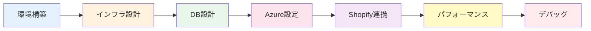

# 💻 開発ドキュメント統合版

## 概要
このフォルダには、開発環境、インフラストラクチャ、データベース、Azure設定、Shopify連携、パフォーマンス、デバッグに関するすべての技術文書が統合されています。

> 📝 **重要**: 2025年8月12日に06-infrastructureフォルダを統合しました

---

## 📁 フォルダ構成（新構造）

```
04-development/
├── 01-環境構築/              # 開発環境セットアップ
├── 02-インフラストラクチャ/    # ✨NEW: インフラ設計・構成
├── 03-データベース/           # ✨統合: DB設計・Azure SQL
├── 04-Azure_DevOps/          # ✨改名: Azure関連全般
├── 05-コスト管理/            # ✨NEW: コスト最適化・監視
├── 06-Shopify連携/           # Shopify API連携
├── 07-パフォーマンス/         # ✨統合: 性能・キャパシティ
├── 08-デバッグ・トラブル/      # デバッグガイド
└── archive/                  # アーカイブ済み文書
```

---

## 🆕 統合による変更点

### 移動されたコンテンツ
| 旧場所 | 新場所 | 内容 |
|--------|--------|------|
| `06-infrastructure/01-architecture/` | `02-インフラストラクチャ/Azureアーキテクチャ/` | Azure設計文書 |
| `06-infrastructure/02-azure-sql/` | `03-データベース/Azure_SQL設定/` | SQL設定ガイド |
| `06-infrastructure/03-cost-management/` | `05-コスト管理/` | コスト管理全般 |
| `06-infrastructure/04-capacity-planning/` | `07-パフォーマンス/キャパシティ計画/` | 容量計画 |
| `04-development/02-データベース/` | `03-データベース/設計・モデリング/` | DB設計文書 |
| `04-development/03-Azure設定/` | `04-Azure_DevOps/` | Azure設定全般 |

---

## 📚 主要ドキュメント一覧

### 🛠️ 01-環境構築
| ドキュメント | 説明 | 重要度 |
|------------|------|--------|
| [開発環境セットアップガイド.md](./01-環境構築/開発環境セットアップガイド.md) | 初期環境構築手順 | ⭐⭐⭐ |
| [環境設定統合ガイド.md](./01-環境構築/環境設定統合ガイド.md) | 環境変数・設定管理 | ⭐⭐⭐ |
| [バックエンド接続設定.md](./01-環境構築/バックエンド接続設定.md) | API接続設定 | ⭐⭐ |
| [ngrok設定ガイド.md](./01-環境構築/ngrok設定ガイド.md) | ローカル開発用トンネル | ⭐⭐ |

### 🏗️ 02-インフラストラクチャ ✨NEW
| ドキュメント | 説明 | 重要度 |
|------------|------|--------|
| [Azureインフラ構成とコスト.md](./02-インフラストラクチャ/Azureアーキテクチャ/Azureインフラ構成とコスト.md) | インフラ全体設計 | ⭐⭐⭐ |
| [azure-infrastructure-overview.md](./02-インフラストラクチャ/Azureアーキテクチャ/azure-infrastructure-overview.md) | 英語版概要 | ⭐⭐ |
| [Azureインフラ用語集.md](./02-インフラストラクチャ/Azureアーキテクチャ/Azureインフラ用語集 - 非エンジニア向け解説.md) | 用語解説 | ⭐ |

### 💾 03-データベース ✨統合
| ドキュメント | 説明 | 重要度 |
|------------|------|--------|
| **設計・モデリング/** | | |
| [データ同期設計仕様.md](./03-データベース/設計・モデリング/データ同期設計仕様.md) | 同期アーキテクチャ | ⭐⭐⭐ |
| **Azure_SQL設定/** | | |
| [azure-sql-setup-record.md](./03-データベース/Azure_SQL設定/azure-sql-setup-record.md) | セットアップ記録 | ⭐⭐⭐ |
| [azure-sql-migration-guide.md](./03-データベース/Azure_SQL設定/azure-sql-migration-guide.md) | マイグレーション | ⭐⭐⭐ |
| [azure-sql-performance-guide.md](./03-データベース/Azure_SQL設定/azure-sql-performance-guide.md) | パフォーマンス | ⭐⭐ |
| **マイグレーション/** | | |
| [database-migration-tracking.md](./03-データベース/マイグレーション/database-migration-tracking.md) | 管理表 | ⭐⭐⭐ |

### ☁️ 04-Azure_DevOps ✨改名
| ドキュメント | 説明 | 重要度 |
|------------|------|--------|
| [本番環境デプロイガイド.md](./04-Azure_DevOps/本番環境デプロイガイド.md) | 本番デプロイ手順 | ⭐⭐⭐ |
| [Azure_Functions統合計画.md](./04-Azure_DevOps/Azure_Functions統合計画.md) | サーバーレス実装 | ⭐⭐ |
| [Static_Web_Appsドメイン設定.md](./04-Azure_DevOps/Static_Web_Appsドメイン設定.md) | カスタムドメイン | ⭐⭐ |
| **デプロイメント/** | | |
| [production-environment-setup-guide.md](./04-Azure_DevOps/デプロイメント/production-environment-setup-guide.md) | 本番環境構築 | ⭐⭐⭐ |

### 💰 05-コスト管理 ✨NEW
| ドキュメント | 説明 | 重要度 |
|------------|------|--------|
| [コスト最適化戦略.md](./05-コスト管理/コスト最適化戦略.md) | 費用削減戦略 | ⭐⭐⭐ |
| [azure-cost-estimation-guide.md](./05-コスト管理/azure-cost-estimation-guide.md) | 見積もりガイド | ⭐⭐⭐ |
| [cost-monitoring-plan-detailed.md](./05-コスト管理/cost-monitoring-plan-detailed.md) | 詳細監視計画 | ⭐⭐ |
| [cost-simulation-worksheet.md](./05-コスト管理/cost-simulation-worksheet.md) | シミュレーション | ⭐⭐ |

### 🛍️ 06-Shopify連携
| ドキュメント | 説明 | 重要度 |
|------------|------|--------|
| [アプリインストールガイド.md](./06-Shopify連携/アプリインストールガイド.md) | インストール手順 | ⭐⭐⭐ |
| [同期範囲管理.md](./06-Shopify連携/同期範囲管理.md) | データ同期設定 | ⭐⭐⭐ |
| [ストア切替機能ガイド.md](./06-Shopify連携/ストア切替機能ガイド.md) | マルチストア対応 | ⭐⭐ |
| [OAuth代替アプローチ.md](./06-Shopify連携/OAuth代替アプローチ.md) | 認証実装 | ⭐⭐ |

### ⚡ 07-パフォーマンス ✨統合
| ドキュメント | 説明 | 重要度 |
|------------|------|--------|
| **最適化/** | | |
| [API性能レポート_20250812.md](./07-パフォーマンス/最適化/API性能レポート_20250812.md) | 性能測定結果 | ⭐⭐ |
| **キャパシティ計画/** | | |
| [10-users-load-analysis.md](./07-パフォーマンス/キャパシティ計画/10-users-load-analysis.md) | 負荷分析 | ⭐⭐ |

### 🐛 08-デバッグ・トラブル
| ドキュメント | 説明 | 重要度 |
|------------|------|--------|
| [HMAC検証デバッグガイド.md](./08-デバッグ・トラブル/HMAC検証デバッグガイド.md) | HMAC問題解決 | ⭐⭐ |
| [LocalStorage変数分析.md](./08-デバッグ・トラブル/LocalStorage変数分析.md) | ストレージ管理 | ⭐⭐ |
| [Swagger_JWTテストガイド.md](./08-デバッグ・トラブル/Swagger_JWTテストガイド.md) | API テスト | ⭐ |

---

## 🚀 クイックスタート（統合版）

### 新規開発者の方へ
1. 📖 [開発環境セットアップガイド](./01-環境構築/開発環境セットアップガイド.md) を読む
2. 🏗️ [Azureインフラ構成](./02-インフラストラクチャ/Azureアーキテクチャ/Azureインフラ構成とコスト.md) を理解
3. 💾 [データベース設計](./03-データベース/設計・モデリング/) を確認
4. ☁️ [Azure設定](./04-Azure_DevOps/) をセットアップ
5. 🛍️ [Shopify連携](./06-Shopify連携/) を学習

---

## 📊 統合のメリット

### 👍 改善された点
1. **一元管理** - すべての開発関連ドキュメントが1箇所に
2. **論理的構造** - インフラ→DB→Azure→アプリの流れ
3. **発見性向上** - 関連ドキュメントが近くに配置
4. **メンテナンス性** - 重複の排除と更新の簡素化

### 📍 主な変更点
- インフラ文書が開発フォルダに統合
- データベース関連が1つのフォルダに集約
- コスト管理が独立したセクションに
- パフォーマンスとキャパシティが統合

---

## 🔧 開発フロー（統合版）



---

## 📈 今後の計画

### Phase 1（完了）
- [x] フォルダ構造の統合
- [x] ドキュメント移動
- [x] README更新

### Phase 2（進行中）
- [ ] 内部リンクの修正
- [ ] 相互参照の追加
- [ ] インデックス作成

### Phase 3（予定）
- [ ] 英語版ドキュメント統合
- [ ] 検索機能の実装
- [ ] 自動ドキュメント生成

---

## 📞 サポート

### 技術的な質問（担当領域）
- **インフラ・全体**: Kenji
- **Backend・DB**: Takashi
- **Frontend・UI**: Yuki
- **コスト・ビジネス**: 福田様

### ドキュメント管理
- 統合に関する質問: Kenji
- 更新・追加: 各担当者
- レビュー: チーム全体

---

## 📝 更新履歴

| 日付 | 内容 | 担当者 |
|------|------|--------|
| 2025-08-12 | 06-infrastructureフォルダ統合 | Kenji |
| 2025-08-12 | フォルダ構造再編成（Option A採用） | Kenji |
| 2025-08-12 | README全面更新 | Kenji |

---

**最終更新**: 2025年8月12日 21:00
**次回レビュー**: 2025年8月19日（週次）