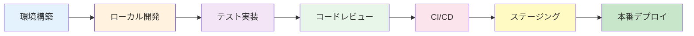

# 💻 開発ドキュメント

## 概要
このフォルダには、開発環境の構築、データベース設計、Azure設定、Shopify連携、デバッグ、パフォーマンスに関するすべての技術文書が含まれています。

---

## 📁 フォルダ構成

```
04-development/
├── 01-環境構築/         # 開発環境セットアップ
├── 02-データベース/      # DB設計・マイグレーション
├── 03-Azure設定/        # Azure関連の設定
├── 04-Shopify連携/      # Shopify API連携
├── 05-デバッグ・トラブル/  # デバッグガイド
├── 06-パフォーマンス/    # 性能最適化
└── archive/            # アーカイブ済み文書
```

---

## 📚 主要ドキュメント

### 🛠️ 01-環境構築
| ドキュメント | 説明 | 重要度 |
|------------|------|--------|
| [開発環境セットアップガイド.md](./01-環境構築/開発環境セットアップガイド.md) | 初期環境構築手順 | ⭐⭐⭐ |
| [環境設定統合ガイド.md](./01-環境構築/環境設定統合ガイド.md) | 環境変数・設定管理 | ⭐⭐⭐ |
| [バックエンド接続設定.md](./01-環境構築/バックエンド接続設定.md) | API接続設定 | ⭐⭐ |
| [ngrok設定ガイド.md](./01-環境構築/ngrok設定ガイド.md) | ローカル開発用トンネル | ⭐⭐ |

### 💾 02-データベース
| ドキュメント | 説明 | 重要度 |
|------------|------|--------|
| [データ同期設計仕様.md](./02-データベース/データ同期設計仕様.md) | 同期アーキテクチャ | ⭐⭐⭐ |
| [マイグレーション/](./02-データベース/マイグレーション/) | DBマイグレーションスクリプト | ⭐⭐⭐ |

### ☁️ 03-Azure設定
| ドキュメント | 説明 | 重要度 |
|------------|------|--------|
| [本番環境デプロイガイド.md](./03-Azure設定/本番環境デプロイガイド.md) | 本番デプロイ手順 | ⭐⭐⭐ |
| [コスト最適化戦略.md](./03-Azure設定/コスト最適化戦略.md) | Azure費用削減 | ⭐⭐⭐ |
| [Azure_Functions統合計画.md](./03-Azure設定/Azure_Functions統合計画.md) | サーバーレス実装 | ⭐ |
| [Static_Web_Appsドメイン設定.md](./03-Azure設定/Static_Web_Appsドメイン設定.md) | カスタムドメイン | ⭐⭐ |

### 🛍️ 04-Shopify連携
| ドキュメント | 説明 | 重要度 |
|------------|------|--------|
| [アプリインストールガイド.md](./04-Shopify連携/アプリインストールガイド.md) | インストール手順 | ⭐⭐⭐ |
| [同期範囲管理.md](./04-Shopify連携/同期範囲管理.md) | データ同期設定 | ⭐⭐⭐ |
| [ストア切替機能ガイド.md](./04-Shopify連携/ストア切替機能ガイド.md) | マルチストア対応 | ⭐⭐ |
| [OAuth代替アプローチ.md](./04-Shopify連携/OAuth代替アプローチ.md) | 認証実装 | ⭐⭐ |

### 🐛 05-デバッグ・トラブル
| ドキュメント | 説明 | 重要度 |
|------------|------|--------|
| [HMAC検証デバッグガイド.md](./05-デバッグ・トラブル/HMAC検証デバッグガイド.md) | HMAC問題解決 | ⭐⭐ |
| [LocalStorage変数分析.md](./05-デバッグ・トラブル/LocalStorage変数分析.md) | ストレージ管理 | ⭐⭐ |
| [Swagger_JWTテストガイド.md](./05-デバッグ・トラブル/Swagger_JWTテストガイド.md) | API テスト | ⭐ |

### ⚡ 06-パフォーマンス
| ドキュメント | 説明 | 重要度 |
|------------|------|--------|
| [API性能レポート_20250812.md](./06-パフォーマンス/API性能レポート_20250812.md) | 性能測定結果 | ⭐⭐ |

---

## 🚀 クイックスタート

### 新規開発者の方へ
1. 📖 [開発環境セットアップガイド](./01-環境構築/開発環境セットアップガイド.md) を読む
2. 🔧 [環境設定統合ガイド](./01-環境構築/環境設定統合ガイド.md) で環境変数設定
3. 💾 [データベース設計](../02-architecture/02-データベース設計/) を確認
4. 🛍️ [Shopify連携ガイド](./04-Shopify連携/) を学習

---

## 🔧 開発環境構築チェックリスト

### 必須ツール
- [x] Node.js (v18以上)
- [x] .NET SDK 8.0
- [x] Visual Studio Code
- [x] Visual Studio 2022
- [x] Git
- [x] Azure CLI
- [x] Docker Desktop

### 環境変数設定
```bash
# Frontend (.env.local)
NEXT_PUBLIC_BACKEND_URL=https://localhost:7088
NEXT_PUBLIC_ENVIRONMENT=development

# Backend (appsettings.Development.json)
ConnectionStrings:DefaultConnection
Shopify:ApiKey
Shopify:ApiSecret
JWT:SecretKey
```

### データベース
```bash
# Entity Framework マイグレーション
dotnet ef database update

# 初期データ投入
dotnet run --seed
```

---

## 📊 開発フロー



---

## 🎯 開発のベストプラクティス

### コーディング規約
- **TypeScript/JavaScript**: ESLint + Prettier
- **C#**: .NET コーディング規約
- **コミットメッセージ**: Conventional Commits

### テスト戦略
```
単体テスト     : 80% カバレッジ目標
統合テスト     : 主要フロー全て
E2Eテスト     : クリティカルパス3本
パフォーマンス : API応答2秒以内
```

### セキュリティ
- 環境変数でシークレット管理
- HTTPS必須
- JWT認証
- SQLインジェクション対策

---

## 🔄 最近の更新

| 日付 | 内容 | 影響 |
|------|------|------|
| 2025-08-12 | LocalStorage変数統一 | Phase 2完了 |
| 2025-08-12 | Azure本番環境ガイド更新 | コスト60%削減 |
| 2025-08-12 | データ同期設計完成 | 3種類の同期実装 |

---

## ⚠️ 既知の問題

| 問題 | 状態 | 回避策 |
|------|------|--------|
| Cypress TypeScriptエラー | 🔧 修正中 | 型定義ファイル追加 |
| 本番ビルドでの開発ページ | ⏳ 対応予定 | next.config.js修正 |

---

## 📞 サポート

### 技術的な質問
- **Backend**: Takashi
- **Frontend**: Yuki
- **Infrastructure**: Kenji

### Slackチャンネル
- `#dev-general` - 一般的な開発話題
- `#dev-help` - 技術サポート
- `#dev-backend` - バックエンド関連
- `#dev-frontend` - フロントエンド関連

---

## 📝 ドキュメント作成ルール

1. **ファイル名**: 日本語OK、分かりやすく
2. **更新日付**: 必ず記載
3. **作成者**: 明記する
4. **Mermaid図**: 積極的に使用
5. **サンプルコード**: 実際に動くものを記載

---

**最終更新**: 2025年8月12日 19:00