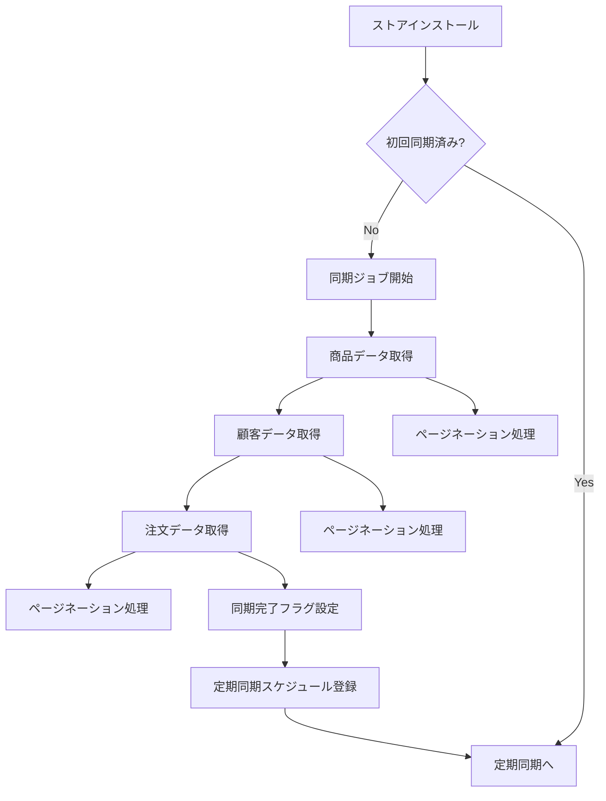
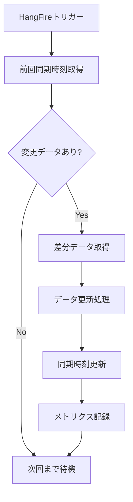

# データ同期機能 設計仕様書

**作成日:** 2025年8月12日  
**作成者:** Kenji（AIプロジェクトマネージャー）  
**バージョン:** 1.0.0

## 1. 概要

EC RangerにおけるShopifyデータ同期機能の設計仕様を定義します。
本機能は、Shopifyストアのデータ（商品、顧客、注文）をEC Rangerデータベースと同期させる中核機能です。

## 2. 同期タイプと戦略

### 2.1 同期タイプの定義

#### 2.1.1 初回同期（Initial Sync）
**目的:** 新規ストアインストール時の全データ取得

**特徴:**
- 全データを取得（過去データ含む）
- 大量データ処理に対応
- 進捗表示必須
- 中断/再開機能
- **データ取得範囲の指定機能**

**データ取得範囲設定:**
```csharp
public class InitialSyncOptions
{
    public DateTime? StartDate { get; set; } // 取得開始日（例：3年前）
    public DateTime? EndDate { get; set; }   // 取得終了日（通常は現在）
    public int MaxYearsBack { get; set; } = 3; // デフォルト3年前まで
    public bool IncludeArchived { get; set; } = false; // アーカイブ済みデータ
}
```

**実装方針:**
```csharp
public class InitialSyncStrategy : ISyncStrategy
{
    public async Task Execute(int storeId, InitialSyncOptions options = null)
    {
        options ??= new InitialSyncOptions();
        
        // 1. 同期状態をチェック
        var syncState = await GetSyncState(storeId);
        if (syncState.IsCompleted) return;
        
        // 取得期間の設定
        var startDate = options.StartDate ?? DateTime.UtcNow.AddYears(-options.MaxYearsBack);
        var endDate = options.EndDate ?? DateTime.UtcNow;
        
        // 2. 商品データ同期（依存関係なし）
        await SyncAllProducts(storeId, syncState.ProductCursor, startDate, endDate);
        
        // 3. 顧客データ同期（依存関係なし）
        await SyncAllCustomers(storeId, syncState.CustomerCursor, startDate, endDate);
        
        // 4. 注文データ同期（商品・顧客に依存）
        await SyncAllOrders(storeId, syncState.OrderCursor, startDate, endDate);
        
        // 5. 同期完了マーク（取得範囲も記録）
        await MarkSyncCompleted(storeId, startDate, endDate);
    }
}
```

#### 2.1.2 定期同期（Scheduled Sync）
**目的:** 定期的な差分データ更新

**特徴:**
- 前回同期時刻からの差分のみ
- 軽量・高速処理
- エラー時の自動リトライ
- レート制限考慮

**実装方針:**
```csharp
public class ScheduledSyncStrategy : ISyncStrategy
{
    public async Task Execute(int storeId)
    {
        var lastSyncTime = await GetLastSyncTime(storeId);
        
        // 並列実行（依存関係がないもの）
        var tasks = new[]
        {
            SyncProductsUpdatedSince(storeId, lastSyncTime),
            SyncCustomersUpdatedSince(storeId, lastSyncTime)
        };
        await Task.WhenAll(tasks);
        
        // 注文は最後に実行（依存関係あり）
        await SyncOrdersUpdatedSince(storeId, lastSyncTime);
        
        await UpdateLastSyncTime(storeId, DateTime.UtcNow);
    }
}
```

#### 2.1.3 手動同期（Manual Sync）
**目的:** ユーザー要求による即時同期

**特徴:**
- UI からトリガー可能
- 特定データタイプの選択可能
- 即座にフィードバック
- 実行中の定期同期をキャンセル

**実装方針:**
```csharp
public class ManualSyncStrategy : ISyncStrategy
{
    public async Task Execute(int storeId, SyncOptions options)
    {
        // 既存の同期をキャンセル
        await CancelExistingSync(storeId);
        
        // 選択されたデータタイプのみ同期
        if (options.SyncProducts)
            await SyncAllProducts(storeId);
            
        if (options.SyncCustomers)
            await SyncAllCustomers(storeId);
            
        if (options.SyncOrders)
            await SyncAllOrders(storeId);
            
        // UI通知
        await NotifyUI(storeId, "Sync completed");
    }
}
```

#### 2.1.4 リアルタイム同期（Webhook Sync）
**目的:** Webhookによる即時更新

**特徴:**
- イベント駆動
- 低レイテンシ
- 単一レコード更新
- 順序保証なし

**実装方針:**
```csharp
public class WebhookSyncStrategy : ISyncStrategy
{
    public async Task HandleWebhook(string topic, JObject data)
    {
        switch (topic)
        {
            case "products/create":
            case "products/update":
                await UpsertProduct(data);
                break;
                
            case "products/delete":
                await DeleteProduct(data["id"]);
                break;
                
            case "orders/create":
                await CreateOrder(data);
                break;
                
            // 他のイベント...
        }
    }
}
```

## 3. データ同期フロー

### 3.1 初回同期フロー



### 3.2 定期同期フロー



## 4. データモデル設計

### 4.1 同期状態管理テーブル

```sql
CREATE TABLE SyncStates (
    SyncStateId INT PRIMARY KEY IDENTITY(1,1),
    StoreId INT NOT NULL,
    SyncType NVARCHAR(50) NOT NULL, -- 'Initial', 'Scheduled', 'Manual'
    DataType NVARCHAR(50) NOT NULL, -- 'Products', 'Customers', 'Orders'
    Status NVARCHAR(50) NOT NULL,    -- 'Pending', 'Running', 'Completed', 'Failed'
    StartedAt DATETIME2 NOT NULL,
    CompletedAt DATETIME2 NULL,
    LastCursor NVARCHAR(MAX) NULL,   -- ページネーション用
    RecordsProcessed INT DEFAULT 0,
    TotalRecords INT NULL,
    DataStartDate DATETIME2 NULL,    -- データ取得開始日
    DataEndDate DATETIME2 NULL,      -- データ取得終了日
    ProgressPercentage AS (CASE 
        WHEN TotalRecords > 0 THEN CAST(RecordsProcessed AS FLOAT) / TotalRecords * 100
        ELSE 0 END) PERSISTED,       -- 進捗率（計算列）
    ErrorMessage NVARCHAR(MAX) NULL,
    CreatedAt DATETIME2 DEFAULT GETUTCDATE(),
    UpdatedAt DATETIME2 DEFAULT GETUTCDATE(),
    
    CONSTRAINT FK_SyncStates_Store FOREIGN KEY (StoreId) 
        REFERENCES Stores(StoreId)
);

-- インデックス
CREATE INDEX IX_SyncStates_StoreId_Status 
    ON SyncStates(StoreId, Status);
CREATE INDEX IX_SyncStates_CreatedAt 
    ON SyncStates(CreatedAt DESC);
```

### 4.2 同期履歴テーブル

```sql
CREATE TABLE SyncHistory (
    SyncHistoryId INT PRIMARY KEY IDENTITY(1,1),
    StoreId INT NOT NULL,
    SyncType NVARCHAR(50) NOT NULL,
    StartedAt DATETIME2 NOT NULL,
    CompletedAt DATETIME2 NOT NULL,
    Duration INT NOT NULL, -- 秒単位
    ProductsAdded INT DEFAULT 0,
    ProductsUpdated INT DEFAULT 0,
    ProductsDeleted INT DEFAULT 0,
    CustomersAdded INT DEFAULT 0,
    CustomersUpdated INT DEFAULT 0,
    OrdersAdded INT DEFAULT 0,
    OrdersUpdated INT DEFAULT 0,
    Success BIT NOT NULL,
    ErrorDetails NVARCHAR(MAX) NULL,
    
    CONSTRAINT FK_SyncHistory_Store FOREIGN KEY (StoreId) 
        REFERENCES Stores(StoreId)
);

-- インデックス
CREATE INDEX IX_SyncHistory_StoreId_CompletedAt 
    ON SyncHistory(StoreId, CompletedAt DESC);
```

## 5. HangFire ジョブ設定

### 5.1 ジョブスケジュール

```csharp
public class SyncJobScheduler
{
    public void ConfigureJobs()
    {
        // 定期同期：1時間ごと
        RecurringJob.AddOrUpdate<ScheduledSyncJob>(
            "scheduled-sync-all-stores",
            job => job.Execute(),
            Cron.Hourly);
        
        // データクリーンアップ：毎日深夜2時
        RecurringJob.AddOrUpdate<DataCleanupJob>(
            "cleanup-old-sync-data",
            job => job.Execute(),
            Cron.Daily(2));
        
        // ヘルスチェック：5分ごと
        RecurringJob.AddOrUpdate<SyncHealthCheckJob>(
            "sync-health-check",
            job => job.Execute(),
            "*/5 * * * *");
    }
}
```

### 5.2 ジョブ実装

```csharp
public class ScheduledSyncJob
{
    private readonly IServiceProvider _serviceProvider;
    private readonly ILogger<ScheduledSyncJob> _logger;
    
    public async Task Execute()
    {
        using var scope = _serviceProvider.CreateScope();
        var context = scope.ServiceProvider.GetRequiredService<ShopifyDbContext>();
        var syncService = scope.ServiceProvider.GetRequiredService<ISyncService>();
        
        // アクティブな全ストアを取得
        var stores = await context.Stores
            .Where(s => s.IsActive)
            .ToListAsync();
        
        // 並列実行（最大3ストア同時）
        var semaphore = new SemaphoreSlim(3);
        var tasks = stores.Select(async store =>
        {
            await semaphore.WaitAsync();
            try
            {
                await syncService.SyncStore(store.StoreId);
            }
            finally
            {
                semaphore.Release();
            }
        });
        
        await Task.WhenAll(tasks);
    }
}
```

## 6. エラーハンドリングとリトライ戦略

### 6.1 リトライポリシー

```csharp
public class SyncRetryPolicy
{
    public static IAsyncPolicy<T> GetPolicy<T>()
    {
        return Policy<T>
            .Handle<HttpRequestException>()
            .Or<TaskCanceledException>()
            .Or<ShopifyRateLimitException>()
            .WaitAndRetryAsync(
                retryCount: 3,
                sleepDurationProvider: retryAttempt => 
                    TimeSpan.FromSeconds(Math.Pow(2, retryAttempt)),
                onRetry: (outcome, timespan, retryCount, context) =>
                {
                    var logger = context.Values["logger"] as ILogger;
                    logger?.LogWarning(
                        "Retry {RetryCount} after {Delay}ms",
                        retryCount,
                        timespan.TotalMilliseconds);
                });
    }
}
```

### 6.2 エラー処理

```csharp
public class SyncErrorHandler
{
    public async Task HandleError(Exception ex, int storeId, string dataType)
    {
        // エラーログ記録
        _logger.LogError(ex, 
            "Sync error for Store {StoreId}, DataType {DataType}", 
            storeId, dataType);
        
        // エラー状態を更新
        await UpdateSyncState(storeId, dataType, "Failed", ex.Message);
        
        // 通知（重要度に応じて）
        if (IsCriticalError(ex))
        {
            await SendNotification(storeId, ex);
        }
        
        // リトライスケジュール
        if (ShouldRetry(ex))
        {
            BackgroundJob.Schedule<ManualSyncJob>(
                job => job.Execute(storeId, dataType),
                TimeSpan.FromMinutes(5));
        }
    }
}
```

## 7. パフォーマンス最適化

### 7.1 バッチ処理

```csharp
public class BatchProcessor
{
    private const int BatchSize = 100;
    
    public async Task ProcessInBatches<T>(
        IEnumerable<T> items,
        Func<IEnumerable<T>, Task> processor)
    {
        var batch = new List<T>(BatchSize);
        
        foreach (var item in items)
        {
            batch.Add(item);
            
            if (batch.Count >= BatchSize)
            {
                await processor(batch);
                batch.Clear();
            }
        }
        
        // 残りを処理
        if (batch.Any())
        {
            await processor(batch);
        }
    }
}
```

### 7.2 並列処理

```csharp
public class ParallelSyncProcessor
{
    public async Task ProcessStores(List<Store> stores)
    {
        var parallelOptions = new ParallelOptions
        {
            MaxDegreeOfParallelism = Environment.ProcessorCount
        };
        
        await Parallel.ForEachAsync(stores, parallelOptions, 
            async (store, ct) =>
            {
                await ProcessStore(store, ct);
            });
    }
}
```

## 8. 監視とメトリクス

### 8.1 メトリクス収集

```csharp
public class SyncMetrics
{
    // 同期時間
    public static readonly Histogram SyncDuration = Metrics
        .CreateHistogram("sync_duration_seconds", 
            "Sync duration in seconds",
            new HistogramConfiguration
            {
                LabelNames = new[] { "store_id", "data_type" }
            });
    
    // レコード数
    public static readonly Counter RecordsProcessed = Metrics
        .CreateCounter("sync_records_processed_total",
            "Total records processed",
            new CounterConfiguration
            {
                LabelNames = new[] { "store_id", "data_type", "operation" }
            });
    
    // エラー数
    public static readonly Counter SyncErrors = Metrics
        .CreateCounter("sync_errors_total",
            "Total sync errors",
            new CounterConfiguration
            {
                LabelNames = new[] { "store_id", "data_type", "error_type" }
            });
}
```

### 8.2 ヘルスチェック

```csharp
public class SyncHealthCheck : IHealthCheck
{
    public async Task<HealthCheckResult> CheckHealthAsync(
        HealthCheckContext context,
        CancellationToken cancellationToken = default)
    {
        // 最後の同期時刻をチェック
        var lastSync = await GetLastSuccessfulSync();
        
        if (lastSync < DateTime.UtcNow.AddHours(-2))
        {
            return HealthCheckResult.Unhealthy(
                "No successful sync in the last 2 hours");
        }
        
        // エラー率をチェック
        var errorRate = await GetErrorRate(TimeSpan.FromHours(1));
        
        if (errorRate > 0.1) // 10%以上
        {
            return HealthCheckResult.Degraded(
                $"High error rate: {errorRate:P}");
        }
        
        return HealthCheckResult.Healthy();
    }
}
```

## 9. セキュリティ考慮事項

### 9.1 データ暗号化
- アクセストークンは暗号化して保存
- 個人情報（PII）は必要に応じてマスキング
- 通信はHTTPS必須

### 9.2 アクセス制御
- ストアごとのデータ分離
- APIキーのローテーション対応
- 監査ログの記録

## 10. テスト戦略

### 10.1 単体テスト
- 各同期戦略のテスト
- エラーハンドリングのテスト
- データ変換ロジックのテスト

### 10.2 統合テスト
- End-to-End同期フロー
- 大量データ処理
- 同時実行シナリオ

### 10.3 負荷テスト
- 1000商品の同期
- 10000注文の同期
- 10ストア同時同期

## 11. UI要件：同期範囲と進捗表示

### 11.1 初回同期の範囲設定UI

```typescript
interface SyncRangeSettings {
  yearsBack: number;        // 何年前まで取得するか
  startDate?: Date;         // カスタム開始日
  endDate?: Date;           // カスタム終了日
  includeArchived: boolean; // アーカイブ済みデータを含む
}

// UIコンポーネントの例
export function InitialSyncSettings({ onStart }: Props) {
  const [settings, setSettings] = useState<SyncRangeSettings>({
    yearsBack: 3,
    includeArchived: false
  });

  return (
    <Card>
      <CardHeader>
        <CardTitle>初回同期の設定</CardTitle>
      </CardHeader>
      <CardContent>
        <div className="space-y-4">
          <div>
            <Label>データ取得範囲</Label>
            <Select value={settings.yearsBack.toString()}>
              <SelectItem value="1">過去1年分</SelectItem>
              <SelectItem value="2">過去2年分</SelectItem>
              <SelectItem value="3">過去3年分</SelectItem>
              <SelectItem value="5">過去5年分</SelectItem>
              <SelectItem value="0">全期間</SelectItem>
            </Select>
          </div>
          
          <div className="text-sm text-gray-600">
            {settings.yearsBack > 0 
              ? `${new Date().getFullYear() - settings.yearsBack}年から現在までのデータを取得します`
              : '利用可能な全てのデータを取得します'}
          </div>

          <Alert>
            <AlertDescription>
              大量のデータを取得する場合、処理に時間がかかる可能性があります。
              推奨：過去3年分のデータから開始
            </AlertDescription>
          </Alert>
        </div>
      </CardContent>
    </Card>
  );
}
```

### 11.2 進捗詳細表示

```typescript
interface SyncProgressDetail {
  dataType: 'products' | 'customers' | 'orders';
  status: 'pending' | 'running' | 'completed' | 'failed';
  recordsProcessed: number;
  totalRecords: number | null;
  progressPercentage: number;
  dataRange: {
    startDate: Date;
    endDate: Date;
    actualRecordsInRange: number;
  };
  currentPage?: string;  // 現在処理中のページ/カーソル
  estimatedTimeRemaining?: number; // 秒単位
}

export function DetailedSyncProgress({ progress }: { progress: SyncProgressDetail }) {
  return (
    <div className="space-y-2">
      <div className="flex justify-between text-sm">
        <span>{getDataTypeLabel(progress.dataType)}</span>
        <span>{progress.progressPercentage.toFixed(1)}%</span>
      </div>
      
      <Progress value={progress.progressPercentage} className="h-2" />
      
      <div className="grid grid-cols-2 gap-2 text-xs text-gray-600">
        <div>
          処理済み: {progress.recordsProcessed.toLocaleString()}
          {progress.totalRecords && ` / ${progress.totalRecords.toLocaleString()}`}
        </div>
        <div className="text-right">
          {progress.estimatedTimeRemaining && (
            <>残り時間: {formatDuration(progress.estimatedTimeRemaining)}</>
          )}
        </div>
      </div>
      
      <div className="text-xs text-gray-500">
        取得期間: {formatDate(progress.dataRange.startDate)} 〜 {formatDate(progress.dataRange.endDate)}
        （{progress.dataRange.actualRecordsInRange.toLocaleString()}件）
      </div>
    </div>
  );
}
```

### 11.3 同期履歴の詳細表示

```typescript
interface SyncHistoryDetail {
  syncId: string;
  syncType: string;
  startedAt: Date;
  completedAt?: Date;
  duration: number;
  dataRange: {
    startDate: Date;
    endDate: Date;
  };
  recordsSummary: {
    products: { added: number; updated: number; deleted: number; };
    customers: { added: number; updated: number; };
    orders: { added: number; updated: number; };
  };
  status: 'success' | 'partial' | 'failed';
}
```

## 12. 移行計画

### Phase 1: 基本実装（現在）
- HangFire設定
- 商品同期実装
- 基本的なエラーハンドリング
- データ取得範囲の設定機能

### Phase 2: 完全実装（8月第3週）
- 顧客・注文同期
- リトライメカニズム
- 監視機能

### Phase 3: 最適化（8月第4週）
- パフォーマンスチューニング
- 並列処理実装
- メトリクス収集

## 13. 参考資料

- [Shopify API Rate Limits](https://shopify.dev/api/usage/rate-limits)
- [HangFire Documentation](https://www.hangfire.io/documentation.html)
- [Polly Retry Policies](https://github.com/App-vNext/Polly)

---
**更新履歴:**
- 2025-08-12: 初版作成（Kenji）