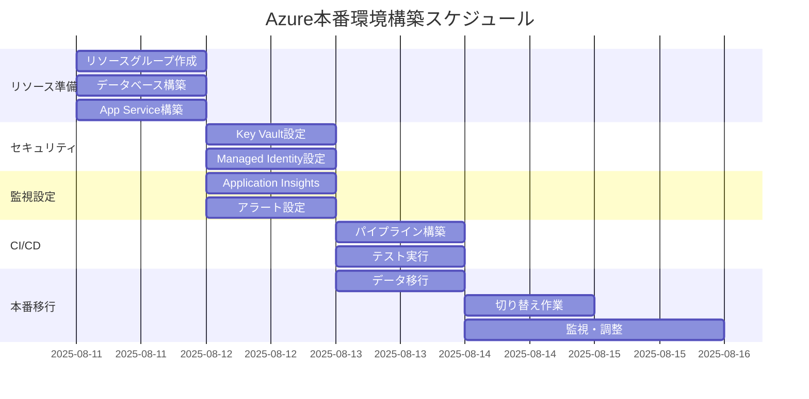

# Azure本番環境構築計画

## 概要
EC Ranger（旧GEMiNX）のAzure本番環境構築に関する詳細計画書

## 現在の環境構成

### 開発環境（現在稼働中）
- **フロントエンド**: Azure Static Web Apps（brave-sea-038f17a00）
- **バックエンド**: Azure App Service（gemx-backend）
- **データベース**: Azure SQL Database（shopify-test-db）
- **リソースグループ**: gemx

## 本番環境構築計画

### フェーズ1: リソース準備（2025年8月11日〜12日）

#### 1.1 リソースグループ作成
```bash
az group create --name ec-ranger-prod --location japaneast
```

#### 1.2 データベース環境
- **Azure SQL Server**: ec-ranger-sql-prod
- **データベース名**: ec-ranger-db-prod
- **価格帯**: Standard S1（50 DTU）
- **バックアップ**: 自動バックアップ有効（7日間保持）
- **レプリケーション**: 読み取り専用レプリカ（オプション）

#### 1.3 App Service環境
- **App Service Plan**: ec-ranger-plan-prod（Standard S1）
- **Web App名**: ec-ranger-api-prod
- **スケーリング**: 自動スケール設定（CPU使用率70%以上で増加）

#### 1.4 Static Web Apps
- **名称**: ec-ranger-frontend-prod
- **カスタムドメイン**: 後日設定

### フェーズ2: セキュリティ設定（2025年8月12日）

#### 2.1 Azure Key Vault
```bash
az keyvault create \
  --name ec-ranger-vault-prod \
  --resource-group ec-ranger-prod \
  --location japaneast
```

保管する秘密情報：
- Shopify API Key/Secret
- JWT署名キー
- データベース接続文字列
- Application Insights接続文字列

#### 2.2 Managed Identity設定
- App ServiceにSystem Assigned Managed Identityを有効化
- Key Vaultへのアクセス権限付与

#### 2.3 ネットワークセキュリティ
- App ServiceのAccess Restrictionsを設定
- SQL DatabaseのFirewall設定
- Private Endpointの検討（将来的に）

### フェーズ3: 監視・ログ設定（2025年8月12日）

#### 3.1 Application Insights
```bash
az monitor app-insights component create \
  --app ec-ranger-insights-prod \
  --location japaneast \
  --resource-group ec-ranger-prod \
  --application-type web
```

#### 3.2 ログ設定
- App Service診断ログ有効化
- SQL Database監査ログ有効化
- Log Analyticsワークスペース作成

#### 3.3 アラート設定
| アラート名 | 条件 | アクション |
|-----------|------|------------|
| High CPU Usage | CPU > 80% (5分間) | メール通知 |
| Database DTU High | DTU > 90% | メール通知 |
| Response Time Slow | 平均応答時間 > 2秒 | メール通知 |
| Error Rate High | エラー率 > 5% | メール通知 |

### フェーズ4: CI/CDパイプライン構築（2025年8月13日）

#### 4.1 GitHub Actions設定
- 本番用ワークフロー作成（`.github/workflows/deploy-production.yml`）
- 環境変数とシークレット設定
- デプロイメントスロット活用（Blue-Green Deployment）

#### 4.2 デプロイメント戦略
1. **ステージングスロット**へデプロイ
2. **ヘルスチェック**実行
3. **スモークテスト**実行
4. **本番スロット**へスワップ
5. **ロールバック**準備

### フェーズ5: データ移行（2025年8月13日）

#### 5.1 データベースマイグレーション
```sql
-- 1. 本番データベースのバックアップ
BACKUP DATABASE [ec-ranger-db-prod] 
TO DISK = 'backup-before-migration.bak'

-- 2. スキーマ作成（Entity Framework Migration）
dotnet ef database update --connection "Production Connection String"

-- 3. 初期データ投入（必要に応じて）
```

#### 5.2 設定データ移行
- ストア情報
- 環境変数
- アプリケーション設定

### フェーズ6: 本番切り替え（2025年8月14日）

#### 6.1 切り替え前チェックリスト
- [ ] 全環境変数設定完了
- [ ] SSL証明書設定完了
- [ ] Shopify App設定更新（Callback URL等）
- [ ] データベース接続確認
- [ ] Application Insights接続確認
- [ ] ヘルスチェックエンドポイント動作確認

#### 6.2 DNS切り替え
- カスタムドメイン設定
- SSL証明書バインディング
- DNSレコード更新

#### 6.3 切り替え後確認
- [ ] アプリケーションログ確認
- [ ] パフォーマンス監視
- [ ] エラー率監視
- [ ] ユーザーアクセス確認

## コスト見積もり

### 月額コスト概算（円）
| リソース | SKU | 月額費用 |
|---------|-----|----------|
| App Service | Standard S1 | ¥12,000 |
| SQL Database | Standard S1 | ¥6,000 |
| Static Web Apps | Standard | ¥1,200 |
| Application Insights | 5GB/月 | ¥2,500 |
| Key Vault | 基本 | ¥200 |
| **合計** | | **¥21,900** |

## リスクと対策

### リスク1: データ移行失敗
- **対策**: 完全バックアップ取得、ロールバック手順準備

### リスク2: パフォーマンス劣化
- **対策**: 負荷テスト実施、スケーリング設定調整

### リスク3: セキュリティ脆弱性
- **対策**: セキュリティスキャン実施、WAF導入検討

## タイムライン



## チェックリスト

### 事前準備
- [ ] Azureサブスクリプション確認
- [ ] 予算承認取得
- [ ] バックアップ計画策定
- [ ] ロールバック手順書作成

### 構築時
- [ ] 各リソース作成完了
- [ ] セキュリティ設定完了
- [ ] 監視設定完了
- [ ] CI/CD設定完了

### 本番切り替え後
- [ ] 全機能動作確認
- [ ] パフォーマンス確認
- [ ] セキュリティスキャン実施
- [ ] ドキュメント更新

## 関連ドキュメント
- [Azure環境変数設定ガイド](./azure-environment-variables-setup.md)
- [Shopifyバッチ処理アーキテクチャ](../02-architecture/shopify-batch-processor-architecture.md)
- [データベースマイグレーション管理](../04-development/database-migration-tracking.md)

## 更新履歴
- 2025-08-11: 初版作成（本番環境構築計画）