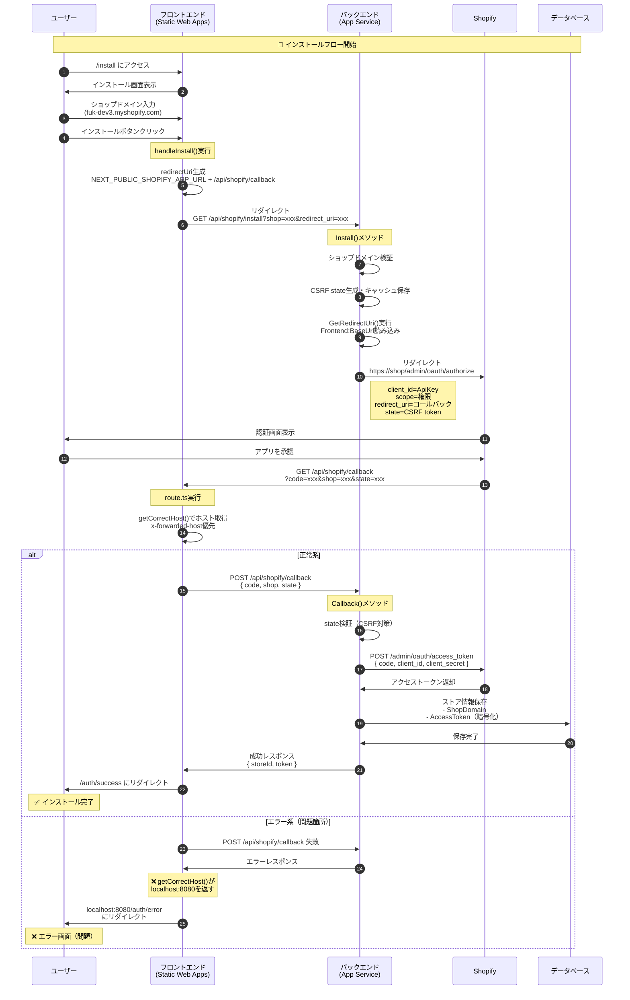
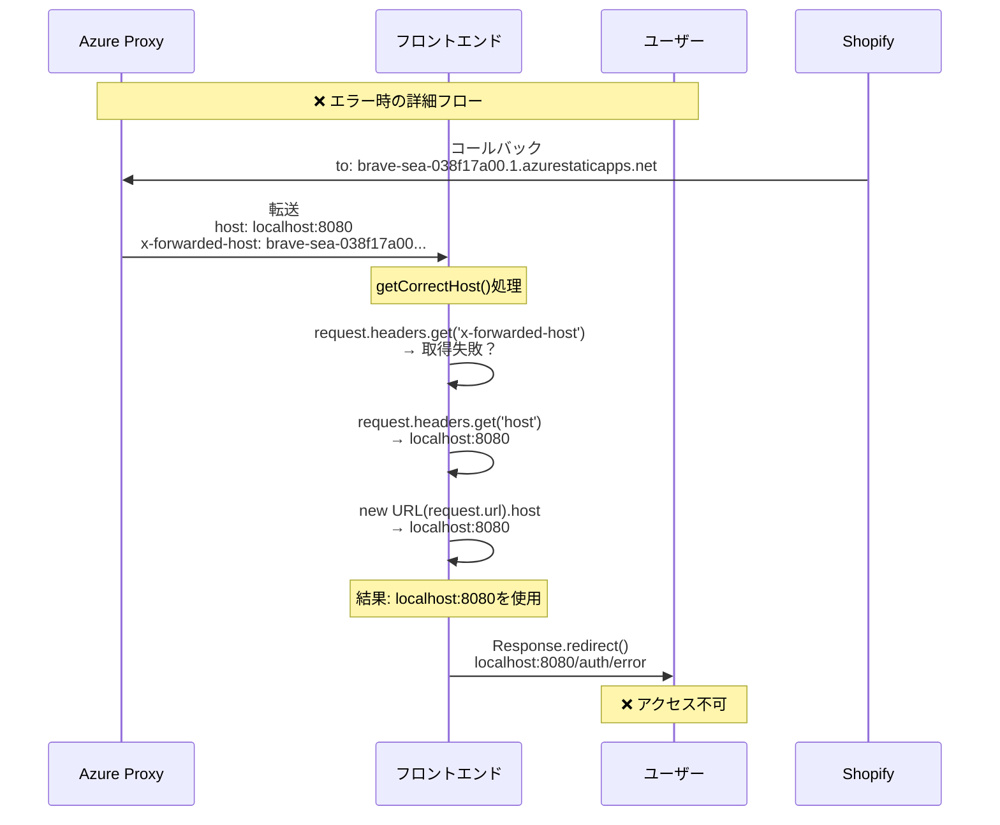

# Shopify OAuth認証フロー デバッグガイド

## 問題の概要
インストールフローで認証エラー後に`localhost:8080`にリダイレクトされる問題のデバッグガイド

- **インストール開始**: `https://brave-sea-038f17a00.1.azurestaticapps.net/install`
- **エラー後のリダイレクト**: `https://localhost:8080/auth/error?message=Authentication%2520failed&shop=fuk-dev3.myshopify.com`

## OAuth認証フロー シーケンス図

### Mermaidシーケンス図



### エラー発生ポイントの詳細



### 正常フロー

```
[ユーザー] → [フロントエンド] → [バックエンド] → [Shopify] → [データベース]
```

#### Step 1: インストール開始
1. ユーザーが`https://brave-sea-038f17a00.1.azurestaticapps.net/install`にアクセス
2. インストール画面が表示される

#### Step 2: ショップドメイン入力
1. ユーザーがショップドメイン（例：`fuk-dev3.myshopify.com`）を入力
2. 「インストール」ボタンをクリック

#### Step 3: OAuth認証開始（フロントエンド）
```typescript
// frontend/src/app/install/page.tsx
const handleInstall = async () => {
  const shop = shopDomain.trim();
  const redirectUri = `${process.env.NEXT_PUBLIC_SHOPIFY_APP_URL}/api/shopify/callback`;
  const installUrl = `${process.env.NEXT_PUBLIC_BACKEND_URL}/api/shopify/install?shop=${shop}&redirect_uri=${encodeURIComponent(redirectUri)}`;
  window.location.href = installUrl;
};
```

**生成されるURL例**:
- redirectUri: `https://brave-sea-038f17a00.1.azurestaticapps.net/api/shopify/callback`
- installUrl: `https://shopifytestapi20250720173320-aed5bhc0cferg2hm.japanwest-01.azurewebsites.net/api/shopify/install?shop=fuk-dev3.myshopify.com&redirect_uri=...`

#### Step 4: バックエンド処理
```csharp
// backend/ShopifyAuthController.cs
[HttpGet("install")]
public IActionResult Install(string shop, string redirect_uri)
{
    // 1. ショップドメインの検証
    if (!IsValidShopDomain(shop)) 
        return BadRequest();
    
    // 2. CSRF対策用のstate生成
    var state = GenerateRandomString(32);
    _cache.Set($"shopify_oauth_state_{state}", shop, TimeSpan.FromMinutes(10));
    
    // 3. リダイレクトURI取得
    var frontendUrl = Environment.GetEnvironmentVariable("SHOPIFY_FRONTEND_BASEURL") ?? 
                     _configuration["Frontend:BaseUrl"];
    // → https://brave-sea-038f17a00.1.azurestaticapps.net
    
    // 4. Shopify OAuth URLを構築
    var authUrl = $"https://{shop}/admin/oauth/authorize?" +
        $"client_id={_configuration["Shopify:ApiKey"]}&" +
        $"scope={_configuration["Shopify:Scopes"]}&" +
        $"redirect_uri={redirect_uri}&" +
        $"state={state}";
    
    return Redirect(authUrl);
}
```

#### Step 5: Shopify認証
1. ユーザーがShopifyの認証画面にリダイレクトされる
2. アプリの権限を確認して「インストール」をクリック
3. Shopifyが指定されたredirect_uriにコールバック

#### Step 6: フロントエンドコールバック処理
```typescript
// frontend/src/app/api/shopify/callback/route.ts
export async function GET(request: Request) {
    // 1. パラメータ取得
    const { searchParams } = new URL(request.url);
    const code = searchParams.get('code');
    const shop = searchParams.get('shop');
    const state = searchParams.get('state');
    
    // 2. 正しいホストを取得（プロキシ対応）
    const getCorrectHost = () => {
        const forwardedHost = request.headers.get('x-forwarded-host');
        const hostHeader = request.headers.get('host');
        const urlHost = new URL(request.url).host;
        
        return forwardedHost || hostHeader || urlHost;
    };
    
    const host = getCorrectHost();
    const protocol = host.includes('localhost') ? 'http' : 'https';
    
    // 3. バックエンドにコールバック処理を依頼
    const response = await fetch(`${process.env.NEXT_PUBLIC_BACKEND_URL}/api/shopify/callback`, {
        method: 'POST',
        headers: { 'Content-Type': 'application/json' },
        body: JSON.stringify({ code, shop, state })
    });
    
    // 4. 成功/失敗に応じてリダイレクト
    if (response.ok) {
        return Response.redirect(`${protocol}://${host}/auth/success`);
    } else {
        return Response.redirect(`${protocol}://${host}/auth/error?message=Authentication%20failed`);
    }
}
```

#### Step 7: バックエンドコールバック処理
```csharp
// backend/ShopifyAuthController.cs
[HttpPost("callback")]
public async Task<IActionResult> Callback([FromBody] ShopifyCallbackRequest request)
{
    // 1. state検証
    if (!_cache.TryGetValue($"shopify_oauth_state_{request.State}", out string cachedShop))
        return Unauthorized("Invalid state");
    
    // 2. Shopifyからアクセストークンを取得
    var tokenUrl = $"https://{request.Shop}/admin/oauth/access_token";
    var tokenRequest = new {
        client_id = _configuration["Shopify:ApiKey"],
        client_secret = _configuration["Shopify:ApiSecret"],
        code = request.Code
    };
    
    var tokenResponse = await httpClient.PostAsJsonAsync(tokenUrl, tokenRequest);
    var tokenData = await tokenResponse.Content.ReadFromJsonAsync<TokenResponse>();
    
    // 3. ストア情報をデータベースに保存
    var store = new Store {
        ShopDomain = request.Shop,
        AccessToken = Encrypt(tokenData.AccessToken),
        CreatedAt = DateTime.UtcNow
    };
    
    _context.Stores.Add(store);
    await _context.SaveChangesAsync();
    
    // 4. JWTトークン生成して返却
    var jwtToken = GenerateJwtToken(store);
    return Ok(new { token = jwtToken, storeId = store.Id });
}
```

## デバッグチェックポイント

### 1. フロントエンド環境変数の確認

```typescript
// インストール画面でコンソールに出力
console.log('Environment variables:');
console.log('NEXT_PUBLIC_SHOPIFY_APP_URL:', process.env.NEXT_PUBLIC_SHOPIFY_APP_URL);
console.log('NEXT_PUBLIC_BACKEND_URL:', process.env.NEXT_PUBLIC_BACKEND_URL);
```

**期待値**:
- `NEXT_PUBLIC_SHOPIFY_APP_URL`: `https://brave-sea-038f17a00.1.azurestaticapps.net`
- `NEXT_PUBLIC_BACKEND_URL`: `https://shopifytestapi20250720173320-aed5bhc0cferg2hm.japanwest-01.azurewebsites.net`

### 2. インストールURL生成の確認

```typescript
// handleInstall()内でログ出力
console.log('Generated URLs:');
console.log('redirectUri:', redirectUri);
console.log('installUrl:', installUrl);
```

### 3. バックエンドログの確認

```csharp
// ShopifyAuthController.cs
_logger.LogInformation("Install called - Shop: {Shop}", shop);
_logger.LogInformation("Frontend URL from config: {Url}", frontendUrl);
_logger.LogInformation("Generated auth URL: {AuthUrl}", authUrl);
```

**Azure App Serviceのログ確認**:
```bash
az webapp log tail --name ShopifyTestApi20250720173320 --resource-group <resource-group>
```

### 4. コールバック時のホスト確認

```typescript
// frontend/src/app/api/shopify/callback/route.ts
console.log('Callback host detection:');
console.log('x-forwarded-host:', request.headers.get('x-forwarded-host'));
console.log('host:', request.headers.get('host'));
console.log('URL host:', new URL(request.url).host);
console.log('Final host:', getCorrectHost());
```

### 5. ネットワークトレース

ブラウザの開発者ツール → Networkタブで以下を確認：

1. `/api/shopify/install`へのリクエスト
   - URL、パラメータが正しいか
   - レスポンスのLocationヘッダー

2. Shopifyからのコールバック
   - URLが正しいか
   - パラメータ（code, shop, state）が含まれているか

3. `/api/shopify/callback`へのPOSTリクエスト
   - リクエストボディ
   - レスポンスステータス

## よくある問題と解決方法

### 問題1: localhost:8080へのリダイレクト

**原因**: プロキシヘッダーが正しく処理されていない

**解決方法**:
```typescript
// getCorrectHost()関数を修正
const getCorrectHost = () => {
    // x-forwarded-hostを最優先
    const forwardedHost = request.headers.get('x-forwarded-host');
    if (forwardedHost) return forwardedHost;
    
    // 次にhostヘッダー
    const hostHeader = request.headers.get('host');
    if (hostHeader && !hostHeader.includes('localhost')) return hostHeader;
    
    // 最後にURLから取得
    const urlHost = new URL(request.url).host;
    if (!urlHost.includes('localhost')) return urlHost;
    
    // フォールバック
    return 'brave-sea-038f17a00.1.azurestaticapps.net';
};
```

### 問題2: 環境変数が読み込まれない

**原因**: Azure Static Web Appsで環境変数が設定されていない

**解決方法**:
```bash
# Azure CLIで設定
az staticwebapp appsettings set \
  --name brave-sea-038f17a00 \
  --resource-group <resource-group> \
  --setting-names \
    "NEXT_PUBLIC_SHOPIFY_APP_URL=https://brave-sea-038f17a00.1.azurestaticapps.net" \
    "NEXT_PUBLIC_BACKEND_URL=https://shopifytestapi20250720173320-aed5bhc0cferg2hm.japanwest-01.azurewebsites.net"
```

### 問題3: Shopify Partner Dashboardの設定不足

**確認項目**:
1. **App URL**: `https://brave-sea-038f17a00.1.azurestaticapps.net`
2. **Allowed redirection URL(s)**:
   - `https://brave-sea-038f17a00.1.azurestaticapps.net/api/shopify/callback`
   - `https://brave-sea-038f17a00.1.azurestaticapps.net/auth/callback`
   - `https://brave-sea-038f17a00.1.azurestaticapps.net/auth/success`

### 問題4: Backend URLが間違っている

**確認方法**:
```bash
# バックエンドAPIの疎通確認
curl https://shopifytestapi20250720173320-aed5bhc0cferg2hm.japanwest-01.azurewebsites.net/api/health
```

## テスト用デバッグエンドポイント

### フロントエンド - ホスト確認エンドポイント

```typescript
// frontend/src/app/api/debug-host/route.ts
export async function GET(request: Request) {
    const getCorrectHost = () => {
        const forwardedHost = request.headers.get('x-forwarded-host');
        const hostHeader = request.headers.get('host');
        const urlHost = new URL(request.url).host;
        
        return forwardedHost || hostHeader || urlHost;
    };
    
    return Response.json({
        headers: {
            'x-forwarded-host': request.headers.get('x-forwarded-host'),
            'x-forwarded-proto': request.headers.get('x-forwarded-proto'),
            'host': request.headers.get('host'),
            'x-original-host': request.headers.get('x-original-host'),
        },
        url: request.url,
        computed_host: getCorrectHost(),
        env: {
            NEXT_PUBLIC_SHOPIFY_APP_URL: process.env.NEXT_PUBLIC_SHOPIFY_APP_URL,
            NEXT_PUBLIC_BACKEND_URL: process.env.NEXT_PUBLIC_BACKEND_URL,
        }
    });
}
```

**アクセス**: `https://brave-sea-038f17a00.1.azurestaticapps.net/api/debug-host`

### バックエンド - 設定確認エンドポイント

```csharp
// backend/ShopifyAuthController.cs
[HttpGet("debug-config")]
[AllowAnonymous]
public IActionResult DebugConfig()
{
    var config = new
    {
        Environment = {
            SHOPIFY_FRONTEND_BASEURL = Environment.GetEnvironmentVariable("SHOPIFY_FRONTEND_BASEURL")
        },
        Configuration = {
            FrontendBaseUrl = _configuration["Frontend:BaseUrl"],
            ShopifyApiKey = _configuration["Shopify:ApiKey"]?.Substring(0, 8) + "...",
            ShopifyScopes = _configuration["Shopify:Scopes"]
        },
        ComputedRedirectUri = GetRedirectUri()
    };
    
    return Ok(config);
}
```

**アクセス**: `https://shopifytestapi20250720173320-aed5bhc0cferg2hm.japanwest-01.azurewebsites.net/api/shopify/debug-config`

## デバッグ実施手順

1. **デバッグエンドポイントにアクセス**
   - フロントエンドとバックエンドの設定を確認

2. **ブラウザの開発者ツールを開く**
   - Consoleタブでログを確認
   - Networkタブでリクエストを追跡

3. **インストールフローを実行**
   - 各ステップでログを確認
   - エラーが発生した箇所を特定

4. **Azure ログを確認**
   - App Serviceのログストリーム
   - Application Insightsのトレース

5. **修正とデプロイ**
   - 問題箇所を修正
   - フロントエンド/バックエンドをデプロイ
   - 再度テスト

## まとめ

このガイドに従って各ステップを確認することで、`localhost:8080`へのリダイレクト問題の原因を特定できます。最も可能性が高いのは：

1. **プロキシヘッダーの処理問題**（Step 6）
2. **環境変数の未設定**（Step 3）
3. **Shopify Partner Dashboardの設定不足**

各チェックポイントでログを確認し、問題箇所を特定してください。