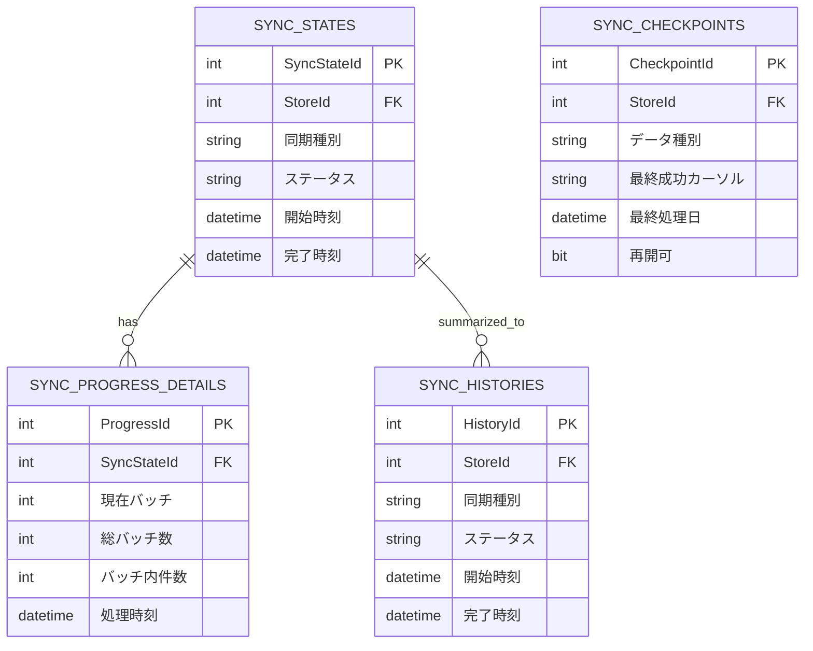

# データベース設計書（EC Ranger / Shopify AI Marketing Suite）

作成日: 2025-08-24 21:25:03
作成者: ERIS（補助: 福田）
適用範囲: backend/ShopifyAnalyticsApi の `Models/` と `ShopifyDbContext.cs`、DDL（docs/…/マイグレーション/*.sql および backend/.../Migrations/*.sql, *.cs）

---

## 1. 全体構成

- DBエンジン: Azure SQL Database（SQL Server 互換）
- マルチテナント/マルチストア対応
  - `Tenants`（論理顧客）→ `Stores`（店舗）→ 各種エンティティ
- 主なドメイン
  - コマースデータ: `Customers`, `Orders`, `OrderItems`, `Products`, `ProductVariants`
  - 同期管理: `SyncStates`, `SyncProgressDetails`, `SyncRangeSettings`, `SyncCheckpoints`, `SyncHistories`, `SyncStatuses`
  - Shopify連携/監査: `WebhookEvents`, `InstallationHistory`, `GDPRComplianceLog`
  - 課金: `SubscriptionPlans`, `StoreSubscriptions`

---

## 2. 主要テーブル定義（論理/物理）

以下はモデル属性と `ShopifyDbContext` の設定を反映した論理定義。必要に応じてDDLからのインデックス・制約を併記。

### 2.1 `Tenants`
説明: マルチテナンシを表す論理顧客（組織）単位。1テナントに複数ストアが紐づきます。

#### 関連ドメインモデル
- Models: `Tenant`

#### 利用API
- 直接の公開APIはなし（`Stores` 経由で参照）

#### 主要ユースケース
- テナント単位の権限/課金/レポート集計の論理境界
- 主キー: `Id (nvarchar(100))`
- カラム: `CompanyName (nvarchar(255))`, `ContactEmail (nvarchar(255))`, `CreatedAt (datetime2)`, `UpdatedAt (datetime2)`, `Status (nvarchar(50), default 'active')`
- リレーション: `Tenants 1 - n Stores`
- インデックス: `IX_Tenants_Id`（DDLあり）

### 2.2 `Stores`
説明: Shopifyの店舗（Shop）情報を保持する中核テーブル。認証情報・状態・設定を含みます。

#### 関連ドメインモデル
- Models: `Store`

#### 利用API
- Controllers: `ShopifyAuthController`, `SetupController`, `ManualSyncController`, `DashboardController`, `StoreController`, `EmbeddedAppController`

#### 主要ユースケース
- OAuthインストールとトークン保存、埋め込み設定の配信、同期やダッシュボードのストア文脈解決
- 主キー: `Id (int)`
- 必須: `Name (nvarchar(100))`
- 任意: `Domain (nvarchar(255))`, `ShopifyShopId (nvarchar(100))`
- 運用: `Description (nvarchar(500))`, `DataType (nvarchar(50), default 'production')`, `IsActive (bit)`, `Settings (nvarchar(max))`
- 認証系: `TenantId (nvarchar(100))`, `ApiKey (nvarchar(255))`, `ApiSecret (nvarchar(255))`, `AccessToken (nvarchar(max))`, `Scopes (nvarchar(500))`
- 初期設定: `InitialSetupCompleted (bit)`, `LastSyncDate (datetime2)`
- GDPR/インストール（DDLで追加）: `InstalledAt`, `UninstalledAt`, `DataDeletionScheduledAt`, `DataDeletionCompletedAt`（各 datetime2）
- リレーション: `TenantId → Tenants(Id)`（FK）、`Stores 1 - n Customers/Products/Orders`
- インデックス（`OnModelCreating`/DDL）:
  - 参照: `Customers(StoreId, Email)`, `Customers(StoreId, ShopifyCustomerId)`
  - 参照: `Products(StoreId, Title)`、`Orders(StoreId, OrderNumber)`

### 2.3 `Customers`
説明: 店舗に属する顧客マスタ。購買サマリ（累計金額・回数）やマーケ許諾を保持します。

#### 関連ドメインモデル
- Models: `Customer`

#### 利用API
- Controllers: `CustomerController`, `DatabaseController`
- Services: `ShopifyApiService`（取込）, `Dormant*`, `PurchaseCount*`

#### 主要ユースケース
- 顧客ダッシュボード、休眠分析、購入回数分析、マーケティング許諾管理
- 主キー: `Id (int)`
- 必須: `StoreId (int)`, `FirstName (nvarchar(100))`, `LastName (nvarchar(100))`, `Email (nvarchar(255))`
- 任意: `Phone (nvarchar(20))`, `Company (nvarchar(100))`, `City (nvarchar(50))`, `ProvinceCode (nvarchar(10))`, `CountryCode (nvarchar(10))`, `AddressPhone (nvarchar(20))`
- Shopify識別子: `ShopifyCustomerId (nvarchar(50))`
- 属性/統計: `AcceptsEmailMarketing (bit)`, `AcceptsSMSMarketing (bit)`, `TotalSpent (decimal(18,2))`, `TotalOrders (int)`, `TaxExempt (bit)`, `Tags (nvarchar(1000))`, `CompanyStoreName (nvarchar(100))`, `Industry (nvarchar(100))`, `IsActive (bit)`
- 互換: `CustomerSegment (nvarchar(50))`, `OrdersCount (int, obsolete)`
- 監査: `CreatedAt`, `UpdatedAt`
- インデックス（`OnModelCreating`）:
  - `Email` 単独（重複許容: Unique削除済表記あり）
  - `ShopifyCustomerId` 単独
  - マルチストア: `(StoreId, Email)`, `(StoreId, ShopifyCustomerId)`
- リレーション: `Customers n - 1 Stores`, `Orders n - 1 Customers`

### 2.4 `Orders`
説明: 受注データ。顧客・金額・状態などを保持し、ダッシュボード/分析の主ソースです。

#### 関連ドメインモデル
- Models: `Order`

#### 利用API
- Controllers: `DashboardController`（KPI等）
- Services: `ShopifyApiService`（取込）, `MonthlySalesService`

#### 主要ユースケース
- 期間KPI、トレンド、顧客別/商品別売上の基礎データ
- 主キー: `Id (int)`
- 必須: `StoreId (int)`, `OrderNumber (nvarchar(50))`, `CustomerId (int)`
- 金額: `TotalPrice`, `SubtotalPrice`, `TaxPrice`, `TotalTax`（各 decimal(18,2)）
- ステータス: `Currency (nvarchar(50))`, `Status (nvarchar(50))`, `FinancialStatus (nvarchar(50))`, `FulfillmentStatus (nvarchar(50), null)`
- Shopify識別子: `ShopifyOrderId (nvarchar(50))`, `ShopifyCustomerId (nvarchar(50))`
- 監査: `CreatedAt`, `UpdatedAt`
- インデックス（`OnModelCreating`）: `OrderNumber` Unique、`(StoreId, OrderNumber)`（補助検索用）
- リレーション: `Orders n - 1 Stores`, `Orders n - 1 Customers`, `OrderItems 1 - n`

### 2.5 `OrderItems`
説明: 注文明細。商品スナップショット（名称・SKU等）を保存し、月次/前年比集計に利用します。

#### 関連ドメインモデル
- Models: `OrderItem`

#### 利用API
- Controllers: （間接）`AnalyticsController`
- Services: `MonthlySalesService`, `YearOverYear*`

#### 主要ユースケース
- 商品×月集計、カテゴリ別集計、前年比比較の算出
- 主キー: `Id (int)`
- FK: `OrderId (int)`
- スナップショット: `ProductTitle`, `ProductHandle`, `ProductVendor`, `ProductType`, `Sku`, `VariantTitle`
- Shopify識別子: `ShopifyLineItemId`, `ShopifyProductId`, `ShopifyVariantId`
- 価格: `Price (decimal)`, `CompareAtPrice (decimal?)`, `Quantity (int)`, `TotalPrice (decimal)`
- オプション: `Option1/2/3 Name/Value`
- フラグ: `RequiresShipping (bit)`, `Taxable (bit)`
- 監査: `CreatedAt`, `UpdatedAt`
- インデックス（DDL/`OnModelCreating`）: `OrderId`、運用向け追加（DDL）: `CreatedAt`、複合`(OrderId, CreatedAt)` など

### 2.6 `Products`
説明: 商品マスタ。タイトル/カテゴリ/ベンダー等のメタ情報を保持し、分析/UIに利用します。

#### 関連ドメインモデル
- Models: `Product`

#### 利用API
- Controllers: `DashboardController`（トップ商品）
- Services: `ShopifyApiService`（取込）, `MonthlySalesService`

#### 主要ユースケース
- トップ商品抽出、商品フィルタ、売上寄与分析
- 主キー: `Id (int)`
- 必須: `StoreId (int)`, `Title (nvarchar(255))`
- Shopify: `Handle (nvarchar(255))`, `ShopifyProductId (nvarchar(50))`
- 属性: `Description (nvarchar(1000))`, `Category (nvarchar(100))`, `Vendor (nvarchar(100))`, `ProductType (nvarchar(100))`, `InventoryQuantity (int)`
- 監査: `CreatedAt`, `UpdatedAt`
- インデックス（`OnModelCreating`）: `Title`、`(StoreId, Title)`
- リレーション: `Products 1 - n ProductVariants`

### 2.7 `ProductVariants`
説明: 商品のバリアント（サイズ/色等）情報。SKU/価格/在庫などの販売属性を保持します。

#### 関連ドメインモデル
- Models: `ProductVariant`

#### 利用API
- Services: `ShopifyApiService`（取込）

#### 主要ユースケース
- バリアント別在庫・価格表示、SKUベースの分析
- 主キー: `Id (int)`
- FK: `ProductId (int)`
- Shopify: `ShopifyVariantId (nvarchar(50))`
- 属性: `Title (nvarchar(255))`, `Sku (nvarchar(100))`, `Price (decimal)`, `CompareAtPrice (decimal?)`, `InventoryQuantity (int)`
- オプション: `Option1/2/3 Name/Value (nvarchar(100))`
- 物理属性: `Barcode (nvarchar(100))`, `Weight (decimal?)`, `WeightUnit (nvarchar(10))`
- 監査: `CreatedAt`, `UpdatedAt`

### 2.8 同期管理テーブル
説明: Shopifyデータ取得の進捗・範囲・再開点・履歴を管理する運用テーブル群です。

#### 関連ドメインモデル
- Models: `SyncState`, `SyncProgressDetail`, `SyncRangeSetting`, `SyncCheckpoint`, `SyncHistory`, `SyncStatus`

#### 利用API
- Controllers: `ManualSyncController`, `SyncManagementController`, `DashboardController`
- Services: `ShopifyDataSyncService`, `SyncProgressTracker`, `SyncRangeManager`, `CheckpointManager`

#### 主要ユースケース
- 手動/定期同期の可視化、途中中断からの再開、範囲の運用変更、履歴の監査
- `SyncStates`
  - 主キー: `SyncStateId`
  - 必須: `StoreId`, `SyncType`, `Status`
  - 実行情報: `StartedAt`, `CompletedAt`, `LastActivityAt`, `DateRangeStart/End`
  - 進捗: `TotalRecords`, `ProcessedRecords`, `FailedRecords`, `ProgressPercentage`
  - カーソル: `ProductCursor`, `CustomerCursor`, `OrderCursor`
  - リレーション: `SyncStates 1 - n SyncProgressDetails`
- `SyncProgressDetails`
  - 主キー: `ProgressId`
  - FK: `SyncStateId`
  - 実行・性能: `CurrentBatch`, `TotalBatches`, `RecordsPerSecond`, `AverageResponseTime` ほか
- `SyncRangeSettings`
  - 主キー: `SettingId`
  - `StoreId`, `DataType`, `StartDate`, `EndDate`, `YearsBack`, `IncludeArchived`, `IsActive`
- `SyncCheckpoints`
  - 主キー: `CheckpointId`
  - カーソル/再開情報: `LastSuccessfulCursor`, `LastProcessedDate`, `CanResume` ほか
- `SyncHistories`
  - 主キー: `HistoryId`
  - 結果要約: `RecordsProcessed/Failed`, `Duration`, `Success` ほか
- `SyncStatuses`（簡易トラッキング, DDL 由来）
  - 主キー: `Id`
  - 注意: `StoreId` は nvarchar(255) （DDLに一致）

### 2.9 Webhook/監査
説明: Webhook受信イベント・インストール履歴・GDPRリクエストの監査/法令対応のための記録です。

#### 関連ドメインモデル
- Models: `WebhookEvent`, `InstallationHistory`, `GDPRComplianceLog`

#### 利用API
- Controllers: `WebhookController`

#### 主要ユースケース
- 課金/アンインストール/GDPRのイベント処理・監査・再処理基盤
- `WebhookEvents`
  - 主キー: `Id`
  - 必須: `StoreId`, `ShopDomain (255)`, `Topic (100)`
  - 状態: `Status (50)`, `ProcessedAt`, `ScheduledDeletionDate`
  - 監査: `CreatedAt`, `UpdatedAt`
  - 冪等性: `IdempotencyKey (255)` + インデックス（`OnModelCreating`: Unique + Filtered）
  - インデックス（DDL）: `ShopDomain`, `Topic`, `Status`, `CreatedAt DESC`, `ScheduledDeletionDate (IS NOT NULL)`
- `InstallationHistory`
  - 主キー: `Id`
  - 必須: `StoreId`, `ShopDomain`, `Action`
  - 認可: `AccessToken`, `Scopes`
  - 監査: `InstalledAt`, `UninstalledAt`, `CreatedAt`
- `GDPRComplianceLog`
  - 主キー: `Id`
  - 必須: `ShopDomain`, `RequestType`
  - 任意: `StoreId`, `RequestId`, `CustomerId`, `Details`
  - 期限管理: `RequestedAt`, `CompletedAt`, `DueDate`, `Status`

### 2.10 課金
説明: 課金プラン定義とストアの契約状態を管理。承認URL/トライアル/周期終了などを保持します。

#### 関連ドメインモデル
- Models: `SubscriptionPlan`, `StoreSubscription`

#### 利用API
- Controllers: `SubscriptionController`
- Services: `ShopifySubscriptionService`

#### 主要ユースケース
- プラン表示/選択、承認URL遷移、トライアル管理、Webhookによる状態更新
- `SubscriptionPlans`
  - 主キー: `Id`
  - `Name (100)`, `Price (decimal(10,2))`, `TrialDays`, `Features (json)`, `IsActive`, 監査
- `StoreSubscriptions`
  - 主キー: `Id`
  - FK: `StoreId`, `PlanId`
  - Shopify: `ShopifyChargeId`, `ConfirmationUrl`
  - 状態/期間: `Status`, `TrialEndsAt`, `CurrentPeriodEnd`, `ActivatedAt`, `CancelledAt`

---

## 3. インデックス/制約（抜粋）
- `Customers`
  - `(StoreId, Email)`, `(StoreId, ShopifyCustomerId)`
- `Orders`
  - `OrderNumber` Unique、`(StoreId, OrderNumber)`
- `OrderItems`
  - `OrderId`、`CreatedAt`、`(OrderId, CreatedAt)`（DDL: 2025-08-02/緊急）
- `WebhookEvents`
  - `ShopDomain`, `Topic`, `Status`, `CreatedAt DESC`, `ScheduledDeletionDate`（DDL）
  - `IdempotencyKey` Unique Filtered（NULL許容）

---

## 4. モデルとDDLの差分（注意/改善提案）
- 差分: `WebhookEvents.IdempotencyKey`
  - モデル: あり（MaxLength(255)）
  - DDL: 作成スクリプトにはカラム追加記述なし（2025-08-13）
  - `ShopifyDbContext` では `IdempotencyKey` にユニーク・フィルタードインデックス設定済
  - 提案: `ALTER TABLE WebhookEvents ADD IdempotencyKey NVARCHAR(255) NULL;` とインデックスDDLを追加
- 差分: 課金テーブル（`SubscriptionPlans`, `StoreSubscriptions`）
  - モデル: あり
  - DDL: 生成/追加スクリプト未検出
  - 提案: 生成DDLを新規作成し、tracking.mdへ追記
- 差分: `Sync` 系テーブルの命名/型の揺れ
  - モデル: `SyncStates/SyncProgressDetails/SyncRangeSettings/SyncCheckpoints/SyncHistories` 等
  - DDL: `SyncStatuses` は別系（作成済）で `StoreId` が nvarchar(255)
  - 提案: 運用意図を整理（EF Code-Firstで生成 or 手書きDDLで統一）。`StoreId` の型整合（int or nvarchar）方針決定

---

## 5. リレーション図（概念）

- Tenants(1) — Stores(n)
- Stores(1) — Customers(n) — Orders(n) — OrderItems(n)
- Products(1) — ProductVariants(n)
- Stores(1) — SyncStates(n) — SyncProgressDetails(n)
- Stores(1) — SyncRangeSettings(n), SyncCheckpoints(n), SyncHistories(n), SyncStatuses(n)
- Stores(1) — WebhookEvents(n), InstallationHistory(n), GDPRComplianceLog(n)
- Stores(1) — StoreSubscriptions(n) — SubscriptionPlans(1)

---

## 6. 規約/命名/データ型
- 文字列: 主要IDは `nvarchar(50|100|255)` を用途で使い分け
- 金額: `decimal(18,2)`（課金は `decimal(10,2)`）
- 日付: `datetime2`、UTC運用
- インデックス: マルチストアは `(StoreId, X)` を基本

---

## 7. マイグレーション運用
- 追加DDL作成時は `docs/04-development/03-データベース/マイグレーション/` 配下に `YYYY-MM-DD-説明.sql`
- `database-migration-tracking.md` を更新（作成日/作成者/内容/適用状況・日時）

---

## 8. 付録: 要追加DDL（提案）

1) WebhookEvents.IdempotencyKey 追加
```sql
ALTER TABLE WebhookEvents ADD IdempotencyKey NVARCHAR(255) NULL;
CREATE UNIQUE INDEX UX_WebhookEvents_IdempotencyKey
  ON WebhookEvents(IdempotencyKey)
  WHERE IdempotencyKey IS NOT NULL;
```

2) 課金テーブル作成
```sql
CREATE TABLE SubscriptionPlans (
  Id INT IDENTITY(1,1) PRIMARY KEY,
  Name NVARCHAR(100) NOT NULL,
  Price DECIMAL(10,2) NOT NULL,
  TrialDays INT NOT NULL DEFAULT 7,
  Features NVARCHAR(MAX) NULL,
  IsActive BIT NOT NULL DEFAULT 1,
  CreatedAt DATETIME2 NOT NULL DEFAULT GETUTCDATE(),
  UpdatedAt DATETIME2 NOT NULL DEFAULT GETUTCDATE()
);

CREATE TABLE StoreSubscriptions (
  Id INT IDENTITY(1,1) PRIMARY KEY,
  StoreId INT NOT NULL,
  PlanId INT NOT NULL,
  ShopifyChargeId BIGINT NULL,
  Status NVARCHAR(50) NOT NULL DEFAULT 'pending',
  TrialEndsAt DATETIME2 NULL,
  CurrentPeriodEnd DATETIME2 NULL,
  ActivatedAt DATETIME2 NULL,
  CancelledAt DATETIME2 NULL,
  ConfirmationUrl NVARCHAR(500) NULL,
  CreatedAt DATETIME2 NOT NULL DEFAULT GETUTCDATE(),
  UpdatedAt DATETIME2 NOT NULL DEFAULT GETUTCDATE(),
  CONSTRAINT FK_StoreSubscriptions_Store FOREIGN KEY (StoreId) REFERENCES Stores(Id) ON DELETE CASCADE,
  CONSTRAINT FK_StoreSubscriptions_Plan FOREIGN KEY (PlanId) REFERENCES SubscriptionPlans(Id) ON DELETE NO ACTION
);

CREATE INDEX IX_StoreSubscriptions_StoreId ON StoreSubscriptions(StoreId);
CREATE INDEX IX_StoreSubscriptions_Status ON StoreSubscriptions(Status);
```

3) 型整合（検討）
- `SyncStatuses.StoreId` を `int` 化するか、他Sync系を `nvarchar` に寄せるか運用方針に合わせて決定

---

以上。運用に入れる前に不足DDLの発行と `database-migration-tracking.md` の更新を行ってください。

---

## 付録A: テーブル定義一覧（カラム仕様）

以下は主テーブルのカラム定義（論理）です。型はSQL Server基準、NNはNOT NULL、Idxは主なインデックス対象です。

### Tenants
| Column | Type | PK | FK | NN | Default | Idx | 説明 |
|---|---|---|---|---|---|---|---|
| Id | nvarchar(100) | ◯ |  | ◯ |  | ◯(IX_Tenants_Id) | テナント識別子 |
| CompanyName | nvarchar(255) |  |  | ◯ |  |  | 会社名 |
| ContactEmail | nvarchar(255) |  |  | ◯ |  |  | 連絡先メール |
| CreatedAt | datetime2 |  |  | ◯ | GETUTCDATE() |  | 作成時刻(UTC) |
| UpdatedAt | datetime2 |  |  | ◯ | GETUTCDATE() |  | 更新時刻(UTC) |
| Status | nvarchar(50) |  |  |  | 'active' |  | 状態 |

### Stores
| Column | 論理名 | Type | PK | FK | NN | Default | Idx | 説明 |
|---|---|---|---|---|---|---|---|---|
| Id | ストアID | int | ◯ |  | ◯ |  |  | ストアを一意に識別するID |
| Name | ストア名 | nvarchar(100) |  |  | ◯ |  |  | 表示用の店舗名称 |
| Domain | ドメイン | nvarchar(255) |  |  |  |  |  | myshopifyドメイン等のホスト名 |
| ShopifyShopId | ShopifyショップID | nvarchar(100) |  |  |  |  |  | ShopifyのShop ID |
| Description | 説明 | nvarchar(500) |  |  |  |  |  | 店舗説明文 |
| DataType | データ種別 | nvarchar(50) |  |  | ◯ | 'production' |  | 運用/検証などの区分 |
| IsActive | 有効フラグ | bit |  |  | ◯ | 1 |  | 利用可否 |
| Settings | 設定(JSON) | nvarchar(max) |  |  |  |  |  | 追加設定（JSON） |
| TenantId | テナントID | nvarchar(100) |  | Tenants.Id |  |  | ◯(IX_Stores_TenantId) | 紐付くテナント |
| ApiKey | APIキー | nvarchar(255) |  |  |  |  |  | Shopify APIキー |
| ApiSecret | APIシークレット | nvarchar(255) |  |  |  |  |  | Shopify APIシークレット |
| AccessToken | アクセストークン | nvarchar(max) |  |  |  |  |  | 店舗のアクセストークン（暗号化保管推奨） |
| Scopes | スコープ | nvarchar(500) |  |  |  |  |  | 付与済みスコープ一覧 |
| InitialSetupCompleted | 初期設定完了 | bit |  |  | ◯ | 0 |  | 初期セットアップ済みフラグ |
| LastSyncDate | 最終同期日時 | datetime2 |  |  |  |  |  | データ同期の最終実行時刻 |
| InstalledAt | インストール日時 | datetime2 |  |  |  |  |  | アプリ導入時刻 |
| UninstalledAt | アンインストール日時 | datetime2 |  |  |  |  |  | アプリ削除時刻 |
| DataDeletionScheduledAt | データ削除予定 | datetime2 |  |  |  |  |  | GDPR削除予定日時 |
| DataDeletionCompletedAt | データ削除完了 | datetime2 |  |  |  |  |  | GDPR削除完了日時 |
| CreatedAt | 作成時刻 | datetime2 |  |  | ◯ | GETUTCDATE() |  | レコード作成時刻(UTC) |
| UpdatedAt | 更新時刻 | datetime2 |  |  | ◯ | GETUTCDATE() |  | レコード更新時刻(UTC) |

### Customers
| Column | 論理名 | Type | PK | FK | NN | Default | Idx | 説明 |
|---|---|---|---|---|---|---|---|---|
| Id | 顧客ID | int | ◯ |  | ◯ |  |  | 顧客を一意に識別するID |
| StoreId | ストアID | int |  | Stores.Id | ◯ |  | ◯(StoreId,Email)/(StoreId,ShopifyCustomerId) | 所属ストア |
| ShopifyCustomerId | Shopify顧客ID | nvarchar(50) |  |  |  |  | ◯ | Shopify上の顧客ID |
| FirstName | 名 | nvarchar(100) |  |  | ◯ |  |  | 名（First） |
| LastName | 姓 | nvarchar(100) |  |  | ◯ |  |  | 姓（Last） |
| Email | メール | nvarchar(255) |  |  | ◯ |  | (Email), (StoreId,Email) | 連絡用メールアドレス |
| Phone | 電話番号 | nvarchar(20) |  |  |  |  |  | 顧客電話 |
| Company | 会社名 | nvarchar(100) |  |  |  |  |  | 会社/組織名 |
| City | 市区町村 | nvarchar(50) |  |  |  |  |  | 住所（市区町村） |
| ProvinceCode | 都道府県コード | nvarchar(10) |  |  |  |  |  | 住所（都道府県） |
| CountryCode | 国コード | nvarchar(10) |  |  |  |  |  | 国コード（ISO） |
| AddressPhone | 住所電話 | nvarchar(20) |  |  |  |  |  | 住所に紐付く電話 |
| AcceptsEmailMarketing | メール許諾 | bit |  |  | ◯ | 0 |  | マーケティングメール許可 |
| AcceptsSMSMarketing | SMS許諾 | bit |  |  | ◯ | 0 |  | SMS許可 |
| TotalSpent | 累計購入金額 | decimal(18,2) |  |  | ◯ | 0 |  | 生涯購入金額 |
| TotalOrders | 累計注文数 | int |  |  | ◯ | 0 |  | 注文回数 |
| TaxExempt | 非課税 | bit |  |  | ◯ | 0 |  | 税免除フラグ |
| Tags | タグ | nvarchar(1000) |  |  |  |  |  | タグ文字列 |
| CompanyStoreName | 会社/店舗名 | nvarchar(100) |  |  |  |  |  | 表示用フィールド |
| Industry | 業種 | nvarchar(100) |  |  |  |  |  | 産業分類 |
| IsActive | アクティブ | bit |  |  | ◯ | 1 |  | 有効状態 |
| CreatedAt | 作成時刻 | datetime2 |  |  | ◯ | GETUTCDATE() |  | 作成(UTC) |
| UpdatedAt | 更新時刻 | datetime2 |  |  | ◯ | GETUTCDATE() |  | 更新(UTC) |
| CustomerSegment | セグメント | nvarchar(50) |  |  | ◯ | '新規顧客' |  | 区分（互換） |
| OrdersCount | 旧:注文件数 | int |  |  | ◯ | 0 |  | 非推奨（互換） |

### Orders
| Column | 論理名 | Type | PK | FK | NN | Default | Idx | 説明 |
|---|---|---|---|---|---|---|---|---|
| Id | 注文ID | int | ◯ |  | ◯ |  |  | 注文を一意に識別 |
| StoreId | ストアID | int |  | Stores.Id | ◯ |  |  | 所属ストア |
| OrderNumber | 注文番号 | nvarchar(50) |  |  | ◯ |  | ◯(Unique), ◯(StoreId,OrderNumber) | 表示用の注文番号 |
| ShopifyOrderId | Shopify注文ID | nvarchar(50) |  |  |  |  |  | Shopifyの注文ID |
| ShopifyCustomerId | Shopify顧客ID | nvarchar(50) |  |  |  |  |  | Shopifyの顧客ID |
| Email | 注文メール | nvarchar(255) |  |  |  |  |  | 注文時メール |
| CustomerId | 顧客ID | int |  | Customers.Id | ◯ |  |  | 紐付く顧客 |
| TotalPrice | 合計金額 | decimal(18,2) |  |  | ◯ |  |  | 総額 |
| SubtotalPrice | 小計 | decimal(18,2) |  |  | ◯ |  |  | 税抜等の小計 |
| TaxPrice | 税額 | decimal(18,2) |  |  | ◯ |  |  | 税金 |
| TotalTax | 総税額(互換) | decimal(18,2) |  |  | ◯ |  |  | 互換フィールド |
| Currency | 通貨 | nvarchar(50) |  |  | ◯ | 'JPY' |  | 通貨コード |
| Status | ステータス | nvarchar(50) |  |  | ◯ | 'pending' |  | 受注状態 |
| FinancialStatus | 請求状態 | nvarchar(50) |  |  | ◯ | 'pending' |  | 支払状態 |
| FulfillmentStatus | 出荷状態 | nvarchar(50) |  |  |  |  |  | フルフィルメント状態 |
| CreatedAt | 作成時刻 | datetime2 |  |  | ◯ | GETUTCDATE() |  | 作成(UTC) |
| UpdatedAt | 更新時刻 | datetime2 |  |  | ◯ | GETUTCDATE() |  | 更新(UTC) |

### OrderItems
| Column | 論理名 | Type | PK | FK | NN | Default | Idx | 説明 |
|---|---|---|---|---|---|---|---|---|
| Id | 明細ID | int | ◯ |  | ◯ |  |  | 注文明細ID |
| OrderId | 注文ID | int |  | Orders.Id | ◯ |  | ◯ | 紐付く注文 |
| ProductId | 参照ProductID | nvarchar(50) |  |  |  |  |  | 文字列の参照ID（スナップショット） |
| ShopifyLineItemId | Shopify行ID | nvarchar(50) |  |  |  |  |  | Shopify LineItem ID |
| ShopifyProductId | Shopify商品ID | nvarchar(50) |  |  |  |  |  | Shopify Product ID |
| ShopifyVariantId | ShopifyバリアントID | nvarchar(50) |  |  |  |  |  | Shopify Variant ID |
| ProductTitle | 商品名 | nvarchar(255) |  |  | ◯ |  |  | 商品名スナップショット |
| Title | 互換Title | nvarchar(255) |  |  |  |  |  | 互換用 |
| ProductHandle | ハンドル | nvarchar(255) |  |  |  |  |  | 商品ハンドル |
| ProductVendor | ベンダー | nvarchar(100) |  |  |  |  |  | 供給元 |
| ProductType | 商品タイプ | nvarchar(100) |  |  |  |  |  | タイプ分類 |
| Sku | SKU | nvarchar(100) |  |  |  |  |  | SKUコード |
| VariantTitle | バリアント名 | nvarchar(100) |  |  |  |  |  | バリアント表示名 |
| Price | 単価 | decimal(18,2) |  |  | ◯ |  |  | 単価金額 |
| CompareAtPrice | 比較価格 | decimal(18,2) |  |  |  |  |  | 通常価格など |
| Quantity | 数量 | int |  |  | ◯ |  |  | 購入数量 |
| TotalPrice | 明細合計 | decimal(18,2) |  |  | ◯ |  |  | 小計 |
| Option1Name | オプション1名 | nvarchar(100) |  |  |  |  |  |  |
| Option1Value | オプション1値 | nvarchar(100) |  |  |  |  |  |  |
| Option2Name | オプション2名 | nvarchar(100) |  |  |  |  |  |  |
| Option2Value | オプション2値 | nvarchar(100) |  |  |  |  |  |  |
| Option3Name | オプション3名 | nvarchar(100) |  |  |  |  |  |  |
| Option3Value | オプション3値 | nvarchar(100) |  |  |  |  |  |  |
| RequiresShipping | 要配送 | bit |  |  | ◯ | 1 |  | 配送必要フラグ |
| Taxable | 課税 | bit |  |  | ◯ | 1 |  | 課税対象 |
| CreatedAt | 作成時刻 | datetime2 |  |  | ◯ | GETUTCDATE() | ◯(CreatedAt), ◯(OrderId,CreatedAt) | 作成(UTC) |
| UpdatedAt | 更新時刻 | datetime2 |  |  | ◯ | GETUTCDATE() |  | 更新(UTC) |

### Products
| Column | 論理名 | Type | PK | FK | NN | Default | Idx | 説明 |
|---|---|---|---|---|---|---|---|---|
| Id | 商品ID | int | ◯ |  | ◯ |  |  | 商品を一意に識別 |
| StoreId | ストアID | int |  | Stores.Id | ◯ |  |  | 所属ストア |
| Title | 商品名 | nvarchar(255) |  |  | ◯ |  | ◯, ◯(StoreId,Title) | 表示用商品名 |
| Handle | ハンドル | nvarchar(255) |  |  |  |  |  | URLハンドル |
| ShopifyProductId | Shopify商品ID | nvarchar(50) |  |  |  |  |  | Shopify Product ID |
| Description | 説明 | nvarchar(1000) |  |  |  |  |  | 商品説明 |
| Category | カテゴリ | nvarchar(100) |  |  |  |  |  | 分類カテゴリ |
| Vendor | ベンダー | nvarchar(100) |  |  |  |  |  | 供給元 |
| ProductType | 商品タイプ | nvarchar(100) |  |  |  |  |  | 型・タイプ |
| InventoryQuantity | 在庫数 | int |  |  | ◯ | 0 |  | 現在在庫 |
| CreatedAt | 作成時刻 | datetime2 |  |  | ◯ | GETUTCDATE() |  | 作成(UTC) |
| UpdatedAt | 更新時刻 | datetime2 |  |  | ◯ | GETUTCDATE() |  | 更新(UTC) |

### ProductVariants
| Column | 論理名 | Type | PK | FK | NN | Default | Idx | 説明 |
|---|---|---|---|---|---|---|---|---|
| Id | バリアントID | int | ◯ |  | ◯ |  |  | 商品バリアントID |
| ProductId | 商品ID | int |  | Products.Id | ◯ |  | ◯ | 親商品ID |
| ShopifyVariantId | ShopifyバリアントID | nvarchar(50) |  |  |  |  |  | Shopify Variant ID |
| Title | バリアント名称 | nvarchar(255) |  |  |  |  |  | 表示名 |
| Sku | SKU | nvarchar(100) |  |  |  |  |  | SKUコード |
| Price | 価格 | decimal(18,2) |  |  | ◯ |  |  | 販売価格 |
| CompareAtPrice | 比較価格 | decimal(18,2) |  |  |  |  |  | 通常価格等 |
| InventoryQuantity | 在庫数 | int |  |  | ◯ | 0 |  | 在庫数量 |
| Option1Name/Value | オプション1(名/値) | nvarchar(100) |  |  |  |  |  |  |
| Option2Name/Value | オプション2(名/値) | nvarchar(100) |  |  |  |  |  |  |
| Option3Name/Value | オプション3(名/値) | nvarchar(100) |  |  |  |  |  |  |
| Barcode | バーコード | nvarchar(100) |  |  |  |  |  |  |
| Weight | 重量 | decimal(18,2) |  |  |  |  |  |  |
| WeightUnit | 重量単位 | nvarchar(10) |  |  |  |  |  |  |
| RequiresShipping | 要配送 | bit |  |  | ◯ | 1 |  | 配送必要フラグ |
| Taxable | 課税 | bit |  |  | ◯ | 1 |  | 課税対象 |
| CreatedAt | 作成時刻 | datetime2 |  |  | ◯ | GETUTCDATE() |  | 作成(UTC) |
| UpdatedAt | 更新時刻 | datetime2 |  |  | ◯ | GETUTCDATE() |  | 更新(UTC) |

### WebhookEvents
| Column | 論理名 | Type | PK | FK | NN | Default | Idx | 説明 |
|---|---|---|---|---|---|---|---|---|
| Id | イベントID | int | ◯ |  | ◯ |  |  | WebhookイベントID |
| StoreId | ストアID | int |  | Stores.Id | ◯ |  | ◯ | 対象ストア |
| ShopDomain | ショップドメイン | nvarchar(255) |  |  | ◯ |  | ◯ | 送信元ドメイン |
| Topic | トピック | nvarchar(100) |  |  | ◯ |  | ◯ | Webhookトピック名 |
| Payload | ペイロード | nvarchar(max) |  |  |  |  |  | 受信JSON本体 |
| Status | ステータス | nvarchar(50) |  |  |  | 'pending' | ◯ | 処理状態 |
| ProcessedAt | 処理時刻 | datetime2 |  |  |  |  |  | 処理完了時刻 |
| ScheduledDeletionDate | 削除予定日 | datetime2 |  |  |  |  | ◯ | GDPR削除予定日時 |
| ErrorMessage | エラーメッセージ | nvarchar(max) |  |  |  |  |  | 失敗詳細 |
| IdempotencyKey | 冪等性キー | nvarchar(255) |  |  |  |  | ◯(Unique/Filtered) | 重複防止キー |
| CreatedAt | 作成時刻 | datetime2 |  |  | ◯ | GETUTCDATE() | ◯(CreatedAt DESC) | 受信時刻 |
| UpdatedAt | 更新時刻 | datetime2 |  |  | ◯ | GETUTCDATE() |  | 更新時刻 |

### InstallationHistory
| Column | 論理名 | Type | PK | FK | NN | Default | Idx | 説明 |
|---|---|---|---|---|---|---|---|---|
| Id | 履歴ID | int | ◯ |  | ◯ |  |  | インストール履歴ID |
| StoreId | ストアID | int |  | Stores.Id | ◯ |  |  | 対象ストア |
| ShopDomain | ショップドメイン | nvarchar(255) |  |  | ◯ |  |  | ドメイン |
| Action | アクション | nvarchar(50) |  |  | ◯ |  | ◯ | installed/uninstalled |
| AccessToken | アクセストークン | nvarchar(max) |  |  |  |  |  | 取得トークン |
| Scopes | スコープ | nvarchar(500) |  |  |  |  |  | 付与スコープ |
| InstalledAt | インストール日時 | datetime2 |  |  |  |  |  |  |
| UninstalledAt | アンインストール日時 | datetime2 |  |  |  |  |  |  |
| CreatedAt | 作成時刻 | datetime2 |  |  | ◯ | GETUTCDATE() |  |  |

### GDPRComplianceLog
| Column | 論理名 | Type | PK | FK | NN | Default | Idx | 説明 |
|---|---|---|---|---|---|---|---|---|
| Id | ログID | int | ◯ |  | ◯ |  |  | GDPRログID |
| StoreId | ストアID | int |  | Stores.Id |  |  |  | 対象ストア |
| ShopDomain | ショップドメイン | nvarchar(255) |  |  | ◯ |  | ◯ |  |
| RequestType | リクエスト種別 | nvarchar(50) |  |  | ◯ |  | ◯ | customer_redact 等 |
| RequestId | リクエストID | nvarchar(100) |  |  |  |  |  |  |
| CustomerId | 顧客ID | bigint |  |  |  |  |  |  |
| RequestedAt | 受付日時 | datetime2 |  |  | ◯ |  |  |  |
| CompletedAt | 完了日時 | datetime2 |  |  |  |  |  |  |
| DueDate | 期限 | datetime2 |  |  | ◯ |  | ◯ |  |
| Status | ステータス | nvarchar(50) |  |  |  | 'pending' | ◯ |  |
| Details | 詳細 | nvarchar(max) |  |  |  |  |  |  |
| CreatedAt | 作成時刻 | datetime2 |  |  | ◯ | GETUTCDATE() |  |  |
| UpdatedAt | 更新時刻 | datetime2 |  |  | ◯ | GETUTCDATE() |  |  |

### SubscriptionPlans
| Column | 論理名 | Type | PK | FK | NN | Default | Idx | 説明 |
|---|---|---|---|---|---|---|---|---|
| Id | プランID | int | ◯ |  | ◯ |  |  | 課金プランID |
| Name | プラン名 | nvarchar(100) |  |  | ◯ |  |  |  |
| Price | 価格 | decimal(10,2) |  |  | ◯ |  |  | 月額等の料金 |
| TrialDays | トライアル日数 | int |  |  | ◯ | 7 |  |  |
| Features | 機能一覧(JSON) | nvarchar(max) |  |  |  |  |  |  |
| IsActive | 有効フラグ | bit |  |  | ◯ | 1 |  |  |
| CreatedAt | 作成時刻 | datetime2 |  |  | ◯ | GETUTCDATE() |  |  |
| UpdatedAt | 更新時刻 | datetime2 |  |  | ◯ | GETUTCDATE() |  |  |

### StoreSubscriptions
| Column | 論理名 | Type | PK | FK | NN | Default | Idx | 説明 |
|---|---|---|---|---|---|---|---|---|
| Id | 契約ID | int | ◯ |  | ◯ |  |  | ストア契約ID |
| StoreId | ストアID | int |  | Stores.Id | ◯ |  | ◯ |  |
| PlanId | プランID | int |  | SubscriptionPlans.Id | ◯ |  |  |  |
| ShopifyChargeId | Shopify課金ID | bigint |  |  |  |  |  |  |
| Status | ステータス | nvarchar(50) |  |  | ◯ | 'pending' | ◯ |  |
| TrialEndsAt | トライアル終了 | datetime2 |  |  |  |  |  |  |
| CurrentPeriodEnd | 現在サイクル終了 | datetime2 |  |  |  |  |  |  |
| ActivatedAt | 有効化日時 | datetime2 |  |  |  |  |  |  |
| CancelledAt | 解約日時 | datetime2 |  |  |  |  |  |  |
| ConfirmationUrl | 承認URL | nvarchar(500) |  |  |  |  |  |  |
| CreatedAt | 作成時刻 | datetime2 |  |  | ◯ | GETUTCDATE() |  |  |
| UpdatedAt | 更新時刻 | datetime2 |  |  | ◯ | GETUTCDATE() |  |  |

### SyncStates
| Column | 論理名 | Type | PK | FK | NN | Default | Idx | 説明 |
|---|---|---|---|---|---|---|---|---|
| SyncStateId | 同期状態ID | int | ◯ |  | ◯ |  |  | 同期実行単位ID |
| StoreId | ストアID | int |  | Stores.Id | ◯ |  |  |  |
| SyncType | 同期種別 | nvarchar(50) |  |  | ◯ |  |  | Products/Customers/Orders など |
| Status | ステータス | nvarchar(50) |  |  | ◯ | 'Pending' |  | 実行状態 |
| StartedAt | 開始時刻 | datetime2 |  |  | ◯ | GETUTCDATE() |  |  |
| CompletedAt | 完了時刻 | datetime2 |  |  |  |  |  |  |
| TotalRecordsProcessed | 処理件数 | int |  |  | ◯ | 0 |  |  |
| TotalRecordsFailed | 失敗件数 | int |  |  | ◯ | 0 |  |  |
| ErrorMessage | エラー詳細 | nvarchar(max) |  |  |  |  |  |  |
| ProductCursor | 商品カーソル | nvarchar(max) |  |  |  |  |  |  |
| CustomerCursor | 顧客カーソル | nvarchar(max) |  |  |  |  |  |  |
| OrderCursor | 注文カーソル | nvarchar(max) |  |  |  |  |  |  |
| CreatedAt | 作成時刻 | datetime2 |  |  | ◯ | GETUTCDATE() |  |  |
| UpdatedAt | 更新時刻 | datetime2 |  |  | ◯ | GETUTCDATE() |  |  |
| TotalRecords | 対象件数 | int |  |  | ◯ | 0 |  |  |
| ProcessedRecords | 処理済件数 | int |  |  | ◯ | 0 |  |  |
| FailedRecords | 失敗件数合計 | int |  |  | ◯ | 0 |  |  |
| ProgressPercentage | 進捗率 | decimal |  |  | ◯ | 0 |  |  |
| LastActivityAt | 最終更新 | datetime2 |  |  | ◯ | GETUTCDATE() |  |  |
| DateRangeStart | 期間開始 | datetime2 |  |  |  |  |  |  |
| DateRangeEnd | 期間終了 | datetime2 |  |  |  |  |  |  |

### SyncProgressDetails
| Column | 論理名 | Type | PK | FK | NN | Default | Idx | 説明 |
|---|---|---|---|---|---|---|---|---|
| ProgressId | 進捗明細ID | int | ◯ |  | ◯ |  |  |  |
| SyncStateId | 同期状態ID | int |  | SyncStates.SyncStateId | ◯ |  |  |  |
| DataType | データ種別 | nvarchar(50) |  |  | ◯ |  |  |  |
| CurrentPage | 現在ページ | nvarchar(max) |  |  |  |  |  |  |
| CurrentBatch | 現在バッチ | int |  |  | ◯ | 0 |  |  |
| TotalBatches | 総バッチ数 | int |  |  |  |  |  |  |
| BatchStartedAt | バッチ開始 | datetime2 |  |  |  |  |  |  |
| LastUpdateAt | 最終更新 | datetime2 |  |  | ◯ | GETUTCDATE() |  |  |
| EstimatedCompletionTime | 推定完了時刻 | datetime2 |  |  |  |  |  |  |
| RecordsPerSecond | 処理速度 | float |  |  |  |  |  |  |
| AverageResponseTime | 平均応答時間 | int |  |  |  |  |  |  |
| RecordsInDateRange | 期間内レコード数 | int |  |  |  |  |  |  |
| RecordsSkipped | スキップ件数 | int |  |  | ◯ | 0 |  |  |
| RecordsWithErrors | エラー件数 | int |  |  | ◯ | 0 |  |  |
| BatchIdentifier | バッチ識別子 | nvarchar(max) |  |  |  |  |  |  |
| RecordsInBatch | バッチ内件数 | int |  |  | ◯ | 0 |  |  |
| ProcessedAt | 処理時刻 | datetime2 |  |  | ◯ | GETUTCDATE() |  |  |
| Status | ステータス | nvarchar(50) |  |  | ◯ | 'Processing' |  |  |
| ErrorMessage | エラーメッセージ | nvarchar(max) |  |  |  |  |  |  |

### SyncRangeSettings
| Column | 論理名 | Type | PK | FK | NN | Default | Idx | 説明 |
|---|---|---|---|---|---|---|---|---|
| SettingId | 範囲設定ID | int | ◯ |  | ◯ |  |  |  |
| StoreId | ストアID | int |  | Stores.Id | ◯ |  |  |  |
| DataType | データ種別 | nvarchar(50) |  |  | ◯ |  |  |  |
| StartDate | 開始日 | datetime2 |  |  | ◯ |  |  |  |
| EndDate | 終了日 | datetime2 |  |  | ◯ |  |  |  |
| YearsBack | さかのぼり年数 | int |  |  | ◯ | 3 |  |  |
| IncludeArchived | アーカイブ含む | bit |  |  | ◯ | 0 |  |  |
| IsActive | 有効フラグ | bit |  |  | ◯ | 1 |  |  |
| CreatedAt | 作成時刻 | datetime2 |  |  | ◯ | GETUTCDATE() |  |  |
| UpdatedAt | 更新時刻 | datetime2 |  |  | ◯ | GETUTCDATE() |  |  |
| CreatedBy | 作成者 | nvarchar(100) |  |  |  |  |  |  |

### SyncCheckpoints
| Column | 論理名 | Type | PK | FK | NN | Default | Idx | 説明 |
|---|---|---|---|---|---|---|---|---|
| CheckpointId | チェックポイントID | int | ◯ |  | ◯ |  |  |  |
| StoreId | ストアID | int |  | Stores.Id | ◯ |  |  |  |
| DataType | データ種別 | nvarchar(50) |  |  | ◯ |  |  |  |
| LastSuccessfulCursor | 最終成功カーソル | nvarchar(max) |  |  |  |  |  |  |
| LastProcessedDate | 最終処理日 | datetime2 |  |  |  |  |  |  |
| RecordsProcessedSoFar | 累計処理件数 | int |  |  | ◯ | 0 |  |  |
| SyncStartDate | 同期開始日 | datetime2 |  |  |  |  |  |  |
| SyncEndDate | 同期終了日 | datetime2 |  |  |  |  |  |  |
| CanResume | 再開可 | bit |  |  | ◯ | 1 |  |  |
| ExpiresAt | 有効期限 | datetime2 |  |  |  |  |  |  |
| CreatedAt | 作成時刻 | datetime2 |  |  | ◯ | GETUTCDATE() |  |  |
| UpdatedAt | 更新時刻 | datetime2 |  |  | ◯ | GETUTCDATE() |  |  |

### SyncHistories
| Column | 論理名 | Type | PK | FK | NN | Default | Idx | 説明 |
|---|---|---|---|---|---|---|---|---|
| HistoryId | 履歴ID | int | ◯ |  | ◯ |  |  | 同期履歴ID |
| StoreId | ストアID | int |  | Stores.Id | ◯ |  |  |  |
| SyncType | 同期種別 | nvarchar(50) |  |  | ◯ |  |  |  |
| Status | ステータス | nvarchar(50) |  |  | ◯ |  |  |  |
| StartedAt | 開始時刻 | datetime2 |  |  | ◯ |  |  |  |
| CompletedAt | 完了時刻 | datetime2 |  |  | ◯ |  |  |  |
| RecordsProcessed | 処理件数 | int |  |  | ◯ | 0 |  |  |
| RecordsFailed | 失敗件数 | int |  |  | ◯ | 0 |  |  |
| Duration | 所要時間 | time |  |  |  |  |  |  |
| ErrorDetails | エラー詳細 | nvarchar(max) |  |  |  |  |  |  |
| TriggeredBy | トリガー元 | nvarchar(100) |  |  |  |  |  |  |
| CreatedAt | 作成時刻 | datetime2 |  |  | ◯ | GETUTCDATE() |  |  |
| TotalRecords | 対象件数 | int |  |  | ◯ | 0 |  |  |
| ProcessedRecords | 処理済件数 | int |  |  | ◯ | 0 |  |  |
| FailedRecords | 失敗件数 | int |  |  | ◯ | 0 |  |  |
| Success | 成否 | bit |  |  | ◯ | 0 |  |  |
| ErrorMessage | エラーメッセージ | nvarchar(max) |  |  |  |  |  |  |
| DateRangeStart | 期間開始 | datetime2 |  |  |  |  |  |  |
| DateRangeEnd | 期間終了 | datetime2 |  |  |  |  |  |  |

### SyncStatuses（DDL由来）
| Column | 論理名 | Type | PK | FK | NN | Default | Idx | 説明 |
|---|---|---|---|---|---|---|---|---|
| Id | ステータスID | int | ◯ |  | ◯ |  |  |  |
| StoreId | ストアID(文字列) | nvarchar(255) |  |  | ◯ |  | ◯(IX_SyncStatuses_StoreId) |  |
| SyncType | 同期種別 | nvarchar(50) |  |  | ◯ |  | ◯ |  |
| Status | ステータス | nvarchar(50) |  |  | ◯ |  | ◯ |  |
| StartDate | 開始日 | datetime2 |  |  | ◯ |  |  |  |
| EndDate | 終了日 | datetime2 |  |  |  |  |  |  |
| TotalRecords | 対象件数 | int |  |  |  |  |  |  |
| ProcessedRecords | 処理済件数 | int |  |  |  |  |  |  |
| ErrorMessage | エラーメッセージ | nvarchar(max) |  |  |  |  |  |  |
| CreatedAt | 作成時刻 | datetime2 |  |  | ◯ | GETUTCDATE() |  |  |
| UpdatedAt | 更新時刻 | datetime2 |  |  | ◯ | GETUTCDATE() |  |  |
| CurrentTask | 現在タスク | nvarchar(50) |  |  |  |  |  |  |
| SyncPeriod | 同期期間 | nvarchar(50) |  |  |  |  |  |  |
| Metadata | 付加情報 | nvarchar(max) |  |  |  |  |  |  |

---

## 付録B: ER図（概念）


---

## 9. テーブル利用詳細（Controllers / Services / Models と IN-OUT）

本章では各テーブルについて、どの機能（Controllers/Services）で参照・更新されるか、主なIN（書き込み）／OUT（読み取り）のタイミングを整理します。クラス名は `backend/ShopifyAnalyticsApi/` 配下を基準に記載。

### 9.1 Stores
- 主な利用機能
  - Controllers: `SetupController`（初期設定状態の参照/更新）、`ManualSyncController`（存在/有効性確認）、`DashboardController`（集計条件）、`StoreController`（一覧/詳細）
  - Services: `StoreService`（一覧/詳細取得）、`ShopifyOAuthService`・`ShopifyAuthController` 内部処理（インストール時の保存/更新）
- IN（書き込み）
  - OAuthコールバック成功時に `ShopifyAuthController.SaveOrUpdateStore(...)` が新規作成/更新
  - 初期設定完了時に `SetupController.MarkSetupComplete()` が更新
- OUT（読み取り）
  - 多数のAPIで `StoreId` フィルタの根拠（`DatabaseController`、`DashboardController` など）

### 9.2 Customers
- 主な利用機能
  - Controllers: `CustomerController`（ダッシュボード/一覧/詳細/休眠分析）, `DatabaseController`（一覧/統計）
  - Services: `ShopifyApiService.SyncCustomersAsync`（取り込み）、`Dormant*` 系（統計/分析）, `PurchaseCount*` 系（購入回数分析）
- IN
  - 同期ジョブ（`ShopifyApiService`）によりShopifyからUpsert
  - 集計メンテ（`CustomerDataMaintenanceService.UpdateCustomerTotalOrdersAsync`）が集計列更新
- OUT
  - 顧客ダッシュボード/休眠顧客/購入回数分析の各APIのソース

### 9.3 Orders
- 主な利用機能
  - Controllers: `DashboardController`（KPI/トップ商品/日次売上）, `AnalyticsController`（前年比分析補助間接）
  - Services: `ShopifyApiService.SyncOrdersAsync`（取り込み）, `MonthlySalesService`（集計）
- IN
  - 同期ジョブ（`ShopifyApiService`）によりUpsert
- OUT
  - ダッシュボード/売上系分析の集計元

### 9.4 OrderItems
- 主な利用機能
  - Controllers: `AnalyticsController`（前年比などの分析出力に間接利用）
  - Services: `MonthlySalesService`（月次集計）, `YearOverYear*` 系（前年比集計）
- IN
  - 同期ジョブ（`ShopifyApiService`）により、注文とともにUpsert（商品スナップショットを保持）
- OUT
  - 商品別/月別集計、カテゴリ別売上などの出力

### 9.5 Products / ProductVariants
- 主な利用機能
  - Controllers: `DashboardController`（トップ商品抽出）
  - Services: `ShopifyApiService.SyncProductsAsync`（取り込み）, `MonthlySalesService`（商品メタ利用）
- IN
  - 同期ジョブ（`ShopifyApiService`）によりUpsert
- OUT
  - 売上集計/商品マスタ参照

### 9.6 WebhookEvents
- 主な利用機能
  - Controllers: `WebhookController`（各Webhookの受信/記録: uninstall/GDPR/subscriptions.update/cancelled 等）
  - Services: 処理結果の監査・再処理キュー連携の下地（将来拡張想定）
- IN
  - Webhook受信時に `WebhookController.LogWebhookEvent(...)` で1件保存（`IdempotencyKey` による重複防止）
- OUT
  - 障害解析/再処理/運用監査の参照元（管理UI/運用スクリプト想定）

### 9.7 InstallationHistory
- 主な利用機能
  - Controllers: `ShopifyAuthController`（インストール/アンインストール履歴の記録）
- IN
  - OAuth完了/アンインストール時のイベントで追記
- OUT
  - 監査/サポート対応時の参照

### 9.8 GDPRComplianceLog
- 主な利用機能
  - Controllers: `WebhookController`（`customers/redact`, `shop/redact`, `customers/data_request` 処理）
- IN
  - GDPR関連Webhook受信時に記録（締切/完了日時を管理）
- OUT
  - 法令対応の証跡確認

### 9.9 SubscriptionPlans / StoreSubscriptions
- 主な利用機能
  - Controllers: `SubscriptionController`（ステータス/プラン一覧/作成/変更/キャンセル/履歴）
  - Services: `ShopifySubscriptionService`（GraphQL App Subscription連携）, Webhook: `WebhookController.SubscriptionsUpdate/Cancel`
- IN
  - プランマスタは運用投入（スクリプト/管理UI）
  - サブスクリプションは作成/変更/キャンセルフローおよびWebhookで更新
- OUT
  - 課金状態の表示・機能ゲーティング判定

### 9.10 SyncStates / SyncProgressDetails / SyncRangeSettings / SyncCheckpoints / SyncHistories / SyncStatuses
- 主な利用機能
  - Controllers: `ManualSyncController`（手動トリガ/状態確認/スケジュール）, `SyncManagementController`（範囲/進捗/履歴/統計 API）, `DashboardController.GetSyncStatus`
  - Services: `ShopifyDataSyncService`（実行オーケストレーション）, `SyncProgressTracker`, `SyncRangeManager`, `CheckpointManager`
- IN
  - 同期開始時に `SyncStates` 作成→進捗を `SyncProgressDetails` に蓄積→完了時に `SyncHistories` へ要約
  - 範囲指定は `SyncRangeSettings` に保持／一時停止・再開用に `SyncCheckpoints` を保存
  - 旧/簡易トラッキング用途に `SyncStatuses`（DDL由来）
- OUT
  - 同期状況のUI表示、再開、統計/履歴のAPI応答

### 9.11 Tenants
- 主な利用機能
  - Controllers: （直接参照は限定的。主に `Stores` の `TenantId` 経由）
  - Services: テナント横断運用の基礎（将来のSaaSテナンシ）
- IN/OUT
  - テナント単位の店舗管理・運用情報の参照元

---

## 10. 代表的なIN/OUTイベント時系列
- インストール（IN）: `ShopifyAuthController.Callback` → `Stores`/`InstallationHistory` 登録 → Webhook登録 → 初期同期のトリガ（任意）
- 同期（IN/OUT）: `ManualSyncController`/定期ジョブ → `ShopifyApiService` が `Customers/Products/Orders/OrderItems` をUpsert → 進捗は `Sync*` に記録 → ダッシュボード/分析API（OUT）
- Webhook（IN）: `WebhookController` が `WebhookEvents` に保存 → 必要に応じて `StoreSubscriptions` 更新/GDPR対応（`GDPRComplianceLog`）
- 課金（IN/OUT）: `SubscriptionController` + `ShopifySubscriptionService` が `StoreSubscriptions` を更新（IN）→ フロント/APIで課金状態表示や機能ゲート（OUT）


---

## 11. 代表テーブルのクエリ例（SQLサンプル）

以下は運用・分析で頻出する代表クエリ例です。適宜パラメータ化・WITH(NOLOCK)の採否・インデックスヒントは運用方針に従ってください。

### 11.1 売上ダッシュボード用（直近30日）
```sql
-- 直近30日の売上KPI（ストア単位）
DECLARE @StoreId INT = 1;
SELECT 
  SUM(o.TotalPrice)              AS TotalSales,
  COUNT(1)                       AS OrderCount,
  COUNT(DISTINCT o.CustomerId)   AS CustomerCount,
  AVG(NULLIF(o.TotalPrice,0))    AS AverageOrderValue
FROM Orders o
WHERE o.StoreId = @StoreId
  AND o.CreatedAt >= DATEADD(day, -30, SYSUTCDATETIME());
```

### 11.2 商品別・月別集計（前年比比較の素材）
```sql
DECLARE @StoreId INT = 1, @Year INT = 2025;
SELECT 
  oi.ProductTitle,
  YEAR(o.CreatedAt) AS [Year],
  MONTH(o.CreatedAt) AS [Month],
  SUM(oi.TotalPrice) AS Amount,
  SUM(oi.Quantity)   AS Quantity,
  COUNT(DISTINCT o.Id) AS OrderCount
FROM OrderItems oi
JOIN Orders o ON o.Id = oi.OrderId
WHERE o.StoreId = @StoreId
  AND YEAR(o.CreatedAt) IN (@Year, @Year - 1)
GROUP BY oi.ProductTitle, YEAR(o.CreatedAt), MONTH(o.CreatedAt)
ORDER BY oi.ProductTitle, [Year], [Month];
```

### 11.3 休眠顧客抽出（90日以上未購買）
```sql
DECLARE @StoreId INT = 1, @Cutoff DATETIME2 = DATEADD(day, -90, SYSUTCDATETIME());
WITH LastOrder AS (
  SELECT c.Id AS CustomerId,
         MAX(o.CreatedAt) AS LastOrderDate
  FROM Customers c
  LEFT JOIN Orders o ON o.CustomerId = c.Id
  WHERE c.StoreId = @StoreId
  GROUP BY c.Id
)
SELECT c.Id, c.Email, lo.LastOrderDate,
       DATEDIFF(day, lo.LastOrderDate, SYSUTCDATETIME()) AS DaysSinceLastPurchase
FROM Customers c
JOIN LastOrder lo ON lo.CustomerId = c.Id
WHERE c.StoreId = @StoreId
  AND lo.LastOrderDate IS NOT NULL
  AND lo.LastOrderDate < @Cutoff
ORDER BY lo.LastOrderDate;
```

### 11.4 WebhookEvents の冪等チェック取得
```sql
DECLARE @Key NVARCHAR(255) = @IdempotencyKey;
SELECT TOP (1) *
FROM WebhookEvents WITH (INDEX(UX_WebhookEvents_IdempotencyKey))
WHERE IdempotencyKey = @Key;
```

### 11.5 課金状態（最新サブスクリプション）
```sql
DECLARE @StoreId INT = 1;
SELECT TOP (1) ss.*, sp.Name, sp.Price
FROM StoreSubscriptions ss
JOIN SubscriptionPlans sp ON sp.Id = ss.PlanId
WHERE ss.StoreId = @StoreId
ORDER BY ss.UpdatedAt DESC;
```

### 11.6 顧客LTV上位（トップ20）
```sql
DECLARE @StoreId INT = 1;
SELECT TOP (20)
  c.Id, c.Email, c.TotalSpent, c.TotalOrders,
  (CASE WHEN c.TotalOrders > 0 THEN c.TotalSpent / c.TotalOrders ELSE 0 END) AS AvgOrderValue
FROM Customers c
WHERE c.StoreId = @StoreId
ORDER BY c.TotalSpent DESC, c.TotalOrders DESC;
```

### 11.7 プラン別MRR集計（当月見込み）
```sql
-- 単純化: 月額 = Plan.Price、有効かつキャンセル前のサブスクリプションを集計
DECLARE @StoreId INT = NULL; -- 全体集計はNULL、店舗別はStoreId指定
DECLARE @Start DATETIME2 = DATETIMEFROMPARTS(YEAR(SYSUTCDATETIME()), MONTH(SYSUTCDATETIME()), 1, 0,0,0,0);
SELECT 
  sp.Name AS PlanName,
  COUNT(*) AS ActiveSubscriptions,
  SUM(sp.Price) AS MRR
FROM StoreSubscriptions ss
JOIN SubscriptionPlans sp ON sp.Id = ss.PlanId
WHERE (@StoreId IS NULL OR ss.StoreId = @StoreId)
  AND ss.Status IN ('active','trialing')
  AND (ss.CancelledAt IS NULL OR ss.CancelledAt >= @Start)
GROUP BY sp.Name
ORDER BY MRR DESC;
```

### 11.8 Webhook未処理キュー抽出
```sql
SELECT TOP (100)
  Id, StoreId, ShopDomain, Topic, CreatedAt
FROM WebhookEvents
WHERE Status IN ('pending','queued')
ORDER BY CreatedAt ASC;
```

---

## 12. 運用注意点（トランザクション/隔離/インデックス/冪等性）

- トランザクション/隔離レベル
  - 同期系（`ShopifyApiService` → Upsert）は1レコード単位の短いトランザクションを基本とし、バルク時はバッチ分割。
  - 読み取り系ダッシュボードは既定の `READ COMMITTED`。レポート重視で一時的にロック影響を避けたい場合はスナップショット/レプリカ検討。

- インデックス運用
  - 高頻度フィルタ: `(StoreId, Email)`, `(StoreId, ShopifyCustomerId)`, `(StoreId, OrderNumber)` は既定作成済。
  - 時系列参照が多い `OrderItems.CreatedAt` や `(OrderId, CreatedAt)` は既存DDL（2025-08-02）で対応。月次/前年比クエリで活用。
  - `WebhookEvents.IdempotencyKey` は Filtered Unique を適用。NULL許容のため IS NOT NULL フィルタを忘れないこと。

- 冪等性キー生成規則（推奨）
  - Webhook: `{topic}:{shop_domain}:{event_id}` など、Shopifyの有意識別子を含めた決定的キー。
  - アップサート: 複合自然キー（例: `(StoreId, ShopifyOrderId)`）が取れる場合はアプリ層でUnique制約検討。

- バッチ/リトライ
  - レート制限/一時失敗時は指数バックオフ＋冪等な再実行。
  - 進捗は `SyncStates`/`SyncProgressDetails`/`SyncCheckpoints` に記録し再開可能に。

- 監査/削除ポリシー
  - `WebhookEvents.ScheduledDeletionDate` を運用で定期クリーニング。長期保管が不要な大容量JSONは早期圧縮/削除を検討。

---

## 13. 詳細ER図（属性付き・主要テーブル）


---

## 14. ユースケース別の小さなER図

### 14.1 ダッシュボードKPI（期間内売上）


### 14.2 前年同月比（商品×月集計）


### 14.3 休眠顧客分析


### 14.4 課金ステータス/プラン


### 14.5 同期進捗/再開


### 14.6 GDPR処理フロー


### 14.7 埋め込みアプリ設定


### 14.8 課金承認フロー（承認URL→有効化）


### 14.9 トライアル遷移（trialing→active→cancelled）


### 14.10 再課金失敗リトライ（イベント起点）


### 14.11 従量課金上限到達アラート（approaching capped amount）


### 14.12 キャンセル保留（解約申請〜反映）


### 14.13 プラン変更中断（承認未完了/エラー）


