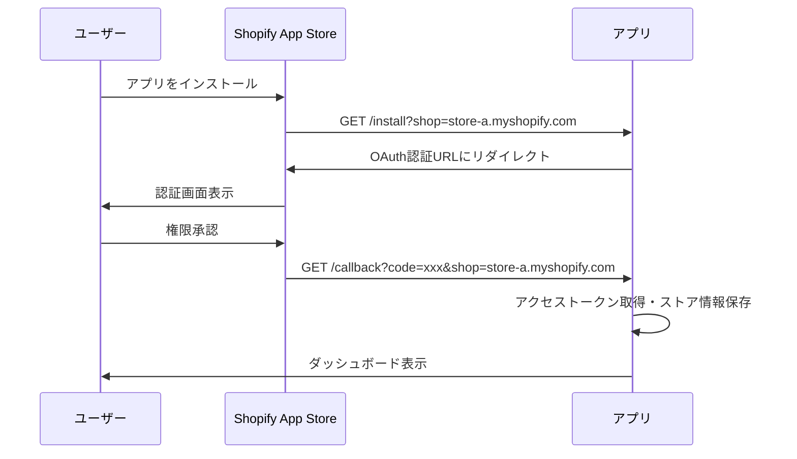
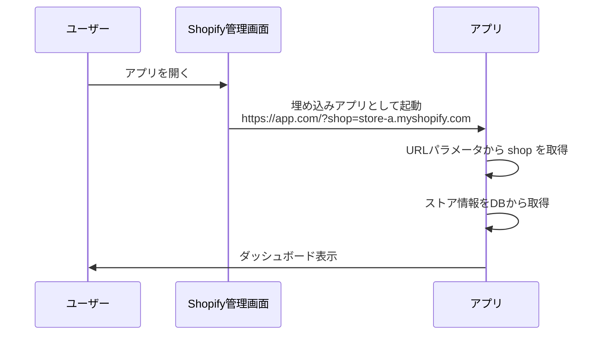

# Shopify `shop` パラメータの取り扱い

## 概要

Shopifyアプリでは、**各ストアを識別するために `shop` パラメータが必須**です。このドキュメントでは、`shop` パラメータの取り扱いと実装方法について説明します。

---

## 🔑 重要な原則

### Shopifyアプリの基本

1. **マルチテナント**: 1つのアプリが複数のShopifyストアで使用される
2. **ストア識別**: URLパラメータ `?shop=xxx.myshopify.com` でストアを識別
3. **セキュリティ**: 各ストアのデータは完全に分離される必要がある

---

## 📊 `shop` パラメータの取得優先順位

### 優先順位（高→低）:

```
1. URLパラメータ (?shop=xxx.myshopify.com)  ← 最優先・最も信頼できる
2. API取得 (/api/store)                      ← 次点・DBから取得
3. StoreContext (キャッシュ)                 ← フォールバック
4. エラー                                    ← 取得不可・認証不可
```

---

## 🔍 実装詳細

### フロントエンド実装

#### 1. URLパラメータから取得（`StoreContext.tsx`）

```typescript
// URLパラメータからshopドメインを取得する関数
const getShopFromUrl = (): string | null => {
  if (typeof window === 'undefined') return null
  const params = new URLSearchParams(window.location.search)
  return params.get('shop')
}

// デフォルトストア（API取得失敗時のフォールバック）
const DEFAULT_STORES: StoreInfo[] = [
  {
    id: 1,
    name: "本番ストア",
    shopDomain: getShopFromUrl() || undefined  // URLパラメータから動的取得
  }
]
```

#### 2. 認証時の優先順位（`AuthenticationRequired.tsx`）

```typescript
const onShopifyAuth = async () => {
  // 優先順位: URLパラメータ > StoreContext > エラー
  const urlParams = new URLSearchParams(window.location.search)
  const shopFromUrl = urlParams.get('shop')
  const domain = shopFromUrl || currentStore.shopDomain
  
  if (!domain) {
    alert('ストア情報が見つかりません。shopパラメータが必要です。')
    return
  }
  
  // Shopify OAuth認証フローを開始
  window.location.href = `/api/shopify/install?shop=${domain}`
}
```

---

## 🌐 Shopifyアプリの起動フロー

### 1. 初回インストール時



### 2. 2回目以降のアクセス



---

## 🚨 よくある問題と対策

### 問題1: `shop` パラメータがない

**症状**:
```
https://your-app.com/
```

**原因**:
- 直接URLにアクセスした
- Shopify管理画面以外からアクセスした

**対策**:
```typescript
const shopFromUrl = urlParams.get('shop')
if (!shopFromUrl) {
  // エラー処理
  alert('このアプリはShopify管理画面から起動してください。')
  return
}
```

---

### 問題2: 間違った `shop` パラメータ

**症状**:
```
https://your-app.com/?shop=wrong-store.myshopify.com
```

**原因**:
- URLが改ざんされた
- 古いブックマークからアクセスした

**対策**:
```typescript
// バックエンドで検証
const store = await _context.Stores
  .FirstOrDefaultAsync(s => s.Domain == shop && s.IsActive)

if (store == null) {
  return Unauthorized("Invalid shop domain")
}
```

---

### 問題3: ハードコードされた `shopDomain`

**症状**:
```typescript
// ❌ 間違い
const DEFAULT_STORES = [
  { shopDomain: "fuk-dev1.myshopify.com" }  // 固定値
]
```

**問題**:
- すべてのユーザーが同じストアに認証しようとする
- マルチテナントが機能しない

**対策**:
```typescript
// ✅ 正しい
const DEFAULT_STORES = [
  { shopDomain: getShopFromUrl() || undefined }  // 動的取得
]
```

---

## 🔒 セキュリティ考慮事項

### 1. `shop` パラメータの検証

**フロントエンド**:
```typescript
const isValidShopDomain = (shop: string): boolean => {
  // .myshopify.com で終わることを確認
  return shop.endsWith('.myshopify.com')
}
```

**バックエンド**:
```csharp
private bool IsValidShopDomain(string shop)
{
    if (string.IsNullOrWhiteSpace(shop))
        return false;

    // 基本的な形式チェック
    if (!shop.EndsWith(".myshopify.com"))
        return false;

    // 危険な文字が含まれていないかチェック
    var invalidChars = new[] { '<', '>', '"', '\'', '&', '\n', '\r' };
    if (shop.IndexOfAny(invalidChars) >= 0)
        return false;

    return true;
}
```

---

### 2. ストアデータの分離

**重要**: 各ストアのデータは完全に分離する必要があります。

```csharp
// ✅ 正しい: ストアIDでフィルタリング
var customers = await _context.Customers
    .Where(c => c.StoreId == currentStoreId)
    .ToListAsync();

// ❌ 間違い: フィルタリングなし
var customers = await _context.Customers.ToListAsync();
```

---

### 3. JWT トークンにストア情報を含める

```csharp
var claims = new[]
{
    new Claim(ClaimTypes.NameIdentifier, user.Id.ToString()),
    new Claim("StoreId", storeId.ToString()),
    new Claim("ShopDomain", shopDomain)
};
```

---

## 🧪 テスト方法

### ローカル開発環境でのテスト

```bash
# ストアAとしてアクセス
http://localhost:3000/?shop=store-a.myshopify.com

# ストアBとしてアクセス
http://localhost:3000/?shop=store-b.myshopify.com

# shopパラメータなし（エラーテスト）
http://localhost:3000/
```

---

### 検証環境でのテスト

```bash
# Azure Static Web Apps
https://brave-sea-038f17a00-development.eastasia.1.azurestaticapps.net/?shop=fuk-dev1.myshopify.com
```

---

## 📚 関連ドキュメント

### 認証関連
- [認証モード一覧](./認証モード一覧.md)
- [認証画面表示仕様](./認証画面表示仕様.md)
- [Shopify アプリ認証・認可設計](../../06-shopify/06-技術ガイド/Shopify のアプリ認証・認可設計.md)

### 設計仕様
- [Shopify OAuth認証フロー](../../03-design-specs/05-integration/oauth-multitenancy.md)
- [マルチテナント設計](../../02-architecture/multitenancy.md)

---

## 更新履歴

- **2025-10-24**: 初版作成（マルチテナント対応の設計改善）
- **2025-10-25**: ファイル名を日本語に変更、09-認証・セキュリティフォルダに移動
- **作成者**: 福田 + AI Assistant (Kenji)

