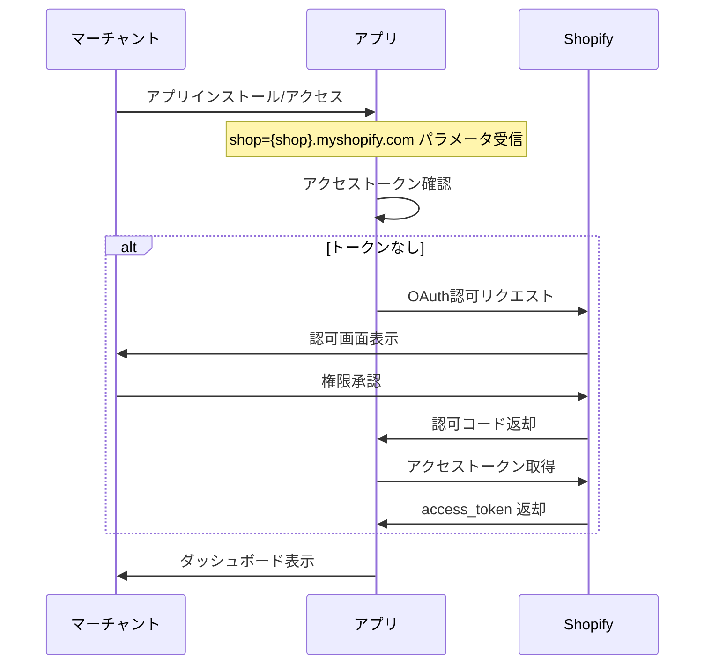
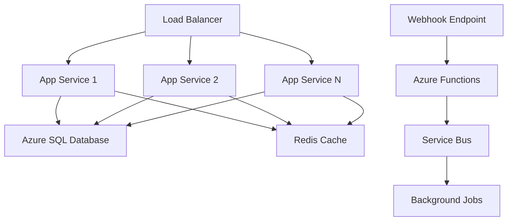

# Shopify アプリ認証・認可設計ガイド

## 概要

このドキュメントでは、Shopify AI Marketing Suiteの認証・認可設計について、公式ドキュメントの調査結果と実装要件をまとめています。

---

## エグゼクティブサマリー

Shopify のアプリ認証・認可設計においては、OAuth 2.0 の標準フローを用い、埋め込みアプリ（Embedded App）ではセッショントークン（session tokens）＋ Shopify App Bridge を使った方式が推奨されています。

**重要な要件:**
- インストール直後に OAuth 認証を必ず実行
- 認証なしで UI を表示させない
- HTTPS・HMAC・state チェック・最小スコープの実装
- デモ／開発用の認証スキップモードは本番公開時に無効化必須

---

## 1. OAuth 2.0 実装要件

### 1.1 標準フロー

#### 認証・インストールフロー



#### 必須パラメータ

| パラメータ | 説明 | 必須 |
|-----------|------|------|
| `client_id` | API キー | ✅ |
| `client_secret` | API シークレット | ✅ |
| `scope` | アプリが必要とする権限スコープ | ✅ |
| `redirect_uri` | 許可済みリダイレクト先 URL | ✅ |
| `state` | CSRF 保護用ランダム文字列 | ✅ |
| `shop` | ストアドメイン（`xxx.myshopify.com`） | ✅ |
| `hmac` | リクエスト検証用 | ✅ |

#### 認可リクエスト例

```http
GET https://{shop}.myshopify.com/admin/oauth/authorize?
   client_id={API_KEY}
   &scope={SCOPES}
   &redirect_uri={REDIRECT_URI}
   &state={nonce}
```

#### アクセストークン取得例

```http
POST https://{shop}.myshopify.com/admin/oauth/access_token
Content-Type: application/json

{
   "client_id": "{API_KEY}",
   "client_secret": "{API_SECRET}",
   "code": "{CODE}"
}
```

### 1.2 セキュリティ要件

#### HMAC 検証

```csharp
// バックエンドでのHMAC検証例
private bool VerifyHmac(string queryString, string secret)
{
    var hmac = queryString.Split('&')
        .Where(p => !p.StartsWith("hmac="))
        .OrderBy(p => p)
        .Aggregate((a, b) => a + "&" + b);
    
    var computedHmac = Convert.ToHexString(
        new HMACSHA256(Encoding.UTF8.GetBytes(secret))
            .ComputeHash(Encoding.UTF8.GetBytes(hmac)));
    
    return computedHmac.Equals(queryString.Split('&')
        .First(p => p.StartsWith("hmac="))
        .Split('=')[1], StringComparison.OrdinalIgnoreCase);
}
```

#### セキュリティチェックリスト

- ✅ **HMAC 検証**: リクエストの正当性確認
- ✅ **state/nonce の使用**: CSRF 攻撃防止
- ✅ **HTTPS 必須**: TLS/SSL 証明書必須
- ✅ **最小権限の原則**: 必要最低限のスコープのみ要求
- ✅ **OWASP Top 10 対策**: SQL インジェクション、XSS、CSRF 等の防止

### 1.3 スコープ管理

#### 推奨スコープ設計

```typescript
// 最小限のスコープ例
const REQUIRED_SCOPES = [
  'read_orders',           // 注文データ読み取り
  'read_customers',        // 顧客データ読み取り
  'read_products',         // 商品データ読み取り
  'read_analytics'         // 分析データ読み取り
];

// 再認可が必要なケース
const ADDITIONAL_SCOPES = [
  'write_orders',          // 注文データ書き込み（要再認可）
  'write_customers'        // 顧客データ書き込み（要再認可）
];
```

---

## 2. セッショントークン（埋め込みアプリ）

### 2.1 セッショントークンの仕組み

#### 取得フロー

```typescript
// フロントエンド（App Bridge使用）
import { getSessionToken } from '@shopify/app-bridge-utils';

const sessionToken = await getSessionToken(app);
```

#### 検証フロー

```csharp
// バックエンドでの検証
public async Task<bool> ValidateSessionToken(string token, string shopDomain)
{
    try
    {
        var handler = new JwtSecurityTokenHandler();
        var jsonToken = handler.ReadJwtToken(token);
        
        // 署名検証
        var validationParameters = new TokenValidationParameters
        {
            ValidateIssuerSigningKey = true,
            IssuerSigningKey = new SymmetricSecurityKey(Encoding.UTF8.GetBytes(_apiSecret)),
            ValidateIssuer = true,
            ValidIssuer = $"https://{shopDomain}",
            ValidateAudience = true,
            ValidAudience = _apiKey,
            ValidateLifetime = true,
            ClockSkew = TimeSpan.FromMinutes(1)
        };
        
        handler.ValidateToken(token, validationParameters, out SecurityToken validatedToken);
        return true;
    }
    catch
    {
        return false;
    }
}
```

### 2.2 埋め込みアプリ vs 非埋め込みアプリ

| 項目 | 埋め込みアプリ | 非埋め込みアプリ |
|------|---------------|-----------------|
| **認証方式** | セッショントークン + App Bridge | OAuth コードグラント |
| **UI配置** | Shopify管理画面内フレーム | 独立したWebサイト |
| **トークン有効期限** | 約1分（毎リクエスト取得） | 長期（オフライントークン） |
| **推奨用途** | 管理画面統合アプリ | 外部SaaS連携 |

---

## 3. App Store 公開要件

### 3.1 認証関連の審査基準

#### 必須要件

- ✅ **即座認証**: インストール直後にOAuth認証を実行
- ✅ **UI前認証**: 認証完了前にUIを表示しない
- ✅ **HTTPS必須**: 有効なTLS/SSL証明書
- ✅ **シークレット保護**: APIシークレットの漏洩防止

#### 禁止事項

- ❌ **認証前UI表示**: マーチャントが操作可能なUIを認証前に表示
- ❌ **ポップアップ認証**: ポップアップウィンドウでのOAuth認可
- ❌ **手動ドメイン入力**: ストアドメインの手動入力要求

### 3.2 デモモードの取り扱い

#### 公式ガイドライン

> **重要**: 公式ドキュメントでは「認証を省略して動かす」デモモードの明文化された許可は確認できません。

#### 実装時の注意点

```typescript
// 環境別の認証制御例
const isProduction = process.env.NEXT_PUBLIC_ENVIRONMENT === 'production';
const isDemoMode = !isProduction && process.env.NEXT_PUBLIC_ENABLE_DEMO_MODE === 'true';

if (isProduction) {
  // 本番環境: 必ずOAuth認証を実行
  await performOAuthAuthentication();
} else if (isDemoMode) {
  // 開発環境: デモモード許可（本番公開時は無効化必須）
  await performDemoAuthentication();
} else {
  // 開発環境: 通常のOAuth認証
  await performOAuthAuthentication();
}
```

---

## 4. トークン管理とセキュリティ

### 4.1 アクセストークンの管理

#### 保存要件

```csharp
// 暗号化してトークンを保存
public class TokenService
{
    public async Task SaveAccessTokenAsync(string shopDomain, string accessToken)
    {
        var encryptedToken = _encryptionService.Encrypt(accessToken);
        
        await _context.Stores
            .Where(s => s.Domain == shopDomain)
            .ExecuteUpdateAsync(s => s.SetProperty(x => x.AccessToken, encryptedToken));
    }
    
    public async Task<string> GetAccessTokenAsync(string shopDomain)
    {
        var store = await _context.Stores
            .FirstOrDefaultAsync(s => s.Domain == shopDomain);
            
        return store?.AccessToken != null 
            ? _encryptionService.Decrypt(store.AccessToken)
            : null;
    }
}
```

#### 有効期限管理

| トークン種別 | 有効期限 | 管理方法 |
|-------------|---------|---------|
| **アクセストークン** | 無期限（アンインストールまで） | ストア削除時にクリア |
| **セッショントークン** | 約1分 | 毎リクエストで取得・検証 |
| **リフレッシュトークン** | 設定による | 期限切れ前に更新 |

### 4.2 GDPR とプライバシー要件

#### 必須 Webhook

```csharp
// GDPR対応Webhook
[HttpPost("webhook/customers/data_request")]
public async Task<IActionResult> HandleDataRequest([FromBody] WebhookPayload payload)
{
    // 顧客データ要求への対応
    await _dataService.ExportCustomerDataAsync(payload.CustomerId);
    return Ok();
}

[HttpPost("webhook/customers/redact")]
public async Task<IActionResult> HandleCustomerRedact([FromBody] WebhookPayload payload)
{
    // 顧客データ削除要求への対応
    await _dataService.DeleteCustomerDataAsync(payload.CustomerId);
    return Ok();
}

[HttpPost("webhook/shop/redact")]
public async Task<IActionResult> HandleShopRedact([FromBody] WebhookPayload payload)
{
    // ストアデータ削除要求への対応
    await _dataService.DeleteShopDataAsync(payload.ShopId);
    return Ok();
}
```

---

## 5. マルチテナント対応

### 5.1 ストア識別とデータ分離

#### データベース設計

```sql
-- ストア情報テーブル
CREATE TABLE Stores (
    Id INT PRIMARY KEY IDENTITY(1,1),
    Domain NVARCHAR(255) NOT NULL UNIQUE,
    AccessToken NVARCHAR(MAX) NOT NULL,
    Scope NVARCHAR(MAX),
    IsActive BIT DEFAULT 1,
    CreatedAt DATETIME2 DEFAULT GETUTCDATE(),
    UpdatedAt DATETIME2 DEFAULT GETUTCDATE()
);

-- 顧客データテーブル（ストアIDで分離）
CREATE TABLE Customers (
    Id INT PRIMARY KEY IDENTITY(1,1),
    StoreId INT NOT NULL,
    ShopifyCustomerId BIGINT NOT NULL,
    Email NVARCHAR(255),
    FirstName NVARCHAR(100),
    LastName NVARCHAR(100),
    CreatedAt DATETIME2 DEFAULT GETUTCDATE(),
    FOREIGN KEY (StoreId) REFERENCES Stores(Id)
);
```

#### データアクセス時の分離

```csharp
// ストアIDによるデータ分離
public async Task<List<Customer>> GetCustomersAsync(string shopDomain)
{
    var store = await _context.Stores
        .FirstOrDefaultAsync(s => s.Domain == shopDomain);
        
    if (store == null)
        throw new UnauthorizedAccessException("Store not found");
    
    return await _context.Customers
        .Where(c => c.StoreId == store.Id)
        .ToListAsync();
}
```

### 5.2 スケーラビリティ設計

#### 推奨アーキテクチャ



---

## 6. エラーハンドリングとトラブルシューティング

### 6.1 一般的なエラーと対処

#### 認証エラー

```csharp
public class AuthenticationErrorHandler
{
    public async Task<IActionResult> HandleOAuthError(string error, string errorDescription)
    {
        _logger.LogError("OAuth Error: {Error} - {Description}", error, errorDescription);
        
        return error switch
        {
            "access_denied" => RedirectToAction("AccessDenied"),
            "invalid_request" => RedirectToAction("InvalidRequest"),
            "invalid_scope" => RedirectToAction("InvalidScope"),
            _ => RedirectToAction("AuthenticationFailed")
        };
    }
}
```

#### よくある問題と解決策

| 問題 | 原因 | 解決策 |
|------|------|--------|
| **OAuth認証失敗** | HMAC検証エラー | シークレットキーの確認 |
| **セッショントークン無効** | 有効期限切れ | 毎リクエストで再取得 |
| **UI前認証エラー** | 認証前にUI表示 | 認証完了後にUI表示 |
| **スコープ不足** | 権限不足 | 再認可フロー実行 |

### 6.2 トラブルシューティングガイド

#### デバッグログの設定

```csharp
// 認証フローの詳細ログ
public class OAuthController : ControllerBase
{
    public async Task<IActionResult> Install(string shop, string hmac, string timestamp)
    {
        _logger.LogInformation("OAuth Install Request: Shop={Shop}, HMAC={Hmac}, Timestamp={Timestamp}", 
            shop, hmac, timestamp);
        
        // HMAC検証
        if (!VerifyHmac(Request.QueryString.ToString(), _apiSecret))
        {
            _logger.LogWarning("HMAC verification failed for shop: {Shop}", shop);
            return BadRequest("Invalid request");
        }
        
        // OAuth認証開始
        var authUrl = BuildAuthUrl(shop);
        _logger.LogInformation("Redirecting to OAuth URL: {AuthUrl}", authUrl);
        
        return Redirect(authUrl);
    }
}
```

---

## 7. 実装パターンとベストプラクティス

### 7.1 推奨実装パターン

#### 本番モード

```typescript
// 本番環境での認証フロー
const productionAuthFlow = {
  // 1. OAuth 2.0 コードグラント
  // 2. アクセストークン取得
  // 3. ストア毎保存
  // 4. UI/機能表示
};
```

#### 埋め込みアプリモード

```typescript
// 埋め込みアプリでの認証フロー
const embeddedAppFlow = {
  // 1. OAuth インストール前提
  // 2. App Bridge + session token
  // 3. フロントエンド → バックエンド通信認証
};
```

#### 開発/検証モード

```typescript
// 開発環境での認証フロー
const developmentFlow = {
  // 1. 認証済ストアドメイン
  // 2. 事前取得アクセストークン（開発用）
  // 3. 環境変数による認証バイパス
  // 注意: 本番公開時は必ず無効化
};
```

### 7.2 セキュリティベストプラクティス

#### トークン保存

```csharp
// 暗号化設定
public class EncryptionService
{
    private readonly byte[] _key;
    
    public EncryptionService(IConfiguration configuration)
    {
        _key = Convert.FromBase64String(configuration["EncryptionKey"]);
    }
    
    public string Encrypt(string plainText)
    {
        using var aes = Aes.Create();
        aes.Key = _key;
        aes.GenerateIV();
        
        using var encryptor = aes.CreateEncryptor();
        using var msEncrypt = new MemoryStream();
        using var csEncrypt = new CryptoStream(msEncrypt, encryptor, CryptoStreamMode.Write);
        using var swEncrypt = new StreamWriter(csEncrypt);
        
        swEncrypt.Write(plainText);
        swEncrypt.Close();
        
        return Convert.ToBase64String(aes.IV.Concat(msEncrypt.ToArray()).ToArray());
    }
}
```

#### 環境別設定

```json
// appsettings.json
{
  "Authentication": {
    "Shopify": {
      "ApiKey": "your-api-key",
      "ApiSecret": "your-api-secret",
      "Scopes": "read_orders,read_customers,read_products"
    }
  },
  "Environment": {
    "EnableDemoMode": false,
    "RequireAuthentication": true
  }
}
```

---

## 8. 参考リンク

### 公式ドキュメント

- [Authentication and authorization](https://shopify.dev/docs/apps/build/authentication-authorization)
- [Implement authorization code grant manually](https://shopify.dev/docs/apps/build/authentication-authorization/access-tokens/authorization-code-grant)
- [About session tokens](https://shopify.dev/docs/apps/build/authentication-authorization/session-tokens)
- [App Store requirements checklist](https://shopify.dev/docs/apps/launch/app-requirements-checklist)

### コミュニティリソース

- [Shopify Community Forums](https://community.shopify.com/)
- [Shopify GitHub](https://github.com/Shopify)

---

## 📚 関連ドキュメント

### 実装関連
- [認証モード一覧](./認証モード一覧.md)
- [認証画面表示仕様](./認証画面表示仕様.md)
- [環境変数チェックリスト](./環境変数チェックリスト.md)
- [Shopify shopパラメータ仕様](./Shopify-shopパラメータ仕様.md)

### 技術ガイド
- [Shopify App Bridge テストガイド](../../06-shopify/06-技術ガイド/test-guides/Shopify-App-Bridge-テストガイド.md)
- [Shopify アプリ統合ガイド](../../06-shopify/06-技術ガイド/implementation-guides/Shopify-アプリ統合ガイド.md)

---

## 更新履歴

| 日付 | 内容 | 担当者 |
|------|------|--------|
| 2025-10-25 | 初版作成（公式ドキュメント調査結果を統合） | Kenji |
| 2025-10-25 | 重複部分を整理し、統一フォーマットで再構成 | Kenji |
| 2025-10-25 | 09-認証・セキュリティフォルダに移動、関連ドキュメントリンク更新 | Kenji |

---

**最終更新**: 2025年10月25日 21:00
**次回レビュー**: 2025年11月1日（週次）
