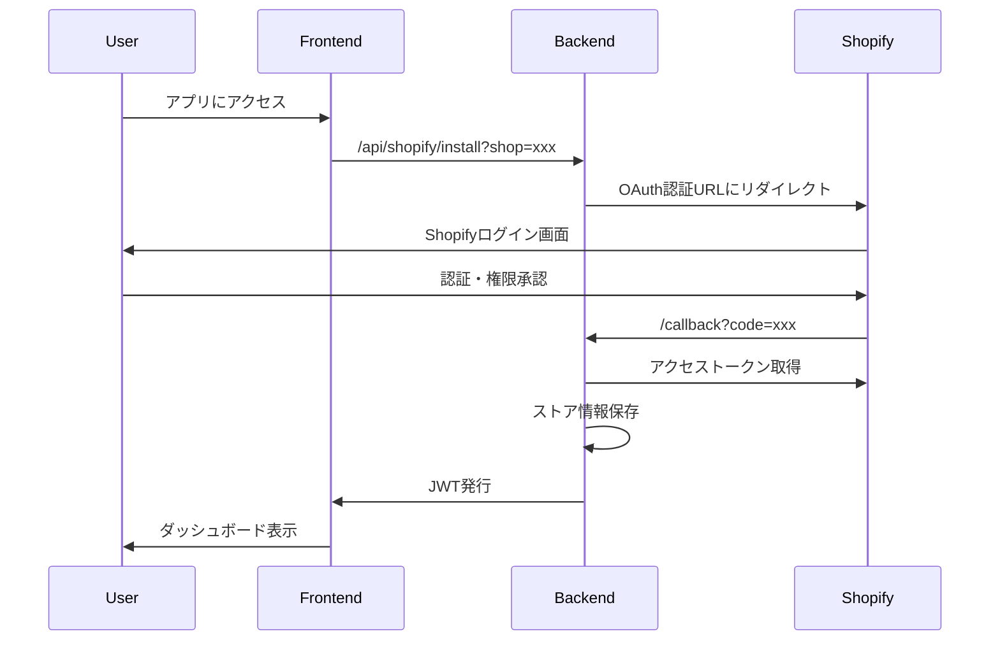
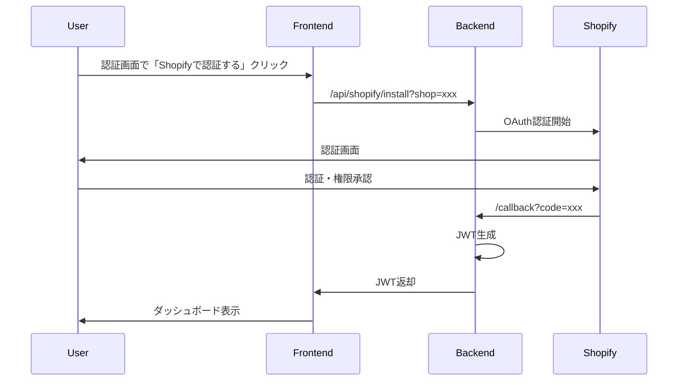

# 認証モード一覧

## 概要

このドキュメントでは、Shopify AI Marketing Suiteの3つの認証モードについて説明します。

## 🔧 環境判定の仕組み

### デモログイン画面の表示条件

デモログイン画面（`/dev-bookmarks` へのリンク）は、以下の条件で表示されます：

```typescript
// 本番環境かどうかを判定（複数の条件で判定）
const isProductionEnvironment = 
  process.env.NEXT_PUBLIC_ENVIRONMENT === 'production' ||
  (typeof window !== 'undefined' && 
   !window.location.hostname.includes('development') &&
   !window.location.hostname.includes('staging') &&
   !window.location.hostname.includes('localhost'))
```

**表示される環境:**
- ✅ `localhost` での開発環境
- ✅ `development` を含むURL（例: `development--brave-sea-038f17a00.1.azurestaticapps.net`）
- ✅ `staging` を含むURL（例: `staging--brave-sea-038f17a00.1.azurestaticapps.net`）
- ✅ `NEXT_PUBLIC_ENVIRONMENT` が `staging` または `development` の場合

**表示されない環境:**
- ❌ 本番環境（`brave-sea-038f17a00.1.azurestaticapps.net`）
- ❌ `NEXT_PUBLIC_ENVIRONMENT=production` でビルドされた場合

### 環境変数の設定

#### GitHub Actions（ビルド時）

`.github/workflows/develop_frontend.yml` で設定：

```yaml
env:
  NEXT_PUBLIC_ENVIRONMENT: ${{ steps.env.outputs.next_public_environment }}
```

#### Azure Static Web Apps（ランタイム）

Azure Portal > Static Web Apps > Configuration > Environment variables で設定：

| 環境 | 変数名 | 値 |
|------|--------|-----|
| Development | `NEXT_PUBLIC_ENVIRONMENT` | `development` |
| Staging | `NEXT_PUBLIC_ENVIRONMENT` | `staging` |
| Production | `NEXT_PUBLIC_ENVIRONMENT` | `production` |

**重要:** Azure Static Web Appsでは、ビルド時の環境変数とランタイムの環境変数を区別する必要があります。

---

## 🔐 認証モード比較表

| 項目 | 本番環境 | 検証環境 | 開発者ツール |
|------|---------|---------|------------|
| **環境** | Production | Development | Development |
| **認証方法** | Shopify OAuth | Shopify OAuth | パスワード認証 |
| **エンドポイント** | `/api/shopify/install` | `/api/shopify/install` | パスワードチェック（フロント） |
| **アクセス範囲** | アプリ全体 | アプリ全体 | `/dev-bookmarks` のみ |
| **セッション期限** | JWT有効期限 | JWT有効期限 | 1時間 |
| **対象ユーザー** | 本番ユーザー | 検証担当者 | 開発者 |
| **用途** | 本番運用 | OAuth認証テスト | データ確認・デバッグ |
| **認証画面でのボタン表示** | ✅ Shopify認証のみ | ✅ Shopify認証のみ | ❌ 表示なし（リンクのみ） |
| **バナー表示** | ❌ なし | ❌ なし | ✅ デモモードバナー |
| **ログアウトボタン** | ✅ あり（Shopify） | ✅ あり（Shopify） | ✅ あり（バナー内） |

---

## 1. 本番環境（Shopify OAuth認証）

### 概要
- Shopifyの標準OAuth 2.0認証フローを使用
- 最もセキュアな認証方法
- 本番環境でのみ有効

### 認証フロー


### 使用方法
1. 認証画面で「Shopifyで認証する」ボタンをクリック
2. Shopifyのログイン画面でストアにログイン
3. アプリの権限を承認
4. 自動的にダッシュボードにリダイレクト

### 設定
- `NODE_ENV=production`
- `NEXT_PUBLIC_API_URL`: バックエンドAPIのURL
- Shopify App設定でリダイレクトURLを登録

---

## 2. 検証環境（Shopify OAuth認証）

### 概要
- 本番環境と同じShopify OAuth認証を使用
- OAuth認証フローのテスト・検証に使用
- 開発環境（`NODE_ENV=development`）で有効

### 認証フロー


### 使用方法
1. 認証画面で「Shopifyで認証する」ボタンをクリック
2. Shopify OAuth認証フローを実行
3. 認証成功後、ダッシュボードにアクセス

### 設定
- `NODE_ENV=development`
- URLに `?shop=xxx.myshopify.com` パラメータが必要

### 用途
- ✅ OAuth認証フローのテスト
- ✅ Webhook登録の確認
- ✅ 本番環境と同じフローの検証

---

## 3. 開発者ツール（パスワード認証）

### 概要
- `/dev-bookmarks` ページ専用の認証
- データ閲覧・確認のみ可能
- 開発環境（`NODE_ENV=development`）でのみ有効

### 認証フロー
```mermaid
sequenceDiagram
    participant User
    participant Frontend

    User->>/dev-bookmarks: アクセス
    Frontend->>User: パスワード入力画面
    User->>Frontend: パスワード入力
    Frontend->>Frontend: パスワード検証（フロントエンド）
    Frontend->>Frontend: DeveloperModeContext更新
    Frontend->>User: dev-bookmarks表示
```

### 使用方法
1. `/dev-bookmarks` にアクセス
2. パスワードを入力（環境変数 `NEXT_PUBLIC_DEV_PASSWORD`）
3. 開発者ツール画面が表示される

### 設定
- `NODE_ENV=development`
- `NEXT_PUBLIC_DEV_PASSWORD`: 開発者ツールのパスワード（デフォルト: `dev123`）

### セッション管理
- セッション期限: 1時間
- 自動ログアウト: 期限切れ時
- 手動ログアウト: バナーの「ログアウト」ボタン

### バナー表示
```
⚠️ 開発者ツール有効（データ閲覧専用モード） | セッション残り: 45分 | ログアウト
```

### アクセス制限
- `/dev-bookmarks` ページのみアクセス可能
- 他のページにアクセスすると通常の認証画面にリダイレクト

### 注意事項
⚠️ **データ閲覧専用**
- データの変更・削除は不可
- APIへの書き込みリクエストは送信されません

⚠️ **本番環境では使用不可**
- セキュリティ上の理由から、本番環境では無効化されています

---

## 🎯 使い分けガイド

### 本番環境での運用
→ **Shopify OAuth認証**を使用
- 「Shopifyで認証する」ボタンのみ表示
- セキュアな認証フロー

### 検証環境での使い分け

#### ケース1: OAuth認証フローをテストしたい
→ **「Shopifyで認証する」ボタンを使用**
- 実際のShopify OAuth認証フローを確認
- Webhook登録の動作確認
- 本番環境と同じフローをテスト
- アプリ全体の機能をテスト

#### ケース2: データ確認・デバッグのみ
→ **「開発者ツール」を使用**
- 素早くデータを確認
- APIエンドポイントのテスト
- データベースの状態確認
- Shopify認証なしでアクセス

### 検証環境での認証画面

検証環境では**Shopify認証ボタン + 開発者ツールリンク**が表示されます:

```
┌─────────────────────────────────────┐
│         認証が必要です              │
│                                     │
│  ┌───────────────────────────────┐  │
│  │   Shopifyで認証する           │  │
│  └───────────────────────────────┘  │
│                                     │
│  💡 Shopify OAuth認証フローを       │
│  テストできます。                   │
│                                     │
│  ─────────────────────────────────  │
│                                     │
│  🔧 開発者向け                      │
│                                     │
│  データ確認・デバッグのみの場合は、 │
│  開発者ツールをご利用ください。     │
│                                     │
│  ┌───────────────────────────────┐  │
│  │ 開発者ツールを開く            │  │
│  │ （パスワード認証）            │  │
│  └───────────────────────────────┘  │
│                                     │
│  ※ Shopify認証なし・データ閲覧専用 │
└─────────────────────────────────────┘
```

---

## 🔒 セキュリティ考慮事項

### 本番環境
- ✅ Shopify OAuth認証のみ有効
- ✅ JWT認証必須
- ✅ CORS設定厳格化
- ✅ HTTPS必須

### 開発環境
- ⚠️ 検証モード・開発者ツールが有効
- ⚠️ パスワードは環境変数で管理
- ⚠️ 開発環境のURLは外部に公開しない

---

## 📋 トラブルシューティング

### 「認証が必要です」画面が表示される

**原因1: JWTトークンが期限切れ**
- 解決策: 再度ログインする

**原因2: localStorageがクリアされた**
- 解決策: 再度ログインする

**原因3: バックエンドAPIが401を返している**
- 解決策: バックエンドのログを確認

### 開発者ツールにアクセスできない

**原因1: パスワードが間違っている**
- 解決策: 環境変数 `NEXT_PUBLIC_DEV_PASSWORD` を確認

**原因2: 本番環境でアクセスしている**
- 解決策: 開発環境（`NODE_ENV=development`）でアクセス

**原因3: セッションが期限切れ**
- 解決策: 再度パスワードを入力

---

## 📚 関連ドキュメント

### 実装関連
- [認証画面表示仕様](./認証画面表示仕様.md)
- [環境変数チェックリスト](./環境変数チェックリスト.md)
- [Shopify shopパラメータ仕様](./Shopify-shopパラメータ仕様.md)

### 設計仕様
- [Shopify アプリ認証・認可設計](../../06-shopify/06-技術ガイド/Shopify のアプリ認証・認可設計.md)
- [グローバル認証ガード](../../03-design-specs/01-frontend/global-authentication-guard.md)
- [開発者ツール仕様](../../03-design-specs/01-frontend/dev-tools-authentication.md)

---

## 更新履歴

- **2025-10-24**: 初版作成（用語整理に伴うドキュメント作成）
- **2025-10-25**: ファイル名を日本語に変更、09-認証・セキュリティフォルダに移動
- **作成者**: 福田 + AI Assistant (Kenji)

