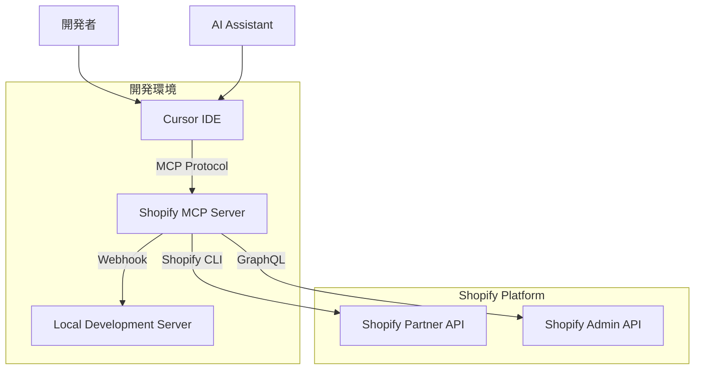

# Shopify MCP Server 連携設計書

## 概要

ShopifyのMCP（Model Context Protocol）サーバーを利用して、Cursor（AIコーディング環境）とShopify開発APIを連携する設計書です。

---

## 🎯 目的・背景

### 現状の課題
- Shopify APIのドキュメント検索に時間がかかる
- GraphQLクエリの構文エラーが頻発
- Webhookのテスト・デバッグが手動で非効率
- 開発環境での認証フローが複雑

### 期待される効果
- **開発効率向上**: AIアシスタントによる自動補完・提案
- **エラー削減**: リアルタイムでの構文チェック
- **学習コスト削減**: ドキュメント検索の自動化
- **テスト自動化**: Webhook・APIの自動テスト

---

## 🏗️ アーキテクチャ設計

### システム構成図



### データフロー

1. **開発者** → Cursor IDE でコマンド入力
2. **Cursor** → MCP Protocol でShopify MCP Serverにリクエスト
3. **MCP Server** → Shopify CLI/APIを実行
4. **Shopify** → 結果をMCP Serverに返却
5. **MCP Server** → Cursorに結果を返却
6. **Cursor** → 開発者に結果表示

---

## 🛠️ 技術仕様

### 使用技術
- **MCP Protocol**: Model Context Protocol
- **Shopify CLI**: v3.0以上
- **Node.js**: v18以上
- **Cursor IDE**: MCP対応版

### 主要機能

#### 1. API探索・学習
```bash
# Shopify APIの使用方法を学習
/shopify learn api --topic=orders
/shopify learn api --topic=webhooks
```

#### 2. ドキュメント検索
```bash
# Shopifyドキュメントを検索
/shopify search docs --query="GraphQL orders query"
/shopify search docs --query="webhook authentication"
```

#### 3. GraphQLスキーマ探索
```bash
# GraphQLスキーマを探索
/shopify graphql schema --type=Order
/shopify graphql schema --field=orders
```

#### 4. コード検証
```bash
# GraphQLクエリを検証
/shopify validate query "query { orders(first: 10) { edges { node { id } } } }"
```

#### 5. テーマ検証
```bash
# Liquidテーマを検証
/shopify validate theme --path=./themes/my-theme
```

---

## 📋 実装計画

### Phase 1: 基盤構築（1週間）
- [ ] Shopify CLI v3.0のインストール・設定
- [ ] MCP Serverの起動・接続確認
- [ ] Cursor IDEとの連携設定
- [ ] 基本的なコマンド実行テスト

### Phase 2: 基本機能実装（2週間）
- [ ] API探索機能の実装
- [ ] ドキュメント検索機能の実装
- [ ] GraphQLスキーマ探索機能の実装
- [ ] 基本的なクエリ検証機能の実装

### Phase 3: 高度な機能実装（2週間）
- [ ] コードブロック検証機能の実装
- [ ] テーマ検証機能の実装
- [ ] カスタムコマンドの実装
- [ ] エラーハンドリングの強化

### Phase 4: 統合・テスト（1週間）
- [ ] 既存開発フローとの統合
- [ ] パフォーマンステスト
- [ ] セキュリティテスト
- [ ] ドキュメント整備

---

## 🔧 セットアップ手順

### 1. 前提条件の確認
```bash
# Node.js バージョン確認
node --version  # v18以上が必要

# Shopify CLI インストール
npm install -g @shopify/cli @shopify/app

# バージョン確認
shopify version
```

### 2. MCP Server起動
```bash
# プロジェクトディレクトリで実行
cd /path/to/shopify-ai-marketing-suite

# MCP Server起動
shopify app dev --mcp

# 成功メッセージ確認
# MCP Server started on http://localhost:8081
# Connected to store: fuk-dev1.myshopify.com
```

### 3. Cursor接続設定
```json
// .cursor/mcp.json
{
  "servers": {
    "shopify": {
      "url": "http://localhost:8081",
      "capabilities": ["completion", "command", "context"]
    }
  }
}
```

### 4. 接続確認
```bash
# Cursor内でコマンドパレット (Cmd+Shift+P)
# "MCP: Connect to Server" を選択
# "shopify" を選択

# 右下に "🧩 shopify connected" が表示されたら成功
```

---

## 🧪 テスト計画

### 単体テスト
- [ ] MCP Server起動テスト
- [ ] Cursor接続テスト
- [ ] 各コマンドの実行テスト
- [ ] エラーハンドリングテスト

### 統合テスト
- [ ] 既存開発フローとの統合テスト
- [ ] 複数コマンドの連続実行テスト
- [ ] 長時間実行テスト
- [ ] メモリリークテスト

### ユーザビリティテスト
- [ ] 新規開発者での操作テスト
- [ ] コマンド補完の精度テスト
- [ ] エラーメッセージの分かりやすさテスト

---

## 📊 成功指標

### 定量的指標
- **開発時間短縮**: 20%以上
- **APIドキュメント検索時間**: 50%以上短縮
- **GraphQLクエリエラー**: 30%以上削減
- **Webhookテスト時間**: 40%以上短縮

### 定性的指標
- 開発者の満足度向上
- 学習コストの削減
- コード品質の向上
- 開発フローの効率化

---

## 🔒 セキュリティ考慮事項

### 認証・認可
- Shopify CLIのOAuth認証を利用
- ローカル環境でのみMCP Serverを起動
- 本番環境ではMCP Serverを使用しない

### データ保護
- アクセストークンはShopify CLIが管理
- ローカル通信のみ（localhost）
- 機密情報のログ出力を避ける

### アクセス制御
- 開発者権限の確認
- ストアアクセス権限の確認
- APIレート制限の遵守

---

## 📚 関連ドキュメント

### 技術ドキュメント
- [Shopify MCP Server公式ドキュメント](https://shopify.dev/docs/apps/build/devmcp)
- [Shopify CLI 3.x ドキュメント](https://shopify.dev/docs/apps/tools/cli)
- [MCP Protocol仕様](https://modelcontextprotocol.io/)

### プロジェクト内ドキュメント
- [認証・セキュリティ設計](../05-development/09-認証・セキュリティ/README.md)
- [API設計仕様](../04-design-specs/04-api-documentation/README.md)
- [開発環境構築](../05-development/01-環境構築/README.md)

---

## 🚀 今後の拡張計画

### 短期計画（3ヶ月）
- [ ] カスタムコマンドの追加
- [ ] テンプレート機能の実装
- [ ] バッチ処理機能の追加

### 中期計画（6ヶ月）
- [ ] 他のIDE（VS Code、IntelliJ）への対応
- [ ] チーム開発機能の追加
- [ ] 自動テスト機能の強化

### 長期計画（1年）
- [ ] AI機能の強化
- [ ] クラウド連携機能
- [ ] マルチストア対応

---

## 📝 更新履歴

| 日付 | 内容 | 担当者 |
|------|------|--------|
| 2025-10-25 | 初版作成 | Kenji |

---

**最終更新**: 2025年10月25日  
**次回レビュー**: 2025年11月1日（週次）
