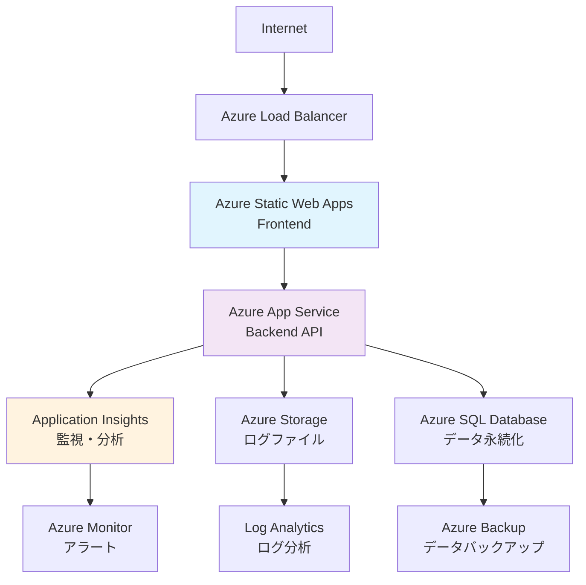

# Azure運用統合ガイド

> **📅 作成日**: 2025年7月26日  
> **🎯 目的**: Azure App Service運用・監視・ログ管理の統一ガイド  
> **💻 対象**: Azure App Service (.NET 8) + Azure Static Web Apps  
> **🔧 技術**: Serilog + Application Insights

---

## 📋 目次

1. [Azure運用概要](#azure運用概要)
2. [Azure App Service基本設定](#azure-app-service基本設定)
3. [ログ管理・監視](#ログ管理監視)
4. [Application Insights統合](#application-insights統合)
5. [Basic認証設定](#basic認証設定)
6. [パフォーマンス最適化](#パフォーマンス最適化)
7. [セキュリティ設定](#セキュリティ設定)
8. [トラブルシューティング](#トラブルシューティング)
9. [運用手順](#運用手順)

---

## 🌍 Azure運用概要

### アーキテクチャ構成



### 対象リソース

| リソース種別 | 環境 | 名前 | 用途 |
|-------------|------|------|------|
| **App Service** | Production | `shopifyapp-backend-production` | 本番APIサーバー |
| **App Service** | Staging | `shopifyapp-backend-staging` | ステージングAPIサーバー |
| **App Service** | Development | `shopifyapp-backend-develop` | 開発APIサーバー |
| **Static Web Apps** | Production | `shopify-marketing-suite-frontend` | 本番Webアプリ |
| **Application Insights** | 共通 | `shopify-marketing-insights` | 監視・分析 |

---

## ⚙️ Azure App Service基本設定

### 1. App Service作成・設定

#### 基本構成
```yaml
# Production環境
App Name: shopifyapp-backend-production
Resource Group: shopify-marketing-rg
Runtime Stack: .NET 8 (LTS)
Operating System: Windows
Region: Japan West
App Service Plan: 
  - Development: Free F1
  - Staging: Basic B1
  - Production: Standard S1

# ネットワーク設定
Public Access: Enabled
HTTPS Only: Enabled
Minimum TLS Version: 1.2
```

#### アプリケーション設定
```bash
# Azure Portal → App Service → 設定 → 構成

# .NET設定
ASPNETCORE_ENVIRONMENT: Production
WEBSITE_RUN_FROM_PACKAGE: 1

# カスタム設定
API_VERSION: v1
CORS_ENABLED: true
REQUEST_TIMEOUT: 300

# Application Insights
APPLICATIONINSIGHTS_CONNECTION_STRING: InstrumentationKey=xxx;IngestionEndpoint=xxx
APPINSIGHTS_INSTRUMENTATIONKEY: xxx
```

### 2. 接続文字列

#### データベース接続
```bash
# Azure Portal → App Service → 設定 → 構成 → 接続文字列

Name: DefaultConnection
Value: Server=tcp:xxx.database.windows.net,1433;Initial Catalog=ShopifyMarketing;Persist Security Info=False;User ID=xxx;Password=xxx;MultipleActiveResultSets=False;Encrypt=True;TrustServerCertificate=False;Connection Timeout=30;
Type: SQLAzure
```

### 3. デプロイメント設定

#### 継続的デプロイ
```yaml
# Azure Portal → App Service → デプロイメント → デプロイ センター

Source: GitHub Actions
Repository: shopify-ai-marketing-suite
Branch: main (Production) / staging / develop
Build Provider: GitHub Actions

# 自動生成されるワークフローファイル
# .github/workflows/azure-webapps-dotnet-core.yml
```

#### デプロイスロット (本番環境のみ)
```yaml
# Production環境でのスロット設定
Slots:
  - production (default)
  - staging (swap slot)

# スワップ設定
Swap Settings:
  - Connection strings: Keep destination
  - App settings: Keep destination
  - Authentication settings: Keep destination
```

---

## 📊 ログ管理・監視

### 1. Azure App Serviceログ機能

#### ログの種類
| ログ種別 | 説明 | 保存場所 | 保存期間 |
|---------|------|----------|-----------|
| **Application Logs** | アプリケーション内のログ | File System / Blob Storage | 設定可能 |
| **Web Server Logs** | IISアクセスログ | File System | 設定可能 |
| **Detailed Error Messages** | IIS詳細エラー | File System | 設定可能 |
| **Failed Request Tracing** | 失敗リクエスト詳細 | File System | 設定可能 |

#### ログ設定方法
```bash
# Azure CLI でログ設定
az webapp log config \
  --name shopifyapp-backend-production \
  --resource-group shopify-marketing-rg \
  --application-logging filesystem \
  --level information \
  --web-server-logging filesystem

# PowerShell での設定
$webapp = Get-AzWebApp -ResourceGroupName "shopify-marketing-rg" -Name "shopifyapp-backend-production"
Set-AzWebApp -ResourceGroupName "shopify-marketing-rg" -Name "shopifyapp-backend-production" -AppSettings @{
    "WEBSITE_HTTPLOGGING_ENABLED" = "true"
    "WEBSITE_DETAILED_ERROR_MESSAGES_ENABLED" = "true"
    "WEBSITE_FAILED_REQUEST_TRACING_ENABLED" = "true"
}
```

### 2. Serilogログ設定

#### 本番環境設定 (appsettings.Production.json)
```json
{
  "Serilog": {
    "Using": ["Serilog.Sinks.Console", "Serilog.Sinks.File", "Serilog.Sinks.ApplicationInsights"],
    "MinimumLevel": {
      "Default": "Information",
      "Override": {
        "Microsoft": "Warning",
        "Microsoft.EntityFrameworkCore": "Warning",
        "System": "Warning",
        "Microsoft.AspNetCore.Hosting.Diagnostics": "Warning"
      }
    },
    "WriteTo": [
      {
        "Name": "Console",
        "Args": {
          "outputTemplate": "[{Timestamp:HH:mm:ss} {Level:u3}] {Message:lj} {Properties:j}{NewLine}{Exception}"
        }
      },
      {
        "Name": "File",
        "Args": {
          "path": "/home/LogFiles/Application/app-.txt",
          "rollingInterval": "Day",
          "retainedFileCountLimit": 30,
          "fileSizeLimitBytes": 10485760,
          "outputTemplate": "[{Timestamp:yyyy-MM-dd HH:mm:ss.fff zzz} {Level:u3}] {SourceContext} {Message:lj} {Properties:j}{NewLine}{Exception}"
        }
      },
      {
        "Name": "ApplicationInsights",
        "Args": {
          "connectionString": "#{APPLICATIONINSIGHTS_CONNECTION_STRING}#",
          "telemetryConverter": "Serilog.Sinks.ApplicationInsights.TelemetryConverters.TraceTelemetryConverter, Serilog.Sinks.ApplicationInsights"
        }
      }
    ],
    "Enrich": ["FromLogContext", "WithMachineName", "WithThreadId"],
    "Properties": {
      "Application": "ShopifyMarketingAPI",
      "Environment": "Production"
    }
  }
}
```

#### ログレベル別設定

**Development環境:**
```json
{
  "Serilog": {
    "MinimumLevel": {
      "Default": "Debug",
      "Override": {
        "Microsoft": "Information",
        "System": "Information"
      }
    }
  }
}
```

**Staging環境:**
```json
{
  "Serilog": {
    "MinimumLevel": {
      "Default": "Information",
      "Override": {
        "Microsoft": "Warning",
        "System": "Warning"
      }
    }
  }
}
```

### 3. ログの確認方法

#### Azure Portal でのログ確認

**1. Log Stream (リアルタイム)**
```
Azure Portal → App Service → 監視 → Log stream
```
- リアルタイムでログを確認
- デバッグやトラブルシューティングに最適
- 過去のログは確認不可

**2. App Service Logs**
```
Azure Portal → App Service → 監視 → App Service logs
```
- ログ設定の有効化
- レベルやローテーション設定

#### Kudu Console でのログ確認

**アクセス方法:**
```
https://shopifyapp-backend-production.scm.azurewebsites.net/
```

**ログファイル場所:**
```bash
# アプリケーションログ
/home/LogFiles/Application/

# Webサーバーログ  
/home/LogFiles/http/RawLogs/

# 詳細エラー
/home/LogFiles/DetailedErrors/

# 失敗リクエストトレース
/home/LogFiles/W3SVC1/
```

#### Azure CLI でのログ取得

```bash
# リアルタイムログストリーム
az webapp log tail \
  --name shopifyapp-backend-production \
  --resource-group shopify-marketing-rg

# ログファイルのダウンロード
az webapp log download \
  --name shopifyapp-backend-production \
  --resource-group shopify-marketing-rg \
  --log-file logs.zip

# 特定期間のログ取得
az webapp log show \
  --name shopifyapp-backend-production \
  --resource-group shopify-marketing-rg \
  --start-time "2025-07-26T00:00:00Z" \
  --end-time "2025-07-26T23:59:59Z"
```

---

## 📈 Application Insights統合

### 1. Application Insights設定

#### リソース作成
```bash
# Azure CLI での作成
az monitor app-insights component create \
  --resource-group shopify-marketing-rg \
  --app shopify-marketing-insights \
  --location japanwest \
  --kind web \
  --application-type web
```

#### 接続文字列取得
```bash
# 接続文字列の取得
az monitor app-insights component show \
  --resource-group shopify-marketing-rg \
  --app shopify-marketing-insights \
  --query "connectionString" \
  --output tsv
```

### 2. .NET統合設定

#### Program.cs設定
```csharp
// Application Insights設定
var aiConnectionString = Environment.GetEnvironmentVariable("APPLICATIONINSIGHTS_CONNECTION_STRING");
if (!string.IsNullOrEmpty(aiConnectionString))
{
    builder.Services.AddApplicationInsightsTelemetry(options =>
    {
        options.ConnectionString = aiConnectionString;
        options.EnableAdaptiveSampling = true;
        options.EnableQuickPulseMetricStream = true;
        options.EnableAuthenticationTrackingJavaScript = true;
    });
    
    // カスタムテレメトリ初期化子
    builder.Services.AddSingleton<ITelemetryInitializer, CustomTelemetryInitializer>();
}

// Azure App Service診断統合
builder.Services.AddLogging(loggingBuilder =>
{
    loggingBuilder.AddAzureWebAppDiagnostics();
    loggingBuilder.AddApplicationInsights();
});
```

#### カスタムテレメトリ初期化子
```csharp
public class CustomTelemetryInitializer : ITelemetryInitializer
{
    public void Initialize(ITelemetry telemetry)
    {
        telemetry.Context.GlobalProperties["Environment"] = Environment.GetEnvironmentVariable("ASPNETCORE_ENVIRONMENT") ?? "Unknown";
        telemetry.Context.GlobalProperties["Application"] = "ShopifyMarketingAPI";
        telemetry.Context.GlobalProperties["Version"] = Assembly.GetExecutingAssembly().GetName().Version?.ToString() ?? "Unknown";
    }
}
```

### 3. Application Insightsクエリ

#### よく使用するKQLクエリ

**1. エラー分析**
```kql
exceptions
| where timestamp > ago(24h)
| summarize count() by type, cloud_RoleName
| order by count_ desc
```

**2. パフォーマンス分析**
```kql
requests
| where timestamp > ago(1h)
| summarize avg(duration), count() by name
| order by avg_duration desc
```

**3. API使用状況**
```kql
requests
| where timestamp > ago(7d)
| where name contains "api"
| summarize count() by name, bin(timestamp, 1h)
| render timechart
```

**4. ログ分析**
```kql
traces
| where timestamp > ago(1h)
| where severityLevel >= 2
| order by timestamp desc
| take 100
```

### 4. アラート設定

#### 基本的なアラート
```yaml
# Azure Portal → Application Insights → アラート

# 1. HTTP 5xx エラー
Alert Name: "High 5xx Error Rate"
Condition: 
  Metric: Failed requests
  Threshold: > 10 requests in 5 minutes
Action Group: Email + SMS

# 2. 応答時間
Alert Name: "High Response Time"
Condition:
  Metric: Server response time
  Threshold: > 3 seconds average in 5 minutes
Action Group: Email

# 3. 可用性
Alert Name: "Low Availability"
Condition:
  Metric: Availability
  Threshold: < 99% in 5 minutes
Action Group: Email + Teams
```

---

## 🔐 Basic認証設定

### 1. Basic認証の実装

#### 問題の背景
Azure App Service の既定の Basic 認証は `.NET 8` では正常に動作しないため、カスタム実装が必要。

#### カスタムBasic認証実装

**1. BasicAuthenticationHandler実装**
```csharp
public class BasicAuthenticationHandler : AuthenticationHandler<BasicAuthenticationSchemeOptions>
{
    public BasicAuthenticationHandler(IOptionsMonitor<BasicAuthenticationSchemeOptions> options,
                                    ILoggerFactory logger,
                                    UrlEncoder encoder,
                                    ISystemClock clock)
        : base(options, logger, encoder, clock)
    {
    }

    protected override Task<AuthenticateResult> HandleAuthenticateAsync()
    {
        if (!Request.Headers.ContainsKey("Authorization"))
            return Task.FromResult(AuthenticateResult.Fail("Missing Authorization header"));

        try
        {
            var authHeader = AuthenticationHeaderValue.Parse(Request.Headers["Authorization"]);
            if (authHeader.Scheme != "Basic")
                return Task.FromResult(AuthenticateResult.Fail("Invalid authorization scheme"));

            var credentialsBytes = Convert.FromBase64String(authHeader.Parameter);
            var credentials = Encoding.UTF8.GetString(credentialsBytes).Split(':');
            
            if (credentials.Length != 2)
                return Task.FromResult(AuthenticateResult.Fail("Invalid credentials format"));

            var username = credentials[0];
            var password = credentials[1];

            // 認証情報の検証
            if (IsValidCredentials(username, password))
            {
                var claims = new[]
                {
                    new Claim(ClaimTypes.NameIdentifier, username),
                    new Claim(ClaimTypes.Name, username),
                };

                var identity = new ClaimsIdentity(claims, Scheme.Name);
                var principal = new ClaimsPrincipal(identity);
                var ticket = new AuthenticationTicket(principal, Scheme.Name);

                return Task.FromResult(AuthenticateResult.Success(ticket));
            }

            return Task.FromResult(AuthenticateResult.Fail("Invalid credentials"));
        }
        catch
        {
            return Task.FromResult(AuthenticateResult.Fail("Invalid authorization header"));
        }
    }

    private bool IsValidCredentials(string username, string password)
    {
        // 環境変数から認証情報を取得
        var validUsername = Environment.GetEnvironmentVariable("BASIC_AUTH_USERNAME") ?? "admin";
        var validPassword = Environment.GetEnvironmentVariable("BASIC_AUTH_PASSWORD") ?? "password";

        return username == validUsername && password == validPassword;
    }
}

public class BasicAuthenticationSchemeOptions : AuthenticationSchemeOptions { }
```

**2. 認証設定**
```csharp
// Program.cs
builder.Services.AddAuthentication("Basic")
    .AddScheme<BasicAuthenticationSchemeOptions, BasicAuthenticationHandler>("Basic", null);

builder.Services.AddAuthorization();

var app = builder.Build();

app.UseAuthentication();
app.UseAuthorization();
```

**3. 環境変数設定**
```bash
# Azure Portal → App Service → 設定 → 構成
BASIC_AUTH_USERNAME: shopify_admin
BASIC_AUTH_PASSWORD: SecurePassword123!
BASIC_AUTH_ENABLED: true
```

### 2. 条件付きBasic認証

#### 環境別Basic認証
```csharp
// Startup.cs または Program.cs
if (builder.Configuration.GetValue<bool>("BASIC_AUTH_ENABLED", false))
{
    builder.Services.AddAuthentication("Basic")
        .AddScheme<BasicAuthenticationSchemeOptions, BasicAuthenticationHandler>("Basic", null);
}
```

#### 特定パス除外
```csharp
[AllowAnonymous]
public class HealthController : ControllerBase
{
    [HttpGet("/health")]
    public IActionResult Health()
    {
        return Ok(new { status = "healthy", timestamp = DateTime.UtcNow });
    }
}
```

---

## 🚀 パフォーマンス最適化

### 1. App Service Plan最適化

#### プラン選択指針
```yaml
# Development環境
Plan: Free F1
- CPU: 60 minutes/day
- Memory: 1 GB
- Storage: 1 GB
- 用途: 開発・テスト

# Staging環境  
Plan: Basic B1
- CPU: 100 ACU
- Memory: 1.75 GB
- Storage: 10 GB
- 用途: 統合テスト

# Production環境
Plan: Standard S1 (推奨) / S2 (高負荷時)
- CPU: 100 ACU
- Memory: 1.75 GB
- Storage: 50 GB
- 機能: 自動スケーリング, スロット
```

#### 自動スケーリング設定
```yaml
# Azure Portal → App Service Plan → スケールアウト

# 基本設定
Min instances: 1
Max instances: 3
Default instances: 1

# スケールアウト条件
Scale out rules:
  - CPU > 70% for 5 minutes → +1 instance
  - Memory > 80% for 5 minutes → +1 instance
  - HTTP Queue > 100 for 5 minutes → +1 instance

# スケールイン条件  
Scale in rules:
  - CPU < 30% for 10 minutes → -1 instance
  - Memory < 40% for 10 minutes → -1 instance
```

### 2. アプリケーション最適化

#### .NET最適化設定
```json
// appsettings.Production.json
{
  "Kestrel": {
    "Limits": {
      "MaxConcurrentConnections": 100,
      "MaxConcurrentUpgradedConnections": 100,
      "MaxRequestBodySize": 30000000,
      "KeepAliveTimeout": "00:02:00",
      "RequestHeadersTimeout": "00:00:30"
    }
  },
  "ConnectionStrings": {
    "DefaultConnection": "Server=tcp:xxx;Connection Timeout=30;Command Timeout=300;"
  }
}
```

#### キャッシュ戦略
```csharp
// In-Memory Caching
services.AddMemoryCache(options =>
{
    options.SizeLimit = 1024; // エントリ数制限
    options.CompactionPercentage = 0.2; // 圧縮率
});

// Response Caching
services.AddResponseCaching(options =>
{
    options.MaximumBodySize = 64 * 1024 * 1024; // 64MB
    options.UseCaseSensitivePaths = false;
});

// Redis Cache (スケールアウト時)
services.AddStackExchangeRedisCache(options =>
{
    options.Configuration = "your-redis-connection-string";
    options.InstanceName = "ShopifyMarketing";
});
```

### 3. データベース最適化

#### 接続プール設定
```csharp
services.AddDbContext<ApplicationDbContext>(options =>
{
    options.UseSqlServer(connectionString, sqlOptions =>
    {
        sqlOptions.CommandTimeout(300); // 5分
        sqlOptions.EnableRetryOnFailure(
            maxRetryCount: 3,
            maxRetryDelay: TimeSpan.FromSeconds(5),
            errorNumbersToAdd: null);
    });
}, ServiceLifetime.Scoped);
```

#### SQL Performance監視
```sql
-- 長時間実行クエリ監視
SELECT 
    query_stats.query_hash,
    SUM(query_stats.total_worker_time) / SUM(query_stats.execution_count) AS avg_cpu_time,
    SUM(query_stats.total_elapsed_time) / SUM(query_stats.execution_count) AS avg_elapsed_time,
    SUM(query_stats.execution_count) AS total_executions,
    SUBSTRING(sql_text.text, (query_stats.statement_start_offset/2)+1,
        ((CASE query_stats.statement_end_offset
          WHEN -1 THEN DATALENGTH(sql_text.text)
         ELSE query_stats.statement_end_offset
         END - query_stats.statement_start_offset)/2) + 1) AS statement_text
FROM sys.dm_exec_query_stats AS query_stats
CROSS APPLY sys.dm_exec_sql_text(query_stats.sql_handle) AS sql_text
ORDER BY avg_elapsed_time DESC;
```

---

## 🔒 セキュリティ設定

### 1. HTTPS・SSL設定

#### SSL証明書
```yaml
# Azure Portal → App Service → TLS/SSL設定

# HTTPS Only
HTTPS Only: Enabled
Minimum TLS Version: 1.2

# Custom Domain (オプション)
Custom Domain: api.yourdomain.com
SSL Certificate: App Service Managed Certificate (Free)
SSL Type: SNI SSL
```

#### セキュリティヘッダー
```csharp
// Program.cs
app.Use(async (context, next) =>
{
    context.Response.Headers.Add("X-Frame-Options", "DENY");
    context.Response.Headers.Add("X-Content-Type-Options", "nosniff");
    context.Response.Headers.Add("X-XSS-Protection", "1; mode=block");
    context.Response.Headers.Add("Strict-Transport-Security", "max-age=31536000; includeSubDomains");
    context.Response.Headers.Add("Content-Security-Policy", "default-src 'self'");
    
    await next();
});
```

### 2. CORS設定

#### 本番環境CORS
```csharp
builder.Services.AddCors(options =>
{
    options.AddPolicy("ProductionPolicy", policy =>
    {
        policy.WithOrigins(
            "https://shopify-marketing-suite.azurestaticapps.net",
            "https://yourdomain.com"
        )
        .AllowedMethods("GET", "POST", "PUT", "DELETE", "OPTIONS")
        .AllowedHeaders("Content-Type", "Authorization", "X-Requested-With")
        .AllowCredentials()
        .SetPreflightMaxAge(TimeSpan.FromMinutes(10));
    });
});

app.UseCors("ProductionPolicy");
```

### 3. アクセス制限

#### IP制限設定
```bash
# Azure CLI でのIP制限設定
az webapp config access-restriction add \
  --resource-group shopify-marketing-rg \
  --name shopifyapp-backend-production \
  --rule-name "Office IP" \
  --action Allow \
  --ip-address 203.0.113.0/24 \
  --priority 100

# VNet統合 (高セキュリティ要件時)
az webapp vnet-integration add \
  --resource-group shopify-marketing-rg \
  --name shopifyapp-backend-production \
  --vnet your-vnet-name \
  --subnet your-subnet-name
```

---

## 🔧 トラブルシューティング

### よくある問題と解決法

#### 1. アプリケーション起動失敗

**症状**: App Serviceが起動しない
```
Application startup exception
```

**確認事項**:
```bash
# Azure Portal → App Service → 診断および問題の解決
# または Kudu Console → LogFiles/Application/

# ログ確認
az webapp log tail --name shopifyapp-backend-production --resource-group shopify-marketing-rg
```

**解決法**:
```csharp
// Program.cs にデバッグログ追加
try
{
    var app = builder.Build();
    app.Logger.LogInformation("Application starting...");
    
    app.Run();
}
catch (Exception ex)
{
    Console.WriteLine($"Application startup failed: {ex}");
    throw;
}
```

#### 2. ログが表示されない

**症状**: Log Streamでログが表示されない

**確認・解決手順**:
```bash
# 1. App Service Logs設定確認
az webapp log config show --name shopifyapp-backend-production --resource-group shopify-marketing-rg

# 2. ログ設定有効化
az webapp log config --name shopifyapp-backend-production --resource-group shopify-marketing-rg \
  --application-logging filesystem \
  --level information

# 3. Serilog設定確認
# appsettings.json の Console Sink確認
```

#### 3. Basic認証が動作しない

**症状**: Basic認証でアクセスできない

**解決法**:
```csharp
// カスタムBasic認証の実装確認
// 環境変数の設定確認
var username = Environment.GetEnvironmentVariable("BASIC_AUTH_USERNAME");
var password = Environment.GetEnvironmentVariable("BASIC_AUTH_PASSWORD");

Console.WriteLine($"Auth Config: Username={username}, Password={password?.Length} chars");
```

#### 4. Application Insights連携問題

**症状**: Application Insightsでデータが表示されない

**確認事項**:
```bash
# 接続文字列確認
az webapp config appsettings list --name shopifyapp-backend-production --resource-group shopify-marketing-rg \
  --query "[?name=='APPLICATIONINSIGHTS_CONNECTION_STRING']"

# Application Insightsライブメトリクス確認
# Azure Portal → Application Insights → ライブ メトリクス
```

#### 5. パフォーマンス問題

**症状**: レスポンスが遅い

**診断方法**:
```kql
// Application Insights でのパフォーマンス分析
requests
| where timestamp > ago(1h)
| summarize avg(duration), count() by name
| order by avg_duration desc

dependencies
| where timestamp > ago(1h)
| summarize avg(duration) by type, name
| order by avg_duration desc
```

**解決策**:
```csharp
// 非同期処理の最適化
public async Task<IActionResult> GetDataAsync()
{
    var tasks = new[]
    {
        GetCustomersAsync(),
        GetOrdersAsync(),
        GetProductsAsync()
    };
    
    var results = await Task.WhenAll(tasks);
    return Ok(new { customers = results[0], orders = results[1], products = results[2] });
}
```

---

## 🛠️ 運用手順

### 日次運用

#### 1. ヘルスチェック
```bash
# 自動化スクリプト例
#!/bin/bash

ENVIRONMENTS=("production" "staging" "develop")
BASE_URLS=(
  "https://shopifyapp-backend-production.azurewebsites.net"
  "https://shopifytestapi20250720173320-aed5bhc0cferg2hm.japanwest-01.azurewebsites.net"
  "https://shopifyapp-backend-develop-a0e6fec4ath6fzaa.japanwest-01.azurewebsites.net"
)

for i in "${!ENVIRONMENTS[@]}"; do
  ENV="${ENVIRONMENTS[$i]}"
  URL="${BASE_URLS[$i]}"
  
  echo "Checking $ENV environment..."
  RESPONSE=$(curl -s -o /dev/null -w "%{http_code}" "$URL/health")
  
  if [ $RESPONSE -eq 200 ]; then
    echo "✅ $ENV is healthy"
  else
    echo "❌ $ENV health check failed (HTTP $RESPONSE)"
    # Slack/Teams通知など
  fi
done
```

#### 2. ログ確認
```bash
# 日次ログ確認スクリプト
az webapp log download \
  --name shopifyapp-backend-production \
  --resource-group shopify-marketing-rg \
  --log-file "logs-$(date +%Y%m%d).zip"

# エラーログの確認
az webapp log tail \
  --name shopifyapp-backend-production \
  --resource-group shopify-marketing-rg \
  | grep -i error
```

### 週次運用

#### 1. パフォーマンス分析
```kql
// 週次パフォーマンスレポート
requests
| where timestamp > ago(7d)
| summarize 
    avg_duration = avg(duration),
    p95_duration = percentile(duration, 95),
    request_count = count(),
    error_rate = countif(success == false) * 100.0 / count()
by bin(timestamp, 1d)
| render timechart
```

#### 2. リソース使用量確認
```bash
# Azure CLI でリソース使用量確認
az monitor metrics list \
  --resource /subscriptions/{subscription}/resourceGroups/shopify-marketing-rg/providers/Microsoft.Web/sites/shopifyapp-backend-production \
  --metric CpuPercentage,MemoryPercentage \
  --start-time 2025-07-19T00:00:00Z \
  --end-time 2025-07-26T00:00:00Z
```

### 月次運用

#### 1. セキュリティ更新
```bash
# .NET パッケージ更新確認
dotnet list package --outdated

# セキュリティスキャン
dotnet list package --vulnerable
```

#### 2. コスト分析
```bash
# Azure Cost Management API
az consumption usage list \
  --start-date 2025-07-01 \
  --end-date 2025-07-31 \
  --query "[?contains(instanceName, 'shopifyapp')]"
```

---

## 📊 監視ダッシュボード

### Application Insights ダッシュボード

#### 重要メトリクス
```yaml
# 可用性
Availability: > 99.9%
Response Time: < 2 seconds (95%ile)
Error Rate: < 1%

# パフォーマンス
CPU Usage: < 70%
Memory Usage: < 80%
Request Rate: monitoring trend

# セキュリティ
Failed Authentication: monitoring
Blocked Requests: monitoring
```

#### カスタムアラート
```yaml
# 高優先度アラート
- HTTP 5xx errors > 10 in 5 minutes
- Response time > 5 seconds average in 5 minutes  
- Availability < 99% in 5 minutes
- CPU > 90% for 5 minutes

# 中優先度アラート
- Memory > 85% for 10 minutes
- Failed requests > 5% in 10 minutes
- Dependency failures > 3 in 10 minutes
```

---

*最終更新: 2025年7月26日*