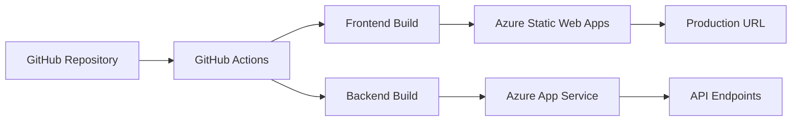

# デプロイメント統合ガイド

> **📅 作成日**: 2025年7月26日  
> **🎯 目的**: 全環境デプロイメント手順の統一ガイド  
> **💻 対象**: Frontend (Next.js) + Backend (.NET 8)  
> **🏗️ プラットフォーム**: Azure Static Web Apps + Azure App Service

---

## 📋 目次

1. [デプロイメント概要](#デプロイメント概要)
2. [環境別デプロイ戦略](#環境別デプロイ戦略)
3. [Frontend デプロイ (Azure Static Web Apps)](#frontend-デプロイ-azure-static-web-apps)
4. [Backend デプロイ (Azure App Service)](#backend-デプロイ-azure-app-service)
5. [ブランチ戦略とデプロイフロー](#ブランチ戦略とデプロイフロー)
6. [自動デプロイ設定](#自動デプロイ設定)
7. [手動デプロイ手順](#手動デプロイ手順)
8. [ロールバック手順](#ロールバック手順)
9. [デプロイ後検証](#デプロイ後検証)
10. [トラブルシューティング](#トラブルシューティング)

---

## 🌍 デプロイメント概要

### アーキテクチャ構成



### 対象環境

| 環境 | Frontend | Backend | 用途 |
|------|----------|---------|------|
| **Development** | `develop-branch-preview` | `shopifyapp-backend-develop` | 開発・テスト |
| **Staging** | `staging-branch-preview` | `shopifyapp-backend-staging` | 本番前検証 |
| **Production** | `main-production` | `shopifyapp-backend-production` | 本番運用 |

---

## 🚀 環境別デプロイ戦略

### Development Environment
- **トリガー**: `develop` ブランチへのプッシュ
- **目的**: 開発中の機能テスト
- **自動化**: 完全自動デプロイ
- **検証**: 基本的な動作確認のみ

### Staging Environment  
- **トリガー**: `staging` ブランチへのプッシュ
- **目的**: 本番リリース前の最終検証
- **自動化**: 自動デプロイ + 包括的テスト
- **検証**: 全機能テスト + パフォーマンステスト

### Production Environment
- **トリガー**: `main` ブランチへのプッシュ
- **目的**: 本番運用
- **自動化**: 承認プロセス付き自動デプロイ
- **検証**: ヘルスチェック + モニタリング

---

## 🎨 Frontend デプロイ (Azure Static Web Apps)

### 基本設定

#### 1. Azure Static Web Apps リソース設定
```yaml
# Azure Portal設定
Resource Name: shopify-marketing-suite-frontend
Location: Japan West
Plan: Free (Development) / Standard (Production)
Source: GitHub
Repository: shopify-ai-marketing-suite
Branch: main (Production) / develop (Development)
Build Location: /frontend
Output Location: out
```

#### 2. GitHub Actions ワークフロー設定

**Frontend専用ワークフロー例:**
```yaml
name: Frontend Deploy - Azure Static Web Apps

on:
  push:
    branches: [ main, staging, develop ]
    paths:
      - 'frontend/**'
  pull_request:
    types: [opened, synchronize, reopened, closed]
    branches: [ main ]
    paths:
      - 'frontend/**'

jobs:
  build_and_deploy:
    if: github.event_name == 'push' || (github.event_name == 'pull_request' && github.event.action != 'closed')
    runs-on: ubuntu-latest
    name: Build and Deploy Frontend
    
    steps:
    - uses: actions/checkout@v4
      with:
        submodules: true
        lfs: false
        
    - name: Determine environment
      id: env
      run: |
        if [ "${{ github.ref }}" = "refs/heads/main" ]; then
          echo "deployment_environment=" >> $GITHUB_OUTPUT
          echo "environment_name=Production" >> $GITHUB_OUTPUT
          echo "node_env=production" >> $GITHUB_OUTPUT
          echo "build_environment=production" >> $GITHUB_OUTPUT
        elif [ "${{ github.ref }}" = "refs/heads/staging" ]; then
          echo "deployment_environment=staging" >> $GITHUB_OUTPUT
          echo "environment_name=staging" >> $GITHUB_OUTPUT
          echo "node_env=production" >> $GITHUB_OUTPUT
          echo "build_environment=staging" >> $GITHUB_OUTPUT
        else
          echo "deployment_environment=development" >> $GITHUB_OUTPUT
          echo "environment_name=development" >> $GITHUB_OUTPUT
          echo "node_env=development" >> $GITHUB_OUTPUT
          echo "build_environment=development" >> $GITHUB_OUTPUT
        fi
        
    - name: Build And Deploy
      uses: Azure/static-web-apps-deploy@v1
      with:
        azure_static_web_apps_api_token: ${{ secrets.AZURE_STATIC_WEB_APPS_API_TOKEN }}
        repo_token: ${{ secrets.GITHUB_TOKEN }}
        action: "upload"
        app_location: "/frontend"
        output_location: "out"
        deployment_environment: ${{ steps.env.outputs.deployment_environment }}
        app_settings: |
          NODE_ENV=${{ steps.env.outputs.node_env }}
          NEXT_PUBLIC_BUILD_ENVIRONMENT=${{ steps.env.outputs.build_environment }}
          NEXT_PUBLIC_DEPLOY_ENVIRONMENT=${{ steps.env.outputs.build_environment }}
          NEXT_PUBLIC_APP_ENVIRONMENT=${{ steps.env.outputs.build_environment }}

  close_pull_request:
    if: github.event_name == 'pull_request' && github.event.action == 'closed'
    runs-on: ubuntu-latest
    name: Close Pull Request
    steps:
    - name: Close Pull Request
      uses: Azure/static-web-apps-deploy@v1
      with:
        azure_static_web_apps_api_token: ${{ secrets.AZURE_STATIC_WEB_APPS_API_TOKEN }}
        action: "close"
```

### 環境変数設定

#### ビルド時環境変数
```bash
# Production
NODE_ENV=production
NEXT_PUBLIC_BUILD_ENVIRONMENT=production
NEXT_PUBLIC_DEPLOY_ENVIRONMENT=production
NEXT_PUBLIC_APP_ENVIRONMENT=production

# Staging
NODE_ENV=production
NEXT_PUBLIC_BUILD_ENVIRONMENT=staging
NEXT_PUBLIC_DEPLOY_ENVIRONMENT=staging
NEXT_PUBLIC_APP_ENVIRONMENT=staging

# Development
NODE_ENV=development
NEXT_PUBLIC_BUILD_ENVIRONMENT=development
NEXT_PUBLIC_DEPLOY_ENVIRONMENT=development
NEXT_PUBLIC_APP_ENVIRONMENT=development
```

### Azure Static Web Apps 特殊事項

#### 環境の仕組み
- **Production環境**: `deployment_environment`を空にする
- **Preview環境**: `deployment_environment`に環境名を指定

#### よくある問題と解決法
1. **プレビュー環境が作成される問題**
   ```yaml
   # ❌ 間違い
   deployment_environment: Production
   
   # ✅ 正解
   deployment_environment: ""  # 本番環境の場合は空
   ```

2. **複数URLが作成される問題**
   - 原因: `deployment_environment`の設定ミス
   - 解決: mainブランチでは空文字、その他では環境名を指定

---

## ⚙️ Backend デプロイ (Azure App Service)

### 基本設定

#### 1. Azure App Service リソース設定
```yaml
# Production
App Name: shopifyapp-backend-production
Resource Group: shopify-marketing-rg
Runtime: .NET 8 (LTS)
Operating System: Windows
Region: Japan West
Plan: Basic B1 (Production) / Free F1 (Development)

# Staging  
App Name: shopifyapp-backend-staging
# Development
App Name: shopifyapp-backend-develop
```

#### 2. GitHub Actions ワークフロー設定

**Backend専用ワークフロー例:**
```yaml
name: Backend Deploy - Azure App Service

on:
  push:
    branches: [ main, staging, develop ]
    paths:
      - 'backend/**'
  workflow_dispatch:
    inputs:
      environment:
        description: 'Deploy to environment'
        required: true
        default: 'staging'
        type: choice
        options:
        - main
        - staging
        - develop

jobs:
  build:
    runs-on: windows-latest
    permissions:
      contents: read
      actions: read
      deployments: write
      id-token: write

    steps:
      - uses: actions/checkout@v4

      - name: Set up .NET Core
        uses: actions/setup-dotnet@v4
        with:
          dotnet-version: '8.x'

      - name: Build with dotnet
        run: |
          cd backend/ShopifyTestApi
          dotnet restore
          dotnet build --configuration Release

      - name: Publish with dotnet
        run: |
          cd backend/ShopifyTestApi
          dotnet publish -c Release -o ./publish

      - name: Upload artifact for deployment job
        uses: actions/upload-artifact@v4
        with:
          name: dotnet-app
          path: backend/ShopifyTestApi/publish

  deploy-main:
    runs-on: windows-latest
    needs: build
    if: github.ref == 'refs/heads/main' || (github.event_name == 'workflow_dispatch' && github.event.inputs.environment == 'main')
    environment: main
    
    steps:
      - name: Download artifact from build job
        uses: actions/download-artifact@v4
        with:
          name: dotnet-app

      - name: Deploy to Azure Web App (main)
        uses: azure/webapps-deploy@v3
        with:
          app-name: 'shopifyapp-backend-production'
          publish-profile: ${{ secrets.AZUREAPPSERVICE_PUBLISHPROFILE_MAIN }}
          package: .

  deploy-staging:
    runs-on: windows-latest
    needs: build
    if: github.ref == 'refs/heads/staging' || (github.event_name == 'workflow_dispatch' && github.event.inputs.environment == 'staging')
    environment: staging
    
    steps:
      - name: Download artifact from build job
        uses: actions/download-artifact@v4
        with:
          name: dotnet-app

      - name: Deploy to Azure Web App (staging)
        uses: azure/webapps-deploy@v3
        with:
          app-name: 'shopifyapp-backend-staging'
          publish-profile: ${{ secrets.AZUREAPPSERVICE_PUBLISHPROFILE_STAGING }}
          package: .

  deploy-develop:
    runs-on: windows-latest
    needs: build
    if: github.ref == 'refs/heads/develop' || (github.event_name == 'workflow_dispatch' && github.event.inputs.environment == 'develop')
    environment: development
    
    steps:
      - name: Download artifact from build job
        uses: actions/download-artifact@v4
        with:
          name: dotnet-app

      - name: Deploy to Azure Web App (develop)
        uses: azure/webapps-deploy@v3
        with:
          app-name: 'shopifyapp-backend-develop'
          publish-profile: ${{ secrets.AZUREAPPSERVICE_PUBLISHPROFILE_DEVELOP }}
          package: .
```

### Publish Profile設定

#### Azure Portalから取得
1. Azure Portal → App Service → アプリ選択
2. 「発行プロファイルの取得」をクリック
3. ダウンロードしたファイルの内容をGitHub Secretsに設定

#### GitHub Secrets設定
```
AZUREAPPSERVICE_PUBLISHPROFILE_MAIN: [本番環境のpublish profile]
AZUREAPPSERVICE_PUBLISHPROFILE_STAGING: [ステージング環境のpublish profile]  
AZUREAPPSERVICE_PUBLISHPROFILE_DEVELOP: [開発環境のpublish profile]
```

---

## 🌿 ブランチ戦略とデプロイフロー

### ブランチ構成

```mermaid
gitGraph
    commit id: "Initial"
    branch develop
    checkout develop
    commit id: "Feature A"
    commit id: "Feature B"
    branch staging
    checkout staging
    merge develop
    commit id: "Staging Test"
    checkout main
    merge staging
    commit id: "Production Release"
```

### デプロイフロー

#### 開発フロー
1. **Feature開発**: `feature/xxx` → `develop`
2. **開発環境テスト**: `develop` → Development環境
3. **ステージングテスト**: `develop` → `staging` → Staging環境
4. **本番リリース**: `staging` → `main` → Production環境

#### 緊急修正フロー
1. **Hotfix作成**: `main` → `hotfix/xxx`
2. **修正適用**: `hotfix/xxx` → `main` → Production環境
3. **バックマージ**: `main` → `staging` → `develop`

---

## 🤖 自動デプロイ設定

### GitHub Environments設定

#### 1. Environment作成
```yaml
# GitHub Repository Settings → Environments

# Production Environment
Name: main
Protection Rules:
  - Required reviewers: 1
  - Wait timer: 5 minutes
  - Restrict pushes to protected branches

# Staging Environment  
Name: staging
Protection Rules:
  - Wait timer: 1 minute

# Development Environment
Name: development
Protection Rules: (なし)
```

#### 2. Environment Secrets設定
```yaml
# Production
AZUREAPPSERVICE_PUBLISHPROFILE_MAIN: [本番環境のpublish profile]
AZURE_STATIC_WEB_APPS_API_TOKEN: [本番環境のtoken]

# Staging
AZUREAPPSERVICE_PUBLISHPROFILE_STAGING: [ステージング環境のpublish profile]

# Development  
AZUREAPPSERVICE_PUBLISHPROFILE_DEVELOP: [開発環境のpublish profile]
```

### 自動デプロイ条件

#### Frontend
- **トリガー**: `frontend/**` パスの変更
- **対象ブランチ**: `main`, `staging`, `develop`
- **実行条件**: プッシュまたはPRマージ

#### Backend
- **トリガー**: `backend/**` パスの変更  
- **対象ブランチ**: `main`, `staging`, `develop`
- **実行条件**: プッシュまたは手動実行

### 並列デプロイ制御

```yaml
# 同時デプロイを防ぐ設定
concurrency:
  group: deploy-${{ github.ref }}
  cancel-in-progress: true
```

---

## 🔧 手動デプロイ手順

### GitHub Actions Manual Trigger

#### 1. WebUIからの実行
1. GitHub Repository → Actions
2. デプロイワークフローを選択
3. 「Run workflow」をクリック
4. 環境とブランチを選択
5. 「Run workflow」で実行

#### 2. GitHub CLI使用
```bash
# Backend手動デプロイ
gh workflow run "Backend Deploy" --ref main

# Frontend手動デプロイ  
gh workflow run "Frontend Deploy" --ref main

# 特定環境へのデプロイ
gh workflow run "Backend Deploy" --ref develop -f environment=develop
```

### ローカルからの直接デプロイ

#### Frontend (Azure CLI使用)
```bash
# ビルド
cd frontend
npm run build

# Azure Static Web Apps CLIでデプロイ
npm install -g @azure/static-web-apps-cli
swa deploy --app-location . --output-location out --deployment-token $AZURE_STATIC_WEB_APPS_API_TOKEN
```

#### Backend (Azure CLI使用)
```bash
# ビルド・発行
cd backend/ShopifyTestApi
dotnet publish -c Release -o ./publish

# Azure App Serviceにデプロイ
az webapp deployment source config-zip \
  --resource-group shopify-marketing-rg \
  --name shopifyapp-backend-production \
  --src ./publish.zip
```

---

## 🔄 ロールバック手順

### 自動ロールバック

#### Azure Static Web Apps
```yaml
# Previous deploymentへの切り戻し
- name: Rollback Frontend
  uses: Azure/static-web-apps-deploy@v1
  with:
    azure_static_web_apps_api_token: ${{ secrets.AZURE_STATIC_WEB_APPS_API_TOKEN }}
    action: "upload"
    app_location: "/frontend"
    # 以前のコミットハッシュを指定
    skip_deploy_on_missing_secrets: true
```

#### Azure App Service
```yaml
# Deployment slotを使用したロールバック
- name: Rollback Backend
  uses: azure/webapps-deploy@v3
  with:
    app-name: 'shopifyapp-backend-production'
    publish-profile: ${{ secrets.AZUREAPPSERVICE_PUBLISHPROFILE_MAIN }}
    slot-name: 'staging'  # スロットスワップ
```

### 手動ロールバック

#### 1. Gitベースロールバック
```bash
# 前回の安定版にリセット
git checkout main
git reset --hard <previous-stable-commit>
git push --force-with-lease origin main

# または、revertコミット作成
git revert <problematic-commit>
git push origin main
```

#### 2. Azure Portalでのロールバック

**Azure Static Web Apps:**
1. Azure Portal → Static Web Apps → アプリ選択
2. 「Functions and configuration」→「Configuration」
3. 以前のdeploymentを選択して「Activate」

**Azure App Service:**
1. Azure Portal → App Service → アプリ選択
2. 「Deployment」→「Deployment slots」
3. スロットスワップまたは以前のバージョンに切り替え

---

## ✅ デプロイ後検証

### 自動ヘルスチェック

#### Frontend検証
```yaml
- name: Frontend Health Check
  run: |
    echo "Checking frontend health..."
    response=$(curl -s -o /dev/null -w "%{http_code}" https://your-frontend-url.com/api/health)
    if [ $response -eq 200 ]; then
      echo "✅ Frontend is healthy"
    else
      echo "❌ Frontend health check failed"
      exit 1
    fi
```

#### Backend検証
```yaml
- name: Backend Health Check
  run: |
    echo "Checking backend health..."
    response=$(curl -s -o /dev/null -w "%{http_code}" https://your-backend-url.azurewebsites.net/health)
    if [ $response -eq 200 ]; then
      echo "✅ Backend is healthy"
    else
      echo "❌ Backend health check failed"
      exit 1
    fi
```

### 手動検証項目

#### 基本機能確認
- [ ] ログイン・認証機能
- [ ] 顧客データ表示
- [ ] 購入頻度分析機能
- [ ] 休眠顧客分析機能
- [ ] 環境切り替え機能

#### パフォーマンス確認
- [ ] ページロード時間 < 3秒
- [ ] API応答時間 < 1秒
- [ ] リソース使用量が正常範囲

#### セキュリティ確認
- [ ] HTTPS接続
- [ ] 認証・認可が正常動作
- [ ] 機密情報の露出がない

---

## 🔍 トラブルシューティング

### よくある問題と解決法

#### 1. ビルド失敗

**症状**: GitHub Actionsでビルドエラー
```
Error: Build failed with exit code 1
```

**解決法**:
```bash
# ローカルでビルドテスト
cd frontend
npm ci
npm run build

# 依存関係の問題を確認
npm audit
npm audit fix
```

#### 2. デプロイ失敗

**症状**: Azure へのデプロイが失敗
```
Error: Failed to deploy to Azure
```

**確認事項**:
- [ ] Publish Profileが正しく設定されているか
- [ ] Azure リソースが正常に動作しているか
- [ ] GitHub Secretsが正しく設定されているか

**解決法**:
```yaml
# Secretsの再設定
# 1. Azure Portal から新しいPublish Profileをダウンロード
# 2. GitHub Repository Settings → Secrets で更新
# 3. ワークフローを再実行
```

#### 3. 環境変数の問題

**症状**: 環境変数が正しく設定されない
```
Error: Environment variable not found
```

**確認事項**:
```yaml
# デバッグ情報の追加
- name: Debug Environment
  run: |
    echo "NODE_ENV: $NODE_ENV"
    echo "BUILD_ENV: $NEXT_PUBLIC_BUILD_ENVIRONMENT"
    echo "DEPLOY_ENV: $NEXT_PUBLIC_DEPLOY_ENVIRONMENT"
```

#### 4. Azure Static Web Apps固有の問題

**症状**: プレビュー環境にデプロイされる
```yaml
# 解決法: deployment_environment設定の修正
deployment_environment: ${{ github.ref == 'refs/heads/main' && '' || 'development' }}
```

**症状**: ルーティングが正しく動作しない
```json
// staticwebapp.config.json を追加
{
  "navigationFallback": {
    "rewrite": "/index.html",
    "exclude": ["/images/*.{png,jpg,gif}", "/css/*"]
  },
  "routes": [
    {
      "route": "/api/*",
      "allowedRoles": ["authenticated"]
    }
  ]
}
```

### デバッグ用コマンド

#### GitHub Actions ログ確認
```bash
# GitHub CLI でログ取得
gh run list
gh run view <run-id>
gh run download <run-id>
```

#### Azure リソース状態確認
```bash
# Azure CLI でリソース確認
az webapp show --name shopifyapp-backend-production --resource-group shopify-marketing-rg
az staticwebapp show --name shopify-marketing-suite-frontend --resource-group shopify-marketing-rg

# ログ確認
az webapp log tail --name shopifyapp-backend-production --resource-group shopify-marketing-rg
```

---

## 📊 モニタリング・メトリクス

### 重要な監視項目

#### デプロイメトリクス
- デプロイ成功率
- デプロイ所要時間
- ロールバック頻度

#### アプリケーションメトリクス
- 稼働率 (Uptime)
- 応答時間
- エラー率

### アラート設定

#### Azure Monitor設定
```yaml
# Azure Portal → Monitor → Alerts
Alert Rules:
  - HTTP 5xx errors > 10/5min
  - Response time > 3 seconds
  - Availability < 99%
```

---

## 📋 デプロイチェックリスト

### デプロイ前
- [ ] 全テストが成功
- [ ] ビルドが成功
- [ ] 依存関係が最新
- [ ] セキュリティスキャン完了
- [ ] ブランチが最新状態

### デプロイ中
- [ ] GitHub Actions実行確認
- [ ] ビルドログ確認
- [ ] デプロイログ確認
- [ ] エラーの早期発見

### デプロイ後
- [ ] ヘルスチェック確認
- [ ] 基本機能テスト
- [ ] パフォーマンステスト
- [ ] モニタリング設定確認
- [ ] ロールバック準備完了

---

*最終更新: 2025年7月26日*