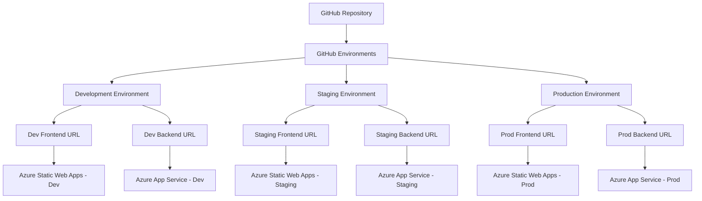

# 環境設定統合ガイド

> **📅 作成日**: 2025年7月26日  
> **🎯 目的**: 全環境設定・環境変数・GitHub設定の統一ガイド  
> **💻 対象**: Frontend (Next.js) + Backend (.NET 8)  
> **🌍 環境**: Development / Staging / Production

---

## 📋 目次

1. [環境設定概要](#環境設定概要)
2. [対応環境一覧](#対応環境一覧)
3. [環境変数設定](#環境変数設定)
4. [GitHub Environments設定](#github-environments設定)
5. [フロントエンド環境切り替え](#フロントエンド環境切り替え)
6. [ビルド時環境変数](#ビルド時環境変数)
7. [GitHub Actions環境変数](#github-actions環境変数)
8. [環境別設定詳細](#環境別設定詳細)
9. [トラブルシューティング](#トラブルシューティング)

---

## 🌍 環境設定概要

### アーキテクチャ概要



### 環境管理の基本原則

1. **環境分離**: 各環境で独立したリソースを使用
2. **設定統一**: 環境変数による設定の統一化
3. **自動化**: GitHub Actionsによる自動環境切り替え
4. **検証可能**: ブラウザでの環境確認機能

---

## 🏗️ 対応環境一覧

### Frontend環境

| 環境 | URL | 用途 | GitHub Branch |
|------|-----|------|---------------|
| **Development** | `https://app-develop.azurestaticapps.net` | 開発・デバッグ | `develop` |
| **Staging** | `https://app-staging.azurestaticapps.net` | 本番前テスト | `staging` |
| **Production** | `https://shopify-marketing-suite.azurestaticapps.net` | 本番運用 | `main` |

### Backend環境

| 環境 | URL | 用途 | Azure App Service |
|------|-----|------|-------------------|
| **Development** | `https://shopifyapp-backend-develop-a0e6fec4ath6fzaa.japanwest-01.azurewebsites.net` | 開発・テスト | `shopifyapp-backend-develop` |
| **Staging** | `https://shopifytestapi20250720173320-aed5bhc0cferg2hm.japanwest-01.azurewebsites.net` | ステージング検証 | `shopifyapp-backend-staging` |
| **Production** | `https://shopifyapp-backend-production.japanwest-01.azurewebsites.net` | 本番運用 | `shopifyapp-backend-production` |

---

## ⚙️ 環境変数設定

### 環境変数の種類と優先度

#### 優先度順位 (高 → 低)
1. **NEXT_PUBLIC_API_URL** (直接API URL指定)
2. **NEXT_PUBLIC_BUILD_ENVIRONMENT** (ビルド時設定)
3. **NEXT_PUBLIC_DEPLOY_ENVIRONMENT** (デプロイ時設定)
4. **NEXT_PUBLIC_APP_ENVIRONMENT** (アプリ環境設定)
5. **ローカルストレージ** (ブラウザ設定)
6. **NEXT_PUBLIC_ENVIRONMENT** (実行時環境変数)
7. **NODE_ENV** (Node.js環境)
8. **デフォルト** (フォールバック)

### 基本環境変数

#### Development環境
```bash
# .env.local または GitHub Secrets
NODE_ENV=development
NEXT_PUBLIC_BUILD_ENVIRONMENT=development
NEXT_PUBLIC_DEPLOY_ENVIRONMENT=development
NEXT_PUBLIC_APP_ENVIRONMENT=development

# Optional - 直接API URL指定
NEXT_PUBLIC_API_URL=https://shopifyapp-backend-develop-a0e6fec4ath6fzaa.japanwest-01.azurewebsites.net
```

#### Staging環境
```bash
NODE_ENV=production
NEXT_PUBLIC_BUILD_ENVIRONMENT=staging
NEXT_PUBLIC_DEPLOY_ENVIRONMENT=staging
NEXT_PUBLIC_APP_ENVIRONMENT=staging

NEXT_PUBLIC_API_URL=https://shopifytestapi20250720173320-aed5bhc0cferg2hm.japanwest-01.azurewebsites.net
```

#### Production環境
```bash
NODE_ENV=production
NEXT_PUBLIC_BUILD_ENVIRONMENT=production
NEXT_PUBLIC_DEPLOY_ENVIRONMENT=production
NEXT_PUBLIC_APP_ENVIRONMENT=production

NEXT_PUBLIC_API_URL=https://shopifyapp-backend-production.japanwest-01.azurewebsites.net
```

### バックエンド環境変数

#### Azure App Service設定
```bash
# 共通設定
ASPNETCORE_ENVIRONMENT=Production  # または Development

# Application Insights (オプション)
APPLICATIONINSIGHTS_CONNECTION_STRING=InstrumentationKey=xxx;IngestionEndpoint=xxx

# カスタム設定
API_VERSION=v1
CORS_ORIGINS=https://your-frontend-domain.com
```

---

## 🔧 GitHub Environments設定

### Environment作成

#### 1. GitHub Repository設定
```
Repository Settings → Environments → New environment
```

#### 2. 環境名設定
```yaml
# 環境名（GitHub Actionsで使用）
- production
- staging  
- development
```

#### 3. Protection Rules設定

**Production Environment:**
```yaml
Name: production
Protection Rules:
  Required reviewers: 1-2名
  Wait timer: 5 minutes
  Restrict pushes to protected branches: true
  Allowed branches: main
```

**Staging Environment:**
```yaml
Name: staging
Protection Rules:
  Wait timer: 1 minute
  Allowed branches: staging, main
```

**Development Environment:**
```yaml
Name: development
Protection Rules: (設定なし)
  Allowed branches: develop, staging, main
```

### Environment Secrets設定

#### Repository-level Secrets
```yaml
# 全環境共通
AZURE_STATIC_WEB_APPS_API_TOKEN: [Azure Static Web Apps API Token]

# Backend Publish Profiles
AZUREAPPSERVICE_PUBLISHPROFILE_PRODUCTION: [本番環境 Publish Profile]
AZUREAPPSERVICE_PUBLISHPROFILE_STAGING: [ステージング環境 Publish Profile]
AZUREAPPSERVICE_PUBLISHPROFILE_DEVELOP: [開発環境 Publish Profile]
```

#### Environment-specific Secrets
```yaml
# Production Environment Secrets
API_URL: https://shopifyapp-backend-production.japanwest-01.azurewebsites.net
DEBUG_API: false

# Staging Environment Secrets  
API_URL: https://shopifytestapi20250720173320-aed5bhc0cferg2hm.japanwest-01.azurewebsites.net
DEBUG_API: true

# Development Environment Secrets
API_URL: https://shopifyapp-backend-develop-a0e6fec4ath6fzaa.japanwest-01.azurewebsites.net
DEBUG_API: true
```

---

## 🎨 フロントエンド環境切り替え

### 実装詳細

#### 設定ファイル
```typescript
// frontend/src/lib/config/environments.ts
export const environments = {
  development: {
    name: '開発環境',
    apiUrl: 'https://shopifyapp-backend-develop-a0e6fec4ath6fzaa.japanwest-01.azurewebsites.net',
    isProduction: false,
  },
  staging: {
    name: 'ステージング環境', 
    apiUrl: 'https://shopifytestapi20250720173320-aed5bhc0cferg2hm.japanwest-01.azurewebsites.net',
    isProduction: false,
  },
  production: {
    name: '本番環境',
    apiUrl: 'https://shopifyapp-backend-production.japanwest-01.azurewebsites.net',
    isProduction: true,
  },
} as const;
```

#### API設定
```typescript
// frontend/src/lib/api-config.ts
export function getApiBaseUrl(): string {
  // 1. 直接指定されたAPI URL
  if (process.env.NEXT_PUBLIC_API_URL) {
    return process.env.NEXT_PUBLIC_API_URL;
  }
  
  // 2. ビルド時環境変数
  const buildEnv = process.env.NEXT_PUBLIC_BUILD_ENVIRONMENT;
  if (buildEnv && environments[buildEnv]) {
    return environments[buildEnv].apiUrl;
  }
  
  // 3. デプロイ時環境変数
  const deployEnv = process.env.NEXT_PUBLIC_DEPLOY_ENVIRONMENT;
  if (deployEnv && environments[deployEnv]) {
    return environments[deployEnv].apiUrl;
  }
  
  // 4. ローカルストレージ (ブラウザ環境のみ)
  if (typeof window !== 'undefined') {
    const storedEnv = localStorage.getItem('selected-environment');
    if (storedEnv && environments[storedEnv]) {
      return environments[storedEnv].apiUrl;
    }
  }
  
  // 5. NODE_ENVベースの判定
  if (process.env.NODE_ENV === 'production') {
    return environments.production.apiUrl;
  }
  
  // 6. デフォルト
  return environments.development.apiUrl;
}
```

### 環境切り替えUI

#### 環境選択コンポーネント
```typescript
// frontend/src/components/common/EnvironmentSelector.tsx
import { useEnvironment } from '@/hooks/useEnvironment';

export function EnvironmentSelector() {
  const { currentEnvironment, switchEnvironment, availableEnvironments, isProductionMode } = useEnvironment();
  
  // 本番環境では環境切り替えを無効化
  if (isProductionMode) {
    return (
      <div className="text-sm text-muted-foreground">
        Environment: {currentEnvironment.name}
      </div>
    );
  }
  
  return (
    <Select value={currentEnvironment.key} onValueChange={switchEnvironment}>
      <SelectTrigger className="w-[200px]">
        <SelectValue placeholder="Environment" />
      </SelectTrigger>
      <SelectContent>
        {availableEnvironments.map((env) => (
          <SelectItem key={env.key} value={env.key}>
            <div className="flex items-center gap-2">
              <div className={`w-2 h-2 rounded-full ${env.isProduction ? 'bg-red-500' : 'bg-green-500'}`} />
              {env.name}
            </div>
          </SelectItem>
        ))}
      </SelectContent>
    </Select>
  );
}
```

#### 環境管理Hook
```typescript
// frontend/src/hooks/useEnvironment.ts
export function useEnvironment() {
  const [currentEnv, setCurrentEnv] = useState(getCurrentEnvironment());
  
  const switchEnvironment = useCallback((envKey: string) => {
    if (environments[envKey]) {
      localStorage.setItem('selected-environment', envKey);
      // ページリロードで環境切り替えを反映
      window.location.reload();
    }
  }, []);
  
  const isProductionMode = useMemo(() => {
    return process.env.NEXT_PUBLIC_BUILD_ENVIRONMENT === 'production';
  }, []);
  
  return {
    currentEnvironment: currentEnv,
    switchEnvironment,
    availableEnvironments: Object.entries(environments).map(([key, env]) => ({
      key,
      ...env,
    })),
    isProductionMode,
  };
}
```

---

## 🏗️ ビルド時環境変数

### ビルド時設定の仕組み

#### Next.jsビルド時の環境変数埋め込み
```bash
# ビルド時に静的に埋め込まれる
NEXT_PUBLIC_BUILD_ENVIRONMENT=production npm run build

# ビルド後は変更不可（静的ファイルに埋め込み済み）
```

#### ビルド設定例

**Development Build:**
```bash
# package.json scripts
"build:dev": "NODE_ENV=development NEXT_PUBLIC_BUILD_ENVIRONMENT=development next build",
"build:staging": "NODE_ENV=production NEXT_PUBLIC_BUILD_ENVIRONMENT=staging next build", 
"build:prod": "NODE_ENV=production NEXT_PUBLIC_BUILD_ENVIRONMENT=production next build"
```

**GitHub Actions Build:**
```yaml
- name: Build application
  working-directory: ./frontend
  env:
    NODE_ENV: ${{ steps.env.outputs.node_env }}
    NEXT_PUBLIC_BUILD_ENVIRONMENT: ${{ steps.env.outputs.build_environment }}
    NEXT_PUBLIC_DEPLOY_ENVIRONMENT: ${{ steps.env.outputs.deploy_environment }}
    NEXT_PUBLIC_APP_ENVIRONMENT: ${{ steps.env.outputs.app_environment }}
    NEXT_PUBLIC_API_URL: ${{ secrets.API_URL }}
    NEXT_PUBLIC_DEBUG_API: ${{ secrets.DEBUG_API }}
  run: npm run build
```

### 環境判定ロジック

#### ビルド時環境変数の確認
```typescript
// デバッグ情報の表示
console.log('🔍 Environment Check:', {
  currentEnvironment: getCurrentEnvironment(),
  nodeEnv: process.env.NODE_ENV,
  buildEnvironment: process.env.NEXT_PUBLIC_BUILD_ENVIRONMENT,
  deployEnvironment: process.env.NEXT_PUBLIC_DEPLOY_ENVIRONMENT,
  appEnvironment: process.env.NEXT_PUBLIC_APP_ENVIRONMENT,
  isBuildTimeSet: !!process.env.NEXT_PUBLIC_BUILD_ENVIRONMENT,
  apiBaseUrl: getApiBaseUrl(),
  isProduction: getCurrentEnvironment() === 'production',
});
```

---

## 🤖 GitHub Actions環境変数

### ワークフロー環境変数設定

#### Frontend環境変数設定
```yaml
name: Frontend Deploy

jobs:
  build_and_deploy:
    steps:
    - name: Determine environment
      id: env
      run: |
        if [ "${{ github.ref }}" = "refs/heads/main" ]; then
          echo "node_env=production" >> $GITHUB_OUTPUT
          echo "build_environment=production" >> $GITHUB_OUTPUT
          echo "deploy_environment=production" >> $GITHUB_OUTPUT
          echo "app_environment=production" >> $GITHUB_OUTPUT
          echo "deployment_environment=" >> $GITHUB_OUTPUT
        elif [ "${{ github.ref }}" = "refs/heads/staging" ]; then
          echo "node_env=production" >> $GITHUB_OUTPUT
          echo "build_environment=staging" >> $GITHUB_OUTPUT
          echo "deploy_environment=staging" >> $GITHUB_OUTPUT
          echo "app_environment=staging" >> $GITHUB_OUTPUT
          echo "deployment_environment=staging" >> $GITHUB_OUTPUT
        else
          echo "node_env=development" >> $GITHUB_OUTPUT
          echo "build_environment=development" >> $GITHUB_OUTPUT
          echo "deploy_environment=development" >> $GITHUB_OUTPUT
          echo "app_environment=development" >> $GITHUB_OUTPUT
          echo "deployment_environment=development" >> $GITHUB_OUTPUT
        fi
        
    - name: Build And Deploy
      uses: Azure/static-web-apps-deploy@v1
      with:
        app_settings: |
          NODE_ENV=${{ steps.env.outputs.node_env }}
          NEXT_PUBLIC_BUILD_ENVIRONMENT=${{ steps.env.outputs.build_environment }}
          NEXT_PUBLIC_DEPLOY_ENVIRONMENT=${{ steps.env.outputs.deploy_environment }}
          NEXT_PUBLIC_APP_ENVIRONMENT=${{ steps.env.outputs.app_environment }}
          NEXT_PUBLIC_API_URL=${{ secrets.API_URL }}
          NEXT_PUBLIC_DEBUG_API=${{ secrets.DEBUG_API }}
```

#### Backend環境変数設定
```yaml
name: Backend Deploy

jobs:
  deploy-production:
    environment: production
    steps:
    - name: Deploy to Azure Web App
      uses: azure/webapps-deploy@v3
      with:
        app-name: 'shopifyapp-backend-production'
        publish-profile: ${{ secrets.AZUREAPPSERVICE_PUBLISHPROFILE_PRODUCTION }}
        package: .
      env:
        ASPNETCORE_ENVIRONMENT: Production
        APPLICATIONINSIGHTS_CONNECTION_STRING: ${{ secrets.APPLICATIONINSIGHTS_CONNECTION_STRING }}
```

### 環境別Secret管理

#### Repository Secrets (全環境共通)
```yaml
# Azure関連
AZURE_STATIC_WEB_APPS_API_TOKEN: xxx
AZUREAPPSERVICE_PUBLISHPROFILE_PRODUCTION: xxx
AZUREAPPSERVICE_PUBLISHPROFILE_STAGING: xxx  
AZUREAPPSERVICE_PUBLISHPROFILE_DEVELOP: xxx

# Application Insights
APPLICATIONINSIGHTS_CONNECTION_STRING: xxx
```

#### Environment Secrets (環境別)
```yaml
# Production Environment
API_URL: https://shopifyapp-backend-production.japanwest-01.azurewebsites.net
DEBUG_API: false

# Staging Environment
API_URL: https://shopifytestapi20250720173320-aed5bhc0cferg2hm.japanwest-01.azurewebsites.net
DEBUG_API: true

# Development Environment  
API_URL: https://shopifyapp-backend-develop-a0e6fec4ath6fzaa.japanwest-01.azurewebsites.net
DEBUG_API: true
```

---

## 📋 環境別設定詳細

### Development環境設定

#### Frontend設定
```typescript
const developmentConfig = {
  name: '開発環境',
  apiUrl: 'https://shopifyapp-backend-develop-a0e6fec4ath6fzaa.japanwest-01.azurewebsites.net',
  features: {
    environmentSelector: true,
    debugMode: true,
    mockDataToggle: true,
    apiTesting: true,
  },
  logging: {
    level: 'debug',
    console: true,
    network: true,
  },
  performance: {
    enableProfiler: true,
    showMetrics: true,
  },
};
```

#### Backend設定
```json
{
  "Serilog": {
    "MinimumLevel": {
      "Default": "Debug",
      "Override": {
        "Microsoft": "Information",
        "System": "Information"
      }
    }
  },
  "AllowedHosts": "*",
  "CORS": {
    "AllowedOrigins": [
      "http://localhost:3000",
      "https://app-develop.azurestaticapps.net"
    ]
  }
}
```

### Staging環境設定

#### Frontend設定
```typescript
const stagingConfig = {
  name: 'ステージング環境',
  apiUrl: 'https://shopifytestapi20250720173320-aed5bhc0cferg2hm.japanwest-01.azurewebsites.net',
  features: {
    environmentSelector: true,
    debugMode: false,
    mockDataToggle: true,
    apiTesting: false,
  },
  logging: {
    level: 'info',
    console: false,
    network: true,
  },
  performance: {
    enableProfiler: false,
    showMetrics: true,
  },
};
```

### Production環境設定

#### Frontend設定
```typescript
const productionConfig = {
  name: '本番環境',
  apiUrl: 'https://shopifyapp-backend-production.japanwest-01.azurewebsites.net',
  features: {
    environmentSelector: false,  // 本番では無効
    debugMode: false,
    mockDataToggle: false,
    apiTesting: false,
  },
  logging: {
    level: 'warn',
    console: false,
    network: false,
  },
  performance: {
    enableProfiler: false,
    showMetrics: false,
  },
};
```

#### Backend設定
```json
{
  "Serilog": {
    "MinimumLevel": {
      "Default": "Information",
      "Override": {
        "Microsoft": "Warning",
        "System": "Warning"
      }
    }
  },
  "AllowedHosts": "shopify-marketing-suite.azurestaticapps.net",
  "CORS": {
    "AllowedOrigins": [
      "https://shopify-marketing-suite.azurestaticapps.net"
    ]
  }
}
```

---

## 🔍 トラブルシューティング

### よくある問題と解決法

#### 1. 環境変数が反映されない

**症状**: 設定した環境変数が適用されない
```
Expected: production environment
Actual: development environment
```

**確認事項**:
```bash
# ブラウザコンソールで確認
console.log('Environment variables:', {
  NODE_ENV: process.env.NODE_ENV,
  BUILD_ENV: process.env.NEXT_PUBLIC_BUILD_ENVIRONMENT,
  DEPLOY_ENV: process.env.NEXT_PUBLIC_DEPLOY_ENVIRONMENT,
});
```

**解決法**:
1. **ビルド時環境変数の確認**
   ```bash
   # GitHub Actionsでデバッグ出力追加
   - name: Debug Environment Variables
     run: |
       echo "NODE_ENV: $NODE_ENV"
       echo "BUILD_ENV: $NEXT_PUBLIC_BUILD_ENVIRONMENT"
   ```

2. **キャッシュクリア**
   ```bash
   # ブラウザのハードリフレッシュ
   Ctrl + F5 (Windows) / Cmd + Shift + R (Mac)
   
   # ローカルストレージクリア
   localStorage.removeItem('selected-environment');
   ```

#### 2. 環境切り替えが動作しない

**症状**: ブラウザで環境を切り替えても反映されない

**確認事項**:
- [ ] 本番環境で環境切り替えを試していないか
- [ ] ローカルストレージに値が保存されているか
- [ ] ページリロード後に反映されているか

**解決法**:
```typescript
// デバッグ用コード
function debugEnvironment() {
  console.log('Current environment info:', {
    selected: localStorage.getItem('selected-environment'),
    buildTime: process.env.NEXT_PUBLIC_BUILD_ENVIRONMENT,
    isProduction: process.env.NEXT_PUBLIC_BUILD_ENVIRONMENT === 'production',
    apiUrl: getApiBaseUrl(),
  });
}
```

#### 3. Azure Static Web Apps環境問題

**症状**: デプロイ環境が意図したものと異なる

**よくある問題**:
```yaml
# ❌ 間違った設定
deployment_environment: Production  # → プレビュー環境が作成される

# ✅ 正しい設定  
deployment_environment: ""  # → 本番環境にデプロイ
```

**解決法**:
```yaml
# 条件分岐での設定
deployment_environment: ${{ github.ref == 'refs/heads/main' && '' || 'development' }}
```

#### 4. GitHub Environments設定問題

**症状**: "No matching Static Web App environment was found"

**原因**: 環境名の大文字小文字不一致

**解決法**:
```yaml
# Azure Portal の環境名と完全一致させる
# Azure Portal: production → ワークフロー: production
# Azure Portal: staging → ワークフロー: staging
```

#### 5. API接続エラー

**症状**: フロントエンドからバックエンドAPIに接続できない

**確認事項**:
- [ ] API URLが正しく設定されているか
- [ ] CORSが適切に設定されているか  
- [ ] バックエンドサービスが起動しているか

**解決法**:
```bash
# API接続テスト
curl -I https://shopifyapp-backend-production.japanwest-01.azurewebsites.net/health

# CORS設定確認
curl -H "Origin: https://shopify-marketing-suite.azurestaticapps.net" \
     -H "Access-Control-Request-Method: GET" \
     -X OPTIONS \
     https://shopifyapp-backend-production.japanwest-01.azurewebsites.net/api/test
```

### デバッグ用ツール

#### 環境情報確認ページ
```typescript
// /pages/debug/environment.tsx
export default function EnvironmentDebugPage() {
  const environmentInfo = {
    // Node環境
    nodeEnv: process.env.NODE_ENV,
    
    // Build時環境変数
    buildEnvironment: process.env.NEXT_PUBLIC_BUILD_ENVIRONMENT,
    deployEnvironment: process.env.NEXT_PUBLIC_DEPLOY_ENVIRONMENT,
    appEnvironment: process.env.NEXT_PUBLIC_APP_ENVIRONMENT,
    
    // API設定
    apiUrl: process.env.NEXT_PUBLIC_API_URL,
    debugApi: process.env.NEXT_PUBLIC_DEBUG_API,
    
    // 実行時設定
    currentEnvironment: getCurrentEnvironment(),
    apiBaseUrl: getApiBaseUrl(),
    
    // ブラウザ設定
    selectedEnvironment: typeof window !== 'undefined' 
      ? localStorage.getItem('selected-environment') 
      : 'N/A (Server)',
  };
  
  return (
    <div className="p-6">
      <h1 className="text-2xl font-bold mb-4">Environment Debug Info</h1>
      <pre className="bg-gray-100 p-4 rounded overflow-auto">
        {JSON.stringify(environmentInfo, null, 2)}
      </pre>
    </div>
  );
}
```

---

## 📊 設定確認チェックリスト

### GitHub環境設定
- [ ] Repository Secretsが設定済み
- [ ] Environment Secretsが環境別に設定済み
- [ ] Protection Rulesが適切に設定済み
- [ ] ワークフローで環境変数が正しく参照されている

### Azure環境設定
- [ ] Static Web Appsリソースが作成済み
- [ ] App Serviceリソースが作成済み
- [ ] Publish Profilesが取得済み
- [ ] CORS設定が適切

### アプリケーション設定
- [ ] 環境設定ファイルが作成済み
- [ ] 環境切り替えUIが実装済み
- [ ] API設定が環境別に分離済み
- [ ] デバッグ機能が実装済み

### デプロイ設定
- [ ] ワークフローが環境別に設定済み
- [ ] ビルド時環境変数が設定済み
- [ ] デプロイ後の検証が設定済み
- [ ] ロールバック手順が準備済み

---

*最終更新: 2025年7月26日*