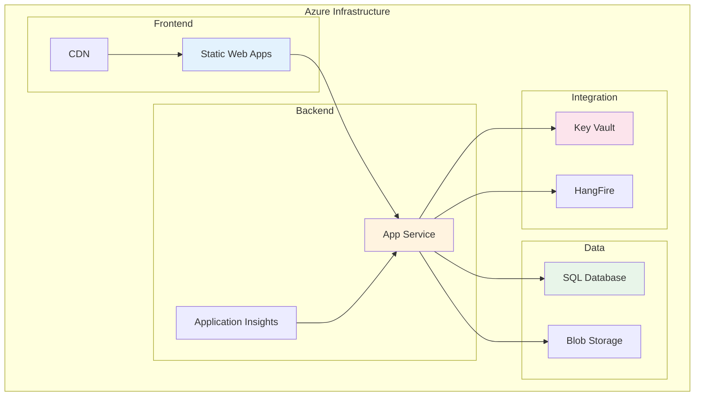
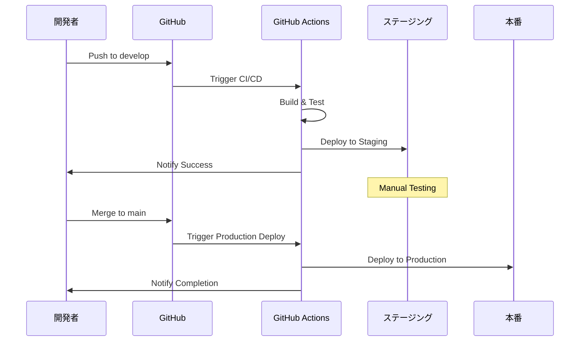

# 🔧 運用ドキュメント

## 概要
このフォルダには、システム運用、Azure管理、CI/CD、デプロイメント、環境管理に関するすべての運用文書が含まれています。

---

## 📁 フォルダ構成

```
05-operations/
├── 01-Azure運用/        # Azure環境の運用管理
├── 02-CI_CD/           # 継続的インテグレーション/デプロイ
├── 03-デプロイメント/    # デプロイ手順・戦略
└── 04-環境管理/         # 環境設定・管理
```

---

## 📚 主要ドキュメント

### ☁️ 01-Azure運用
| ドキュメント | 説明 | 重要度 |
|------------|------|--------|
| [Azure運用ガイド.md](./01-Azure運用/Azure運用ガイド.md) | Azure環境の運用手順、監視、メンテナンス | ⭐⭐⭐ |

### 🔄 02-CI_CD
| ドキュメント | 説明 | 重要度 |
|------------|------|--------|
| [CI_CDトラブルシューティング.md](./02-CI_CD/CI_CDトラブルシューティング.md) | GitHub Actions、ビルドエラー対処法 | ⭐⭐⭐ |

### 🚀 03-デプロイメント
| ドキュメント | 説明 | 重要度 |
|------------|------|--------|
| [デプロイメントマスターガイド.md](./03-デプロイメント/デプロイメントマスターガイド.md) | 完全なデプロイ手順書 | ⭐⭐⭐ |

### ⚙️ 04-環境管理
| ドキュメント | 説明 | 重要度 |
|------------|------|--------|
| [環境設定マスターガイド.md](./04-環境管理/環境設定マスターガイド.md) | 開発/ステージング/本番環境の管理 | ⭐⭐⭐ |

---

## 🏗️ インフラストラクチャ概要



---

## 📊 環境構成

### 環境一覧
| 環境 | 用途 | URL | 状態 |
|------|------|-----|------|
| **Development** | ローカル開発 | http://localhost:3000 | 🟢 Active |
| **Staging** | テスト環境 | https://staging.ecmapp.com | 🟡 Setup |
| **Production** | 本番環境 | https://app.ecmapp.com | 🔴 Pending |

### リソース構成（本番環境）
```
Azure Resource Group: rg-shopify-app-prod
├── App Service Plan: B1 Basic ($55/月)
├── App Service: as-shopify-backend
├── Static Web Apps: swa-shopify-frontend
├── SQL Database: Basic 5DTU ($5/月)
├── Application Insights: ai-shopify-monitor
└── Key Vault: kv-shopify-secrets
```

---

## 🚀 デプロイメントフロー



---

## 📋 運用チェックリスト

### 日次運用
- [ ] Application Insights確認
- [ ] エラーログチェック
- [ ] リソース使用率確認
- [ ] バックアップ確認

### 週次運用
- [ ] パフォーマンスレポート
- [ ] セキュリティアラート確認
- [ ] コスト分析
- [ ] 証明書有効期限確認

### 月次運用
- [ ] Azure費用レビュー
- [ ] スケーリング評価
- [ ] ディザスタリカバリテスト
- [ ] ドキュメント更新

---

## 🔐 セキュリティ管理

### アクセス管理
```yaml
Production:
  - 福田様: Owner
  - Kenji: Contributor
  - Takashi: Contributor (Backend)
  - Yuki: Reader (Frontend)

Staging:
  - 全開発者: Contributor

Key Vault:
  - App Service: Get Secret権限
  - 管理者のみ: Set Secret権限
```

### シークレット管理
| シークレット | 保存場所 | ローテーション |
|-------------|---------|---------------|
| DB接続文字列 | Key Vault | 90日 |
| Shopify API Key | Key Vault | 更新不要 |
| JWT Secret | Key Vault | 180日 |
| SSL証明書 | Key Vault | 年次 |

---

## ⚡ パフォーマンス目標

### SLA（Service Level Agreement）
```
可用性      : 99.9%（月間43分以内のダウンタイム）
応答時間    : API 95%が2秒以内
同時接続数  : 1000ユーザー
データ処理  : 10万件/時
```

### 監視メトリクス
| メトリクス | 閾値 | アラート |
|-----------|------|---------|
| CPU使用率 | >80% | Email |
| メモリ使用率 | >85% | Email |
| 応答時間 | >3秒 | Slack |
| エラー率 | >1% | Slack + Phone |

---

## 🛠️ トラブルシューティング

### よくある問題と対処法

#### 1. デプロイ失敗
```bash
# ビルドキャッシュクリア
npm cache clean --force
dotnet clean

# 依存関係再インストール
npm ci
dotnet restore
```

#### 2. データベース接続エラー
```sql
-- 接続文字列確認
SELECT * FROM sys.databases WHERE name = 'shopifyapp'

-- ファイアウォール設定確認
EXEC sp_set_database_firewall_rule
```

#### 3. 証明書エラー
```bash
# 証明書更新
az keyvault certificate import --vault-name kv-shopify-secrets
```

---

## 📈 コスト最適化

### 現在のコスト構成
| サービス | 月額 | 最適化案 |
|---------|------|----------|
| App Service | $55 | オートスケール設定 |
| SQL Database | $5 | DTU監視・調整 |
| Static Web Apps | $9 | CDN活用 |
| **合計** | **$69** | 目標: $60以下 |

### コスト削減施策
1. **開発環境**: 夜間自動停止
2. **ステージング**: 使用時のみ起動
3. **本番**: Reserved Instance検討
4. **ストレージ**: Cool Tier活用

---

## 📞 緊急連絡先

### エスカレーション
1. **Level 1**: Slack通知 (#ops-alerts)
2. **Level 2**: メール通知
3. **Level 3**: 電話連絡

### 担当者
| 役割 | 担当者 | 連絡先 |
|------|--------|--------|
| インフラ責任者 | 福田様 | メール |
| 技術リード | Kenji | Slack/メール |
| Backend | Takashi | Slack |
| Frontend | Yuki | Slack |

### 外部サポート
- **Azure Support**: Premium契約
- **Shopify Partner Support**: 24/7対応

---

## 📚 関連ドキュメント

### 開発ドキュメント
- [開発環境構築](../04-development/01-環境構築/)
- [デプロイ手順](../04-development/03-Azure設定/)

### アーキテクチャ
- [システム設計](../02-architecture/01-システム設計/)
- [インフラ設計](../06-infrastructure/)

---

## 🔄 更新履歴

| 日付 | 更新内容 | 担当者 |
|------|---------|--------|
| 2025-08-12 | フォルダ再構成、日本語化 | Kenji |
| 2025-08-12 | Azure構成最適化 | Kenji |
| 2025-08-05 | 初版作成 | Team |

---

## 📝 運用改善提案

### 短期（1ヶ月）
- [ ] 監視ダッシュボード構築
- [ ] アラート最適化
- [ ] ランブック作成

### 中期（3ヶ月）
- [ ] 自動スケーリング実装
- [ ] DR環境構築
- [ ] コスト分析自動化

### 長期（6ヶ月）
- [ ] マルチリージョン対応
- [ ] Kubernetes移行検討
- [ ] AI運用支援導入

---

**最終更新**: 2025年8月12日 19:00