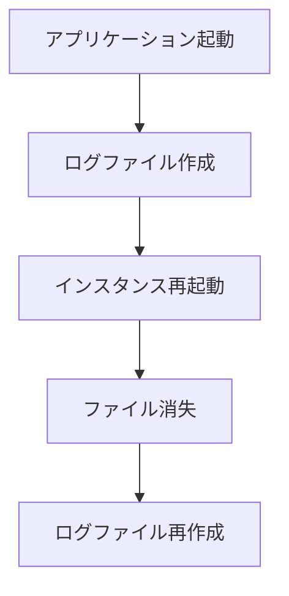
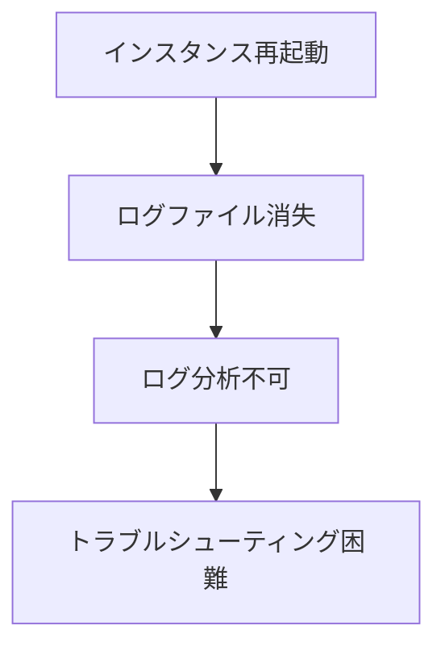

# Azure App Service ファイルシステム制約とローカルディスクログ出力

> **📅 作成日**: 2025年7月23日  
> **🎯 対象**: Azure App Service (.NET)  
> **💻 環境**: Azure App Service

---

## 📋 目次
1. [Azure App Serviceのファイルシステム制約](#azure-app-serviceのファイルシステム制約)
2. [ローカルディスクログ出力の実現可能性](#ローカルディスクログ出力の実現可能性)
3. [ログファイルの取得方法](#ログファイルの取得方法)
4. [運用面でのメリット・デメリット](#運用面でのメリットデメリット)
5. [推奨設定](#推奨設定)

---

## 🔍 Azure App Serviceのファイルシステム制約

### App Serviceのファイルシステム特性

Azure App Serviceは**PaaS（Platform as a Service）**のため、従来のIaaS仮想マシンとは異なる制約があります：

| 項目 | 制約内容 | 影響 |
|------|----------|------|
| **永続性** | インスタンス再起動時にファイルが消失 | ログファイルの永続化に注意 |
| **容量制限** | 1GBの永続ストレージ | ログローテーション必須 |
| **パフォーマンス** | 共有ストレージのため遅い | 大量ログ出力時の性能劣化 |
| **アクセス方法** | Kudu Console / FTP | 直接アクセス不可 |

### 利用可能なディレクトリ

```bash
# 永続ディレクトリ（推奨）
/home/LogFiles/Application/     # アプリケーションログ
/home/LogFiles/http/RawLogs/   # Webサーバーログ
/home/LogFiles/DetailedErrors/ # 詳細エラー

# 一時ディレクトリ（非推奨）
/tmp/                          # 一時ファイル
/var/tmp/                      # 一時ファイル
```

### ファイルシステムの制約詳細

#### 1. 永続性の問題


**制約**:
- インスタンス再起動時に `/home` 以外のファイルが消失
- スケールアウト時にファイルが共有されない
- デプロイ時にファイルがリセットされる場合がある

#### 2. 容量制限
```bash
# ディスク使用量確認（Kudu Console）
df -h

# 結果例
Filesystem      Size  Used Avail Use% Mounted on
/dev/sda1       14G   13G  1.0G  93% /
tmpfs           3.2G     0  3.2G   0% /dev/shm
/dev/sdb1       1.0G  200M  800M  20% /home
```

**制約**:
- `/home` ディレクトリは約1GB
- ログファイルの蓄積で容量不足の可能性
- 自動ローテーション設定が必須

#### 3. パフォーマンス制約
```csharp
// パフォーマンスに影響するログ出力例
_logger.LogInformation("大量のログメッセージ: {Data}", largeDataObject);
```

**制約**:
- 共有ストレージのため書き込み速度が遅い
- 大量ログ出力時にアプリケーション性能が劣化
- 同時アクセス時の競合

---

## ✅ ローカルディスクログ出力の実現可能性

### 実現可能：YES ✅

Azure App Serviceでもローカルディスクへのログ出力は**完全に実現可能**です。

### 実装方法

#### 1. Serilog File Sink の設定

**NuGetパッケージ追加**:
```bash
dotnet add package Serilog.Sinks.File
```

**appsettings.Production.json 設定例**:
```json
{
  "Serilog": {
    "Using": ["Serilog.Sinks.Console", "Serilog.Sinks.File"],
    "WriteTo": [
      {
        "Name": "Console"
      },
      {
        "Name": "File",
        "Args": {
          "path": "/home/LogFiles/Application/app-.txt",
          "rollingInterval": "Day",
          "retainedFileCountLimit": 7,
          "fileSizeLimitBytes": 10485760,
          "outputTemplate": "[{Timestamp:yyyy-MM-dd HH:mm:ss.fff zzz} {Level:u3}] {Message:lj} {Properties:j}{NewLine}{Exception}"
        }
      }
    ]
  }
}
```

#### 2. ログファイルの保存場所

```bash
# 推奨ディレクトリ構造
/home/LogFiles/Application/
├── app-20250723.txt          # 日別ログファイル
├── app-20250724.txt
├── app-20250725.txt
└── app-20250726.txt

# ファイルサイズ制限例
-rw-r--r-- 1 app app  2.5M Jul 23 00:00 app-20250723.txt
-rw-r--r-- 1 app app  3.1M Jul 24 00:00 app-20250724.txt
-rw-r--r-- 1 app app  2.8M Jul 25 00:00 app-20250725.txt
```

#### 3. ローテーション設定の詳細

```json
{
  "Args": {
    "path": "/home/LogFiles/Application/app-.txt",
    "rollingInterval": "Day",              // 日別ローテーション
    "retainedFileCountLimit": 7,           // 7日分保持
    "fileSizeLimitBytes": 10485760,        // 10MB制限
    "rollOnFileSizeLimit": true,           // サイズ制限時ローテーション
    "shared": false,                       // 排他ロック
    "flushToDiskInterval": "00:00:01"     // 1秒間隔でフラッシュ
  }
}
```

---

## 📥 ログファイルの取得方法

### 1. Kudu Console での直接確認

#### アクセス方法
```
https://<app-name>.scm.azurewebsites.net/
```

#### ファイル確認コマンド
```bash
# ログディレクトリの確認
ls -la /home/LogFiles/Application/

# 最新ログファイルの確認
tail -f /home/LogFiles/Application/app-20250723.txt

# ファイルサイズ確認
du -h /home/LogFiles/Application/*.txt

# ディスク使用量確認
df -h /home/LogFiles/Application/
```

### 2. Azure CLI での取得

```bash
# ログファイルのダウンロード
az webapp log download --name <app-name> --resource-group <rg-name>

# 特定ファイルの取得（Kudu REST API）
curl -u <username>:<password> \
  "https://<app-name>.scm.azurewebsites.net/api/vfs/home/LogFiles/Application/app-20250723.txt"
```

### 3. FTP での取得

```bash
# FTP接続情報の取得
az webapp deployment list-publishing-profiles --name <app-name> --resource-group <rg-name>

# FTP接続例
ftp <app-name>.ftp.azurewebsites.windows.net
# ユーザー名: <app-name>\<username>
# パスワード: <password>
```

### 4. Azure Storage への自動転送

#### Blob Storage への転送設定
```json
{
  "Serilog": {
    "WriteTo": [
      {
        "Name": "File",
        "Args": {
          "path": "/home/LogFiles/Application/app-.txt"
        }
      },
      {
        "Name": "AzureBlobStorage",
        "Args": {
          "connectionString": "#{STORAGE_CONNECTION_STRING}#",
          "containerName": "app-logs",
          "blobName": "app-{Date}.txt"
        }
      }
    ]
  }
}
```

---

## ⚖️ 運用面でのメリット・デメリット

### メリット ✅

#### 1. 詳細なログ分析
```bash
# 特定エラーの検索
grep "ERROR" /home/LogFiles/Application/app-20250723.txt

# 特定時間帯のログ抽出
sed -n '/2025-07-23 14:00/,/2025-07-23 15:00/p' app-20250723.txt

# ログ統計
wc -l /home/LogFiles/Application/app-20250723.txt
```

#### 2. オフライン分析
- ログファイルをダウンロードしてローカル分析
- 外部ツールでの詳細解析
- 長期保存とアーカイブ

#### 3. コスト効率
- Application Insights のデータ保持料金を削減
- 詳細ログの選択的送信
- ローカルでの高速検索

### デメリット ❌

#### 1. 永続性の問題


#### 2. 容量制限
```bash
# 容量不足の例
df -h /home/LogFiles/Application/
Filesystem      Size  Used Avail Use% Mounted on
/dev/sdb1       1.0G  950M   50M  95% /home
```

#### 3. パフォーマンス影響
```csharp
// パフォーマンスに影響する例
_logger.LogInformation("大量データ: {Data}", JsonSerializer.Serialize(largeObject));
```

#### 4. 管理の複雑性
- ローテーション設定の管理
- ディスク容量の監視
- ファイルアクセス権限の管理

---

## 🎯 推奨設定

### 環境別推奨設定

#### 開発環境
```json
{
  "Serilog": {
    "WriteTo": [
      {
        "Name": "Console"
      },
      {
        "Name": "File",
        "Args": {
          "path": "logs/app-.txt",
          "rollingInterval": "Day",
          "retainedFileCountLimit": 3
        }
      }
    ]
  }
}
```

#### 本番環境（推奨）
```json
{
  "Serilog": {
    "WriteTo": [
      {
        "Name": "Console"
      },
      {
        "Name": "File",
        "Args": {
          "path": "/home/LogFiles/Application/app-.txt",
          "rollingInterval": "Day",
          "retainedFileCountLimit": 7,
          "fileSizeLimitBytes": 10485760
        }
      },
      {
        "Name": "ApplicationInsights",
        "Args": {
          "connectionString": "#{APPLICATIONINSIGHTS_CONNECTION_STRING}#"
        }
      }
    ]
  }
}
```

### 運用監視設定

#### 1. ディスク容量監視
```csharp
// ディスク容量チェック機能
public class DiskSpaceMonitor
{
    public static bool CheckDiskSpace(string path, long minSpaceBytes)
    {
        var driveInfo = new DriveInfo(Path.GetPathRoot(path));
        return driveInfo.AvailableFreeSpace > minSpaceBytes;
    }
}
```

#### 2. ログローテーション監視
```csharp
// ログローテーション監視
public class LogRotationMonitor
{
    public static void MonitorLogFiles(string logDirectory, int maxFiles)
    {
        var logFiles = Directory.GetFiles(logDirectory, "app-*.txt")
            .OrderByDescending(f => File.GetLastWriteTime(f))
            .Skip(maxFiles);
            
        foreach (var file in logFiles)
        {
            File.Delete(file);
        }
    }
}
```

### 最終推奨

#### ✅ 推奨する場合
1. **詳細なログ分析が必要**
2. **Application Insights のコストを削減したい**
3. **オフラインでのログ分析が必要**
4. **特定のログ形式での保存が必要**

#### ❌ 推奨しない場合
1. **高可用性が重要なシステム**
2. **ログ管理の複雑性を避けたい**
3. **Application Insights の高度な機能が必要**
4. **ディスク容量の制約が厳しい**

---

## 📋 チェックリスト

### 実装前確認
- [ ] ログ出力量の見積もり
- [ ] ディスク容量の確認
- [ ] ローテーション設定の検討
- [ ] バックアップ戦略の検討

### 実装後確認
- [ ] ログファイルの正常作成
- [ ] ローテーションの動作確認
- [ ] ディスク容量の監視設定
- [ ] ログ取得方法の確認

### 運用監視
- [ ] ディスク容量の定期確認
- [ ] ログファイルサイズの監視
- [ ] ローテーション動作の確認
- [ ] パフォーマンス影響の監視

---

*最終更新: 2025年7月23日* 