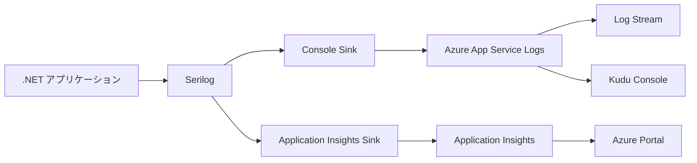

# Azure App Service ログ確認・管理ガイド

> **📅 作成日**: 2025年7月23日  
> **🎯 対象**: .NET Web API (Serilog使用)  
> **💻 環境**: Azure App Service

---

## 📋 目次
1. [Azure App Serviceでのログの仕組み](#azure-app-serviceでのログの仕組み)
2. [現在の構成でのログ出力](#現在の構成でのログ出力)
3. [ログの確認方法](#ログの確認方法)
4. [ローカルディスクへのログ出力](#ローカルディスクへのログ出力)
5. [推奨されるログ設定](#推奨されるログ設定)
6. [トラブルシューティング](#トラブルシューティング)

---

## 🔍 Azure App Serviceでのログの仕組み

### App Serviceの標準ログ機能

Azure App Serviceには以下のログ機能が標準で提供されています：

| ログの種類 | 説明 | 保存場所 | 保存期間 |
|-----------|------|----------|----------|
| **Application Logs** | アプリケーション内のログ出力 | Blob Storage / File System | 設定可能 |
| **Web Server Logs** | IISのアクセスログ | File System | 設定可能 |
| **Detailed Error Messages** | IISの詳細エラー | File System | 設定可能 |
| **Failed Request Tracing** | 失敗したリクエストの詳細 | File System | 設定可能 |

### Azure Monitor / Application Insights連携



---

## 📊 現在の構成でのログ出力

### 現在のSerilog設定確認

#### appsettings.json / appsettings.Production.json
```json
{
  "Serilog": {
    "Using": ["Serilog.Sinks.Console"],
    "WriteTo": [
      {
        "Name": "Console",
        "Args": {
          "outputTemplate": "[{Timestamp:HH:mm:ss} {Level:u3}] {Message:lj} {Properties:j}{NewLine}{Exception}"
        }
      }
    ]
  }
}
```

#### Program.csの設定
```csharp
// Azure App Service Logging
builder.Services.AddLogging(loggingBuilder =>
{
    loggingBuilder.AddAzureWebAppDiagnostics();
});

// Application Insights (環境変数対応)
var aiConnectionString = Environment.GetEnvironmentVariable("APPLICATIONINSIGHTS_CONNECTION_STRING");
if (!string.IsNullOrEmpty(aiConnectionString))
{
    builder.Services.AddApplicationInsightsTelemetry(options =>
    {
        options.ConnectionString = aiConnectionString;
    });
}
```

### 現在のログ出力先

1. **Console Sink** → Azure App Service Application Logs
2. **Azure Web App Diagnostics** → App Service の標準ログ
3. **Application Insights** → Azure Monitor (接続文字列が設定されている場合)

---

## 🔎 ログの確認方法

### 1. Azure Portal での確認 🔴

#### Log Stream (リアルタイム)
```
Azure Portal → App Service → 監視 → Log stream
```
- **メリット**: リアルタイムでログを確認可能
- **用途**: デバッグ、動作確認
- **制限**: 過去のログは見れない

#### App Service Logs
```
Azure Portal → App Service → 監視 → App Service logs
```

設定項目：
```
Application Logging (Filesystem): On
Level: Information
Application Logging (Blob): Off (または設定)
Web server logging: On
Detailed error messages: On
Failed request tracing: On
```

### 2. Kudu Console での確認 🟡

#### アクセス方法
```
https://<app-name>.scm.azurewebsites.net/
```

#### ログファイルの場所
```bash
# アプリケーションログ
/home/LogFiles/Application/

# Web サーバーログ
/home/LogFiles/http/RawLogs/

# 詳細エラー
/home/LogFiles/DetailedErrors/
```

### 3. Azure CLI での確認 🟢

```bash
# リアルタイムログストリーム
az webapp log tail --name <app-name> --resource-group <rg-name>

# ログファイルのダウンロード
az webapp log download --name <app-name> --resource-group <rg-name>
```

### 4. Application Insights での確認 🔴

```
Azure Portal → Application Insights → ログ
```

KQLクエリ例：
```kql
traces
| where timestamp > ago(1h)
| where severityLevel >= 2
| order by timestamp desc
```

---

## 💾 ローカルディスクへのログ出力

### 現状の制限事項

**❌ 現在の構成ではローカルディスクにログファイルは出力されていません**

理由：
1. Serilog設定でFile Sinkを使用していない
2. Console Sinkのみの設定

### ローカルディスクログ出力の設定方法

#### 1. NuGetパッケージの追加
```bash
dotnet add package Serilog.Sinks.File
```

#### 2. appsettings.json の更新
```json
{
  "Serilog": {
    "Using": ["Serilog.Sinks.Console", "Serilog.Sinks.File"],
    "WriteTo": [
      {
        "Name": "Console",
        "Args": {
          "outputTemplate": "[{Timestamp:HH:mm:ss} {Level:u3}] {Message:lj} {Properties:j}{NewLine}{Exception}"
        }
      },
      {
        "Name": "File",
        "Args": {
          "path": "/home/LogFiles/Application/app-.txt",
          "rollingInterval": "Day",
          "retainedFileCountLimit": 7,
          "outputTemplate": "[{Timestamp:yyyy-MM-dd HH:mm:ss.fff zzz} {Level:u3}] {Message:lj} {Properties:j}{NewLine}{Exception}"
        }
      }
    ]
  }
}
```

#### 3. Azure App Service での保存場所
```
/home/LogFiles/Application/app-20250723.txt
/home/LogFiles/Application/app-20250724.txt
...
```

---

## 🎯 推奨されるログ設定

### 1. 開発環境 vs 本番環境

#### 開発環境 (appsettings.Development.json)
```json
{
  "Serilog": {
    "WriteTo": [
      {
        "Name": "Console"
      },
      {
        "Name": "File",
        "Args": {
          "path": "logs/app-.txt",
          "rollingInterval": "Day"
        }
      }
    ]
  }
}
```

#### 本番環境 (appsettings.Production.json)
```json
{
  "Serilog": {
    "WriteTo": [
      {
        "Name": "Console"
      },
      {
        "Name": "File",
        "Args": {
          "path": "/home/LogFiles/Application/app-.txt",
          "rollingInterval": "Day",
          "retainedFileCountLimit": 30
        }
      },
      {
        "Name": "ApplicationInsights",
        "Args": {
          "connectionString": "#{APPLICATIONINSIGHTS_CONNECTION_STRING}#"
        }
      }
    ]
  }
}
```

### 2. 構成別の用途

| 出力先 | 用途 | メリット | デメリット |
|--------|------|----------|-----------|
| **Console** | デバッグ、リアルタイム監視 | 即座に確認可能 | 永続化されない |
| **File** | 詳細調査、ログ保存 | 永続化、詳細確認 | ディスク容量使用 |
| **Application Insights** | 運用監視、アラート | 高度な分析機能 | 設定が必要 |

---

## 🔧 トラブルシューティング

### よくある問題と解決方法

#### 1. ログが表示されない
**症状**: Log Stream でログが表示されない

**確認事項**:
- [ ] App Service Logs が有効になっているか
- [ ] Application Logging (Filesystem) が On になっているか
- [ ] Serilog の MinimumLevel が適切か

**解決方法**:
```bash
# Azure CLI でログ設定を確認
az webapp log config show --name <app-name> --resource-group <rg-name>

# ログ設定を有効化
az webapp log config --name <app-name> --resource-group <rg-name> \
  --application-logging filesystem \
  --level information
```

#### 2. Application Insights にログが送信されない
**症状**: Application Insights でログが確認できない

**確認事項**:
- [ ] APPLICATIONINSIGHTS_CONNECTION_STRING 環境変数が設定されているか
- [ ] Application Insights のインストルメンテーションキーが正しいか

**解決方法**:
```bash
# 環境変数の確認
az webapp config appsettings list --name <app-name> --resource-group <rg-name>

# 環境変数の設定
az webapp config appsettings set --name <app-name> --resource-group <rg-name> \
  --settings APPLICATIONINSIGHTS_CONNECTION_STRING="<connection-string>"
```

#### 3. ファイルログが作成されない
**症状**: /home/LogFiles/Application/ にログファイルが作成されない

**確認事項**:
- [ ] Serilog.Sinks.File パッケージがインストールされているか
- [ ] ファイルパスが正しいか (/home/LogFiles/Application/)
- [ ] ディスク容量に問題がないか

**解決方法**:
```bash
# Kudu Console でディレクトリ確認
ls -la /home/LogFiles/Application/

# ディスク使用量確認
df -h
```

### 4. パフォーマンス考慮事項

#### ログレベルの最適化
```json
{
  "Serilog": {
    "MinimumLevel": {
      "Default": "Information",
      "Override": {
        "Microsoft": "Warning",
        "Microsoft.EntityFrameworkCore": "Warning",
        "System": "Warning"
      }
    }
  }
}
```

#### ファイルローテーション設定
```json
{
  "Args": {
    "path": "/home/LogFiles/Application/app-.txt",
    "rollingInterval": "Day",
    "retainedFileCountLimit": 7,
    "fileSizeLimitBytes": 10485760
  }
}
```

---

## 📋 チェックリスト

### ログ設定確認
- [ ] App Service Logs が有効
- [ ] Serilog Console Sink 設定済み
- [ ] Application Insights 接続文字列設定済み
- [ ] ログレベルが適切に設定済み

### ログ確認方法
- [ ] Azure Portal Log Stream でリアルタイム確認可能
- [ ] Kudu Console でファイル確認可能
- [ ] Application Insights でログ検索可能
- [ ] Azure CLI でログ取得可能

### トラブルシューティング
- [ ] ログが表示されない場合の対処法を理解
- [ ] Application Insights 接続問題の対処法を理解
- [ ] ファイルログ問題の対処法を理解

---

## 📞 関連ドキュメント

- [Application Insights 技術ガイド](../backend/ShopifyTestApi/Documentation/ApplicationInsights-TechnicalGuide.md)
- [Azure App Service ログ機構](../backend/ShopifyTestApi/Documentation/AzureAppService-Logging-Mechanism.md)
- [ログクエリ集](../backend/ShopifyTestApi/Documentation/LogQueries.md)

---

*最終更新: 2025年7月23日* 